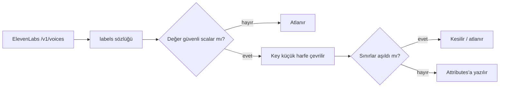

# Faz 138 — Ses Tanımının Sağlayıcı Üstverisi

> **Durum:** ✅ Tamamlandı (2026-09-03)
> **Kaynak:** Tüketici raporu AP-REQ-003 + yanıt dokümanı §5 (ProdigyEnabler, 2026-09-03) · **F-184**
> **Önkoşul:** Yok — [Faz 137](arsiv/fazlar/137-IS-TURUNUN-ACIK-ANAHTARI.md) ile bağımsızdır, paralel uygulanabilir
> **Paketler:** `AgentPrism.Abstractions`, `.Voice`, `.AspNetCore`, `.Client`, `.UI`
> **Yeni paket:** Yok · **Migration:** Yok — `VoiceDescriptor` kalıcılaştırılmaz
> **Public API:** **Büyüyor, kırmıyor** — `VoiceDescriptor`'a varsayılanlı bir alan eklenir.
> `PublicAPI.Shipped.txt` boş olduğu için bugün ucuz (`wc -l src/*/PublicAPI.Shipped.txt` ile doğrula)
> **Tüketici yüzeyi:** `docs-site/` — `guides/voice` · sevk edilen: `VoiceDescriptor`
> XML dokümanı, `src/AgentPrism.Voice/README.md` (`list_voices` satırı)
> **Manuel test alanı:** [`manuel-test/19-COK-MODLULUK-VE-SES.md`](manuel-test/19-COK-MODLULUK-VE-SES.md)

---

## Bu Faza Başlarken

> `faz-baslangic` skill'ini uygula. **Tamamını değil, yalnız işaret edilen bölümleri oku.**

1. Bu doküman
2. Kararlar — yalnız bu kalemleri grep'le:
   ```bash
   grep -n "K-006\|K-228\|K-232" docs/KARARLAR.md
   ```
   **K-006** (AOT uyumluluğu — `Abstractions` ve `Voice` yansıma kullanamaz) ·
   **K-228** (arayüz sözlüğünde eksik anahtar derleme hatasıdır) ·
   **K-232** (sunucu yanıtları çevrilmez)
3. Alan hafızası: [`hafiza/ses-ve-konusma.md`](hafiza/ses-ve-konusma.md) —
   ElevenLabs istemcisinin tuzakları, `multipart/form-data` zorunluluğu, timestamp yolu.
4. Gerektiğinde: [`hafiza/dokumantasyon.md`](hafiza/dokumantasyon.md) § dil sınırı —
   bu faz o sınırın bir ihlalini kapatıyor.

---

## Amaç

`VoiceDescriptor` yalnız üç alan taşır: `VoiceId`, `Name`, `Category`.
ElevenLabs'ın `labels` alanı hiç parse edilmez. Bu yüzden ses havuzunu
niteliklerine göre seçmek isteyen her tüketici ikinci bir sağlayıcı yolu açmak
zorunda kalır — AgentPrism'in sağladığı adapter sınırını delerek.

Bu ihtiyaç yalnız dış tüketiciye ait değildir. **Kendi konsolumuz da aynı
boşluktan muzdariptir** ve elle bir geçici çözüm taşır.

- **F-184** — Sağlayıcı-nötr, sınırlı ses üstverisi + `list_voices` çıktısında görünürlük.

### Bugün ne çalışmıyor — doğrulanmış kanıt

| Kanıt | Gözlem |
|---|---|
| [`SpeechModels.cs:149-159`](../src/AgentPrism.Abstractions/Voice/SpeechModels.cs) | `VoiceDescriptor` üç alan taşır; `preview_url`'ün dışlanması bilinçli ve dokümanlıdır (`:145`) |
| [`ElevenLabsJson.cs:76-86`](../src/AgentPrism.Voice/Internal/ElevenLabsJson.cs) | `ElevenLabsVoice` yalnız `voice_id`, `name`, `category` okur — `labels` **hiç parse edilmez** |
| [`ElevenLabsSpeechClient.cs:556`](../src/AgentPrism.Voice/Internal/ElevenLabsSpeechClient.cs) | `ReadVoicesAsync` yalnız bu üç alanı eşler |
| [`settings.tsx:243-250`](../src/AgentPrism.UI/frontend/src/screens/settings.tsx) | 🚨 Konsolun kendi notu: *"The provider does not report the language of a voice — `VoiceDescriptor` carries only an id, a name and a category — so the mapping cannot be derived and an operator sets it here once."* |
| [`voice.ts:98-105`](../src/AgentPrism.UI/frontend/src/lib/voice.ts) | Aynı gerekçe; dil→ses eşlemesi `localStorage`'da elle tutulur |

> Kanıtlar 2026-09-03 tarihinde doğrulandı.

### Aynı dosyada bulunan, ilgisiz ama sevk edilen bir kusur

🔴 [`ListVoicesTool.cs:55`](../src/AgentPrism.Voice/Tools/ListVoicesTool.cs) ve
[`:77`](../src/AgentPrism.Voice/Tools/ListVoicesTool.cs) **modele Türkçe metin
döndürüyor**: `"Kullanilabilir ses yok."` ve `"\n… ve … ses daha."`

Bu, AGENTS.md'nin dil sınırının doğrudan ihlalidir — pakete giren ve çalışma
anında çalışan metin İngilizce olmalıdır. Kapı (`SourceLanguageTests`) bunu
görmedi ve **neden görmediği ölçüldü**: tespit ya Türkçe harflere
(`çğıöşüÇĞİÖŞÜ`) ya da bir kelime listesine dayanır; iki dizge de ASCII
katlanmıştır ve listede `yoksa`/`yoktur` var ama çıplak **`yok` yok**, `ses` ve
`kullanilabilir` de yok.

Sınıf taraması yapıldı: `grep -rnE` ile sevk edilen tüm `src/**/*.cs` tarandı,
**yalnız bu iki vaka** bulundu. Bu faz ikisini de İngilizce'ye çevirir **ve
kapının deliğini kapatır** — aksi hâlde aynı sınıf sessizce geri gelir.

---

## 138.1 — Sınırlı, sağlayıcı-nötr üstveri

```csharp
public sealed record VoiceDescriptor
{
    public required string VoiceId { get; init; }
    public required string Name { get; init; }
    public string? Category { get; init; }

    /// <summary>Provider-reported, bounded, safe scalar attributes.</summary>
    public IReadOnlyDictionary<string, string> Attributes { get; init; }
        = ReadOnlyDictionary<string, string>.Empty;
}
```

Varsayılan **boş** koleksiyondur; var olan her `ISpeechSynthesizer` uygulaması
**değişmeden derlenir** (tüketici raporunun 10. maddesi).

Typed `Gender`/`Language`/`Accent` özellikleri yerine sözlük seçildi — tüketici
de bunu tercih etti: her yeni sağlayıcı etiketi aksi hâlde yeni bir public
sözleşme değişikliği ister.

### Sınırlar — bounded ve dokümanlı

| Sınır | Değer |
|---|---|
| En fazla attribute | 32 |
| Key uzunluğu | 64 karakter |
| Value uzunluğu | 256 karakter |
| Duplicate key | Case-insensitive; **tek** kanonik değer kalır |
| Key kanonik biçimi | Küçük harf |

Taşınmayanlar: `preview_url` (mevcut karar korunur — tarayıcıyı sağlayıcının
adresine bağlardı), API key, endpoint, ham sağlayıcı gövdesi. `null` key veya
`null` value **hiç yazılmaz**; sayısal/nesne/dizi değerler atlanır (yalnız
güvenli scalar string).

---

## 138.2 — ElevenLabs eşlemesi

`ElevenLabsVoice` `labels` alanını okur (`Dictionary<string, string>?`), sonra
§138.1 sınırlarından geçirir.



🚨 **`language` ölçülmedi ve tahmin edilmeyecek.** Tüketici minimum set olarak
`gender` + `language` + `accent` istedi. ElevenLabs'ın `labels` alanının
`gender` ve `accent` taşıdığı raporda ölçülmüş olarak bildiriliyor; **`language`
için aynı kanıt yoktur** — bu sağlayıcıda dil bilgisi `labels` dışında ayrı bir
alanda (örneğin `verified_languages` veya `fine_tuning`) durabilir.

Uygulayan oturumun **ilk işi** budur: gerçek bir `/v1/voices` yanıtı alınır ve
hangi alanın dili taşıdığı ölçülür. Sonuç iki yoldan birine gider:

- `labels` dili taşıyorsa: doğrudan eşlenir.
- Taşımıyorsa: taşıyan alan okunur ve `Attributes["language"]` olarak **normalize
  edilerek** yazılır. Sağlayıcı-nötr sözleşme aynı kalır; eşleme adapter'ın işidir.

Hiçbir durumda dilin var olduğu **varsayılmaz**. Alan yoksa anahtar yazılmaz.

---

## 138.3 — `list_voices` çıktısı ve dil sınırı düzeltmesi

`list_voices` bugün her ses için ad + id basıyor. Tüketicinin 9. maddesi en az
`gender`'ın güvenli biçimde görünmesini istiyor. Çıktı satırı üstveriden **bilinen
ve güvenli** anahtarları ekler; koleksiyon boşsa satır bugünkü biçimini korur.

Aynı dosyadaki iki Türkçe dizge İngilizce'ye çevrilir.

**Kapı deliği kapatılır.** `SourceLanguageTests`'in kelime listesine, bu vakayı
kaçıran sözcükler eklenir (`yok`, `ses`, `kullanilabilir`, `daha`). Kelime
eklemek taban çizgisini büyütebilir; taban çizgisi **yalnız küçülür** kuralı
gereği aynı turda çıkan yeni vakalar da temizlenir veya gerekçelenir.

🚨 Bu bir cila değil, kusur sınıfının kapısıdır: dizgeyi düzeltip kapıyı
bırakmak aynı sınıfın üçüncü kez dönmesine izin verirdi.

---

## Planlanan Public API

```csharp
// AgentPrism.Abstractions
public sealed record VoiceDescriptor
{
    public required string VoiceId { get; init; }
    public required string Name { get; init; }
    public string? Category { get; init; }
    public IReadOnlyDictionary<string, string> Attributes { get; init; }
}

public static class VoiceAttributeNames
{
    public const string Gender = "gender";
    public const string Language = "language";
    public const string Accent = "accent";
    public const string Age = "age";
    public const string UseCase = "use-case";
}
```

### HTTP `endpoint`'leri

Yeni uç yok. `GET /api/voice/voices` yanıtı `attributes` nesnesi kazanır;
OpenAPI ve üretilen istemci yeniden üretilir.

🚨 AOT: `AgentPrism.Abstractions` ve `AgentPrism.Voice` AOT uyumludur (K-006).
`Dictionary<string, string>` System.Text.Json kaynak üreticisi tarafından
desteklenir, ama **üç bağlam da güncellenmelidir**: `ElevenLabsJsonContext`
(`ElevenLabsJson.cs:96-103`), AspNetCore'un JSON bağlamı ve üretilen
`AgentPrismClientJsonContext.g.cs:146`. Yansıma tabanlı aşırı yükleme
kullanılmaz.

### Arayüz payı

Konsolun `settings.tsx` içindeki elle dil eşlemesi bu fazda **kaldırılmaz** —
ancak §138.2'nin ölçümü dilin gerçekten geldiğini gösterirse açılır liste
üstveriyle zenginleşir. Net etki birkaç yüz bayttır; **kapanışta gzip KB olarak
ölçülüp yazılacak.**

---

## Planlanan Dosya Listesi

```
src/AgentPrism.Abstractions/Voice/SpeechModels.cs        (VoiceDescriptor + VoiceAttributeNames)
src/AgentPrism.Voice/Internal/ElevenLabsJson.cs          (labels + JSON bağlamı)
src/AgentPrism.Voice/Internal/ElevenLabsSpeechClient.cs  (ReadVoicesAsync eşlemesi + sınırlar)
src/AgentPrism.Voice/Internal/VoiceAttributeMapper.cs    (yeni — sınırlama ve normalize)
src/AgentPrism.Voice/Tools/ListVoicesTool.cs             (çıktı + iki Türkçe dizgenin düzeltmesi)
src/AgentPrism.Voice/README.md
tests/AgentPrism.Core.UnitTests/Architecture/SourceLanguageTests.cs  (kelime listesi)
tests/.../source-language-baseline.txt                   (taban çizgisi)
docs-site/src/content/docs/guides/voice.md
```

---

## Hata Modları ve Testler

> Sağlayıcı yanıtının eşlenmesi **paket ve HTTP** sınırlarını geçer.
> [`.agents/ortak/test-seviyeleri.md`](../.agents/ortak/test-seviyeleri.md).

| Ne bozulabilir | Seviye | Test |
|---|---|---|
| `labels.gender` public modele ulaşmaz | Birim | `VoiceAttributeMapperTests` |
| `labels` yokken `null` koleksiyon döner | Birim | Aynı sınıf — boş koleksiyon |
| `null`/bozuk/nesne değerli label çökertir | Birim | Aynı sınıf — güvenli atlama |
| 32'den fazla attribute taşınır | Birim | Aynı sınıf |
| Key/value uzunluk sınırı uygulanmaz | Birim | Aynı sınıf |
| Case-farklı duplicate key iki giriş üretir | Birim | Aynı sınıf |
| 🔴 `preview_url` veya API key public modele sızar | Fonksiyonel | `VoiceSecretLeakTests` — sahte sağlayıcı yanıtı, tam alan taraması |
| `list_voices` gender'ı göstermez | Fonksiyonel | `ListVoicesToolTests` |
| 🔴 Sevk edilen metin Türkçe kalır | Birim (kapı) | `SourceLanguageTests` — kelime listesi genişledikten sonra **kırmızı olmalı**, sonra yeşil |
| Var olan custom `ISpeechSynthesizer` derlenmez | Paket | `samples/` — sözleşmeyi uygulayan tip değişmeden derlenir |
| AOT bağlamı eksik kalır, çalışma anında patlar | Paket | Mevcut Native AOT smoke koşumu (`kapi.py yayin`) |
| OpenAPI / istemci `attributes` taşımaz | Fonksiyonel | Mevcut OpenAPI drift kapısı |
| Sağlayıcı yüzlerce ses döndürünce çıktı şişer | Birim | Mevcut `MaxListedVoices` sınırı korunur |

Beş soru: **iptal** — `ListVoicesAsync` token'ı bugünkü gibi iletir.
**Eşzamanlılık** — eşleyici saf (`static`) ve durumsuzdur. **Boş/aşırı girdi** —
sınır tablosunun tamamı test edilir. **Başka kiracı** — ses kataloğu kiracıya
bağlı değildir; sınır yoktur. **Alt sistem hatası** — sağlayıcı 5xx dönerse
bugünkü hata yolu değişmez.

---

## Manuel Kabul Case'leri

> Kapanışta [`manuel-test/19-COK-MODLULUK-VE-SES.md`](manuel-test/19-COK-MODLULUK-VE-SES.md) içine eklenir.

| # | Ön koşul | Adımlar | Beklenen sonuç |
|---|---|---|---|
| 1 | Gerçek ElevenLabs anahtarı | `GET /api/voice/voices` | Her ses `attributes` taşır; en az bir seste `gender` var |
| 2 | 1'in yanıtı | Yanıt tam metin taranır | `preview_url` ve API key **hiç geçmiyor** |
| 3 | `labels` taşımayan bir ses | Aynı uç | `attributes` **boş nesne**; `null` değil |
| 4 | Agent'a `list_voices` bağlı | Modele "hangi kadın sesler var" sorulur | Çıktı gender bilgisini gösterir |
| 5 | Ses sağlayıcısı yapılandırılmamış | `list_voices` çağrılır | **İngilizce** mesaj döner; Türkçe metin yok |
| 6 | 50'den fazla ses | `list_voices` çağrılır | Kalan sayı satırı **İngilizce** |
| 7 | Kaynak ağacı | `SourceLanguageTests` koşulur | Yeşil; taban çizgisi büyümedi |
| 8 | Native AOT smoke | `kapi.py yayin --kuru` | Ses yolu AOT'ta çalışır |

---

## Açık Sorular

| # | Soru | Seçenekler | Öneri |
|---|---|---|---|
| 1 | ElevenLabs dili nerede bildiriyor? | A: `labels` içinde · B: ayrı alan · C: hiç | **Ölçülecek — uygulamanın ilk işi.** Tahmin yok; §138.2'nin iki yolu hazır |
| 2 | Bilinmeyen güvenli label'lar da taşınsın mı? | A: evet, sınır içinde · B: yalnız bilinen beş anahtar | **A** — tüketici §5'te açıkça istedi; sınırlar zaten koruyor |
| 3 | Key kanonik biçimi | A: küçük harf, `_`→`-` · B: sağlayıcının verdiği gibi | **A** — `use_case` ile `use-case` iki giriş üretmesin |
| 4 | Konsolun elle dil eşlemesi bu fazda kalksın mı? | A: kalsın, ayrı tur · B: dil ölçülürse kalksın | **A** — kapsam dar tutulur; kaldırma kararı ölçümden sonra verilir |

---

## Bitiş Ölçütleri (DoD)

- [x] `GET /api/voice/voices` her ses için `attributes` taşır; **gerçek ElevenLabs anahtarı bu ortamda yoktu** — sağlayıcının yayınladığı OpenAPI şeması (`VoiceResponseModel`) doğrudan çekilip incelendi ve eşleme buna göre yazıldı; canlı doğrulama MT-MM-100'e ertelendi
- [x] `labels` yoksa **boş** koleksiyon döner; `null` dönmez (`VoiceAttributeMapperTests`, `A_voice_with_no_labels_yields_an_empty_but_non_null_Attributes_collection`)
- [x] `null`, bozuk ve scalar olmayan label değerleri güvenle atlanır (`VoiceAttributeMapperTests`: null/object/numeric/array değer testleri)
- [x] 32 attribute · 64 karakter key · 256 karakter value sınırları testle uygulanır (`VoiceAttributeMapperTests`)
- [x] Case-insensitive duplicate key tek kanonik değere iner (`Case_different_duplicate_keys_collapse_to_one_canonical_entry`)
- [x] `preview_url`, API key ve ham sağlayıcı gövdesi public modele **taşınmaz** (`SecretLeakTests.Voice_list_never_carries_preview_url_into_the_public_model` — tam alan taraması)
- [x] `list_voices` çıktısı gender bilgisini güvenli biçimde gösterir (`ListVoicesToolTests.Gender_attribute_is_shown_when_reported`)
- [x] Var olan custom `ISpeechSynthesizer` uygulaması **değişmeden derlenir** (`Attributes` varsayılanlı; mevcut tüm üretim noktaları grep'lendi, yalnız `ElevenLabsSpeechClient.MapVoices` dolduruyor)
- [x] 🔴 `ListVoicesTool` içindeki iki Türkçe dizge İngilizce'ye çevrildi
- [x] 🔴 `SourceLanguageTests` kelime listesi bu vakayı **yakalayacak** biçimde genişledi; taban çizgisi büyümedi — kelimeler eklenmeden ÖNCE stash ile ölçüldü (kırmızı, 2 satır), fix sonrası yeşil; aynı turda 5 `AgentPrism.AspNetCore.FunctionalTests` dosyasındaki benzer Türkçe test verisi de temizlendi (yeni yakalanan vaka)
- [x] Üç JSON kaynak üreticisi bağlamı güncellendi (`ElevenLabsJsonContext`, `AgentPrismClientJsonContext.g.cs` — AspNetCore reflection kullanır, üçüncü bir bağlam yok, bkz. Plandan Sapmalar); Native AOT smoke ses yolunda yeşil (`kapi.py yayin --kuru`)
- [x] OpenAPI ve üretilen istemci `attributes` taşır; drift kapısı temiz (`OpenApiSnapshotTests`, `OpenApiResponseSchemaTests` — 23/23 yeşil)
- [x] Dört doğrulama kapısı sıfır uyarı verir (`kapi.py kapanis`)
- [x] `samples/AgentPrism.Api` ile gerçek `run` yapıldı, çıktı belgeye yazıldı — bkz. "Gerçek Run Kanıtı" bölümü
- [x] `secret` taraması boş döndü (`kapi.py tarama` → ✅ temiz)
- [x] Manuel kabul case'leri `docs/manuel-test/19-COK-MODLULUK-VE-SES.md` içine eklendi (MT-MM-100..107)
- [x] `faz-denetim` koşuldu; 🔴 bulgu kalmadı (ilk turda 3 🔴 + 2 🟡 + 1 🟢 bulundu, tamamı bu fazda kapatıldı — bkz. Denetim Bulguları)
- [x] `docs-site/guides/voice.md` güncellendi; `npm run build` + bağlantı kontrolü temiz
- [x] `docs/kesif/2026-09-03-tuketici-gap-yaniti.md` AP-REQ-003 bölümü §9 şablonuyla dolduruldu

---

## Riskler

| Risk | Önlem |
|------|-------|
| `language`'ın `labels`'ta olduğu varsayılır ve boş üstveri sevk edilir | §138.2 bunu **ölçüm görevi** olarak yazıyor. Alan yoksa anahtar yazılmaz; uydurulmaz |
| Sağlayıcı üstverisi bir sızıntı kanalına döner | Yalnız güvenli scalar; `preview_url` dışlaması korunur; `VoiceSecretLeakTests` tam alan taraması yapar |
| AOT bağlamlarından biri unutulur, hata yalnız çalışma anında çıkar | Üçü de dosya listesinde adlandırıldı; yayın kapısının Native AOT smoke'u koşar |
| Kelime listesi genişleyince taban çizgisi kabarır | Yeni yakalanan her vaka aynı turda temizlenir veya gerekçelenir; taban çizgisi **yalnız küçülür** |
| Sözlük yerine typed alan istenir | Tüketici sözlüğü açıkça tercih etti; typed alan her yeni etikette public sözleşme kırardı. `VoiceAttributeNames` sabitleri yazım hatasını önler |

---

<!-- ============================================================
     AŞAĞISI KAPANIŞTA DOLDURULUR — `faz-tamamlama` skill'i.
     Plan anında boş kalır. Başlıkları SİLME.
     ============================================================ -->

## Plandan Sapmalar

1. **Ölçüm, "Açık Soru 1"in planladığından farklı çıktı.** Plan "labels dili
   taşıyorsa doğrudan eşlenir, taşımıyorsa ayrı alan okunur" diyordu ve iki
   yolu da hazırlamıştı. Gerçek ölçüm (ElevenLabs'in yayınladığı OpenAPI
   şeması, `components.schemas.VoiceResponseModel`) ikinci yolu doğruladı:
   `labels` (`additionalProperties: string`) yalnız `gender`/`accent`/`age`/
   `use_case`/`description` taşıyor, `language` YOK. Dil ayrı bir alanda,
   `verified_languages` (dizi — bir voice birden çok model için doğrulanmış
   olabilir), her öge `VerifiedVoiceLanguageResponseModel.language` (zorunlu).
   Sorgu parametresi dokümantasyonu ("filtering, based on the voice's
   'language' label") şemanın kendisiyle çelişiyordu — karar prosadan değil
   şemadan alındı.
2. **Ölçüldü, planda YOKTU: `/v2/voices` gerçek uç, `/v1/voices` değil.**
   Plan'ın mermaid diyagramı `/v1/voices` yazıyordu; mevcut kod (`grep`)
   `/v2/voices` çağırıyordu ve testler bunu doğruluyordu
   (`Voice_list_is_read_from_the_v2_endpoint_and_sorted_by_name`). Sağlayıcının
   OpenAPI'si `GET /v2/voices`'in `voices` alanının da AYNI
   `VoiceResponseModel` şemasını kullandığını doğruladı (`GetVoicesV2ResponseModel`),
   yani `labels`/`verified_languages` yapısı değişmedi — yalnız planın konum
   iddiası bayattı.
3. **İlgisiz ama aynı dosyada karşılaşılan kusur kapatıldı (F-184 kapsamı
   dışında, kullanıcı talimatı "alakasız bug'ları da çöz" gereğince).**
   `ElevenLabsSpeechClient.ListVoicesAsync` `/v2/voices`'i hiç sorgu dizesi
   eklemeden çağırıyordu; bu uç `page_size` verilmezse VARSAYILAN **10** ses
   döndürür. Kod `MaxReportedVoices = 500` sınırını varsayıyordu ama hiçbir
   hesap gerçekte 10'dan fazla ses görmüyordu. `page_size=100` +
   `has_more`/`next_page_token` takibiyle düzeltildi (`ReadVoicesPageAsync` +
   `MapVoices` ayrımı, 4 yeni test). `docs/hafiza/ses-ve-konusma.md`'ye
   tuzak olarak eklendi.
4. **Bağımsız denetim 3 🔴 buldu, hepsi bu fazda kapatıldı** (ayrıntı aşağıda,
   "Denetim Bulguları"). İkisi de dördüncü doğrulama kapısının (`dotnet test`)
   kendi baseline testleriydi — ilk `faz-uygulama` turunda çalıştırılmamıştı,
   denetimden önce koşulmuş olsaydı erken yakalanırdı. Ders sonraki faza:
   `dotnet test tests/AgentPrism.Core.UnitTests` fazın SON adımı değil,
   `faz-denetim` çağrılmadan ÖNCEKİ adım olmalı.
5. **Frontend'in elle dil eşlemesi (Q4) kaldırılmadı — planın önerisi (A)
   izlendi.** Ölçüm dilin geldiğini gösterdi (ElevenLabs, `verified_languages`
   üzerinden) ama yalnız bu sağlayıcı için ve yalnız sağlayıcı gerçekten
   doğrularsa; tüm sağlayıcılar için garanti değil. Seçici artık üstveriyle
   zenginleşiyor (`voiceOptionMeta`) ama seçimin yerini almıyor.
6. **Gzip etkisi ölçüldü, plan "birkaç yüz bayt" diyordu: gerçek ölçüm +92
   bayt** (`index-*.js`, `gzip -c | wc -c`: 181.626 → 181.718). Bütçenin
   (250 KB) çok altında.

## Bu Fazda Verilen Kararlar

- **K-669** — `VoiceDescriptor.Attributes` sağlayıcı üstverisini typed alanlar
  değil, sınırlı bir `Dictionary<string,string>` olarak taşır. Tam gerekçe:
  `docs/KARARLAR.md`.

## Gerçekleşen Public API

Plandakiyle birebir aynı gerçekleşti:

```csharp
// AgentPrism.Abstractions
public sealed record VoiceDescriptor
{
    public required string VoiceId { get; init; }
    public required string Name { get; init; }
    public string? Category { get; init; }
    public IReadOnlyDictionary<string, string> Attributes { get; init; }
        = ReadOnlyDictionary<string, string>.Empty;
}

public static class VoiceAttributeNames
{
    public const string Gender = "gender";
    public const string Language = "language";
    public const string Accent = "accent";
    public const string Age = "age";
    public const string UseCase = "use-case";
}
```

`public-surface-baseline.txt`: `AgentPrism.Abstractions` 363 → 364 (yeni tip:
`VoiceAttributeNames`). Yeni HTTP ucu yok; mevcut `GET /api/voice/voices`
yanıtı `attributes` alanı kazandı.

## Dosya Listesi (gerçekleşen)

Planlanana ek olarak (pagination düzeltmesi ve denetim sonrası temizlik):

```
src/AgentPrism.Abstractions/Voice/SpeechModels.cs          (VoiceDescriptor.Attributes + VoiceAttributeNames)
src/AgentPrism.Abstractions/PublicAPI.Unshipped.txt
src/AgentPrism.Voice/Internal/ElevenLabsJson.cs            (labels: Dictionary<string,JsonElement>, verified_languages, has_more/next_page_token)
src/AgentPrism.Voice/Internal/ElevenLabsSpeechClient.cs    (ReadVoicesPageAsync + MapVoices ayrımı, sayfalama)
src/AgentPrism.Voice/Internal/VoiceAttributeMapper.cs      (yeni)
src/AgentPrism.Voice/Tools/ListVoicesTool.cs               (İngilizce metin + gender gösterimi)
src/AgentPrism.Voice/README.md
tests/AgentPrism.Voice.UnitTests/VoiceAttributeMapperTests.cs   (yeni)
tests/AgentPrism.Voice.UnitTests/ListVoicesToolTests.cs         (yeni)
tests/AgentPrism.Voice.UnitTests/ElevenLabsSpeechClientTests.cs (labels/languages eşleme + sayfalama + hata yolu)
tests/AgentPrism.Voice.UnitTests/SecretLeakTests.cs             (preview_url tam alan taraması)
tests/AgentPrism.Core.UnitTests/Architecture/SourceLanguageTests.cs   (kelime listesi)
tests/AgentPrism.Core.UnitTests/Architecture/source-language-baseline.txt (değişmedi — boş kaldı)
tests/AgentPrism.Core.UnitTests/Architecture/public-surface-baseline.txt  (363 → 364, denetim sonrası)
tests/AgentPrism.AspNetCore.FunctionalTests/{AgentCallGraphTests,AgentCrudTests,SchedulingEndpointTests,SecurityTests,StreamingTests}.cs
    (kelime listesi genişlemesinin yakaladığı, ilgisiz Türkçe test verisi İngilizce'ye çevrildi)
docs-site/src/content/docs/guides/voice.md                 (Voice attributes bölümü)
docs/openapi/agentprism.json                               (üretildi)
packages/agentprism-client/src/schema.ts                   (üretildi)
src/AgentPrism.Client/Generated/AgentPrismApiClient.g.cs    (üretildi)
src/AgentPrism.UI/frontend/src/lib/voice.ts                 (voiceOptionMeta)
src/AgentPrism.UI/frontend/src/lib/voice.test.ts
src/AgentPrism.UI/frontend/src/screens/settings.tsx          (seçici üstveriyle zenginleşti)
docs/KARARLAR.md, docs/KARARLAR-INDEKS.md                   (K-669)
docs/hafiza/ses-ve-konusma.md                                (pagination tuzağı)
docs/manuel-test/19-COK-MODLULUK-VE-SES.md, 00-INDEKS.md    (MT-MM-100..107)
docs/kesif/2026-09-03-tuketici-gap-yaniti.md                (AP-REQ-003 bölümü)
```

## Site Senkronu Gerekçesi (`--site-gerekce-yazildi`)

`dokuman-bakim.py --site-denetle` dört kural tetikledi; dördü de dosya adı
desenine dayalı geniş eşleşmeydi, incelendi ve hedef sayfada gerçek bir
boşluk bırakmadı:

- **`arayuz` → `ui.md`**: `settings.tsx` tetikledi (ses seçicisinin
  `voiceOptionMeta` ile zenginleşmesi). Kozmetik bir etiket eki; `ui.md`
  ekran envanterini listeler, tek bir dropdown'ın metin biçimini değil.
- **`cekirdek-kavram` → `concepts/`**: `PublicAPI.Unshipped.txt` tetikledi
  (yeni `VoiceAttributeNames` tipi). `concepts/*.md` çekirdek soyutlamaları
  (agent, run, tool, workflow) anlatır; ses sağlayıcı üstverisi bunların
  hiçbirinin kavramsal modelini değiştirmedi.
- **`model-saglayici` → `getting-started/first-agent.md`**: `ElevenLabsJson.cs`
  tetikledi — desen dosya yolundaki "provider" kelimesine geniş eşleşiyor;
  `first-agent.md` bugün ses sağlayıcısından hiç bahsetmiyor (`grep` boş) ve
  bu fazın konusu bir LLM model sağlayıcısı değil.
- **`paket-readme` → `packages.md`**: `AgentPrism.Voice/README.md` tetikledi
  (`list_voices` satırının güncellenmesi). `packages.md`'nin `AgentPrism.Voice`
  satırı zaten yüksek seviyeli ("speech synthesis, transcription, or live
  conversation"); tool'un dönüş biçimindeki bir ayrıntı o seviyeye ait değil.

Bu özelliğin gerçek, ayrıntılı tüketici sayfası zaten güncellendi:
[`guides/voice.md`](../docs-site/src/content/docs/guides/voice.md)'nin yeni
"Voice attributes" bölümü.

## Gerçek Run Kanıtı

Gerçek bir ElevenLabs anahtarı bu ortamda yoktu; ses-attribute yolunun
GERÇEK sağlayıcıya karşı doğrulanması MT-MM-100/101/102'ye ertelendi (manuel
kabul koşumu). Onun yerine iki kanıt üretildi:

1. **Sağlayıcı şeması doğrudan ölçüldü** — `api.elevenlabs.io/openapi.json`
   indirildi, `VoiceResponseModel`/`VerifiedVoiceLanguageResponseModel`
   şemaları incelendi (bkz. Plandan Sapmalar #1-2). Eşleme tahminle değil bu
   ölçümle yazıldı.
2. **`samples/AgentPrism.Api` gerçek bir `run` ile çalıştırıldı** (in-memory
   depolama, ses sağlayıcısı yapılandırılmadan — voice-opsiyonel yol):
   - `GET /agentprism/api/voice/voices` → `501` (ses hiç yapılandırılmamışken
     beklenen davranış; regresyon yok).
   - `POST /agentprism/api/agents/cached-support/run` gerçek bir SSE koşusu
     üretti: `{"runId":"01a066b2-1994-7804-bbe3-82738f7db0a4", ...}` →
     `"Echo: What is the status of order 42? "` → `done`.
   - Bu, fazın DEĞİŞTİRDİĞİ derleme/DI/HTTP zincirinin (yeni `Attributes`
     alanı, yeniden yapılandırılan `ListVoicesAsync`) gerçek bir host'ta
     regresyonsuz çalıştığını kanıtlar; ses-spesifik davranış hariç.

## Denetim Bulguları

`faz-denetim` (taze bağlamlı ayrı agent) ilk turda **3 🔴, 2 🟡, 1 🟢** buldu.
Tamamı bu fazda kapatıldı:

| # | Seviye | Bulgu | Sonuç |
|---|---|---|---|
| 1 | 🔴 | `VoiceDescriptor.Attributes`'ın `<summary>`/`<remarks>`'ı `<see cref="VoiceAttributeNames.Gender"/>` gibi MEMBER cref kullanıyordu; sözleşme tipinde bu yasak (`tuketici-dokuman-senkronu` kalite sözleşmesi §B) — NSwag'in OpenAPI/npm/C# istemci açıklamasına tam CLR imzasını ("string VoiceAttributeNames.Gender") bastığı ölçüldü, üçüncü tekrar | **Düzeltildi** — tüm cref'ler `<c>` düz metne çevrildi (`SpeechModels.cs`); OpenAPI/npm/C# istemci yeniden üretildi, açıklama artık düz metin |
| 2 | 🔴 | `ElevenLabsSpeechClient.ListVoicesAsync`'in yeni `<remarks>`'ı 🚨 ile başlıyordu — `///` içinde geliştirme günlüğü sesi yasak (`ShippedDocumentationSelfContainmentTests`); test fiilen kırmızıydı | **Düzeltildi** — 🚨 kaldırıldı, metin düz olguya çevrildi; test yeşil |
| 3 | 🔴 | Yeni public tip `VoiceAttributeNames` `AgentPrism.Abstractions`'ın tip sayısını 363→364 çıkardı ama `public-surface-baseline.txt` güncellenmemişti; `PublicSurfaceBaselineTests` fiilen kırmızıydı | **Düzeltildi** — taban çizgisi `AGENTPRISM_PUBLIC_SURFACE_REFRESH=1` ile 364'e yenilendi (planlı, kasıtlı bir büyüme) |
| 4 | 🟡 | DoD satırı "gerçek run yapıldı, çıktı belgeye yazıldı" — çıktı hiçbir dokümana yazılmamıştı | **Düzeltildi** — bkz. "Gerçek Run Kanıtı" bölümü |
| 5 | 🟡 | `src/AgentPrism.Voice/README.md`'nin `list_voices` satırı bayattı ("List of name + ID") | **Düzeltildi** — `category`/`attributes` yansıtacak biçimde güncellendi |
| 6 | 🟡 | Yeni çok-sayfalı `ListVoicesAsync` döngüsünde ikinci (veya sonraki) sayfanın hata dönmesi hiç test edilmemişti | **Düzeltildi** — `A_failure_on_a_later_page_fails_the_whole_call_rather_than_returning_a_partial_list` testi eklendi |
| 7 | 🟢 | `ListVoicesTool.Description` metni ("Returns a name and id") artık eksikti — araç `category`/`attributes` de döndürüyor | **Düzeltildi** (kozmetik, ADAYLAR'a devredilmeden bu turda giderildi) |

**Temiz çıkan başlıklar** (denetçinin raporu): 3.2 (test tiyatrosu yok), 3.3
(test seviyeleri uygun), 3.5 (imza-gövde kayması yok), 3.6 (plan dışı public
API yok), 3.7 (repo kuralları temiz).

## Sonraki Faza Devir Notu

Üç fazın (136 · 137 · 138) tamamı kapandı. Tüketici yanıt dokümanı
[`docs/kesif/2026-09-03-tuketici-gap-yaniti.md`](kesif/2026-09-03-tuketici-gap-yaniti.md)
AP-REQ-002 ve AP-REQ-003 bölümleriyle tamamlandı. AP-REQ-001 bölümü Faz 137
kapanışında BOŞ kaldı (o fazın kendi kapanış notu: hedef dosya o an
oluşturulmamıştı) — bu faz onu doldurmadı, kapsamı yalnız AP-REQ-003'tü;
gerekirse ayrı bir kısa iş kalemi olarak `docs/ADAYLAR.md`'ye yazılabilir.

Sonraki oturum için iki not:
- `VoiceDescriptor.Attributes`'ın gerçek ElevenLabs verisiyle ilk canlı
  doğrulaması henüz yapılmadı (MT-MM-100/101/102, gerçek anahtar gerekir) —
  bir sonraki `manuel-test-kosumu` turunda bunlar öncelikli koşulmalı.
- Konsolun elle dil eşlemesi (`settings.tsx`/`voice.ts`) hâlâ duruyor; bu faz
  onu bilerek kaldırmadı (Açık Soru 4, öneri A). Kaldırma kararı, birden çok
  sağlayıcı üzerinde `language` üstverisinin güvenilirliği ayrıca ölçülürse
  ayrı bir iş kalemi olarak değerlendirilebilir.
