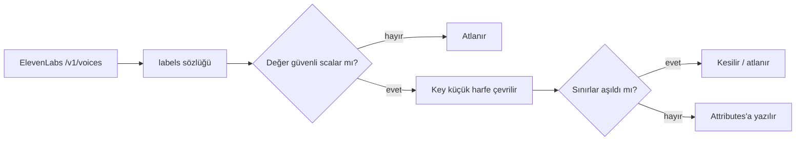

# Faz 138 — Ses Tanımının Sağlayıcı Üstverisi

> **Durum:** 📋 Planlandı (2026-09-03)
> **Kaynak:** Tüketici raporu AP-REQ-003 + yanıt dokümanı §5 (ProdigyEnabler, 2026-09-03) · **F-184**
> **Önkoşul:** Yok — [Faz 137](arsiv/fazlar/137-IS-TURUNUN-ACIK-ANAHTARI.md) ile bağımsızdır, paralel uygulanabilir
> **Paketler:** `AgentPrism.Abstractions`, `.Voice`, `.AspNetCore`, `.Client`, `.UI`
> **Yeni paket:** Yok · **Migration:** Yok — `VoiceDescriptor` kalıcılaştırılmaz
> **Public API:** **Büyüyor, kırmıyor** — `VoiceDescriptor`'a varsayılanlı bir alan eklenir.
> `PublicAPI.Shipped.txt` boş olduğu için bugün ucuz (`wc -l src/*/PublicAPI.Shipped.txt` ile doğrula)
> **Tüketici yüzeyi:** `docs-site/` — `guides/voice` · sevk edilen: `VoiceDescriptor`
> XML dokümanı, `src/AgentPrism.Voice/README.md` (`list_voices` satırı)
> **Manuel test alanı:** [`manuel-test/19-COK-MODLULUK-VE-SES.md`](manuel-test/19-COK-MODLULUK-VE-SES.md)

---

## Bu Faza Başlarken

> `faz-baslangic` skill'ini uygula. **Tamamını değil, yalnız işaret edilen bölümleri oku.**

1. Bu doküman
2. Kararlar — yalnız bu kalemleri grep'le:
   ```bash
   grep -n "K-006\|K-228\|K-232" docs/KARARLAR.md
   ```
   **K-006** (AOT uyumluluğu — `Abstractions` ve `Voice` yansıma kullanamaz) ·
   **K-228** (arayüz sözlüğünde eksik anahtar derleme hatasıdır) ·
   **K-232** (sunucu yanıtları çevrilmez)
3. Alan hafızası: [`hafiza/ses-ve-konusma.md`](hafiza/ses-ve-konusma.md) —
   ElevenLabs istemcisinin tuzakları, `multipart/form-data` zorunluluğu, timestamp yolu.
4. Gerektiğinde: [`hafiza/dokumantasyon.md`](hafiza/dokumantasyon.md) § dil sınırı —
   bu faz o sınırın bir ihlalini kapatıyor.

---

## Amaç

`VoiceDescriptor` yalnız üç alan taşır: `VoiceId`, `Name`, `Category`.
ElevenLabs'ın `labels` alanı hiç parse edilmez. Bu yüzden ses havuzunu
niteliklerine göre seçmek isteyen her tüketici ikinci bir sağlayıcı yolu açmak
zorunda kalır — AgentPrism'in sağladığı adapter sınırını delerek.

Bu ihtiyaç yalnız dış tüketiciye ait değildir. **Kendi konsolumuz da aynı
boşluktan muzdariptir** ve elle bir geçici çözüm taşır.

- **F-184** — Sağlayıcı-nötr, sınırlı ses üstverisi + `list_voices` çıktısında görünürlük.

### Bugün ne çalışmıyor — doğrulanmış kanıt

| Kanıt | Gözlem |
|---|---|
| [`SpeechModels.cs:149-159`](../src/AgentPrism.Abstractions/Voice/SpeechModels.cs) | `VoiceDescriptor` üç alan taşır; `preview_url`'ün dışlanması bilinçli ve dokümanlıdır (`:145`) |
| [`ElevenLabsJson.cs:76-86`](../src/AgentPrism.Voice/Internal/ElevenLabsJson.cs) | `ElevenLabsVoice` yalnız `voice_id`, `name`, `category` okur — `labels` **hiç parse edilmez** |
| [`ElevenLabsSpeechClient.cs:556`](../src/AgentPrism.Voice/Internal/ElevenLabsSpeechClient.cs) | `ReadVoicesAsync` yalnız bu üç alanı eşler |
| [`settings.tsx:243-250`](../src/AgentPrism.UI/frontend/src/screens/settings.tsx) | 🚨 Konsolun kendi notu: *"The provider does not report the language of a voice — `VoiceDescriptor` carries only an id, a name and a category — so the mapping cannot be derived and an operator sets it here once."* |
| [`voice.ts:98-105`](../src/AgentPrism.UI/frontend/src/lib/voice.ts) | Aynı gerekçe; dil→ses eşlemesi `localStorage`'da elle tutulur |

> Kanıtlar 2026-09-03 tarihinde doğrulandı.

### Aynı dosyada bulunan, ilgisiz ama sevk edilen bir kusur

🔴 [`ListVoicesTool.cs:55`](../src/AgentPrism.Voice/Tools/ListVoicesTool.cs) ve
[`:77`](../src/AgentPrism.Voice/Tools/ListVoicesTool.cs) **modele Türkçe metin
döndürüyor**: `"Kullanilabilir ses yok."` ve `"\n… ve … ses daha."`

Bu, AGENTS.md'nin dil sınırının doğrudan ihlalidir — pakete giren ve çalışma
anında çalışan metin İngilizce olmalıdır. Kapı (`SourceLanguageTests`) bunu
görmedi ve **neden görmediği ölçüldü**: tespit ya Türkçe harflere
(`çğıöşüÇĞİÖŞÜ`) ya da bir kelime listesine dayanır; iki dizge de ASCII
katlanmıştır ve listede `yoksa`/`yoktur` var ama çıplak **`yok` yok**, `ses` ve
`kullanilabilir` de yok.

Sınıf taraması yapıldı: `grep -rnE` ile sevk edilen tüm `src/**/*.cs` tarandı,
**yalnız bu iki vaka** bulundu. Bu faz ikisini de İngilizce'ye çevirir **ve
kapının deliğini kapatır** — aksi hâlde aynı sınıf sessizce geri gelir.

---

## 138.1 — Sınırlı, sağlayıcı-nötr üstveri

```csharp
public sealed record VoiceDescriptor
{
    public required string VoiceId { get; init; }
    public required string Name { get; init; }
    public string? Category { get; init; }

    /// <summary>Provider-reported, bounded, safe scalar attributes.</summary>
    public IReadOnlyDictionary<string, string> Attributes { get; init; }
        = ReadOnlyDictionary<string, string>.Empty;
}
```

Varsayılan **boş** koleksiyondur; var olan her `ISpeechSynthesizer` uygulaması
**değişmeden derlenir** (tüketici raporunun 10. maddesi).

Typed `Gender`/`Language`/`Accent` özellikleri yerine sözlük seçildi — tüketici
de bunu tercih etti: her yeni sağlayıcı etiketi aksi hâlde yeni bir public
sözleşme değişikliği ister.

### Sınırlar — bounded ve dokümanlı

| Sınır | Değer |
|---|---|
| En fazla attribute | 32 |
| Key uzunluğu | 64 karakter |
| Value uzunluğu | 256 karakter |
| Duplicate key | Case-insensitive; **tek** kanonik değer kalır |
| Key kanonik biçimi | Küçük harf |

Taşınmayanlar: `preview_url` (mevcut karar korunur — tarayıcıyı sağlayıcının
adresine bağlardı), API key, endpoint, ham sağlayıcı gövdesi. `null` key veya
`null` value **hiç yazılmaz**; sayısal/nesne/dizi değerler atlanır (yalnız
güvenli scalar string).

---

## 138.2 — ElevenLabs eşlemesi

`ElevenLabsVoice` `labels` alanını okur (`Dictionary<string, string>?`), sonra
§138.1 sınırlarından geçirir.



🚨 **`language` ölçülmedi ve tahmin edilmeyecek.** Tüketici minimum set olarak
`gender` + `language` + `accent` istedi. ElevenLabs'ın `labels` alanının
`gender` ve `accent` taşıdığı raporda ölçülmüş olarak bildiriliyor; **`language`
için aynı kanıt yoktur** — bu sağlayıcıda dil bilgisi `labels` dışında ayrı bir
alanda (örneğin `verified_languages` veya `fine_tuning`) durabilir.

Uygulayan oturumun **ilk işi** budur: gerçek bir `/v1/voices` yanıtı alınır ve
hangi alanın dili taşıdığı ölçülür. Sonuç iki yoldan birine gider:

- `labels` dili taşıyorsa: doğrudan eşlenir.
- Taşımıyorsa: taşıyan alan okunur ve `Attributes["language"]` olarak **normalize
  edilerek** yazılır. Sağlayıcı-nötr sözleşme aynı kalır; eşleme adapter'ın işidir.

Hiçbir durumda dilin var olduğu **varsayılmaz**. Alan yoksa anahtar yazılmaz.

---

## 138.3 — `list_voices` çıktısı ve dil sınırı düzeltmesi

`list_voices` bugün her ses için ad + id basıyor. Tüketicinin 9. maddesi en az
`gender`'ın güvenli biçimde görünmesini istiyor. Çıktı satırı üstveriden **bilinen
ve güvenli** anahtarları ekler; koleksiyon boşsa satır bugünkü biçimini korur.

Aynı dosyadaki iki Türkçe dizge İngilizce'ye çevrilir.

**Kapı deliği kapatılır.** `SourceLanguageTests`'in kelime listesine, bu vakayı
kaçıran sözcükler eklenir (`yok`, `ses`, `kullanilabilir`, `daha`). Kelime
eklemek taban çizgisini büyütebilir; taban çizgisi **yalnız küçülür** kuralı
gereği aynı turda çıkan yeni vakalar da temizlenir veya gerekçelenir.

🚨 Bu bir cila değil, kusur sınıfının kapısıdır: dizgeyi düzeltip kapıyı
bırakmak aynı sınıfın üçüncü kez dönmesine izin verirdi.

---

## Planlanan Public API

```csharp
// AgentPrism.Abstractions
public sealed record VoiceDescriptor
{
    public required string VoiceId { get; init; }
    public required string Name { get; init; }
    public string? Category { get; init; }
    public IReadOnlyDictionary<string, string> Attributes { get; init; }
}

public static class VoiceAttributeNames
{
    public const string Gender = "gender";
    public const string Language = "language";
    public const string Accent = "accent";
    public const string Age = "age";
    public const string UseCase = "use-case";
}
```

### HTTP `endpoint`'leri

Yeni uç yok. `GET /api/voice/voices` yanıtı `attributes` nesnesi kazanır;
OpenAPI ve üretilen istemci yeniden üretilir.

🚨 AOT: `AgentPrism.Abstractions` ve `AgentPrism.Voice` AOT uyumludur (K-006).
`Dictionary<string, string>` System.Text.Json kaynak üreticisi tarafından
desteklenir, ama **üç bağlam da güncellenmelidir**: `ElevenLabsJsonContext`
(`ElevenLabsJson.cs:96-103`), AspNetCore'un JSON bağlamı ve üretilen
`AgentPrismClientJsonContext.g.cs:146`. Yansıma tabanlı aşırı yükleme
kullanılmaz.

### Arayüz payı

Konsolun `settings.tsx` içindeki elle dil eşlemesi bu fazda **kaldırılmaz** —
ancak §138.2'nin ölçümü dilin gerçekten geldiğini gösterirse açılır liste
üstveriyle zenginleşir. Net etki birkaç yüz bayttır; **kapanışta gzip KB olarak
ölçülüp yazılacak.**

---

## Planlanan Dosya Listesi

```
src/AgentPrism.Abstractions/Voice/SpeechModels.cs        (VoiceDescriptor + VoiceAttributeNames)
src/AgentPrism.Voice/Internal/ElevenLabsJson.cs          (labels + JSON bağlamı)
src/AgentPrism.Voice/Internal/ElevenLabsSpeechClient.cs  (ReadVoicesAsync eşlemesi + sınırlar)
src/AgentPrism.Voice/Internal/VoiceAttributeMapper.cs    (yeni — sınırlama ve normalize)
src/AgentPrism.Voice/Tools/ListVoicesTool.cs             (çıktı + iki Türkçe dizgenin düzeltmesi)
src/AgentPrism.Voice/README.md
tests/AgentPrism.Core.UnitTests/Architecture/SourceLanguageTests.cs  (kelime listesi)
tests/.../source-language-baseline.txt                   (taban çizgisi)
docs-site/src/content/docs/guides/voice.md
```

---

## Hata Modları ve Testler

> Sağlayıcı yanıtının eşlenmesi **paket ve HTTP** sınırlarını geçer.
> [`.agents/ortak/test-seviyeleri.md`](../.agents/ortak/test-seviyeleri.md).

| Ne bozulabilir | Seviye | Test |
|---|---|---|
| `labels.gender` public modele ulaşmaz | Birim | `VoiceAttributeMapperTests` |
| `labels` yokken `null` koleksiyon döner | Birim | Aynı sınıf — boş koleksiyon |
| `null`/bozuk/nesne değerli label çökertir | Birim | Aynı sınıf — güvenli atlama |
| 32'den fazla attribute taşınır | Birim | Aynı sınıf |
| Key/value uzunluk sınırı uygulanmaz | Birim | Aynı sınıf |
| Case-farklı duplicate key iki giriş üretir | Birim | Aynı sınıf |
| 🔴 `preview_url` veya API key public modele sızar | Fonksiyonel | `VoiceSecretLeakTests` — sahte sağlayıcı yanıtı, tam alan taraması |
| `list_voices` gender'ı göstermez | Fonksiyonel | `ListVoicesToolTests` |
| 🔴 Sevk edilen metin Türkçe kalır | Birim (kapı) | `SourceLanguageTests` — kelime listesi genişledikten sonra **kırmızı olmalı**, sonra yeşil |
| Var olan custom `ISpeechSynthesizer` derlenmez | Paket | `samples/` — sözleşmeyi uygulayan tip değişmeden derlenir |
| AOT bağlamı eksik kalır, çalışma anında patlar | Paket | Mevcut Native AOT smoke koşumu (`kapi.py yayin`) |
| OpenAPI / istemci `attributes` taşımaz | Fonksiyonel | Mevcut OpenAPI drift kapısı |
| Sağlayıcı yüzlerce ses döndürünce çıktı şişer | Birim | Mevcut `MaxListedVoices` sınırı korunur |

Beş soru: **iptal** — `ListVoicesAsync` token'ı bugünkü gibi iletir.
**Eşzamanlılık** — eşleyici saf (`static`) ve durumsuzdur. **Boş/aşırı girdi** —
sınır tablosunun tamamı test edilir. **Başka kiracı** — ses kataloğu kiracıya
bağlı değildir; sınır yoktur. **Alt sistem hatası** — sağlayıcı 5xx dönerse
bugünkü hata yolu değişmez.

---

## Manuel Kabul Case'leri

> Kapanışta [`manuel-test/19-COK-MODLULUK-VE-SES.md`](manuel-test/19-COK-MODLULUK-VE-SES.md) içine eklenir.

| # | Ön koşul | Adımlar | Beklenen sonuç |
|---|---|---|---|
| 1 | Gerçek ElevenLabs anahtarı | `GET /api/voice/voices` | Her ses `attributes` taşır; en az bir seste `gender` var |
| 2 | 1'in yanıtı | Yanıt tam metin taranır | `preview_url` ve API key **hiç geçmiyor** |
| 3 | `labels` taşımayan bir ses | Aynı uç | `attributes` **boş nesne**; `null` değil |
| 4 | Agent'a `list_voices` bağlı | Modele "hangi kadın sesler var" sorulur | Çıktı gender bilgisini gösterir |
| 5 | Ses sağlayıcısı yapılandırılmamış | `list_voices` çağrılır | **İngilizce** mesaj döner; Türkçe metin yok |
| 6 | 50'den fazla ses | `list_voices` çağrılır | Kalan sayı satırı **İngilizce** |
| 7 | Kaynak ağacı | `SourceLanguageTests` koşulur | Yeşil; taban çizgisi büyümedi |
| 8 | Native AOT smoke | `kapi.py yayin --kuru` | Ses yolu AOT'ta çalışır |

---

## Açık Sorular

| # | Soru | Seçenekler | Öneri |
|---|---|---|---|
| 1 | ElevenLabs dili nerede bildiriyor? | A: `labels` içinde · B: ayrı alan · C: hiç | **Ölçülecek — uygulamanın ilk işi.** Tahmin yok; §138.2'nin iki yolu hazır |
| 2 | Bilinmeyen güvenli label'lar da taşınsın mı? | A: evet, sınır içinde · B: yalnız bilinen beş anahtar | **A** — tüketici §5'te açıkça istedi; sınırlar zaten koruyor |
| 3 | Key kanonik biçimi | A: küçük harf, `_`→`-` · B: sağlayıcının verdiği gibi | **A** — `use_case` ile `use-case` iki giriş üretmesin |
| 4 | Konsolun elle dil eşlemesi bu fazda kalksın mı? | A: kalsın, ayrı tur · B: dil ölçülürse kalksın | **A** — kapsam dar tutulur; kaldırma kararı ölçümden sonra verilir |

---

## Bitiş Ölçütleri (DoD)

- [ ] `GET /api/voice/voices` her ses için `attributes` taşır; gerçek anahtarla en az bir `gender` ölçüldü
- [ ] `labels` yoksa **boş** koleksiyon döner; `null` dönmez
- [ ] `null`, bozuk ve scalar olmayan label değerleri güvenle atlanır
- [ ] 32 attribute · 64 karakter key · 256 karakter value sınırları testle uygulanır
- [ ] Case-insensitive duplicate key tek kanonik değere iner
- [ ] `preview_url`, API key ve ham sağlayıcı gövdesi public modele **taşınmaz** (tam alan taraması)
- [ ] `list_voices` çıktısı gender bilgisini güvenli biçimde gösterir
- [ ] Var olan custom `ISpeechSynthesizer` uygulaması **değişmeden derlenir**
- [ ] 🔴 `ListVoicesTool` içindeki iki Türkçe dizge İngilizce'ye çevrildi
- [ ] 🔴 `SourceLanguageTests` kelime listesi bu vakayı **yakalayacak** biçimde genişledi; taban çizgisi büyümedi
- [ ] Üç JSON kaynak üreticisi bağlamı güncellendi; Native AOT smoke ses yolunda yeşil
- [ ] OpenAPI ve üretilen istemci `attributes` taşır; drift kapısı temiz
- [ ] Dört doğrulama kapısı sıfır uyarı verir
- [ ] `samples/AgentPrism.Api` ile gerçek `run` yapıldı, çıktı belgeye yazıldı
- [ ] `secret` taraması boş döndü
- [ ] Manuel kabul case'leri `docs/manuel-test/19-COK-MODLULUK-VE-SES.md` içine eklendi
- [ ] `faz-denetim` koşuldu; 🔴 bulgu kalmadı
- [ ] `docs-site/guides/voice.md` güncellendi; `npm run build` + bağlantı kontrolü temiz
- [ ] `docs/kesif/2026-09-03-tuketici-gap-yaniti.md` AP-REQ-003 bölümü §9 şablonuyla dolduruldu

---

## Riskler

| Risk | Önlem |
|------|-------|
| `language`'ın `labels`'ta olduğu varsayılır ve boş üstveri sevk edilir | §138.2 bunu **ölçüm görevi** olarak yazıyor. Alan yoksa anahtar yazılmaz; uydurulmaz |
| Sağlayıcı üstverisi bir sızıntı kanalına döner | Yalnız güvenli scalar; `preview_url` dışlaması korunur; `VoiceSecretLeakTests` tam alan taraması yapar |
| AOT bağlamlarından biri unutulur, hata yalnız çalışma anında çıkar | Üçü de dosya listesinde adlandırıldı; yayın kapısının Native AOT smoke'u koşar |
| Kelime listesi genişleyince taban çizgisi kabarır | Yeni yakalanan her vaka aynı turda temizlenir veya gerekçelenir; taban çizgisi **yalnız küçülür** |
| Sözlük yerine typed alan istenir | Tüketici sözlüğü açıkça tercih etti; typed alan her yeni etikette public sözleşme kırardı. `VoiceAttributeNames` sabitleri yazım hatasını önler |

---

<!-- ============================================================
     AŞAĞISI KAPANIŞTA DOLDURULUR — `faz-tamamlama` skill'i.
     Plan anında boş kalır. Başlıkları SİLME.
     ============================================================ -->

## Plandan Sapmalar

> Kapanışta doldurulur.

## Bu Fazda Verilen Kararlar

> Kapanışta doldurulur. K-NNN numaraları burada alınır.

## Gerçekleşen Public API

> Kapanışta doldurulur.

## Dosya Listesi (gerçekleşen)

> Kapanışta doldurulur.

## Denetim Bulguları

> Kapanışta doldurulur — `faz-denetim` çıktısı.

## Sonraki Faza Devir Notu

> Kapanışta doldurulur. Üç fazın (136 · 137 · 138) tamamı kapandığında tüketici
> yanıt dokümanı `docs/kesif/2026-09-03-tuketici-gap-yaniti.md` tamamlanır.
