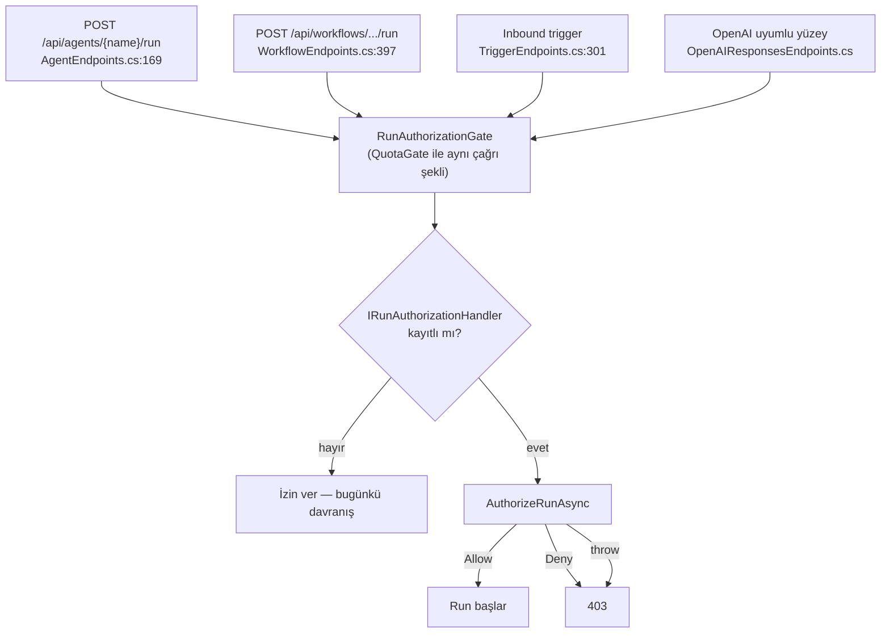

# Faz 139 — Çalıştırma ve Oturum Yetkilendirmesi

> **Durum:** 📋 Planlandı (2026-09-03)
> **Kaynak:** [ADAYLAR.md](ADAYLAR.md) · **F-185** (tüketici turu 3, A1 + A8)
> **Önkoşul:** Yok
> **Paketler:** `AgentPrism.Abstractions`, `AgentPrism.Core`, `AgentPrism.AspNetCore`
> **Yeni paket:** Yok · **Migration:** Yok
> **Public API:** Büyüyor — yeni kontrat + `AgentRunScope`'a iki alan. `wc -l src/*/PublicAPI.Shipped.txt` → her dosya **1 satır** (yalnız başlık), yani shipped giriş **sıfır**: bugün eklemek bedava, GA'dan sonra bir sürüm kararı
> **Tüketici yüzeyi:** `docs-site/`: `guides/embedding.md` (genişleme noktası listesi), `concepts/sessions.md`, `concepts/runs.md`, `capabilities.md` · sevk edilen: XML `<example>`, `src/AgentPrism.Abstractions/README.md`
> **Manuel test alanı:** [`docs/manuel-test/13-KIRACI-VE-GUVENLIK.md`](manuel-test/13-KIRACI-VE-GUVENLIK.md)

---

## Bu Faza Başlarken

> `faz-baslangic` skill'ini uygula. Aşağıdaki liste o skill'in 2. adımıdır —
> **tamamını değil, yalnız işaret edilen bölümleri oku.**

1. Bu doküman
2. Kararlar — dosyanın tamamını **okuma**, yalnız bu kalemleri grep'le:
   ```bash
   grep -n "K-103\|K-283\|K-162" docs/KARARLAR.md
   ```
   **K-103** (onay kontrolü run kuyruğa taşınınca handler'dan düşer),
   **K-283** (bir davranışı düzeltmek ona dayanan çağıranı sessizce değiştirir —
   oturum deposu kiracıyla sınırlanınca ses ucunun reddi etkisiz kaldı),
   **K-162** (devam eden run kota aşımında kesilmez)
3. Alan hafızası (bu faz iki alana dokunuyor):
   [`hafiza/http-uc-tuzaklari.md`](hafiza/http-uc-tuzaklari.md) (uç filtresi ve
   gövde bağlama sırası) · [`hafiza/aspnetcore-di.md`](hafiza/aspnetcore-di.md)
   (singleton/scoped sınırı — kontrat singleton olmak zorundadır)
4. Gerektiğinde, tamamı değil ilgili bölümü:
   [`MIMARI-GUVENLIK.md`](MIMARI-GUVENLIK.md) — kiracı ve rol bölümü

---

## Amaç

Bugün bir kiracıdaki her `Operator`, aynı kiracıdaki **başka bir kullanıcının**
konuşmasını okuyabiliyor, ona yazabiliyor ve silebiliyor. AgentPrism sahipliği
kiracı düzeyinde çiziyor; kiracı **içindeki** kullanıcıyı hiçbir yerde
ayırmıyor. Bu faz sahipliği AgentPrism'e **öğretmez** — tüketiciye **sorar**.

- **F-185** — Run başlatmayı ve session erişimini yetkilendiren, varsayılan
  kapalı, fail-closed bir genişleme noktası; ve çağıran kimliğinin
  `AgentRunScope` üzerinden tool gövdesine ulaşması.

### Bugün ne çalışmıyor — doğrulanmış kanıt

| Kanıt | Gözlem |
|---|---|
| [`AgentEndpoints.cs:193-233`](../src/AgentPrism.AspNetCore/Endpoints/AgentEndpoints.cs) | Run yolunda dört kapı var (`DrainGate` · `RunAttributionGate` · `QuotaGate` · `PreflightGate`). **Hiçbiri** çağıranı session sahipliğiyle karşılaştırmıyor |
| [`AgentEndpoints.cs:825`](../src/AgentPrism.AspNetCore/Endpoints/AgentEndpoints.cs) | `sessionId` **istek gövdesinden** geliyor ve doğrudan `GetOrCreateSessionAsync`'e veriliyor |
| [`SessionEndpoints.cs:22,52,65,79`](../src/AgentPrism.AspNetCore/Endpoints/SessionEndpoints.cs) | Dört session ucu yalnız rol (`Reader`/`Operator`) ve API key scope taşıyor |
| [`AgentSessionManager.cs:365`](../src/AgentPrism.Core/Sessions/AgentSessionManager.cs) | Liste sorgusu yalnız `_tenantContext.TenantId` ile daralıyor |
| [`AgentPrismDiagnosticsCollector.cs:221-245`](../src/AgentPrism.Core/Diagnostics/AgentPrismDiagnosticsCollector.cs) | Sevk edilen **beş** genişleme noktası sayılıyor; run başlatmayı veya session okumayı yetkilendiren **yok** |
| [`AgentPrismRunContext.cs:52`](../src/AgentPrism.Core/Recording/AgentPrismRunContext.cs) | `AgentRunScope` `UserId` ve `Labels` taşımıyor |
| [`RunRecord.cs:47,57`](../src/AgentPrism.Abstractions/Runs/RunRecord.cs) | Aynı iki değer **zaten toplanıyor** ve `runs` satırına yazılıyor — bir adım ötede düşürülüyor |
| [`RunAttributionGate.cs:19`](../src/AgentPrism.AspNetCore/RateLimiting/RunAttributionGate.cs) | 🚨 *"the endpoints that start runs do not share one"* — run başlatan uçlar **ortak filtre paylaşmıyor**; kapı her uca **tek tek** eklenmelidir |

> Kanıtlar 2026-09-03 tarihinde doğrulandı.

### Neden bu kalem AgentPrism'e ait

Gerekçe kütüphanenin kendi ifadesidir. `IRunAttributionContext` `userId` için
şunu yazıyor: *"A `userId` field on `POST /api/agents/{name}/run` would let any
client write spend against another user's name, so the body is not a source of
attribution at all."* Aynı muhakeme `sessionId` için de geçerlidir ve sonucu
daha ağırdır: yanlış atıf bir **kayıt** hatasıdır, yanlış session bir
**sızıntıdır**.

---

## 139.1 — Kapı nereye girer

🚨 **En kritik yapısal iddia budur ve ölçülerek doğrulandı.** Run başlatan
uçlar ortak bir filtre paylaşmaz; her biri kapılarını **kendi gövdesinde**
açıkça çağırır. Bir uç atlanırsa kapı bir bypass'a döner ve yanlış bir güvenlik
hissi üretir — bu, kapının hiç olmamasından kötüdür.

Kullanıcı kararı (2026-09-03): **dört yüzeyin dördü de kapsanır.**



Kapı `QuotaGate` ile **aynı çağrı şeklini** taşır: bir `internal static` yardımcı,
uç filtresi değil. Gerekçe `QuotaGate.cs:12-18`'de yazılı ve burada da geçerli:
OpenAI uyumlu uçta agent adı rota değerinde değil gövdenin `model` alanındadır;
gövdeyi okuyan bir filtre isteği iki kez ayrıştırır.

**Sıra:** `DrainGate` → `RunAttributionGate` → **`RunAuthorizationGate`** →
`QuotaGate` → `PreflightGate`.

Gerekçe: yetkilendirme atıftan **sonra** gelir (kapı `UserId`'yi atıftan alır)
ve kotadan **önce** gelir — yetkisiz bir çağrının kiracının kotasını tüketmesi
yanlıştır.

## 139.2 — Session uçlarının kapısı

Dört session ucu (`SessionEndpoints.cs:22,52,65,79`) `AuthorizeSessionAsync`
çağırır. Red yanıtları:

| Erişim | Red yanıtı | Gerekçe |
|---|---|---|
| `Read` · `Delete` · `Branch` | **`404`** | "Görmemesi gereken kaynak `404`, `403` değil" kuralı. `403`, kaynağın **var olduğunu** sızdırır |
| `List` | **`403`** | Liste bir kaynak değil bir işlemdir; varlığı sızdıracak bir kimlik yok |
| `Start` (run) | **`403`** | Agent adı zaten katalogda görünür; gizlenecek bir varlık yok |

🚨 **`List` filtrelenmez, reddedilir.** Tüketici bunu açıkça kabul etti:
*"Filtreleme isteyen tüketici listeyi zaten kendi tarafında tutuyor."*
Filtreleme sayfalama sözleşmesini bozar — `skip`/`take` sunucu tarafında
uygulanır ve süzülmüş bir sayfa eksik döner.

## 139.3 — Sözleşme

Kullanıcı kararı (2026-09-03): **iki metot, kapalı enum.**
`IToolAuthorizationHandler` ile birebir simetriktir; tüketici o deseni zaten
tanıyor ve fail-closed davranışı aynıdır.

## 139.4 — Çağıran kimliğinin scope'a taşınması (A8)

`AgentRunScope` `UserId` ve `Labels` alır. Yeni kavram gelmez: değer
`IRunAttributionContext`'ten **zaten** okunuyor ve `runs` satırına **zaten**
yazılıyor (`RunRecord.cs:47,57`). AgentPrism'in duruşu korunur — opak string,
çözülmez, doğrulanmaz, yorumlanmaz.

🚨 **`RunAttributionReader.Read` üzerinden okunur, arayüze doğrudan
dokunulmaz.** Sebep dosyanın kendi yorumunda yazılı: tüketici implementasyonu
kendi kimlik hattına uzanır ve orada `throw` edebilir; gözlemlenebilirlik
işlevselliği bozmaz.

---

## Planlanan Public API

> Taslak imzalardır. Gerçekleşen imzalar kapanışta ayrı bir bölüme yazılır.

```csharp
// AgentPrism.Abstractions
public interface IRunAuthorizationHandler
{
    ValueTask<RunAuthorizationResult> AuthorizeRunAsync(
        RunAuthorizationRequest request, CancellationToken cancellationToken = default);

    ValueTask<RunAuthorizationResult> AuthorizeSessionAsync(
        SessionAuthorizationRequest request, CancellationToken cancellationToken = default);
}

public sealed record RunAuthorizationRequest
{
    public required string TenantId { get; init; }
    public required string AgentName { get; init; }
    public string? SessionId { get; init; }
    public string? UserId { get; init; }
    public required RunAccess Access { get; init; }
}

public sealed record SessionAuthorizationRequest
{
    public required string TenantId { get; init; }
    public required string SessionId { get; init; }
    public string? UserId { get; init; }
    public required SessionAccess Access { get; init; }
}

public enum RunAccess { Start = 0 }
public enum SessionAccess { Read = 0, List = 1, Delete = 2, Branch = 3 }

public sealed record RunAuthorizationResult
{
    public required bool IsAllowed { get; init; }
    public string? Reason { get; init; }

    public static RunAuthorizationResult Allow();
    public static RunAuthorizationResult Deny(string reason);
}

// AgentPrism.Core — AgentRunScope'a eklenen alanlar
public sealed record AgentRunScope
{
    public string? UserId { get; init; }
    public IReadOnlyDictionary<string, string>? Labels { get; init; }
}
```

**Kayıt:** `TryAddSingleton<IRunAuthorizationHandler, AllowAllRunAuthorizationHandler>()`.
K1 (sıfır sürpriz) ve K4 (her nokta değiştirilebilir) gereği: kaydedilmemiş bir
kurulumda **hiçbir şey değişmez**, tüketicinin kaydı kazanır.

🚨 **Singleton zorunludur.** `IRunAttributionContext` ile aynı gerekçe:
singleton servisler buna bağımlanır, scoped kayıt captive dependency olur.
İstek başına durum `IHttpContextAccessor` ile çözülür. Sözleşme bunu XML
dokümanında **açıkça** yazar.

### HTTP `endpoint`'leri

Yeni uç **yok**. Var olan uçların davranışı değişir:

| Metot | Yol | Rol | Yeni davranış |
|---|---|---|---|
| `POST` | `/api/agents/{name}/run` | Operator | Handler reddederse `403` |
| `POST` | `/api/workflows/{name}/run` | Operator | Handler reddederse `403` |
| `POST` | `/v1/responses` (OpenAI uyumlu) | Operator | Handler reddederse `403` |
| `GET` | `/api/sessions` | Reader | Handler reddederse `403` |
| `GET` | `/api/sessions/{sessionId}` | Reader | Handler reddederse `404` |
| `DELETE` | `/api/sessions/{sessionId}` | Operator | Handler reddederse `404` |
| `POST` | `/api/sessions/{sessionId}/branch` | Operator | Handler reddederse `404` |

### Arayüz payı

Yok. Konsol `Operator` olarak koşar ve varsayılan handler her şeye izin verir.

---

## Planlanan Dosya Listesi

```
src/AgentPrism.Abstractions/
└── Runs/
    └── RunAuthorizationTypes.cs          (yeni — kontrat + istek/sonuç tipleri)

src/AgentPrism.Core/
├── Runs/
│   └── AllowAllRunAuthorizationHandler.cs (yeni — varsayılan, her şeye izin)
├── Recording/
│   └── AgentPrismRunContext.cs           (AgentRunScope: UserId + Labels)
├── Recording/
│   └── RunRecordingAgent.Lifecycle.cs    (scope kurulurken iki alan doldurulur)
└── Diagnostics/
    └── AgentPrismDiagnosticsCollector.cs  (altıncı genişleme noktası)

src/AgentPrism.AspNetCore/
├── RateLimiting/
│   └── RunAuthorizationGate.cs           (yeni — QuotaGate ile aynı şekil)
├── Endpoints/AgentEndpoints.cs           (kapı çağrısı)
├── Endpoints/WorkflowEndpoints.cs        (kapı çağrısı)
├── Endpoints/TriggerEndpoints.cs         (kapı çağrısı)
├── Endpoints/SessionEndpoints.cs         (dört uç)
└── OpenAICompat/OpenAIResponsesEndpoints.cs (kapı çağrısı)
```

---

## Hata Modları ve Testler

> Mutlu yoldan değil, **ne bozulabilir**den türetilir. Seviyeyi plan seçer.

| Ne bozulabilir | Seviye | Test sınıfı |
|---|---|---|
| 🚨 Bir run başlatan uç kapıyı **çağırmayı unutur** (bypass) | Fonksiyonel | `RunAuthorizationCoverageTests` — dört yüzeyin **dördü** ayrı ayrı |
| Handler `throw` ederse çağrı **izin verilir** (fail-open) | Fonksiyonel | `RunAuthorizationTests` |
| Handler kaydedilmemişken davranış değişir | Fonksiyonel | `RunAuthorizationTests` |
| Reddedilen session okuması `403` döner (`404` yerine) ve varlığı sızdırır | Fonksiyonel | `SecurityTests` |
| Reddedilen run kotayı **tüketir** (kapı sırası yanlış) | Fonksiyonel | `RunAuthorizationOrderTests` |
| Handler `UserId` alamaz (atıf kapısından **sonra** çalışmıyor) | Fonksiyonel | `RunAuthorizationTests` |
| Başka kiracının session'ı kapıya `TenantId` olmadan gider | Sözleşme | `TenantIsolationContract` |
| Kuyruğa alınan run'da kapı worker tarafında **düşer** (K-103 sınıfı) | Fonksiyonel | `QueuedRunAuthorizationTests` |
| `AgentRunScope.UserId` akışlı yolda `null` kalır | Fonksiyonel | `RunScopeAttributionTests` |
| Handler iptal edilirse run asılı kalır | Fonksiyonel | `RunAuthorizationTests` |
| Eşzamanlı iki run aynı handler örneğinde yarışır | Fonksiyonel | `RunAuthorizationConcurrencyTests` |
| Handler `null` `Reason` ile `Deny` döner | Birim | `RunAuthorizationResultTests` |

🚨 **Birim testi bu fazı kanıtlayamaz.** Davranış dört sınır geçiyor: DI ·
HTTP · kiracı · akış. Kapsama testi (`RunAuthorizationCoverageTests`) fazın
**en önemli** testidir — planın yapısal iddiası tam olarak orada ölçülür.

---

## Manuel Kabul Case'leri

| # | Ön koşul | Adımlar | Beklenen sonuç |
|---|---|---|---|
| 1 | Handler kaydedilmemiş | `support` agent'ına run at | Bugünkü davranış; hiçbir fark yok |
| 2 | `UserId = "a"` dışındaki her şeyi reddeden handler | `a` kimliğiyle run at | `200`, run çalışır |
| 3 | Aynı handler | `b` kimliğiyle run at | `403`, `runs` satırı **açılmaz** |
| 4 | Aynı handler | `b` ile `a`'nın `sessionId`'siyle run at | `403` |
| 5 | Aynı handler | `b` ile `GET /api/sessions/{a-oturumu}` | **`404`** (`403` değil) |
| 6 | Aynı handler | `b` ile `GET /api/sessions` | `403` |
| 7 | `throw` eden handler | Run at | `403` — fail-closed |
| 8 | Aynı handler | `POST /v1/responses` (OpenAI uyumlu) | `403` — bypass yok |
| 9 | Aynı handler | Workflow run + inbound trigger | İkisi de `403` |
| 10 | Kimliği loglayan tool | `a` ile run at | Tool gövdesi `UserId = "a"` görür |

---

## Açık Sorular

| # | Soru | Seçenekler | Öneri |
|---|---|---|---|
| 1 | Kapı `IAgentPrismDiagnosticsCollector`'a altıncı genişleme noktası olarak girsin mi? | A: Girsin · B: Girmesin | **A** — beş noktanın hepsi orada; kapıyı dışarıda bırakmak envanteri yalanlar |
| 2 | `SessionAccess`'e ileride `Write` eklenirse mevcut handler'lar ne görür? | A: Kapalı enum, yeni değer additive · B: Şimdiden `Write` ekle | **A** — bugün `Write` diye bir işlem yok; olmayan bir erişimi ilan etmek yanlış |
| 3 | Voice oturumları (`VoiceEndpoints`) kapsansın mı? | A: Bu fazda · B: Ayrı faz | **B** — ses oturumu ayrı bir depo ve ömür taşır; K-283 vakası tam olarak orada yaşandı, ölçülmeden girilmez |

---

## Bitiş Ölçütleri (DoD)

- [ ] Handler kaydedilmemiş kurulumda **hiçbir** davranış değişmez (case 1 kanıt)
- [ ] Dört run başlatan yüzeyin **dördü** de kapıdan geçer; `RunAuthorizationCoverageTests` dördünü ayrı ayrı kanıtlar
- [ ] `throw` eden handler çağrıyı **reddeder** (fail-closed)
- [ ] Reddedilen session okuması `404`, reddedilen liste ve run `403` döner
- [ ] Reddedilen run `runs` satırı **açmaz** ve kota **tüketmez**
- [ ] `AgentRunScope.UserId` tool gövdesinde görünür; akışlı yolda da dolu
- [ ] Dört doğrulama kapısı sıfır uyarı verir
- [ ] `samples/AgentPrism.Api` ile gerçek `run` yapıldı, çıktı belgeye yazıldı
- [ ] `secret` taraması boş döndü
- [ ] Manuel kabul case'leri `docs/manuel-test/13-KIRACI-VE-GUVENLIK.md` içine eklendi; otomatikleştirilebilenler koşuldu
- [ ] `faz-denetim` koşuldu; 🔴 bulgu kalmadı
- [ ] `docs-site/` güncellendi; `npm run build` + `check-links.mjs` temiz

### Doğrulama komutları

```bash
# Reddedilen run 403 döner ve runs satırı açmaz
curl -s -o /dev/null -w "%{http_code}\n" -X POST \
  http://localhost:5081/agentprism/api/agents/support/run \
  -H 'Content-Type: application/json' -d '{"message":"merhaba"}'

# Başkasının oturumu 404 döner — 403 DEĞİL
curl -s -o /dev/null -w "%{http_code}\n" \
  http://localhost:5081/agentprism/api/sessions/<baskasinin-oturumu>

# OpenAI uyumlu yüzey de kapsanır
curl -s -o /dev/null -w "%{http_code}\n" -X POST \
  http://localhost:5081/agentprism/v1/responses \
  -H 'Content-Type: application/json' -d '{"model":"support","input":"merhaba"}'
```

---

## Riskler

| Risk | Önlem |
|------|-------|
| 🚨 Bir run başlatan uç atlanır ve kapı bypass'a döner | `RunAuthorizationCoverageTests` dört yüzeyi ayrı ayrı kilitler. Yeni bir run ucu eklenirse test onu görmez — bu yüzden testin kendisi `QuotaGate` çağrı yerlerini `grep` ile sayan bir iddia taşır |
| Kapı sırası yanlış olur; yetkisiz çağrı kota tüketir | `RunAuthorizationOrderTests` sırayı ölçer |
| Handler scoped kaydedilir; captive dependency oluşur | XML dokümanı singleton zorunluluğunu yazar; `AgentPrismDiagnosticsCollector` yanlış ömrü rapor eder |
| `UserId` akışlı yolda kaybolur (`AsyncLocal` tuzağı) | 🚨 `MEMORY.md`: yazım çağırana akmaz. Scope, run'ı başlatan metodun **kendi gövdesinde** kurulur; `RunScopeAttributionTests` akışlı yolu ayrıca ölçer |
| Kuyruğa alınan run'da kapı düşer (K-103 sınıfı) | `QueuedRunAuthorizationTests`. Bu tam olarak K-103'ün yaşandığı sınıftır |
| Public yüzey büyür ve GA'da kırıcı olur | Shipped giriş bugün **sıfır** (ölçüldü); pencere açık |

---

<!-- ============================================================
     AŞAĞISI KAPANIŞTA DOLDURULUR — `faz-tamamlama` skill'i.
     Plan anında boş kalır. Başlıkları SİLME.
     ============================================================ -->

## Plandan Sapmalar

> Kapanışta doldurulur.

## Bu Fazda Verilen Kararlar

> Kapanışta doldurulur. K-NNN numaraları burada alınır; plan numara rezerve etmez.

## Gerçekleşen Public API

> Kapanışta doldurulur.

## Dosya Listesi (gerçekleşen)

> Kapanışta doldurulur.

## Denetim Bulguları

> Kapanışta doldurulur.

## Sonraki Faza Devir Notu

> Kapanışta doldurulur.
