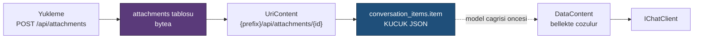

# Faz 14 — Çok Modluluk: Görsel, Ses ve Dosya Girdisi

> **Durum:** ✅ Tamamlandı (2026-08-02)
> **Kaynak:** [BEYIN-FIRTINASI.md](arsiv/BEYIN-FIRTINASI.md) · **F-12**
> **Önkoşul:** Yok · Faz 9 önerilir (yükleme yetkisi rol ister)
> **Sonraki bağımlı:** [Faz 28](28-SES-TOOLLARI.md) — ses çıktısı bu fazın deposunu kullanır
> **Paketler:** `AgentPrism.Abstractions`, `.Core`, `.PostgreSql`, `.AspNetCore`, `.UI`
> **Yeni paket:** Yok · **Migration:** 0006 (planlanan sırada)

---

## Bu Faza Başlarken

1. [`MIMARI.md`](MIMARI.md) — bölüm 5 (`conversation_items`, K-027), bölüm 7 (güvenlik)
2. [`KARARLAR.md`](KARARLAR.md) — **K-027** (polimorfik yük `json`), **K-043** (konuşma = oturum), **K-036** (OpenAI uyumlu uçlar), **K-105** (bkz. aşağıda — vektör bellek kapsam dışı)
3. [`02-POSTGRESQL-KALICILIK.md`](02-POSTGRESQL-KALICILIK.md) — `PostgresChatHistoryProvider`
4. [`13-BAGLAM-SIKISTIRMA-VE-BELLEK.md`](13-BAGLAM-SIKISTIRMA-VE-BELLEK.md) — §13.3 ve "Sonraki Faza Devir Notu": `FileMemoryProvider` bugün yalnız `InMemoryAgentFileStore` ile çalışıyor, `ChatHistoryMemoryProvider` (vektör tabanlı bellek) hiç kullanılmıyor
5. Bu doküman

> 🚨 Faz 13'te bulunan tuzak: `AgentDefinition`'a yeni bir alan eklerken
> **hem** `AgentPrismCoreJsonContext`'in kapsadığı tip **hem**
> `AgentPrism.PostgreSql/Internal/AgentDefinitionPayload.cs` güncellenmeli —
> ikisi ayrı şemalardır, biri unutulursa sessizce veri kaybolur (build/test
> kırmaz, yalnız round-trip testi yakalar). Bu faz `AttachmentDescriptor` gibi
> **yeni** tipler ekliyor, `AgentDefinition`'ı değiştirmiyor; ama ileride biri
> `AgentDefinition`'a alan eklerse bu tuzak geçerlidir.

---

## Amaç

Kullanıcı bir görsel, ses dosyası veya belge yükleyip agent'a gönderebilsin.
OpenAI ve OpenRouter arayüzlerinin standart yeteneğidir; AgentPrism bugün yalnız
metin taşır.

---

## Doğrulanmış API

`Microsoft.Extensions.AI` içerik tipleri MAF'ta doğrudan kullanılır (K3):

```csharp
DataContent(ReadOnlyMemory<byte> data, string mediaType)   // gomulu ikili icerik
DataContent(Uri dataUri)                                    // data: URI
UriContent(Uri uri, string mediaType)                       // DIS baglanti
TextContent(string text)
```

`ChatMessage.Contents` bunları taşır ve `conversation_items.item` sütunu
polimorfik JSON olarak saklar (K-027 gereği `json`, `jsonb` değil).

---

## 14.1 — Merkezî Tasarım Kararı: İkili İçerik Nerede Yaşar?

Bu fazın en önemli sorusu budur ve yanlış cevap veritabanını şişirir.

| Yol | Sonuç |
|-----|-------|
| `DataContent` olduğu gibi `conversation_items.item` içinde | 1 MB'lık görsel → base64 ile ~1,4 MB JSON. Her geçmiş okuması bunu okur. **Kabul edilemez** |
| İkili veri ayrı tabloda, mesajda **referans** | Mesaj küçük kalır; geçmiş okuması hızlı; içerik istendiğinde çekilir |

**Karar:** ikili içerik `attachments` tablosunda yaşar. Kalıcılığa yazılmadan
önce `DataContent`, AgentPrism'in kendi ucunu gösteren bir `UriContent`'e
**dönüştürülür**:



Modele gönderilirken içerik yeniden `DataContent`'e çözülür — sağlayıcıların
çoğu kendi erişemedikleri bir URL'yi okuyamaz. Çözme **bellekte** olur, diske
yazılmaz.

---

## 14.2 — Veri Modeli (Migration 0006)

```sql
CREATE TABLE {schema}.attachments (
    id          uuid        NOT NULL PRIMARY KEY,
    tenant_id   text        NOT NULL,
    session_id  text,
    run_id      uuid,
    file_name   text        NOT NULL,
    media_type  text        NOT NULL,
    byte_size   bigint      NOT NULL,
    sha256      text        NOT NULL,
    content     bytea,                        -- NULL ise harici depoda
    external_uri text,                        -- IAttachmentStorage kullaniliyorsa
    created_by  text,
    created_at  timestamptz NOT NULL
);

CREATE INDEX IF NOT EXISTS attachments_tenant_created_idx
    ON {schema}.attachments (tenant_id, created_at DESC);

CREATE INDEX IF NOT EXISTS attachments_session_idx
    ON {schema}.attachments (tenant_id, session_id) WHERE session_id IS NOT NULL;
```

`content` **`bytea`**'dır, base64 metin değil. `sha256` tekrar yüklemeleri
tespit eder ve içerik doğrulaması sağlar.

> PostgreSQL `bytea` için TOAST devreye girer ve büyük değerler ayrı saklanır.
> Bu, satır okumalarını yavaşlatmaz çünkü `content` yalnız istendiğinde
> seçilir — sorgular `SELECT *` **kullanmaz**.

---

## 14.3 — Gerçekleşen Public API

`AttachmentContent` (kaydedilecek yeni ek girdisi) planda yalnız isimden
geçiyordu; şekli koddan çıkarıldı ve `ReadOnlyMemory<byte> Data` taşıyan bir
`class` (record değil — büyük içeriğin `ToString`/eşitlik karşılaştırmasına
girmemesi için) olarak yazıldı. `IAttachmentStore`'a plana göre **bir üye
fazladan** eklendi: `DeleteBySessionAsync` — oturum silme kaskadının
(K-112) uygulama katmanında yapılabilmesi için gerekli oldu.

```csharp
public sealed record AttachmentDescriptor
{
    public required Guid Id { get; init; }
    public required string TenantId { get; init; }
    public string? SessionId { get; init; }
    public Guid? RunId { get; init; }
    public required string FileName { get; init; }
    public required string MediaType { get; init; }
    public required long ByteSize { get; init; }
    public required string Sha256 { get; init; }
    public string? CreatedBy { get; init; }
    public required DateTimeOffset CreatedAt { get; init; }
}

public sealed class AttachmentContent
{
    public required string TenantId { get; init; }
    public string? SessionId { get; init; }
    public Guid? RunId { get; init; }
    public required string FileName { get; init; }
    public required string MediaType { get; init; }
    public required ReadOnlyMemory<byte> Data { get; init; }
    public string? CreatedBy { get; init; }
}

public interface IAttachmentStore
{
    ValueTask<AttachmentDescriptor> SaveAsync(AttachmentContent content, CancellationToken ct = default);
    ValueTask<AttachmentDescriptor?> GetAsync(string tenantId, Guid id, CancellationToken ct = default);
    ValueTask<Stream?> OpenReadAsync(string tenantId, Guid id, CancellationToken ct = default);
    ValueTask<IReadOnlyList<AttachmentDescriptor>> ListAsync(AttachmentQuery query, CancellationToken ct = default);
    ValueTask<bool> DeleteAsync(string tenantId, Guid id, CancellationToken ct = default);
    // Plana gore FAZLADAN: oturum silme kaskadi bunu ister (K-112).
    ValueTask<int> DeleteBySessionAsync(string tenantId, string sessionId, CancellationToken ct = default);
}

// Harici depolama icin genisleme noktasi (S3, Blob). Varsayilan uygulama YOKTUR.
public interface IAttachmentStorage
{
    ValueTask<Uri> WriteAsync(string tenantId, Guid id, Stream content, string mediaType, CancellationToken ct = default);
    ValueTask<Stream?> ReadAsync(Uri uri, CancellationToken ct = default);
    ValueTask DeleteAsync(Uri uri, CancellationToken ct = default);
}

// Ek referansini kuran ve geri cozen yardimci (Core). Yalniz "/api/attachments/{id}"
// izine bakar; prefix'i (host uc noktasi) bilmeye ihtiyac duymaz.
public static class AttachmentUriReference
{
    public static Uri Create(string prefix, Guid attachmentId);
    public static bool TryParse(Uri uri, out Guid attachmentId);
}
```

`IAttachmentStorage` kaydedilmemişse içerik veritabanında yaşar (K1 — sıfır
sürpriz). Kaydedilmişse `attachments.content` `NULL` kalır ve `external_uri`
dolar. AgentPrism **hiçbir bulut SDK'sına bağımlılık almaz**; S3/Blob
uygulamasını tüketici yazar.

---

## 14.4 — HTTP Uçları

| Uç | Rol | Ne yapar |
|----|-----|----------|
| `POST {prefix}/api/attachments` | Operator | `multipart/form-data` yükleme; `AttachmentDescriptor` döner |
| `GET {prefix}/api/attachments/{id}` | Reader | İçeriği akıtır (`Content-Type`, `ETag`, `Content-Disposition: attachment`) |
| `GET {prefix}/api/attachments?sessionId=…` | Reader | Liste |
| `DELETE {prefix}/api/attachments/{id}` | Operator | Siler |

Çalıştırma gövdesi genişler:

```jsonc
POST /api/agents/{name}/run
{
  "message": "Bu faturayi ozetle",
  "attachmentIds": ["019fc1..."]          // YENI
}
```

`/v1/responses` ve `/v1/chat/completions` uçları OpenAI biçimindeki
`image_url` ve `input_file` parçalarını kabul eder; `data:` URI'leri
`attachments` tablosuna alınır ve referansa çevrilir. Kablo biçimi
değiştirilmez (K-036).

### Güvenlik kuralları

| Kural | Değer |
|-------|-------|
| Boyut sınırı | Varsayılan 20 MB; `AgentPrismAttachmentOptions.MaxBytes` |
| Tür beyaz listesi | `image/png`, `image/jpeg`, `image/webp`, `image/gif`, `application/pdf`, `text/plain`, `audio/*` (Faz 28 için) |
| Tür doğrulaması | İstemcinin gönderdiği `Content-Type` **yeterli değildir**; sihirli bayt (magic number) denetimi yapılır |
| Kiracı yalıtımı | Her okuma `tenant_id` filtresiyle; kimlik tahmini işe yaramaz |
| Sunum | `Content-Disposition: attachment` ve `X-Content-Type-Options: nosniff`; HTML asla satır içi sunulmaz |
| Yürütülebilir içerik | Beyaz listede yok; yüklenemez |

> 🚨 `Content-Type`'a güvenmek, tarayıcıda içerik çalıştırma (XSS) yüzeyi açar.
> Beyaz liste + sihirli bayt + `nosniff` üçü birlikte uygulanır.

---

## 14.5 — Kalıcı Dosya Belleği (Faz 13'ten devir)

Faz 13, `FileMemoryProvider` için kalıcı bir `AgentFileStore` bırakmıştı.
`attachments` tablosu bunun için uygun **değildir** (yol hiyerarşisi yok).
İki seçenek:

- **A:** `agent_files` adında ayrı bir tablo (path, content, tenant, agent)
- **B:** Kalıcı dosya belleği hiç yapılmaz; `InMemoryAgentFileStore` kalır

Öneri: **A**, aynı migration içinde. Maliyeti bir tablodur ve Faz 13'ün eksik
kalan yarısını kapatır.

---

## 14.6 — Arayüz

- Playground'a dosya yükleme alanı (sürükle-bırak + dosya seçici)
- Görseller transcript'te küçük önizleme ile; diğer türler ad + boyut ile
- Oturum detayında ek listesi
- Yükleme sırasında ilerleme; boyut aşımında anlaşılır hata

Bütçe hedefi: **+7 KB gzip'ten az**. Görsel işleme kütüphanesi **alınmaz**;
önizleme tarayıcının kendi `` etiketiyle yapılır.

---

## Testler

| Proje | Gerçekleşen test sınıfları |
|-------|-----------|
| `AgentPrism.Core.UnitTests` | `AttachmentTypeGuardTests` (sihirli bayt + beyaz liste + boyut), `AttachmentUriReferenceTests` (referans kurma/çözme), `AttachmentResolvingChatClientTests` (UriContent→DataContent, akışlı/akışsız, bulunamayan ek hatası), `InMemoryAttachmentStoreTests` (harici depoya devretme) |
| `AgentPrism.PostgreSql.IntegrationTests` | `AttachmentStoreContract` (InMemory + Postgres üzerinde ortak koşum: ustveri, içerik, kiracı yalıtımı, oturuma göre listeleme/toplu silme), `PostgresAgentFileStoreTests` (yol hiyerarşisi, agent yalıtımı, arama) |
| `AgentPrism.AspNetCore.FunctionalTests` | `AttachmentEndpointTests` (yükleme/indirme/listeleme/silme, yanlış tür, boyut aşımı, `nosniff`+`Content-Disposition`, kiracı yalıtımı, oturum silme kaskadı), `AttachmentRunTests` (çalıştırmaya ek bağlama, modele giden gerçek içerik), `OpenAICompatTests` (`/v1/responses` gömülü `data:` URI kabulü) |
| `AgentPrism.UI.frontend` (Vitest) | Ek TS testi eklenmedi; upload akışı doğrudan bileşen içinde (test edilen `sse.ts`/`transcript.ts`'in kapsamı dışında) |
| `AgentPrism.Ui.E2ETests` | `Playground_dosya_yuklenir_onizleme_gorunur_ve_calistirma_devam_eder` — gerçek Chromium'da dosya yükler, önizleme çipini ve modelin yanıtını doğrular |

**Gerçek model kanıtı:** görsel destekli bir modelle gerçek bir sağlayıcı
çağrısı yapılmadı (API anahtarı gerektirir); bunun yerine örnek uygulama
(`samples/AgentPrism.Api`) gerçekten çalıştırılıp `curl` ile uçtan uca
doğrulandı — yükleme → indirme (bayt bayt eşleşme + doğru başlıklar) →
listeleme → silme → silinmiş eke `404`. `AttachmentRunTests` ve
`OpenAICompatTests`'teki sahte model istemcisi (`EchoModelProvider`)
modele GERÇEKTEN ulaşan içeriği (`DataContent`, base64 değil referans)
doğrular; bu, "referans çözülüyor mu" sorusunun asıl kanıtıdır.

---

## Bu Fazda Verilen Kararlar

1. **İkili içerik `attachments` tablosunda, mesajda yalnız referans** — geçmiş
   okumasının maliyeti sabit kalır (K-111).
2. **`bytea`, base64 metin değil.**
3. **`IAttachmentStorage` genişleme noktası; bulut SDK bağımlılığı yok** (K-007).
4. **Tür beyaz listesi + sihirli bayt denetimi** — `Content-Type` kanıt değildir (K-113).
5. **Modele gönderimde içerik belleğe çözülür**, sağlayıcıya URL verilmez (K-111).
6. **`attachments.session_id` yabancı anahtar değildir** — denendi, gerçek
   akışta başarısız oldu, geri alındı (K-112).

---

## Açık Sorular — Cevaplandı

1. **Varsayılan boyut sınırı** → **20 MB** (kullanıcı kararı, doküman önerisi
   onaylandı). Ses için ayrı sınır Faz 29'da.
2. **Ekler otomatik silinsin mi?** → **Evet**, ancak `session_id` yabancı
   anahtar OLARAK DEĞİL, uygulama katmanında (K-112). Sahipsiz ekler Faz
   25'in işi olarak kalır.
3. **PDF metne çevrilsin mi?** → **Hayır** (kullanıcı kararı, doküman önerisi
   onaylandı). PDF olduğu gibi gönderilir.
4. **`agent_files` tablosu bu fazda mı?** → **Evet** (K-117), aynı migration
   (0006) içinde. `PostgresAgentFileStore` yazıldı; K-110'un öngördüğü gibi
   `FileMemoryProvider`/`TextSearchProvider` kod değişmeden buraya döndü.

---

## Plandan Sapmalar

- **`IAttachmentStore`'a `DeleteBySessionAsync` eklendi** — plan taslağında
  yoktu. Oturum silme kaskadının (açık soru 2) uygulama katmanında
  yapılabilmesi için gerekli oldu (K-112).
- **`/v1/chat/completions` çok modlu girdi almıyor** — DoD bunu istemiyordu,
  yalnızca `/v1/responses` isteniyordu; bilinçli kapsam kararı (K-116).
- **`.DisableAntiforgery()` eklendi** — plan bundan bahsetmiyordu çünkü minimal
  API'nin `IFormFile` parametresi için otomatik CSRF metadata eklediği
  keşfedilmemişti (K-115).

---

## Bitiş Ölçütleri (DoD)

- [x] Arayüzden görsel yüklenip agent'a gönderiliyor; model yanıt veriyor —
      Playground'a sürükle-bırak/dosya seçici + önizleme eklendi;
      `AgentPrism.Ui.E2ETests.UiTests.Playground_dosya_yuklenir_onizleme_gorunur_ve_calistirma_devam_eder`
      gerçek bir Chromium'da dosya yükler ve modelin yanıt verdiğini doğrular.
- [x] `conversation_items` içindeki mesaj **küçük** kalıyor — mesaj yalnız
      `UriContent({prefix}/api/attachments/{id})` taşır; ölçüldü:
      `AttachmentRunTests`/`OpenAICompatTests`'te modele giden içerik
      `DataContent`, geçmişe yazılan içerik `UriContent`'tir (K-111).
- [x] Geçmiş yeniden yüklendiğinde ek hâlâ çözülüyor — `AttachmentResolvingChatClient`
      her model çağrısında (yeni tur + geçmiş tur farketmeksizin) referansı çözer.
- [x] Yanlış tür ve büyük dosya reddediliyor — `AttachmentEndpointTests.Bilinmeyen_tur_reddedilir`,
      `Boyut_sinirini_asan_dosya_reddedilir`.
- [x] Başka kiracının ekine erişilemiyor — `AttachmentEndpointTests.Baska_kiracinin_ekine_erisilemez`,
      `AttachmentRunTests.Baska_kiracinin_eki_calistirmada_kullanilamaz`.
- [x] `/v1/responses` OpenAI biçimli görsel girdisi kabul ediyor —
      `OpenAICompatTests.Responses_govdeye_gomulu_data_uri_ege_cevrilir_ve_modele_cozulmus_ulasir`
      (bkz. K-116: `/v1/chat/completions` bilinçli olarak kapsam dışı).
- [x] Dört doğrulama kapısı sıfır uyarı; bundle ölçüldü — `dotnet build/test/pack/format`
      hepsi 0 uyarı/hata; JS bundle 99,1 KB gzip (bütçe 250 KB); bu fazın eklediği
      dosya yükleme UI'ı budget'ı aşmadı.

---

## Riskler

| Risk | Önlem |
|------|-------|
| Veritabanı şişer | Referans modeli + boyut sınırı + Faz 25 saklama politikası |
| Zararlı dosya sunumu | Beyaz liste + sihirli bayt + `nosniff` + `attachment` |
| Büyük dosya belleği tüketir | Yükleme boyut sınırıyla (varsayılan 20 MB) sınırlıdır; indirme her zaman akışla (`Stream`) yapılır |
| Sağlayıcı çok modluluğu desteklemez | **Bu fazda çözülmedi.** `ModelDescriptor`'a yetenek alanı henüz yok (bkz. Sonraki Faza Devir Notu); desteklemeyen bir modele ek gönderilirse hata sağlayıcıdan gelir, AgentPrism'den değil |

---

## Sonraki Faza Devir Notu

- Faz 28 (ses tool'ları) üretilen sesi `attachments` tablosuna yazacaktır;
  `audio/*` beyaz listede zaten var (bu fazda temel imza sezgisiyle: WAV/OGG/MP3).
- Faz 25 (saklama) sahipsiz ekleri temizlemekle yükümlüdür.
- `ModelDescriptor`'a yetenek alanı (`SupportsVision` vb.) eklenirse Faz 8'in
  katalog yapısı genişler; K-032 gereği değer **yapılandırmadan** gelir. Bu
  alan eklenene kadar desteklemeyen bir modele ek göndermek sağlayıcı
  hatasıyla sonuçlanır, AgentPrism önceden engellemez.
- `/v1/chat/completions` görsel/dosya girdisi almaz (K-116). İstenirse
  `AttachmentIngestion.ReplaceEmbeddedDataAsync` zaten paylaşıma hazır;
  yalnız `OpenAIChatCompletionsEndpoints.ReadContent`'in `image_url`/
  `input_file` parçalarını da okuyacak şekilde genişletilmesi gerekir.
- `IAttachmentStore` arayüzüne `DeleteBySessionAsync` eklendi — bir depo
  yazan yeni faz bu üyeyi de uygulamalıdır (contract testinde zorunlu).
- Doğrulanmış tip: `Microsoft.Agents.AI.AgentFileStore`'un tüm üyeleri
  (`ReadAsync` vb.) **nullable** dönüş/parametre taşır ve `CancellationToken`
  dahil her parametre `= default` varsayılanına sahiptir (`MA0061` bunu
  build sırasında zorladı). Yeni bir override yazarken önce
  `maf-api-kesfi` ile doğrulayın, tahmin etmeyin.
