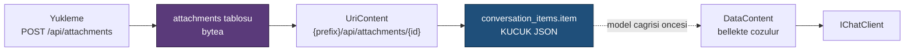

# Faz 14 — Çok Modluluk: Görsel, Ses ve Dosya Girdisi

> **Durum:** 📋 Planlandı
> **Kaynak:** [BEYIN-FIRTINASI.md](BEYIN-FIRTINASI.md) · **F-12**
> **Önkoşul:** Yok · Faz 9 önerilir (yükleme yetkisi rol ister)
> **Sonraki bağımlı:** [Faz 28](28-SES-TOOLLARI.md) — ses çıktısı bu fazın deposunu kullanır
> **Paketler:** `AgentPrism.Abstractions`, `.Core`, `.PostgreSql`, `.AspNetCore`, `.UI`
> **Yeni paket:** Yok · **Migration:** 0006 (planlanan sırada)

---

## Bu Faza Başlarken

1. [`MIMARI.md`](MIMARI.md) — bölüm 5 (`conversation_items`, K-027), bölüm 7 (güvenlik)
2. [`KARARLAR.md`](KARARLAR.md) — **K-027** (polimorfik yük `json`), **K-043** (konuşma = oturum), **K-036** (OpenAI uyumlu uçlar)
3. [`02-POSTGRESQL-KALICILIK.md`](02-POSTGRESQL-KALICILIK.md) — `PostgresChatHistoryProvider`
4. Bu doküman

---

## Amaç

Kullanıcı bir görsel, ses dosyası veya belge yükleyip agent'a gönderebilsin.
OpenAI ve OpenRouter arayüzlerinin standart yeteneğidir; AgentPrism bugün yalnız
metin taşır.

---

## Doğrulanmış API

`Microsoft.Extensions.AI` içerik tipleri MAF'ta doğrudan kullanılır (K3):

```csharp
DataContent(ReadOnlyMemory<byte> data, string mediaType)   // gomulu ikili icerik
DataContent(Uri dataUri)                                    // data: URI
UriContent(Uri uri, string mediaType)                       // DIS baglanti
TextContent(string text)
```

`ChatMessage.Contents` bunları taşır ve `conversation_items.item` sütunu
polimorfik JSON olarak saklar (K-027 gereği `json`, `jsonb` değil).

---

## 14.1 — Merkezî Tasarım Kararı: İkili İçerik Nerede Yaşar?

Bu fazın en önemli sorusu budur ve yanlış cevap veritabanını şişirir.

| Yol | Sonuç |
|-----|-------|
| `DataContent` olduğu gibi `conversation_items.item` içinde | 1 MB'lık görsel → base64 ile ~1,4 MB JSON. Her geçmiş okuması bunu okur. **Kabul edilemez** |
| İkili veri ayrı tabloda, mesajda **referans** | Mesaj küçük kalır; geçmiş okuması hızlı; içerik istendiğinde çekilir |

**Karar:** ikili içerik `attachments` tablosunda yaşar. Kalıcılığa yazılmadan
önce `DataContent`, AgentPrism'in kendi ucunu gösteren bir `UriContent`'e
**dönüştürülür**:



Modele gönderilirken içerik yeniden `DataContent`'e çözülür — sağlayıcıların
çoğu kendi erişemedikleri bir URL'yi okuyamaz. Çözme **bellekte** olur, diske
yazılmaz.

---

## 14.2 — Veri Modeli (Migration 0006)

```sql
CREATE TABLE {schema}.attachments (
    id          uuid        NOT NULL PRIMARY KEY,
    tenant_id   text        NOT NULL,
    session_id  text,
    run_id      uuid,
    file_name   text        NOT NULL,
    media_type  text        NOT NULL,
    byte_size   bigint      NOT NULL,
    sha256      text        NOT NULL,
    content     bytea,                        -- NULL ise harici depoda
    external_uri text,                        -- IAttachmentStorage kullaniliyorsa
    created_by  text,
    created_at  timestamptz NOT NULL
);

CREATE INDEX IF NOT EXISTS attachments_tenant_created_idx
    ON {schema}.attachments (tenant_id, created_at DESC);

CREATE INDEX IF NOT EXISTS attachments_session_idx
    ON {schema}.attachments (tenant_id, session_id) WHERE session_id IS NOT NULL;
```

`content` **`bytea`**'dır, base64 metin değil. `sha256` tekrar yüklemeleri
tespit eder ve içerik doğrulaması sağlar.

> PostgreSQL `bytea` için TOAST devreye girer ve büyük değerler ayrı saklanır.
> Bu, satır okumalarını yavaşlatmaz çünkü `content` yalnız istendiğinde
> seçilir — sorgular `SELECT *` **kullanmaz**.

---

## 14.3 — Public API

```csharp
public sealed record AttachmentDescriptor
{
    public Guid Id { get; init; }
    public required string TenantId { get; init; }
    public string? SessionId { get; init; }
    public Guid? RunId { get; init; }
    public required string FileName { get; init; }
    public required string MediaType { get; init; }
    public long ByteSize { get; init; }
    public required string Sha256 { get; init; }
    public string? CreatedBy { get; init; }
    public DateTimeOffset CreatedAt { get; init; }
}

public interface IAttachmentStore
{
    ValueTask<AttachmentDescriptor> SaveAsync(AttachmentContent content, CancellationToken ct = default);
    ValueTask<AttachmentDescriptor?> GetAsync(string tenantId, Guid id, CancellationToken ct = default);
    ValueTask<Stream?> OpenReadAsync(string tenantId, Guid id, CancellationToken ct = default);
    ValueTask<IReadOnlyList<AttachmentDescriptor>> ListAsync(AttachmentQuery query, CancellationToken ct = default);
    ValueTask<bool> DeleteAsync(string tenantId, Guid id, CancellationToken ct = default);
}

// Harici depolama icin genisleme noktasi (S3, Blob). Varsayilan uygulama YOKTUR.
public interface IAttachmentStorage
{
    ValueTask<Uri> WriteAsync(string tenantId, Guid id, Stream content, string mediaType, CancellationToken ct = default);
    ValueTask<Stream?> ReadAsync(Uri uri, CancellationToken ct = default);
    ValueTask DeleteAsync(Uri uri, CancellationToken ct = default);
}
```

`IAttachmentStorage` kaydedilmemişse içerik veritabanında yaşar (K1 — sıfır
sürpriz). Kaydedilmişse `attachments.content` `NULL` kalır ve `external_uri`
dolar. AgentPrism **hiçbir bulut SDK'sına bağımlılık almaz**; S3/Blob
uygulamasını tüketici yazar.

---

## 14.4 — HTTP Uçları

| Uç | Rol | Ne yapar |
|----|-----|----------|
| `POST {prefix}/api/attachments` | Operator | `multipart/form-data` yükleme; `AttachmentDescriptor` döner |
| `GET {prefix}/api/attachments/{id}` | Reader | İçeriği akıtır (`Content-Type`, `ETag`, `Content-Disposition: attachment`) |
| `GET {prefix}/api/attachments?sessionId=…` | Reader | Liste |
| `DELETE {prefix}/api/attachments/{id}` | Operator | Siler |

Çalıştırma gövdesi genişler:

```jsonc
POST /api/agents/{name}/run
{
  "message": "Bu faturayi ozetle",
  "attachmentIds": ["019fc1..."]          // YENI
}
```

`/v1/responses` ve `/v1/chat/completions` uçları OpenAI biçimindeki
`image_url` ve `input_file` parçalarını kabul eder; `data:` URI'leri
`attachments` tablosuna alınır ve referansa çevrilir. Kablo biçimi
değiştirilmez (K-036).

### Güvenlik kuralları

| Kural | Değer |
|-------|-------|
| Boyut sınırı | Varsayılan 20 MB; `AgentPrismAttachmentOptions.MaxBytes` |
| Tür beyaz listesi | `image/png`, `image/jpeg`, `image/webp`, `image/gif`, `application/pdf`, `text/plain`, `audio/*` (Faz 28 için) |
| Tür doğrulaması | İstemcinin gönderdiği `Content-Type` **yeterli değildir**; sihirli bayt (magic number) denetimi yapılır |
| Kiracı yalıtımı | Her okuma `tenant_id` filtresiyle; kimlik tahmini işe yaramaz |
| Sunum | `Content-Disposition: attachment` ve `X-Content-Type-Options: nosniff`; HTML asla satır içi sunulmaz |
| Yürütülebilir içerik | Beyaz listede yok; yüklenemez |

> 🚨 `Content-Type`'a güvenmek, tarayıcıda içerik çalıştırma (XSS) yüzeyi açar.
> Beyaz liste + sihirli bayt + `nosniff` üçü birlikte uygulanır.

---

## 14.5 — Kalıcı Dosya Belleği (Faz 13'ten devir)

Faz 13, `FileMemoryProvider` için kalıcı bir `AgentFileStore` bırakmıştı.
`attachments` tablosu bunun için uygun **değildir** (yol hiyerarşisi yok).
İki seçenek:

- **A:** `agent_files` adında ayrı bir tablo (path, content, tenant, agent)
- **B:** Kalıcı dosya belleği hiç yapılmaz; `InMemoryAgentFileStore` kalır

Öneri: **A**, aynı migration içinde. Maliyeti bir tablodur ve Faz 13'ün eksik
kalan yarısını kapatır.

---

## 14.6 — Arayüz

- Playground'a dosya yükleme alanı (sürükle-bırak + dosya seçici)
- Görseller transcript'te küçük önizleme ile; diğer türler ad + boyut ile
- Oturum detayında ek listesi
- Yükleme sırasında ilerleme; boyut aşımında anlaşılır hata

Bütçe hedefi: **+7 KB gzip'ten az**. Görsel işleme kütüphanesi **alınmaz**;
önizleme tarayıcının kendi `` etiketiyle yapılır.

---

## Testler

| Proje | Yeni test |
|-------|-----------|
| `AgentPrism.Core.UnitTests` | `DataContent` ↔ `UriContent` dönüşümü; sihirli bayt denetimi; boyut sınırı; sha256 |
| `AgentPrism.PostgreSql.IntegrationTests` | `AttachmentStoreContract`; `bytea` gidiş-dönüş; kiracı yalıtımı; büyük dosya akışı |
| `AgentPrism.AspNetCore.FunctionalTests` | Yükleme/indirme; yanlış tür reddi; `nosniff` ve `Content-Disposition` başlıkları; başka kiracının ekine `404`; `/v1/*` içinde `image_url` kabulü |
| `AgentPrism.Ui.E2ETests` | Görsel yükleyip çalıştırma; önizleme görünür |

**Gerçek model kanıtı:** görsel destekli bir modelle bir PNG yüklenir,
modelin görseli tanıdığı yanıt dokümana yazılır.

---

## Bu Fazda Verilecek Kararlar

1. **İkili içerik `attachments` tablosunda, mesajda yalnız referans** — geçmiş
   okumasının maliyeti sabit kalmalıdır.
2. **`bytea`, base64 metin değil.**
3. **`IAttachmentStorage` genişleme noktası; bulut SDK bağımlılığı yok** (K-007).
4. **Tür beyaz listesi + sihirli bayt denetimi** — `Content-Type` kanıt değildir.
5. **Modele gönderimde içerik belleğe çözülür**, sağlayıcıya URL verilmez.

---

## Açık Sorular

1. **Varsayılan boyut sınırı 20 MB uygun mu?** Ses dosyaları (Faz 28/29) daha
   büyük olabilir. Öneri: **20 MB**, ses için ayrı sınır Faz 29'da.
2. **Ekler otomatik silinsin mi?** Oturum silinince ekleri de gitsin mi?
   Öneri: **evet**, `session_id` üzerinden; sahipsiz ekler Faz 25'in işi.
3. **PDF metne çevrilsin mi?** Bir PDF kütüphanesi bağımlılıktır. Öneri:
   **hayır** — PDF'i modele olduğu gibi göndeririz; destekleyen model okur,
   desteklemeyen için kullanıcı metin yükler.
4. **`agent_files` tablosu bu fazda mı?** (14.5) Öneri: **evet**.

---

## Bitiş Ölçütleri (DoD)

- [ ] Arayüzden görsel yüklenip agent'a gönderiliyor; model yanıt veriyor
- [ ] `conversation_items` içindeki mesaj **küçük** kalıyor (ölçüm dokümanda)
- [ ] Geçmiş yeniden yüklendiğinde ek hâlâ çözülüyor
- [ ] Yanlış tür ve büyük dosya reddediliyor
- [ ] Başka kiracının ekine erişilemiyor
- [ ] `/v1/responses` OpenAI biçimli görsel girdisi kabul ediyor
- [ ] Dört doğrulama kapısı sıfır uyarı; bundle ölçüldü

---

## Riskler

| Risk | Önlem |
|------|-------|
| Veritabanı şişer | Referans modeli + boyut sınırı + Faz 25 saklama politikası |
| Zararlı dosya sunumu | Beyaz liste + sihirli bayt + `nosniff` + `attachment` |
| Büyük dosya belleği tüketir | Akış (`Stream`) kullanılır; tam bayt dizisi yalnız model çağrısında kurulur |
| Sağlayıcı çok modluluğu desteklemez | Model yeteneği `ModelDescriptor` ile bilinir; desteklemeyen modele ek gönderilirse **açık hata** verilir |

---

## Sonraki Faza Devir Notu

- Faz 28 (ses tool'ları) üretilen sesi `attachments` tablosuna yazacaktır;
  `audio/*` beyaz listede olmalıdır.
- Faz 25 (saklama) sahipsiz ekleri temizlemekle yükümlüdür.
- `ModelDescriptor`'a yetenek alanı (`SupportsVision` vb.) eklenirse Faz 8'in
  katalog yapısı genişler; K-032 gereği değer **yapılandırmadan** gelir.
