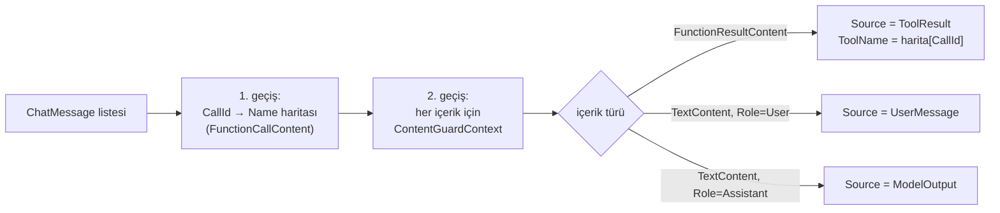

# Faz 140 — İçerik Guard'ının Kaynağı

> **Durum:** 📋 Planlandı (2026-09-03)
> **Kaynak:** [ADAYLAR.md](ADAYLAR.md) · **F-186** (tüketici turu 3, A4)
> **Önkoşul:** Yok
> **Paketler:** `AgentPrism.Abstractions`, `AgentPrism.Core`
> **Yeni paket:** Yok · **Migration:** Yok
> **Public API:** Büyüyor — `ContentGuardContext`'e iki `init` alan + yeni enum. Additive; `Unknown = 0` geriye dönük uyumludur
> **Tüketici yüzeyi:** `docs-site/`: `concepts/governance.md` (content guard bölümü), `guides/reliability.md` · sevk edilen: XML `<example>`
> **Manuel test alanı:** [`docs/manuel-test/22-GUARDRAIL-VE-YAPISAL-CIKTI.md`](manuel-test/22-GUARDRAIL-VE-YAPISAL-CIKTI.md)

---

## Bu Faza Başlarken

1. Bu doküman
2. Kararlar — yalnız bu kalemleri grep'le:
   ```bash
   grep -n "K-320" docs/KARARLAR.md
   ```
   **K-320** (🚨 Faz 48'in planı guard'ı "boru hattının en dışına" koyuyordu;
   tek bir grep o konumun tool çağrı turlarını göremediğini gösterdi ve fazın
   yarısı taşımaya dönüştü). Bu faz aynı boru hattına dokunuyor.
3. Alan hafızası:
   [`hafiza/model-boru-hatti.md`](hafiza/model-boru-hatti.md) (guard'ın
   `IChatClient` zincirindeki yeri)

---

## Amaç

Guard bugün denetlediği metnin bir **tool sonucu** mu, bir **kullanıcı mesajı**
mı, yoksa **model çıktısı** mı olduğunu ayırt edemiyor. Üçü de aynı torbaya
giriyor. Ama güven farkı büyüktür: kullanıcı mesajı bilinen bir kaynaktan gelir
ve kullanıcı yalnızca kendi oturumunu zehirleyebilir; tool sonucu **başka bir
kullanıcının** veritabanına yazdığı metni taşıyabilir.

Bu faz yeni bilgi üretmez — **zaten var olan** bir ayrımı guard'a geçirir.

- **F-186** — `ContentGuardContext`'e metnin kaynağı ve (mümkünse) tool adı.

### Bugün ne çalışmıyor — doğrulanmış kanıt

| Kanıt | Gözlem |
|---|---|
| [`ContentGuardContext.cs:25-45`](../src/AgentPrism.Abstractions/Guards/ContentGuardContext.cs) | Alanlar: `Direction`, `Text`, `RunId`, `TenantId`, `AgentName`, `ModelId`. Kaynak bilgisi **yok** |
| [`ContentGuardMessageMasker.cs:74`](../src/AgentPrism.Core/Guards/ContentGuardMessageMasker.cs) | `message.Role == ChatRole.System` — rol **zaten okunuyor** (sistem talimatı atlanıyor) |
| [`ContentGuardMessageMasker.cs:167`](../src/AgentPrism.Core/Guards/ContentGuardMessageMasker.cs) | `content is FunctionResultContent { Result: var result }` — tool sonucu **zaten ayırt ediliyor** |
| [`ContentGuardMessageMasker.cs:202-210`](../src/AgentPrism.Core/Guards/ContentGuardMessageMasker.cs) | `TextContent` ve `FunctionResultContent` ayrı ayrı ele alınıyor |
| [`ContentGuardingChatClient.cs:150`](../src/AgentPrism.Core/Guards/ContentGuardingChatClient.cs) | Girdi yolunda `ContentGuardDirection.Input` — tool sonucu da kullanıcı mesajı da aynı `Input` |

> Kanıtlar 2026-09-03 tarihinde doğrulandı.

**Sonuç:** ayrım çağrı yerinde **mevcut** ve `ContentGuardContext` kurulmadan
hemen önce **atılıyor**. Tüketicinin gerekçesi doğrudur.

---

## 140.1 — 🚨 `Source` bedava, `ToolName` değil

Bu fazın en önemli ölçümü budur ve tüketicinin raporunda **yok**.

`FunctionResultContent` tool **adını taşımaz**; yalnız `CallId` taşır. Tool adı
aynı mesaj listesindeki daha önceki bir `FunctionCallContent`'te durur.
`ToolName`'i doldurmak için `CallId → FunctionCallContent.Name` eşlemesi kuran
**ikinci bir geçiş** gerekir.



Harita **yalnız** listede en az bir `FunctionResultContent` varsa kurulur;
yoksa tahsis yapılmaz. Sıcak yol ve tahsis bütçesi korunur (Mercek 4).

🚨 **Harita eksik kalabilir.** Çok turlu bir konuşmada eski turların
`FunctionCallContent`'i baglamdan düşmüş olabilir; o durumda `CallId` eşleşmez.
`ToolName` o zaman `null` kalır ama `Source` yine `ToolResult` olur — **kaynak
bilgisi tool adına bağlı değildir.** Bu ayrım güvenlik açısından kritiktir:
guard'ın en sıkı kuralı `Source`'a bakar, `ToolName`'e değil.

## 140.2 — Kaynak kümesi

```csharp
public enum ContentGuardSource
{
    Unknown = 0,
    UserMessage = 1,
    ToolResult = 2,
    Document = 3,
    ModelOutput = 4,
    SkillResource = 5
}
```

`Unknown = 0` bilinçlidir ve iki işi vardır: geriye dönük uyum (yeni alan eski
kodda `Unknown` gelir) ve **dürüstlük** — kaynağı belirlenememiş bir metni
yanlış sınıflandırmak, sınıflandırmamaktan kötüdür.

🚨 **`Unknown` bir güvenlik kararına "izin ver" diye çevrilmemelidir.** Sevk
edilen `PatternContentGuard` ve XML dokümanı bunu açıkça yazar: bilinmeyen
kaynak **en sıkı** kuralı alır.

---

## Planlanan Public API

```csharp
// AgentPrism.Abstractions
public sealed record ContentGuardContext
{
    // mevcut: Direction, Text, RunId, TenantId, AgentName, ModelId

    /// <summary>Denetlenen metnin kaynağı.</summary>
    public ContentGuardSource Source { get; init; }

    /// <summary>
    /// Metin bir tool sonucundan geliyorsa tool'un adı; değilse null.
    /// Source == ToolResult iken de null olabilir — çağrı bağlamdan düşmüşse
    /// ad çözülemez. Güvenlik kararı Source'a dayanmalıdır, buna değil.
    /// </summary>
    public string? ToolName { get; init; }
}

public enum ContentGuardSource { Unknown = 0, UserMessage = 1, ToolResult = 2, Document = 3, ModelOutput = 4, SkillResource = 5 }
```

Yeni uç yok, yeni kayıt yok. Var olan `IContentGuard` implementasyonları
**değişmeden** çalışır.

### Arayüz payı

Yok.

---

## Planlanan Dosya Listesi

```
src/AgentPrism.Abstractions/
└── Guards/
    └── ContentGuardContext.cs            (iki alan + yeni enum)

src/AgentPrism.Core/
└── Guards/
    ├── ContentGuardMessageMasker.cs      (CallId→Name haritası, kaynak sınıflama)
    ├── ContentGuardingChatClient.cs      (kaynağı aşağı geçirir)
    ├── ContentGuardPipeline.cs           (context kurulumu)
    └── PatternContentGuard.cs            (Unknown = en sıkı kural)
```

---

## Hata Modları ve Testler

| Ne bozulabilir | Seviye | Test sınıfı |
|---|---|---|
| Tool sonucu `UserMessage` olarak sınıflanır (güvenlik kararı ters döner) | Fonksiyonel | `ContentGuardSourceTests` |
| `CallId` eşleşmeyince `Source` da `Unknown`'a düşer | Birim | `ContentGuardSourceTests` |
| `Unknown` en sıkı kural yerine izin verir | Birim | `PatternContentGuardTests` |
| Model çıktısı `ToolResult` sanılır | Fonksiyonel | `ContentGuardSourceTests` |
| Akışlı yolda kaynak kaybolur | Fonksiyonel | `StreamingGuardTests` |
| Harita her çağrıda tahsis eder (sıcak yol) | Birim (tahsis) | `ContentGuardAllocationTests` — Faz 116 kapısı |
| Var olan guard implementasyonu kırılır | Fonksiyonel | mevcut `ContentGuardTests` yeşil kalmalı |
| Aynı `CallId` iki kez geçer | Birim | `ContentGuardSourceTests` |
| Boş mesaj listesi | Birim | `ContentGuardSourceTests` |
| Başka kiracının tool adı sızar | Sözleşme | `TenantIsolationContract` (guard `TenantId` taşıyor) |

🚨 **Tool sonucunun modele **ikinci turda** geri girdiği yol fonksiyonel testle
kanıtlanır.** Kütüphanenin kendi ifadesi: *"a guard placed outside the loop
would never see it."* Birim testi bu turu kuramaz.

---

## Manuel Kabul Case'leri

| # | Ön koşul | Adımlar | Beklenen sonuç |
|---|---|---|---|
| 1 | Kaynağı loglayan guard | `support` agent'ına düz mesaj at | Guard `UserMessage` görür |
| 2 | Aynı guard | `get_order_status` tool'unu tetikleyen mesaj at | Guard ikinci turda `ToolResult` **ve** `ToolName = "get_order_status"` görür |
| 3 | Aynı guard | Model yanıtını denetle | `ModelOutput` |
| 4 | Yalnız `ToolResult`'ta blok eden guard | Kullanıcı aynı deseni **kendi** yazsın | Bloklanmaz — yanlış pozitif çözüldü |
| 5 | Aynı guard | Tool aynı deseni döndürsün | Bloklanır |
| 6 | Kaynak taşımayan eski guard | Run at | Değişmeden çalışır |

---

## Açık Sorular

| # | Soru | Seçenekler | Öneri |
|---|---|---|---|
| 1 | `Document` ve `SkillResource` bu fazda gerçekten doldurulsun mu? | A: Üçünü doldur (User/Tool/Model), ikisini enum'da bırak · B: Beşini de doldur | **A** — doküman ve skill kaynağı guard'a farklı bir yoldan giriyor; ölçülmeden doldurmak yanlış sınıflandırma üretir. Enum'da durmaları zararsız, `Unknown` dürüst kalır |
| 2 | `ToolName` `RunEvent.ToolName` ile aynı normalizasyonu mu alsın? | A: Aynı · B: Ham ad | **A** — iki yerde farklı ad taşımak korelasyonu bozar |

---

## Bitiş Ölçütleri (DoD)

- [ ] Guard bir tool sonucunu kullanıcı mesajından ayırt eder (case 2 kanıt)
- [ ] `ToolName` çözülemediğinde `Source` yine `ToolResult` kalır
- [ ] `Unknown` en sıkı kuralı alır; testle kilitlenir
- [ ] Kaynak taşımayan mevcut guard'lar değişmeden çalışır
- [ ] Sıcak yolda ek tahsis ölçüldü ve yazıldı (Faz 116 kapısı)
- [ ] Dört doğrulama kapısı sıfır uyarı verir
- [ ] `samples/AgentPrism.Api` ile gerçek `run` yapıldı, çıktı belgeye yazıldı
- [ ] `secret` taraması boş döndü
- [ ] Manuel kabul case'leri `docs/manuel-test/22-GUARDRAIL-VE-YAPISAL-CIKTI.md` içine eklendi
- [ ] `faz-denetim` koşuldu; 🔴 bulgu kalmadı
- [ ] `docs-site/` güncellendi; `npm run build` + `check-links.mjs` temiz

---

## Riskler

| Risk | Önlem |
|------|-------|
| 🚨 Guard'ın konumu yanlış varsayılır (K-320 sınıfı) | Plan konumu **ölçtü**: guard `IChatClient` zincirinde, tool çağrı döngüsünün **içinde**. Uygulama başlarken `grep` ile yeniden doğrulanır |
| `CallId` haritası sıcak yolda tahsis eder | Harita yalnız `FunctionResultContent` varsa kurulur; tahsis testi kapı |
| Yanlış sınıflandırma güvenlik kararını ters çevirir | `Unknown` en sıkı kuralı alır; üç kaynak fonksiyonel testle kilitlenir |
| Public yüzey büyür | Additive; `Unknown = 0` eski kodu bozmaz. Shipped giriş sıfır |

---

<!-- ============================================================
     AŞAĞISI KAPANIŞTA DOLDURULUR — `faz-tamamlama` skill'i.
     ============================================================ -->

## Plandan Sapmalar

> Kapanışta doldurulur.

## Bu Fazda Verilen Kararlar

> Kapanışta doldurulur.

## Gerçekleşen Public API

> Kapanışta doldurulur.

## Dosya Listesi (gerçekleşen)

> Kapanışta doldurulur.

## Denetim Bulguları

> Kapanışta doldurulur.

## Sonraki Faza Devir Notu

> Kapanışta doldurulur.
