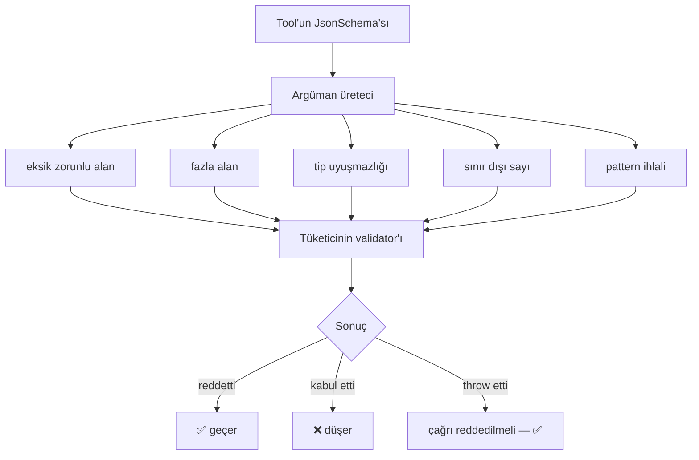

# Faz 143 — Tool Argümanının Sözleşme Testleri

> **Durum:** 📋 Planlandı (2026-09-03)
> **Kaynak:** [ADAYLAR.md](ADAYLAR.md) · **F-189** (tüketici turu 3, B7)
> **Önkoşul:** Yok
> **Paketler:** `AgentPrism.Testing.Contracts.Xunit`
> **Yeni paket:** Yok — mevcut sözleşme paketine ek (K-605 ile sevk edildi) · **Migration:** Yok
> **Public API:** Büyüyor — yeni `abstract` sözleşme sınıfları. Yalnız test paketinde; tüketicinin çalışma anı grafiğine **girmez**
> **Tüketici yüzeyi:** `docs-site/`: `guides/testing.md`, `guides/write-your-own-tool.md`, `packages.md` · sevk edilen: `src/AgentPrism.Testing.Contracts.Xunit/README.md`
> **Manuel test alanı:** [`docs/manuel-test/24-TEST-PAKETI-VE-SABLON.md`](manuel-test/24-TEST-PAKETI-VE-SABLON.md)

---

## Bu Faza Başlarken

1. Bu doküman
2. Kararlar — yalnız bu kalemleri grep'le:
   ```bash
   grep -n "K-605\|K-615" docs/KARARLAR.md
   ```
   **K-605** (`AgentPrism.Testing.Contracts.Xunit` paketi ve ad alanı kararı),
   **K-615** (generator kendi `JsonSerializerContext`'ini kullanmaz; tool sahibi
   `AgentPrismToolAttribute.JsonSerializerContext` ile verir, vermezse derleme
   `APG0008` ile durur)
3. Mevcut sözleşme desenini oku — **yalnız bu iki dosya**:
   ```bash
   sed -n '1,60p' src/AgentPrism.Testing.Contracts.Xunit/Contracts/Tools/CustomToolContract.cs
   sed -n '1,40p' src/AgentPrism.Testing.Contracts.Xunit/Contracts/Tools/RepeatableToolContract.cs
   ```
4. Alan hafızası:
   [`hafiza/analyzer-yazimi.md`](hafiza/analyzer-yazimi.md) (şema üretimi)

---

## Amaç

AgentPrism iki yerde fail-closed davranış **vaat ediyor**: `throw` eden bir
argüman doğrulayıcı çağrıyı reddeder, `throw` eden bir yetkilendirme handler'ı
çağrıyı engeller. Bu vaatler AgentPrism'in **kendi** kodunda test ediliyor —
ama **tüketicinin** implementasyonunda test edilmiyor.

Tüketicinin ölçümü: yirmi iki tool'un yedisi yıkıcı. Ve deneyimleri şunu
söylüyor: AI'ın halüsinasyon ürettiği argüman, kod hatasından **daha sık** bir
gerçek hata kaynağı.

- **F-189** — Bir tool'un `JsonSchema`'sından argüman üretip fuzz eden ve
  tüketicinin doğrulayıcısının fail-closed davrandığını iddia eden sözleşme
  suite'i.

### Bugün ne çalışmıyor — doğrulanmış kanıt

| Kanıt | Gözlem |
|---|---|
| `ls src/AgentPrism.Testing.Contracts.Xunit/Contracts/Tools/` | Yalnız **iki** dosya: `CustomToolContract.cs`, `RepeatableToolContract.cs` |
| [`CustomToolContract.cs:6`](../src/AgentPrism.Testing.Contracts.Xunit/Contracts/Tools/CustomToolContract.cs) | `abstract class CustomToolContract : IAsyncLifetime` — kaydı kanıtlar, argüman güvenliğini **değil** |
| [`IToolArgumentsValidator.cs:25-27`](../src/AgentPrism.Abstractions/Tools/IToolArgumentsValidator.cs) | *"If this validator throws, the call is **rejected** (fail-closed)."* — vaat yazılı |
| [`ToolAuthorizationTypes.cs`](../src/AgentPrism.Abstractions/Tools/ToolAuthorizationTypes.cs) | *"If this handler throws, the call is **denied**."* — ikinci vaat |
| `ls .../Contracts/` | 33 store sözleşmesi var; tool tarafında argüman güvenliği yok |

> Kanıtlar 2026-09-03 tarihinde doğrulandı.

---

## 143.1 — Suite ne iddia eder

Sözleşme, tüketicinin **kendi** `IToolArgumentsValidator` ve
`IToolAuthorizationHandler` implementasyonunu hedefler.



🚨 **Suite bir doğrulayıcı sevk etmez.** Kütüphanenin duruşu korunur:
*"AgentPrism does not ship a built-in JSON Schema validator — validation stays
inside the consumer's own trust boundary."* Bu faz o duruşu değiştirmez;
tüketicinin **kendi** doğrulayıcısını sınar.

## 143.2 — Üreteç determinist olmalıdır

Fuzz üreteci rastgele değil **tohumlu** (seeded) çalışır. Gerekçe: düşen bir
sözleşme testi tekrar üretilebilir olmalıdır. Tohum test çıktısına yazılır;
düşen vaka tohumla birebir tekrarlanır.

🚨 **Rastgele bir suite kırılgan bir kapıdır** ve bu repo kırılgan testi
kusurdan ayırmak için ayrı bir protokol taşıyor (`kusur-giderme` Adım 2). Yeni
bir kırılganlık kaynağı eklenmez.

## 143.3 — Şema nereden gelir

Tool'un `JsonSchema`'sı zaten üretiliyor. 🚨 Ama K-615 uyarısı burada geçerli:
generator kendi `JsonSerializerContext`'ini kullanmaz. Suite şemayı **çalışma
anında** `AIFunction`'dan okur, generator'ın iç yapısına bağlanmaz.

**Doğrulanmadı — uygulamada ölçülmeli:** `AIFunction.JsonSchema`'nın tam tipi ve
üye adı. `maf-api-kesfi` ile doğrulanacak; tahmin edilmeyecek.

---

## Planlanan Public API

```csharp
// AgentPrism.Testing.Contracts.Tools
public abstract class ToolArgumentValidationContract : IAsyncLifetime
{
    /// <summary>Sınanacak tool.</summary>
    protected abstract AIFunction Tool { get; }

    /// <summary>Tüketicinin kendi doğrulayıcısı.</summary>
    protected abstract IToolArgumentsValidator Validator { get; }

    /// <summary>Tekrar üretilebilirlik için tohum. Varsayılan sabittir.</summary>
    protected virtual int Seed => 20260903;

    [Fact] public Task Missing_required_argument_is_rejected();
    [Fact] public Task Type_mismatch_is_rejected();
    [Fact] public Task Out_of_range_number_is_rejected();
    [Fact] public Task Pattern_violation_is_rejected();
    [Fact] public Task Unknown_extra_property_is_handled_deliberately();
    [Fact] public Task Throwing_validator_rejects_the_call();
}

public abstract class ToolAuthorizationContract : IAsyncLifetime
{
    protected abstract IToolAuthorizationHandler Handler { get; }

    [Fact] public Task Throwing_handler_denies_the_call();
    [Fact] public Task Denied_call_never_runs_the_tool_body();
    [Fact] public Task Handler_receives_the_calling_tenant();
}
```

### Arayüz payı

Yok.

---

## Planlanan Dosya Listesi

```
src/AgentPrism.Testing.Contracts.Xunit/
├── Contracts/Tools/
│   ├── ToolArgumentValidationContract.cs  (yeni)
│   └── ToolAuthorizationContract.cs       (yeni)
├── Internal/
│   └── SchemaArgumentGenerator.cs         (yeni — tohumlu üreteç)
└── README.md                              (iki suite belgelenir)

tests/AgentPrism.Testing.Contracts.Tests/
└── (suite'lerin kendi kanıtı — kasten hatalı bir validator DÜŞMELİ)
```

---

## Hata Modları ve Testler

> 🚨 Bu faz **test yazan** bir fazdır. En büyük riski **test tiyatrosudur**:
> her zaman geçen bir suite hiçbir şey kanıtlamaz.

| Ne bozulabilir | Seviye | Test sınıfı |
|---|---|---|
| 🚨 Suite kasten hatalı bir validator'da da **geçer** (tiyatro) | Fonksiyonel | `ContractSelfProofTests` — her `[Fact]` için **düşen** bir karşı örnek |
| Üreteç rastgele; suite kırılgan olur | Birim | `SchemaArgumentGeneratorTests` — aynı tohum aynı çıktı |
| Şema okunamayınca suite sessizce **atlar** | Birim | `SchemaArgumentGeneratorTests` — okunamayan şema **hata** vermeli |
| `throw` eden validator'da çağrı **geçer** | Fonksiyonel | `ToolArgumentValidationContract` kendi kanıtı |
| Reddedilen çağrıda tool gövdesi **çalışır** | Fonksiyonel | `ToolAuthorizationContract` kendi kanıtı |
| Nested object şeması üretilemez (K-615 sınırı) | Birim | `SchemaArgumentGeneratorTests` — desteklenmeyen şema **açıkça** atlanır ve sebebi yazılır |
| Suite tüketicinin çalışma anı grafiğine paket sızdırır | Paket | `DependencyDirectionTests` |
| Boş şemalı tool | Birim | `SchemaArgumentGeneratorTests` |
| İptal edilen doğrulama | Fonksiyonel | `ToolArgumentValidationContract` |

🚨 **`ContractSelfProofTests` bu fazın en önemli testidir.** Bir sözleşme
suite'i ancak **düşmesi gereken bir implementasyonda düştüğü** kanıtlanırsa
değerlidir. Her `[Fact]` için kasten kırık bir karşı örnek yazılır ve o karşı
örneğin **kırmızı** olduğu görülür.

---

## Manuel Kabul Case'leri

| # | Ön koşul | Adımlar | Beklenen sonuç |
|---|---|---|---|
| 1 | Örnek tool + doğru validator | Suite'i türet ve koş | Altı `[Fact]` geçer |
| 2 | Aynı tool + her şeyi kabul eden validator | Suite'i koş | 🚨 **Düşer** — tiyatro yok |
| 3 | `throw` eden validator | Suite'i koş | "çağrı reddedilir" `[Fact]`'i geçer |
| 4 | Aynı suite, iki kez | İki kez koş | Aynı sonuç — tohum sabit |
| 5 | Nested object şemalı tool | Suite'i koş | Desteklenmeyen vaka **açıkça** atlanır, sebep yazılır |
| 6 | Tüketici projesi | Paketi referansla, çalışma anı grafiğini incele | Test paketi üretime **sızmaz** |

---

## Açık Sorular

| # | Soru | Seçenekler | Öneri |
|---|---|---|---|
| 1 | "Fazla alan" reddedilmeli mi kabul mü? | A: Suite karar dayatmaz, tüketici beyan eder · B: Reddi zorunlu kıl | **A** — JSON Schema'da `additionalProperties` bir tercihtir; kütüphane kalite barı dayatmaz (F-168'in dersi) |
| 2 | Nested object desteklenmezse suite ne yapsın? | A: Açıkça atla + sebep · B: Düş | **A** — K-615 nested object'i zaten sınırlıyor; düşmek yanlış sinyal olur. Ama sessiz atlama da kabul edilmez: sebep **yazılır** |
| 3 | Suite `AIFunction` mı `ToolDescriptor` mü alsın? | A: `AIFunction` · B: `ToolDescriptor` | **A** — K3: MAF tipi doğrudan kullanılır, sarmalanmaz. 🚨 İmza `maf-api-kesfi` ile doğrulanmalı |

---

## Bitiş Ölçütleri (DoD)

- [ ] Suite doğru bir validator'da geçer, **kabul eden** bir validator'da **düşer** (case 1 + 2)
- [ ] Her `[Fact]` için kasten kırık karşı örnek yazıldı ve kırmızı olduğu görüldü
- [ ] Aynı tohum aynı argümanları üretir; suite kırılgan değil
- [ ] Desteklenmeyen şema **açıkça** atlanır ve sebebi çıktıya yazılır
- [ ] `AIFunction.JsonSchema` imzası `maf-api-kesfi` ile doğrulandı (tahmin edilmedi)
- [ ] Test paketi tüketicinin çalışma anı grafiğine sızmaz (`DependencyDirectionTests`)
- [ ] Dört doğrulama kapısı sıfır uyarı verir
- [ ] `samples/AgentPrism.Api` ile gerçek `run` yapıldı, çıktı belgeye yazıldı
- [ ] `secret` taraması boş döndü
- [ ] Manuel kabul case'leri `docs/manuel-test/24-TEST-PAKETI-VE-SABLON.md` içine eklendi
- [ ] `faz-denetim` koşuldu; 🔴 bulgu kalmadı
- [ ] `docs-site/` güncellendi; `npm run build` + `check-links.mjs` temiz

---

## Riskler

| Risk | Önlem |
|------|-------|
| 🚨 **Test tiyatrosu** — suite her zaman geçer | `ContractSelfProofTests`: her `[Fact]` için düşen karşı örnek. DoD'de ayrı satır |
| Rastgele üreteç kırılgan kapı üretir | Tohum sabit; aynı tohum aynı çıktı, testle kilitli |
| MAF imzası tahmin edilir | 🚨 `maf-api-kesfi` zorunlu; plan imzayı **doğrulanmadı** diye işaretledi |
| Suite bir doğrulayıcı sevk etmeye kayar | Kapsam açık: suite sınar, sevk etmez. Kütüphanenin güven sınırı duruşu korunur |
| K-615 nested object sınırı suite'i düşürür | Açık Soru 2 karara bağlar; sessiz atlama yasak |

---

<!-- ============================================================
     AŞAĞISI KAPANIŞTA DOLDURULUR — `faz-tamamlama` skill'i.
     ============================================================ -->

## Plandan Sapmalar

> Kapanışta doldurulur.

## Bu Fazda Verilen Kararlar

> Kapanışta doldurulur.

## Gerçekleşen Public API

> Kapanışta doldurulur.

## Dosya Listesi (gerçekleşen)

> Kapanışta doldurulur.

## Denetim Bulguları

> Kapanışta doldurulur.

## Sonraki Faza Devir Notu

> Kapanışta doldurulur.
