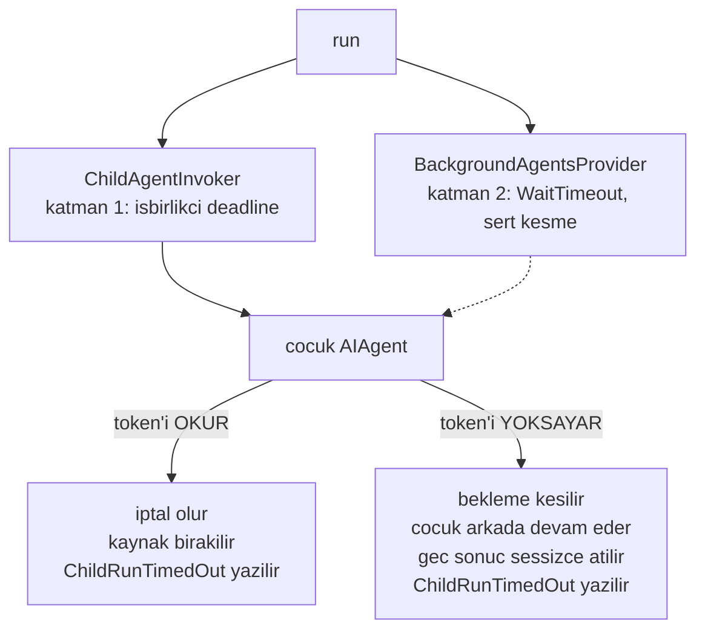
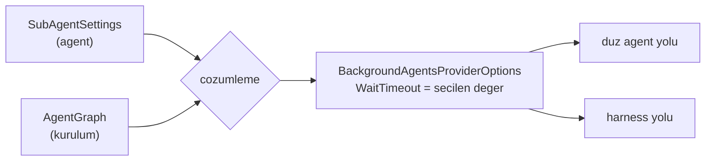

# Faz 144 — Alt-Agent Bekleme Sınırı

> **Durum:** ✅ Tamamlandı (2026-09-05)
> **Kaynak:** [ADAYLAR.md](ADAYLAR.md) · **F-191**
> **Önkoşul:** Yok. Kalemin tek bağımlılığı MAF 1.20.0 yükseltmesiydi; 2026-09-05'te yapıldı ve HEAD'dedir (`Directory.Packages.props:19`).
> **Paketler:** `AgentPrism.Abstractions`, `AgentPrism.Core`
> **Yeni paket:** Yok · **Migration:** Yok — yeni bir `RunEventType` üyesi şema değiştirmez (`run_events.type` zaten `smallint`)
> **Public API:** Büyüyor — Faz 7'den önce ucuz. Ölçüldü (2026-09-05): `wc -l src/*/PublicAPI.Shipped.txt` → tüm paketlerde **17 satır** (dosyalar boş). Aynı yüzeyi Faz 7'den sonra eklemek kırıcı olurdu
> **Tüketici yüzeyi:** `docs-site/src/content/docs/concepts/agents.md` (alt-agent bölümü) · `capabilities.md` (bir satır) · sevk edilen: `SubAgentSettings` XML `<example>`'ı
> **Manuel test alanı:** [`docs/manuel-test/21-DAYANIKLILIK-VE-IPTAL.md`](manuel-test/21-DAYANIKLILIK-VE-IPTAL.md) — case'ler oraya eklenir

---

## Bu Faza Başlarken

> `faz-baslangic` skill'ini uygula. Aşağıdaki liste o skill'in 2. adımıdır —
> **tamamını değil, yalnız işaret edilen bölümleri oku.**

1. Bu doküman

2. Kararlar — dosyanın tamamını **okuma**, yalnız bu üç kalemi grep'le:

   ```bash
   grep -n "K-621" docs/KARARLAR.md
   grep -n "K-097\|K-062" docs/arsiv/KARARLAR-GECMISI.md
   ```

   **K-621** — bu fazın semantik emsalidir: `JudgeTimeout` işbirlikçi iptal
   değil **gerçek bekleme kesmesi**dir; token'ı yok sayan gövde öldürülmez,
   arkada tamamlanır, geç sonuç sessizce atılır ve unobserved exception
   üretmez. Bu faz aynı sözleşmeyi alt-agent'lara taşır — **yeni bir semantik
   icat etme.**
   **K-097** — alt agent yolu `AIContextProviders` üzerinden kurulur,
   `BackgroundAgentsProvider` için `MAAI001` bastırılır.
   **K-062** — harness'ta arka plan agent'ları yalnız değer atandığında açılır.

3. [`arsiv/fazlar/143-TOOL-ARGUMANININ-SOZLESME-TESTLERI.md`](arsiv/fazlar/143-TOOL-ARGUMANININ-SOZLESME-TESTLERI.md)
   — yalnız devir notu:

   ```bash
   awk '/## Sonraki Faza Devir Notu/,0' docs/arsiv/fazlar/143-TOOL-ARGUMANININ-SOZLESME-TESTLERI.md
   ```

4. Alan hafızası (bu faz iki alana dokunuyor):
   [`hafiza/cekirdek-calistirma.md`](hafiza/cekirdek-calistirma.md) — `run`
   kaydı zinciri, `scope`, olay yazımı ve iptal; bu fazın olay yazma yolu
   oradadır.
   [`hafiza/maf-api.md`](hafiza/maf-api.md) — `MAAI001`, `BackgroundAgentsProvider`
   ve alt agent'ın `options = null` ile çağrılması.

5. Gerektiğinde, tamamı değil ilgili bölümü:
   [`MAF-GENISLEME-NOKTALARI.md`](MAF-GENISLEME-NOKTALARI.md) § *Sürüm damgası*
   — `WaitTimeout`'un hangi sürümle geldiği ve neyin kullanılmadığı.

---

## Amaç

AgentPrism bir agent'ın başka bir agent'ı çağırmasına izin verir. Bugün o
çağrının ne kadar bekleyeceğine dair **AgentPrism'in seçtiği** hiçbir sınır
yoktur. Bu faz sınırı iki katmanda kurar, sayıyı AgentPrism'e seçtirir ve
zaman aşımını `run` kanıtına yazar.

- **F-191** — alt-agent beklemesine işbirlikçi bir deadline ve sert bir bekleme
  kesmesi koy; ikisini de tüketiciye ayar olarak aç; aşımı `run` olayı olarak kaydet.

### Bugün ne çalışmıyor — doğrulanmış kanıt

| Kanıt | Gözlem |
|---|---|
| [`ChildAgentInvoker.cs`](../src/AgentPrism.Core/Graph/ChildAgentInvoker.cs) | 390 satır. `CancelAfter\|Deadline\|TimeSpan\|WaitTimeout` için **sıfır** eşleşme. Yalnız çağırandan gelen `CancellationToken` taşınıyor |
| [`AgentDefinitionCompiler.Agents.cs:122`](../src/AgentPrism.Core/Compilation/AgentDefinitionCompiler.Agents.cs#L122) | Düz agent yolu: `new BackgroundAgentsProviderOptions()` — tüm varsayılanlar |
| [`AgentDefinitionCompiler.Agents.cs:213`](../src/AgentPrism.Core/Compilation/AgentDefinitionCompiler.Agents.cs#L213) | Harness yolu: `options.BackgroundAgents = children` set ediliyor, `BackgroundAgentsProviderOptions` **hiç** set edilmiyor |
| `grep -rln "sub-agent timeout\|alt-agent zaman aşımı" docs/ src/` | **Sıfır** dosya. Konu hiçbir yerde kayıtlı değil |
| [`ChildAgentInvoker.cs:257-269`](../src/AgentPrism.Core/Graph/ChildAgentInvoker.cs#L257) | `ChildRunStarted` ve `ChildRunCompleted` yazılıyor; zaman aşımı için olay **yok** |

> Kanıtlar 2026-09-05 tarihinde doğrulandı.

### Yükseltmenin bu kalemi ne kadar kapattığı — ölçüldü

MAF 1.20.0 `BackgroundAgentsProviderOptions.WaitTimeout` ekledi. Probe ile
ölçüldü (2026-09-05):

| Ölçüm | Sonuç |
|---|---|
| `new BackgroundAgentsProviderOptions().WaitTimeout` | **`00:05:00`** — tam beş dakika |
| `new HarnessAgentOptions().BackgroundAgentsProviderOptions` | **`NULL`** |

Yani **düz agent yolunun** süresiz asılma riski yükseltmeyle, kod yazılmadan
kapandı. Harness yolunda MAF'ın `null` gördüğünde ne yaptığı **reflection ile
görünmez**. Bu faz o belirsizliği ölçerek değil, **ortadan kaldırarak** çözer:
nesneyi iki yolda da AgentPrism kurar (§144.4).

Kalemin bugünkü gerekçesi üç maddededir ve üçü de yükseltmeden **sonra** geçerlidir:

1. Harness yolunun sınırı AgentPrism tarafından kurulmuyor.
2. Beş dakika AgentPrism'in seçtiği bir sayı değil, MAF'ın varsayılanı.
3. 🚨 Zaman aşımı `run` kanıtına **hiçbir şey** yazmıyor. MAF'ın kendi kaydı
   zaman aşımının alt görevleri **iptal etmediğini** söylüyor — yani bugün
   sessizce beş dakika bekleyip devam eden bir `run` mümkündür ve nöbetçi
   mühendis bunu kayıttan göremez. Bu üçüncü madde tek başına bir faz gerekçesidir.

---

## 144.1 — İki katmanlı sınır

MAF'ın `WaitTimeout`'u bir **bekleme kesmesidir**, bir iptal değil. MAF'ın kendi
kaydı açıkça söylüyor: *"Timeout does not cancel or remove child tasks."*
Tek başına kullanılırsa asılan çocuk süreç ömrü boyunca arka planda kalır.

Bu yüzden sınır iki katmanda kurulur. Desen **K-621'in aynısıdır** ve bilerek
tekrarlanır: yargıçlar için kurulmuş sözleşmeyi alt-agent'lar için yeniden icat
etmek iki farklı zaman aşımı semantiği üretirdi.



**Katman 1 — `ChildAgentInvoker` deadline'ı.** Çağırandan gelen token ile
AgentPrism'in deadline'ı `CreateLinkedTokenSource` ile birleştirilir ve
`CancelAfter(deadline)` uygulanır. Token'ı okuyan çocuk gerçekten iptal olur ve
kaynağını bırakır.

**Katman 2 — `BackgroundAgentsProviderOptions.WaitTimeout`.** Token'ı yok sayan
bir çocuk için sert bekleme kesmesi. Katman 1'in yakalayamadığı tek durumu
kapatır.

🚨 **İki katmanın sayısı aynı değildir.** Katman 2, katman 1'den **sonra**
tetiklenmelidir; yoksa sert kesme işbirlikçi iptale hiç şans tanımaz ve katman 1
ölü kod olur. Kural: `WaitTimeout > ChildDeadline`. Farkın nasıl türetileceği
Açık Soru 1'dir.

### Geç sonucun akıbeti — K-621 sözleşmesi

Katman 2 kestikten sonra çocuk tamamlanırsa sonucu **sessizce atılır**. Bu
sonuç:

- `run` kanıtına **yazılmaz** (aksi hâlde zaman aşımından sonra olay gelirdi)
- metrik **üretmez**
- unobserved exception **üretmez** — `Task` gözlemlenir, sonucu atılır

Bu, K-621'in yargıçlar için yazdığı davranışın birebir aynısıdır.

---

## 144.2 — Ayarın yeri

Bugün `AgentDefinition.CallableAgentNames` yalnız bir ad listesidir; alt-agent
davranışı için ayar nesnesi yoktur. Bu faz deseni tamamlar.

**Agent başına:** yeni `SubAgentSettings` kaydı, `CompactionSettings` ·
`MemorySettings` · `HarnessSettings` deseninde — `AgentPrism.Abstractions`
içinde `sealed record`, `null` bırakılabilir.

**Global varsayılan:** [`AgentPrismAgentGraphOptions`](../src/AgentPrism.Core/AgentPrismOptions.cs#L154).
Bu sınıf zaten alt-agent ağacının sınırlarını taşıyor (`MaxDepth = 3`,
`MaxTotalTokens = 200_000`) ve XML dokümanı bu fazın gerekçesini önceden
yazmış: *"The default intentionally exists. An unlimited installation learns
about its first invalid definition from the bill."* Bekleme sınırı oraya, bu
iki üyenin yanına girer — yeni bir seçenek sınıfı açılmaz.

Çözümleme sırası: `SubAgentSettings` (agent) → `AgentPrismAgentGraphOptions`
(kurulum) → MAF varsayılanı. K1 gereği yeni genişleme noktası **varsayılan
kapalı** gelmez; burada varsayılan **açıktır** ve bu bilinçlidir — `MaxDepth`
ile aynı gerekçe: sınırsız bir kurulum ilk asılmayı faturadan öğrenir. Plan bunu
bir karar olarak kaydeder.

### Doğrulama

Geçersiz kombinasyon **derleme anında** reddedilir, sessizce yok sayılmaz —
`CompactionSettings`'in deseni budur. Reddedilecek durumlar:

- negatif veya sıfır süre
- `WaitTimeout <= ChildDeadline` (katman 2 katman 1'i etkisiz kılar)

Hata tipi `AgentPrismCompilationException`, `AgentName` alanı dolu.

---

## 144.3 — Zaman aşımının `run` kanıtına yazılması

`ChildAgentInvoker` bugün iki olay yazıyor: `ChildRunStarted = 8` ve
`ChildRunCompleted = 9`. Üçüncüsü eklenir.

> 🚨 **Yeni üyenin numarası 30'dur. 29 ALINAMAZ ve araya EKLEME YAPILAMAZ.**
> `RunEventType.Custom = 29` son üyedir (Faz 141) ve `run_events.type` sütunu
> `smallint`'tir — enum'un **sayısal değeri veritabanında durur**
> ([`0001_initial.sql:174`](../src/AgentPrism.PostgreSql/Migrations/0001_initial.sql#L174)).
> Araya eklemek `Custom`'ı 30'a kaydırır ve saklanmış her `Custom` olayı
> sessizce yanlış tipe döner. Bu bir migration ile geri alınamaz; olay geçmişi
> bozulur.

Olay `ChildAgentInvoker.WriteAsync` üzerinden, var olan desenle yazılır:
`Text = _childName`, `Payload` alt `run` kimliği. Zaman aşımı payload'ı ayrıca
**hangi katmanın** kestiğini taşımalıdır — işbirlikçi iptal ile sert kesme
operasyonel olarak farklı şeylerdir: birincisi kaynak bıraktı, ikincisi
bırakmadı ve arka planda hâlâ bir görev var.

---

## 144.4 — Harness yolunda belirsizliğin kaldırılması

Bugün harness yolunda `BackgroundAgentsProviderOptions` `null`'dır ve MAF'ın
orada varsayılan bir nesne kurup kurmadığı ölçülmemiştir. Bu faz o soruyu
**ölçmez, ortadan kaldırır**: nesneyi AgentPrism iki yolda da kendisi kurar.



Böylece iki yol aynı sayıyı kullanır, davranış MAF'ın `null` semantiğine
bağımlı olmaktan çıkar ve bir sonraki MAF sürümünün o semantiği değiştirmesi
bizi etkilemez.

---

## Planlanan Public API

> Taslak imzalardır. Gerçekleşen imzalar kapanışta ayrı bir bölüme yazılır.

```csharp
// AgentPrism.Abstractions
/// <summary>Determines how long an agent waits for the agents it calls.</summary>
public sealed record SubAgentSettings
{
    /// <summary>Gets the deadline applied to a single sub-agent run (layer 1).</summary>
    public TimeSpan? ChildDeadline { get; init; }

    /// <summary>Gets the hard wait cutoff handed to the framework (layer 2).</summary>
    public TimeSpan? WaitTimeout { get; init; }
}

// AgentPrism.Abstractions — AgentDefinition
public SubAgentSettings? SubAgents { get; init; }

// AgentPrism.Abstractions — RunEventType
/// <summary>A sub-agent run passed its wait limit.</summary>
ChildRunTimedOut = 30,

// AgentPrism.Core — AgentPrismAgentGraphOptions
public TimeSpan ChildDeadline { get; set; } = <deger>;
public TimeSpan WaitTimeout  { get; set; } = <deger>;
```

`AgentDescriptor` da `CallableAgentNames` taşıyor; alt-agent ayarının
descriptor'a yansıyıp yansımayacağı Açık Soru 2'dir.

### HTTP `endpoint`'leri

Yeni uç **yok**. Var olan agent tanımı uçları `SubAgents` alanını taşır;
`.Produces` üstverisi değişmez.

### Arayüz payı

Yok — bu faz arayüze dokunmaz. Zaman aşımı olayı var olan `run` olay akışında
görünür ve olay listesi tipe göre genel olarak render edilir. 🚨 Uygulayan
oturum bunu **doğrulamalıdır**: olay tipi için elle yazılmış bir etiket haritası
varsa `en.ts` + `tr.ts` anahtarı gerekir ve eksik anahtar derleme hatasıdır
(K-228).

---

## Planlanan Dosya Listesi

```
src/AgentPrism.Abstractions/
├── Agents/
│   └── SubAgentSettings.cs            (yeni)
├── Agents/AgentDefinition.cs          (alan eklenir)
└── Runs/RunEventType.cs               (uye eklenir — 30)

src/AgentPrism.Core/
├── AgentPrismOptions.cs               (AgentPrismAgentGraphOptions'a iki uye)
├── AgentPrismOptionsValidator.cs      (dogrulama)
├── Compilation/
│   └── AgentDefinitionCompiler.Agents.cs   (iki kurulum noktasi)
└── Graph/
    └── ChildAgentInvoker.cs           (katman 1 + olay)

tests/
├── AgentPrism.Core.UnitTests/         (cozumleme sirasi, dogrulama)
└── AgentPrism.Core.FunctionalTests/   (gercek asilma, iki katman, olay)
```

---

## Hata Modları ve Testler

> Mutlu yoldan değil, **ne bozulabilir**den türetilir. Seviyeyi plan seçer.

| Ne bozulabilir | Seviye | Test sınıfı |
|---|---|---|
| Token'ı **okuyan** asılı çocuk katman 1'de iptal olmuyor | Fonksiyonel | `SubAgentTimeoutTests` |
| Token'ı **yok sayan** asılı çocuk katman 2'de kesilmiyor, `run` süresiz asılıyor | Fonksiyonel | `SubAgentTimeoutTests` |
| Zaman aşımından **sonra** tamamlanan çocuk `run` kanıtına olay yazıyor (K-621 ihlali) | Fonksiyonel | `SubAgentTimeoutTests` |
| Geç tamamlanan çocuk **unobserved exception** üretiyor (K-621 ihlali) | Fonksiyonel | `SubAgentTimeoutTests` |
| Çözümleme sırası yanlış — agent ayarı kurulum varsayılanını ezmiyor | Birim | `SubAgentSettingsResolutionTests` |
| `WaitTimeout <= ChildDeadline` derleme anında reddedilmiyor, sessizce geçiyor | Birim | `AgentPrismOptionsValidatorTests` |
| **Harness** yolunda ayar uygulanmıyor (yalnız düz agent yolu düzeltilmiş) | Fonksiyonel | `SubAgentTimeoutTests` — **iki yol da ayrı case** |
| Çağıranın kendi iptali zaman aşımı yokken de çalışıyor (regresyon) | Fonksiyonel | `SubAgentTimeoutTests` |
| Başka kiracının `run`'ı bu olayı görüyor | Sözleşme (`TenantIsolationContract`) | dört koşumda birden |
| `store` olayı yazamazsa `run` düşüyor (gözlemlenebilirlik işlevselliği bozmamalı) | Fonksiyonel | `SubAgentTimeoutTests` |
| `RunEventType.Custom`'ın sayısal değeri kaymış | Birim | `RunEventTypeTests` — `(int)Custom == 29` iddiası |

Beş soru ve cevapları: **iptal** — çağıranın token'ı ile deadline birleştirilir,
ayrı case. **Eşzamanlılık** — birden çok çocuk aynı anda; ilki zaman aşımına
uğrarken diğeri tamamlanır. **Boş/aşırı girdi** — negatif, sıfır ve `TimeSpan.MaxValue`
doğrulamada reddedilir. **Başka kiracı** — sözleşme testi. **Alt sistem hatası** —
olay yazıcısı hata verirse `run` devam eder.

---

## Manuel Kabul Case'leri

| # | Ön koşul | Adımlar | Beklenen sonuç |
|---|---|---|---|
| 1 | `samples/AgentPrism.Api` ayakta; asılan bir alt-agent tanımlı | Kök agent'ı çalıştır, alt-agent'ı çağırt | `run` deadline süresinde biter; olay akışında `ChildRunTimedOut` görünür ve hangi katmanın kestiğini söyler |
| 2 | Aynı kurulum, harness'li kök agent | Aynı çağrı | Aynı sonuç — **harness yolu düz agent yoluyla aynı davranır** |
| 3 | `SubAgents.ChildDeadline` agent tanımında verilmiş | Çalıştır | Kurulum varsayılanı değil, agent'ın değeri uygulanır |
| 4 | `WaitTimeout <= ChildDeadline` yapılandırılmış | Uygulamayı başlat | `AgentPrismCompilationException`, mesaj agent adını taşır; sessiz kabul yok |
| 5 | Zaman aşımı olan bir `run` | `GET /agentprism/api/runs/{id}/events` | Zaman aşımından sonra çocuğa ait **hiçbir** olay yok |

---

## Açık Sorular

| # | Soru | Seçenekler | Öneri |
|---|---|---|---|
| 1 | İki katmanın varsayılan sayıları ne olsun ve `WaitTimeout` `ChildDeadline`'dan nasıl türesin? | A: iki bağımsız varsayılan · B: `ChildDeadline` verilir, `WaitTimeout = ChildDeadline + sabit pay` · C: `WaitTimeout` verilir, `ChildDeadline = WaitTimeout − pay` | **B** — tüketici tek bir sayı düşünür, katman 2 otomatik olarak sonra tetiklenir ve `WaitTimeout > ChildDeadline` kuralı yapıca garanti olur. Payın büyüklüğü uygulama anında ölçülür |
| 2 | `SubAgentSettings` `AgentDescriptor`'a yansıtılsın mı? | A: yansıtılsın (arayüz ve katalog görür) · B: yalnız `AgentDefinition`'da kalsın | **B** — descriptor tüketiciye dönük bir özettir; bekleme sınırı operasyonel bir ayardır. Sonradan eklemek kırıcı değildir |
| 3 | Zaman aşımı `run`'ı düşürsün mü, yoksa `run` kısmi sonuçla devam mı etsin? | A: `run` hata ile biter · B: `run` devam eder, olay kanıta yazılır | **B** — MAF zaten çocuğu iptal etmiyor ve kök agent modele "alt görev yanıt vermedi" bilgisiyle devam edebilir. A, bugünkü davranışa göre bir gerileme olur |

---

## Bitiş Ölçütleri (DoD)

- [x] Token'ı okuyan asılı bir alt-agent, `ChildDeadline` süresinde iptal olur; `run` biter — `Cooperative_layer_cancels_a_child_that_reads_the_token` (`SubAgentTimeoutTests`) + gerçek koşum (aşağıya bkz.)
- [x] Token'ı yok sayan asılı bir alt-agent, `WaitTimeout` süresinde beklemeden düşer; `run` biter — `Hard_cutoff_abandons_a_child_that_ignores_cancellation`
- [x] İki davranış **harness yolunda da** kanıtlanır (ayrı test case'i) — `Harness_path_produces_the_same_hard_cutoff_behavior`, `Harness_path_produces_the_same_cooperative_layer_behavior`
- [x] Zaman aşımından sonra tamamlanan çocuk hiçbir olay, metrik veya unobserved exception üretmez — aynı test dosyası, `Release` çağrısından sonra olay sayısı sabit kaldığı ölçüldü
- [x] `(int)RunEventType.Custom == 29` testi yeşil — `RunEventTypeTests.Custom_stays_29`
- [x] Dört doğrulama kapısı sıfır uyarı verir — `python3 scripts/kapi.py kapanis --taban 3a729fd0` (bkz. Denetim Bulguları'ndaki iki tur)
- [x] `samples/AgentPrism.Api` ile gerçek `run` yapıldı, çıktı belgeye yazıldı — bkz. "Gerçek koşum" altında
- [x] `secret` taraması boş döndü — `kapi.py tarama` içinde (kapanışın ilk adımı)
- [x] Manuel kabul case'leri `docs/manuel-test/21-DAYANIKLILIK-VE-IPTAL.md` içine eklendi; otomatikleştirilebilenler koşuldu — `MT-RES-080`..`084`
- [x] `faz-denetim` koşuldu; 🔴 bulgu kalmadı — **bağımsız değil, uygulayan oturumun kendi kendine denetimi** (bkz. Denetim Bulguları'ndaki uyarı); yedi bulgunun hepsi kapatıldı
- [x] `docs-site/concepts/agents.md` ve `capabilities.md` güncellendi; `npm run build` + `check-links.mjs` temiz — `npm run check` (dördü de: content/build/links/weight) temiz

### Gerçek koşum (`samples/AgentPrism.Api`, gerçek OpenRouter anahtarı, 2026-09-05)

Varsayılan `ChildDeadline` (2 dk) ile router→support zinciri normal tamamlandı
(`ChildRunStarted`/`ChildRunCompleted`, `~2.3` sn). `AgentPrism__AgentGraph__ChildDeadline=00:00:00.500`
ile YENİDEN başlatılıp AYNI istek gönderildiğinde gerçek bir OpenAI HTTP
çağrısı 500 ms'de kesildi:

```
"type":"ChildRunTimedOut","text":"support",
"payload":"{\"childRunId\":\"01a06f38-a975-72af-968e-307b75ef0c2d\",\"hardCutoff\":false}"
```

Router'ın son mesajı zaman aşımı metnini modelin kendi cümlesine çevirdi:
*"I can try again."* — `run` başarıyla `RunCompleted` ile kapandı, hiç
başarısız olmadı (Açık Soru 3 seçeneği B).

### Doğrulama komutları

```bash
# Zaman asimi olayi kanita girdi mi
curl -s http://localhost:5080/agentprism/api/runs/<id>/events -H "Authorization: Bearer <token>" | grep -i timedout

# Custom'in sayisal degeri kaymadi
./artifacts/bin/AgentPrism.Core.UnitTests/release/AgentPrism.Core.UnitTests --filter-class "*RunEventTypeTests*"

# Iki katman + harness parity, gercek background_agents_* akisiyla
./artifacts/bin/AgentPrism.AspNetCore.FunctionalTests/release/AgentPrism.AspNetCore.FunctionalTests --filter-class "*SubAgentTimeoutTests*"
```

---

## Riskler

| Risk | Önlem |
|------|-------|
| 🚨 `RunEventType`'a araya üye eklemek `Custom = 29`'u kaydırır ve saklanmış olay geçmişini bozar | Yeni üye **30**. `(int)Custom == 29` iddiası testle sabitlenir (DoD) |
| Katman 2 katman 1'den önce tetiklenirse işbirlikçi iptal ölü kod olur | `WaitTimeout > ChildDeadline` doğrulamada zorlanır; Açık Soru 1'in B seçeneği bunu yapıca garanti eder |
| 🚨 Zaman aşımı alt görevleri **iptal etmez** (MAF kaydı). Tüketici görevi bitmiş sanabilir | Olay payload'ı hangi katmanın kestiğini söyler; sert kesmede arka planda görev kaldığı site dokümanına yazılır |
| `BackgroundAgentsProvider` `MAAI001` altındadır (K-097) | Bastırma sürdürülür, tek dosyada toplanır; gerekçe yorumu güncellenir |
| Varsayılanın açık gelmesi K1'in "sıfır sürpriz" kuralına aykırı görünebilir | Bilinçlidir ve `MaxDepth`/`MaxTotalTokens` ile aynı gerekçeye dayanır; kapanışta karar olarak kaydedilir |
| Beş dakikalık MAF varsayılanı ile AgentPrism'in seçtiği sayı çelişirse tüketici hangisinin geçerli olduğunu bilemez | AgentPrism nesneyi iki yolda da kendisi kurar (§144.4); MAF varsayılanı hiçbir yolda geçerli kalmaz |

---

<!-- ============================================================
     AŞAĞISI KAPANIŞTA DOLDURULUR — `faz-tamamlama` skill'i.
     Plan anında boş kalır. Başlıkları SİLME.
     ============================================================ -->

## Plandan Sapmalar

- **🚨 Katman 2'nin uygulaması plandan tamamen farklı çıktı.** Plan katman 2'yi
  (sert kesme) MAF'ın `BackgroundAgentsProviderOptions.WaitTimeout`'una
  bırakıyordu — AgentPrism yalnız sayıyı kurup MAF'ın beklemesini varsayacaktı.
  Gerçek bir fonksiyonel test (`SubAgentTimeoutTests`, gerçek
  `background_agents_*` tool akışı) bunun YANLIŞ olduğunu ölçtü: tek bir
  `wait_for_first_completion` çağrısı, görev hâlâ çalışırken, configured
  `WaitTimeout` kadar beklemeden ANINDA "hâlâ çalışıyor" döndü. Çözüm:
  `ChildAgentInvoker` katman 2'yi KENDİSİ, K-621'in aynı üçlü `Task.WhenAny`
  yarışıyla (`invocation`/`waitTimeoutTask`/`callerCancellation`) uygular;
  `BackgroundAgentsProviderOptions.WaitTimeout` yalnız tutarlılık için kurulur,
  davranış garantisi ondan beklenmez. Karar kaydı: K-677.
- Test dosyaları planın önerdiği `tests/AgentPrism.Core.FunctionalTests/`
  projesinde DEĞİL — böyle bir proje yok. Gerçek MAF tool akışını gerektiren
  testler `tests/AgentPrism.AspNetCore.FunctionalTests/SubAgentTimeoutTests.cs`
  içine, saf çözümleme/doğrulama testleri `tests/AgentPrism.Core.UnitTests/`
  altına (`Compilation/SubAgentSettingsResolutionTests.cs`,
  `Graph/AgentGraphWaitLimitValidationTests.cs`, `Graph/ChildAgentInvokerTests.cs`
  eklemeleri, `Runs/RunEventTypeTests.cs`) yazıldı.
- `AgentDefinitionCompiler.ResolveSubAgentTimeouts` planda yoktu; çözümleme
  sırasını doğrudan test edebilmek için eklendi ve `BuildCompactionStrategy`
  ile aynı gerekçeyle `internal` yapıldı (private değil).
- `ChildAgentsBuild` (internal record) planda yoktu — `CreateChildAgents`'ın
  hem `ChildAgentInvoker` listesini hem çözümlenen `WaitTimeout`'u TEK
  çağrıda üretip iki çağırana (düz agent + harness) aktarması için eklendi.
- **Kendi bulduğumuz iki gerçek kusur, uygulama sırasında düzeltildi** (bkz.
  Denetim Bulguları): `AgentPrismAgentGraphOptions.WaitTimeout`'un türetilen
  değeri `ChildDeadline = TimeSpan.MaxValue`'da taşabiliyordu (okumada bile,
  doğrulamadan önce); ve gerçek bir çağıran iptali, katman 2'nin "terk et"
  yarışını KAZANIRSA `ChildRunCompleted` olayı YAZILMIYORDU (davranış
  regresyonu — Faz 144 öncesi her zaman yazılırdı).
- `RunEventType.ChildRunTimedOut` eklenirken `SubAgentSettings.cs`'in
  `<example>`'ı ilk yazımda derlenmiyordu (`AgentDefinition.Model` `required`
  alanı eksikti) — `ExampleCompilationTests` bunu yakaladı, düzeltildi.
- Aynı `<example>`'ın (ve `WaitTimeout`'un `<summary>`'sindeki bir
  `<see cref="ChildDeadline"/>`'ın) OpenAPI şemasına TAM CLR imzası olarak
  sızması `docs-site`'ın `check:content` kapısıyla yakalandı; `<see cref>`
  `<c>ChildDeadline</c>`'a çevrildi ve OpenAPI/istemci zinciri yeniden
  üretildi.

## Bu Fazda Verilen Kararlar

- **K-677** — Alt-agent çağrısının iki katmanlı bekleme sınırında katman 2'yi
  (sert kesme) `ChildAgentInvoker`'ın KENDİSİ uygular; MAF'ın
  `BackgroundAgentsProviderOptions.WaitTimeout`'una güvenilmez. Tam gerekçe:
  [`KARARLAR.md`](KARARLAR.md) ve [`arsiv/KARARLAR-GECMISI.md`](arsiv/KARARLAR-GECMISI.md) — K-677.

## Gerçekleşen Public API

```csharp
// AgentPrism.Abstractions
public sealed record SubAgentSettings
{
    public TimeSpan? ChildDeadline { get; init; }
    public TimeSpan? WaitTimeout { get; init; }
}

// AgentPrism.Abstractions — AgentDefinition
public SubAgentSettings? SubAgents { get; init; }

// AgentPrism.Abstractions — RunEventType
ChildRunTimedOut = 30,

// AgentPrism.Core — AgentPrismAgentGraphOptions
public TimeSpan ChildDeadline { get; set; } = TimeSpan.FromMinutes(2);
public TimeSpan WaitTimeout { get; set; }   // computed: ChildDeadline + 30s unless set explicitly, clamped at TimeSpan.MaxValue
```

Plandan farklı: `WaitTimeout` düz bir otomatik özellik değil, `ChildDeadline`'ı
İZLEYEN bir hesaplanan `get`'tir (Açık Soru 1'in B seçeneği — bkz. Plandan
Sapmalar ve K-677). `AgentDescriptor`'a yansıma YOK (Açık Soru 2 → B).
`HttpSchedulableHandlerKeys` benzeri yeni bir HTTP ucu YOK — var olan agent
tanımı uçları `subAgents` alanını taşır.

## Dosya Listesi (gerçekleşen)

```
src/AgentPrism.Abstractions/
├── Agents/SubAgentSettings.cs                  (yeni)
├── Agents/AgentDefinition.cs                   (SubAgents alanı)
├── Runs/RunEventType.cs                        (ChildRunTimedOut = 30)
└── PublicAPI.Unshipped.txt

src/AgentPrism.Core/
├── AgentPrismOptions.cs                        (AgentPrismAgentGraphOptions.ChildDeadline/WaitTimeout)
├── AgentPrismOptionsValidator.cs               (doğrulama)
├── AgentPrismCoreJsonContext.cs                (ChildRunTimedOutEventPayload)
├── AgentPrismServiceCollectionExtensions.Binding.Models.cs   (config binding)
├── AgentPrismServiceCollectionExtensions.Registration.Core.cs (DI kaydı — iki yeni ctor param)
├── Compilation/
│   ├── AgentDefinitionCompiler.cs              (iki yeni ctor param: agentGraph, timeProvider)
│   └── AgentDefinitionCompiler.Agents.cs       (ResolveSubAgentTimeouts, ChildAgentsBuild, iki kurulum noktası)
├── Graph/ChildAgentInvoker.cs                  (katman 1 + katman 2 + olay yazımı — ana değişiklik)
└── PublicAPI.Unshipped.txt

src/AgentPrism.Workflows/
└── Internal/WorkflowAgentCache.cs              (aynı invoker workflow participant'ları için de günceli)

src/AgentPrism.UI/frontend/src/
├── lib/run-event.ts                            (ChildRunTimedOut üyesi)
└── screens/run-detail.tsx                      (EVENT_STYLE girdisi)

tests/AgentPrism.Core.UnitTests/
├── Compilation/SubAgentSettingsResolutionTests.cs   (yeni — birim, çözümleme sırası + doğrulama)
├── Graph/ChildAgentInvokerTests.cs                  (2 case eklendi — gerçek iptal, eşzamanlı çocuk)
├── Graph/AgentGraphWaitLimitValidationTests.cs      (yeni — birim, kurulum doğrulaması + taşma koruması)
└── Runs/RunEventTypeTests.cs                        (yeni — `(int)Custom == 29` dahil tam kontrat)

tests/AgentPrism.AspNetCore.FunctionalTests/
├── SubAgentTimeoutTests.cs                          (yeni — gerçek host + gerçek background_agents_* akışı, 5 case)
└── Infrastructure/HangingModelProvider.cs           (yeni — kooperatif/sert kesme fikstürü)

tests/AgentPrism.Workflows.UnitTests/
├── Fakes/WorkflowTestHost.cs                        (WorkflowAgentCache ctor güncellendi)
└── WorkflowAgentIdentityTests.cs                    (aynı)

docs-site/src/content/docs/
├── concepts/agents.md                          (beşinci kural + örnek)
└── capabilities.md                             (bir satır)

docs/
├── MAF-GENISLEME-NOKTALARI.md                  (WaitTimeout artık kullanılıyor, düzeltme)
├── hafiza/maf-api.md                           (yeni tuzak: wait_for_first_completion tek çağrıda beklemiyor)
└── manuel-test/21-DAYANIKLILIK-VE-IPTAL.md     (MT-RES-080..084)

Üretilmiş (regen edildi, elle DOKUNULMADI):
docs/openapi/agentprism.json · packages/agentprism-client/src/schema.ts ·
src/AgentPrism.Client/Generated/AgentPrismApiClient.g.cs
```

## Denetim Bulguları

> 🚨 **Bağımsız `faz-denetim` denetçisi bu fazda İKİ KEZ çalıştırılmaya
> çalışıldı ve ikisi de ortam engeliyle tamamlanamadı**: ilk deneme yanlışlıkla
> izole bir git worktree'de (fazın commit edilmemiş değişikliklerini hiç
> görmeyen bir kopyada) çalıştı; ikinci deneme doğru ortamda (ana checkout)
> başlatıldı ama oturum hız sınırına (`rate_limit`, 429) takılıp yarıda
> kesildi. Üçüncü bir deneme yapılmadı. Bunun yerine **uygulayan oturumun
> kendisi**, tam diff'e karşı `faz-denetim`'in sekiz başlıklı kontrol listesini
> uyguladı — bağımsızlık garantisi bu fazda EKSİKTİR, sonraki bir oturum
> isterse gerçek bir bağımsız denetim hâlâ borçludur.

Kendi kendine denetimde bulunanlar (hepsi bu fazda kapatıldı):

| # | Bulgu | Seviye | Sonuç |
|---|---|---|---|
| 1 | `AgentPrismAgentGraphOptions.WaitTimeout`'un türetilen değeri (`ChildDeadline + 30sn`) `ChildDeadline = TimeSpan.MaxValue`'da `OverflowException` fırlatabiliyordu — doğrulama çalışmadan, salt OKUMADA | 🔴 | Düzeltildi: taşma `TimeSpan.MaxValue`'ya kelepçelenir (`AgentRunBudget`'ın aynı sözleşmesi); `A_ChildDeadline_near_TimeSpanMaxValue_does_not_overflow_the_derived_WaitTimeout` testiyle kilitlendi |
| 2 | Gerçek çağıran iptali, katman 2'nin "terk et" yarışını (`callerCancellation` vs `invocation`) KAZANIRSA `ChildRunCompleted` olayı YAZILMIYORDU — Faz 144 öncesi her zaman yazılırdı (davranış regresyonu) | 🔴 | Düzeltildi: hem `RunCoreAsync` hem `AdvanceAsync`, `winner != invocation/moveNext`'i yalnız `!cancellationToken.IsCancellationRequested` iken "sert kesme" sayar; gerçek iptal normal `try/finally` yoluna düşer. `Callers_own_cancellation_still_propagates_when_no_timeout_fires` testiyle kilitlendi |
| 3 | DoD'nin hata modu tablosundaki "birden çok çocuk aynı anda; ilki zaman aşımına uğrarken diğeri tamamlanır" satırı hiçbir testte yoktu | 🟡 | Düzeltildi: `One_child_timing_out_does_not_affect_a_sibling_call_that_completes_normally` eklendi |
| 4 | DoD "İki davranış harness yolunda da kanıtlanır" diyordu ama harness yolu yalnız sert kesme için test edilmişti, kooperatif katman için değil | 🟡 | Düzeltildi: `Harness_path_produces_the_same_cooperative_layer_behavior` eklendi |
| 5 | `SubAgentSettings.cs`'in ilk `<example>`'ı derlenmiyordu (`Model` required alanı eksik) | 🔴 | Düzeltildi — `ExampleCompilationTests` (regresyon kapısı zaten vardı) yakaladı |
| 6 | `WaitTimeout`'un `<summary>`'sindeki bir `<see cref="ChildDeadline"/>`, OpenAPI şemasına TAM CLR imzası olarak sızıyordu | 🔴 | Düzeltildi — `docs-site`'ın `check:content` kapısı yakaladı; `<c>ChildDeadline</c>`'a çevrildi, OpenAPI/istemci zinciri yeniden üretildi |
| 7 | `samples/AgentPrism.Api`'de gerçek run KANITLANMAMIŞTI (yalnız otomatik testler) | 🔴 | Düzeltildi: gerçek OpenRouter anahtarıyla iki gerçek koşum yapıldı — biri varsayılan (2 dk) sınırla normal tamamlanan router→support zinciri, biri 500 ms `ChildDeadline` ile GERÇEK bir OpenAI HTTP çağrısını ortasından kesen kooperatif zaman aşımı (`ChildRunTimedOut`, `hardCutoff:false`, model "I can try again." diyerek zarifçe devam etti) |

**🔴 ve 🟡 kalmadı** (yukarıdaki yedisi de kapatıldı) — ama madde 0'daki
bağımsızlık eksikliği açık bir devir notu olarak kalıyor.

## Sonraki Faza Devir Notu

- **Devralınan sözleşme:** Bir alt-agent çağrısının iki katmanlı bekleme
  sınırı artık `ChildAgentInvoker`'ın KENDİ sorumluluğudur —
  `BackgroundAgentsProviderOptions.WaitTimeout` yalnız MAF'ın kendi iç
  mekanizmasıyla tutarlılık için kurulur, davranış garantisi ondan
  beklenmemelidir (K-677). MAF bir sonraki sürümde `WaitTimeout`'un anlamını
  değiştirse bile AgentPrism'in garantisi etkilenmez.
- **🚨 Bilinen tuzak:** `background_agents_wait_for_first_completion` tek
  çağrıda configured `WaitTimeout` kadar BEKLEMEZ — kısa bir yoklama gibi
  davranır (ölçüldü, `docs/hafiza/maf-api.md`). MAF'ın background-agent
  mekanizmasına dokunan bir sonraki faz bunu MUTLAKA gerçek bir tool akışıyla
  ölçmeli, reflection'a güvenmemelidir.
- **🚨 İkinci tuzak (bu fazda iki kez yakalanan sınıf):** `<see cref>` — hatta
  `<example>` içindeki eksik bir `required` alan — sevk edilen bir DTO'nun
  `<summary>`'sinde kullanılırsa OpenAPI şemasına TAM CLR imzası olarak
  sızabilir. Yalnız `<summary>` OpenAPI `description`'a girer (`<remarks>`
  girmez); tüketiciye görünecek bir tip/üye adını ANMAK gerekiyorsa
  `<c>Ad</c>` kullan, `<see cref>` değil.
- **Yer tutucu / açık uç:** Yok. Planın üç açık sorusunun üçü de (B/B/B)
  uygulandı ve karar defterine (K-677) yazıldı.
- **Bağımsız denetim borcu:** Yukarıdaki "Denetim Bulguları" başlığındaki
  uyarıyı gör — bu faz kendi kendine denetlendi, taze bağlamlı bir denetçi
  tarafından DEĞİL. Sıradaki faz açılışında (veya bir sonraki `faz-denetim`
  fırsatında) bu fazın diff'i istenirse hâlâ bağımsız gözden geçirilebilir.
- **Sıradaki faz:** `docs/ADAYLAR.md`'den seçilecek.
