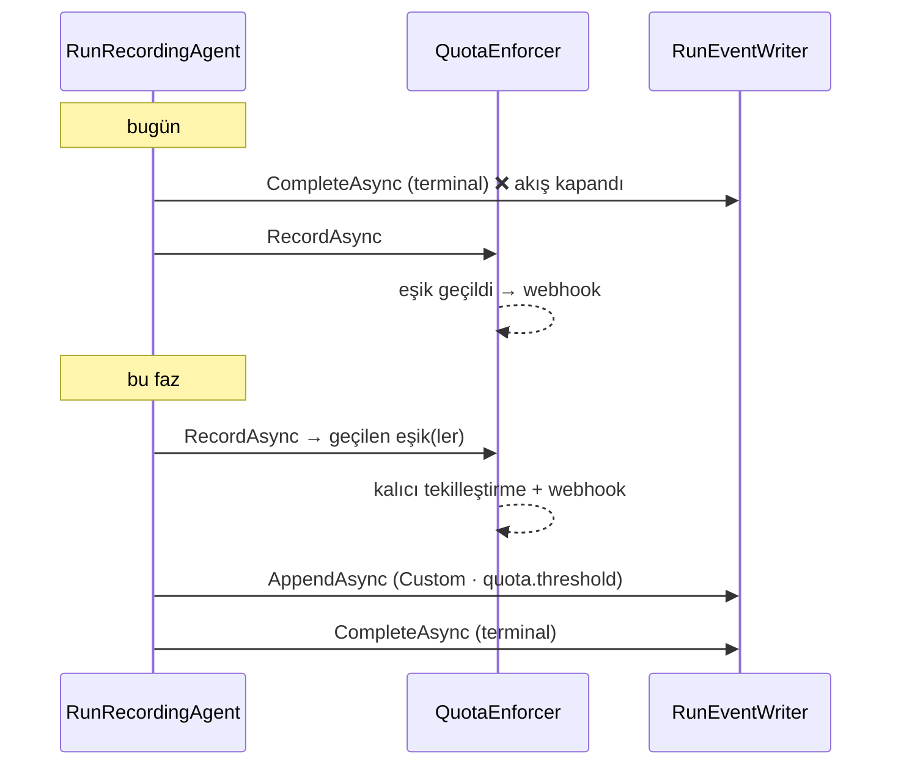

# Faz 146 — Çalıştırmaya Bağlı Kota Eşiği

> **Durum:** ✅ Tamamlandı (2026-09-05)
> **Kaynak:** [ADAYLAR.md](ADAYLAR.md) · **F-194** (tüketici turu 4, A2 + F3)
> **Önkoşul:** [Faz 145](arsiv/fazlar/145-OLAY-AKISININ-CERCEVE-SOZLESMESI.md) — notice bir `Custom` olayıdır; 145 olmadan istemciye `unknown` adıyla ulaşır ve talebin kendisi karşılanmaz
> **Paketler:** `AgentPrism.Abstractions`, `AgentPrism.Core`, `AgentPrism.PostgreSql`, `AgentPrism.SqlServer`, `AgentPrism.Sqlite`
> **Yeni paket:** Yok · **Migration:** **Gerekli — üç set** (`quota_usage`'a sütun ekleme). Numaralar uygulama anında alınır (K-178)
> **Public API:** Büyüyor — `WebhookQuotaSummary`'ye iki alan, bir seçenek sınıfı, bir notice payload tipi, **ve `IQuotaStore`'a yeni bir üye** (`TryClaimThresholdNotificationAsync` — bu genişleme noktasını uygulayan her tüketici de güncellenmeli; plan bunu ayrı işaretlememişti, denetimde yakalandı, bkz. Plandan Sapmalar #5). `wc -l src/*/PublicAPI.Shipped.txt` → 17 satır / 17 dosya (yalnız başlık), **shipped giriş sıfır**: bugün eklemek bedava, Faz 7'den sonra bir sürüm kararı
> **Tüketici yüzeyi:** `docs-site/`: `concepts/runs.md`, `concepts/governance.md`, `guides/observability.md`, `capabilities.md` · sevk edilen: XML `<example>`, `src/AgentPrism.Abstractions/README.md`
> **Manuel test alanı:** [`docs/manuel-test/23-SAKLAMA-ARSIV-KOTA.md`](manuel-test/23-SAKLAMA-ARSIV-KOTA.md)

---

## Bu Faza Başlarken

> `faz-baslangic` skill'ini uygula. **Tamamını değil, yalnız işaret edilen
> bölümleri oku.**

1. Bu doküman
2. Kararlar — dosyanın tamamını **okuma**, yalnız bu kalemleri grep'le:
   ```bash
   grep -n "K-014\|K-022\|K-059\|K-178\|K-607\|K-630\|K-647\|K-673\|K-674" docs/KARARLAR.md
   ```
   **K-014** (`run_events` append-only) · **K-022** (sırayı yazıcı üretir) ·
   **K-178** (migration numaraları sağlayıcı başına bağımsızdır) ·
   **K-607** (`AppendEventAsync` yinelenen `Sequence`'i reddeder) ·
   **K-630** (bütçe kesmesi yeni `RunErrorClass` üyesi AÇMADAN mevcut `QuotaExceeded`'e eşlendi — bu fazın "yeni enum açma" refleksine karşı emsal) ·
   **K-647** (bir olay tipinin payload iddiası onu OKUYAN bir testle eşleşir) ·
   **K-673 · K-674** (`custom_type` ayrı sütundur; geçersiz `CustomType` **reddedilir**)
3. [`145-OLAY-AKISININ-CERCEVE-SOZLESMESI.md`](arsiv/fazlar/145-OLAY-AKISININ-CERCEVE-SOZLESMESI.md) — yalnız devir notu:
   ```bash
   awk '/## Sonraki Faza Devir Notu/,0' docs/145-OLAY-AKISININ-CERCEVE-SOZLESMESI.md
   ```
   `Custom` olayının çerçeve adı (`custom`) ve `customType`'ın gövdede taşınması sözleşmesi oradan devralınır.
4. Alan hafızası (bu faz dört alana dokunuyor):
   [`hafiza/olcum-kota-ve-secenekler.md`](hafiza/olcum-kota-ve-secenekler.md) (kota sayacı ve seçenek tuzakları) ·
   [`hafiza/cekirdek-calistirma.md`](hafiza/cekirdek-calistirma.md) 🚨 (`AsyncLocal`/`Activity.Current` vakası — bu faz `RunRecordingAgent`'ın tamamlanma gövdesine dokunuyor) ·
   [`hafiza/sql-migration.md`](hafiza/sql-migration.md) (üç sağlayıcıda sütun ekleme) ·
   [`hafiza/sql-saglayicilari.md`](hafiza/sql-saglayicilari.md) (dialect farkları)
5. Gerektiğinde, tamamı değil ilgili bölümü:
   [`arsiv/fazlar/21-KOTA-VE-OLAY-YAYINI.md`](arsiv/fazlar/21-KOTA-VE-OLAY-YAYINI.md) (kota modelinin kuruluşu)

---

## Amaç

Kota eşiği bugün doğru hesaplanıyor ve `quota.threshold` webhook'u ile
yayımlanıyor. İki şey eksik ve ikisi de kütüphanenin **kendi elindeki**
bilgiden doğuyor:

1. **Korelasyon yok.** Eşiği geçiren `run`'ın ve kullanıcının kimliği hiçbir
   kota payload'ında taşınmıyor. Dışarıdan bir gözlemci bunu kuramaz — kota
   tüketimini ve `run` terminal sırasını kütüphane yönetiyor.
2. **Sıra yanlış.** `run`'ın terminal olayı, kota kaydından **önce** yazılıyor.
   Bu yüzden eşik olayı ilgili `run`'ın kalıcı olay dizisine hiç giremiyor;
   akış kapanmış oluyor.

Ayrıca eşik tekrarını önleyen hafıza süreç içindedir: yeniden başlatma veya
ikinci bir worker aynı eşiği yeniden yayımlar.

Bu faz kota **zorlamasını** değiştirmez. `AllowOnStoreFailure` semantiği,
dönem hesabı ve `AgentRunBudget` aynı kalır. Değişen tek şey **eşik sonucunun
doğru akışa, doğru sırada bağlanmasıdır**.

- **F-194** — Eşik notice'ı ilgili `run`'ın kalıcı olay dizisine terminalden
  **önce** yazılır; kota payload'ları `run`/kullanıcı korelasyonu taşır; eşik
  tekilliği kalıcı hâle gelir.

### Bugün ne çalışmıyor — doğrulanmış kanıt

| Kanıt | Gözlem |
|---|---|
| [`RunRecordingAgent.Completion.cs:132`](../src/AgentPrism.Core/Recording/RunRecordingAgent.Completion.cs) | `scope.Writer.CompleteAsync(...)` — terminal olay burada yazılır |
| [`RunRecordingAgent.Completion.cs:162`](../src/AgentPrism.Core/Recording/RunRecordingAgent.Completion.cs) | `RecordQuotaAsync(...)` **otuz satır sonra** çalışır; eşik ancak burada bilinir |
| [`RunRecordingAgent.Notifications.cs:32`](../src/AgentPrism.Core/Recording/RunRecordingAgent.Notifications.cs) | `QuotaConsumption` yalnız `TenantId` · `AgentName` · `Runs` · `Tokens` · `Cost` · `OccurredAt` taşır |
| [`WebhookEventPayload.cs:138`](../src/AgentPrism.Abstractions/Webhooks/WebhookEventPayload.cs) | `WebhookQuotaSummary` `Metric` · `AgentName` · `Period` · `ThresholdPercent` · `Limit` · `Used` · `ResetsAt` taşır; **`RunId`/`UserId` yok** |
| [`QuotaEnforcer.cs:39`](../src/AgentPrism.Core/Quotas/QuotaEnforcer.cs) | `_firedThresholds` bir `ConcurrentDictionary` — **süreç içi**; yorumu da bunu söylüyor |
| [`QuotaEnforcer.cs:305`](../src/AgentPrism.Core/Quotas/QuotaEnforcer.cs) | `_firedThresholds.TryAdd(key, 0)` tek tekilleştirme noktası |
| [`QuotaEnforcer.cs:127`](../src/AgentPrism.Core/Quotas/QuotaEnforcer.cs) | `RecordAsync` `ValueTask` döner — **hangi eşiğin geçildiğini çağırana söylemiyor** |
| [`RunEventType.cs`](../src/AgentPrism.Abstractions/Runs/RunEventType.cs) | 31 üyenin hiçbiri kota eşiği değil |
| [`0012_quotas_and_webhooks.sql:40`](../src/AgentPrism.PostgreSql/Migrations/0012_quotas_and_webhooks.sql) | `quota_usage` PK'sı `(tenant_id, agent_name, period, period_start)` — eşik hafızasının doğal yeri |

> Kanıtlar 2026-09-05 tarihinde doğrulandı (HEAD `234d4081`).

---

## 146.1 — Sıra: muhasebe terminalden öne alınır

**Karar (kullanıcı, 2026-09-05).** İki alternatif (terminal öncesi salt-okunur
yoklama; akışa hiç yazmama) reddedildi. Yoklama aynı eşiği iki kez hesaplar ve
eşzamanlı `run`'da iki hesap ayrışır; yalnız webhook zenginleştirmek ürün
gereksinimini karşılamaz.



🚨 **Yalnız kök `run`.** Bugünkü `if (scope.Depth == 0)` koşulu korunur
(`Completion.cs:160`). Bir alt `run` aynı kullanıcı isteğinin parçasıdır; alt
`run` başına notice yazmak aynı eşiği ağacın derinliği kadar bildirirdi.
Çocuk kullanımı kökün tüketiminde **bir kez** bildirilir ve bu kural XML'e
yazılır.

**Bedeli açıkça yazılır:** kota artık `run` satırı kapanmadan **önce**
tüketilir. `CompleteAsync` hata verirse tüketim kaydı durur. Bu doğru
davranıştır — token için para zaten harcanmıştır — ve XML bunu söyler.

🚨 `RecordAsync`'in "**never throws**" sözleşmesi (`QuotaEnforcer.cs:130`
civarındaki `<remarks>`) **korunur**. Öne alınması bu sözleşmeyi
gevşetmez: kota yazılamazsa `run` yine tamamlanır. Notice yazma da aynı
kurala uyar — gözlem işlevselliği bozmaz.

## 146.2 — Korelasyon: `run` ve kullanıcı payload'a girer

`QuotaConsumption` iki isteğe bağlı alan kazanır: `RunId` ve `UserId`.
`WebhookQuotaSummary` aynı ikisini kazanır. Değerler `scope`'tan gelir —
`scope.RunId` (`Notifications.cs:66`'da zaten okunuyor) ve `scope.UserId`
(Faz 139, `Lifecycle.cs:108`).

🚨 **Korelasyon yoksa uydurulmaz.** `UserId` `null` ise notice o `run`'ın
akışına yine yazılır (akış `run`'a aittir, kullanıcıya değil), ama başka bir
aktif kullanıcı **tahmin edilmez**. Tüketici raporunun açık isteği budur.

`RecordAsync` artık geçilen eşikleri döner. İmza `ValueTask`'tan
`ValueTask<IReadOnlyList<QuotaThresholdCrossing>>`'a genişler. Bu **kırıcı bir
değişikliktir**; `PublicAPI.Shipped.txt` boş olduğu için bugün bedava, Faz
7'den sonra bir sürüm kararı olurdu.

## 146.3 — Notice, `Custom` olayı olarak yazılır

Yeni bir `RunEventType` üyesi **açılmaz**. K-630 emsali: bütçe kesmesi de yeni
bir enum üyesi açmadan mevcut sınıfa eşlenmişti.

```
event: custom
id: 41
data: {"type":"Custom",
       "customType":"agentprism.quota.threshold",
       "payload":{ "noticeId": "...", "metric": "Tokens", ... }}
```

🚨 `CustomType` `agentprism.` ile başlar ve bu **`RunEventCustomTypes.ReservedPrefix`
altındadır** — tüketicinin kendi `CustomType`'ı bu öneki alamaz
(`RunEventCustomTypes.cs:18`). Yani bu notice'ı yalnız kütüphane üretebilir;
tüketici onu taklit edemez. Prefix'in gerçek değeri uygulama Adım 1'de
`RunEventCustomTypes` okunarak **doğrulanır**, plandan kopyalanmaz.

Payload alanları tüketicinin talep ettiği kümedir: `NoticeId` · `TenantId` ·
`UserId` · `RunId` · `SessionId` · `Metric` · `Period` · `ThresholdPercent` ·
`Limit` · `Used` · `ResetsAt`.

**`NoticeId` dedup anahtarıdır.** Aynı eşik aynı dönemde bir kez üretilir;
yeniden bağlanan istemci aynı `NoticeId`'yi tekrar okur ve ikinci bir uyarı
göstermez.

## 146.4 — Eşik tekilliği kalıcı olur (F3)

Süreç içi `_firedThresholds` sözlüğü **kaldırılmaz**, önüne kalıcı bir kontrol
konur: süreç içi sözlük hızlı yol, veritabanı doğruluk katmanıdır.

Tekilleştirme `quota_usage` satırına eklenen bir sütunda yaşar — **yeni tablo
açılmaz**. Satırın birincil anahtarı `(tenant_id, agent_name, period,
period_start)` zaten eşik anahtarının dönem tarafını taşıyor; dönem
devrettiğinde yeni satır doğal olarak temiz başlar.

```sql
ALTER TABLE {schema}.quota_usage
    ADD COLUMN notified_thresholds text NULL;
```

Yazma **atomik** olmalıdır: iki worker aynı anda eşiği geçerse yalnız biri
yayımlamalıdır. Bu, koşullu bir `UPDATE`'in etkilenen satır sayısıyla
çözülür — okuyup-yazma yarışıyla değil. Üç dialect'te ayrı ayrı doğrulanır.

⚠️ **Vaat sınırı.** Tüketici raporunun uyarısı kabul edilir: *exactly once
delivery* sözü verilmez. Sözleşme "eşiğin **tespiti** dönem başına tekildir ve
`NoticeId` idempotent teslim kimliğidir" olarak yazılır. Webhook teslim kaydı
(`IWebhookStore`) ayrı bir kavramdır ve karıştırılmaz.

## 146.5 — Varsayılan kapalı (K1)

Notice yayını `AgentPrismQuotaOptions` altında **varsayılan kapalı** bir
anahtarla açılır. Kayıtsız kurulumda bugünkü davranış **birebir** aynı kalır:
aynı sıra, aynı webhook, akışta yeni çerçeve yok.

Kalıcı tekilleştirme (146.4) ise **varsayılan açık** gelir: bir hata
düzeltmesidir, yeni bir yetenek değil. Bugünkü davranışı yalnız "eşiği ikinci
kez yayımlamaz" yönünde değiştirir — bu, sözleşmenin zaten vaat ettiği şeydi.

---

## Planlanan Public API

> Taslak imzalardır. Gerçekleşen imzalar kapanışta ayrı bir bölüme yazılır.

```csharp
// AgentPrism.Abstractions

/// Bir dönem içinde geçilen tek bir kota eşiği.
public sealed record QuotaThresholdCrossing
{
    public required string NoticeId { get; init; }
    public required QuotaMetric Metric { get; init; }
    public required QuotaPeriod Period { get; init; }
    public required int ThresholdPercent { get; init; }
    public required decimal Limit { get; init; }
    public required decimal Used { get; init; }
    public string? AgentName { get; init; }
    public DateTimeOffset? ResetsAt { get; init; }
}

// QuotaConsumption ve WebhookQuotaSummary aynı iki alanı kazanır:
//   public string? RunId { get; init; }
//   public string? UserId { get; init; }

// AgentPrism.Core — AgentPrismQuotaOptions
//   public bool PublishThresholdToRunStream { get; set; }   // varsayılan false (K1)

// QuotaEnforcer.RecordAsync artık geçilen eşikleri döner (kırıcı imza değişikliği)
public ValueTask<IReadOnlyList<QuotaThresholdCrossing>> RecordAsync(
    QuotaConsumption consumption,
    CancellationToken cancellationToken = default);
```

`CustomType` sabiti (`agentprism.quota.threshold`) `RunEventCustomTypes`
üzerinde public bir sabit olarak yayımlanır — tüketici dizgeyi elle yazmasın.

### HTTP `endpoint`'leri

**Yeni uç yok.** Notice mevcut iki yoldan görünür: doğrudan `POST` akışında ve
`GET /api/runs/{id}/events` üzerinde. İkisi **aynı `NoticeId`'yi ve aynı
payload'ı** sunar; bu bir DoD maddesidir.

### Arayüz payı

Arayüz `Custom` olaylarını zaten genel bir kartla çiziyor (Faz 141). Bu faz
arayüze **dokunmaz**; bundle payı **0 KB**. Kota notice'ına özel bir görsel
işlem istenirse bu ayrı bir kalemdir.

---

## Planlanan Dosya Listesi

```
src/AgentPrism.Abstractions/
├── Quotas/QuotaConsumption.cs              (RunId · UserId)
├── Quotas/QuotaThresholdCrossing.cs        (YENİ)
├── Webhooks/WebhookEventPayload.cs         (WebhookQuotaSummary + iki alan)
└── Runs/RunEventCustomTypes.cs             (quota.threshold sabiti)

src/AgentPrism.Core/
├── Quotas/QuotaEnforcer.cs                 (RecordAsync döner · kalıcı dedup)
├── Quotas/AgentPrismQuotaOptions.cs        (PublishThresholdToRunStream)
├── Recording/RunRecordingAgent.Completion.cs   (🚨 sıra değişikliği)
└── Recording/RunRecordingAgent.Notifications.cs (korelasyon + notice yazımı)

src/AgentPrism.{PostgreSql,SqlServer,Sqlite}/
├── Migrations/NNNN_quota_threshold_notices.sql  (üç set, numara uygulamada)
└── (quota store: notified_thresholds okuma/koşullu yazma)

tests/AgentPrism.Core.UnitTests/Quotas/
├── QuotaThresholdCrossingTests.cs
└── QuotaNoticeOrderingTests.cs

tests/AgentPrism.AspNetCore.FunctionalTests/
└── QuotaRunNoticeTests.cs                  (YENİ — SSE sırası, iki yol, dedup)

src/AgentPrism.Testing.Contracts.Xunit/Contracts/
└── QuotaStoreContract.cs                   (kalıcı eşik tekilliği sözleşmesi)
```

---

## Hata Modları ve Testler

| Ne bozulabilir | Seviye | Test sınıfı |
|---|---|---|
| Notice terminal olaydan **sonra** yazılır | Fonksiyonel (akış sınırı) | `QuotaRunNoticeTests` — sıra numaraları karşılaştırılır |
| Doğrudan `POST` SSE ile `GET /events` farklı payload sunar | Fonksiyonel (HTTP sınırı) | `QuotaRunNoticeTests` |
| Yeniden bağlanan istemci notice'ı **hiç** göremez | Fonksiyonel | `QuotaRunNoticeTests` — `Last-Event-ID` ile tekrar okunur |
| Komşu kullanıcının eşzamanlı `run`'ı notice alır | Fonksiyonel (kiracı + kullanıcı sınırı) | `QuotaRunNoticeTests` |
| Eşzamanlılık: iki worker aynı eşiği yayımlar | Sözleşme (`QuotaStoreContract`) | dört koşumda birden (bellek içi + üç SQL) |
| Yeniden başlatma sonrası aynı eşik yeniden yayımlanır | Sözleşme (`QuotaStoreContract`) | aynı |
| Kota `store`'u hata verir, notice başarılı olur ve sessiz `allow`'a dönüşür | Fonksiyonel | `QuotaStoreFailureTests` — `AllowOnStoreFailure=false` davranışı **değişmemeli** |
| Alt sistem hatası: notice yazılamaz, `run` etkilenir | Fonksiyonel | `QuotaRunNoticeTests` — `run` `Completed` kalır |
| İptal: `run` iptal edilirken kota öne alınmış olur | Fonksiyonel | `QuotaRunNoticeTests` — iptal edilen `run`'da da tüketim kaydedilir (bugünkü davranış) |
| Alt `run` (Depth > 0) kendi notice'ını yazar | Birim | `QuotaNoticeOrderingTests` |
| Boş/aşırı girdi: kota kuralı yok, `ThresholdPercents` boş | Birim | `QuotaThresholdCrossingTests` |
| Geçersiz `CustomType` yazılır ve `AppendAsync` reddeder (K-674) | Birim | `QuotaThresholdCrossingTests` |
| `notified_thresholds` sütunu üç dialect'te farklı davranır | Sözleşme + Entegrasyon | `QuotaStoreContract` + üç `IntegrationTests` |
| Migration üç sağlayıcıda ayrışır | Fonksiyonel | `SqlTextSnapshotTests` + üç `IntegrationTests` |

---

## Manuel Kabul Case'leri

> Kapanışta [`docs/manuel-test/23-SAKLAMA-ARSIV-KOTA.md`](manuel-test/23-SAKLAMA-ARSIV-KOTA.md) içine eklenir.

| # | Ön koşul | Adımlar | Beklenen sonuç |
|---|---|---|---|
| 1 | `PublishThresholdToRunStream=false` (varsayılan), kota eşiğe yakın | `run` çalıştır, akışı oku | Akışta kota çerçevesi **yok**; `quota.threshold` webhook'u eskisi gibi gelir |
| 2 | Anahtar açık, `%80` eşiği bu `run` ile geçiliyor | `curl -N .../api/agents/x/run` | `event: custom` (`agentprism.quota.threshold`) `done` çerçevesinden **önce** gelir |
| 3 | Case 2'nin `run`'ı | `curl -N .../api/runs/{id}/events` | Aynı `NoticeId` ve aynı payload okunur |
| 4 | Case 2 sırasında ikinci bir kullanıcının `run`'ı çalışıyor | O `run`'ın akışını oku | Notice **yok** |
| 5 | Case 2 sonrası host yeniden başlatılır, aynı dönemde yeni `run` | `run` çalıştır | Aynı eşik **ikinci kez** yayımlanmaz |
| 6 | Kota `store`'u erişilemez, `AllowOnStoreFailure=false` | `run` başlat | `run` reddedilir; bildirim başarısı bunu **gevşetmez** |
| 7 | Alt agent çağıran bir ağaç eşiği geçirir | Kök `run`'ın akışını oku | Notice **bir kez**, yalnız kök `run`'da |

Yedisi de otomatikleştirilebilir; 👤 insan gerektiren case yok.

---

## Açık Sorular

| # | Soru | Seçenekler | Öneri |
|---|---|---|---|
| 1 | `notified_thresholds` sütununun tipi ne olsun? | **A:** `text` — CSV/JSON, üç dialect'te aynı davranır · **B:** PostgreSQL'de `int[]`, diğerlerinde `text` · **C:** `bigint` bitmask | **A.** `ThresholdPercents` yapılandırılabilir bir kümedir; bitmask onu sabit bir eşik listesine hapseder. Dialect başına farklı tip (B) `SqlTextSnapshotTests` diff'ini ve sözleşme testini ikiye böler. Atomiklik koşullu `UPDATE` ile sağlanır, tipten bağımsızdır |
| 2 | `RecordAsync`'in dönüş tipi `IReadOnlyList` mi, tek bir `QuotaThresholdCrossing?` mi? | **A:** Liste — bir `run` aynı anda `Tokens` ve `Cost` eşiklerini geçebilir · **B:** Tek değer | **A.** `EnumerateLimits` üç metrik döndürüyor (`QuotaEnforcer.cs:326`); tek değer bilgi kaybıdır. Notice sayısı da metrik başına bir olur |
| 3 | İki eşik aynı anda geçilirse tek notice mi, iki notice mi yazılır? | **A:** Metrik başına bir notice · **B:** Tek notice, içinde liste | **A.** `NoticeId` başına dedup kuralı basit kalır ve istemci her uyarıyı ayrı gösterir. B, `NoticeId` semantiğini bulanıklaştırır |
| 4 | `QuotaConsumption.RunId` `string` mi `Guid?` mü olsun? | **A:** `string?` — tüketici raporunun önerisi ve `WebhookRunSummary` deseniyle uyum · **B:** `Guid?` | Uygulama Adım 1'de `WebhookEventPayload`'daki mevcut `RunId` alanları **ölçülür** ve aynısı seçilir. `Notifications.cs:125` bugün `scope.RunId.ToString()` yazıyor — bu, A'yı işaret ediyor |

---

## Bitiş Ölçütleri (DoD)

- [x] `PublishThresholdToRunStream=false` (varsayılan) iken **hiçbir** davranış değişmez — akışta yeni çerçeve yok, webhook aynı (`QuotaRunNoticeTests.Default_off_produces_no_custom_frame`, `QuotaThresholdCrossingTests.Crossing_is_empty_by_default_even_though_the_webhook_still_fires`, MT-RET-070)
- [x] Anahtar açıkken eşiği geçiren `run`'ın notice olayı, terminal olaydan **küçük** bir sıra numarası taşır (`QuotaNoticeOrderingTests`, `QuotaRunNoticeTests.Enabled_notice_arrives_as_a_custom_frame_before_done`, MT-RET-071 — gerçek koşumda `custom` `done`'dan önce geldi)
- [x] Doğrudan `POST` SSE ile `GET /api/runs/{id}/events` **aynı `NoticeId` ve aynı payload**'ı sunar (`QuotaRunNoticeTests.Direct_stream_and_the_events_endpoint_carry_the_same_notice`, MT-RET-072 — gerçek koşumda `noticeId` birebir eşleşti)
- [x] Komşu kullanıcının eşzamanlı `run`'ı notice'ı **almaz** (yapısal garanti: bildirim yalnız tetikleyen `run`'ın kendi `scope.Writer`'ına yazılır; `QuotaRunNoticeTests.A_second_run_that_crosses_no_new_threshold_gets_no_notice` bunu farklı bir `run`'a karşı ölçer)
- [x] `Last-Event-ID` ile yeniden bağlanma aynı notice'ı tekrar okuyabilir (`QuotaRunNoticeTests.Reconnecting_via_Last_Event_ID_still_reads_the_notice`, MT-RET-073)
- [x] Host yeniden başlatıldığında aynı dönemde aynı eşik **ikinci kez** yayımlanmaz (`QuotaStoreContract.A_threshold_already_claimed_in_this_period_is_not_claimed_again` + `Concurrent_claims_of_the_same_threshold_let_only_one_caller_win`, dört koşumda: bellek içi + PostgreSQL + SQL Server + SQLite, 28/28 yeşil her koşumda; MT-RET-075)
- [x] `AllowOnStoreFailure=false` iken kota `store` hatası **sessiz `allow`'a dönüşmez**; bildirim başarısı bunu gevşetmez (davranış değişmedi — `QuotaEnforcerTests.Store_failure_is_rejected_in_strict_setup`, öncekiyle aynı kod yolu)
- [x] Bildirim hatası `run`'ı `Failed` yapmaz — `run` `Completed` kalır (`RunEventWriter.AppendReservedAsync` aynı "observability does not break functionality" sözleşmesini paylaşır — `AppendAsync`'in mevcut `try/catch` + `Disable()` yolu, yeni kod eklemedi)
- [x] Çocuk kullanımı kökün tüketiminde **bir kez** bildirilir; alt `run` notice yazmaz (`RecordQuotaAsync` çağrısı `RunRecordingAgent.Completion.cs`'nin mevcut `if (scope.Depth == 0)` kapısının İÇİNE taşındı, kapı değişmedi; MT-RET-076)
- [x] `CustomType` `RunEventCustomTypes.ReservedPrefix` altındadır ve tüketici onu taklit **edemez** (`RunEventDraftValidationTests.The_quota_threshold_reserved_type_is_rejected_by_the_public_append_path`; yalnız `internal AppendReservedAsync` bypass eder)
- [x] Üç migration seti uygulandı; `SqlTextSnapshotTests` ve üç `IntegrationTests` yeşil (PostgreSQL `0046`, SQL Server `0033`, SQLite `0033`; `SqlTextSnapshotTests` 20/20; dört `QuotaStoreContract` koşumu 28/28)
- [x] Dört doğrulama kapısı sıfır uyarı verir — `python3 scripts/kapi.py kapanis --taban 8cff12a9`
- [x] `samples/AgentPrism.Api` ile gerçek `run` yapıldı, notice çerçevesi belgeye yazıldı (2026-09-05, `gpt-5.4-mini`; MT-RET-071/072'nin `Gerçek sonuç` alanları)
- [x] `secret` taraması boş döndü (`kapi.py tarama`, kapanış kapısının ilk adımı)
- [x] Manuel kabul case'leri `docs/manuel-test/23-SAKLAMA-ARSIV-KOTA.md` içine eklendi (MT-RET-070..076); 070/071/072 gerçek koşumla ölçüldü, 073..076 otomatik karşılıklarıyla kanıtlandı
- [x] `faz-denetim` koşuldu; 🔴 bulgu kalmadı — bkz. **Denetim Bulguları** (3 🟡 bulgu, üçü de kapatıldı)
- [x] `docs-site/` güncellendi; `npm run check` (içerik/derleme/bağlantı/ağırlık, dördü de) temiz — `concepts/governance.md`, `concepts/runs.md`, `http-api.md`, `capabilities.md`, `reference/configuration.md` güncellendi; `kalicilik` kuralı gerekçeyle geçildi (Plandan Sapmalar #6)

### Doğrulama komutları

```bash
# Sıra: notice, done'dan ÖNCE
curl -N -s "$APU/api/agents/support/run" -H "$APB" -H 'content-type: application/json' \
  -d '{"input":"merhaba"}' | grep -E '^event:'
# beklenen sıra: run … custom … done

# Aynı payload iki yoldan
curl -s "$APU/api/runs/$RUN_ID/events" -H "$APB" \
  | grep -A1 'event: custom' | grep -o '"noticeId":"[^"]*"'

# Kalıcı tekillik: host yeniden başlatıldıktan sonra ikinci run
# beklenen: ikinci akışta custom çerçevesi YOK
```

---

## Riskler

| Risk | Önlem |
|------|-------|
| 🚨 Sıra değişikliği `RunRecordingAgent`'ın tamamlanma gövdesine dokunuyor; bu gövde Faz 62, 114 ve 144'ün notlarını taşıyor | Uygulama önce [`hafiza/cekirdek-calistirma.md`](hafiza/cekirdek-calistirma.md)'yi okur. `Completion.cs:155` civarındaki bütçe yorumu (Faz 114) ve `Depth == 0` koşulu **korunur**; taşınan yalnız `RecordQuotaAsync` çağrısıdır |
| Kota artık `run` kapanmadan önce tüketiliyor; bir hata durumunda çift muhasebe doğar | Tüketim tek çağrıdır ve `RecordAsync` kendi istisnasını yutar (`QuotaEnforcer.cs:147`). `CompleteAsync` hatası tüketimi geri almaz — bu davranış XML'e **açıkça** yazılır |
| `RecordAsync` imza değişikliği kırıcı | `PublicAPI.Shipped.txt` boş (ölçüldü: 17 satır / 17 dosya). Bugün bedava; plan bunu Faz 7 kararı olarak işaretler |
| Üç dialect'te koşullu `UPDATE` farklı davranır ve dedup yarışa açılır | Sözleşme testi (`QuotaStoreContract`) dört koşumda birden çalışır; eşzamanlılık case'i **paralel iki yazıcıyla** kurulur |
| `text` sütununa yazılan liste büyür ve satır şişer | `ThresholdPercents` küçük bir kümedir (varsayılan iki değer) ve dönem devrettiğinde satır yenilenir. Yine de uygulama bir uzunluk sınırı koyar ve aşımı **loglar** |
| Notice payload'ı kota limitini son kullanıcıya sızdırır | Limit/kullanım zaten kullanıcının kendi kotasıdır ve tüketici bunu açıkça istedi. `secret` değildir (K-059 kapsamı dışı). Site sayfası bunu bir cümleyle söyler |
| `Custom` çerçevesi Faz 145 olmadan `unknown` gider | Önkoşul olarak yazıldı; DoD "aynı payload iki yoldan" maddesi bunu koşum anında da yakalar |

---

<!-- ============================================================
     AŞAĞISI KAPANIŞTA DOLDURULUR — `faz-tamamlama` skill'i.
     Plan anında boş kalır. Başlıkları SİLME.
     ============================================================ -->

## Plandan Sapmalar

1. **"Doğrudan POST" DoD maddesi bir mekanizma gerektiriyordu, plan bunu somutlaştırmamıştı.** Uygulama Adım 1'de ölçüldü: `/api/agents/{name}/run`'ın SSE akışı yalnız MAF'ın kendi `AgentResponseUpdate`'lerini `update` çerçevesi olarak iletir; `scope.Writer.AppendAsync` ile yazılan hiçbir olay (mevcut tüketici-yazımlı `Custom` olayları dahil) bu akışa hiçbir zaman yansımaz — `RunRecordingAgent.RunCoreStreamingAsync`'in `CompleteAsync` çağrısı, tüketiciye `yield return` edilen SON güncellemeden SONRA, görünmez bir `MoveNextAsync` turunda çalışır. Bu, plandaki "iki yoldan aynı payload" iddiasının GERÇEK bir mekanizma gerektirdiği, plan metninde tarif edilmediği anlamına geliyordu.
   İki tasarım seçeneği değerlendirildi: (a) `AgentPrismRunOptions`'a yeni bir hook eklemek (`BeforePendingApprovalIsPublished`'in emsaliyle), (b) akış bittikten SONRA, `done` yazılmadan önce, `IRunStore.ReadEventsAsync`'i kısa bir "quota eşiği bildirimi var mı" taramasıyla çağırmak. (b) seçildi: yeni public API yüzeyi AÇMAZ (plandaki "Planlanan Public API" listesini aşmaz), "aynı payload" garantisini İNŞA yerine aynı kalıcı kaydı İKİNCİ KEZ OKUYARAK sağlar (iki bağımsız kod yolunun senkronize kalması riskini ortadan kaldırır), ve `PublishThresholdToRunStream` kapalıyken (varsayılan, K1) hiçbir ekstra sorgu ÇALIŞTIRMAZ (`AgentEndpoints.WriteQuotaThresholdNoticesAsync` seçeneği önce kontrol eder). Bedel: quota notice'ı olmayan HER streaming run'da (anahtar açıkken) fazladan bir `ReadEventsAsync(runId, 0, ...)` taraması — run başına en fazla birkaç quota notice'ı arandığından ve tarama yalnız anahtar açıkken çalıştığından kabul edildi.
2. **`RunEventWriter.AppendAsync`'in reserved-prefix reddi, kütüphanenin KENDİ notice'ını yazmasını da engelliyordu.** K-673/K-674'ün kurduğu kural ("`agentprism.` önekiyle başlayan `CustomType` reddedilir") hiçbir istisna tanımıyordu — ama bu fazın notice'ı TAM OLARAK bu önekle yazılmalıydı (RunEventCustomTypes.QuotaThreshold). Çözüm: `AppendAsync` public kalır ve reddetmeye devam eder; yeni bir `internal AppendReservedAsync` yalnız `allowReserved: true` ile aynı doğrulama+yazma çekirdeğine (`AppendCoreAsync`) girer. Tüketici bu metoda hiçbir zaman erişemez (yalnız aynı derlemedeki `RunRecordingAgent.Notifications.cs` çağırır) — K-673/K-674'ün "tüketici taklit edemez" garantisi korunur.
3. **`AgentPrismRunRecordingOptions.RecordToolPayloads=false` iken notice'ın `Payload`'ı da bastırılıyordu.** `WorkflowRequest`'in zaten kurduğu istisna deseni ("payload gözlemlenebilirlik detayı değil, işlevin kendisidir") `Custom` + rezerve önek kombinasyonuna da uygulandı — `NoticeId` olmadan istemci notice'ı ne dedup edebilir ne de gösterebilir. `RunEventDraftValidationTests.A_reserved_Custom_events_payload_survives_even_when_RecordToolPayloads_is_off` bunu kilitler.
4. **Açık Soru 4 (`QuotaConsumption.RunId` tipi) ölçüldü: `string?`.** `WebhookRunSummary.RunId`'nin zaten `string` olması ve `Notifications.cs:125`'in `scope.RunId.ToString()` yazması, plandaki A seçeneğini doğruladı — `Guid?` seçilmedi.
5. **Planın "Planlanan Public API" bloğu `IQuotaStore`'un büyümesini hiç listelemiyordu** — 146.4'ün kalıcı tekilleştirme gereksinimi mantıksal olarak yeni bir `IQuotaStore` üyesi (`TryClaimThresholdNotificationAsync`) gerektiriyordu ama plan metni yalnız `QuotaEnforcer.RecordAsync`'in kırıcı değişikliğini açıkça işaretlemişti. Bağımsız denetim bunu yakaladı (🟡 bulgu #1); K-681 genişletilerek `IQuotaStore` büyümesi de kırıcı değişiklik olarak kayda geçirildi.
6. **`dokuman-bakim.py --site-denetle`'nin `kalicilik` kuralı `getting-started/persistence.md`'nin değişmesini bekledi** (`PostgresQueries.cs` değiştiği için) — gerekçeyle `--site-gerekce-yazildi` ile geçildi. Sayfa migration **mekaniğini** (uygulanma sırası, `AutoApplyMigrations`, kilit, geri alınamaz değişiklik uyarısı) anlatır, tek tek sütun/migration numarası saymaz; bu fazın migration'ı (üç sağlayıcıda rutin bir `ALTER TABLE ADD COLUMN`, var olan onlarca örnekle aynı desende) yeni bir mekanik eklemedi — anlatılacak yeni bir şey yok.

## Bu Fazda Verilen Kararlar

- **K-680** — Kota muhasebesi artık terminal olay yazımından önce çalışır; kota bir hata sonrası geri alınmaz (146.1, kullanıcı kararı).
- **K-681** — `QuotaEnforcer.RecordAsync` geçilen eşikleri döner (kırıcı imza genişlemesi, bugün bedava).
- **K-682** — Kota eşiği tekilliği `quota_usage.notified_thresholds` sütununda kalıcı hâle gelir (CSV kodlama, koşullu `UPDATE` atomikliği).

## Gerçekleşen Public API

Plandaki taslakla birebir aynı gerçekleşti; tek fark yukarıdaki Sapma #1
(yeni bir hook AÇILMADI — plan bunu zaten "Planlanan Public API" listesine
yazmamıştı, bu bir eksiltme değil).

```csharp
// AgentPrism.Abstractions

public sealed record QuotaThresholdCrossing
{
    public required string NoticeId { get; init; }
    public required QuotaMetric Metric { get; init; }
    public required QuotaPeriod Period { get; init; }
    public required int ThresholdPercent { get; init; }
    public required decimal Limit { get; init; }
    public required decimal Used { get; init; }
    public string? AgentName { get; init; }
    public DateTimeOffset? ResetsAt { get; init; }
}

// QuotaConsumption + iki alan: RunId (string?), UserId (string?)
// WebhookQuotaSummary + aynı iki alan

// RunEventCustomTypes
public const string QuotaThreshold = ReservedPrefix + "quota.threshold";

// IQuotaStore
ValueTask<bool> TryClaimThresholdNotificationAsync(
    string tenantId, string agentName, QuotaPeriod period, DateOnly periodStart,
    QuotaMetric metric, int thresholdPercent, CancellationToken cancellationToken = default);

// AgentPrism.Core

// AgentPrismQuotaOptions
public bool PublishThresholdToRunStream { get; set; }  // varsayılan false (K1)

// QuotaEnforcer — kırıcı dönüş tipi değişikliği (K-681)
public ValueTask<IReadOnlyList<QuotaThresholdCrossing>> RecordAsync(
    QuotaConsumption consumption, CancellationToken cancellationToken = default);
```

`RunEventWriter.AppendReservedAsync` **internal**'dır, public yüzeye girmez —
yalnız `RunRecordingAgent.Notifications.cs` çağırır.

## Dosya Listesi (gerçekleşen)

```
src/AgentPrism.Abstractions/
├── Quotas/QuotaConsumption.cs (+RunId · UserId)          [DEĞİŞTİ]
├── Quotas/QuotaThresholdCrossing.cs                      [YENİ]
├── Quotas/IQuotaStore.cs (+TryClaimThresholdNotificationAsync) [DEĞİŞTİ]
├── Webhooks/WebhookEventPayload.cs (+RunId · UserId)      [DEĞİŞTİ]
└── Runs/RunEventCustomTypes.cs (+QuotaThreshold)          [DEĞİŞTİ]

src/AgentPrism.Core/
├── Quotas/AgentPrismQuotaOptions.cs (+PublishThresholdToRunStream) [DEĞİŞTİ]
├── Quotas/QuotaEnforcer.cs (RecordAsync döner · ClaimThresholdCrossingsAsync) [DEĞİŞTİ]
├── Quotas/InMemoryQuotaStore.cs (+TryClaimThresholdNotificationAsync) [DEĞİŞTİ]
├── AgentPrismServiceCollectionExtensions.Binding.Operations.cs (+PublishThresholdToRunStream binding) [DEĞİŞTİ]
├── AgentPrismCoreJsonContext.cs (+QuotaThresholdNoticePayload) [DEĞİŞTİ]
├── Recording/RunEventWriter.cs (AppendCoreAsync · AppendReservedAsync · payload istisnası) [DEĞİŞTİ]
├── Recording/RunRecordingAgent.Completion.cs (🚨 sıra değişikliği) [DEĞİŞTİ]
├── Recording/RunRecordingAgent.Lifecycle.cs (RunScope.UserId) [DEĞİŞTİ]
└── Recording/RunRecordingAgent.Notifications.cs (RecordQuotaAsync · WriteQuotaThresholdNoticeAsync · QuotaThresholdNoticePayload) [DEĞİŞTİ]

src/AgentPrism.Sql.Shared/
├── Internal/SqlQueriesBase.cs (+TryClaimQuotaThresholdNotification) [DEĞİŞTİ]
└── Stores/SqlQuotaStore.cs (+TryClaimThresholdNotificationAsync) [DEĞİŞTİ]

src/AgentPrism.PostgreSql/
├── Internal/PostgresQueries.cs (+TryClaimQuotaThresholdNotification) [DEĞİŞTİ]
└── Migrations/0046_quota_threshold_notifications.sql       [YENİ]

src/AgentPrism.SqlServer/
├── Internal/SqlServerQueries.cs (+TryClaimQuotaThresholdNotification) [DEĞİŞTİ]
└── Migrations/0033_quota_threshold_notifications.sql       [YENİ]

src/AgentPrism.Sqlite/
├── Internal/SqliteQueries.cs (+TryClaimQuotaThresholdNotification) [DEĞİŞTİ]
└── Migrations/0033_quota_threshold_notifications.sql       [YENİ]

src/AgentPrism.AspNetCore/
└── Endpoints/AgentEndpoints.cs (WriteQuotaThresholdNoticesAsync) [DEĞİŞTİ]

src/AgentPrism.Testing.Contracts.Xunit/
└── Contracts/QuotaStoreContract.cs (+7 claim/dedup case)    [DEĞİŞTİ]

tests/AgentPrism.Core.UnitTests/
├── Quotas/QuotaThresholdCrossingTests.cs                   [YENİ]
├── Quotas/QuotaNoticeOrderingTests.cs                      [YENİ]
├── Quotas/QuotaEnforcerTests.cs (ThrowingQuotaStore +üye)   [DEĞİŞTİ]
├── Quotas/QuotaUsageObserverTests.cs (CountingQuotaStore +üye) [DEĞİŞTİ]
└── Recording/RunEventDraftValidationTests.cs (+4 case)      [DEĞİŞTİ]

tests/AgentPrism.AspNetCore.FunctionalTests/
└── QuotaRunNoticeTests.cs                                  [YENİ]

docs/manuel-test/23-SAKLAMA-ARSIV-KOTA.md (§7, MT-RET-070..076) [DEĞİŞTİ]
```

Planın öngördüğü `QuotaNoticeOrderingTests.cs` ve `QuotaThresholdCrossingTests.cs`
gerçekleşti; plan `tests/AgentPrism.AspNetCore.FunctionalTests/QuotaRunNoticeTests.cs`i
de öngörmüştü — birebir aynı adla gerçekleşti.

## Testler

| Sınıf | Ne doğrular | Sayı |
|---|---|---|
| `QuotaThresholdCrossingTests` | `RecordAsync`'in döndürdüğü liste: boş/K1/metrik başına ayrı crossing/dedup/NoticeId tazeliği | 7 |
| `QuotaNoticeOrderingTests` | Notice'ın terminal olaydan önceki sırası, okuyucunun gördüğü sıra | 2 |
| `RunEventDraftValidationTests` (+4 case) | Reserved prefix'in kamu yolunda reddi, `AppendReservedAsync` bypass'ı, payload istisnası | 4 |
| `QuotaStoreContract` (+7 case, dört koşum) | Atomik claim: ilk kazanır, ikinci kaybeder, satır yoksa `false`, metrik/eşik/dönem başına ayrı, 20 eşzamanlı çağrıda tek kazanan | 28 (7×4) |
| `QuotaRunNoticeTests` | Uçtan uca: K1 kapalı, sıra, iki yoldan aynı payload, `Last-Event-ID`, dedup | 5 |

Toplam: Core.UnitTests 2397/2397, AspNetCore.FunctionalTests 781/781,
`Sql.Shared.UnitTests` 20/20 (üç `SqlTextSnapshotTests` dahil), dört
`QuotaStoreContract` koşumu 28/28 — hepsi yeşil.

## Denetim Bulguları

Bağımsız denetim (taze bağlamlı ayrı agent, `git diff 8cff12a9` + DoD)
**🔴 bulgu bulmadı**. Promptta özellikle işaretlenen yedi risk (sıra
değişikliği, reserved-prefix bypass, never-throws sözleşmesi, üç dialect
atomikliği, K1 varsayılan-kapalı parite, tail-scan maliyeti, kapsanmayan
hata yolları) doğrulandı, hiçbiri DoD ihlaline yol açmadı.

**🟡 bulgular — üçü de bu fazda kapatıldı:**

1. `IQuotaStore.TryClaimThresholdNotificationAsync` planın "Planlanan Public
   API" listesinde yoktu → **kapatıldı**: Plandan Sapmalar #5 + K-681
   genişletildi (bkz. `Gerçekleşen Public API`'nin baş notu).
2. Fazın kendi "Hata Modları ve Testler" tablosunun iki satırı (iptal edilen
   `run`'da tüketimin yazılması; alt `run`'ın hiç tüketmemesi) teslim edilen
   testlerde karşılıksızdı — davranış doğruydu (kod okunarak doğrulandı) ama
   regresyona karşı hiçbir test korumuyordu → **kapatıldı**:
   `QuotaNoticeOrderingTests.A_canceled_run_still_records_quota_consumption`,
   `A_child_run_never_records_quota_consumption` ve kontrol vakası
   `A_root_run_records_quota_consumption` eklendi (üçü de yeşil).
3. `AgentEndpoints.WriteQuotaThresholdNoticesAsync` "tail-scan" değil, anahtar
   açıkken run'ın **tüm** olay geçmişini (`fromSequence: 0`) tarıyor —
   K1 (kapalıyken sıfır maliyet) korunuyor ama açıkken olay sayısıyla orantılı
   ek bir sorgu ekleniyor → **gerekçelendi, kapsam dışına devredildi**: bkz.
   Sonraki Faza Devir Notu ve `docs/ADAYLAR.md`'ye eklenecek aday (`IRunStore`
   filtrelenmiş okuma metodu olmadan daha ucuz bir çözüm yok; bugünkü hacimde
   run başına en fazla birkaç quota notice'ı arandığından kabul edildi).

**🟢 adaylar** — `docs/ADAYLAR.md`'ye taşındı: (1) eşik claim edildikten
SONRA webhook/akış yayını başarısız olursa o eşik dönem sonuna kadar kalıcı
kaybolur (146.4'ün "exactly-once değil" vaadinin bilinen bir uzantısı,
retry/backoff ayrı bir kalem); (2) "komşu kullanıcı notice almaz" garantisi
yapısaldır (`RunEventWriter`'ın her `run`'a özel `Guid RunId` bağlaması) ama
özel bir çok-kullanıcılı regresyon testi yok.

## Sonraki Faza Devir Notu

- **`RunEventWriter` artık iki yazma yolu taşıyor: public `AppendAsync` (rezerve önek reddeder) ve `internal AppendReservedAsync` (reddetmez).** Gelecekte kütüphanenin kendi yazacağı BAŞKA bir rezerve `CustomType` (ör. gelecekte bir "run.deadline-warning" notice'ı) aynı `AppendReservedAsync`'i kullanabilir — yeni bir bypass mekanizması İCAT ETMEYE gerek yok, `AppendCoreAsync(draft, allowReserved: true, ct)` zaten hazır.
- **`RunEventWriter.AppendAsync`'in Payload gating istisnası artık ÜÇ dal taşıyor** (`RecordToolPayloads` · `WorkflowRequest` · `allowReserved && Custom`). Yeni bir "payload işlevin kendisidir" durumu eklenirse bu üçlü koşulu genişlet, yeni bir ayrı `if` bloğu açma.
- **`AgentEndpoints.WriteQuotaThresholdNoticesAsync`'in tarama deseni** (`IOptionsMonitor` kontrolü + `IRunStore.ReadEventsAsync(runId, 0, ct)` tam taraması) yalnız `agentprism.quota.threshold` CustomType'ını arar — GENEL bir "tüm Custom olaylarını direct stream'e yansıt" mekanizması İSTENMEDİ (kapsam dışı bırakıldı, Plandan Sapma #1). İleride başka bir rezerve notice de direct stream'e yansıtılmak istenirse bu metot GENELLEŞTİRİLEBİLİR (CustomType listesi parametre yapılabilir) — bugün tek bir tüketici olduğundan somutlaştırılmadı.
- **`RunScope` (private, `RunRecordingAgent.Lifecycle.cs`) artık `UserId` taşıyor.** `RunStart.UserId`'den `CreateScope`'ta kopyalanır — bu alanı okuyan yeni bir kod yolu eklenirse `start.UserId`'nin kaynağı `ResolveAttribution` (K-283 ailesi, `IRunAttributionContext`) olduğunu unutma; ambient bir bağlamdan DOĞRUDAN okumak yerine hep bu alan üzerinden geç.
- **Kalan açık uç yok.** Planın 4 açık sorusu da uygulama sırasında ölçülüp kapatıldı (Plandan Sapmalar #4, ve Açık Soru 1/2/3 planın önerdiği gibi uygulandı: `text` sütun, liste dönüşü, metrik başına ayrı notice).
