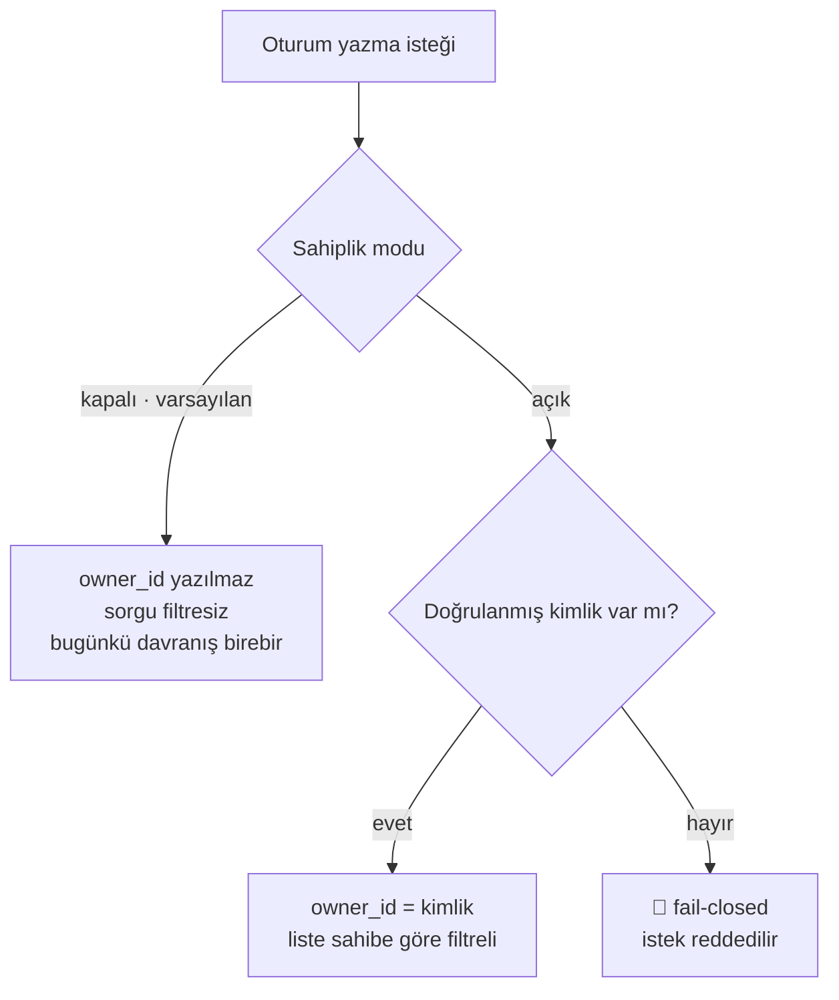

# Faz 148 — Oturum Sahipliğinin Kalıcılığı

> **Durum:** ✅ Tamamlandı (2026-09-06)
> **Kaynak:** [ADAYLAR.md](ADAYLAR.md) · **F-196** (tüketici turu 4, A1 · sahiplik yarısı)
> **Önkoşul:** [Faz 147](arsiv/fazlar/147-YETKI-KAPISININ-KAYNAK-KAPSAMI.md) — kapı bütün kaynak grafiğini kapsamadan sahiplik yarım bir sınır olur; sahipli liste dönerken `run` okuma açık kalırsa sızıntı kapanmaz
> **Paketler:** `AgentPrism.Abstractions`, `AgentPrism.Core`, `AgentPrism.AspNetCore`, `AgentPrism.PostgreSql`, `AgentPrism.SqlServer`, `AgentPrism.Sqlite`, `AgentPrism.Testing.Contracts.Xunit`
> **Yeni paket:** Yok · **Migration:** **Gerekli — üç set** (`sessions`'a sütun + indeks). Numaralar uygulama anında alınır (K-178)
> **Public API:** Büyüyor — `SessionRecord` ve `SessionQuery`'ye birer alan, bir seçenek sınıfı. `wc -l src/*/PublicAPI.Shipped.txt` → 17 satır / 17 dosya (yalnız başlık), **shipped giriş sıfır**: bugün eklemek bedava, Faz 7'den sonra bir sürüm kararı
> **Tüketici yüzeyi:** `docs-site/`: `concepts/sessions.md`, `concepts/governance.md`, `guides/embedding.md`, `guides/write-your-own-store.md`, `capabilities.md` · sevk edilen: `ISessionStore` XML `<example>`, `src/AgentPrism.Abstractions/README.md`, `SessionStoreContract`
> **Manuel test alanı:** [`docs/manuel-test/13-KIRACI-VE-GUVENLIK.md`](manuel-test/13-KIRACI-VE-GUVENLIK.md)

---

## Bu Faza Başlarken

> `faz-baslangic` skill'ini uygula. **Tamamını değil, yalnız işaret edilen
> bölümleri oku.**

1. Bu doküman
2. Kararlar — dosyanın tamamını **okuma**, yalnız bu kalemleri grep'le:
   ```bash
   grep -n "K-030\|K-178\|K-283\|K-605\|K-670\|K-671" docs/KARARLAR.md
   ```
   **K-030** (`tenant_id` sütunlarına yabancı anahtar konmadı — `owner_id` aynı sınıftır) ·
   **K-178** (migration numaraları sağlayıcı başına bağımsızdır) ·
   **K-283** 🚨 (görünmeyen oturum YOK sayılır) ·
   **K-605** (store sözleşmeleri xunit taban sınıfı olarak **sevk edilir** — `SessionStoreContract` büyüyecek) ·
   **K-670 · K-671** (kapı deseni ve ret kodları)
3. [`147-YETKI-KAPISININ-KAYNAK-KAPSAMI.md`](arsiv/fazlar/147-YETKI-KAPISININ-KAYNAK-KAPSAMI.md) — yalnız devir notu:
   ```bash
   awk '/## Sonraki Faza Devir Notu/,0' docs/147-YETKI-KAPISININ-KAYNAK-KAPSAMI.md
   ```
   Kapının hangi kaynakları kapsadığı ve `RunAccess`/`SessionAccess` üyeleri oradan devralınır.
4. Alan hafızası (bu faz dört alana dokunuyor):
   [`hafiza/sql-migration.md`](hafiza/sql-migration.md) (üç sağlayıcıda sütun + indeks ekleme) ·
   [`hafiza/sql-saglayicilari.md`](hafiza/sql-saglayicilari.md) · [`hafiza/sql-server-tuzaklari.md`](hafiza/sql-server-tuzaklari.md) (dialect farkları) ·
   [`hafiza/maf-oturum.md`](hafiza/maf-oturum.md) 🚨 (`AgentSessionManager`'ın çift `SaveAsync` kusuru — `AgentSessionManager.cs:211` yorumu)
5. Gerektiğinde, tamamı değil ilgili bölümü:
   [`MIMARI-GUVENLIK.md`](MIMARI-GUVENLIK.md) — kiracı ve rol sınırı bölümü

---

## Amaç

Faz 139 ve 147 kapıyı kurdu: AgentPrism **sorar**, tüketici **karar verir**.
Sorunun bir yarısı hâlâ cevapsız — AgentPrism, bir oturumun kime ait olduğunu
hiçbir yerde saklamıyor. Bu iki somut sonuç doğuruyor:

1. Tüketici sahipliği kendi tablosunda tutmak zorunda ve **listeyi
   filtreleyemiyor**. Kod bunu açıkça söylüyor
   (`SessionEndpoints.cs:36`): *"A denied list is NOT filtered, it is REJECTED
   (403) … server-side filtering would break the skip/take paging contract."*
   Yani "kendi konuşmalarım" ürün davranışı bugün **kurulamaz**: liste ya
   tümüyle açıktır ya tümüyle reddedilir.
2. Dallandırma, replay ve ses devamı sahipliği taşımıyor; her yeni oturum
   sahipsiz doğuyor.

Bu faz sahipliği **isteğe bağlı, varsayılan kapalı** bir mod olarak AgentPrism'e
öğretir. Kiracı sınırı değişmez; sahiplik onun **altına** yeni bir sınır ekler.

- **F-196** — `sessions` satırı bir sahip taşır; sorgu sahibe göre
  **sayfalamadan önce** filtreler; sahip doğrulanmış kimlikten yazma anında
  alınır ve gövdeden asla okunmaz.

### Bugün ne çalışmıyor — doğrulanmış kanıt

| Kanıt | Gözlem |
|---|---|
| [`ISessionStore.cs:179`](../src/AgentPrism.Abstractions/Sessions/ISessionStore.cs) | `SessionRecord`: `Id` · `AgentName` · `State` · `CreatedAt` · `UpdatedAt` · `TenantId` · `StateSchemaVersion` · `StateMafVersion` · `Version` — **sahip alanı yok** |
| [`ISessionStore.cs:254`](../src/AgentPrism.Abstractions/Sessions/ISessionStore.cs) | `SessionQuery`: `AgentName` · `TenantId` · `Skip` · `Take` — **kullanıcı filtresi yok** |
| [`SessionEndpoints.cs:36`](../src/AgentPrism.AspNetCore/Endpoints/SessionEndpoints.cs) | 🚨 Kodun kendi yorumu: reddedilen liste **filtrelenmez, reddedilir**; sunucu tarafı filtreleme sayfalama sözleşmesini bozardı |
| [`SessionEndpoints.cs:44`](../src/AgentPrism.AspNetCore/Endpoints/SessionEndpoints.cs) | Sorgu yalnız `AgentName` · `Skip` · `Take` ile kuruluyor |
| [`0001_initial.sql:72`](../src/AgentPrism.PostgreSql/Migrations/0001_initial.sql) | `sessions` tablosu: `id` · `tenant_id` · `agent_name` · `state` · `schema_version` · `created_at` · `updated_at` |
| [`0001_initial.sql:82`](../src/AgentPrism.PostgreSql/Migrations/0001_initial.sql) | İndeksler `(tenant_id, updated_at DESC)` ve `(tenant_id, agent_name, updated_at DESC)` |
| [`RunAuthorizationTypes.cs`](../src/AgentPrism.Abstractions/Runs/RunAuthorizationTypes.cs) | `IRunAuthorizationHandler` XML'i: *"AgentPrism draws ownership at the TENANT level; it never learns which user inside a tenant a session or a run belongs to."* |
| [`arsiv/fazlar/139-…md`](arsiv/fazlar/139-CALISTIRMA-VE-OTURUM-YETKILENDIRMESI.md) (Plandan Sapmalar 5) | *"Bu fazda kalıcı bir session-sahiplik veri modeli yok"* — bu faz o boşluğu kapatır |

> Kanıtlar 2026-09-05 tarihinde doğrulandı (HEAD `234d4081`).

---

## 148.1 — Sahiplik `sessions` satırında yaşar

**Karar (kullanıcı, 2026-09-05).** Ayrı bir `session_owners` tablosu
reddedildi: her liste sorgusu bir `JOIN` kazanırdı ve "sayfalamadan önce
filtrele" garantisi üç dialect'te ayrı ayrı kanıtlanmak zorunda kalırdı.
"Yalnız sözleşme, kalıcılık yok" seçeneği de reddedildi: sevk edilen SQL
`store`'lar yeteneği kazanmazsa tüketicinin şikâyeti kapanmaz.

```sql
ALTER TABLE {schema}.sessions
    ADD COLUMN owner_id text NULL;

CREATE INDEX IF NOT EXISTS sessions_tenant_owner_updated_idx
    ON {schema}.sessions (tenant_id, owner_id, updated_at DESC);
```

`owner_id` **nullable**'dır ve yabancı anahtar taşımaz — `tenant_id` ile aynı
sınıf (K-030). AgentPrism kullanıcı kataloğuna sahip değildir; sahip bir
dizgedir ve anlamını tüketici verir.

İndeks yeni eklenir; mevcut iki indeks **düşürülmez**. Mod kapalı kurulumda
sorgu bugünkü indeksi kullanmaya devam eder.

## 148.2 — Mod: varsayılan kapalı (K1)



Mod açıkken:

- **Sahip doğrulanmış kimlikten alınır.** `IRunAttributionContext`'in
  `UserId`'si yazma anında okunur. Gövdedeki hiçbir alan sahibi
  **değiştiremez**; `AgentRunRequest.sessionId` gibi bir gövde alanı sahiplik
  kararına girmez.
- **Kimlik çözülemezse istek reddedilir** (fail-closed). Sahipsiz bir satır
  açılmaz.
- **Owner'sız eski satırlar son kullanıcıya görünmez.** `owner_id IS NULL`
  olan satır sahipli listede yer almaz. Yönetim yüzeyinde (Reader/Operator/
  Admin) görünmeye devam eder — veri kaybolmaz, yalnız son kullanıcı
  kapsamından çıkar.

🚨 Attribution bir **muhasebe** kavramıdır ve `IRunAttributionContext` XML'i
kendi hatasının `run`'ı durdurmadığını söyler. Sahiplik modunda bu **yeterli
değildir**: mod açıkken kimlik çözümü bir yetkilendirme girdisi olur ve hatası
isteği reddeder. Bu ayrım XML'e açıkça yazılır — aynı servis, iki farklı
sözleşme sıkılığı.

## 148.3 — Filtre sayfalamadan önce uygulanır

`SessionQuery` bir `OwnerId` alanı kazanır. Filtre **SQL `WHERE` yan
tümcesinde** yaşar, `Skip`/`Take`'ten önce. Bu, `SessionEndpoints.cs:36`'daki
yorumun kaygısını ortadan kaldırır: sayfalama sözleşmesi bozulmaz, çünkü
sayfalama zaten filtrelenmiş küme üzerinde çalışır.

🚨 **Sayı da sızmaz.** Sayfa boş dönmesi veya toplam sayı üzerinden başka
kullanıcının varlığı çıkarılamamalıdır. Bugün uç bir toplam sayı döndürmüyor;
bu faz bir toplam sayı **eklemez**. Eklenirse o sayı da filtrelenmiş küme
üzerinden hesaplanır.

Ret semantiği K-671 ile aynı kalır: handler listeyi reddederse `403`. Fark
şudur — mod açıkken handler artık listeyi reddetmek **zorunda değildir**,
çünkü liste zaten sahibine daralmıştır.

## 148.4 — Sahiplik türetilen oturumlarda korunur

Bir oturum tek bir yerden doğmuyor. Sahibin kaybolmaması gereken yollar:

| Yol | Sahip nereden gelir |
|---|---|
| İlk `run`'da oturum açılması | Doğrulanmış kimlik |
| `POST /api/sessions/{id}/branch` | **Kaynak oturumun sahibi** korunur; çağıranın kimliği değil |
| Kuyruğa alınmış `run` (`Prefer: respond-async`) | İş zarfına yazılan kimlik; `HttpContext` yoktur |
| Ses oturumunun devamı | Var olan oturumun sahibi |
| İdempotent create (aynı `Idempotency-Key`) | İlk isteğin sahibi; ikinci istek sahibi **değiştirmez** |

Dallandırmada sahibin kaynaktan gelmesi bilinçlidir: dallandırma bir kopyadır,
bir devir değil. Çağıran zaten kaynağa erişmek için kapıdan geçmiştir.

## 148.5 — Depo sözleşmesi büyür

`SessionStoreContract` (sevk edilen paket, K-605) yeni iddialar kazanır ve
**dört koşumda birden** çalışır: bellek içi + üç SQL sağlayıcısı.

- Sahipli kayıt yazılır ve geri okunur.
- `OwnerId` filtresi yalnız o sahibin satırlarını döner.
- `owner_id IS NULL` satır sahipli sorguda **çıkmaz**.
- Filtre `Skip`/`Take`'ten **önce** uygulanır: 5 sahipli + 5 sahipsiz satırda
  `Take=3` üç **sahipli** satır döner.
- Aynı `OwnerId` iki kiracıda ayrı veri alanında kalır (`TenantIsolationContract`
  zaten taban sınıf).

---

## Planlanan Public API

> Taslak imzalardır. Gerçekleşen imzalar kapanışta ayrı bir bölüme yazılır.

```csharp
// AgentPrism.Abstractions

public sealed record SessionRecord
{
    // … mevcut alanlar …

    /// <summary>The user the session belongs to, or null when the session is unowned.</summary>
    public string? OwnerId { get; init; }
}

public sealed record SessionQuery
{
    // … mevcut alanlar …

    /// <summary>Fetches only this owner's sessions. Applied BEFORE Skip/Take.</summary>
    public string? OwnerId { get; init; }
}

// AgentPrism.Core
public sealed class AgentPrismSessionOwnershipOptions
{
    public const string SectionName = "AgentPrism:SessionOwnership";

    /// <summary>Turns owner tracking on. Default false: nothing changes.</summary>
    public bool Enabled { get; set; }

    /// <summary>Rejects a write when no authenticated identity can be resolved. Default true.</summary>
    public bool RequireAuthenticatedOwner { get; set; } = true;
}
```

⚠️ `ISessionStore`'un **metot imzaları değişmiyor**. Değişen yalnız iki
`record`'un şeklidir. Tüketicinin kendi `ISessionStore` implementasyonu
derlenmeye devam eder; `OwnerId`'yi görmezden gelirse sahiplik modu o `store`
üzerinde çalışmaz — bu durum `SessionStoreContract` ile **görünür** olur.

### HTTP `endpoint`'leri

Yeni uç yok. Değişen davranış:

| Metot | Yol | Mod kapalı | Mod açık |
|---|---|---|---|
| `GET` | `/api/sessions` | Bugünkü liste | Yalnız çağıranın sahipli oturumları |
| `GET` | `/api/sessions/{id}` | Bugünkü davranış | Başka sahibin oturumu `404` (K-671 gövdesi) |
| `DELETE` · `POST …/branch` | Aynı | Bugünkü davranış | Aynı `404` |

### Arayüz payı

Konsol bir **yönetim** yüzeyidir ve sahipli listeyi kullanmaz; yönetim rolleri
kiracı kapsamında çalışmaya devam eder. Bundle payı **0 KB**. Konsolda
oturum satırında sahibi göstermek istenirse bu ayrı bir kalemdir — `en.ts` ve
`tr.ts` anahtarı gerektirir (K-228).

---

## Planlanan Dosya Listesi

```
src/AgentPrism.Abstractions/Sessions/
└── ISessionStore.cs                        (SessionRecord.OwnerId · SessionQuery.OwnerId)

src/AgentPrism.Core/
├── Sessions/AgentSessionManager.cs         (🚨 yazma anında sahip · AgentSessionManager.cs:211 kusuruna dikkat)
├── Sessions/ConversationBranchService.cs   (sahip kaynaktan korunur)
├── Sessions/AgentPrismSessionOwnershipOptions.cs  (YENİ)
└── Sessions/InMemorySessionStore.cs        (filtre)

src/AgentPrism.AspNetCore/Endpoints/
└── SessionEndpoints.cs                     (sorguya OwnerId · 36. satırdaki yorum düzeltilir)

src/AgentPrism.{PostgreSql,SqlServer,Sqlite}/
├── Migrations/NNNN_session_owner.sql        (üç set, numara uygulamada)
└── Sessions/…SessionStore.cs                (okuma · yazma · filtre)

src/AgentPrism.Testing.Contracts.Xunit/Contracts/
└── SessionStoreContract.cs                  (beş yeni iddia)

tests/AgentPrism.AspNetCore.FunctionalTests/
└── SessionOwnershipTests.cs                 (YENİ)
```

---

## Hata Modları ve Testler

| Ne bozulabilir | Seviye | Test sınıfı |
|---|---|---|
| Mod kapalıyken davranış değişir | Fonksiyonel | `SessionOwnershipTests` — kayıtsız kurulumda **hiçbir** yanıt değişmez |
| Sahip gövdeden değiştirilir | Fonksiyonel (HTTP sınırı) | `SessionOwnershipTests` — gövdeye başka `userId` yazmak sahibi değiştirmez |
| Filtre sayfalamadan **sonra** uygulanır ve boş sayfa döner | Sözleşme (`SessionStoreContract`) | dört koşumda birden — 5+5 satır, `Take=3` |
| `owner_id IS NULL` satır son kullanıcıya sızar | Sözleşme | Aynı |
| Aynı `OwnerId` iki kiracıda karışır | Sözleşme (`TenantIsolationContract` tabanı) | Aynı |
| Dallandırma sahibi çağırana devreder | Fonksiyonel | `SessionOwnershipTests` |
| İdempotent create ikinci istekte sahibi değiştirir | Fonksiyonel | `SessionOwnershipTests` |
| Kuyruğa alınmış `run` sahipsiz oturum açar (`HttpContext` yok) | Fonksiyonel | `SessionOwnershipTests` |
| Eşzamanlılık: aynı oturuma iki paralel yazma sahibi ezer | Fonksiyonel | `SessionOwnershipTests` — `Version` optimistic concurrency korunur |
| 🚨 `AgentSessionManager`'ın çift `SaveAsync` yolu sahibi ikinci yazmada düşürür | Fonksiyonel | `SessionOwnershipTests` — `AgentSessionManager.cs:211` yorumundaki kusur sınıfı |
| Kimlik çözülemez ve sahipsiz satır açılır | Fonksiyonel | `SessionOwnershipTests` — `RequireAuthenticatedOwner=true` iken **reddedilir** |
| İptal: yazma sırasında istek iptal edilir | Fonksiyonel | `SessionOwnershipTests` |
| Boş/aşırı girdi: çok uzun `OwnerId` | Sözleşme | `SessionStoreContract` |
| Alt sistem hatası: `store` yazarken hata verir | Fonksiyonel | `SessionOwnershipTests` |
| Migration üç sağlayıcıda ayrışır; indeks biri eksik kalır | Fonksiyonel + Entegrasyon | `SqlTextSnapshotTests` + üç `IntegrationTests` |
| Var olan veritabanında `ALTER TABLE` uzun kilit tutar | Manuel 👤 | Aşağıdaki kabul case'i |

---

## Manuel Kabul Case'leri

> Kapanışta [`docs/manuel-test/13-KIRACI-VE-GUVENLIK.md`](manuel-test/13-KIRACI-VE-GUVENLIK.md) içine eklenir.

| # | Ön koşul | Adımlar | Beklenen sonuç |
|---|---|---|---|
| 1 | Mod kapalı (varsayılan) | Oturum aç, listele, dallandır, sil | Bugünkü davranış birebir; `owner_id` `NULL` |
| 2 | Mod açık, A ve B kullanıcısının birer oturumu | A olarak `GET /api/sessions` | Yalnız A'nın oturumu döner |
| 3 | Aynı | A olarak `GET /api/sessions/{B}` | `404`, gövde var olmayan oturumla **birebir** aynı |
| 4 | Aynı | A olarak `DELETE /api/sessions/{B}` | `404`; B'nin oturumu **durmaya devam eder** |
| 5 | Mod açık, 5 sahipli + 5 sahipsiz oturum | `GET /api/sessions?take=3` | Üç **sahipli** satır döner; sahipsiz satır hiç görünmez |
| 6 | Mod açık | A olarak B'nin oturumunu `branch` et | `404` |
| 7 | Mod açık, A'nın oturumu | A olarak kendi oturumunu `branch` et | Yeni oturumun sahibi **A** |
| 8 | Mod açık, kimlik çözülemiyor | Oturum açmayı dene | Reddedilir; sahipsiz satır **açılmaz** |
| 9 | Mod açık, aynı `Idempotency-Key` ile ikinci istek | İkinci isteği farklı kimlikle at | Sahip **değişmez** |
| 10 | Mod açık, yönetim rolü | Operator olarak `GET /api/sessions` | Sahipsiz eski satırlar dahil kiracı listesi görünür |
| 11 | 👤 Dolu bir `sessions` tablosu (üretim benzeri boyut) | Migration'ı uygula, süreyi ölç | Kilit süresi ölçülür ve **yazılır**; tahmin edilmez |

Onu otomatikleştirilebilir; **case 11 👤 insan gerektirir**.

---

## Açık Sorular

| # | Soru | Seçenekler | Öneri |
|---|---|---|---|
| 1 | Sahiplik modu `AgentPrismEndpointOptions` altına mı, ayrı bir options sınıfına mı girsin? | **A:** Ayrı `AgentPrismSessionOwnershipOptions` · **B:** Mevcut endpoint seçeneklerine bir bayrak | **A.** Sahiplik yalnız HTTP'yi değil `store` ve `AgentSessionManager`'ı da ilgilendiriyor; `AgentPrism.Core` `AgentPrismEndpointOptions`'ı göremez (K-006) |
| 2 | `run` satırı da `owner_id` kazanmalı mı? | **A:** Hayır — `runs` zaten `user_id` taşıyor (attribution, Faz 68) · **B:** Evet, ayrı bir sahiplik alanı | **A.** Uygulama Adım 1'de `runs.user_id`'nin sahiplik kararı için yeterli olup olmadığını **ölçer**. Yeterliyse ikinci bir alan açmak iki kaynak üretir |
| 3 | Sahipli listede `owner_id IS NULL` satırlar için bir yönetim filtresi (`?owner=none`) açılsın mı? | **A:** Bu fazda hayır · **B:** Evet | **A.** Yönetim rolü zaten filtresiz listeyi görüyor; yeni sorgu parametresi kapsamı büyütür. Talep gelirse ayrı kalem |
| 4 | `owner_id` uzunluk sınırı ne olsun? | Mevcut `tenant_id` sınırı ölçülür ve aynısı alınır | Uygulama Adım 1'de üç dialect'teki `tenant_id` tanımı okunur; `owner_id` **aynı** tipi ve sınırı alır — iki farklı kural iki farklı tuzak üretir |

---

## Bitiş Ölçütleri (DoD)

- [ ] Mod kapalı (varsayılan) kurulumda **hiçbir** davranış değişmez; `owner_id` `NULL` kalır
- [ ] Mod açıkken `GET /api/sessions` yalnız çağıranın oturumlarını döner
- [ ] Filtre **sayfalamadan önce** uygulanır: 5 sahipli + 5 sahipsiz satırda `take=3` **üç sahipli** satır döner (`SessionStoreContract`, dört koşumda)
- [ ] `owner_id IS NULL` satır sahipli listede **hiç** görünmez; yönetim listesinde görünmeye devam eder
- [ ] Başka sahibin oturumunda `Read`/`Delete`/`Branch` `404` döner ve gövdesi var olmayan oturumla **birebir aynıdır**
- [ ] Gövdedeki hiçbir alan sahibi değiştiremez
- [ ] Dallandırma sahibi **kaynaktan** korur; idempotent create ikinci istekte sahibi değiştirmez
- [ ] `RequireAuthenticatedOwner=true` iken kimlik çözülemezse istek **reddedilir**; sahipsiz satır açılmaz
- [ ] Kuyruğa alınmış `run` (`HttpContext` yok) sahibi iş zarfından alır
- [ ] `SessionStoreContract` beş yeni iddiayı bellek içi + üç SQL sağlayıcısında kanıtlar
- [ ] Üç migration seti uygulandı; `SqlTextSnapshotTests` ve üç `IntegrationTests` yeşil
- [ ] `SessionEndpoints.cs:36`'daki "liste filtrelenmez" yorumu **düzeltildi** — artık filtrelenir ve gerekçesi yazılı
- [ ] `IRunAuthorizationHandler` XML'indeki *"it never learns which user … a session belongs to"* cümlesi **güncellendi**
- [ ] Dört doğrulama kapısı sıfır uyarı verir — `python3 scripts/kapi.py kapanis --taban <faz öncesi commit>`
- [ ] `samples/AgentPrism.Api` ile gerçek `run` yapıldı, sahipli liste çıktısı belgeye yazıldı
- [ ] `secret` taraması boş döndü
- [ ] Manuel kabul case'leri `docs/manuel-test/13-KIRACI-VE-GUVENLIK.md` içine eklendi; onu koşuldu, case 11 👤 işaretlendi
- [ ] `faz-denetim` koşuldu; 🔴 bulgu kalmadı
- [ ] `docs-site/` güncellendi (`concepts/sessions.md`, `guides/write-your-own-store.md`); `npm run build` + `check-links.mjs` temiz

### Doğrulama komutları

```bash
# Sahipli liste — yalnız A'nın oturumları
curl -s "$APU/api/sessions?take=200" -H "Authorization: Bearer $TOKEN_A" \
  | jq '[.[] | .ownerId] | unique'
# beklenen: ["<A>"]

# Filtre sayfalamadan ÖNCE — üç satırın üçü de sahipli
curl -s "$APU/api/sessions?take=3" -H "Authorization: Bearer $TOKEN_A" | jq 'length'

# Ret gövdesi, var olmayan oturumla aynı olmalı
diff <(curl -s "$APU/api/sessions/$B_SESSION" -H "Authorization: Bearer $TOKEN_A") \
     <(curl -s "$APU/api/sessions/yok-boyle-bir-id" -H "Authorization: Bearer $TOKEN_A")
```

---

## Riskler

| Risk | Önlem |
|------|-------|
| 🚨 `AgentSessionManager`'ın çift `SaveAsync` yolu (`AgentSessionManager.cs:211` yorumundaki kusur sınıfı) ikinci yazmada sahibi `NULL`'a düşürür | [`hafiza/maf-oturum.md`](hafiza/maf-oturum.md) uygulama öncesi okunur. Fonksiyonel test ikinci yazmadan sonra sahibi **açıkça** okur |
| Filtre `store` implementasyonlarından birinde sayfalamadan sonra uygulanır | Sözleşme testi 5+5 kurgusuyla bunu **matematiksel olarak** yakalar: filtre sonraysa `take=3` sahipsiz satır döndürür |
| Üç dialect'te `text`/`nvarchar` farkı sessiz kesme üretir | Açık Soru 4: `owner_id` mevcut `tenant_id` tipini birebir alır. `SqlTextSnapshotTests` üç dosyayı yan yana gösterir |
| Dolu bir tabloda `ALTER TABLE` üretimde uzun kilit tutar | Manuel case 11 süreyi **ölçer**. Tahmini süre yazılmaz. Sütun `NULL` varsayılanlı olduğu için tablo yeniden yazımı beklenmez, ama bu **ölçülerek** doğrulanır |
| Yeni indeks yazma yolunu yavaşlatır | Faz 116'nın tahsis kapısı bu fazı kapsamıyor; etki `IntegrationTests` süresiyle gözlenir ve ölçülen değer belgeye yazılır. Ölçülmeyen bir yüzde yazılmaz |
| Tüketicinin kendi `ISessionStore`'u `OwnerId`'yi yok sayar ve mod sessizce çalışmaz | `SessionStoreContract` sevk edilen bir testtir (K-605); tüketici onu koşarsa boşluk **görünür** olur. `docs-site/guides/write-your-own-store.md` bunu yazar |
| Sahiplik ile attribution karıştırılır | XML iki sözleşme sıkılığını ayrı ayrı yazar (148.2). `guides/embedding.md` ikisini bir tabloda karşılaştırır |
| Faz 147 tamamlanmadan bu faz açılır ve liste daralırken `run` okuma açık kalır | Önkoşul olarak yazıldı. Faz 147'nin DoD'si bu fazın başlangıç koşuludur |

---

<!-- ============================================================
     AŞAĞISI KAPANIŞTA DOLDURULUR — `faz-tamamlama` skill'i.
     Plan anında boş kalır. Başlıkları SİLME.
     ============================================================ -->

## Plandan Sapmalar

1. **`AgentPrismSessionOwnershipOptions` `AgentPrism.Core`'a değil
   `AgentPrism.Abstractions`'a girdi.** Plan onu `Core/Sessions/` altında
   gösteriyordu. `ISessionStore`'un kendi sözleşme XML'i (`SessionRecord.OwnerId`,
   `SessionQuery.OwnerId`) kuralı bu tipi ADLANDIRMADAN anlatamıyor ve
   Abstractions Core'u göremez — Core-yerleşimli bir seçenek sözleşme
   dokümanını `<c>` yer tutucularına indirger ve sahiplik sözleşmesini iki
   pakete böler. Emsal: `AgentPrismEgressOptions`, `AgentPrismMcpSecurityOptions`
   (ikisi de güvenlik sınırı, ikisi de Abstractions'ta). Açık Soru 1'in cevabı
   ("A: ayrı bir sınıf") değişmedi; yalnız paketi değişti.

2. **Üçüncü bir seçenek alanı eklendi: `ManagementPolicy`.** Plan yalnız
   `Enabled` ve `RequireAuthenticatedOwner` öngörüyordu, ama manuel kabul case
   10 ("Operator olarak filtresiz kiracı listesi") bir yönetim payı olmadan
   kurulamıyordu. Kullanıcıya soruldu (2026-09-06); "istek başına `Operator`
   politikası" seçildi. Varsayılan LİTERAL yazılıdır ve
   `SessionOwnershipManagementPolicyCrossCheckTests` ile
   `AgentPrismPolicies.Operator`'a bağlanır (K-691).

3. **🚨 Kapı `run` başlatan yüzeylere de gerekti — planda yoktu.** Plan yalnız
   oturum uçlarını (`Read`/`Delete`/`Branch`) ve listeyi kapsıyordu.
   Fonksiyonel test yazılırken görüldü ki `POST /api/agents/{ad}/run` gövdesinde
   `sessionId` ile başka kullanıcının oturumunu SÜRDÜRMEK hâlâ mümkündü — ve
   bir turu sürdürmek konuşmanın tamamını modele geri okur. Sahiplik korunuyordu
   (satır B'ye geçmiyordu) ama B, A'nın konuşmasını okumuş oluyordu. Üç yüzey
   (`AgentEndpoints`, `WorkflowEndpoints`, `OpenAIResponsesEndpoints`) kapıyı
   kendi gövdelerinde çağırır hâle geldi ve `RunAuthorizationCoverageTests` bir
   kulvar daha kazandı (K-691). **Planın "yalnız oturum uçları" varsayımı
   yanlıştı.**

4. **🚨 Ambient scope tek başına yetmedi.** Plan (ve Açık Soru cevabı) kuyruklu
   `run`'ın sahibini iş zarfına yazıp işçide `AmbientRunAttributionScope` ile
   geri oynatmayı öngörüyordu. Fonksiyonel test bunu KIRMIZI gösterdi: tüketici
   kendi `IRunAttributionContext`'ini kaydettiğinde ambient scope hiç okunmuyor
   ve oturum, işçinin o an gördüğü kullanıcıya yazılıyordu. Çözüm sahiplik
   çözümünde ambient scope'a ÖNCELİK vermek oldu (K-692) — dar bir istisna,
   yalnız sahiplik için; attribution okuyucusu değişmedi.

5. **Ret `403` gövdesi iki yerden üretiliyor, tek `errorType` ile.** Erken ret
   (`GetOrCreateSessionAsync`, agent koşmadan önce) bir exception, uç kapısı
   (`CheckRunSessionAsync`) bir `ProblemHttpResult` üretir. İkisi de
   `errorType = session_owner_required` taşır; aksi hâlde istemci aynı kararı
   iki farklı biçimde görürdü.

6. **Açık Soru 2 (`runs.owner_id`) ölçüldü: gerek yok.** `runs.user_id` Faz
   68'den beri var, `RunLabels.MaxUserIdLength` ile sınırlı ve aynı anlamı
   taşıyor. `owner_id` onun tipini ve sınırını birebir aldı (Açık Soru 4).

7. **Açık Soru 3 (`?owner=none` yönetim süzgeci) planlandığı gibi AÇILMADI.**
   Yönetim listesi zaten filtresizdir ve sahipsiz satırları içerir.

8. **`SessionEndpoints`'in üç `404` gövdesi tek bir fabrikaya indirildi**
   (`SessionNotFound`). Planda yoktu; K-671'in "birebir aynı gövde" kuralı elle
   tekrarlanan üç kopyayla korunamaz.

9. **Ses ucu da kapsandı.** Planın 148.4 tablosu sesi yalnız "sahip korunur"
   satırında anıyordu; erişim reddi listelenmemişti. Bir ses soketi bağlandığı
   oturuma YAZAR, bu yüzden `VoiceConversationEndpoint` de
   `SessionOwnershipGate.DeniesAsync` çağırır. K-283 korunur: var olmayan oturum
   reddedilmez.

10. **Akışlı (SSE) yolda ret bir `error` çerçevesidir, `403` değil.** SSE
    başlıkları oturum çözümünden önce gönderilir (K-324'ün fiziksel kısıtı,
    `AgentPrismSessionConflictException` de aynı şekilde davranır). Fazın
    invariant'ı — sahipsiz satır açılmaz — orada da korunur. Oturum çözümünü
    `SseWriter.StartAsync`'in ÜSTÜNE taşımak bu fazın kapsamı dışında bırakıldı
    (devir notu).

## Bu Fazda Verilen Kararlar

| Karar | Konu |
|---|---|
| **K-688** 👤 | Sahiplik `sessions.owner_id` sütununda yaşar; süzgeç `WHERE`'de, sayfalamadan önce |
| **K-689** | Sahiplik bir kez atanır; dört depo da `COALESCE` eder; türetilen oturum kaynağın sahibini miras alır |
| **K-690** 👤 | Mod açıkken attribution bir yetkilendirme girdisidir; çözülemeyen kimlik `403` |
| **K-691** | Kapı `run` başlatan yüzeyleri de kapsar; yönetim muafiyeti yalnız listeye; kapı HTTP sınırında yaşar |
| **K-692** | Açık ambient scope sahiplik çözümünde kayıtlı servisi ezer |
| **K-693** | Sahipsiz eski satır tekil erişimde reddedilmez, listede görünmez; sahiplik geriye dönük değildir |

## Gerçekleşen Public API

```csharp
// AgentPrism.Abstractions

public sealed record SessionRecord
{
    // … mevcut alanlar …
    public string? OwnerId { get; init; }
}

public sealed record SessionQuery
{
    // … mevcut alanlar …
    public string? OwnerId { get; init; }
}

public sealed class AgentPrismSessionOwnershipOptions
{
    public const string SectionName = "AgentPrism:SessionOwnership";

    public bool Enabled { get; set; }
    public bool RequireAuthenticatedOwner { get; set; } = true;
    public string? ManagementPolicy { get; set; } = "AgentPrism.Operator";
}

public sealed class AgentPrismSessionOwnerRequiredException : AgentPrismException
{
    public const string SessionOwnerRequiredErrorType = "session_owner_required";
    public string? SessionId { get; init; }
    public override string ErrorType => SessionOwnerRequiredErrorType;
}

// AgentPrism.Core — kırıcı, kurucu imzası büyüdü (shipped giriş sıfırdı)
public AgentSessionManager(
    ISessionStore store,
    ITenantContext tenantContext,
    TimeProvider? timeProvider = null,
    IRunAttributionContext? attributionContext = null,
    IOptionsMonitor<AgentPrismSessionOwnershipOptions>? ownershipOptions = null);
```

`ISessionStore`'un **metot imzaları değişmedi**; plandaki öngörü tuttu.

## Dosya Listesi (gerçekleşen)

```
src/AgentPrism.Abstractions/
├── AgentPrismException.cs                          (AgentPrismSessionOwnerRequiredException)
├── Options/AgentPrismSessionOwnershipOptions.cs    (YENİ — plandan sapma 1)
└── Sessions/ISessionStore.cs                       (SessionRecord.OwnerId · SessionQuery.OwnerId)

src/AgentPrism.Core/
├── Sessions/AgentSessionManager.cs                 (ResolveOwnerId · ClaimOwnerId · ResolveClaimingIdentity · RestoredRecord.OwnerId)
├── Sessions/ConversationBranchService.cs           (sahip kaynaktan)
├── Storage/InMemorySessionStore.cs                 (COALESCE kuralı · OwnerId süzgeci)
├── Scheduling/AgentRunJobHandler.cs                (zarftan kimlik · ambient scope)
├── AgentPrismServiceCollectionExtensions.Registration.Core.cs       (DI)
├── AgentPrismServiceCollectionExtensions.Registration.Operations.cs (options kaydı)
└── AgentPrismServiceCollectionExtensions.Binding.Security.cs        (BindSessionOwnership)

src/AgentPrism.AspNetCore/
├── Security/SessionOwnershipGate.cs                (YENİ — üç yarım: liste · tekil · run)
├── Endpoints/SessionEndpoints.cs                   (süzgeç · üç kapı · SessionNotFound fabrikası · 36. satır yorumu)
├── Endpoints/AgentEndpoints.cs                     (run kapısı · 403 eşlemesi · zarfa userId)
├── Endpoints/WorkflowEndpoints.cs                  (run kapısı)
├── OpenAICompat/OpenAIResponsesEndpoints.cs        (run kapısı · 403 eşlemesi)
└── Voice/VoiceConversationEndpoint.cs              (tekil kapı — plandan sapma 9)

src/AgentPrism.Sql.Shared/
├── Internal/SqlQueriesBase.cs                      (Insert/Select/Update + COALESCE)
└── Stores/SqlSessionStore.cs                       (üç yazım · iki okuma · süzgeç)

src/AgentPrism.{PostgreSql,SqlServer,Sqlite}/
├── Migrations/{0047,0034,0034}_session_owner.sql   (YENİ)
└── Internal/*Queries.cs                            (Upsert + COALESCE · SelectSessions süzgeci)

src/AgentPrism.Testing.Contracts.Xunit/
└── Contracts/SessionStoreContract.cs               (sekiz yeni iddia — plan beş öngörüyordu)

tests/
├── AgentPrism.AspNetCore.FunctionalTests/SessionOwnershipTests.cs                        (YENİ, 26 case)
├── AgentPrism.AspNetCore.FunctionalTests/SessionOwnershipManagementPolicyCrossCheckTests.cs (YENİ)
└── AgentPrism.Core.UnitTests/Architecture/RunAuthorizationCoverageTests.cs               (yeni kulvar)
```

## Örnek Uygulama Koşumu (gerçek `run`)

`samples/AgentPrism.Api`, SQLite ve `EchoModelProvider` ile, mod **açık**
(`AgentPrism__SessionOwnership__Enabled=true`). Kimlik `X-Demo-User` başlığından
gelir (`DemoRunAttributionContext`). Migration çıktısı: **34** uygulandı (önceden
33 — yeni sette `0034_session_owner.sql`).

```
ada iki oturum açar, bob bir tane:
  ada-1 -> 200   ada-2 -> 200   bob-1 -> 200

ada listeler:  [{"id":"ada-2","ownerId":"ada"},{"id":"ada-1","ownerId":"ada"}]
bob listeler:  [{"id":"bob-1","ownerId":"bob"}]
ada'nın listesindeki benzersiz sahipler: ["ada"]

bob, ada'nın oturumunu okur:                     404
  gövde, var olmayan bir id'nin gövdesiyle BİREBİR aynı (yalnız traceId farklı)
bob, ada'nın oturumuna run atar:                 403  Session not authorized
kimliksiz istek bir oturum açmaya çalışır:       403  Session owner required
  ve `orphan` geri okunduğunda 404 — satır AÇILMADI

gövde sahibi zorlayamaz (ownerId/userId = "bob" gönderildi):
  run -> 200 · ada okur -> 200 · bob okur -> 404   (sahip "ada" kaldı)

bob'a 5 YENİ oturum daha açılır (listede en üstte olurlardı), sonra ada take=3 ister:
  [{"id":"forged","ownerId":"ada"},{"id":"ada-2","ownerId":"ada"},{"id":"ada-1","ownerId":"ada"}]
  → üç satırın üçü de ada'nın: süzgeç sayfalamadan ÖNCE uygulandı

veritabanı (agentprism_sessions):
  ada-1|ada  ada-2|ada  forged|ada  bob-1|bob  bob-x1..x5|bob
  sahipsiz satır YOK — reddedilen istek hiçbir şey yazmadı
```

## Denetim Bulguları

> `faz-denetim` koşuldu. Bulgular ve kapanışları aşağıdadır.

### 🔴 (1 bulgu, kapatıldı)

**`/v1/conversations` sahiplik kapısının TAMAMEN dışındaydı.**
`OpenAIConversationsEndpoints`'in üç işleyicisi (`RetrieveAsync`,
`DeleteAsync`, `ListItemsAsync`) aynı oturumlara başka bir adla ulaşıyor ve
yalnız kiracı kontrolü yapıyordu. Sonuç ölçüldü: `GET /api/sessions/{id}`
başka sahibin oturumuna `404` derken `GET /v1/conversations/{id}/items` o
oturumun **tüm geçmişini** döndürüyor, `DELETE /v1/conversations/{id}` ise
oturumu **siliyordu**. Bir kapı kilitli, yanındaki açık.

Sınıf, Faz 139'un dört yüzeyden ikisini kaçırmasıyla aynı: **uyumluluk yüzeyi
de bir yüzeydir**. Kapanış: üç işleyici `SessionOwnershipGate.DeniesAsync`
çağırır ve ucun kendi `NotFound` gövdesini döndürür (kiracı reddiyle birebir
aynı);
`RunAuthorizationCoverageTests.ExpectedSessionOwnershipFiles` altıncı dosyayı
kazandı; iki fonksiyonel test eklendi ve kapı devre dışı bırakılarak
**kırmızı görüldü**.

### 🟡 (6 bulgu, altısı da kapatıldı)

| # | Bulgu | Kapanış |
|---|---|---|
| 1 | Fail-closed sentinel boşluk karakterlerindendi; SQL Server `nvarchar` karşılaştırmasında **sondaki boşlukları yok sayar**, yani sentinel boşluk-only bir `owner_id` ile eşleşir ve kimliksiz çağıranın listesi sızardı — yalnız o sağlayıcıda | Dolgu karakteri görünür bir **kaçış dizisiyle** yazıldı. 🚨 Denetim sırasında ikinci bir kusur çıktı: dosyada gerçek bir **NUL baytı** vardı, bu yüzden `grep` dosyayı ikili sayıp o alanı hiç raporlamıyordu (MEMORY.md'nin K-525 dersinin aynısı). Tüm ağaç NUL için tarandı: başka vaka yok |
| 2 | Fazın Hata Modları tablosunun havale ettiği üç satırın (iptal · eşzamanlılık · `store` hatası) testi yoktu | Üçü de yazıldı: `Two_concurrent_turns_on_one_session_cannot_erase_the_owner`, `A_cancelled_write_leaves_no_unowned_row_behind`, `A_store_that_fails_the_write_does_not_report_a_session` |
| 3 | `WorkflowEndpoints` ve ses ucunun kapıları yalnız **kaynak taramasıyla** kanıtlanıyordu; yanlış `sessionId` geçirilse test yeşil kalırdı | Üç davranış testi: workflow reddi, ses soketi reddi (`404`), ve K-283'ün korunduğu (`An_unknown_session_still_opens_a_voice_socket`) |
| 4 | Yönetim politikası testleri gerçek ayrımı koşmuyordu — biri hiç politika kaydetmiyor, öteki hepsini `_ => true` ile kaydediyordu | Politika **cevabı çevrilebilir** bir iddiayla kaydedildi; aynı politika önce geçer (liste tam), sonra düşer (liste daralır). Fixture artık `store`'dan tohumlanıyor: `Operator` politikası `run` ucunu da koruyor, HTTP'den kurmak testin kendi anahtarını fixture'a bağlardı |
| 5 | `RunAuthorizationCoverageTests`'te yeni `<summary>` var olan bir bloğun önüne girmiş; `ResourceStartMarker` dokümansız kalmış, bir üye iki `<summary>` taşıyordu | Yeni bloklar `ResourceStartMarker`'ın **arkasına** taşındı |
| 6 | `run` başlatan üç ucun `WithDescription`'ı yeni `403` reddini anlatmıyordu; OpenAPI tüketicisi biçimi yalnız siteden öğrenebiliyordu | Üç açıklama da genişletildi; OpenAPI ve iki üretilmiş istemci yeniden üretildi |

### 🟢 (3 kalem — aday listesine)

Denetçinin aday olarak işaretlediği üç kalem devir notundadır: kapıdaki çift
oturum okuması, `guides/embedding.md`'ye K-692 satırı, ve `Idempotency-Key`
tekrarının manuel case'i.

### Denetimin temiz bulduğu başlıklar

İmza-gövde kayması (her `SessionRecord`/`SessionQuery` üretim noktası
`OwnerId` yazıyor; `AuditingSessionStore` düz geçiriyor) · plan dışı public API
(üçü de Plandan Sapmalar'da gerekçeli) · repo kuralları (İngilizce, `TryAdd*`,
K1 varsayılan kapalı, `secret` yok, `ConfigureAwait(false)` tam) · test tiyatrosu
yok. Denetçi ayrıca `/v1/responses` zincirinde saldırganın seçtiği bir kimliğe
yazım yolu olmadığını ve akışlı yolun `CheckRunSessionAsync` sayesinde gerçek
`403` verdiğini **doğruladı** (devir notunun akışa dair cümlesi buna göre
düzeltildi).

## Sonraki Faza Devir Notu

Sahiplik artık AgentPrism'in kendi verisidir. Devreden beş gerçek bilgi:

- 🚨 **Yeni bir HTTP yüzeyi bir oturuma dokunuyorsa İKİ şey birden gerekir:**
  yüzey `SessionOwnershipGate`'i **kendi gövdesinde** çağırır ve
  `RunAuthorizationCoverageTests.ExpectedSessionOwnershipFiles` listesine elle
  eklenir. Tarama dosya bazındadır. Liste bugün **altı** kalem: üç `run`
  başlatan yüzey (`sessionId` taşıyanlar) + `SessionEndpoints` + ses ucu +
  `OpenAIConversationsEndpoints`. 🚨 Sonuncusu bu fazın kendi denetiminin
  bulduğu 🔴 idi — uyumluluk yüzeyi de bir yüzeydir ve "oturum" kelimesini
  kullanmayan bir uç da oturuma dokunabilir.
  `TriggerEndpoints` ve `OpenAIChatCompletionsEndpoints` **bilerek dışarıdadır**
  — oturumsuz `run` başlatırlar; birine `sessionId` eklenirse listeye de eklenir.
- 🚨 **`ManagementPolicy` varsayılanı Abstractions'ta LİTERAL yazılıdır.**
  `AgentPrismPolicies.Operator` yeniden adlandırılırsa derleyici bunu görmez;
  `SessionOwnershipManagementPolicyCrossCheckTests` görür. İki taraftan birini
  tek başına değiştirme.
- 🚨 **Sahiplik `AgentSessionManager`'da DEĞİL HTTP sınırında zorlanır.** Bu
  bilinçlidir (K-691): yönetici arka plan işine de hizmet eder ve orada
  karşılaştırılacak bir çağıran yoktur. Sahipliği "tek noktada" toplamak isteyen
  bir sonraki faz bu tuzağa girer — `ApprovalResumeJobHandler` ve
  `RunContinuationJobHandler` her yeniden denemede kalıcı olarak düşer.
- **Akışlı yolda sahiplik reddi GERÇEK `403`'tür** (denetim doğruladı):
  `CheckRunSessionAsync` uç gövdesinde, `SseWriter.StartAsync`'ten **önce**
  koşar. Akışta `error` çerçevesine düşen tek kalan durum
  `AgentPrismSessionConflictException` ve elle damgalanmış bir kimliğin
  yazma anındaki reddidir — oturum çözümü hâlâ writer'dan sonradır. Onu
  `SseWriter.StartAsync`'in üstüne taşımak `409`'u da gerçek durum koduna
  çevirir; bu faz var olan davranışı değiştirmemek için kapsam dışı bıraktı.
  Aday olarak açılabilir.
- **Denetimin 🟢 kalemleri:** (1) mod açıkken `GetSessionAsync`/`DeleteSessionAsync`
  oturumu **iki kez** okur (kapı bir kez, gövde bir kez) — kapı okuduğu kaydı
  döndürseydi tur yarıya inerdi, ölçülmedi; (2) K-692'nin öncelik tersine
  çevirmesi `guides/embedding.md`'nin karşılaştırma tablosunda yok, yalnız
  sevk edilen XML'de anlatılıyor; (3) `Idempotency-Key` tekrarının manuel
  case'i yok (otomatik karşılığı var).
- **`runs` tablosuna sahip alanı EKLENMEDİ** (Açık Soru 2, cevap A): `user_id`
  yeterlidir ve ikinci bir alan iki kaynak üretirdi. `run` düzeyinde sahiplik
  isteyen bir faz önce bu ölçümü tekrar etmelidir.

