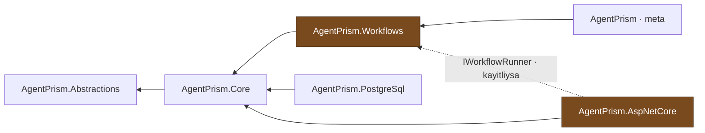

# Faz 15 — Workflows: Yürütme ve Kalıcılık

> **Durum:** ✅ Tamamlandı (2026-08-03)
> **Kaynak:** [BEYIN-FIRTINASI.md](BEYIN-FIRTINASI.md) · **F-27** (1/2)
> **Önkoşul:** [Faz 12](12-AGENT-CAGRI-GRAFIGI.md) — `runs.parent_run_id` bu fazda yeniden kullanıldı
> **Sonraki:** [Faz 16](16-WORKFLOWS-ARAYUZ.md) — graf, arayüz, human-in-the-loop
> **Paketler:** `AgentPrism.Abstractions`, `.Core`, `.PostgreSql`, `.AspNetCore`, **`AgentPrism.Workflows` (YENİ)**
> **Migration:** 0007

---

## Bu Fazda Ne Yapıldı

`Microsoft.Agents.AI.Workflows` 1.16.0 üzerine kurulu bir workflow yürütme
motoru eklendi. Katalogdaki agent'lar beş hazır desenle birbirine bağlanır,
her yürütme bir `runs` satırıdır ve kontrol noktalarından sürdürülebilir.

Arayüz, graf görselleştirme ve human-in-the-loop **Faz 16'dadır**.

---

## 🚨 Ölçülen MAF Davranışları

Bu bölüm fazın en değerli çıktısıdır. Aşağıdakiler **reflection ve gerçek
çalıştırma ile ölçüldü**; hiçbiri MAF dokümanında yazılı değildir.

### 1. Yürütme bir `TurnToken` ister

```csharp
var run = await InProcessExecution.RunStreamingAsync(workflow, messages, cm, sessionId, ct);
await run.TrySendMessageAsync(new TurnToken(emitEvents: true));   // ← ZORUNLU
```

Token gönderilmezse graf gelen mesajları yalnızca **yutar**: ilk super-step'ten
sonra `Idle` olur, hiçbir agent konuşmaz ve hiçbir hata verilmez. Ölçüldü —
token'sız çalıştırma 6 olay üretti ve sessizce bitti; token'lı çalıştırma 40+
olay üretti ve zinciri tamamladı.

### 2. `AgentResponseEvent`, `WorkflowOutputEvent`'ten **türer**

```
WorkflowEvent
 └── WorkflowOutputEvent
      ├── AgentResponseEvent
      └── AgentResponseUpdateEvent
```

`switch` içinde genel dal önce yazılırsa agent yanıtları "workflow çıktı üretti"
diye sınıflanır ve gerçek çıktı kaybolur. `WorkflowEventMapper` bu sırayı
korur; regresyon testi `Agent_guncellemesi_cikti_DEGIL_metin_parcasi_olarak_eslenir`.

### 3. Kontrol noktası yükü polimorfiktir — `$type` gerçekten vardır

Üç agent'lı bir `Sequential` workflow'un 7.537 baytlık kontrol noktasında
`{"$type":0,"hasCondition":false,...}` ayracı 1260. bayttan itibaren bulundu.
Ayrac bulunduğu nesnenin **ilk** özelliği olmak zorundadır → sütun `json`,
`jsonb` **değil** (K-027).

Gerçek PostgreSQL'de doğrulandı:

```
},"edges":{"ozetleyici_9f45b5e64ade4bd798da24cd4eabffaa":[{"$type":0,"hasCondition":false,
```

### 4. 🚨 Executor kimlikleri **agent örneğinden** türer

Kimlik biçimi `{Name}_{AIAgent.Id}`'dir ve `AIAgent.Id` her örnek için rastgele
üretilir — **sanal değildir**, türetilmiş bir sınıf değiştiremez (reflection ile
doğrulandı: `prop String Id { get; }`).

Ölçüldü:

| Kurulum | Sürdürme |
|---------|----------|
| Aynı `Workflow` örneği | ✅ Başarılı |
| Yeniden kurulan graf, **aynı** agent örnekleri | ✅ Başarılı |
| Yeniden kurulan graf, **yeni** agent örnekleri | ❌ `InvalidDataException: The specified checkpoint is not compatible with the workflow` |

Bu yüzden `WorkflowAgentCache` eklendi: sarmalayıcı agent örnekleri
`(workflowName, agentName)` çiftine göre süreç ömrü boyunca saklanır. Graf her
çalıştırmada yeniden kurulur (executor durumu taze kalsın diye) ama agent
örnekleri sabit kalır.

**Bilinen sınır:** önbellek süreç belleğindedir. Uygulama yeniden başlatıldığında
kimlikler değişir ve eski kontrol noktaları kullanılamaz. Koşucu bu durumda
MAF'ın ham mesajı yerine ne yapılması gerektiğini söyleyen bir hata üretir.

### 5. `InProcessExecution.RunStreamingAsync` yürütmeyi **hemen** başlatır

Executor'lar `WatchStreamAsync` pompasının içinde değil, `RunStreamingAsync`
çağrısında başlatılan bir arka plan görevinde çalışır ve o görev
`ExecutionContext`'i **tam o anda** yakalar.

Sonuç: `AgentPrismRunContext` kapsamı yalnızca `MoveNextAsync` öncesinde
yazılırsa alt agent çağrıları "çalıştırma kaydı kapalı" diyerek reddedilir ve
workflow **sessizce boş** çalışır — hiçbir agent satırı, hiçbir kontrol noktası
oluşmaz. Kapsam `StartAsync` çağrısından **önce** de yazılmalıdır. Bu, Faz
6/11/12'nin `AsyncLocal` tuzağının dördüncü hâlidir; birim testleri yakaladı.

---

## 15.1 — Neden Yeni Paket

`AgentPrism.Workflows` ayrı bir pakettir. Gerekçe K-001'in doğrudan uygulaması:
workflow kullanmayan tüketici 130 tipli bir yürütme motorunu çekmemelidir.



- `AgentPrismAotCompatible` = **false** (yürütme motoru yansıma kullanır)
- `AgentPrism.AspNetCore` bu pakete **referans vermez**; `IWorkflowRunner`
  soyutlaması MCP'deki `IMcpToolRefresher` deseninin aynısıdır
- Checkpoint deposu `AgentPrism.PostgreSql` içinde yaşar ama MAF Workflows
  tiplerini **görmez**: soyutlama `JsonElement` ile ifade edilir, MAF'ın
  `ICheckpointStore<JsonElement>` uyarlaması `AgentPrism.Workflows` içindedir

Kural `DependencyDirectionTests` ile korunur.

---

## 15.2 — Workflow Kataloğu ve K2

| Kaynak | İzin | Gerekçe |
|--------|------|---------|
| **Kodda tanımlı** (`AddWorkflow(name, factory)`) | Serbest — her `Executor` tipi, koşullu kenar, alt workflow | Kod derleme zamanında yazılmıştır |
| **Arayüzden tanımlı** | Yalnız katalogdaki agent'ları bağlayan **beş hazır desen** | Yeni davranış üretmez, var olanı dizler |

Beş desenin tamamı uygulandı (kullanıcı kararı):

| Desen | Ne yapar | Ek alan |
|-------|----------|---------|
| `Sequential` | Sırayla; her çıktı sonrakinin girdisi | — |
| `Concurrent` | Aynı anda; sonuçlar birleştirilir | — |
| `Handoff` | İlk agent gerektiğinde devreder | `handoffInstructions`, `maxIterations` |
| `GroupChat` | Round-robin yönetici sırayı dağıtır | `maxIterations` |
| `Magentic` | Yönetici agent plan kurar, izler, yeniden planlar | `managerAgentName` (zorunlu), `maxIterations` |

**Plandan sapma — `GroupChat` yönetici agent istemez.** Plan taslağı
`ManagerAgentName` alanını "GroupChat / Magentic" için işaretlemişti. Ölçüldü:
`AgentWorkflowBuilder.CreateGroupChatBuilderWith` bir
`Func<IReadOnlyList<AIAgent>, GroupChatManager>` alır — yönetici bir *agent*
değil, kod tarafındaki `RoundRobinGroupChatManager`'dır. Alan yalnızca
`Magentic` için zorunludur; başka desende verilirse **400** döner (sessizce yok
saymak kullanıcıyı yanıltırdı).

**Plandan sapma — `Magentic` plan onayı kapatıldı.** Varsayılan ayarla MAF ilk
super-step sonunda bir `RequestInfoEvent` yayınlar ve yürütme `PendingRequests`
durumunda kalır. Bu human-in-the-loop akışıdır ve yanıt verme yolu Faz 16'nın
konusudur; açık bırakmak her Magentic çalıştırmasını yarım bırakırdı. Derleyici
`RequirePlanSignoff(false)` çağırır.

---

## 15.3 — Çalıştırma Kaydı: `runs` Tablosu Yeniden Kullanıldı

Yeni bir `workflow_runs` tablosu **açılmadı**.

```sql
ALTER TABLE {schema}.runs ADD COLUMN kind smallint NOT NULL DEFAULT 0;  -- 0=Agent, 1=Workflow
ALTER TABLE {schema}.runs ADD COLUMN workflow_name text;
```

- Workflow çalıştırması bir `runs` satırıdır (`kind = 1`)
- İçinde çağrılan her agent Faz 12'nin `parent_run_id` mekanizmasıyla **alt
  satır** olur — waterfall kendiliğinden doğru çizilir
- `RunEventType` sekiz yeni değer aldı (append-only, 11–18):
  `WorkflowStarted`, `SuperStepStarted`, `SuperStepCompleted`, `ExecutorInvoked`,
  `ExecutorCompleted`, `ExecutorFailed`, `WorkflowOutput`, `WorkflowRequest`
- Eşlenmeyen MAF olayı **düşürülmez, loglanır** (`WorkflowEventMapping.IsKnown`)

**`AgentName` workflow satırlarında workflow'un adıdır.** Boş bırakmak mevcut
listeleri, istatistikleri ve arayüzü adsız satırlarla doldururdu.

---

## 15.4 — Veri Modeli (Migration 0007)

`workflows` (jsonb tanım) + `workflow_checkpoints` (**`json`** durum) + `runs`
üzerine iki sütun. Tam SQL: `src/AgentPrism.PostgreSql/Migrations/0007_workflows.sql`.

Sürüm **geçmişi tutulmaz** (`agent_definition_versions` benzeri bir tablo yok).
Gerekçe: bir workflow tanımı ad listesi ve desenden ibarettir; geri almak için
gereken bilgi `audit_log` içinde zaten bulunur. Agent tanımı ise talimat
**metni** taşır ve o metnin eski hâli başka hiçbir yerde yeniden kurulamaz.

---

## 15.5 — Checkpoint Sahipliği

Uygulanan kurallar:

1. `ReadAsync` / `ListAsync` / `DeleteAsync` her zaman `tenant_id` filtresiyle
   çalışır. Kiracı eşleşmezse **bulunamadı** döner — "yetkisiz" bile denmez.
   Sözleşme testi: `Baska_kiracinin_noktasi_BULUNAMAZ`.
2. `sessionId` istemciden gelir ve `WorkflowSessionId.Require` ile doğrulanır
   (yalnız harf, rakam, `-`, `_`; en fazla 128 karakter). Regex kullanılmadı —
   `MA0009` timeout verilemeyen her regex'i işaretler.
3. Sürdürme, çalıştırma başlatmakla aynı role tabidir (`Operator`).
4. Kontrol noktası kimliğini **AgentPrism üretir** (zaman sıralı UUID); MAF
   içeriği bizim kararımızdır.
5. Kiracı ve çalıştırma kimliği ortam kapsamından okunur — MAF'ın yazma çağrısı
   hiçbir bağlam parametresi taşımaz (K-114 ile aynı çözüm).

---

## 15.6 — Gerçekleşen Public API

```csharp
// AgentPrism.Workflows
public static IAgentPrismBuilder UseWorkflows(this IAgentPrismBuilder builder,
                                              Action<AgentPrismWorkflowOptions>? configure = null);

public static IAgentPrismBuilder AddWorkflow(this IAgentPrismBuilder builder, string name,
                                             Func<IServiceProvider, Workflow> factory,
                                             string? description = null);

// 🚨 Kodda tanimli workflow'larda agent'lar BUNUNLA baglanir.
public static AIAgent GetWorkflowAgent(this IServiceProvider services, string workflowName,
                                       string agentName, string? description = null);

public sealed class AgentPrismWorkflowOptions
{
    public const string SectionName = "AgentPrism:Workflows";
    public bool Enabled { get; set; } = true;
    public bool EnableCheckpointing { get; set; } = true;
    public int MaxConcurrentRuns { get; set; } = 4;
    public TimeSpan RunTimeout { get; set; } = TimeSpan.FromMinutes(10);
    public int MaxSuperSteps { get; set; } = 100;
    public bool KeepCheckpointsAfterCompletion { get; set; } = true;
}

// AgentPrism.Abstractions — MAF tipi YOK
public interface IWorkflowRunner
{
    ValueTask<IReadOnlyList<WorkflowDescriptor>> ListAsync(CancellationToken ct = default);
    ValueTask<WorkflowDescriptor?> GetAsync(string name, CancellationToken ct = default);
    IAsyncEnumerable<RunEvent> RunStreamingAsync(WorkflowRunRequest request, CancellationToken ct = default);
    IAsyncEnumerable<RunEvent> ResumeStreamingAsync(WorkflowResumeRequest request, CancellationToken ct = default);
}

public interface IWorkflowDefinitionStore
{
    ValueTask<WorkflowDefinition?> GetAsync(string tenantId, string name, CancellationToken ct = default);
    ValueTask<IReadOnlyList<WorkflowDefinition>> ListAsync(string tenantId, CancellationToken ct = default);
    ValueTask<WorkflowDefinition> SaveAsync(string tenantId, WorkflowDefinition definition, CancellationToken ct = default);
    ValueTask<bool> DeleteAsync(string tenantId, string name, CancellationToken ct = default);
}

public interface IWorkflowCheckpointStore
{
    ValueTask<WorkflowCheckpointRecord> CreateAsync(WorkflowCheckpointRecord record, CancellationToken ct = default);
    ValueTask<JsonElement?> ReadAsync(string tenantId, string sessionId, string checkpointId, CancellationToken ct = default);
    ValueTask<IReadOnlyList<WorkflowCheckpointRecord>> ListAsync(string tenantId, string sessionId, CancellationToken ct = default);
    ValueTask<IReadOnlyList<WorkflowCheckpointRecord>> ListByRunAsync(string tenantId, Guid runId, CancellationToken ct = default);
    ValueTask<int> DeleteAsync(string tenantId, string sessionId, CancellationToken ct = default);
}

// AgentPrism.Core — HTTP katmani ve derleyici AYNI kurali kullanir
public static class WorkflowDefinitionValidator
{
    public static string? Validate(WorkflowDefinition definition);
    public static void Require(WorkflowDefinition definition);
}
```

### Plandan sapan imzalar

| Plan | Gerçekleşen | Gerekçe |
|------|-------------|---------|
| `ValueTask<bool> ResumeAsync(...)` | `IAsyncEnumerable<RunEvent> ResumeStreamingAsync(...)` | Sürdürme de olay üretir; `bool` dönmek akışı istemciden gizlerdi |
| `IWorkflowCheckpointStore` 4 metot | 5 metot (`ListByRunAsync` eklendi) | Bir oturum birden çok çalıştırma taşır; `runs/{id}/checkpoints` ucu çalıştırma bazlı filtre ister |
| `WorkflowDefinition.Version` istemciden | Depo belirler, gelen değer yok sayılır | İki kullanıcı aynı sürüm numarasını yazamamalı |
| — | `WorkflowAgentCache` (yeni) | Executor kimlik kararlılığı; bkz. ölçüm 4 |
| — | `GetWorkflowAgent` (yeni public API) | Kodda tanımlı workflow'ların ağaca bağlanması; bkz. "Yaşanan hatalar" |
| `RunEventWriter.AppendAsync` → `ValueTask` | `ValueTask<RunEvent>` | Aynı olay hem depoya yazılıp hem istemciye gönderilir; ikinci kez kurmak sıra numarasını ikiye bölerdi |

---

## 15.7 — HTTP Uçları

| Uç | Rol | Ne yapar |
|----|-----|----------|
| `GET {prefix}/api/workflows` | Reader | Katalog (kod + veritabanı) |
| `GET {prefix}/api/workflows/{name}` | Reader | Tek tanım |
| `PUT {prefix}/api/workflows/{name}` | Admin | Tanım oluşturur/günceller; **kayıt anında doğrular** |
| `DELETE {prefix}/api/workflows/{name}` | Admin | Tanımı siler |
| `POST {prefix}/api/workflows/{name}/run` | Operator | SSE ile çalıştırır; `runs` satırı üretir |
| `GET {prefix}/api/workflows/runs/{runId}/checkpoints` | Reader | Kontrol noktası listesi (durum yükü **taşımaz**) |
| `POST {prefix}/api/workflows/runs/{runId}/resume` | Operator | SSE ile sürdürür; **yeni** `runs` satırı açar |

`501 Not Implemented` — `AgentPrism.Workflows` kayıtlı değilse yalnızca
**çalıştırma** uçlarında. Tanım yönetimi motorsuz da çalışır: depolar
`AddAgentPrism()` tarafından her zaman kaydedilir.

🚨 `IWorkflowRunner?` ve diğer opsiyonel servis parametreleri `[FromServices]`
ile **açıkça** işaretlendi. Faz 9'da ölçüldü: işaretlenmeyen bir opsiyonel
servis parametresi minimal API'yi "body" çıkarımına iter ve **tüm** uçları kırar.

---

## Dosya Listesi

```
src/AgentPrism.Abstractions/
├── Runs/RunKind.cs                          (YENI)
└── Workflows/
    ├── IWorkflowCheckpointStore.cs          (YENI)
    ├── IWorkflowDefinitionStore.cs          (YENI)
    ├── IWorkflowRunner.cs                   (YENI)
    ├── WorkflowCheckpointRecord.cs          (YENI)
    ├── WorkflowCheckpointState.cs           (YENI)
    ├── WorkflowDefinition.cs                (YENI)
    ├── WorkflowDescriptor.cs                (YENI)
    └── WorkflowKind.cs                      (YENI)

src/AgentPrism.Core/
├── Audit/AuditingWorkflowDefinitionStore.cs (YENI)
├── Storage/InMemoryWorkflowStores.cs        (YENI — iki depo)
└── Workflows/WorkflowDefinitionValidator.cs (YENI)

src/AgentPrism.Workflows/                    (YENI PAKET)
├── AgentPrism.Workflows.csproj
├── README.md
├── AgentPrismWorkflowOptions.cs
├── AgentPrismWorkflowsBuilderExtensions.cs
├── WorkflowAgentBinding.cs
└── Internal/
    ├── AgentPrismCheckpointStore.cs
    ├── CodeWorkflowRegistration.cs
    ├── WorkflowAgentCache.cs
    ├── WorkflowCatalog.cs
    ├── WorkflowDefinitionCompiler.cs
    ├── WorkflowEventMapper.cs
    ├── WorkflowRunner.cs
    └── WorkflowSessionId.cs

src/AgentPrism.PostgreSql/
├── Migrations/0007_workflows.sql            (YENI)
├── Internal/WorkflowDefinitionPayload.cs    (YENI)
├── Stores/PostgresWorkflowCheckpointStore.cs (YENI)
└── Stores/PostgresWorkflowDefinitionStore.cs (YENI)

src/AgentPrism.AspNetCore/
├── Contracts/WorkflowContracts.cs           (YENI)
└── Endpoints/WorkflowEndpoints.cs           (YENI)
```

---

## Testler

| Proje | Sınıf | Ne doğrular | Test |
|-------|-------|-------------|------|
| `AgentPrism.Workflows.UnitTests` (**yeni**) | `WorkflowDefinitionValidatorTests` | Yapısal kurallar: boş liste, tekrar, desen-alan uyumu | 11 |
| | `WorkflowDefinitionCompilerTests` | **Beş desenin tamamı** derlenir; bilinmeyen agent; **executor kimliği kararlılığı** | 9 |
| | `WorkflowRunnerTests` | Ağaç, zincir akışı, checkpoint, sürdürme, kiracı yalıtımı, `MaxSuperSteps`, oturum kimliği | 13 |
| | `WorkflowEventMapperTests` | Dal sırası (`AgentResponseEvent` ⊂ `WorkflowOutputEvent`), bilinmeyen olay | 7 |
| | `WorkflowAgentBindingTests` | Kodda tanımlı workflow'un ağaca bağlanması | 3 |
| `AgentPrism.PostgreSql.IntegrationTests` | `WorkflowDefinitionStoreContract` | Sürüm artışı, kiracı yalıtımı, **tüm alanların gidiş-dönüşü** | 10 ×2 |
| | `WorkflowCheckpointStoreContract` | **`$type` sıra koruması**, kiracı yalıtımı, çalıştırma filtresi | 8 ×2 |
| | `RunStoreContract` | `kind` + `workflow_name` aynı tabloda | +1 ×2 |
| | `MigrationTests` | 24 tablo (0007 iki tablo ekler) | güncellendi |
| `AgentPrism.AspNetCore.FunctionalTests` | `WorkflowEndpointTests` | `501`, CRUD, `400`, SSE, ağaç, checkpoint, sürdürme | 9 |

**Toplam: 758 test, 0 hata.** (Faz 14 sonunda 700 idi.)

---

## Gerçek Kanıt

`samples/AgentPrism.Api`, gerçek OpenAI modeli (`gpt-5.4-mini`) ve gerçek
PostgreSQL 18 ile çalıştırıldı.

### Kodda tanımlı workflow — `ozetle-ve-cevir`

```
POST /agentprism/api/workflows/ozetle-ve-cevir/run
→ 122 SSE cercevesi, ilk "run", son "done"

olaylar: RunStarted 1, WorkflowStarted 1, SuperStepStarted 3,
         ExecutorInvoked 8, ExecutorCompleted 8, MessageDelta 94,
         SuperStepCompleted 3, WorkflowOutput 1, RunCompleted 1
```

`runs` ağacı — **1 workflow + 2 agent**:

```
depth=0 kind=Workflow  name=ozetle-ve-cevir  status=Completed events=124 agac=329 token
depth=1 kind=Agent     name=ozetleyici       status=Completed events= 55 token=140
depth=1 kind=Agent     name=cevirmen         status=Completed events= 37 token=189
```

Kontrol noktaları — zincirlenmiş üç nokta:

```
019fc48b1a12 parent=-
019fc48b1d83 parent=019fc48b1a12
019fc48b1d89 parent=019fc48b1d83
```

### Arayüzden tanımlı workflow — `inceleme-zinciri`

```
PUT /agentprism/api/workflows/inceleme-zinciri
{"kind":"Sequential","agentNames":["ozetleyici","cevirmen"]}
→ 200, version=1, tenantId="default"

POST .../run → 101 cerceve, agac 3 satir, agac toplami 259 token
```

Çıktı (zincirin gerçekten aktığının kanıtı — özet Türkçe, çeviri İngilizce):

```
- Faz 15, workflow yürütmesini getirdi.
- Katalogdaki agentlar hazır desenlerle birbirine bağlanır.
- Her yürütme bir runs satırıdır.
Phase 15 introduced workflow execution. Agents in the catalog are connected
to each other with ready-made patterns, and each execution is a runs row.
```

### Sürdürme

```
POST /agentprism/api/workflows/runs/{runId}/resume
→ YENI runId, 98 cerceve, WorkflowOutput uretildi, RunCompleted
```

Hem kodda hem arayüzden tanımlı workflow için başarılı.

### Veritabanı

```
 runs                 | kind          | smallint
 runs                 | workflow_name | text
 workflow_checkpoints | state         | json          ← jsonb DEGIL
 workflows            | definition    | jsonb
```

`$type` ayracı korunmuş:

```
},"edges":{"ozetleyici_9f45b5e64ade4bd798da24cd4eabffaa":[{"$type":0,"hasCondition":false,
```

`runs.kind` dağılımı:

```
 kind | workflow_name    | agent_name       | count
    1 | inceleme-zinciri | inceleme-zinciri |     2
    1 | ozetle-ve-cevir  | ozetle-ve-cevir  |     2
    0 |                  | cevirmen         |     3
    0 |                  | ozetleyici       |     3
```

---

## Uygulama Sırasında Yaşanan Hatalar

Bu bölüm sonraki fazın en değerli bilgisidir.

### 1. Workflow sessizce boş çalıştı

**Belirti:** 4 birim testi düştü — workflow satırı `Completed` ama sıfır alt
agent satırı, sıfır kontrol noktası.

**Kök neden:** `AgentPrismRunContext` kapsamı yalnızca `MoveNextAsync` öncesinde
yazılıyordu. MAF yürütmeyi `RunStreamingAsync` çağrısında başlatan bir arka plan
görevine devrediyor ve o görev `ExecutionContext`'i tam o anda yakalıyor —
kapsam henüz boştu, `ChildAgentInvoker` tüm çağrıları reddetti.

**Çözüm:** kapsam `StartAsync`'ten önce de yazılır.

### 2. Kodda tanımlı workflow ağaca bağlanmadı

**Belirti:** Örnek uygulama gerçek modelle çalıştı, çıktı doğruydu, ama
`GET /api/runs/{id}/tree` **tek satır** döndü. Agent'lar bağımsız kök
çalıştırmalar olarak listede duruyordu.

**Kök neden:** Örnek, agent'ları `IAgentCatalog.ResolveAsync` ile **doğrudan**
alıyordu. Katalogdan gelen agent kayıt sarmalayıcısını taşır ama MAF onu
`options = null` ile çağırır; sarmalayıcı ağaç bilgisini okuyamaz ve kendi kök
satırını açar.

**Çözüm:** `GetWorkflowAgent` public API'si eklendi; regresyon testi
`Baglanan_agentler_workflow_agacina_girer`. **Yalnızca örnek uygulamayı
gerçekten çalıştırmak ortaya çıkardı** — 209 test yeşildi.

### 3. Sürdürme `InvalidDataException` verdi

**Belirti:** Kontrol noktaları yazıldı, listelendi, ama sürdürme
`The specified checkpoint is not compatible with the workflow` ile düştü.

**Kök neden:** Graf her çalıştırmada yeniden kuruluyordu ve her kurulumda yeni
`ChildAgentInvoker` örnekleri üretiliyordu → yeni `AIAgent.Id` → yeni executor
kimlikleri.

**Çözüm:** `WorkflowAgentCache`. Regresyon testi
`Ayni_tanim_iki_kez_derlenirse_EXECUTOR_KIMLIKLERI_AYNI_KALIR`.

---

## Bitiş Ölçütleri (DoD)

- [x] Kodda tanımlı bir workflow çalışıyor ve SSE ile akıyor — 122 çerçeve
- [x] Arayüzden `Sequential` bir workflow tanımlanıp çalıştırılıyor — 101 çerçeve
- [x] `runs` ağacı doğru: 1 workflow satırı + N agent satırı — üç satır ölçüldü
- [x] Checkpoint yazılıyor, listeleniyor ve **sürdürme çalışıyor** — üç zincirli nokta
- [x] Başka kiracının checkpoint'i bulunamıyor — `Baska_kiracinin_noktasi_BULUNAMAZ`
- [x] Paket ekleme kontrol listesi tamam (README, slnx, meta, `DependencyDirectionTests`)
- [x] Dört doğrulama kapısı sıfır uyarı; `dotnet pack` **9 paket** üretiyor

---

## Sonraki Faza Devir Notu

- **Graf çizimi:** `WorkflowVisualizer.ToMermaidString(workflow)` ve
  `Workflow.ReflectEdges()/ReflectExecutors()/ReflectPorts()` hazır. Bu fazda
  graf **çizilmedi**, yalnızca çalıştırıldı.
- **Human-in-the-loop:** `RequestPort` / `ExternalRequest` / `ExternalResponse`
  ve `StreamingRun.SendResponseAsync` Faz 16'nın konusudur. Bu fazda
  `blockOnPendingRequest: false` kullanılır; bekleyen istek varsa çalıştırma
  anlaşılır bir hata ile biter. `RunEventType.WorkflowRequest` (18) değeri
  şimdiden ayrıldı — Faz 16 enum sırasını değiştirmek zorunda kalmaz.
  `MagenticWorkflowBuilder.RequirePlanSignoff(true)` bu yolun ilk gerçek
  tüketicisidir.
- **🚨 Kontrol noktası kimlikleri süreç ömürlüdür.** Uygulama yeniden
  başlatıldığında eski kontrol noktaları kullanılamaz. Kalıcı çözüm MAF'ın
  executor kimliği üretimini dışarıdan verilebilir kılmasını ister; alternatif,
  `WorkflowBuilder` + `AIAgentBinding.Id` ile grafı elle kurmaktır (hazır
  desenlerin `OutputMessages`/`Batcher`/`HandoffStart` executor'larını yeniden
  yazmak gerekir — pahalı).
- **`Microsoft.Agents.AI.Workflows.Declarative`** sürümü çekirdekten farklıdır
  (arama sonucu: 1.13.x serisi, çekirdek 1.16.0). Faz 16 bunu **ilk iş olarak**
  doğrulamalıdır; 1.16.0 uyumlu sürüm yoksa almamalıdır.
- **Arayüz için hazır veri:** `GET /api/runs?includeChildren=false` workflow
  satırlarını da döndürür (`kind` alanı ayırt eder). Faz 16 bir `kind` filtresi
  eklemek isteyebilir — `RunQuery` şu an bu filtreyi **taşımıyor**.
