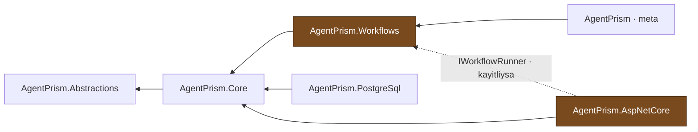

# Faz 15 — Workflows: Yürütme ve Kalıcılık

> **Durum:** 📋 Planlandı
> **Kaynak:** [BEYIN-FIRTINASI.md](BEYIN-FIRTINASI.md) · **F-27** (1/2)
> **Önkoşul:** [Faz 12](12-AGENT-CAGRI-GRAFIGI.md) — `runs.parent_run_id` bu fazda yeniden kullanılır
> **Sonraki:** [Faz 16](16-WORKFLOWS-ARAYUZ.md) — graf, arayüz, human-in-the-loop
> **Paketler:** `AgentPrism.Abstractions`, `.Core`, `.PostgreSql`, `.AspNetCore`, **`AgentPrism.Workflows` (YENİ)**
> **Migration:** 0007 (planlanan sırada)

---

## Bu Faza Başlarken

1. [`KARARLAR.md`](KARARLAR.md) — **K-054** (Faz 6'da ertelendi), **K-001** (modüler paket ailesi), **K-006** (AOT katman bazlı), **K-057** (`.Core` paket seçimi gerekçesi — aynı mantık burada)
2. [`12-AGENT-CAGRI-GRAFIGI.md`](12-AGENT-CAGRI-GRAFIGI.md) — `runs` ağacı
3. [`MIMARI.md`](MIMARI.md) — bölüm 2 (bağımlılık grafiği), bölüm 6 (çalıştırma yolu)
4. Bu doküman
5. `dump-api.sh` ile **yeniden doğrulayın** — bu fazın API yüzeyi geniştir

---

## Amaç

`Microsoft.Agents.AI.Workflows` GA'dır ve `Directory.Packages.props` içinde
sürümü **zaten sabittir** (1.16.0). Faz 6 bunu bilerek ertelemişti (K-054):
ayrı bir yürütme modeli getirir ve API'si hiç keşfedilmemişti.

Bu faz yürütmeyi ve kalıcılığı getirir. Arayüz, graf görselleştirme ve
human-in-the-loop Faz 16'dadır.

---

## Doğrulanmış MAF API'si

`Microsoft.Agents.AI.Workflows` 1.16.0 — **130 public tip**. Kullanacaklarımız:

```csharp
// Graf kurma
sealed class WorkflowBuilder {
    WorkflowBuilder(ExecutorBinding start);
    WorkflowBuilder AddEdge(ExecutorBinding source, ExecutorBinding target, ...);
    WorkflowBuilder AddFanOutEdge(...);  AddFanInBarrierEdge(...);
    WorkflowBuilder WithName(string);  WithDescription(string);  WithOutputFrom(...);
    Workflow Build(bool validateOrphans = true);
}

// Hazir desenler — KATALOGDAKI AGENT'LARI BAGLAR
static class AgentWorkflowBuilder {
    static Workflow BuildSequential(string? name, IEnumerable<AIAgent> agents);
    static Workflow BuildConcurrent(string? name, IEnumerable<AIAgent> agents,
                                    Func<IList<List<ChatMessage>>, List<ChatMessage>>? aggregator);
    static HandoffWorkflowBuilder  CreateHandoffBuilderWith(AIAgent initialAgent);
    static GroupChatWorkflowBuilder CreateGroupChatBuilderWith(Func<IReadOnlyList<AIAgent>, GroupChatManager> f);
    static MagenticWorkflowBuilder CreateMagenticBuilderWith(AIAgent managerAgent);
}

// Yurutme
static class InProcessExecution {
    static ValueTask<StreamingRun> RunStreamingAsync<TInput>(Workflow w, TInput input,
        CheckpointManager? cm, string? sessionId, CancellationToken ct);
    static ValueTask<StreamingRun> ResumeStreamingAsync(Workflow w, CheckpointInfo from,
        CheckpointManager cm, CancellationToken ct);
}

sealed class StreamingRun : CheckpointableRunBase, IAsyncDisposable {
    IAsyncEnumerable<WorkflowEvent> WatchStreamAsync(bool blockOnPendingRequest, CancellationToken ct);
    ValueTask SendResponseAsync(ExternalResponse response);       // Faz 16
    ValueTask<bool> TrySendMessageAsync<TMessage>(TMessage message);
    ValueTask<RunStatus> GetStatusAsync(CancellationToken ct);
    string SessionId { get; }
}

abstract class CheckpointableRunBase {
    ValueTask RestoreCheckpointAsync(CheckpointInfo info, CancellationToken ct);
    IReadOnlyList<CheckpointInfo> Checkpoints { get; }
    CheckpointInfo? LastCheckpoint { get; }
    bool IsCheckpointingEnabled { get; }
}

// Checkpoint
sealed class CheckpointManager {
    static CheckpointManager CreateInMemory();
    static CheckpointManager CreateJson(ICheckpointStore<JsonElement> store, JsonSerializerOptions? opts);
    ValueTask<CheckpointInfo?> GetLatestCheckpointAsync(string sessionId, CancellationToken ct);
}
interface ICheckpointStore<TStoreObject> {
    ValueTask<CheckpointInfo> CreateCheckpointAsync(string sessionId, TStoreObject value, CheckpointInfo? parent);
    ValueTask<TStoreObject> RetrieveCheckpointAsync(string sessionId, CheckpointInfo key);
    ValueTask<IEnumerable<CheckpointInfo>> RetrieveIndexAsync(string sessionId, CheckpointInfo? withParent);
}
sealed record CheckpointInfo(string SessionId, string CheckpointId);

// Olaylar
WorkflowStartedEvent · SuperStepStartedEvent · SuperStepCompletedEvent
ExecutorInvokedEvent · ExecutorCompletedEvent · ExecutorFailedEvent
AgentResponseEvent · AgentResponseUpdateEvent · RequestInfoEvent
WorkflowOutputEvent · WorkflowErrorEvent · WorkflowWarningEvent

// Gorsellestirme (Faz 16)
static class WorkflowVisualizer { static string ToMermaidString(Workflow w); static string ToDotString(Workflow w); }
Workflow.ReflectEdges() · ReflectExecutors() · ReflectPorts()
```

---

## 15.1 — Neden Yeni Paket

`AgentPrism.Workflows` ayrı bir pakettir. Gerekçe, K-001'in kurduğu kuralın
doğrudan uygulamasıdır: *"PostgreSQL kullanmayan tüketici Npgsql'i
çekmemeli."* Workflow kullanmayan tüketici de 130 tipli bir yürütme motorunu
çekmemelidir.



- `AgentPrismAotCompatible` = **false** (yürütme motoru yansıma kullanır:
  `ReflectingExecutor`, `TypeId`, `PortableValue`)
- `AgentPrism.AspNetCore` bu pakete **referans vermez**; MCP'deki desenin aynısı
  (`IMcpToolRefresher`) burada `IWorkflowRunner` ile kurulur
- Checkpoint deposu `AgentPrism.PostgreSql` içinde yaşar ama **MAF Workflows
  tiplerini görmez**: soyutlama `AgentPrism.Abstractions` içinde `JsonElement`
  ile ifade edilir, MAF'ın `ICheckpointStore<JsonElement>` uyarlaması
  `AgentPrism.Workflows` içinde yapılır

```csharp
// AgentPrism.Abstractions — MAF Workflows tipi YOK
public interface IWorkflowCheckpointStore
{
    ValueTask<WorkflowCheckpointRecord> CreateAsync(WorkflowCheckpointRecord record, CancellationToken ct = default);
    ValueTask<JsonElement?> ReadAsync(string tenantId, string sessionId, string checkpointId, CancellationToken ct = default);
    ValueTask<IReadOnlyList<WorkflowCheckpointRecord>> ListAsync(string tenantId, string sessionId, CancellationToken ct = default);
    ValueTask<int> DeleteAsync(string tenantId, string sessionId, CancellationToken ct = default);
}
```

---

## 15.2 — Workflow Kataloğu ve K2

Workflow tanımı **bir graftır**, kod değildir. Ama bir graf, kod çalıştıran
düğümler içerebilir. K2 sınırı burada şöyle çizilir:

| Kaynak | İzin | Gerekçe |
|--------|------|---------|
| **Kodda tanımlı workflow** (`AddWorkflow(name, factory)`) | Serbest — her `Executor` tipi | Kod derleme zamanında yazılmıştır |
| **Arayüzden tanımlı workflow** | **Yalnız katalogdaki agent'ları birbirine bağlayan** hazır desenler | Yeni davranış üretmez, var olanı diziler |

Arayüzden tanımlanabilecekler:

```csharp
public sealed record WorkflowDefinition
{
    public required string Name { get; init; }
    public string? Description { get; init; }
    public required WorkflowKind Kind { get; init; }
    public IReadOnlyList<string> AgentNames { get; init; } = [];
    public string? ManagerAgentName { get; init; }        // GroupChat / Magentic
    public int? MaxIterations { get; init; }
    public string? TenantId { get; init; }
    public int Version { get; init; } = 1;
}

public enum WorkflowKind { Sequential, Concurrent, Handoff, GroupChat, Magentic }
```

Bu, K2'yi **bozmaz**: kullanıcı yeni kod yazmaz, kodda kayıtlı agent'ları
sıralar. Serbest graf (özel `Executor`'lar) yalnız kodda tanımlanır.

> Faz 16, `Microsoft.Agents.AI.Workflows.Declarative` ile bildirimsel tanımı
> değerlendirecektir. Bu, K2 açısından **yeni bir karar** ister ve bu fazın
> kapsamı dışındadır.

---

## 15.3 — Çalıştırma Kaydı: `runs` Tablosu Yeniden Kullanılır

Yeni bir `workflow_runs` tablosu **açılmaz**. Gerekçe: Runs ekranı, SSE akışı,
kiracı filtreleri, istatistikler ve waterfall zaten `runs` üzerine kurulu;
ikinci bir kayıt hattı hepsini ikiye katlardı.

```sql
ALTER TABLE {schema}.runs ADD COLUMN kind smallint NOT NULL DEFAULT 0;
-- 0 = Agent, 1 = Workflow
ALTER TABLE {schema}.runs ADD COLUMN workflow_name text;
```

- Workflow çalıştırması bir `runs` satırıdır (`kind = 1`)
- İçinde çağrılan her agent, Faz 12'nin `parent_run_id` mekanizmasıyla **alt
  satır** olur — waterfall kendiliğinden doğru çizilir
- `RunEventType` yeni değerler alır (append-only, mevcut değerler değişmez):
  `WorkflowStarted`, `SuperStepStarted`, `SuperStepCompleted`, `ExecutorInvoked`,
  `ExecutorCompleted`, `ExecutorFailed`, `WorkflowOutput`, `WorkflowRequest`
- MAF `WorkflowEvent` tipleri bu değerlere eşlenir; eşlenmeyen olay tipi
  `Unknown` olarak **düşürülür değil, loglanır**

---

## 15.4 — Veri Modeli (Migration 0007)

```sql
CREATE TABLE {schema}.workflows (
    id          uuid        NOT NULL PRIMARY KEY,
    tenant_id   text        NOT NULL,
    name        text        NOT NULL,
    version     integer     NOT NULL,
    definition  jsonb       NOT NULL,
    created_at  timestamptz NOT NULL,
    updated_at  timestamptz NOT NULL,
    CONSTRAINT workflows_tenant_name_uq UNIQUE (tenant_id, name)
);

CREATE TABLE {schema}.workflow_checkpoints (
    id            uuid        NOT NULL PRIMARY KEY,
    tenant_id     text        NOT NULL,
    session_id    text        NOT NULL,
    checkpoint_id text        NOT NULL,
    parent_id     text,
    run_id        uuid,
    state         json        NOT NULL,     -- OPAK · jsonb DEGIL (K-027)
    created_at    timestamptz NOT NULL,
    CONSTRAINT workflow_checkpoints_uq UNIQUE (tenant_id, session_id, checkpoint_id)
);

CREATE INDEX IF NOT EXISTS workflow_checkpoints_session_idx
    ON {schema}.workflow_checkpoints (tenant_id, session_id, created_at DESC);
```

🚨 **`state` sütunu `json`'dur, `jsonb` değil.** MAF'ın checkpoint yükü opak ve
polimorfiktir; `jsonb` anahtarları yeniden sıralar ve `$type` ayracını ilk
özellik olmaktan çıkarır. Bu tam olarak K-027'nin anlattığı hatadır ve burada
tekrarlanmamalıdır.

---

## 15.5 — 🚨 Checkpoint Sahipliği

MAF dokümanı `previous_response_id` ve `conversation_id` için açık uyarı verir.
Aynı uyarı checkpoint'ler için geçerlidir ve **daha ağırdır**: bir checkpoint
tüm yürütme durumunu taşır.

Zorunlu kurallar:

1. `RetrieveCheckpointAsync` her zaman `tenant_id` filtresiyle çalışır.
   Kiracı eşleşmezse **bulunamadı** döner — "yetkisiz" bile denmez, varlığı
   sızdırılmaz.
2. `sessionId` istemciden gelir ve **güvenilmez girdidir**. Faz 4'ün
   `conversation_id` doğrulaması burada birebir uygulanır.
3. Checkpoint'ten sürdürme, çalıştırma başlatmakla aynı role tabidir (Operator).

---

## 15.6 — Public API Taslağı

```csharp
// AgentPrism.Workflows
public static IAgentPrismBuilder UseWorkflows(this IAgentPrismBuilder builder,
                                              Action<AgentPrismWorkflowOptions>? configure = null);

public static IAgentPrismBuilder AddWorkflow(this IAgentPrismBuilder builder, string name,
                                             Func<IServiceProvider, Workflow> factory,
                                             string? description = null);

public sealed class AgentPrismWorkflowOptions
{
    public const string SectionName = "AgentPrism:Workflows";
    public bool Enabled { get; set; } = true;
    public bool EnableCheckpointing { get; set; } = true;
    public int MaxConcurrentRuns { get; set; } = 4;
    public TimeSpan RunTimeout { get; set; } = TimeSpan.FromMinutes(10);
    public int MaxSuperSteps { get; set; } = 100;          // sonsuz donguye karsi
}

// AgentPrism.Abstractions
public interface IWorkflowRunner            // AspNetCore bunu gorur, MAF tipini gormez
{
    ValueTask<IReadOnlyList<WorkflowDescriptor>> ListAsync(CancellationToken ct = default);
    IAsyncEnumerable<RunEvent> RunStreamingAsync(WorkflowRunRequest request, CancellationToken ct = default);
    ValueTask<bool> ResumeAsync(WorkflowResumeRequest request, CancellationToken ct = default);
}
```

---

## 15.7 — HTTP Uçları

| Uç | Rol | Ne yapar |
|----|-----|----------|
| `GET {prefix}/api/workflows` | Reader | Katalog (kod + veritabanı) |
| `GET/PUT/DELETE {prefix}/api/workflows/{name}` | Admin | Tanım yönetimi |
| `POST {prefix}/api/workflows/{name}/run` | Operator | SSE ile çalıştırır; `runs` satırı üretir |
| `GET {prefix}/api/workflows/runs/{runId}/checkpoints` | Reader | Checkpoint listesi |
| `POST {prefix}/api/workflows/runs/{runId}/resume` | Operator | Checkpoint'ten sürdürür |

`501 Not Implemented` — `AgentPrism.Workflows` kayıtlı değilse. Faz 6'nın MCP
tazeleme ucundaki desenin aynısı.

---

## Testler

| Proje | Yeni test |
|-------|-----------|
| `AgentPrism.Workflows.UnitTests` (**yeni proje**) | Tanım → `Workflow` derlemesi (beş desen); bilinmeyen agent adı hatası; `MaxSuperSteps` sınırı; olay eşlemesi |
| `AgentPrism.PostgreSql.IntegrationTests` | `WorkflowCheckpointStoreContract`; `json` gidiş-dönüş (polimorfik yük **bozulmamalı**); kiracı yalıtımı; başka kiracının checkpoint'i **bulunamaz** |
| `AgentPrism.AspNetCore.FunctionalTests` | Uçlar, roller, `501` davranışı, SSE akışı |

**Gerçek kanıt:** üç agent'lı `Sequential` bir workflow gerçek modelle
çalıştırılır; `runs` ağacı (1 workflow + 3 agent satırı), olay akışı ve
checkpoint listesi dokümana yazılır.

---

## Bu Fazda Verilecek Kararlar

1. **`AgentPrism.Workflows` ayrı pakettir** — K-001'in doğrudan uygulaması.
2. **`runs` tablosu yeniden kullanılır**, `workflow_runs` açılmaz.
3. **Checkpoint `json` sütununda** — K-027.
4. **Arayüzden yalnız hazır desenler tanımlanabilir** — K2 korunur.
5. **`AgentPrism.AspNetCore` Workflows paketine referans vermez** —
   `IWorkflowRunner` soyutlaması.

---

## Açık Sorular

1. **Checkpoint varsayılan açık mı?** Açık olursa her super-step'te yazma olur
   ve `run_events` yanında ikinci bir yazma hattı doğar. Öneri: **açık**, ama
   `MaxSuperSteps` ve saklama sınırı ile.
2. **Workflow çalıştırması alt agent çalıştırmalarını `parent_run_id` ile mi
   bağlasın?** Evet önerilir; bu Faz 12'yi önkoşul yapar. Alternatif, Faz 12'yi
   beklemeden düz liste tutmaktır. Öneri: **bağlansın**.
3. **`Magentic` ve `GroupChat` desenleri ilk sürümde olsun mu?** İkisi de
   yönetici agent ister ve maliyeti yüksektir. Öneri: **Sequential, Concurrent,
   Handoff** ile başlanır; diğer ikisi Faz 16'da.

---

## Bitiş Ölçütleri (DoD)

- [ ] Kodda tanımlı bir workflow çalışıyor ve SSE ile akıyor
- [ ] Arayüzden `Sequential` bir workflow tanımlanıp çalıştırılıyor
- [ ] `runs` ağacı doğru: 1 workflow satırı + N agent satırı
- [ ] Checkpoint yazılıyor, listeleniyor ve **sürdürme çalışıyor**
- [ ] Başka kiracının checkpoint'i bulunamıyor (test)
- [ ] Paket ekleme kontrol listesi tamam (README, slnx, meta, `DependencyDirectionTests`)
- [ ] Dört doğrulama kapısı sıfır uyarı; `dotnet pack` **9 paket** üretiyor

---

## Riskler

| Risk | Önlem |
|------|-------|
| 130 tipli API yüzeyi kapsamı şişirir | Yalnız listelenen tipler kullanılır; serbest graf kodda kalır |
| Checkpoint yükü `jsonb` ile bozulur | `json` sütunu + sözleşme testi (K-027 dersi) |
| Sonsuz döngü | `MaxSuperSteps` + `RunTimeout` |
| Yansıma AOT vaadini kırar | Paket `AgentPrismAotCompatible=false`; diğer paketler etkilenmez |
| Workflows sürümü MAF çekirdeğinden ayrışır | Sürüm `$(MicrosoftAgentsAIVersion)` değişkeninden gelir; ayrışma derlemede görülür |

---

## Sonraki Faza Devir Notu

- Faz 16 `WorkflowVisualizer.ToMermaidString` ve `ReflectEdges()` üzerine
  kurulacak. Bu fazda **graf çizilmez**, yalnız çalıştırılır.
- `RequestPort` / `ExternalRequest` / `ExternalResponse` tipleri human-in-the-loop
  içindir ve Faz 16'nın konusudur. Bu fazda `blockOnPendingRequest: false` ile
  çalışılır ve bekleyen istek varsa çalıştırma **anlaşılır bir hata** ile biter.
- `Microsoft.Agents.AI.Workflows.Declarative` paketinin **sürümü çekirdekten
  farklıdır** (arama sonucu: 1.13.0 serisi). Faz 16 bunu ilk iş olarak
  doğrulamalıdır.
