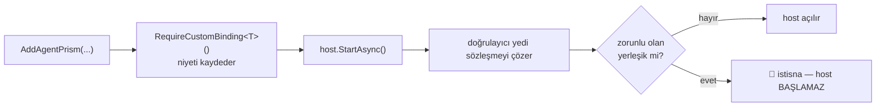

# Faz 150 — Zorunlu Binding Profili

> **Durum:** 📋 Planlandı (2026-09-06)
> **Kaynak:** [ADAYLAR.md](ADAYLAR.md) · **F-202** (tüketici turu 4, F2)
> **Önkoşul:** Yok
> **Paketler:** `AgentPrism.Core` · kanıt testi `AgentPrism.Core.UnitTests`
> **Yeni paket:** Yok · **Migration:** Yok
> **Public API:** Büyüyor — `IAgentPrismBuilder`'a bir metot + bir istisna tipi (Açık Soru 2). `wc -l src/*/PublicAPI.Shipped.txt` → 17 satır / 17 dosya (yalnız başlık), **shipped giriş sıfır**: bugün eklemek bedava, Faz 7'den sonra bir sürüm kararı
> **Tüketici yüzeyi:** `docs-site/`: `guides/embedding.md`, `guides/production.md`, `concepts/governance.md`, `capabilities.md` · sevk edilen: `IAgentPrismBuilder` XML `<example>`, `src/AgentPrism.Core/README.md`
> **Manuel test alanı:** [`docs/manuel-test/25-SAGLIK-TESHIS-OPENAPI.md`](manuel-test/25-SAGLIK-TESHIS-OPENAPI.md)

---

## Bu Faza Başlarken

> `faz-baslangic` skill'ini uygula. **Tamamını değil, yalnız işaret edilen
> bölümleri oku.**

1. Bu doküman
2. Kararlar — dosyanın tamamını **okuma**, yalnız bu kalemleri grep'le:
   ```bash
   grep -n "K-006\|K-250\|K-421" docs/KARARLAR.md
   ```
   **K-006** (AspNetCore'a özgü tipler Core'a sızmaz — bu fazın kontrolü Core'da yaşıyor) ·
   **K-250** (`AgentPrismDiagnosticsReport` genel bir sağlık kararı TAŞIMAZ; üç durumlu yargı yalnız `AgentPrismHealthCheck`'tedir — bu faz o ayrımı bozmaz) ·
   **K-421** (`EnablePublicApiTracking` açıktır)
3. [`149-SAHIPSIZ-OTURUMUN-KATI-REDDI.md`](149-SAHIPSIZ-OTURUMUN-KATI-REDDI.md) — yalnız devir notu:
   ```bash
   awk '/## Sonraki Faza Devir Notu/,0' docs/149-SAHIPSIZ-OTURUMUN-KATI-REDDI.md
   ```
   Konu olarak bağımsızdır; yalnız iki fazın da aynı yedi sözleşmeye dokunduğunu bilmek gerekir.
4. Alan hafızası (bu faz iki alana dokunuyor):
   [`hafiza/aspnetcore-di.md`](hafiza/aspnetcore-di.md) 🚨 (kayıt sırası, `TryAdd` ve captive dependency tuzakları) ·
   [`hafiza/test-altyapisi.md`](hafiza/test-altyapisi.md) (host başlatma testlerinin deseni)
5. Gerektiğinde, tamamı değil ilgili bölümü:
   [`MAF-GENISLEME-NOKTALARI.md`](MAF-GENISLEME-NOKTALARI.md) — genişleme noktası listesi

---

## Amaç

AgentPrism yedi genişleme noktasını `TryAdd` ile kaydeder: tüketici bir şey
kaydetmezse yerleşik varsayılan çalışır ve kurulum **sessizce** açılır. Bu K1'in
("sıfır sürpriz") doğru sonucudur — ama bir güvenlik profili için yanlış
varsayılandır.

Tüketicinin somut sorunu:

> *"ABP modül sırası nedeniyle güvenlik handler'ının varsayılan
> implementasyonla kalmasını startup'ta yakalamak istiyoruz. Profil, zorunlu
> binding eksikse veya kabul edilmeyen default çözülüyorsa host'u durdurmalı."*

Bugün bu bilgi **çalışma anında** görülebiliyor (`/api/diagnostics`), ama bir
kapı değil. `AllowAllRunAuthorizationHandler` çözülen bir üretim host'u
sorunsuz ayağa kalkar ve ilk yetkisiz istek gelene kadar kimse fark etmez.

Emsal aynı repoda: `RequireRolePolicies` **tam olarak** bu deseni kuruyor —
niyet beyan edilir, eksikse host başlamaz.

- **F-202** — Bir tüketici belirli genişleme noktalarının **kendi**
  implementasyonuyla çözülmesini zorunlu ilan edebilir; yerleşik varsayılan
  çözülüyorsa host başlangıçta durur.

### Bugün ne çalışmıyor — doğrulanmış kanıt

| Kanıt | Gözlem |
|---|---|
| [`AgentPrismDiagnosticsCollector.cs:219`](../src/AgentPrism.Core/Diagnostics/AgentPrismDiagnosticsCollector.cs) | `CollectExtensionPoints()` yedi sözleşmeyi çözüp `IsBuiltInDefault`'u hesaplıyor — **cevap zaten üretiliyor** |
| [`ExtensionPointDiagnostic.cs`](../src/AgentPrism.Abstractions/Diagnostics/ExtensionPointDiagnostic.cs) | `Contract` · `Implementation` · `IsBuiltInDefault` üç alanı da public |
| [`AgentPrismRolePolicies.cs:62`](../src/AgentPrism.AspNetCore/Security/AgentPrismRolePolicies.cs) | `RequireRolePolicies` açıkken eksik policy `InvalidOperationException` ile **host'u durduruyor** — sevk edilmiş emsal |
| [`JobHandlerRegistryValidator.cs`](../src/AgentPrism.Core/Scheduling/JobHandlerRegistryValidator.cs) | Core'da 13 satırlık bir `IHostedService`; tek işi bir kaydı **başlangıçta çözmek**. Bu fazın şekli budur |
| [`ToolRegistrationValidationService.cs`](../src/AgentPrism.Core/Tools/ToolRegistrationValidationService.cs) | Aynı desenin ikinci örneği |
| `grep -rn "IsBuiltInDefault" src/` | Değeri **yalnız** teşhis raporunda okunuyor; hiçbir kapı ona bakmıyor |

Yedi sözleşme ve yerleşik varsayılanları (ölçüldü, `:229`–`:275`):

| Sözleşme | Varsayılan | "Varsayılan" testi |
|---|---|---|
| `ITenantContext` | `SingleTenantContext` | tip karşılaştırması |
| `IRunAttributionContext` | `DefaultRunAttributionContext` | tip karşılaştırması |
| `IToolAuthorizationHandler` | `AllowAllToolAuthorizationHandler` | tip karşılaştırması |
| `IRunAuthorizationHandler` | `AllowAllRunAuthorizationHandler` | tip karşılaştırması |
| `IToolApprovalPresenter` | `NullToolApprovalPresenter` | tip karşılaştırması |
| `IRunEventSink` | *(kayıt yok)* | 🚨 `sinkIsDefault` — koleksiyon boş mu |
| `IAttachmentStorage` | *(kayıt yok)* | 🚨 `_attachmentStorage is null` — hiç çözülmüyor |

> Kanıtlar 2026-09-06 tarihinde doğrulandı (HEAD `fc2f9d8d`).

🚨 **Son iki satır diğer beşinden farklıdır.** Onlarda "varsayılan" bir tip
değil, bir **yokluk**tur. Zorunlu ilan edilen bir `IAttachmentStorage` için
kontrol "yerleşik tip mi" değil, "hiç kayıt var mı" olmalıdır. Plan bunu ayrı
bir dal olarak yazıyor; uygulama ikisini tek koda indirmeye çalışmamalıdır.

**Reddedilenler defteri kontrolü:** `binding` · `profil` · `startup` · `DI`
konularında eşleşme **yok**. Kapatılmış bir tartışma açılmıyor.

---

## 150.1 — Beyan: tipli builder çağrısı

**Karar (kullanıcı, 2026-09-06).** Yapılandırmadan dizge listesi ve
adlandırılmış profil enum'u reddedildi. Dizge listesi sözleşme adını bir metne
indirger; sabit profil kümesini **biz** seçeriz ve her deployment'ın ihtiyacı
farklıdır — küme değişirse bu kırıcı bir davranış değişikliği olur.

```csharp
builder
    .RequireCustomBinding<IRunAuthorizationHandler>()
    .RequireCustomBinding<IToolAuthorizationHandler>()
    .RequireCustomBinding<IAttachmentStorage>();
```

Derleme anında tip güvenlidir: yanlış sözleşme adı yazılamaz. Yedi sözleşme
**kapalı bir kümedir**; generic kısıtın bunu derlemede zorlayıp
zorlayamayacağı Açık Soru 1'dedir.

**Varsayılan: hiçbir sözleşme zorunlu değildir** (K1). Çağrı yapılmayan
kurulum bugünkü gibi açılır.

## 150.2 — Kontrol: host başlangıcında

**Karar (kullanıcı, 2026-09-06).** `MapAgentPrism` anı reddedildi: zorunlu
binding bir HTTP kavramı değil, bir **kompozisyon** kavramıdır.
`samples/AgentPrism.Embedded` gibi HTTP'siz bir host'ta tool yetkilendirmesi de
gereklidir ve o host `MapAgentPrism` çağırmaz.

Şekil `JobHandlerRegistryValidator`'ın aynısıdır — Core'da küçük bir
`IHostedService`:



🚨 **Çözüm sırası önemlidir.** Doğrulayıcı sözleşmeleri çözerek onların
**kurulmasına** yol açar. `AgentPrismDiagnosticsCollector` bunu zaten yapıyor,
ama o istek anında çalışıyor; başlangıçta çözmek yeni bir kurulum sırası
üretebilir. Uygulama, doğrulayıcının hangi servisleri hangi sırayla çözdüğünü
[`hafiza/aspnetcore-di.md`](hafiza/aspnetcore-di.md)'ye karşı okur ve captive
dependency üretmediğini kanıtlar.

**Hata mesajı üç şeyi söylemelidir** — tüketicinin isteği buydu ("hangi
binding'in hatalı olduğunu söyleyen mesaj gerekir"):

1. Hangi sözleşme zorunlu ilan edildi
2. Bunun yerine hangi tip çözüldü
3. Nasıl düzeltilir (kaydı `AddAgentPrism`'den **önce** yap)

## 150.3 — Kapsam sınırı

Kontrol **yalnız yedi sözleşmeyi** tanır. `ExtensionPointDiagnostic`'in kendi
XML'i bu sınırı zaten yazıyor:

> *"This is the list, and it does not grow to cover every contract AgentPrism
> registers with `TryAdd`: turning every replaceable registration into a row
> would produce a dependency-injection dump instead of an answer."*

Aynı gerekçe burada da geçerlidir. Rastgele bir DI kaydını zorunlu ilan etme
yeteneği **açılmaz**; tüketici bunu kendi kompozisyon testinde yapar.

**`ITenantStore` gibi `Replace` edilen store kayıtları kapsam dışıdır.**
`UsePostgreSql` onları `Replace` eder ve "yerleşik varsayılan" kavramı orada
farklı çalışır. Tüketicinin raporu bunu ayrıca not etmişti; bu faz o soruyu
açmıyor.

---

## Planlanan Public API

> Taslak imzalardır. Gerçekleşen imzalar kapanışta ayrı bir bölüme yazılır.

```csharp
// AgentPrism.Core — IAgentPrismBuilder

/// <summary>
/// Declares that <typeparamref name="T"/> MUST be resolved from the
/// consumer's own registration. If AgentPrism's built-in default is what
/// resolves at host start, the host does not start.
/// </summary>
/// <remarks>
/// Off by default: an application that never calls this keeps today's
/// behavior exactly. The registration must happen BEFORE AddAgentPrism,
/// because every extension point is registered with TryAdd.
/// </remarks>
IAgentPrismBuilder RequireCustomBinding<T>() where T : class;   // kısıt: Açık Soru 1
```

İstisna tipi Açık Soru 2'dedir. `AgentPrismException` ailesine mi girer, düz
`InvalidOperationException` mi olur — emsal (`AgentPrismRolePolicies.cs:84`)
`InvalidOperationException` kullanıyor.

### HTTP `endpoint`'leri

**Yeni uç yok.** `/api/diagnostics` çıktısı değişmez — K-250 korunur: teşhis
raporu bir yargı taşımaz, yalnız olguyu taşır. Zorunluluk kararı kompozisyonda
yaşar.

### Arayüz payı

**Yok.** Bundle payı **0 KB**.

---

## Planlanan Dosya Listesi

```
src/AgentPrism.Core/
├── IAgentPrismBuilder.cs                       (RequireCustomBinding<T>)
├── AgentPrismBuilder.cs                        (niyetin kaydı)
├── Diagnostics/RequiredBindingValidator.cs     (YENİ — IHostedService)
└── AgentPrismServiceCollectionExtensions.Registration.Core.cs  (doğrulayıcının kaydı)

tests/AgentPrism.Core.UnitTests/Configuration/
└── RequiredBindingTests.cs                     (YENİ)

tests/AgentPrism.AspNetCore.FunctionalTests/
└── RequiredBindingStartupTests.cs              (YENİ — gerçek host başlatma)
```

---

## Hata Modları ve Testler

| Ne bozulabilir | Seviye | Test sınıfı |
|---|---|---|
| Çağrı yapılmayan kurulumda host açılmaz | Fonksiyonel (DI + host sınırı) | `RequiredBindingStartupTests` |
| Zorunlu ilan edilen sözleşme yerleşikle çözülür, host **yine de açılır** | Fonksiyonel | `RequiredBindingStartupTests` — yedi sözleşme için ayrı ayrı |
| Tüketici kaydı `AddAgentPrism`'den **sonra** yapılır ve `TryAdd` onu ezmez | Fonksiyonel | `RequiredBindingStartupTests` — host **başlamamalı** |
| 🚨 `IAttachmentStorage`/`IRunEventSink` yokluk dalı tip karşılaştırmasıyla ölçülür ve yanlış cevap verir | Birim | `RequiredBindingTests` — iki sözleşme ayrı ayrı |
| Hata mesajı hangi binding'in hatalı olduğunu söylemez | Birim | `RequiredBindingTests` — mesaj sözleşme adını **ve** çözülen tipi içerir |
| Doğrulayıcı captive dependency üretir (scoped servisi singleton'a bağlar) | Fonksiyonel | `RequiredBindingStartupTests` — `ValidateOnBuild`/`ValidateScopes` açık host |
| Doğrulayıcı çözüm sırasını değiştirir ve başka bir kayıt bozulur | Fonksiyonel | `ServiceRegistrationSnapshotTests` (mevcut) + `RequiredBindingStartupTests` |
| HTTP'siz host'ta kontrol hiç çalışmaz | Fonksiyonel | `RequiredBindingStartupTests` — `MapAgentPrism` çağırmayan host |
| Aynı sözleşme iki kez zorunlu ilan edilir | Birim | `RequiredBindingTests` — ikinci çağrı hata vermez, küme tekilleşir |
| Yedi dışında bir tip zorunlu ilan edilir | Birim veya derleme | `RequiredBindingTests` — Açık Soru 1'in sonucuna göre |
| İptal: host başlangıcı iptal edilir | Fonksiyonel | `RequiredBindingStartupTests` — `OperationCanceledException` yutulmaz |
| Eşzamanlılık: doğrulayıcı iki kez çalışır | Birim | `RequiredBindingTests` — idempotent |
| Boş girdi: hiç zorunlu sözleşme yok | Fonksiyonel | `RequiredBindingStartupTests` — doğrulayıcı hiçbir şey çözmez |
| Başka kiracı | — | Bu faz kiracı sınırına dokunmaz; kompozisyon kiracıdan bağımsızdır |
| Alt sistem hatası: bir sözleşmenin kurucusu hata verir | Fonksiyonel | `RequiredBindingStartupTests` — hata **yutulmaz**, host başlamaz |

---

## Manuel Kabul Case'leri

> Kapanışta [`docs/manuel-test/25-SAGLIK-TESHIS-OPENAPI.md`](manuel-test/25-SAGLIK-TESHIS-OPENAPI.md) içine eklenir.

| # | Ön koşul | Adımlar | Beklenen sonuç |
|---|---|---|---|
| 1 | `RequireCustomBinding` hiç çağrılmamış | Host'u başlat | Bugünkü gibi açılır |
| 2 | `RequireCustomBinding<IRunAuthorizationHandler>()`, tüketici handler'ı **kayıtlı değil** | Host'u başlat | **Başlamaz**; mesaj `IRunAuthorizationHandler` ve `AllowAllRunAuthorizationHandler` adlarını içerir |
| 3 | Aynı, handler `AddAgentPrism`'den **önce** kayıtlı | Host'u başlat | Açılır |
| 4 | Aynı, handler `AddAgentPrism`'den **sonra** kayıtlı (`TryAdd` ezmez) | Host'u başlat | **Başlamaz** — bu, tüketicinin ABP modül sırası senaryosudur |
| 5 | `RequireCustomBinding<IAttachmentStorage>()`, hiç kayıt yok | Host'u başlat | **Başlamaz** (yokluk dalı) |
| 6 | Aynı, MinIO adaptörü kayıtlı | Host'u başlat | Açılır |
| 7 | HTTP'siz host (`MapAgentPrism` yok), zorunlu binding eksik | Host'u başlat | **Başlamaz** — kontrol HTTP'ye bağlı değil |
| 8 | Host açıldıktan sonra | `curl .../api/diagnostics` | `extensionPoints` çıktısı **değişmemiş** (K-250) |

Sekizi de otomatikleştirilebilir; 👤 insan gerektiren case yok.

---

## Açık Sorular

| # | Soru | Seçenekler | Öneri |
|---|---|---|---|
| 1 | Yedi sözleşme kapalı kümesi derlemede mi, çalışma anında mı zorlansın? | **A:** Çalışma anında — `RequireCustomBinding<T>()` serbest generic, tanınmayan tip için başlangıçta açık bir hata · **B:** Derlemede — yedi arayüzün ortak bir işaretçi arayüzü (`IAgentPrismExtensionPoint`) uygulaması ve generic kısıt | **A.** B, yedi public arayüze bir işaretçi eklemeyi gerektirir; bu, tüketici sözleşmelerini bir iç sınıflandırma için değiştirmektir ve `IAttachmentStorage` gibi bağımsız bir depolama sözleşmesini AgentPrism'in iç taksonomisine bağlar. Uygulama Adım 1'de bu maliyeti ölçer; ucuz çıkarsa B'ye dönebilir |
| 2 | İstisna tipi ne olsun? | **A:** `InvalidOperationException` — `AgentPrismRolePolicies.cs:84` emsali · **B:** `AgentPrismException` ailesinde yeni bir tip | **A.** Emsal aynı repoda ve aynı sınıf hata (yanlış kompozisyon). Yeni bir istisna tipi public yüzeyi büyütür ve tüketicinin yakalayacağı bir şey değildir — host zaten başlamaz |
| 3 | Lifetime iddiası bu faza girsin mi? | **A:** Hayır — bu faz yalnız "yerleşik varsayılan mı" sorusunu yanıtlar · **B:** Evet, `RequireCustomBinding<T>(ServiceLifetime.Singleton)` | **A.** Tüketicinin F2 metni yalnız varsayılan çözülmesinden söz ediyor; lifetime kaygısı onların R3 risk satırındaydı ve `ValidateOnBuild`/`ValidateScopes` bunu zaten yakalar. B, kapsamı ölçülmemiş bir talebe genişletir |
| 4 | Zorunluluk teşhis raporunda görünsün mü? | **A:** Bu fazda hayır (K-250) · **B:** `ExtensionPointDiagnostic`'e `IsRequired` alanı | **A.** Rapor olguyu taşır, niyeti değil. Ayrıca zorunluluk ihlali varsa host zaten ayakta değildir — raporu okuyacak kimse yoktur |

---

## Bitiş Ölçütleri (DoD)

- [ ] `RequireCustomBinding` çağrılmayan kurulumda **hiçbir** davranış değişmez
- [ ] Zorunlu ilan edilen sözleşme yerleşik varsayılanla çözülüyorsa host **başlamaz** — yedi sözleşmenin her biri için ayrı kanıt
- [ ] `IAttachmentStorage` ve `IRunEventSink` **yokluk** dalıyla ölçülür, tip karşılaştırmasıyla değil
- [ ] Kayıt `AddAgentPrism`'den sonra yapılırsa host **başlamaz** (`TryAdd` senaryosu)
- [ ] Hata mesajı üç bilgiyi taşır: hangi sözleşme · hangi tip çözüldü · nasıl düzeltilir
- [ ] Kontrol HTTP'siz host'ta da çalışır — `MapAgentPrism` çağırmayan bir host'la kanıtlandı
- [ ] `ValidateOnBuild` ve `ValidateScopes` açık host'ta doğrulayıcı captive dependency üretmez
- [ ] `/api/diagnostics` çıktısı **değişmez** (K-250)
- [ ] `ServiceRegistrationSnapshotTests` yeşil — kayıt sırası kaymadı
- [ ] Dört doğrulama kapısı sıfır uyarı verir — `python3 scripts/kapi.py kapanis --taban <faz öncesi commit>`
- [ ] `samples/AgentPrism.Api` ile gerçek `run` yapıldı, çıktı belgeye yazıldı
- [ ] `secret` taraması boş döndü
- [ ] Manuel kabul case'leri `docs/manuel-test/25-SAGLIK-TESHIS-OPENAPI.md` içine eklendi; sekizi de koşuldu
- [ ] `faz-denetim` koşuldu; 🔴 bulgu kalmadı
- [ ] `docs-site/` güncellendi (`guides/embedding.md`, `guides/production.md`); `npm run build` + `check-links.mjs` temiz

### Doğrulama komutları

```bash
# Zorunlu binding eksik: host BAŞLAMAMALI
dotnet run --project samples/AgentPrism.Api 2>&1 | head -5
# beklenen: IRunAuthorizationHandler ve AllowAllRunAuthorizationHandler adlarını
#           içeren bir başlangıç hatası

# Teşhis çıktısı değişmedi
curl -s "$APU/api/diagnostics" -H "$APB" | jq '.extensionPoints | length'
# beklenen: 7
```

---

## Riskler

| Risk | Önlem |
|------|-------|
| 🚨 Doğrulayıcı yedi sözleşmeyi başlangıçta çözerek yeni bir kurulum sırası üretir ve başka bir kayıt bozulur | Uygulama önce [`hafiza/aspnetcore-di.md`](hafiza/aspnetcore-di.md)'yi okur. `ServiceRegistrationSnapshotTests` ve `ValidateOnBuild` açık host testi iki katman kurar |
| `IAttachmentStorage`/`IRunEventSink` yokluk dalı diğer beşiyle aynı koda indirilir ve sessizce yanlış cevap verir | Plan bunu 🚨 ile ayırıyor; DoD ayrı bir madde; birim testi iki sözleşmeyi ayrı ayrı ölçer |
| Kontrol yalnız `AddAgentPrism` çağıran host'ta çalışır; `AgentPrism.Cli` gibi başka giriş noktaları kapsanmaz | Uygulama Adım 1'de `AddAgentPrism` çağıran giriş noktalarını **sayar** ve kapsanmayanı dokümana yazar |
| Serbest generic yanlış tiple çağrılır ve hata mesajı anlaşılmaz olur | Açık Soru 1'in A cevabı: tanınmayan tip için başlangıçta **açık** bir hata; mesaj yedi sözleşmeyi listeler |
| Public yüzey Faz 7 öncesi büyüyor | `PublicAPI.Shipped.txt` boş (ölçüldü: 17 satır / 17 dosya). Bugün bedava; plan bunu bir sürüm kararı olarak işaretler |
| Tüketici bunu bir güvenlik garantisi sanır | XML ve site sayfası açıkça yazar: bu bir **kompozisyon** kapısıdır, handler'ın doğru karar verdiğini kanıtlamaz |

---

<!-- ============================================================
     AŞAĞISI KAPANIŞTA DOLDURULUR — `faz-tamamlama` skill'i.
     Plan anında boş kalır. Başlıkları SİLME.
     ============================================================ -->

## Plandan Sapmalar

> Kapanışta doldurulur.

## Bu Fazda Verilen Kararlar

> Kapanışta doldurulur. K-NNN numaraları burada alınır; plan numara rezerve etmez.

## Gerçekleşen Public API

> Kapanışta doldurulur.

## Dosya Listesi (gerçekleşen)

> Kapanışta doldurulur.

## Denetim Bulguları

> Kapanışta doldurulur.

## Sonraki Faza Devir Notu

> Kapanışta doldurulur.
