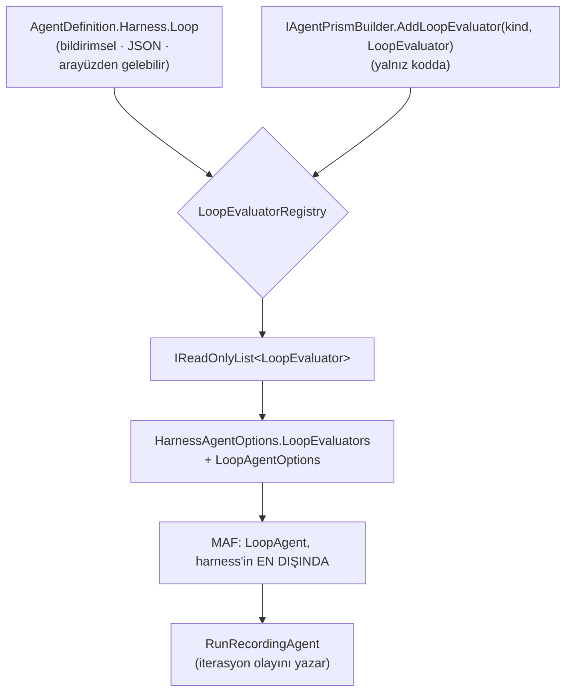

# Faz 151 — Harness'in Döngü Yeteneği

> **Durum:** 📋 Planlandı (2026-09-07)
> **Kaynak:** [ADAYLAR.md](ADAYLAR.md) · **F-192**
> **Önkoşul:** Yok. MAF 1.20.0 yeterlidir; yükseltme beklemez.
> **Paketler:** `AgentPrism.Abstractions`, `AgentPrism.Core`, `AgentPrism.AspNetCore`
> **Yeni paket:** Yok — `LoopAgent` ve beş evaluator `Microsoft.Agents.AI` çekirdeğindedir · **Migration:** Yok
> **Public API:** Büyüyor — `HarnessSettings`'e bir üye, bir yeni `sealed record`, bir builder metodu, bir `RunEventType` değeri. `wc -l src/*/PublicAPI.Shipped.txt` → her dosya **1 satır** (ölçüldü 2026-09-07): hiçbir yüzey sevk edilmemiştir, bugün eklemek **bedavadır**.
> **Tüketici yüzeyi:** site: `docs-site/src/content/docs/concepts/agents.md` (harness bölümü) · sevk edilen: `HarnessSettings` XML dokümanı, `AgentPrism.Core/README.md`
> **Manuel test alanı:** `docs/manuel-test/29-AGENT-DESTEGI.md`

---

## Bu Faza Başlarken

> `faz-baslangic` skill'ini uygula. Aşağıdaki liste o skill'in 2. adımıdır —
> **tamamını değil, yalnız işaret edilen bölümleri oku.**

1. Bu doküman
2. Kararlar — dosyanın tamamını **okuma**, yalnız bu kalemleri grep'le:
   ```bash
   grep -n "K-020\|K-062\|K-007" docs/KARARLAR.md
   ```
   **K-020** (`MAAI001` bastırması tek dosyada toplanır — harness kullanımı
   `AgentDefinitionCompiler.Agents.cs`'te kalır), **K-062** (`FileAccessStore`
   atanmadıkça özellik kapalıdır — bu fazın "varsayılan kapalı" deseninin
   emsali), **K-007** (yeni paket gerekçe ister — bu fazda yeni paket yok).
3. [`arsiv/fazlar/150-ZORUNLU-BINDING-PROFILI.md`](arsiv/fazlar/150-ZORUNLU-BINDING-PROFILI.md) — yalnız devir notu:
   ```bash
   awk '/## Sonraki Faza Devir Notu/,0' docs/arsiv/fazlar/150-ZORUNLU-BINDING-PROFILI.md
   ```
   Bu faz **sekizinci bir genişleme noktası** açıyor (`LoopEvaluator` kaydı).
   Devir notu şunu söylüyor: yeni bir nokta **yalnız**
   `src/AgentPrism.Core/Diagnostics/AgentPrismExtensionPoints.cs` tablosuna
   satır ekler; teşhis raporu ve başlangıç kapısı ikisi de oradan okur.
4. Alan hafızası (bu faz iki alana dokunuyor):
   [`hafiza/maf-api.md`](hafiza/maf-api.md) (MAF tip imzaları ve `MAAI001`) ·
   [`hafiza/cekirdek-calistirma.md`](hafiza/cekirdek-calistirma.md)
   (decorator zinciri ve 🚨 `Activity.Current`/`AsyncLocal` kuralı — `LoopAgent`
   akışlı yolda `RunCoreStreamingAsync`'i sarmalar)
5. Gerektiğinde, tamamı değil ilgili bölümü:
   [`MAF-GENISLEME-NOKTALARI.md`](MAF-GENISLEME-NOKTALARI.md) — döngü satırı
   bugün *"planlanmadı (eval'den AYRI kavram)"* diyor; bu faz onu kapatır.

---

## Amaç

Bugün AgentPrism bir agent'a "bitene kadar çalış" diyemez. Tüketici bunu kendi
dış döngüsüyle yazmak zorundadır ve o döngü `run` kanıtının **dışında** kalır:
kaç iterasyon koştuğu, hangi ölçütün durdurduğu ve kaç token harcandığı
AgentPrism'in kayıtlarında görünmez. MAF bu yeteneği harness'in birinci sınıf,
opt-in bir parçası yapmıştır; AgentPrism onu hiç bağlamamıştır.

- **F-192** — `HarnessSettings`'e bildirimsel bir **bitiş ölçütü** aç, MAF'ın
  `LoopAgent`'ını harness'in en dışına bağla ve her iterasyonu `run` kanıtına yaz.

### Bugün ne çalışmıyor — doğrulanmış kanıt

| Kanıt | Gözlem |
|---|---|
| [`AgentDefinitionCompiler.Agents.cs:236-268`](../src/AgentPrism.Core/Compilation/AgentDefinitionCompiler.Agents.cs#L236) | `HarnessAgentOptions` on üç üye set ediyor; `LoopEvaluators` ve `LoopAgentOptions` **ikisi de yok** |
| `grep -rn "LoopAgent\|LoopEvaluator" src/` | **0 eşleşme** — kaynağın tamamında |
| [`HarnessSettings.cs`](../src/AgentPrism.Abstractions/Agents/HarnessSettings.cs) | On bir üye; hiçbiri bitiş ölçütü değil. `MaximumIterationsPerRequest` bir **tavan**tır |
| [`MAF-GENISLEME-NOKTALARI.md`](MAF-GENISLEME-NOKTALARI.md) | Döngü *"planlanmadı"* diye kayıtlı — **reddedilmemiş, ertelenmiş** |

> Kanıtlar 2026-09-07 tarihinde doğrulandı. Aday metnindeki satır numarası
> (`:172`) kaymıştır; doğru satır **236**'dır.

### MAF imzaları — `maf-api-kesfi` ile doğrulandı (2026-09-07, 1.20.0)

```csharp
// Microsoft.Agents.AI
public sealed class LoopAgent : DelegatingAIAgent
{
    public LoopAgent(AIAgent innerAgent, IEnumerable<LoopEvaluator> evaluators,
                     LoopAgentOptions options, ILoggerFactory loggerFactory);
    protected override Task<AgentResponse> RunCoreAsync(...);
    protected override IAsyncEnumerable<AgentResponseUpdate> RunCoreStreamingAsync(...);
}

public sealed class LoopAgentOptions
{
    public int? MaxIterations { get; set; }
    public bool FreshContextPerIteration { get; set; }
    public bool NonStreamingReturnsLastResponseOnly { get; set; }
    public bool ExcludeOnBehalfOfMessages { get; set; }
    public string OnBehalfOfAuthorName { get; set; }
    public Func<AgentSession, CancellationToken, ValueTask> SessionCreatedCallback { get; set; }
}

public abstract class LoopEvaluator
{
    public virtual ValueTask<LoopEvaluation> EvaluateAsync(LoopContext context, CancellationToken ct);
}

public sealed class LoopEvaluation          // Continue(feedback) · ContinueWithMessages(msgs) · Stop()
{ public string Feedback { get; } public bool ShouldReinvoke { get; } }

// Beş yerleşik evaluator
new TodoCompletionLoopEvaluator(TodoCompletionLoopEvaluatorOptions);            // .Modes, .FeedbackMessageTemplate
new CompletionMarkerLoopEvaluator(string completionMarker, CompletionMarkerLoopEvaluatorOptions);
new AIJudgeLoopEvaluator(IChatClient judgeClient, AIJudgeLoopEvaluatorOptions); // .Criteria, .Instructions
new BackgroundTaskCompletionLoopEvaluator(BackgroundTaskCompletionLoopEvaluatorOptions);
new DelegateLoopEvaluator(Func<LoopContext, CancellationToken, ValueTask<LoopEvaluation>>);

// Microsoft.Agents.AI.Harness — HarnessAgentOptions
public IEnumerable<LoopEvaluator> LoopEvaluators { get; set; }
public LoopAgentOptions LoopAgentOptions { get; set; }
```

---

## 151.1 — Bitiş ölçütü bildirimsel, evaluator kodda kalır

Bu fazın ilk sorusu adayın kendi risk satırındaki sorudur: evaluator seçimi
**bildirimsel bir tip** mi olsun, yoksa MAF tipi doğrudan mı açılsın? Cevap
**ikisi birden**, ama kesin bir sınırla — ve o sınır K2'dir.

`LoopEvaluator` seçmek, agent'a bir **durma koşulu** vermektir. Beş yerleşik
evaluator'dan dördü yalnız **veri** alır (mod adı, işaret metni, ölçüt cümleleri);
beşincisi (`DelegateLoopEvaluator`) bir `Func` alır — yani **kod**. K2 gereği
arayüzden gelen bir tanım kod tanımlayamaz. Bu yüzden yüzey ikiye ayrılır ve
bu ayrım `AddEvalCheck` deseninin **birebir tekrarıdır**
([`AgentPrismEvalCheckRegistration.cs`](../src/AgentPrism.Core/Evaluation/AgentPrismEvalCheckRegistration.cs)):



**Bildirimsel taraf — dört yerleşik `kind`:**

| `kind` | MAF karşılığı | Aldığı veri | K2 durumu |
|---|---|---|---|
| `todoCompletion` | `TodoCompletionLoopEvaluator` | `modes` (string dizisi) | ✅ veri |
| `completionMarker` | `CompletionMarkerLoopEvaluator` | `marker` (string) | ✅ veri |
| `aiJudge` | `AIJudgeLoopEvaluator` | `criteria` (string dizisi), `instructions` | ✅ veri |
| `backgroundTaskCompletion` | `BackgroundTaskCompletionLoopEvaluator` | — | ✅ veri |

**Kod tarafı:** `DelegateLoopEvaluator` **bildirimsel yüzeye hiç girmez.**
Tüketici kendi `LoopEvaluator`'ını `AddLoopEvaluator("kind", evaluator)` ile
kaydeder; tanım yalnız o `kind`'ın **adını** anar. Bilinmeyen bir `kind`
`AgentPrismException` fırlatır — sessizce yok sayılmaz, çünkü sessizce yok
sayılan bir durma koşulu sonsuz döngüye dönüşür.

> 🚨 `aiJudge` bir model çağrısıdır ve **her iterasyonda** koşar. `IChatClient`
> nereden gelecek sorusu Açık Soru 1'dedir.

## 151.2 — `MaximumIterationsPerRequest` ile karıştırılmama sözleşmesi

Bu fazın en büyük yanlış anlaşılma riski adayın risk satırındaki maddedir ve
**tasarımla** çözülür, yalnız dokümanla değil.

| | `HarnessSettings.MaximumIterationsPerRequest` | `LoopSettings.MaxIterations` |
|---|---|---|
| Ne | Bir **tavan** — kaçak döngü güvenliği | Bir **bitiş ölçütü** tavanı |
| Nerede | Harness'in **iç** tool döngüsü | `LoopAgent`'ın **dış** yeniden çağırma döngüsü |
| Aşılınca | Harness durur, yanıt döner | Döngü durur, son yanıt döner |
| Varsayılan | `null` (MAF'ın kendi varsayılanı) | `null` iken **zorunlu bir değer atanır** — 151.3 |

İkisi ayrı üyelerde durur ve **ayrı adlarla** yazılır. `LoopSettings` ayrı bir
`sealed record`'tur; `HarnessSettings`'in düz bir alanı **yapılmaz** — düz alan
iki sayıyı yan yana koyar ve karışıklığı üretir.

## 151.3 — Varsayılan kapalı, ama açıkken sınırsız değil

**K1 — sıfır sürpriz.** `HarnessSettings.Loop` `null`'dur. `null` iken
`LoopEvaluators` ve `LoopAgentOptions` **hiç atanmaz** ve harness bugünkü
davranışını birebir korur. Bu, `FileAccessStore`'un K-062 desenidir.

Döngü açıldığında ise sınırsız bırakılmaz. `LoopAgentOptions.MaxIterations`
`null` ise **AgentPrism bir varsayılan seçer**. Gerekçe: bir bitiş ölçütü
yanlış yazıldığında (örneğin ulaşılamayan bir `completionMarker`) fatura
sınırsız büyür ve tüketici bunu ancak faturada görür. Sayının kendisi Açık
Soru 2'dedir.

Döngü [Faz 114](arsiv/fazlar/114-CALISTIRMA-ICI-BUTCE-TAVANI.md)'ün bütçe
tavanıyla **birlikte** yargılanır: bütçe tavanı iterasyon ortasında dolarsa
`run` durur ve döngü devam etmez. Plan bunu yeni bir mekanizmayla değil, mevcut
tavanın `LoopAgent`'ın **içinde** kalmasıyla sağlar — `LoopAgent` en dıştadır,
bütçe tavanı içerideki `run`'ı keser, kesilme dışarı yayılır.

## 151.4 — İterasyon `run` kanıtına yazılır

Adayın "döngü iterasyonları `run` kanıtına yazılır" cümlesi bir olay tipi ister.
İki yol vardır ve plan birini seçer:

| Yol | Maliyet | Değerlendirme |
|---|---|---|
| **Yeni `RunEventType` değeri** (`LoopIterationCompleted = 30`) | Enum'a **append** — güvenli. Bugün son değer `Custom = 29` (ölçüldü) | ✅ **Seçilen.** Döngü AgentPrism'in yerleşik yeteneğidir, tüketici uzantısı değil |
| `RunEventType.Custom` + `agentprism.loop.iteration` | Yeni enum değeri yok | ❌ `ReservedPrefix` mekanizması *tüketici uzantısı* içindir; yerleşik bir yeteneği oraya koymak iki kavramı karıştırır |

Olay her iterasyon **bittiğinde** yazılır ve şunları taşır: iterasyon numarası,
durduran evaluator'ın `kind`'ı (durduysa), `LoopEvaluation.Feedback`'in
**varlığı**. 🚨 `Feedback` metninin kendisi olaya **yazılmaz** — modele giden
serbest metindir ve `run` olay akışı istemciye açıktır.

> 🚨 `LoopAgent : DelegatingAIAgent` akışlı yolu da sarmalar. Olay yazımı
> `RunCoreStreamingAsync` yolunda **her `MoveNextAsync` öncesi** doğru
> `Activity`/`AsyncLocal` bağlamında olmalıdır — `hafiza/cekirdek-calistirma.md`
> bu sınıfın dört kez tekrarlandığını kaydediyor.

---

## Planlanan Public API

> Taslak imzalardır. Gerçekleşen imzalar kapanışta ayrı bir bölüme yazılır.

```csharp
// AgentPrism.Abstractions
public sealed record HarnessSettings
{
    // ... mevcut on bir üye değişmez ...

    /// <summary>Gets the loop (run-until-done) settings. Null turns the loop off.</summary>
    public LoopSettings? Loop { get; init; }
}

/// <summary>Declarative settings for the harness loop.</summary>
public sealed record LoopSettings
{
    /// <summary>The stop criteria, evaluated in order. At least one is required.</summary>
    public required IReadOnlyList<LoopCriterion> Criteria { get; init; }

    /// <summary>The upper number of loop iterations. Null takes the AgentPrism default.</summary>
    public int? MaxIterations { get; init; }

    /// <summary>Starts every iteration with a fresh context.</summary>
    public bool FreshContextPerIteration { get; init; }
}

/// <summary>One declarative stop criterion.</summary>
public sealed record LoopCriterion
{
    /// <summary>The criterion kind: todoCompletion, completionMarker, aiJudge,
    /// backgroundTaskCompletion, or a kind registered with AddLoopEvaluator.</summary>
    public required string Kind { get; init; }

    /// <summary>The completion marker text. Used by completionMarker only.</summary>
    public string? Marker { get; init; }

    /// <summary>The judge criteria. Used by aiJudge only.</summary>
    public IReadOnlyList<string> Criteria { get; init; } = [];

    /// <summary>Extra judge instructions. Used by aiJudge only.</summary>
    public string? Instructions { get; init; }

    /// <summary>The agent modes the criterion covers. Used by todoCompletion only.</summary>
    public IReadOnlyList<string> Modes { get; init; } = [];
}

public enum RunEventType
{
    // ... Custom = 29 ...
    /// <summary>One harness loop iteration finished.</summary>
    LoopIterationCompleted = 30,
}

// AgentPrism.Core
public sealed record AgentPrismLoopEvaluatorRegistration(
    string Kind,
    Microsoft.Agents.AI.LoopEvaluator Evaluator);

public interface IAgentPrismBuilder
{
    /// <summary>Registers a code-defined loop stop criterion under a kind name.</summary>
    IAgentPrismBuilder AddLoopEvaluator(string kind, Microsoft.Agents.AI.LoopEvaluator evaluator);
}
```

### HTTP `endpoint`'leri

Yeni uç **yok**. `HarnessSettings` agent tanımının parçasıdır; mevcut
`POST`/`PUT /api/agents` gövdesi bir alan kazanır ve OpenAPI/NSwag/TypeScript
zinciri yeniden üretilir.

### Arayüz payı

Bu faz arayüze **dokunmaz** (agent tanımı düzenleyicisi JSON tabanlıdır).
Bugünkü ölçüm (2026-09-07): `src/AgentPrism.UI/wwwroot/assets/` toplam
**151.9 KB** brotli; bütçe 250 KB.

---

## Planlanan Dosya Listesi

```
src/AgentPrism.Abstractions/
├── Agents/
│   ├── HarnessSettings.cs          (değişir — Loop üyesi)
│   ├── LoopSettings.cs             (yeni)
│   └── LoopCriterion.cs            (yeni)
└── Runs/
    └── RunEventType.cs             (değişir — LoopIterationCompleted = 30)

src/AgentPrism.Core/
├── Compilation/
│   ├── AgentDefinitionCompiler.Agents.cs   (değişir — LoopEvaluators + LoopAgentOptions)
│   └── LoopEvaluatorRegistry.cs            (yeni — EvalCheckRegistry deseni)
├── Agents/
│   └── AgentPrismLoopEvaluatorRegistration.cs  (yeni)
├── Diagnostics/
│   └── AgentPrismExtensionPoints.cs        (değişir — sekizinci nokta satırı)
├── AgentPrismBuilder.cs                    (değişir — AddLoopEvaluator)
└── IAgentPrismBuilder.cs                   (değişir)

tests/
├── AgentPrism.Core.Tests/Compilation/LoopEvaluatorRegistryTests.cs   (yeni)
├── AgentPrism.Core.Tests/Compilation/LoopCompilationTests.cs         (yeni)
└── AgentPrism.AspNetCore.FunctionalTests/Agents/HarnessLoopTests.cs  (yeni)
```

---

## Hata Modları ve Testler

> Mutlu yoldan değil, **ne bozulabilir**den türetilir. Seviyeyi plan seçer.
> Sınır geçen davranış (DI · HTTP · kiracı · akış · depo · paket) birim
> testiyle kanıtlanamaz — [`.agents/ortak/test-seviyeleri.md`](../.agents/ortak/test-seviyeleri.md).

| Ne bozulabilir | Seviye | Test sınıfı |
|---|---|---|
| `Loop` `null` iken `LoopEvaluators`/`LoopAgentOptions` yine de atanır ve harness sarmalanır | Birim | `LoopCompilationTests` |
| Bilinmeyen bir `kind` sessizce yok sayılır ⇒ durma koşulsuz sonsuz döngü | Birim | `LoopEvaluatorRegistryTests` |
| `Criteria` boş liste gelir; `LoopAgent` evaluator'sız kurulur | Birim | `LoopEvaluatorRegistryTests` |
| `MaxIterations` `null` iken AgentPrism varsayılanı **uygulanmaz** ⇒ sınırsız fatura | Fonksiyonel | `HarnessLoopTests` |
| İptal (`CancellationToken`) iterasyon **ortasında** gelir; döngü bir tur daha atar | Fonksiyonel | `HarnessLoopTests` |
| Akışlı yolda iterasyon olayı yanlış `Activity` bağlamında yazılır ⇒ `span` ağacı kopar | Fonksiyonel | `HarnessLoopTests` (akışlı `run` + `ActivityListener`) |
| Faz 114 bütçe tavanı dolduğunda döngü **devam eder** | Fonksiyonel | `HarnessLoopTests` |
| `LoopIterationCompleted` olayı başka kiracının akışında görünür | Sözleşme | `TenantIsolationContract` |
| `AddLoopEvaluator` aynı `kind`'ı iki kez kaydeder | Birim | `LoopEvaluatorRegistryTests` |
| `AddLoopEvaluator` yerleşik bir `kind`'ı (`aiJudge`) gölgeler | Birim | `LoopEvaluatorRegistryTests` |
| Sekizinci genişleme noktası `AgentPrismExtensionPoints` tablosuna girmez ⇒ teşhis raporu eksik | Birim | mevcut `ExtensionPointsTests` |
| `aiJudge` model çağrısı hata verir; döngü durmaz veya `run` çöker | Fonksiyonel | `HarnessLoopTests` |
| `Feedback` metni olay akışına sızar | Fonksiyonel | `HarnessLoopTests` |

Beş soru: **iptal** ✅ (satır 5) · **eşzamanlılık** — `LoopEvaluator` singleton
değildir, tanım başına derlenir; paylaşılan durum yoktur · **boş/aşırı girdi**
✅ (satır 3, 4) · **başka kiracı** ✅ (satır 8) · **alt sistem hatası** ✅ (satır 11).

---

## Manuel Kabul Case'leri

> Kapanışta `docs/manuel-test/29-AGENT-DESTEGI.md` içine eklenecek case'lerin
> taslağı.

| # | Ön koşul | Adımlar | Beklenen sonuç |
|---|---|---|---|
| 1 | `samples/AgentPrism.Api` ayakta, harness'li agent | Tanıma `harness.loop` **eklemeden** `run` at | Bugünkü davranış birebir; olay akışında `LoopIterationCompleted` **yok** |
| 2 | Aynı | `harness.loop.criteria = [{kind:"completionMarker", marker:"DONE"}]` ile `run` at | Model `DONE` yazana kadar döner; her iterasyon için bir `LoopIterationCompleted` olayı |
| 3 | Aynı | Ulaşılamayan bir `marker` ver, `maxIterations` verme | AgentPrism varsayılanında durur; `run` tamamlanır, sınırsız çalışmaz |
| 4 | Aynı | `kind:"yok-boyle-bir-sey"` ile tanım kaydet | `400` — kayıt reddedilir, sessizce yok sayılmaz |
| 5 | Aynı | Akışlı (`SSE`) `run` at ve `span` ağacına bak | Her iterasyon ağaçta ayrı görünür; kök `span` kopmaz |
| 6 | Faz 114 bütçe tavanı düşük ayarlı | Döngülü `run` at | Tavan dolduğunda `run` durur; döngü yeni iterasyon **açmaz** |

---

## Açık Sorular

> Planı bloklamayan, faz uygulanırken karara bağlanacak sorular.

| # | Soru | Seçenekler | Öneri |
|---|---|---|---|
| 1 | `aiJudge`'ın `IChatClient`'ı nereden gelir? | A: agent'ın kendi binding'i · B: `ModelRunJudgeOptions.Model` (mevcut judge binding'i) · C: `LoopCriterion`'a kendi binding'i | **B** — judge binding'i zaten yapılandırılmış, doğrulanmış ve ayrı fiyatlandırılıyor. A, döngü maliyetini agent'ın modeline bağlar ve pahalı bir modelde faturayı çarpar |
| 2 | `MaxIterations` varsayılanı kaç? | A: 10 · B: 25 · C: `MaximumIterationsPerRequest` ile aynı | **A (10)** — ölçülmüş bir sayı yoktur; küçük başlamak geri alınabilir, büyük başlamak fatura üretir. Uygulayan oturum bu sayıyı örnek uygulamada **ölçer** ve gerekçesini kapanışa yazar |
| 3 | `NonStreamingReturnsLastResponseOnly` açılsın mı? | A: MAF varsayılanı · B: AgentPrism açıkça `false` (tüm iterasyonlar döner) | **B** — `run` kanıtı bütünlüğü. Ama önce `maf-api-kesfi` ile MAF varsayılanı **ölçülmeli** |
| 4 | `todoCompletion`'ın `Modes`'u AgentPrism'in agent modlarıyla mı eşleşir? | A: doğrudan geçir · B: doğrula | **B** — bilinmeyen mod adı sessiz bir "hiç durmaz" üretir |

---

## Bitiş Ölçütleri (DoD)

- [ ] `harness.loop` **verilmeyen** agent tanımının derlenmiş `HarnessAgentOptions`'ında `LoopEvaluators` ve `LoopAgentOptions` **atanmamıştır** (birim testle kanıtlanır)
- [ ] `completionMarker` ölçütüyle bir `run`, marker gelene kadar döner ve her iterasyon `LoopIterationCompleted` olayı yazar
- [ ] `maxIterations` verilmeyen bir döngü AgentPrism varsayılanında durur
- [ ] Bilinmeyen `kind` taşıyan tanım `400` ile reddedilir
- [ ] `AddLoopEvaluator` ile kaydedilen kod tarafı evaluator bildirimsel `kind` adıyla çözülür
- [ ] Sekizinci genişleme noktası `AgentPrismExtensionPoints` tablosundadır ve teşhis raporunda görünür
- [ ] Dört doğrulama kapısı sıfır uyarı verir
- [ ] `samples/AgentPrism.Api` ile gerçek `run` yapıldı, çıktı belgeye yazıldı
- [ ] `secret` taraması boş döndü
- [ ] Manuel kabul case'leri `docs/manuel-test/29-AGENT-DESTEGI.md` içine eklendi; otomatikleştirilebilenler koşuldu
- [ ] `faz-denetim` koşuldu; 🔴 bulgu kalmadı
- [ ] `docs-site/` harness bölümü güncellendi; `npm run build` + `check-links.mjs` temiz
- [ ] OpenAPI → NSwag → TypeScript zinciri yeniden üretildi; üretilen istemci derleniyor

### Doğrulama komutları

```bash
# Döngü kapalıyken bugünkü davranış korunuyor mu
curl -s -X POST http://localhost:5081/agentprism/api/agents/demo/run \
  -H 'content-type: application/json' -d '{"message":"merhaba"}' | jq '.runId'

# Döngü açıkken iterasyon olayları yazılıyor mu
curl -s "http://localhost:5081/agentprism/api/runs/<runId>/events" \
  | jq '[.[] | select(.type=="LoopIterationCompleted")] | length'
```

---

## Riskler

| Risk | Önlem |
|------|-------|
| `MaximumIterationsPerRequest` ile `MaxIterations` karıştırılır | Ayrı `record`'ta ayrı ad; XML dokümanı ikisini yan yana karşılaştırır (151.2 tablosu sevk edilen metne girer) |
| Döngü model faturasını çarpar | `MaxIterations` varsayılanı **zorunlu**; Faz 114 bütçe tavanı `LoopAgent`'ın içinde kalır |
| `aiJudge` her iterasyonda model çağırır — döngü maliyeti iki katına çıkar | Açık Soru 1: ayrı judge binding'i; maliyet `RunKind.Eval` olarak ayrı kaydedilir |
| Akışlı yolda `Activity`/`AsyncLocal` yazımı kaybolur | `hafiza/cekirdek-calistirma.md` kuralı; fonksiyonel test akışlı yolu ayrıca koşar |
| `FreshContextPerIteration` bağlam semantiğini sessizce değiştirir | Varsayılan `false`; XML dokümanı davranış farkını açıkça yazar |
| MAF `MAAI001` yüzeyi değişir | K-020: kullanım tek dosyada (`AgentDefinitionCompiler.Agents.cs`) toplanır |
| Bilinmeyen `kind` yok sayılırsa sonsuz döngü | Kayıt anında `400`; çalışma anında `AgentPrismException` |

---

<!-- ============================================================
     AŞAĞISI KAPANIŞTA DOLDURULUR — `faz-tamamlama` skill'i.
     Plan anında boş kalır. Başlıkları SİLME.
     ============================================================ -->

## Plandan Sapmalar

> Kapanışta doldurulur.

## Bu Fazda Verilen Kararlar

> Kapanışta doldurulur. K-NNN numaraları burada alınır; plan numara rezerve etmez.

## Gerçekleşen Public API

> Kapanışta doldurulur.

## Dosya Listesi (gerçekleşen)

> Kapanışta doldurulur.

## Denetim Bulguları

> Kapanışta doldurulur.

## Sonraki Faza Devir Notu

> Kapanışta doldurulur.
