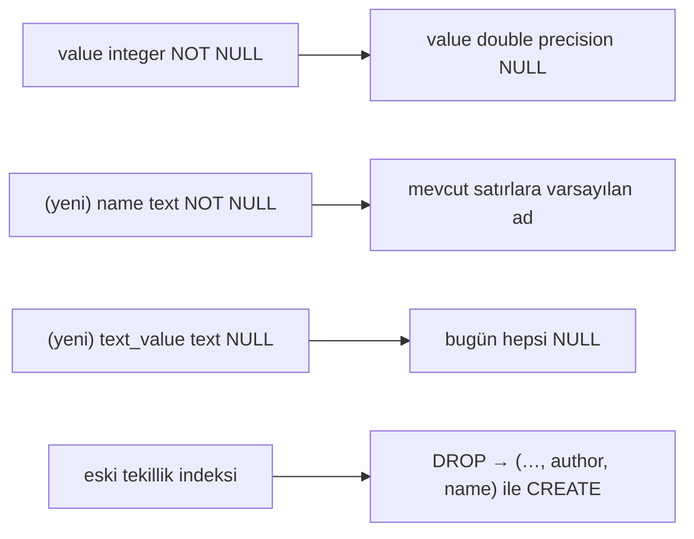

# Faz 152 — Skorun Adı ve Şekli

> **Durum:** 📋 Planlandı (2026-09-07)
> **Kaynak:** [ADAYLAR.md](ADAYLAR.md) · **F-208**
> **Önkoşul:** Yok. **Ardılı vardır:** [Faz 154](154-SKOR-TRENDININ-KALICI-SORGUSU.md) aynı tabloya dokunur ve **bu fazdan sonra** koşar.
> **Paketler:** `AgentPrism.Abstractions`, `AgentPrism.Core`, `AgentPrism.AspNetCore`, `AgentPrism.PostgreSql`, `AgentPrism.Sqlite`, `AgentPrism.SqlServer`, `AgentPrism.Testing.Contracts.Xunit`, `AgentPrism.UI`
> **Yeni paket:** Yok — karar 152.1'de ölçümle verildi · **Migration:** 🚨 **gerekli, üç sağlayıcıda** — numaralar uygulama anında alınır (K-178)
> **Public API:** 🔴 Büyüyor **ve kırıyor** — `RunScore.Value` tipi değişir. `wc -l src/*/PublicAPI.Shipped.txt` → her dosya **1 satır** (ölçüldü 2026-09-07): hiçbir yüzey sevk edilmemiştir, bu değişiklik **bugün bedava**, `1.0`'dan sonra **imkânsızdır**.
> **Tüketici yüzeyi:** site: `docs-site/src/content/docs/concepts/evaluation.md` · üretilen: `http-api/schema-runscore.md`, `api/agentprism.runscore` · sevk edilen: `RunScore` XML dokümanı, `IRunScoreStore` XML dokümanı, `RunEndpoints` `.WithDescription` metinleri
> **Manuel test alanı:** `docs/manuel-test/17-EVAL-VE-DENEYLER.md`

---

## Bu Faza Başlarken

> `faz-baslangic` skill'ini uygula. Aşağıdaki liste o skill'in 2. adımıdır —
> **tamamını değil, yalnız işaret edilen bölümleri oku.**

1. Bu doküman
2. Kararlar — dosyanın tamamını **okuma**, yalnız bu kalemleri grep'le:
   ```bash
   grep -n "K-023\|K-178\|K-421\|K-620\|K-621\|K-638" docs/KARARLAR.md
   ```
   **K-023** (`AgentPrismId`; `COALESCE` tekillik deseninin emsali), **K-178**
   (migration numaraları sağlayıcı başına bağımsızdır), **K-421** (public API
   takibi açık), **K-620** (`AddRunJudge` üç overload'ı), **K-621**
   (`JudgeTimeout` gerçek cutoff'tur — geç sonuç skor **yazmaz**), **K-638**
   (yargıç checkpoint'i **mevcut** `run_scores` satırlarından okunur — bu faz o
   okumayı bozmamalıdır).
3. [`arsiv/fazlar/118-YARGIC-BASINA-CHECKPOINT.md`](arsiv/fazlar/118-YARGIC-BASINA-CHECKPOINT.md) — yalnız devir notu:
   ```bash
   awk '/## Sonraki Faza Devir Notu/,0' docs/arsiv/fazlar/118-YARGIC-BASINA-CHECKPOINT.md
   ```
   Checkpoint mekanizması `author = "judge:{ad}"` satırlarının **varlığını**
   okur. Tekillik anahtarı bu fazda değişiyor; o okuma **yeniden yargılanmalıdır**.
4. Alan hafızası (bu faz üç alana dokunuyor):
   [`hafiza/sql-migration.md`](hafiza/sql-migration.md) (üç sağlayıcı, indeks
   yeniden yazımı) · [`hafiza/sql-saglayicilari.md`](hafiza/sql-saglayicilari.md)
   (tip farkları — `double precision` ↔ `REAL` ↔ `float`) ·
   [`hafiza/frontend.md`](hafiza/frontend.md) (skor gösterimi, `en.ts`/`tr.ts`)
5. Gerektiğinde, tamamı değil ilgili bölümü:
   [`MIMARI.md`](MIMARI.md) — veri modeli bölümü

---

## Amaç

`run_scores` iki sınır taşıyor ve ikisi de bu fazda kalkar. **Skorun adı
yoktur**, bu yüzden bir yazar bir `run`'a yalnız BİR skor yazabilir — insan
gözden geçiren aynı `run`'a hem "helpfulness" hem "accuracy" yazamaz. **Skorun
şekli sabittir**, bu yüzden 0.87 gibi bir ondalık veya `severe` gibi kategorik
bir değer saklanamaz.

Bu bir konfor işi değildir, bir **zamanlama** işidir. `RunScore.Value` bugün
`required int`'tir ve paket `1.0.0-preview.1` eşiğindedir. Tipi genişletmek
kırıcıdır; `1.0`'dan sonra yapılamaz.

- **F-208** — skora kararlı bir **ad** ver, adı tekillik anahtarına kat, değer
  şeklini .NET'in üç metrik şekliyle hizala ve eval sonucundaki **kayıplı**
  yazımı kapat.

### Bugün ne çalışmıyor — doğrulanmış kanıt

| Kanıt | Gözlem |
|---|---|
| [`0017_run_scores.sql:47-48`](../src/AgentPrism.PostgreSql/Migrations/0017_run_scores.sql#L47) | Tekillik indeksi `(tenant_id, run_id, COALESCE(message_id,''), author)` — **`name` sütunu yok** |
| [`0017_run_scores.sql:30`](../src/AgentPrism.PostgreSql/Migrations/0017_run_scores.sql#L30) | `value integer NOT NULL` — ondalık ve metin saklanamaz |
| [`RunScoreKind.cs`](../src/AgentPrism.Abstractions/Runs/RunScoreKind.cs) | Üç değerli kapalı enum: `Binary=1` · `Stars=2` · `Numeric=3` |
| [`ModelRunJudge.cs:75`](../src/AgentPrism.Core/Evaluation/ModelRunJudge.cs#L75) | Judge sınırı `author = "judge:{Name}"` ile aşıyor; insanın böyle bir kaçışı yok |
| [`EvalJobHandler.cs:458-490`](../src/AgentPrism.Core/Evaluation/EvalJobHandler.cs#L458) | `SerializeScores` yalnız `name`/`passed`/`reason` yazıyor — `Value`, `Interpretation.Rating`, `Diagnostics`, `Metadata` **atılıyor** |
| [`RunScore.cs`](../src/AgentPrism.Abstractions/Runs/RunScore.cs) | XML dokümanı *"1.5 for Stars"* diyor; SQL yorumu *"1..5 for Stars"* diyor. **Sevk edilen XML yanlış** |

> Kanıtlar 2026-09-07 tarihinde doğrulandı.

---

## 152.1 — Bağımlılık kararı: şekli hizala, tipi alma (ölçüldü)

Aday metni bunu bir faz kararı olarak bırakmıştı: `Microsoft.Extensions.AI.Evaluation`
bağımlılığını almak mı, şekilleri kopyalamak mı? Karar **ölçümle** verildi.

**Ölçüm (2026-09-07):**

| Ölçüm | Sonuç |
|---|---|
| `M.E.AI.Evaluation` 10.9.0'ın **kendi** bağımlılığı | **Yalnız** `Microsoft.Extensions.AI.Abstractions` 10.9.0 |
| `AgentPrism.Abstractions` bugün ne referanslıyor | `Microsoft.Agents.AI.Abstractions` + **`Microsoft.Extensions.AI.Abstractions`** |
| ⇒ `Abstractions`'a eklemenin maliyeti | **net 1 paket, geçişli ağırlık 0** |
| `AgentPrism.Core`/`AspNetCore`/`Cli` grafiği | 🚨 `M.E.AI.Evaluation` 10.9.0 **zaten var** — `Microsoft.Agents.AI` 1.20.0 ve `.Harness` getiriyor |
| Repo bu aileyi kullanıyor mu | 🚨 **Evet.** [`EvalJobHandler.cs:3`](../src/AgentPrism.Core/Evaluation/EvalJobHandler.cs#L3) `using Microsoft.Extensions.AI.Evaluation;`, `EvaluationMetric` `:432` ve `:458` |

> Bu ölçüm [`kesif/2026-09-07-langfuse-esinli-tur.md:85`](kesif/2026-09-07-langfuse-esinli-tur.md)'in
> *"🚨 Repo bu aileyi kullanmıyor"* cümlesini **çürütür**. Doğrudan referans
> yoktur; grafikte ve kodda vardır.

**Karar (kullanıcı, 2026-09-07): şekli hizala, tipi alma.**

`RunScoreKind` .NET'in üç metrik şekliyle (`BooleanMetric` · `NumericMetric` ·
`StringMetric`) hizalanır. `EvaluationMetric` **kalıcı kayda girmez**;
`AgentPrism.Abstractions` yeni bir paket referansı **almaz**.

Gerekçe — paket ağırlığı değil, tip doğası:

| | `RunScore` | `EvaluationMetric` |
|---|---|---|
| Doğa | Kalıcı depo kaydı | Değişebilir çalışma-anı nesnesi |
| Kimlik | Tekillik indeksi taşır | Kimliksiz |
| Alanlar | Sabit, `init`-only | `Context`/`Diagnostics`/`Metadata` mutable dictionary'ler |
| Ömür | Kiracının veritabanında yıllarca | Bir değerlendirme çağrısı |

K3 (*MAF tipleri sarmalanmaz*) bir **davranış** tipini paralel bir hiyerarşiyle
kopyalamayı yasaklar; bir **veri şeklini** aynı adlarla hizalamak sarmalama
değildir. Köprü `AgentPrism.Core` içinde yaşar — orada `M.E.AI.Evaluation`
zaten grafiktedir.

## 152.2 — (a) Skorun adı

`RunScore`'a `Name` eklenir ve **tekillik anahtarına girer**.

- Kural: `[A-Za-z0-9._-]{1,64}` — [`IRunJudge.Name`](../src/AgentPrism.Abstractions/Evaluation/IRunJudge.cs)'in
  bugünkü kuralının **birebir aynısı**. İki ad kuralı yazmak iki doğrulama yolu üretir.
- Düşük kardinaliteli olmalıdır: metrik etiketi ve skor alanı olarak kullanılır.
- Yeni indeks: `(tenant_id, run_id, COALESCE(message_id,''), author, name)`.

🚨 **`author` `COALESCE` edilmez ve bu KASITLIDIR.** `0017_run_scores.sql:41-46`
bunu yazıyor: `author` boşken (kimliksiz kurulum) PostgreSQL'de hiçbir `NULL`
başka bir `NULL`'a eşit olmadığı için tekillik hiç devreye girmez ve her çağrı
yeni satır açar. Bu davranış **korunur**; yeni indeks yalnız `name`'i ekler.

**Judge'ın kaçışı bu fazda kalkmaz.** `ModelRunJudge` `author = "judge:{Name}"`
yazmaya devam eder — çünkü orada `author` gerçekten **yazarı** ifade eder
(hangi judge yazdı), adı değil. Kalkan şey insan gözden geçirenin **eksikliğidir**:
artık aynı yazar aynı `run`'a farklı adlarla birden çok skor yazabilir.

> 🚨 K-638 uyarısı: yargıç başına retry checkpoint'i `author` satırlarının
> **varlığını** okuyor. Bir judge artık birden çok ad yazabildiği için "bu judge
> bu `run`'ı skorladı mı" sorusu **`author` üzerinden** sorulmaya devam etmelidir,
> `(author, name)` üzerinden değil. Bu, `OnlineEvalJobHandler`'da doğrulanacak
> bir davranıştır — Hata Modları tablosunda kilitlenir.

## 152.3 — (b) Skorun şekli

Üç .NET şekli, üç AgentPrism karşılığı:

| .NET | Değer tipi | `RunScoreKind` | `RunScore` alanı |
|---|---|---|---|
| `BooleanMetric` | `bool?` | `Binary` | `Value` = 0 veya 1 |
| `NumericMetric` | `double?` | `Stars` · `Numeric` | `Value` = ondalık |
| `StringMetric` | `string` | **`Categorical`** (yeni) | `TextValue` |

Değişiklikler:

1. **`Value` `required int` → `double?`.** Kırıcıdır, bugün bedavadır.
   `null` yeni bir anlam **taşımaz, mevcut bir kuralı yayar**:
   [`RunJudgment.Score`](../src/AgentPrism.Abstractions/Evaluation/IRunJudge.cs)
   zaten *"karar verilemediğinde `null` döner, `0` DEĞİL. Sıfır bir ölçümdür,
   ölçümün yokluğu değildir"* diyor. `EvaluationMetric<T>.Value` de nullable'dır.
2. **`TextValue string?` eklenir.** `Categorical` skorlar için.
3. **`RunScoreKind`'a `Categorical = 4` eklenir.** Append'tir; `Binary=1` ·
   `Stars=2` · `Numeric=3` sayısal değerleri **değişmez** — enum'un kendi XML
   dokümanı bunu zorunlu kılıyor ve mevcut satırlar bu değerleri taşıyor.
4. **Değişmez (invariant):** `Kind` `Categorical` ise `TextValue` doludur ve
   `Value` `null`'dır; değilse tersi. Doğrulama yazma yolunda yapılır.

Sütun tipleri sağlayıcı başına — `hafiza/sql-saglayicilari.md` kontrol edilerek:
PostgreSQL `double precision`, SQLite `REAL`, SQL Server `float`.

**Kapsam dışı** (aday metni de böyle diyor): kiracı başına `ScoreConfig` CRUD
ekranı, aralık/kategori doğrulama motoru, `EvaluationRating`'in yedi kademesinin
kalıcı kayda alınması.

## 152.4 — Eval sonucundaki kayıplı yazım

Kullanıcı kararı (2026-09-07): bu, ayrı bir kusur kaydı değil, **bu fazın
kapsamıdır** — kayıplı yazım skorun şeklinin sonucudur ve ayrı açmak aynı kodu
iki kez elden geçirtir.

[`EvalJobHandler.cs:458`](../src/AgentPrism.Core/Evaluation/EvalJobHandler.cs#L458)
`SerializeScores` bugün `EvaluationMetric` başına yalnız üç alan yazıyor:

```json
{ "name": "...", "passed": true, "reason": "..." }
```

Atılanlar: `Value` (`bool?`/`double?`/`string`), `Interpretation.Rating`
(yedi kademe), `Diagnostics`, `Metadata`.

**Bugün gözlemlenebilir bir yanlış davranış yoktur** ve bunu yazmak dürüstlüktür:
MAF'ın `EvalCheck` delegesi `EvalCheckResult(bool Passed, string Reason, string CheckName)`
döndürüyor (`maf-api-kesfi`, 2026-09-07), yani yerleşik altı check zaten yalnız
boolean üretiyor ve `passed` alanı `Value`'yu **karşılıyor**. Kusur, ilk sayısal
metrik geldiği anda ortaya çıkar — ki [Faz 154](154-SKOR-TRENDININ-KALICI-SORGUSU.md)
ve F-210 (`.Quality` katalogu) tam olarak onu getirir.

Düzeltme: `SerializeScores` metriğin **somut tipine göre** değer yazar.

```json
{ "name": "...", "kind": "numeric", "value": 0.87, "passed": true,
  "rating": "Good", "reason": "...", "diagnostics": [ { "severity": "warning", "message": "..." } ] }
```

🚨 Yazım **elle `Utf8JsonWriter` ile** kalır. Mevcut yorum sebebini yazıyor:
`EvaluationMetric` için kaynak üretilmiş bir `JsonSerializerContext` yoktur;
`JsonSerializer.Serialize` IL2026/IL3050 üretir ve `AgentPrism.Core` AOT uyumlu
kalmalıdır. Somut tipi ayırt etmek `is BooleanMetric b` / `is NumericMetric n` /
`is StringMetric s` desen eşlemesiyle yapılır — `reflection` yok.

`Metadata` **yazılmaz**: `EvaluationMetricExtensions.AddOrUpdateChatMetadata`
oraya model yanıtı üstverisi koyabiliyor ve `EvalCaseResult.Scores` istemciye
açıktır. Bu bir kapsam sınırıdır, unutma değildir.

## 152.5 — Mevcut satırların taşınması

Migration üç sağlayıcıda aynı işi yapar:



Mevcut satırların `name` değeri: judge satırları için `author`'daki judge adı
(`judge:model` → `model`), insan satırları için sabit bir varsayılan. Hangi
varsayılan — Açık Soru 1.

🚨 **Sıra önemlidir.** Yeni tekillik indeksi, eskisi düşürülmeden ve `name`
doldurulmadan **kurulamaz**; `name` `NOT NULL` ise önce nullable eklenip
doldurulup sonra `NOT NULL` yapılmalıdır. SQLite'ta indeks düşürme ve sütun
tipi değiştirme tablo yeniden yazımı gerektirir — `hafiza/sqlite.md` bu deseni
kaydediyor.

---

## Planlanan Public API

> Taslak imzalardır. Gerçekleşen imzalar kapanışta ayrı bir bölüme yazılır.

```csharp
// AgentPrism.Abstractions
public sealed record RunScore
{
    public Guid Id { get; init; }
    public required string TenantId { get; init; }
    public required Guid RunId { get; init; }
    public string? MessageId { get; init; }

    /// <summary>The score's stable, low-cardinality name. Matches [A-Za-z0-9._-]{1,64}.</summary>
    public required string Name { get; init; }          // YENİ

    public required RunScoreKind Kind { get; init; }

    /// <summary>The numeric value. Null means no measurement was made, NOT zero.</summary>
    public double? Value { get; init; }                 // required int -> double? (🔴 KIRICI)

    /// <summary>The categorical value. Set only when Kind is Categorical.</summary>
    public string? TextValue { get; init; }             // YENİ

    public string? Comment { get; init; }
    public required string Source { get; init; }
    public string? Author { get; init; }
    public DateTimeOffset CreatedAt { get; init; }
}

public enum RunScoreKind
{
    Binary = 1,      // BooleanMetric
    Stars = 2,       // NumericMetric (1-5)
    Numeric = 3,     // NumericMetric (0-100)
    Categorical = 4, // StringMetric        // YENİ (append — güvenli)
}
```

`IRunScoreStore` imzaları **değişmez**; `RunScore`'un şekli değişir.
`RunFeedbackRequest` (`AgentPrism.AspNetCore`) `Name` ve `TextValue` kazanır.

### HTTP `endpoint`'leri

Yeni uç **yok**. Üç mevcut uç gövde değiştirir:

| Metot | Yol | Rol | Değişiklik |
|---|---|---|---|
| `POST` | `/api/runs/{runId}/feedback` | Reader | Gövde `name` (zorunlu) ve `textValue` kazanır |
| `GET` | `/api/runs/{runId}/feedback` | Reader | Yanıt aynı alanları döner |
| `DELETE` | `/api/runs/{runId}/feedback/{scoreId}` | Reader | Değişmez |

### Arayüz payı

Skor gösterimi `Categorical` ve ondalık `Value` için güncellenir; skor adı
listelenir. Bugünkü ölçüm (2026-09-07): **151.9 KB** brotli / 250 KB bütçe.
Yeni metin anahtarları `en.ts` **ve** `tr.ts`'e girer (K-228: eksik anahtar
derleme hatasıdır).

---

## Planlanan Dosya Listesi

```
src/AgentPrism.Abstractions/Runs/
├── RunScore.cs                 (değişir — Name, Value, TextValue)
└── RunScoreKind.cs             (değişir — Categorical = 4)

src/AgentPrism.PostgreSql/Migrations/NNNN_run_score_name_and_shape.sql   (yeni)
src/AgentPrism.Sqlite/Migrations/NNNN_run_score_name_and_shape.sql       (yeni)
src/AgentPrism.SqlServer/Migrations/NNNN_run_score_name_and_shape.sql    (yeni)
  + üç sağlayıcının RunScoreStore uygulamaları                           (değişir)

src/AgentPrism.Core/
├── Evaluation/EvalJobHandler.cs        (değişir — SerializeScores, 152.4)
├── Evaluation/OnlineEvalJobHandler.cs  (değişir — judge skoruna ad)
└── Runs/InMemoryRunScoreStore.cs       (değişir)

src/AgentPrism.AspNetCore/Endpoints/RunEndpoints.cs                      (değişir)
src/AgentPrism.Testing.Contracts.Xunit/Contracts/RunScoreStoreContract.cs (değişir)
src/AgentPrism.UI/frontend/src/…                                          (değişir)

tests/
├── AgentPrism.Core.Tests/Evaluation/SerializeScoresTests.cs             (yeni)
└── AgentPrism.AspNetCore.FunctionalTests/Runs/RunScoreNameTests.cs      (yeni)
```

---

## Hata Modları ve Testler

> Seviyeyi plan seçer. Sınır geçen davranış (DI · HTTP · kiracı · akış · depo ·
> paket) birim testiyle kanıtlanamaz —
> [`.agents/ortak/test-seviyeleri.md`](../.agents/ortak/test-seviyeleri.md).

| Ne bozulabilir | Seviye | Test sınıfı |
|---|---|---|
| Aynı yazar aynı `run`'a iki **farklı adla** skor yazar, ikincisi birinciyi ezer | Sözleşme | `RunScoreStoreContract` (dört koşumda) |
| Aynı yazar aynı `run`'a aynı adla iki kez yazar, ikinci satır **açılır** (ezmez) | Sözleşme | `RunScoreStoreContract` |
| `author` boşken tekillik devreye girer ve her çağrı yeni satır **açmaz** | Sözleşme | `RunScoreStoreContract` |
| 🚨 K-638 checkpoint'i bozulur: judge birden çok ad yazınca "bu judge skorladı mı" yanlış cevap verir | Fonksiyonel | `OnlineEvalRetryTests` (mevcut) + yeni case |
| `Kind = Categorical` iken `Value` dolu gelir (invariant ihlali) | Birim + Sözleşme | `RunScoreValidationTests`, `RunScoreStoreContract` |
| `Kind = Numeric` iken `TextValue` dolu gelir | Birim | `RunScoreValidationTests` |
| Ondalık `Value` sağlayıcıda yuvarlanır (0.87 → 1) | Sözleşme | `RunScoreStoreContract` (üç SQL sağlayıcısında) |
| `Value = null` "ölçüm yok" yerine 0 olarak okunur | Sözleşme | `RunScoreStoreContract` |
| Migration mevcut satırların `name`'ini doldurmaz ⇒ `NOT NULL` ihlali | Fonksiyonel | `MigrationTests` (üç sağlayıcı, dolu tablodan yükseltme) |
| Migration eski tekillik indeksini düşürmez ⇒ ikinci ad yazılamaz | Fonksiyonel | `MigrationTests` |
| SQLite tablo yeniden yazımında satır kaybolur | Fonksiyonel | `MigrationTests` |
| Geçersiz `name` (`boşluk`, 65 karakter, Türkçe karakter) kabul edilir | Birim + Fonksiyonel | `RunScoreValidationTests`, `RunScoreNameTests` |
| Başka kiracının skoru `name` ile sızar | Sözleşme | `TenantIsolationContract` |
| `SerializeScores` sayısal metriğin değerini yine atar | Birim | `SerializeScoresTests` |
| `SerializeScores` `reflection`'a düşer ⇒ AOT kapısı kırılır | Fonksiyonel | mevcut AOT test paketi |
| `SerializeScores` `Metadata`'yı yazar ⇒ model üstverisi istemciye sızar | Birim | `SerializeScoresTests` |
| İptal: yazma ortasında `CancellationToken` iptal olur | Sözleşme | `RunScoreStoreContract` |
| Eşzamanlılık: aynı `(run, author, name)` iki eşzamanlı yazım | Sözleşme | `RunScoreStoreContract` |
| `store` hata verirse `run` durur | Fonksiyonel | mevcut `RunScoreStoreFailureTests` deseni |

Beş soru: **iptal** ✅ · **eşzamanlılık** ✅ · **boş/aşırı girdi** ✅ (ad
doğrulaması, invariant) · **başka kiracı** ✅ · **alt sistem hatası** ✅.

---

## Manuel Kabul Case'leri

> Kapanışta `docs/manuel-test/17-EVAL-VE-DENEYLER.md` içine eklenecek taslak.

| # | Ön koşul | Adımlar | Beklenen sonuç |
|---|---|---|---|
| 1 | `samples/AgentPrism.Api`, tamamlanmış bir `run` | `POST /api/runs/{id}/feedback` `{"name":"helpfulness","kind":"Stars","value":4}` | `201`; satır yazılır |
| 2 | Case 1 sonrası | Aynı yazar `{"name":"accuracy","kind":"Binary","value":1}` | `201`; **iki** satır durur — birincisi ezilmez |
| 3 | Case 2 sonrası | Aynı yazar `{"name":"helpfulness","kind":"Stars","value":5}` | `200`; `helpfulness` **güncellenir**, `accuracy` durur |
| 4 | Aynı | `{"name":"severity","kind":"Categorical","textValue":"minor"}` | `201`; kategorik skor saklanır |
| 5 | Aynı | `{"name":"similarity","kind":"Numeric","value":0.87}` sonra `GET` | `0.87` geri döner — yuvarlanmaz |
| 6 | Aynı | `{"name":"has boşluk","kind":"Binary","value":1}` | `400` |
| 7 | Faz 152 öncesi veriyle dolu PostgreSQL | Migration'ı koş | Mevcut satırlar korunur; judge satırları judge adını, insan satırları varsayılan adı alır |
| 8 | Aynı, SQLite ve SQL Server | Migration'ı koş | Satır sayısı ve içerik korunur |
| 9 | Eval suite'i koş | `GET /api/evals/runs/{id}` → `scores` alanı | Her metrik `kind` ve `value` taşır; `metadata` **yok** |
| 10 | 👤 insan gerekir | Arayüzde bir `run`'a iki farklı adla skor ver | İkisi de listede ayrı satır; kategorik skor metin olarak görünür |

---

## Açık Sorular

> Planı bloklamayan, faz uygulanırken karara bağlanacak sorular.

| # | Soru | Seçenekler | Öneri |
|---|---|---|---|
| 1 | Migration mevcut **insan** satırlarına hangi adı verir? | A: `overall` · B: `feedback` · C: `legacy` | **A (`overall`)** — okunabilir, düşük kardinaliteli ve yeni yazımlarda da makul bir varsayılan. `legacy` kalıcı veriye geçici bir etiket basar |
| 2 | `POST /feedback` gövdesinde `name` zorunlu mu, varsayılanı var mı? | A: zorunlu · B: yoksa `overall` | **B** — mevcut preview tüketicisinin çağrısı kırılmaz; `name` vermeyen çağrı bugünkü davranışı aynen sürdürür |
| 3 | `Stars` ve `Numeric` ayrı kalsın mı, tek `Numeric`'e mi insin? | A: ayrı kalsın · B: birleşsin | **A** — ikisi farklı **sunum** taşıyor (yıldız ↔ yüzde) ve arayüz bunu okuyor. Birleştirme sunum bilgisini kaybeder ve mevcut satırların `kind` değerini yeniden yazmayı gerektirir |
| 4 | `EvaluationRating` (yedi kademe) `run_scores`'a girsin mi? | A: hayır · B: evet | **A** — aday metni bunu kapsam dışı bırakıyor. `EvalCaseResult.Scores` içinde 152.4 ile zaten görünür olacak; kalıcı sütun bir sonraki talebi bekler |
| 5 | `TextValue` uzunluk sınırı? | A: 256 · B: sınırsız | **A (256)** — kategorik değer düşük kardinaliteli olmalıdır; sınırsız metin `Comment` alanının işidir |

---

## Bitiş Ölçütleri (DoD)

- [ ] Aynı yazar aynı `run`'a `helpfulness` ve `accuracy` yazabilir; ikisi de ayrı satır olarak durur
- [ ] Aynı yazar aynı `(run, name)` çiftine ikinci kez yazınca satır **güncellenir**, yeni satır açılmaz
- [ ] `Kind = Categorical` skor `TextValue` ile saklanır ve geri okunur
- [ ] `Value = 0.87` üç SQL sağlayıcısında da `0.87` olarak geri döner
- [ ] `Value = null` "ölçüm yok" olarak geri döner, `0` olarak değil
- [ ] Dolu bir Faz 151 veritabanı üç sağlayıcıda da migration'dan **veri kaybı olmadan** geçer
- [ ] K-638 checkpoint davranışı korunur: bir judge birden çok ad yazsa da retry'da yeniden çağrılmaz
- [ ] `EvalCaseResult.Scores` sayısal bir metriğin değerini ve `rating`'ini taşır; `metadata` taşımaz
- [ ] AOT kapısı geçer — `SerializeScores` `reflection` kullanmaz
- [ ] Dört doğrulama kapısı sıfır uyarı verir
- [ ] `samples/AgentPrism.Api` ile gerçek `run` + skor yazımı yapıldı, çıktı belgeye yazıldı
- [ ] `secret` taraması boş döndü
- [ ] Manuel kabul case'leri `docs/manuel-test/17-EVAL-VE-DENEYLER.md` içine eklendi; otomatikleştirilebilenler koşuldu
- [ ] `faz-denetim` koşuldu; 🔴 bulgu kalmadı
- [ ] `docs-site/concepts/evaluation.md` güncellendi; `npm run build` + `check-links.mjs` temiz
- [ ] `RunScore` XML dokümanındaki *"1.5 for Stars"* hatası düzeltildi
- [ ] `en.ts` ve `tr.ts` eksiksiz; bundle payı ölçüldü ve yazıldı
- [ ] OpenAPI → NSwag → TypeScript zinciri yeniden üretildi

### Doğrulama komutları

```bash
# İki farklı ad, iki ayrı satır
curl -s -X POST http://localhost:5081/agentprism/api/runs/$RUN/feedback \
  -H 'content-type: application/json' -d '{"name":"helpfulness","kind":"Stars","value":4}'
curl -s -X POST http://localhost:5081/agentprism/api/runs/$RUN/feedback \
  -H 'content-type: application/json' -d '{"name":"accuracy","kind":"Binary","value":1}'
curl -s http://localhost:5081/agentprism/api/runs/$RUN/feedback | jq 'length'   # 2 bekleniyor

# Ondalık korunuyor mu
curl -s -X POST http://localhost:5081/agentprism/api/runs/$RUN/feedback \
  -H 'content-type: application/json' -d '{"name":"similarity","kind":"Numeric","value":0.87}'
curl -s http://localhost:5081/agentprism/api/runs/$RUN/feedback | jq '.[] | select(.name=="similarity").value'
```

---

## Riskler

| Risk | Önlem |
|------|-------|
| 🔴 `RunScore.Value` tip değişimi kırıcıdır | `PublicAPI.Shipped.txt` **boştur** (ölçüldü: her dosya 1 satır) — bugün bedava. Açık Soru 2 ile HTTP gövdesi geriye uyumlu tutulur |
| Migration dolu tabloda veri kaybeder | Üç sağlayıcıda dolu tablodan yükseltme testi DoD'dedir; SQLite tablo yeniden yazımı ayrı case |
| 🚨 K-638 checkpoint'i sessizce bozulur | Fonksiyonel test `OnlineEvalJobHandler`'ın retry davranışını **ad çoğullandıktan sonra** koşar |
| Tekillik indeksi değişimi eşzamanlı yazımda yarış üretir | `RunScoreStoreContract`'a eşzamanlılık case'i; dört koşumda birden |
| `name` kardinalitesi kontrolsüz büyür ⇒ metrik etiketi patlar | 64 karakter + karakter kümesi sınırı; `IRunJudge.Name` kuralının aynısı |
| `SerializeScores` `reflection`'a kayar ⇒ AOT kırılır | Desen eşlemesi (`is NumericMetric`), `Utf8JsonWriter` elle; AOT paketi DoD'de |
| `Metadata` yazımı model üstverisini istemciye sızdırır | Kapsam sınırı olarak yazıldı; birim testi kilitler |
| Faz 154 aynı tabloya dokunuyor | Faz 154 **bundan sonra** koşar; sırası bu dokümanın başlığında yazılı |

---

<!-- ============================================================
     AŞAĞISI KAPANIŞTA DOLDURULUR — `faz-tamamlama` skill'i.
     Plan anında boş kalır. Başlıkları SİLME.
     ============================================================ -->

## Plandan Sapmalar

> Kapanışta doldurulur.

## Bu Fazda Verilen Kararlar

> Kapanışta doldurulur. K-NNN numaraları burada alınır; plan numara rezerve etmez.

## Gerçekleşen Public API

> Kapanışta doldurulur.

## Dosya Listesi (gerçekleşen)

> Kapanışta doldurulur.

## Denetim Bulguları

> Kapanışta doldurulur.

## Sonraki Faza Devir Notu

> Kapanışta doldurulur.
