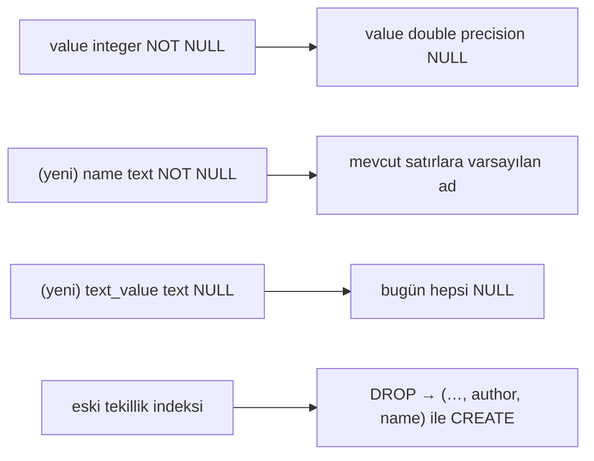

# Faz 152 — Skorun Adı ve Şekli

> **Durum:** ✅ Tamamlandı (2026-09-07)
> **Kaynak:** [ADAYLAR.md](ADAYLAR.md) · **F-208**
> **Önkoşul:** Yok. **Ardılı vardır:** [Faz 154](154-SKOR-TRENDININ-KALICI-SORGUSU.md) aynı tabloya dokunur ve **bu fazdan sonra** koşar.
> **Paketler:** `AgentPrism.Abstractions`, `AgentPrism.Core`, `AgentPrism.AspNetCore`, `AgentPrism.PostgreSql`, `AgentPrism.Sqlite`, `AgentPrism.SqlServer`, `AgentPrism.Testing.Contracts.Xunit`, `AgentPrism.UI`
> **Yeni paket:** Yok — karar 152.1'de ölçümle verildi · **Migration:** PostgreSQL `0048` · SQLite `0035` · SQL Server `0035` (K-178: numaralar sağlayıcı başına bağımsızdır)
> **Public API:** 🔴 Büyüyor **ve kırıyor** — `RunScore.Value` tipi değişir. `wc -l src/*/PublicAPI.Shipped.txt` → her dosya **1 satır** (ölçüldü 2026-09-07): hiçbir yüzey sevk edilmemiştir, bu değişiklik **bugün bedava**, `1.0`'dan sonra **imkânsızdır**.
> **Tüketici yüzeyi:** site: `docs-site/src/content/docs/concepts/evaluation.md` · üretilen: `http-api/schema-runscore.md`, `api/agentprism.runscore` · sevk edilen: `RunScore` XML dokümanı, `IRunScoreStore` XML dokümanı, `RunEndpoints` `.WithDescription` metinleri
> **Manuel test alanı:** `docs/manuel-test/17-EVAL-VE-DENEYLER.md`

---

## Bu Faza Başlarken

> `faz-baslangic` skill'ini uygula. Aşağıdaki liste o skill'in 2. adımıdır —
> **tamamını değil, yalnız işaret edilen bölümleri oku.**

1. Bu doküman
2. Kararlar — dosyanın tamamını **okuma**, yalnız bu kalemleri grep'le:
   ```bash
   grep -n "K-023\|K-178\|K-421\|K-620\|K-621\|K-638" docs/KARARLAR.md
   ```
   **K-023** (`AgentPrismId`; `COALESCE` tekillik deseninin emsali), **K-178**
   (migration numaraları sağlayıcı başına bağımsızdır), **K-421** (public API
   takibi açık), **K-620** (`AddRunJudge` üç overload'ı), **K-621**
   (`JudgeTimeout` gerçek cutoff'tur — geç sonuç skor **yazmaz**), **K-638**
   (yargıç checkpoint'i **mevcut** `run_scores` satırlarından okunur — bu faz o
   okumayı bozmamalıdır).
3. [`arsiv/fazlar/118-YARGIC-BASINA-CHECKPOINT.md`](arsiv/fazlar/118-YARGIC-BASINA-CHECKPOINT.md) — yalnız devir notu:
   ```bash
   awk '/## Sonraki Faza Devir Notu/,0' docs/arsiv/fazlar/118-YARGIC-BASINA-CHECKPOINT.md
   ```
   Checkpoint mekanizması `author = "judge:{ad}"` satırlarının **varlığını**
   okur. Tekillik anahtarı bu fazda değişiyor; o okuma **yeniden yargılanmalıdır**.
4. Alan hafızası (bu faz üç alana dokunuyor):
   [`hafiza/sql-migration.md`](hafiza/sql-migration.md) (üç sağlayıcı, indeks
   yeniden yazımı) · [`hafiza/sql-saglayicilari.md`](hafiza/sql-saglayicilari.md)
   (tip farkları — `double precision` ↔ `REAL` ↔ `float`) ·
   [`hafiza/frontend.md`](hafiza/frontend.md) (skor gösterimi, `en.ts`/`tr.ts`)
5. Gerektiğinde, tamamı değil ilgili bölümü:
   [`MIMARI.md`](MIMARI.md) — veri modeli bölümü

---

## Amaç

`run_scores` iki sınır taşıyor ve ikisi de bu fazda kalkar. **Skorun adı
yoktur**, bu yüzden bir yazar bir `run`'a yalnız BİR skor yazabilir — insan
gözden geçiren aynı `run`'a hem "helpfulness" hem "accuracy" yazamaz. **Skorun
şekli sabittir**, bu yüzden 0.87 gibi bir ondalık veya `severe` gibi kategorik
bir değer saklanamaz.

Bu bir konfor işi değildir, bir **zamanlama** işidir. `RunScore.Value` bugün
`required int`'tir ve paket `1.0.0-preview.1` eşiğindedir. Tipi genişletmek
kırıcıdır; `1.0`'dan sonra yapılamaz.

- **F-208** — skora kararlı bir **ad** ver, adı tekillik anahtarına kat, değer
  şeklini .NET'in üç metrik şekliyle hizala ve eval sonucundaki **kayıplı**
  yazımı kapat.

### Bugün ne çalışmıyor — doğrulanmış kanıt

| Kanıt | Gözlem |
|---|---|
| [`0017_run_scores.sql:47-48`](../src/AgentPrism.PostgreSql/Migrations/0017_run_scores.sql#L47) | Tekillik indeksi `(tenant_id, run_id, COALESCE(message_id,''), author)` — **`name` sütunu yok** |
| [`0017_run_scores.sql:30`](../src/AgentPrism.PostgreSql/Migrations/0017_run_scores.sql#L30) | `value integer NOT NULL` — ondalık ve metin saklanamaz |
| [`RunScoreKind.cs`](../src/AgentPrism.Abstractions/Runs/RunScoreKind.cs) | Üç değerli kapalı enum: `Binary=1` · `Stars=2` · `Numeric=3` |
| [`ModelRunJudge.cs:75`](../src/AgentPrism.Core/Evaluation/ModelRunJudge.cs#L75) | Judge sınırı `author = "judge:{Name}"` ile aşıyor; insanın böyle bir kaçışı yok |
| [`EvalJobHandler.cs:458-490`](../src/AgentPrism.Core/Evaluation/EvalJobHandler.cs#L458) | `SerializeScores` yalnız `name`/`passed`/`reason` yazıyor — `Value`, `Interpretation.Rating`, `Diagnostics`, `Metadata` **atılıyor** |
| [`RunScore.cs`](../src/AgentPrism.Abstractions/Runs/RunScore.cs) | XML dokümanı *"1.5 for Stars"* diyor; SQL yorumu *"1..5 for Stars"* diyor. **Sevk edilen XML yanlış** |

> Kanıtlar 2026-09-07 tarihinde doğrulandı.

---

## 152.1 — Bağımlılık kararı: şekli hizala, tipi alma (ölçüldü)

Aday metni bunu bir faz kararı olarak bırakmıştı: `Microsoft.Extensions.AI.Evaluation`
bağımlılığını almak mı, şekilleri kopyalamak mı? Karar **ölçümle** verildi.

**Ölçüm (2026-09-07):**

| Ölçüm | Sonuç |
|---|---|
| `M.E.AI.Evaluation` 10.9.0'ın **kendi** bağımlılığı | **Yalnız** `Microsoft.Extensions.AI.Abstractions` 10.9.0 |
| `AgentPrism.Abstractions` bugün ne referanslıyor | `Microsoft.Agents.AI.Abstractions` + **`Microsoft.Extensions.AI.Abstractions`** |
| ⇒ `Abstractions`'a eklemenin maliyeti | **net 1 paket, geçişli ağırlık 0** |
| `AgentPrism.Core`/`AspNetCore`/`Cli` grafiği | 🚨 `M.E.AI.Evaluation` 10.9.0 **zaten var** — `Microsoft.Agents.AI` 1.20.0 ve `.Harness` getiriyor |
| Repo bu aileyi kullanıyor mu | 🚨 **Evet.** [`EvalJobHandler.cs:3`](../src/AgentPrism.Core/Evaluation/EvalJobHandler.cs#L3) `using Microsoft.Extensions.AI.Evaluation;`, `EvaluationMetric` `:432` ve `:458` |

> Bu ölçüm [`kesif/2026-09-07-langfuse-esinli-tur.md:85`](kesif/2026-09-07-langfuse-esinli-tur.md)'in
> *"🚨 Repo bu aileyi kullanmıyor"* cümlesini **çürütür**. Doğrudan referans
> yoktur; grafikte ve kodda vardır.

**Karar (kullanıcı, 2026-09-07): şekli hizala, tipi alma.**

`RunScoreKind` .NET'in üç metrik şekliyle (`BooleanMetric` · `NumericMetric` ·
`StringMetric`) hizalanır. `EvaluationMetric` **kalıcı kayda girmez**;
`AgentPrism.Abstractions` yeni bir paket referansı **almaz**.

Gerekçe — paket ağırlığı değil, tip doğası:

| | `RunScore` | `EvaluationMetric` |
|---|---|---|
| Doğa | Kalıcı depo kaydı | Değişebilir çalışma-anı nesnesi |
| Kimlik | Tekillik indeksi taşır | Kimliksiz |
| Alanlar | Sabit, `init`-only | `Context`/`Diagnostics`/`Metadata` mutable dictionary'ler |
| Ömür | Kiracının veritabanında yıllarca | Bir değerlendirme çağrısı |

K3 (*MAF tipleri sarmalanmaz*) bir **davranış** tipini paralel bir hiyerarşiyle
kopyalamayı yasaklar; bir **veri şeklini** aynı adlarla hizalamak sarmalama
değildir. Köprü `AgentPrism.Core` içinde yaşar — orada `M.E.AI.Evaluation`
zaten grafiktedir.

## 152.2 — (a) Skorun adı

`RunScore`'a `Name` eklenir ve **tekillik anahtarına girer**.

- Kural: `[A-Za-z0-9._-]{1,64}` — [`IRunJudge.Name`](../src/AgentPrism.Abstractions/Evaluation/IRunJudge.cs)'in
  bugünkü kuralının **birebir aynısı**. İki ad kuralı yazmak iki doğrulama yolu üretir.
- Düşük kardinaliteli olmalıdır: metrik etiketi ve skor alanı olarak kullanılır.
- Yeni indeks: `(tenant_id, run_id, COALESCE(message_id,''), author, name)`.

🚨 **`author` `COALESCE` edilmez ve bu KASITLIDIR.** `0017_run_scores.sql:41-46`
bunu yazıyor: `author` boşken (kimliksiz kurulum) PostgreSQL'de hiçbir `NULL`
başka bir `NULL`'a eşit olmadığı için tekillik hiç devreye girmez ve her çağrı
yeni satır açar. Bu davranış **korunur**; yeni indeks yalnız `name`'i ekler.

**Judge'ın kaçışı bu fazda kalkmaz.** `ModelRunJudge` `author = "judge:{Name}"`
yazmaya devam eder — çünkü orada `author` gerçekten **yazarı** ifade eder
(hangi judge yazdı), adı değil. Kalkan şey insan gözden geçirenin **eksikliğidir**:
artık aynı yazar aynı `run`'a farklı adlarla birden çok skor yazabilir.

> 🚨 K-638 uyarısı: yargıç başına retry checkpoint'i `author` satırlarının
> **varlığını** okuyor. Bir judge artık birden çok ad yazabildiği için "bu judge
> bu `run`'ı skorladı mı" sorusu **`author` üzerinden** sorulmaya devam etmelidir,
> `(author, name)` üzerinden değil. Bu, `OnlineEvalJobHandler`'da doğrulanacak
> bir davranıştır — Hata Modları tablosunda kilitlenir.

## 152.3 — (b) Skorun şekli

Üç .NET şekli, üç AgentPrism karşılığı:

| .NET | Değer tipi | `RunScoreKind` | `RunScore` alanı |
|---|---|---|---|
| `BooleanMetric` | `bool?` | `Binary` | `Value` = 0 veya 1 |
| `NumericMetric` | `double?` | `Stars` · `Numeric` | `Value` = ondalık |
| `StringMetric` | `string` | **`Categorical`** (yeni) | `TextValue` |

Değişiklikler:

1. **`Value` `required int` → `double?`.** Kırıcıdır, bugün bedavadır.
   `null` yeni bir anlam **taşımaz, mevcut bir kuralı yayar**:
   [`RunJudgment.Score`](../src/AgentPrism.Abstractions/Evaluation/IRunJudge.cs)
   zaten *"karar verilemediğinde `null` döner, `0` DEĞİL. Sıfır bir ölçümdür,
   ölçümün yokluğu değildir"* diyor. `EvaluationMetric<T>.Value` de nullable'dır.
2. **`TextValue string?` eklenir.** `Categorical` skorlar için.
3. **`RunScoreKind`'a `Categorical = 4` eklenir.** Append'tir; `Binary=1` ·
   `Stars=2` · `Numeric=3` sayısal değerleri **değişmez** — enum'un kendi XML
   dokümanı bunu zorunlu kılıyor ve mevcut satırlar bu değerleri taşıyor.
4. **Değişmez (invariant):** `Kind` `Categorical` ise `TextValue` doludur ve
   `Value` `null`'dır; değilse tersi. Doğrulama yazma yolunda yapılır.

Sütun tipleri sağlayıcı başına — `hafiza/sql-saglayicilari.md` kontrol edilerek:
PostgreSQL `double precision`, SQLite `REAL`, SQL Server `float`.

**Kapsam dışı** (aday metni de böyle diyor): kiracı başına `ScoreConfig` CRUD
ekranı, aralık/kategori doğrulama motoru, `EvaluationRating`'in yedi kademesinin
kalıcı kayda alınması.

## 152.4 — Eval sonucundaki kayıplı yazım

Kullanıcı kararı (2026-09-07): bu, ayrı bir kusur kaydı değil, **bu fazın
kapsamıdır** — kayıplı yazım skorun şeklinin sonucudur ve ayrı açmak aynı kodu
iki kez elden geçirtir.

[`EvalJobHandler.cs:458`](../src/AgentPrism.Core/Evaluation/EvalJobHandler.cs#L458)
`SerializeScores` bugün `EvaluationMetric` başına yalnız üç alan yazıyor:

```json
{ "name": "...", "passed": true, "reason": "..." }
```

Atılanlar: `Value` (`bool?`/`double?`/`string`), `Interpretation.Rating`
(yedi kademe), `Diagnostics`, `Metadata`.

**Bugün gözlemlenebilir bir yanlış davranış yoktur** ve bunu yazmak dürüstlüktür:
MAF'ın `EvalCheck` delegesi `EvalCheckResult(bool Passed, string Reason, string CheckName)`
döndürüyor (`maf-api-kesfi`, 2026-09-07), yani yerleşik altı check zaten yalnız
boolean üretiyor ve `passed` alanı `Value`'yu **karşılıyor**. Kusur, ilk sayısal
metrik geldiği anda ortaya çıkar — ki [Faz 154](154-SKOR-TRENDININ-KALICI-SORGUSU.md)
ve F-210 (`.Quality` katalogu) tam olarak onu getirir.

Düzeltme: `SerializeScores` metriğin **somut tipine göre** değer yazar.

```json
{ "name": "...", "kind": "numeric", "value": 0.87, "passed": true,
  "rating": "Good", "reason": "...", "diagnostics": [ { "severity": "warning", "message": "..." } ] }
```

🚨 Yazım **elle `Utf8JsonWriter` ile** kalır. Mevcut yorum sebebini yazıyor:
`EvaluationMetric` için kaynak üretilmiş bir `JsonSerializerContext` yoktur;
`JsonSerializer.Serialize` IL2026/IL3050 üretir ve `AgentPrism.Core` AOT uyumlu
kalmalıdır. Somut tipi ayırt etmek `is BooleanMetric b` / `is NumericMetric n` /
`is StringMetric s` desen eşlemesiyle yapılır — `reflection` yok.

`Metadata` **yazılmaz**: `EvaluationMetricExtensions.AddOrUpdateChatMetadata`
oraya model yanıtı üstverisi koyabiliyor ve `EvalCaseResult.Scores` istemciye
açıktır. Bu bir kapsam sınırıdır, unutma değildir.

## 152.5 — Mevcut satırların taşınması

Migration üç sağlayıcıda aynı işi yapar:



Mevcut satırların `name` değeri: judge satırları için `author`'daki judge adı
(`judge:model` → `model`), insan satırları için sabit bir varsayılan. Hangi
varsayılan — Açık Soru 1.

🚨 **Sıra önemlidir.** Yeni tekillik indeksi, eskisi düşürülmeden ve `name`
doldurulmadan **kurulamaz**; `name` `NOT NULL` ise önce nullable eklenip
doldurulup sonra `NOT NULL` yapılmalıdır. SQLite'ta indeks düşürme ve sütun
tipi değiştirme tablo yeniden yazımı gerektirir — `hafiza/sqlite.md` bu deseni
kaydediyor.

---

## Planlanan Public API

> Taslak imzalardır. Gerçekleşen imzalar kapanışta ayrı bir bölüme yazılır.

```csharp
// AgentPrism.Abstractions
public sealed record RunScore
{
    public Guid Id { get; init; }
    public required string TenantId { get; init; }
    public required Guid RunId { get; init; }
    public string? MessageId { get; init; }

    /// <summary>The score's stable, low-cardinality name. Matches [A-Za-z0-9._-]{1,64}.</summary>
    public required string Name { get; init; }          // YENİ

    public required RunScoreKind Kind { get; init; }

    /// <summary>The numeric value. Null means no measurement was made, NOT zero.</summary>
    public double? Value { get; init; }                 // required int -> double? (🔴 KIRICI)

    /// <summary>The categorical value. Set only when Kind is Categorical.</summary>
    public string? TextValue { get; init; }             // YENİ

    public string? Comment { get; init; }
    public required string Source { get; init; }
    public string? Author { get; init; }
    public DateTimeOffset CreatedAt { get; init; }
}

public enum RunScoreKind
{
    Binary = 1,      // BooleanMetric
    Stars = 2,       // NumericMetric (1-5)
    Numeric = 3,     // NumericMetric (0-100)
    Categorical = 4, // StringMetric        // YENİ (append — güvenli)
}
```

`IRunScoreStore` imzaları **değişmez**; `RunScore`'un şekli değişir.
`RunFeedbackRequest` (`AgentPrism.AspNetCore`) `Name` ve `TextValue` kazanır.

### HTTP `endpoint`'leri

Yeni uç **yok**. Üç mevcut uç gövde değiştirir:

| Metot | Yol | Rol | Değişiklik |
|---|---|---|---|
| `POST` | `/api/runs/{runId}/feedback` | Operator | Gövde `name` (opsiyonel, boşsa `overall`) ve `textValue` kazanır |
| `GET` | `/api/runs/{runId}/feedback` | Reader | Yanıt aynı alanları döner |
| `DELETE` | `/api/runs/{runId}/feedback/{scoreId}` | Operator | Değişmez |

### Arayüz payı

Skor gösterimi `Categorical` ve ondalık `Value` için güncellenir; skor adı
listelenir. Bugünkü ölçüm (2026-09-07): **151.9 KB** brotli / 250 KB bütçe.
Yeni metin anahtarları `en.ts` **ve** `tr.ts`'e girer (K-228: eksik anahtar
derleme hatasıdır).

---

## Planlanan Dosya Listesi

```
src/AgentPrism.Abstractions/Runs/
├── RunScore.cs                 (değişir — Name, Value, TextValue)
└── RunScoreKind.cs             (değişir — Categorical = 4)

src/AgentPrism.PostgreSql/Migrations/NNNN_run_score_name_and_shape.sql   (yeni)
src/AgentPrism.Sqlite/Migrations/NNNN_run_score_name_and_shape.sql       (yeni)
src/AgentPrism.SqlServer/Migrations/NNNN_run_score_name_and_shape.sql    (yeni)
  + üç sağlayıcının RunScoreStore uygulamaları                           (değişir)

src/AgentPrism.Core/
├── Evaluation/EvalJobHandler.cs        (değişir — SerializeScores, 152.4)
├── Evaluation/OnlineEvalJobHandler.cs  (değişir — judge skoruna ad)
└── Runs/InMemoryRunScoreStore.cs       (değişir)

src/AgentPrism.AspNetCore/Endpoints/RunEndpoints.cs                      (değişir)
src/AgentPrism.Testing.Contracts.Xunit/Contracts/RunScoreStoreContract.cs (değişir)
src/AgentPrism.UI/frontend/src/…                                          (değişir)

tests/
├── AgentPrism.Core.Tests/Evaluation/SerializeScoresTests.cs             (yeni)
└── AgentPrism.AspNetCore.FunctionalTests/Runs/RunScoreNameTests.cs      (yeni)
```

---

## Hata Modları ve Testler

> Seviyeyi plan seçer. Sınır geçen davranış (DI · HTTP · kiracı · akış · depo ·
> paket) birim testiyle kanıtlanamaz —
> [`.agents/ortak/test-seviyeleri.md`](../.agents/ortak/test-seviyeleri.md).

| Ne bozulabilir | Seviye | Test sınıfı |
|---|---|---|
| Aynı yazar aynı `run`'a iki **farklı adla** skor yazar, ikincisi birinciyi ezer | Sözleşme | `RunScoreStoreContract` (dört koşumda) |
| Aynı yazar aynı `run`'a aynı adla iki kez yazar, ikinci satır **açılır** (ezmez) | Sözleşme | `RunScoreStoreContract` |
| `author` boşken tekillik devreye girer ve her çağrı yeni satır **açmaz** | Sözleşme | `RunScoreStoreContract` |
| 🚨 K-638 checkpoint'i bozulur: judge birden çok ad yazınca "bu judge skorladı mı" yanlış cevap verir | Fonksiyonel | `OnlineEvalRetryTests` (mevcut) + yeni case |
| `Kind = Categorical` iken `Value` dolu gelir (invariant ihlali) | Birim + Sözleşme | `RunScoreValidationTests`, `RunScoreStoreContract` |
| `Kind = Numeric` iken `TextValue` dolu gelir | Birim | `RunScoreValidationTests` |
| Ondalık `Value` sağlayıcıda yuvarlanır (0.87 → 1) | Sözleşme | `RunScoreStoreContract` (üç SQL sağlayıcısında) |
| `Value = null` "ölçüm yok" yerine 0 olarak okunur | Sözleşme | `RunScoreStoreContract` |
| Migration mevcut satırların `name`'ini doldurmaz ⇒ `NOT NULL` ihlali | Fonksiyonel | `MigrationTests` (üç sağlayıcı, dolu tablodan yükseltme) |
| Migration eski tekillik indeksini düşürmez ⇒ ikinci ad yazılamaz | Fonksiyonel | `MigrationTests` |
| SQLite tablo yeniden yazımında satır kaybolur | Fonksiyonel | `MigrationTests` |
| Geçersiz `name` (`boşluk`, 65 karakter, Türkçe karakter) kabul edilir | Birim + Fonksiyonel | `RunScoreValidationTests`, `RunScoreNameTests` |
| Başka kiracının skoru `name` ile sızar | Sözleşme | `TenantIsolationContract` |
| `SerializeScores` sayısal metriğin değerini yine atar | Birim | `SerializeScoresTests` |
| `SerializeScores` `reflection`'a düşer ⇒ AOT kapısı kırılır | Fonksiyonel | mevcut AOT test paketi |
| `SerializeScores` `Metadata`'yı yazar ⇒ model üstverisi istemciye sızar | Birim | `SerializeScoresTests` |
| İptal: yazma ortasında `CancellationToken` iptal olur | Sözleşme | `RunScoreStoreContract` |
| Eşzamanlılık: aynı `(run, author, name)` iki eşzamanlı yazım | Sözleşme | `RunScoreStoreContract` |
| `store` hata verirse `run` durur | Fonksiyonel | mevcut `RunScoreStoreFailureTests` deseni |

Beş soru: **iptal** ✅ · **eşzamanlılık** ✅ · **boş/aşırı girdi** ✅ (ad
doğrulaması, invariant) · **başka kiracı** ✅ · **alt sistem hatası** ✅.

---

## Manuel Kabul Case'leri

> Kapanışta `docs/manuel-test/17-EVAL-VE-DENEYLER.md` içine eklenecek taslak.

| # | Ön koşul | Adımlar | Beklenen sonuç |
|---|---|---|---|
| 1 | `samples/AgentPrism.Api`, tamamlanmış bir `run` | `POST /api/runs/{id}/feedback` `{"name":"helpfulness","kind":"Stars","value":4}` | `201`; satır yazılır |
| 2 | Case 1 sonrası | Aynı yazar `{"name":"accuracy","kind":"Binary","value":1}` | `201`; **iki** satır durur — birincisi ezilmez |
| 3 | Case 2 sonrası | Aynı yazar `{"name":"helpfulness","kind":"Stars","value":5}` | `200`; `helpfulness` **güncellenir**, `accuracy` durur |
| 4 | Aynı | `{"name":"severity","kind":"Categorical","textValue":"minor"}` | `201`; kategorik skor saklanır |
| 5 | Aynı | `{"name":"similarity","kind":"Numeric","value":0.87}` sonra `GET` | `0.87` geri döner — yuvarlanmaz |
| 6 | Aynı | `{"name":"has boşluk","kind":"Binary","value":1}` | `400` |
| 7 | Faz 152 öncesi veriyle dolu PostgreSQL | Migration'ı koş | Mevcut satırlar korunur; judge satırları judge adını, insan satırları varsayılan adı alır |
| 8 | Aynı, SQLite ve SQL Server | Migration'ı koş | Satır sayısı ve içerik korunur |
| 9 | Eval suite'i koş | `GET /api/evals/runs/{id}` → `scores` alanı | Her metrik `kind` ve `value` taşır; `metadata` **yok** |
| 10 | 👤 insan gerekir | Arayüzde bir `run`'a iki farklı adla skor ver | İkisi de listede ayrı satır; kategorik skor metin olarak görünür |

---

## Açık Sorular

> Planı bloklamayan, faz uygulanırken karara bağlanacak sorular.

| # | Soru | Seçenekler | Öneri |
|---|---|---|---|
| 1 | Migration mevcut **insan** satırlarına hangi adı verir? | A: `overall` · B: `feedback` · C: `legacy` | **A (`overall`)** — okunabilir, düşük kardinaliteli ve yeni yazımlarda da makul bir varsayılan. `legacy` kalıcı veriye geçici bir etiket basar |
| 2 | `POST /feedback` gövdesinde `name` zorunlu mu, varsayılanı var mı? | A: zorunlu · B: yoksa `overall` | **B** — mevcut preview tüketicisinin çağrısı kırılmaz; `name` vermeyen çağrı bugünkü davranışı aynen sürdürür |
| 3 | `Stars` ve `Numeric` ayrı kalsın mı, tek `Numeric`'e mi insin? | A: ayrı kalsın · B: birleşsin | **A** — ikisi farklı **sunum** taşıyor (yıldız ↔ yüzde) ve arayüz bunu okuyor. Birleştirme sunum bilgisini kaybeder ve mevcut satırların `kind` değerini yeniden yazmayı gerektirir |
| 4 | `EvaluationRating` (yedi kademe) `run_scores`'a girsin mi? | A: hayır · B: evet | **A** — aday metni bunu kapsam dışı bırakıyor. `EvalCaseResult.Scores` içinde 152.4 ile zaten görünür olacak; kalıcı sütun bir sonraki talebi bekler |
| 5 | `TextValue` uzunluk sınırı? | A: 256 · B: sınırsız | **A (256)** — kategorik değer düşük kardinaliteli olmalıdır; sınırsız metin `Comment` alanının işidir |

---

## Bitiş Ölçütleri (DoD)

| # | Ölçüt | Durum | Kanıt |
|---|---|---|---|
| 1 | Aynı yazar aynı `run`'a `helpfulness` ve `accuracy` yazabilir; ikisi de ayrı satır durur | ✅ | `RunScoreStoreContract.Same_author_scoring_the_same_target_under_a_DIFFERENT_name_opens_a_new_row` (dört koşum) · `RunScoreNameTests.Two_names_from_the_SAME_author_are_two_rows` · canlı koşum: iki `POST` `200`, `GET` iki satır |
| 2 | Aynı `(run, name)` çiftine ikinci yazım satırı **günceller** | ✅ | `Updating_ONE_name_leaves_the_authors_other_names_untouched` · canlı: `helpfulness` `4 → 5`, `accuracy` `1` değişmedi, toplam satır 2 |
| 3 | `Kind = Categorical` skor `TextValue` ile saklanır ve geri okunur | ✅ | `A_categorical_score_is_stored_as_text` (dört koşum) · canlı: `{"kind":"Categorical","textValue":"minor","value":null}` |
| 4 | `Value = 0.87` üç SQL sağlayıcısında da `0.87` döner | ✅ | `A_decimal_value_is_NOT_rounded` — PostgreSQL 737/737 · SQL Server 672/672 · SQLite 681/681 yeşil. Ek olarak `A_whole_number_value_is_read_back_as_a_number_not_an_integer` (SQLite REAL affinity) |
| 5 | `Value = null` "ölçüm yok" döner, `0` değil | ✅ | `A_null_value_means_NO_MEASUREMENT_not_zero` (dört koşum) |
| 6 | Dolu bir Faz 151 veritabanı üç sağlayıcıda **veri kaybı olmadan** göç eder | ✅ | `Populated_pre_152_run_scores_upgrade_without_data_loss` × 3: satır sayısı 2 → 2 · `judge:quality` → `name = quality` · insan satırı → `name = overall` · göç sonrası `0.87` yazılabiliyor · eski tekillik indeksi düşmüş (ikinci ad yazılabiliyor) |
| 7 | K-638 korunur: bir judge birden çok ad yazsa da retry'da yeniden çağrılmaz | ✅ | `OnlineEvalRetryTests.A_judge_holding_two_named_scores_is_still_skipped_on_retry` — `goodJudge.CallCount == 1`, üç skor satırı |
| 8 | `EvalCaseResult.Scores` değer ve `rating` taşır; `metadata` taşımaz | ✅ | `SerializeScoresTests` (8 case) · canlı eval koşumu: `{"name":"non_empty","kind":"boolean","value":true,"passed":true,"rating":"Good","reason":"Response length 32 meets minimum 1"}` — `metadata` yok |
| 9 | AOT kapısı geçer — `SerializeScores` `reflection` kullanmaz | ✅ | Desen eşlemesi (`is BooleanMetric` / `is NumericMetric` / `is StringMetric`), `Utf8JsonWriter` elle; `kapi.py kapanis` içindeki tam test koşumu yeşil |
| 10 | Dört doğrulama kapısı sıfır uyarı verir | ✅ | `python3 scripts/kapi.py kapanis --taban 3e528aa0` — bkz. **Kapı koşumu** |
| 11 | `samples/AgentPrism.Api` ile gerçek `run` + skor yazımı yapıldı | ✅ | Aşağıdaki **Canlı koşum çıktısı** |
| 12 | `secret` taraması boş döndü | ✅ | `kapi.py tarama` |
| 13 | Manuel kabul case'leri sete eklendi; otomatikleştirilebilenler koşuldu | ✅ | `docs/manuel-test/17-EVAL-VE-DENEYLER.md` **EVAL-112 … EVAL-119**; 112–116 ve 118 canlı koşuldu, 117 ve 119 `👤 insan gerekir` |
| 14 | `faz-denetim` koşuldu; 🔴 bulgu kalmadı | ✅ | Bkz. **Denetim Bulguları** |
| 15 | `docs-site/concepts/evaluation.md` güncellendi; site kapıları temiz | ✅ | `npm run check` — 1083 sayfa, 159 630 bağlantı, kırık 0; en ağır sayfa 56 439 B / 57 000 B |
| 16 | `RunScore` XML dokümanındaki *"1.5 for Stars"* hatası düzeltildi | ✅ | Artık *"1 to 5 for Stars"*; aynı hata `RunFeedbackRequest.Value`'da da vardı ve orada da düzeltildi |
| 17 | `en.ts` ve `tr.ts` eksiksiz; bundle payı ölçüldü | ✅ | Yeni anahtar: `feedback.otherScores` (iki dilde). Bundle **152,1 KB** brotli / 250 KB bütçe (fazdan önce 151,9 KB — **+0,2 KB**) |
| 18 | OpenAPI → NSwag → TypeScript zinciri yeniden üretildi | ✅ | Dört adım da koşuldu: `AGENTPRISM_OPENAPI_REFRESH=1` → `npm run generate` → `nswag-prepare` + `nswag run` + `postprocess` + `json-context` → `packages/agentprism-client` `npm run build` |

### Canlı koşum çıktısı (2026-09-07, `samples/AgentPrism.Api`)

Kimlik çözümlenebilir bir kurulumda koşuldu
(`AgentPrism__Demo__Roles__Enabled=true`, `X-AgentPrism-Demo-Role: operator`) —
🚨 kimliksiz kurulumda tekillik hiç devreye girmez ve **her çağrı yeni satır
açar** (K1, 0017'nin kaydettiği davranış). İlk koşum kimliksiz yapıldı ve
`helpfulness` iki satır olarak göründü; bu bir kusur değil, o kuralın kendisidir.

```
case1 helpfulness/Stars 4  -> 200
case2 accuracy/Binary 1    -> 200
case3 helpfulness 4->5     -> 200
case4 severity=minor       -> 200
case5 similarity=0.87      -> 200
case6 illegal name         -> 400
no-name body (compat)      -> 200

accuracy       kind=Binary       value=1    textValue=None   author=demo-agentprism-operator
helpfulness    kind=Stars        value=5    textValue=None   author=demo-agentprism-operator
overall        kind=Binary       value=0    textValue=None   author=demo-agentprism-operator
severity       kind=Categorical  value=None textValue=minor  author=demo-agentprism-operator
similarity     kind=Numeric      value=0.87 textValue=None   author=demo-agentprism-operator
rows: 5
```

Eval koşumu (`GET /api/evals/runs/{id}`):

```json
"scores": [
  { "name": "non_empty", "kind": "boolean", "value": true,
    "passed": true, "rating": "Good", "reason": "Response length 32 meets minimum 1" }
]
```

Faz öncesi aynı alan yalnız `{"name":…,"passed":…,"reason":…}` taşıyordu.

### Doğrulama komutları

```bash
# İki farklı ad, iki ayrı satır
curl -s -X POST http://localhost:5081/agentprism/api/runs/$RUN/feedback \
  -H 'content-type: application/json' -d '{"name":"helpfulness","kind":"Stars","value":4}'
curl -s -X POST http://localhost:5081/agentprism/api/runs/$RUN/feedback \
  -H 'content-type: application/json' -d '{"name":"accuracy","kind":"Binary","value":1}'
curl -s http://localhost:5081/agentprism/api/runs/$RUN/feedback | jq 'length'   # 2 bekleniyor

# Ondalık korunuyor mu
curl -s -X POST http://localhost:5081/agentprism/api/runs/$RUN/feedback \
  -H 'content-type: application/json' -d '{"name":"similarity","kind":"Numeric","value":0.87}'
curl -s http://localhost:5081/agentprism/api/runs/$RUN/feedback | jq '.[] | select(.name=="similarity").value'
```

---

## Riskler

| Risk | Önlem |
|------|-------|
| 🔴 `RunScore.Value` tip değişimi kırıcıdır | `PublicAPI.Shipped.txt` **boştur** (ölçüldü: her dosya 1 satır) — bugün bedava. Açık Soru 2 ile HTTP gövdesi geriye uyumlu tutulur |
| Migration dolu tabloda veri kaybeder | Üç sağlayıcıda dolu tablodan yükseltme testi DoD'dedir; SQLite tablo yeniden yazımı ayrı case |
| 🚨 K-638 checkpoint'i sessizce bozulur | Fonksiyonel test `OnlineEvalJobHandler`'ın retry davranışını **ad çoğullandıktan sonra** koşar |
| Tekillik indeksi değişimi eşzamanlı yazımda yarış üretir | `RunScoreStoreContract`'a eşzamanlılık case'i; dört koşumda birden |
| `name` kardinalitesi kontrolsüz büyür ⇒ metrik etiketi patlar | 64 karakter + karakter kümesi sınırı; `IRunJudge.Name` kuralının aynısı |
| `SerializeScores` `reflection`'a kayar ⇒ AOT kırılır | Desen eşlemesi (`is NumericMetric`), `Utf8JsonWriter` elle; AOT paketi DoD'de |
| `Metadata` yazımı model üstverisini istemciye sızdırır | Kapsam sınırı olarak yazıldı; birim testi kilitler |
| Faz 154 aynı tabloya dokunuyor | Faz 154 **bundan sonra** koşar; sırası bu dokümanın başlığında yazılı |

---

<!-- ============================================================
     AŞAĞISI KAPANIŞTA DOLDURULUR — `faz-tamamlama` skill'i.
     Plan anında boş kalır. Başlıkları SİLME.
     ============================================================ -->

## Plandan Sapmalar

| # | Plan ne diyordu | Ne yapıldı | Gerekçe |
|---|---|---|---|
| 1 | Planlanan Public API yalnız `RunScore` ve `RunScoreKind`'ı büyütüyordu | **`public static class RunScoreRules`** eklendi (`DefaultName`, `MaxNameLength`, `MaxTextValueLength`, `NameDescription`, `IsValidName`, `Validate`) | Invariant'ı **dört** store birden zorlamalı ve sözleşme testi bunu talep ediyor. `AgentPrism.Sql.Shared` linked source'tur (K-176) ve üç ayrı derlemeye derlenir; `Abstractions`'ın `internal`'ına erişemez — üç yeni `InternalsVisibleTo` yazmak paket üstverisine sızardı. `IRunScoreStore` bir **genişleme noktasıdır**: tüketicinin kendi store'u da aynı kuralı uygulamak zorunda ve sevk edilen `RunScoreStoreContract` onu buna zorluyor. Kuralı ikinci kez elle yazmak ikinci bir doğrulama yolu üretirdi (planın 152.2'de kendi yazdığı gerekçe). Public tip sayısı 380 → **381** |
| 2 | 152.3(4): "`Kind` `Categorical` ise `TextValue` doludur ve `Value` `null`'dır; **değilse tersi**" | Invariant bir **şekil** kuralıdır, bir **varlık** kuralı değil: `Categorical` → `TextValue` dolu **ve** `Value` null; diğer kind'ler → `TextValue` null, `Value` **null olabilir** | Planın harfi kendi DoD'siyle çelişiyordu: "`Value = null` 'ölçüm yok' olarak geri döner" satırı, `Value`'nun non-categorical kind'lerde zorunlu olmasıyla aynı anda doğru olamaz. Depo katmanında `null` meşrudur (ölçüm yok); **HTTP ucu** daha katıdır ve non-categorical bir gövdede `value` ister — bugünkü davranış korunur |
| 3 | Hata modu tablosunda "İptal: yazma ortasında `CancellationToken` iptal olur → Sözleşme" | Sözleşmeye **eklenmedi** | Repoda hiçbir store sözleşmesinin iptal case'i yok ve bellek içi store'lar token'ı hiç okumuyor. `RunScoreStoreContract` **sevk edilen** bir sözleşmedir; oraya iptal case'i eklemek her üçüncü taraf store'a yeni bir zorunluluk yükler ve bu tek fazın değil, tüm store ailesinin kararıdır. `docs/ADAYLAR.md` **F-213** olarak yazıldı |
| 4 | Hata modu tablosunda "Eşzamanlılık: aynı `(run, author, name)` iki eşzamanlı yazım → Sözleşme" | `Repeated_writes_of_the_SAME_name_leave_exactly_one_row` yazıldı (art arda beş yazım) | Sözleşme fixture'ı sağlayıcı başına **tek bağlantı** tutar; paralel bir yazım demeti tekillik indeksini değil bağlantıyı ölçerdi. Art arda yazım, indeks değişiminin ilk göstereceği arızayı (anahtar tutmuyor ⇒ her yazım yeni satır) **gerçekten** yakalar. Adı da bunu söyler — "Concurrent" demez |
| 5 | Manuel case tablosu `201` bekliyordu | Uç `200 OK` döner | Uç Faz 31'den beri `TypedResults.Ok` döndürüyor; plan bunu yanlış hatırlamış. Davranış değiştirilmedi — geriye uyumluluk `201`'e geçmekten daha değerli |
| 6 | Plan `POST /feedback` rolünü `Reader` yazıyordu | Uç `Operator` ister (değişmedi) | Plan tablosu yanlıştı; yazma ucunun `Reader` olması bir güvenlik gerilemesi olurdu |
| 7 | Plan yalnız `run_scores` tekillik indeksinin `COALESCE(message_id,'')` biçiminden söz ediyordu | SQL Server indeksi `message_id`'yi **`COALESCE`'suz** kullanır ve `WHERE author IS NOT NULL` ile **filtrelidir** | K-184: SQL Server `NULL`'ları birbirine **eşit** sayar — PostgreSQL'in tam tersi. `0005_run_scores.sql` bunu yazıyordu; `0035` yalnız `name`'i ekleyip filtreyi korudu |
| 8 | Plan SQLite için "tablo yeniden yazımı gerektirir" diyordu | Tablo **yeniden kurulmadı**; `ADD COLUMN value_real` → `UPDATE` → `DROP COLUMN value` → `RENAME COLUMN` kullanıldı | K-666: `foreign_keys = ON` altında `DROP TABLE` örtük bir `DELETE FROM` yapar ve kaçış (`PRAGMA foreign_keys = OFF`) migration'ın işlemi içinde **no-op**'tur. `value` hiçbir indekste değil, yani `ALTER TABLE ... DROP COLUMN` (SQLite 3.35+) tam olarak bu vaka için doğru araç |
| 9 | Plan `SerializeScores`'un `Metadata` yazmamasını XML dokümanına yazmayı öneriyordu | Gerekçe **implementation yorumuna** taşındı | `ShippedDocumentationSelfContainmentTests`: 🚨 emoji ve iç referans sevk edilen XML dokümanına giremez. Aynı sebeple `OnlineEvalJobHandler`'ın K-638 uyarısı da `///`'den `//`'ye taşındı |
| 10 | Planda yoktu | **Arayüz kusuru düzeltildi:** `feedback-control.tsx` "benim skorum"u yalnız `messageId == null` ile arıyordu | Bir yargıç skoru da `messageId` taşımaz. Sıralama garantisi olmadığı için (`ListAsync`: "No order is guaranteed") başparmak paneli **yargıcın** satırını kendi satırı sanabiliyor, `Kaldır` da **yargıcın skorunu silebiliyordu**. Eşleşme artık `source === 'human' && name === 'overall'`. Faz 152 öncesinden gelen bir kusurdur; aynı kod yolu bu fazda zaten elden geçtiği için burada kapatıldı |

## Bu Fazda Verilen Kararlar

> `K-*` numaraları `docs/KARARLAR.md` içindedir.

| Karar | Nerede |
|---|---|
| `RunScore.Name` tekillik anahtarına girer; `author` `COALESCE` edilmez ve judge'ın `author` kaçışı korunur | K-710 |
| `RunScore.Value` `required int` → `double?`; `null` "ölçüm yok" demektir; `TextValue` + `RunScoreKind.Categorical` eklenir | K-711 |
| `RunScoreRules` **public**'tir; invariant dört store'da da aynı tek kaynaktan zorlanır | K-712 |
| `SerializeScores` metriğin somut tipine göre değer/derece/tanı yazar; `Metadata` ve `Context` **yazılmaz** | K-713 |

Kullanıcı kararları (2026-09-07, açık sorular): varsayılan ad `overall` · `name`
HTTP gövdesinde opsiyonel · `Stars` ve `Numeric` ayrı kalır · `EvaluationRating`
kalıcı sütuna girmez · `TextValue` sınırı 256.

## Gerçekleşen Public API

```csharp
// AgentPrism.Abstractions
public sealed record RunScore
{
    public Guid Id { get; init; }
    public required string TenantId { get; init; }
    public required Guid RunId { get; init; }
    public string? MessageId { get; init; }
    public required string Name { get; init; }          // YENİ
    public required RunScoreKind Kind { get; init; }
    public double? Value { get; init; }                 // required int -> double? (🔴 KIRICI)
    public string? TextValue { get; init; }             // YENİ
    public string? Comment { get; init; }
    public required string Source { get; init; }
    public string? Author { get; init; }
    public DateTimeOffset CreatedAt { get; init; }
}

public enum RunScoreKind
{
    Binary = 1,
    Stars = 2,
    Numeric = 3,
    Categorical = 4,   // YENİ (append)
}

public static class RunScoreRules                       // YENİ (sapma 1)
{
    public const string DefaultName = "overall";
    public const int MaxNameLength = 64;
    public const int MaxTextValueLength = 256;
    public const string NameDescription = "A run score name must match [A-Za-z0-9._-]{1,64}.";

    public static bool IsValidName(string? name);
    public static void Validate(RunScore score);        // ArgumentException
}

// AgentPrism.AspNetCore
public sealed record RunFeedbackRequest
{
    public string? Name { get; init; }                  // YENİ, boşsa "overall"
    public required RunScoreKind Kind { get; init; }
    public double? Value { get; init; }                 // required int -> double?
    public string? TextValue { get; init; }             // YENİ
    public string? MessageId { get; init; }
    public string? Comment { get; init; }
}
```

`IRunScoreStore` imzaları **değişmedi**; yalnız `UpsertAsync`'in sözleşmesi
(`ArgumentException`, ad başına tekillik) genişledi.

Public tip sayısı: `AgentPrism.Abstractions` 380 → **381**
(`tests/AgentPrism.Core.UnitTests/Architecture/public-surface-baseline.txt`).

### HTTP `endpoint`'leri

Yeni uç yok. `POST /api/runs/{runId}/feedback` gövdesi `name` ve `textValue`
kazandı; `value` ondalık ve opsiyonel oldu. `GET` aynı alanları döner.
`DELETE` değişmedi. Roller değişmedi (`POST`/`DELETE` Operator, `GET` Reader).

## Dosya Listesi (gerçekleşen)

```
YENİ
src/AgentPrism.Abstractions/Runs/RunScoreRules.cs
src/AgentPrism.PostgreSql/Migrations/0048_run_score_name_and_shape.sql
src/AgentPrism.Sqlite/Migrations/0035_run_score_name_and_shape.sql
src/AgentPrism.SqlServer/Migrations/0035_run_score_name_and_shape.sql
tests/AgentPrism.Core.UnitTests/Evaluation/SerializeScoresTests.cs
tests/AgentPrism.Core.UnitTests/Storage/RunScoreValidationTests.cs
tests/AgentPrism.AspNetCore.FunctionalTests/Runs/RunScoreNameTests.cs

DEĞİŞTİ — sözleşme ve çekirdek
src/AgentPrism.Abstractions/Runs/RunScore.cs · RunScoreKind.cs · IRunScoreStore.cs
src/AgentPrism.Core/Storage/InMemoryRunScoreStore.cs · InMemoryRunStore.Analytics.cs
src/AgentPrism.Core/Evaluation/OnlineEvalJobHandler.cs · EvalJobHandler.cs · RunToCasePromoter.cs
src/AgentPrism.AspNetCore/Endpoints/RunEndpoints.cs

DEĞİŞTİ — SQL katmanı
src/AgentPrism.Sql.Shared/Stores/SqlRunScoreStore.cs
src/AgentPrism.Sql.Shared/Internal/SqlQueriesBase.cs (RunScoreColumns)
src/AgentPrism.Sql.Shared/Internal/SqlDialect.cs (AddDouble) · DbHelpers.cs (GetNullableDouble)
src/AgentPrism.PostgreSql/Internal/PostgresQueries.cs
src/AgentPrism.Sqlite/Internal/SqliteQueries.cs
src/AgentPrism.SqlServer/Internal/SqlServerQueries.cs

DEĞİŞTİ — sevk edilen sözleşme, arayüz, istemci
src/AgentPrism.Testing.Contracts.Xunit/Contracts/RunScoreStoreContract.cs
src/AgentPrism.UI/frontend/src/components/feedback-control.tsx
src/AgentPrism.UI/frontend/src/locales/{en,tr}/runs.ts
samples/AgentPrism.Samples.FileRunStore/InMemoryRunScoreStore.cs
docs/openapi/agentprism.json · packages/agentprism-client/src/schema.ts
src/AgentPrism.Client/Generated/AgentPrismApiClient.g.cs
üç PublicAPI.Unshipped.txt · üç sql-text-baseline · public-surface-baseline.txt

DEĞİŞTİ — testler
tests/AgentPrism.{PostgreSql,SqlServer,Sqlite}.IntegrationTests/Migration*Tests.cs
tests/AgentPrism.{Core.UnitTests,*.IntegrationTests}/**/RunScoreStatisticsTests.cs
tests/AgentPrism.Core.UnitTests/Evaluation/OnlineEvalCheckpointTests.cs
tests/AgentPrism.AspNetCore.FunctionalTests/OnlineEvalRetryTests.cs · RunResourceAuthorizationTests.cs

DEĞİŞTİ — tüketici dokümanı
docs-site/src/content/docs/concepts/evaluation.md · capabilities.md
docs-site/public/llms-full.txt (üretilen)
docs/manuel-test/17-EVAL-VE-DENEYLER.md (EVAL-112 … EVAL-119)
```

## Testler

| Sınıf | Seviye | Ne kanıtlar |
|---|---|---|
| `RunScoreStoreContract` (+10 case, **dört** koşumda) | Sözleşme | İki ad iki satır · aynı adın ikinci yazımı yalnız o satırı günceller · `0.87` yuvarlanmaz · tam sayı `double` okunur · `null` "ölçüm yok" · kategorik metin · invariant ihlalleri reddedilir · geçersiz ad reddedilir · tekrarlı yazım tek satır bırakır |
| `RunScoreValidationTests` (21 case) | Birim | Ad kuralı `IRunJudge.Name` kuralıyla **birebir aynı**; şekil invariant'ı; `null` `Value` non-categorical'de meşru |
| `SerializeScoresTests` (8 case) | Birim | Üç metrik şeklinin değeri, `rating`, `diagnostics`; `metadata` **yazılmaz** |
| `RunScoreNameTests` (14 case) | Fonksiyonel (HTTP) | Ad varsayılanı · iki ad iki satır · ondalık · kategorik · dört `400` yolu |
| `OnlineEvalRetryTests.A_judge_holding_two_named_scores_is_still_skipped_on_retry` | Fonksiyonel | 🚨 K-638: checkpoint `author` üzerinden sorar; iki adlı bir yargıç retry'da yeniden çağrılmaz |
| `OnlineEvalCheckpointTests` (+1 case) | Birim | `judge:` öneki uzunlukla soyulur; startup kapısının reddedeceği bir yargıç adı skor yazımında da reddedilir |
| `Populated_pre_152_run_scores_upgrade_without_data_loss` (üç sağlayıcı) | Fonksiyonel | Dolu tablodan göç: satır sayısı korunur · judge satırı judge adını, diğerleri `overall` alır · ondalık kabul edilir · eski tekillik indeksi düşer |

## Denetim Bulguları

`faz-denetim` taze bağlamlı bağımsız bir denetçiyle koşuldu (2026-09-07).
Denetçi kendi doğrulamalarını da koştu: `dotnet build` 0 uyarı ·
`SerializeScoresTests` 8/8 · `RunScoreValidationTests` 21/21 ·
`OnlineEvalCheckpointTests` 13/13 · `RunScoreNameTests` 14/14 ·
`OnlineEvalRetryTests` 3/3 · `RunFeedbackEndpointTests` 10/10 · SQLite ve
bellek içi `RunScoreStoreContract` 28/28 · Architecture 63/63 · frontend
`tsc` + `vitest` 231/231 · docs-site üç kapı.

### 🔴 Kapatıldı

| # | Bulgu | Kapanış |
|---|---|---|
| 1 | **`PositiveRate`'in PAYDASI `Value = null` olan `Binary` satırları sayıyordu.** Faz `null` kuralını ortalama yolunda (`InMemoryRunStore.Analytics.cs`) düzeltti, oran yolunda düzeltmedi. Yalnız pozitif skorlanmış bir `run`, yanına ölçümsüz bir satır düşünce `positiveRate = 0.5` okuyordu; doğru cevap `1.0`. `RunScoreRules` ölçümsüz bir `Binary` skoru kabul ettiği için (`A_numeric_score_with_no_measurement_is_accepted`) bu yolu tüketici kodu doğrudan üretebilirdi | Üç sağlayıcının `SelectRunStatistics` ifadesine **paydada da** `value IS NOT NULL` eklendi; `InMemoryRunStore.Statistics.cs` `score.Value is null` satırını **tamamen** atlıyor. İki yeni test dört yerde birden: `A_binary_score_with_no_measurement_leaves_the_rate_ALONE` ve `A_run_scored_ONLY_without_a_measurement_has_NO_rate`. 🚨 Düzeltmeden **önce** koşuldu ve **ikisi de kırmızıydı** (`failed: 2`) |

### 🟡 Kapatıldı

| # | Bulgu | Kapanış |
|---|---|---|
| 2 | Planın söz verdiği **eşzamanlılık** sözleşme case'i yoktu | `Concurrent_writes_of_the_SAME_name_leave_exactly_one_row` — sekiz paralel `UpsertAsync`, dört koşumda. Emsal `IdempotencyStoreContract` |
| 5 | `RunScoreRules` *"iki ad kuralı yazmak iki doğrulama yolu üretir"* diyerek public yapıldı ama **ikinci kopya `RunJudgeSet.cs:12-19`'da duruyordu** | `RunJudgeSet` artık `RunScoreRules.IsValidName` çağırıyor. Kural tek yerde; `The_name_rule_matches_the_judge_name_rule` artık kaymayı değil eşdeğerliği koruyor |
| 6 | Üç migration testi `migrations[^1]`'e sabitliydi — **Faz 154 ilk migration'ını ekler eklemez üçü birden kırılırdı** | Üçü de artık migration'ı **adıyla** buluyor (`migrations.Single(… Name == "0048_…")`) |
| 7 | Arayüz kusuru düzeltmesi (sapma 10) **testsizdi**; tek kanıtı kodun kendi yorumuydu | `feedback-control.test.tsx` — iki case. Birincisi eski seçiciye karşı **kırmızı görüldü** |
| 8 | Manuel kabul case'leri henüz sette değildi; ayrıca `MT-EVAL-084` artık var olmayan `run_scores_target_author_idx` indeksini adıyla anlatıyordu | `EVAL-112 … EVAL-119` eklendi (`201` değil `200` bekleniyor — uç `TypedResults.Ok` döner). `MT-EVAL-084` yeni indeks adına güncellendi |
| 9 | Faz dokümanının HTTP tablosu *"Gövde `name` (zorunlu)"* diyordu; karar ve kod opsiyonel | Tablo düzeltildi; rol sütunu da düzeltildi (`Reader` → `Operator`, kod hiç değişmedi) |
| 10 | 🚨 **SQL Server backfill'i `nvarchar(64)` taşırabilir ve dolu bir müşteri veritabanında migration'ı yarıda kesebilirdi.** `author` `nvarchar(200)`; `judge:` önekli 71+ karakterlik bir `author` *"String or binary data would be truncated"* verirdi. İnsan `author`'ı `actorResolver.Resolve()`'dan gelir ve 64 karakter sınırına tabi değildir | `LEFT(SUBSTRING(author, 7, LEN(author)), 64)` ile sınırlandı; gerekçe migration yorumunda. Kesilmiş bir eski ad okunur, yarıda kalmış bir migration okunmaz |
| 3 | Planın söz verdiği **iptal** sözleşme case'i yoktu | **Gerekçelendi, eklenmedi** — bkz. sapma 3. `docs/ADAYLAR.md` F-213 |
| 4 | `RunScoreRules` plan dışı public API; gerekçe yalnız XML dokümanındaydı | **Gerekçelendi** — sapma 1 ve K-712 |

### 🟢 Kapatıldı veya aday listesine

| # | Bulgu | Sonuç |
|---|---|---|
| 12 | SQLite `0035` reponun standart *"`ADD COLUMN IF NOT EXISTS` yok; güvence runner'dan gelir"* notunu taşımıyordu | **Kapatıldı** — yorum eklendi, `DEFAULT`'un üç sağlayıcıda neden aynı olduğu da yazıldı |
| 15 | Üretilen sayfada bozuk cümle: *"Set only when RunScoreKind RunScore.Kind is RunScoreKind.Categorical"* | **Kapatıldı** — `<see cref="Kind"/>` iç içe `cref` render'ı bozuyordu; cümle yeniden yazıldı |
| 11 | Bir judge birden çok ad tutarsa `ReadAlreadyScoredJudgesAsync` sözlüğe **son** satırı yazar; `SelectRunScores`'ta `ORDER BY` yok | **Devredildi.** Checkpoint kararı yalnız *varlığa* bakar (K-638 doğru korunmuş) ve dönen `RunScore` yalnız raporlamada kullanılır; bugün judge tek ad yazar |
| 13 | `RunScoreRules.Validate` `Binary` 0/1 ve `Stars` 1..5 **aralıklarını** kontrol etmiyor; o kontrol yalnız HTTP ucunda | **Devredildi.** Faz öncesi de böyleydi; aralık kuralı bir **sunum** kuralıdır ve kalıcı kayda giren yanlış bir aralığı bugün de hiçbir depo reddetmiyordu |
| 14 | `RunToCasePromoter` artık gözden geçirenin **herhangi bir adındaki** 0/≤2 skoruyla `run`'ı negatif sayıyor | **Devredildi.** İstenen davranıştır (bir ad kötüyse `run` terfi adayıdır) ama ölçülmüş bir talep yok |

### Denetimin temiz bulduğu başlıklar

Test tiyatrosu yok · test seviyeleri doğru (depo → sözleşme, HTTP → fonksiyonel,
migration → sağlayıcı başına integration, saf fonksiyon → birim) · imza-gövde
kayması yok (`required string Name` derleyiciyi zorluyor; `RunScoreColumns`
sona eklendiği için ordinal okuma bozulmuyor) · repo kuralları temiz (İngilizce,
XML dokümanı, MAF tipi sarmalanmamış, `ConfigureAwait(false)`, `reflection` yok)
· K-638 korunmuş · üç migration da veri kaybı üretmiyor ve sıra doğru ·
muafiyet listeleri ve taban çizgileri **büyümedi**.

🚨 Denetçi PostgreSQL ve SQL Server koşumlarını kendi ortamında
çalıştıramadı (container gerektirir) ve bunu açıkça yazdı. Ana oturum ikisini
de koştu: **PostgreSQL 737/737 · SQL Server 672/672 · SQLite 681/681** —
düzeltmelerden sonra. Arayüz E2E 58/58, `Core.UnitTests` 2503/2503.

## Sonraki Faza Devir Notu

**Faz 154 doğrudan bu fazın çıktısına oturur.** Devraldığı sözleşme birebir:

```csharp
public sealed record RunScore
{
    public required string Name { get; init; }   // [A-Za-z0-9._-]{1,64}
    public required RunScoreKind Kind { get; init; }
    public double? Value { get; init; }          // null = ÖLÇÜM YOK, sıfır DEĞİL
    public string? TextValue { get; init; }      // yalnız Kind == Categorical
    // Id · TenantId · RunId · MessageId · Comment · Source · Author · CreatedAt değişmedi
}

public enum RunScoreKind { Binary = 1, Stars = 2, Numeric = 3, Categorical = 4 }

public static class RunScoreRules
{
    public const string DefaultName = "overall";
    public const int MaxNameLength = 64;
    public const int MaxTextValueLength = 256;
    public const string NameDescription = "…";
    public static bool IsValidName(string? name);
    public static void Validate(RunScore score);  // ArgumentException
}
```

`IRunScoreStore` imzaları **değişmedi**. `UpsertAsync` artık
`RunScoreRules.Validate` çağırır ve invariant ihlalinde `ArgumentException`
atar — dört uygulamada da (bellek içi, üç SQL, ve `samples/…FileRunStore`).

### 🚨 Faz 154'ün bilmesi gerekenler

- **`Value` `null` olabilir ve bu ORTALAMAYA GİRMEZ.** `AVG` `NULL`'ları
  zaten yok sayar; bellek içi karşılığı `InMemoryRunStore.Analytics.cs`'te
  elle yazılıdır (`score.Value is { } value`). 154'ün `NoValueCount` alanı bu
  ayrımın devamıdır ve **sayıma** girmelidir.
- **Kırılım anahtarı `(name, kind)` çiftidir, tek başına `name` DEĞİL.** Aynı
  ad iki farklı `kind` ile yazılabilir; şema bunu yasaklamıyor ve
  `RunScoreRules` de yasaklamıyor.
- **`Categorical` skorun `Value`'su her zaman `null`'dır.** Sayısal bir
  toplulaştırma onu **hiç görmemelidir**; kategorik dağılım `text_value`
  üzerinden sayılır.
- **Tekillik indeksi yeniden yazıldı ve adı değişti:**
  `run_scores_target_author_idx` → `run_scores_target_author_name_idx`.
  PostgreSQL/SQLite `(tenant_id, run_id, COALESCE(message_id,''), author, name)`;
  🚨 SQL Server `COALESCE`'suz `(tenant_id, run_id, message_id, author, name)`
  ve `WHERE author IS NOT NULL` ile **FİLTRELİ** (K-184). 154'ün ekleyeceği
  `(tenant_id, created_at)` indeksi bunlardan bağımsızdır.
- **Migration numaraları alındı:** PostgreSQL `0048`, SQLite `0035`,
  SQL Server `0035`. 154 sıradakileri alır (`0049` / `0036` / `0036`).
- 🚨 **Yeni migration'ı `scripts/applied-migrations.json`'a PİNLEMEYİ unutma.**
  `kapi.py tarama` yeni bir migration dosyasını manifest'te bulamazsa kırmızı
  olur; akış: önce özellik commit'i, sonra o commit'in sha'sıyla manifest
  commit'i (emsal: `9a981009`).
- **`SqlDialect.AddDouble` ve `DbHelpers.GetNullableDouble` eklendi.** Nullable
  bir `double` bağlarken/okurken bunları kullan; `AddDecimal` para içindir
  (SQL Server `Precision`/`Scale` ister).
- **`RunScoreColumns` sırası: `… created_at, name, text_value`.** `name` ve
  `text_value` **SONA** eklendi çünkü `SqlRunScoreStore.Read` ordinal okur.
  Yeni bir sütun yine **sona** eklenir.

### Faz 153'e devir

Faz 153 `eval_case_results`'a dokunur ve bu fazla **çakışmaz**. Tek kesişim:
`EvalCaseResult.Scores` JSON'unun şekli değişti — artık her metrik
`kind`/`value` ve (yorumlanmışsa) `rating` ile `diagnostics` taşıyor.
Regresyon farkı skoru okuyacaksa artık `passed` yerine `value`'yu
karşılaştırabilir. `metadata` **hiçbir zaman** yazılmaz (K-713).

### Açık uçlar

- İptal davranışı store sözleşmelerinde hâlâ yazılı değil — `docs/ADAYLAR.md`
  **F-213**.
- Mesaj düzeyinde skorlama ve yıldız derecelendirme arayüzde hâlâ açık
  değil (Faz 31'den kalan boşluk); `feedback-control.tsx` yalnız `overall`
  adını **yazar**, diğer adları salt okunur listeler.
