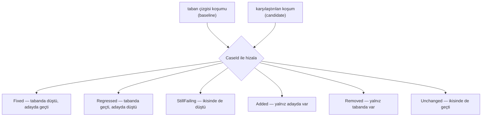

# Faz 153 — Eval Koşumları Arasında Regresyon Farkı

> **Durum:** 📋 Planlandı (2026-09-07)
> **Kaynak:** [ADAYLAR.md](ADAYLAR.md) · **F-207**
> **Önkoşul:** Yok. [Faz 152](152-SKORUN-ADI-VE-SEKLI.md) ile **çakışmaz** — o `run_scores`'a, bu `eval_case_results`'a dokunur.
> **Paketler:** `AgentPrism.Abstractions`, `AgentPrism.Core`, `AgentPrism.AspNetCore`, `AgentPrism.PostgreSql`, `AgentPrism.Sqlite`, `AgentPrism.SqlServer`, `AgentPrism.Cli`, `AgentPrism.Testing.Contracts.Xunit`, `AgentPrism.UI`
> **Yeni paket:** Yok · **Migration:** Yok — hizalama anahtarı (`EvalCaseResult.CaseId`) ve gereken alanlar mevcut şemadadır
> **Public API:** Büyüyor — bir okuma tipi ailesi + bir `IEvalStore` üyesi + bir CLI seçeneği. `wc -l src/*/PublicAPI.Shipped.txt` → her dosya **1 satır** (ölçüldü 2026-09-07): `IEvalStore`'a üye eklemek üçüncü taraf uygulayıcıyı kırar ve bu **`1.0` öncesi** yapılmalıdır.
> **Tüketici yüzeyi:** site: `docs-site/src/content/docs/concepts/evaluation.md` · üretilen: `http-api/`, `api/` · sevk edilen: `EvalEndpoints` `.WithDescription` metinleri, `EvalRun` XML dokümanı, `agentprism eval` yardım metni
> **Manuel test alanı:** `docs/manuel-test/17-EVAL-VE-DENEYLER.md` · `docs/manuel-test/34-ISTEMCI-VE-CLI.md`

---

## Bu Faza Başlarken

> `faz-baslangic` skill'ini uygula. Aşağıdaki liste o skill'in 2. adımıdır —
> **tamamını değil, yalnız işaret edilen bölümleri oku.**

1. Bu doküman
2. Kararlar — dosyanın tamamını **okuma**, yalnız bu kalemleri grep'le:
   ```bash
   grep -n "K-232\|K-421\|K-633\|K-641" docs/KARARLAR.md
   ```
   **K-232** (sunucu yanıtları çevrilmez — fark sonucu tek dillidir), **K-421**
   (public API takibi açık), **K-633** (üretilmiş istemcinin tipleri elle
   düzeltildi — yeni uç aynı zincirden geçer), **K-641** (`IJobHandler`
   at-least-once — aynı eval `run`'ı yeniden koşabilir, fark bunu gizlememelidir).
3. [`arsiv/fazlar/115-EVALIN-BASSIZ-KOSUCUSU.md`](arsiv/fazlar/115-EVALIN-BASSIZ-KOSUCUSU.md) — yalnız devir notu:
   ```bash
   awk '/## Sonraki Faza Devir Notu/,0' docs/arsiv/fazlar/115-EVALIN-BASSIZ-KOSUCUSU.md
   ```
   `agentprism eval` komutunun mutlak kapısı (`--min-pass-rate`/`--max-failures`)
   ve CLI test altyapısı (`RealHttpHost` · `CliRunner`) oradan devralınır.
4. Alan hafızası (bu faz üç alana dokunuyor):
   [`hafiza/http-uc-tuzaklari.md`](hafiza/http-uc-tuzaklari.md) (yeni uç, sayfalama,
   `404` semantiği) · [`hafiza/nswag-istemci-uretimi.md`](hafiza/nswag-istemci-uretimi.md)
   (üretilen istemci beş geçişli post-process'ten geçer) ·
   [`hafiza/frontend.md`](hafiza/frontend.md) (fark görünümü, `en.ts`/`tr.ts`)
5. Gerektiğinde, tamamı değil ilgili bölümü:
   [`MIMARI.md`](MIMARI.md) — eval veri modeli

---

## Amaç

Ürün karşılaştırmayı **vaat ediyor ama yapmıyor**. Sevk edilen uç metni
*"Comparing entries over time is how a regression between agent versions is
spotted"* diyor; `IEvalStore` ise yalnız **tek bir** koşumu okuyabiliyor. İki
koşumu case bazında hizalamak tüketiciye kalıyor. Aynı boşluk CI kapısında da
var: kapı **mutlaktır**, göreli değildir — `--min-pass-rate 0.85` ayarlıyken
%95 → %90 düşüş kapıyı **geçer**.

Bu bir eksiklik değil bir **tutarsızlıktır**: ürün kendi sevk ettiği metinde bu
işi yaptığını söylüyor.

- **F-207** — iki `EvalRun`'ı case bazında hizalayan bir okuma işlemi, taban
  çizgisine göre CI kapısı ve arayüzde fark görünümü.

### Bugün ne çalışmıyor — doğrulanmış kanıt

| Kanıt | Gözlem |
|---|---|
| [`EvalEndpoints.cs:141`](../src/AgentPrism.AspNetCore/Endpoints/EvalEndpoints.cs#L141) | Sevk edilen metin: *"Comparing entries over time is how a regression between agent versions is spotted."* |
| [`IEvalStore.cs:143`](../src/AgentPrism.Abstractions/Evaluation/IEvalStore.cs#L143) | `ListCaseResultsAsync` **tek** bir `evalRunId` alıyor; iki koşumu hizalayan üye yok |
| [`EvalCommand.cs:168`](../src/AgentPrism.Cli/Commands/EvalCommand.cs#L168) | `PassesThreshold(detail.Run, minPassRate, maxFailures)` — kapı **mutlak**; taban çizgisi kavramı yok |
| `grep -n "compare\|previous\|regress\|delta\|baseline" …/eval-run-detail.tsx` | **0 eşleşme** |
| [`EvalCaseResult.cs`](../src/AgentPrism.Abstractions/Evaluation/EvalCaseResult.cs) | `CaseId` · `Passed` · `Output` · `Scores` · `FailureReason` — hizalama anahtarı hazır |
| [`EvalRun.cs`](../src/AgentPrism.Abstractions/Evaluation/EvalRun.cs) | `AgentVersion` · `ModelId` · `Total`/`Passed`/`Failed` — karşılaştırma başlığı hazır |
| [`EvalEndpoints.cs:156-158`](../src/AgentPrism.AspNetCore/Endpoints/EvalEndpoints.cs#L156) | 🚨 *"Per-case results are a retention target, so an old eval run may keep its summary while its details are gone."* |

> Kanıtlar 2026-09-07 tarihinde doğrulandı.

---

## 153.1 — Fark dört kümedir, bir sayı değil

Fark sonucu case'leri **dört kümeye** ayırır. Tek bir "kaç tane bozuldu" sayısı
yetmez; nöbetçi mühendis hangi case'in bozulduğunu ister.



`Added`/`Removed` ayrı kümelerdir ve **sessizce yutulmaz**: suite'e case
eklenmesi pass-rate'i değiştirir ve bu bir regresyon değildir. Kapı bunu ayırt
edemezse yanlış alarm verir.

Her fark kalemi iki tarafın `FailureReason`'ını ve `RunId`'sini taşır — bir
regresyon doğrudan iki konuşmaya kadar izlenebilir.

## 153.2 — 🚨 Silinmiş ayrıntı sessiz boş sonuç üretmez

Bu fazın en büyük tuzağı budur ve **sözleşmeyle** çözülür, kodda bir `if` ile değil.

Sevk edilen metin per-case sonuçların bir **retention hedefi** olduğunu yazıyor:
eski bir eval koşumu özetini koruyup ayrıntısını kaybedebilir. Taban çizgisinin
ayrıntısı silinmişse fark **üretilemez**.

Yanlış davranış: boş bir fark döndürmek. Boş fark "hiçbir şey değişmedi" gibi
okunur ve CI kapısı **yeşil** yanar. Bu, bir regresyonu sessizce geçiren en
kötü hata modudur.

Doğru davranış: fark sonucu her iki tarafın ayrıntısının **var olup olmadığını**
açıkça taşır. Ayrıntı yoksa uç `409 Conflict` döner ve gövde hangi tarafın
ayrıntısının eksik olduğunu söyler. CLI bunu çıkış kodu **4** ile ayırır —
"kapı düştü" (3) ile "karşılaştırılamadı" (4) aynı şey değildir.

> Bu davranış `ProblemDetails` ile döner ve K-232 gereği **çevrilmez**.

## 153.3 — 🚨 Case içeriği değişirse fark elma-armut olur

İkinci tuzak: `EvalCaseResult.CaseId` bilerek bir FK taşımıyor. Case içeriği
(`Query`, `ExpectedOutput`, `Context`) iki koşum arasında düzenlenirse aynı
`CaseId` **farklı bir soruyu** gösterir ve fark yanıltır.

Aday metni bunu bir risk satırına taşımıştı; bu faz onu **görünür** kılar,
çözmez. Eval case sürümleme **kapsam dışıdır** (yeni tablo gerektirir).

Yapılan: fark sonucu, hizalanan her case için taban çizgisi tarafındaki ve aday
tarafındaki case **içeriğinin özetini** (`Query`'nin kararlı bir hash'i)
karşılaştırır ve farklıysa kalemi `ContentChanged` bayrağıyla işaretler. Kapı
bu bayraklı kalemleri regresyon **saymaz** ama sayısını rapor eder.

> Hash `Query` + `ExpectedOutput` + `Context` üzerinden hesaplanır ve **saklanmaz** —
> `EvalCase`'in bugünkü hâlinden okunur. Bu bir sınırdır: iki koşum arasında case
> **iki kez** değiştiyse ve bugünkü hâli taban çizgisininkiyle aynıysa bayrak
> yanmaz. Sözleşme bunu açıkça yazar; sessiz bir garanti verilmez.

## 153.4 — CI kapısı göreliye açılır

`agentprism eval` bugünkü iki mutlak seçeneğini **korur** ve bir üçüncüsü
kazanır:

| Seçenek | Anlam | Çıkış kodu |
|---|---|---|
| `--min-pass-rate <0..1>` | Mutlak (mevcut) | 3 |
| `--max-failures <n>` | Mutlak (mevcut) | 3 |
| `--baseline <runId\|previous>` | Karşılaştırılacak koşum | — |
| `--max-regressions <n>` | Taban çizgisine göre en çok kaç case bozulabilir | 3 |

`--baseline previous` aynı suite'in bir önceki **tamamlanmış** koşumunu seçer.
`--max-regressions` `--baseline` olmadan verilirse `CliArgumentException`.

Çıkış kodları: `0` geçti · `2` koşum tamamlanamadı (mevcut) · `3` kapı düştü ·
**`4` karşılaştırılamadı** (153.2).

> `--baseline previous` için "önceki koşum yok" durumu bir **hata değildir**:
> ilk koşumda kapı yalnız mutlak eşiklerle yargılar ve bunu `stderr`'e yazar.
> Aksi hâlde yeni bir suite'in ilk CI koşumu kırmızı yanar.

## 153.5 — Arayüzde fark görünümü

`eval-run-detail.tsx` bir taban çizgisi seçici ve dört kümeyi ayrı gösteren bir
görünüm kazanır. `Regressed` kümesi en üstte ve varsayılan açık gelir; nöbetçi
mühendisin aradığı budur.

---

## Planlanan Public API

> Taslak imzalardır. Gerçekleşen imzalar kapanışta ayrı bir bölüme yazılır.

```csharp
// AgentPrism.Abstractions
public interface IEvalStore
{
    // ... mevcut on beş üye değişmez ...

    /// <summary>Aligns two eval runs case by case.</summary>
    /// <remarks>
    /// Throws when the per-case details of either run have been removed by
    /// retention: an empty diff would read as "nothing changed".
    /// </remarks>
    ValueTask<EvalRunDiff> DiffRunsAsync(
        Guid baselineRunId,
        Guid candidateRunId,
        CancellationToken cancellationToken = default);
}

/// <summary>The case-by-case difference between two eval runs.</summary>
public sealed record EvalRunDiff
{
    public required EvalRun Baseline { get; init; }
    public required EvalRun Candidate { get; init; }
    public required IReadOnlyList<EvalCaseDiff> Cases { get; init; }

    /// <summary>The number of cases whose content changed between the two runs.</summary>
    public int ContentChangedCount { get; init; }
}

/// <summary>One case's outcome on both sides.</summary>
public sealed record EvalCaseDiff
{
    public required Guid CaseId { get; init; }
    public required EvalCaseDiffKind Kind { get; init; }
    public bool? BaselinePassed { get; init; }
    public bool? CandidatePassed { get; init; }
    public Guid? BaselineRunId { get; init; }
    public Guid? CandidateRunId { get; init; }
    public string? BaselineFailureReason { get; init; }
    public string? CandidateFailureReason { get; init; }

    /// <summary>True when the case content differs between the two runs.</summary>
    public bool ContentChanged { get; init; }
}

public enum EvalCaseDiffKind
{
    Unchanged = 0,
    Fixed = 1,
    Regressed = 2,
    StillFailing = 3,
    Added = 4,
    Removed = 5,
}
```

### HTTP `endpoint`'leri

| Metot | Yol | Rol | Ne yapar |
|---|---|---|---|
| `GET` | `/api/evals/runs/{id}/diff?baseline={runId}` | Reader (`EvalsRead`) | İki koşumun case bazında farkını döner |

- `404` — koşumlardan biri yok ya da başka kiracıya ait
- `409` — bir tarafın per-case ayrıntısı retention ile silinmiş (153.2)
- `400` — iki koşum farklı suite'lere ait

### Arayüz payı

`eval-run-detail.tsx`'e taban çizgisi seçici + dört kümeli fark görünümü.
Bugünkü ölçüm (2026-09-07): **151.9 KB** brotli / 250 KB bütçe. Yeni metin
anahtarları `en.ts` **ve** `tr.ts`'e girer (K-228).

---

## Planlanan Dosya Listesi

```
src/AgentPrism.Abstractions/Evaluation/
├── IEvalStore.cs           (değişir — DiffRunsAsync)
├── EvalRunDiff.cs          (yeni)
├── EvalCaseDiff.cs         (yeni)
└── EvalCaseDiffKind.cs     (yeni)

src/AgentPrism.Core/Evaluation/
├── InMemoryEvalStore.cs    (değişir)
└── EvalRunDiffBuilder.cs   (yeni — hizalama, üç store'un paylaştığı saf mantık)

src/AgentPrism.PostgreSql/…/PostgreSqlEvalStore.cs    (değişir)
src/AgentPrism.Sqlite/…/SqliteEvalStore.cs            (değişir)
src/AgentPrism.SqlServer/…/SqlServerEvalStore.cs      (değişir)

src/AgentPrism.AspNetCore/Endpoints/EvalEndpoints.cs  (değişir — yeni uç + metin düzeltmesi)
src/AgentPrism.Cli/Commands/EvalCommand.cs            (değişir — --baseline, --max-regressions)
src/AgentPrism.Testing.Contracts.Xunit/Contracts/EvalStoreContract.cs (değişir)
src/AgentPrism.UI/frontend/src/screens/eval-run-detail.tsx            (değişir)

tests/
├── AgentPrism.Core.Tests/Evaluation/EvalRunDiffBuilderTests.cs        (yeni)
├── AgentPrism.AspNetCore.FunctionalTests/Evals/EvalRunDiffTests.cs    (yeni)
└── AgentPrism.Cli.Tests/EvalBaselineGateTests.cs                      (yeni)
```

---

## Hata Modları ve Testler

> Seviyeyi plan seçer. Sınır geçen davranış (DI · HTTP · kiracı · akış · depo ·
> paket) birim testiyle kanıtlanamaz —
> [`.agents/ortak/test-seviyeleri.md`](../.agents/ortak/test-seviyeleri.md).

| Ne bozulabilir | Seviye | Test sınıfı |
|---|---|---|
| 🚨 Taban çizgisinin ayrıntısı silinmişken fark **boş** döner ⇒ CI yeşil yanar | Sözleşme + Fonksiyonel | `EvalStoreContract`, `EvalRunDiffTests` |
| Aday tarafın ayrıntısı silinmişken aynı hata | Sözleşme | `EvalStoreContract` |
| Suite'e eklenen case `Regressed` sayılır ⇒ yanlış alarm | Birim | `EvalRunDiffBuilderTests` |
| Suite'ten çıkarılan case `Fixed` sayılır | Birim | `EvalRunDiffBuilderTests` |
| İki koşum **farklı suite**'lere ait; fark yine üretilir | Fonksiyonel | `EvalRunDiffTests` |
| İçeriği değişmiş case `ContentChanged` işaretlenmez ⇒ elma-armut | Birim | `EvalRunDiffBuilderTests` |
| Tamamlanmamış (`Running`/`Queued`) koşum taban çizgisi seçilir | Fonksiyonel | `EvalRunDiffTests` |
| K-641: aynı eval `run`'ı yeniden koşulup case sonucu **iki kez** yazılmış; hizalama çift sayar | Sözleşme | `EvalStoreContract` |
| Başka kiracının koşumu taban çizgisi olarak verilir | Sözleşme | `TenantIsolationContract` |
| `--baseline previous` önceki koşum yokken **hata** verir | Fonksiyonel | `EvalBaselineGateTests` |
| `--max-regressions` `--baseline` olmadan sessizce yok sayılır | Fonksiyonel | `EvalBaselineGateTests` |
| Regresyon varken çıkış kodu 0 döner | Fonksiyonel | `EvalBaselineGateTests` |
| Karşılaştırılamama (`409`) çıkış kodu 3 ile karışır | Fonksiyonel | `EvalBaselineGateTests` |
| Binlerce case'li iki koşumda hizalama O(n²) olur | Birim | `EvalRunDiffBuilderTests` (sözlük tabanlı hizalama iddiası) |
| İptal: fark okuması ortasında `CancellationToken` iptal olur | Sözleşme | `EvalStoreContract` |
| `store` hata verir; uç `500` yerine sessiz boş döner | Fonksiyonel | `EvalRunDiffTests` |
| Fark görünümü `en.ts`/`tr.ts` anahtarı eksik | Birim | mevcut `LocaleParityTests` |

Beş soru: **iptal** ✅ · **eşzamanlılık** — fark saf bir okumadır, yazma yolu
yoktur; K-641 çift yazımı satır 8'de kapsanıyor · **boş/aşırı girdi** ✅ (satır
3, 4, 7, 14) · **başka kiracı** ✅ · **alt sistem hatası** ✅.

---

## Manuel Kabul Case'leri

> Kapanışta `docs/manuel-test/17-EVAL-VE-DENEYLER.md` ve
> `docs/manuel-test/34-ISTEMCI-VE-CLI.md` içine eklenecek taslak.

| # | Ön koşul | Adımlar | Beklenen sonuç |
|---|---|---|---|
| 1 | Bir suite iki kez koşulmuş, ikincide bir case bozulmuş | `GET /api/evals/runs/{ikinci}/diff?baseline={birinci}` | `Regressed` kümesinde tam o case; iki taraf da `runId` taşıyor |
| 2 | Aynı | Aynı çağrıyı ters sırayla yap | Aynı case `Fixed` kümesinde |
| 3 | İkinci koşumdan önce suite'e case eklenmiş | Fark al | Yeni case `Added`; `Regressed` **boş** |
| 4 | Taban çizgisi koşumunun per-case ayrıntısı retention ile silinmiş | Fark al | `409`; gövde hangi tarafın eksik olduğunu söylüyor — **boş fark değil** |
| 5 | İki koşum farklı suite'lerden | Fark al | `400` |
| 6 | Başka kiracının koşum id'si | Fark al | `404` |
| 7 | Regresyonlu iki koşum | `agentprism eval <suite> --baseline previous --max-regressions 0` | Çıkış kodu **3**; `stderr` bozulan case'leri sayıyor |
| 8 | Aynı, regresyon yok | Aynı komut | Çıkış kodu **0** |
| 9 | Suite ilk kez koşuluyor | `--baseline previous --max-regressions 0` | Çıkış kodu **0**; `stderr` "önceki koşum yok" diyor |
| 10 | Taban çizgisi ayrıntısı silinmiş | Aynı komut | Çıkış kodu **4** — 3 değil |
| 11 | İki koşum arasında bir case'in `Query`'si değiştirilmiş | Fark al | O kalem `contentChanged: true`; kapı onu regresyon **saymıyor** |
| 12 | 👤 insan gerekir | Arayüzde `eval-run-detail`'de taban çizgisi seç | Dört küme ayrı; `Regressed` en üstte ve açık |

---

## Açık Sorular

> Planı bloklamayan, faz uygulanırken karara bağlanacak sorular.

| # | Soru | Seçenekler | Öneri |
|---|---|---|---|
| 1 | `DiffRunsAsync` `IEvalStore`'da mı, ayrı bir okuma servisinde mi? | A: `IEvalStore` üyesi · B: `EvalRunDiffBuilder` + mevcut `ListCaseResultsAsync` | **B'nin mantığı + A'nın imzası**: hizalama `EvalRunDiffBuilder`'da saf kalır, `IEvalStore` uygulayıcıları onu çağırır. Böylece üçüncü taraf uygulayıcı hizalamayı yeniden yazmak zorunda kalmaz — üye eklemek yine de kırıcıdır ve `1.0` öncesi yapılır |
| 2 | Ayrıntı silinmişse `409` mu, `404` mü? | A: `409 Conflict` · B: `404` | **A** — kaynak vardır (koşum duruyor), karşılaştırma yapılamaz. `404` "koşum yok" ile karışır |
| 3 | `ContentChanged` hash'i neyi kapsar? | A: `Query` · B: `Query`+`ExpectedOutput`+`Context` | **B** — beklenen çıktı değişimi de farkı elma-armut yapar |
| 4 | Fark sayfalanır mı? | A: hayır, tam liste · B: `skip`/`take` | **B** — mevcut eval uçları offset tabanlı sayfalama kullanıyor; binlerce case'li suite tek yanıta sığmaz. Özet sayılar sayfalamadan bağımsız döner |
| 5 | `--baseline` bir agent **sürümü** de alabilsin mi (`--baseline v3`)? | A: yalnız `runId`/`previous` · B: sürüm de | **A** — sürüm başına birden çok koşum olabilir; hangisi seçilir sorusu belirsizdir. Kapsam dar tutulur |

---

## Bitiş Ölçütleri (DoD)

- [ ] `GET /api/evals/runs/{id}/diff?baseline={runId}` altı kümeyi ayrı ayrı döner
- [ ] Suite'e eklenen case `Added`'dir, `Regressed` **değildir**
- [ ] Taban çizgisinin ayrıntısı silinmişken uç `409` döner — **boş fark dönmez**
- [ ] `agentprism eval <suite> --baseline previous --max-regressions 0` regresyonda çıkış kodu **3** verir
- [ ] Karşılaştırılamama çıkış kodu **4** verir; 3 ile karışmaz
- [ ] İlk koşumda `--baseline previous` kapıyı kırmızı yakmaz
- [ ] İçeriği değişen case `contentChanged` ile işaretlenir ve regresyon sayılmaz
- [ ] `EvalEndpoints.cs:141`'deki sevk edilen metin artık **doğrudur** (uç gerçekten karşılaştırıyor)
- [ ] Dört doğrulama kapısı sıfır uyarı verir
- [ ] `samples/AgentPrism.Api` ile gerçek iki eval koşumu + fark alındı, çıktı belgeye yazıldı
- [ ] `secret` taraması boş döndü
- [ ] Manuel kabul case'leri `17-EVAL-VE-DENEYLER.md` ve `34-ISTEMCI-VE-CLI.md` içine eklendi
- [ ] `faz-denetim` koşuldu; 🔴 bulgu kalmadı
- [ ] `docs-site/concepts/evaluation.md` güncellendi; `npm run build` + `check-links.mjs` temiz
- [ ] `en.ts` ve `tr.ts` eksiksiz; bundle payı ölçüldü ve yazıldı
- [ ] OpenAPI → NSwag → TypeScript zinciri yeniden üretildi; üretilen istemci derleniyor

### Doğrulama komutları

```bash
# Fark dört kümeyi ayırıyor mu
curl -s "http://localhost:5081/agentprism/api/evals/runs/$SECOND/diff?baseline=$FIRST" \
  | jq '[.cases[] | .kind] | group_by(.) | map({(.[0]): length}) | add'

# Göreli kapı regresyonda düşüyor mu
agentprism eval smoke --baseline previous --max-regressions 0; echo "exit=$?"
```

---

## Riskler

| Risk | Önlem |
|------|-------|
| 🚨 Silinmiş ayrıntı sessiz boş fark üretir ⇒ regresyon CI'dan geçer | `409` + çıkış kodu 4; sözleşme testi dört koşumda birden |
| 🚨 Case içeriği değişince fark elma-armut olur | `ContentChanged` bayrağı; kapı bayraklı kalemi regresyon saymaz; sınırı sözleşmede yazılı |
| `IEvalStore`'a üye eklemek üçüncü taraf uygulayıcıyı kırar | `PublicAPI.Shipped.txt` **boştur** (ölçüldü) — `1.0` öncesi yapılır. Hizalama mantığı `EvalRunDiffBuilder`'da paylaşılır, yeniden yazılmaz |
| Yeni çıkış kodu (4) mevcut CI script'lerini bozar | Kod **eklenir**, mevcutların anlamı değişmez; yardım metni ve site tablosu güncellenir |
| Binlerce case'te hizalama yavaşlar | Sözlük tabanlı tek geçiş; sayfalama (Açık Soru 4) |
| Fark yanıtı iki koşumun `Output` metnini taşırsa yanıt şişer | `Output` fark kalemine **girmez**; yalnız `RunId` ve `FailureReason` |
| Üretilen istemcinin tipi elle düzeltme ister (K-633) | `nswag-postprocess-client.py` koşumu DoD'de; `hafiza/nswag-istemci-uretimi.md` okunur |

---

<!-- ============================================================
     AŞAĞISI KAPANIŞTA DOLDURULUR — `faz-tamamlama` skill'i.
     Plan anında boş kalır. Başlıkları SİLME.
     ============================================================ -->

## Plandan Sapmalar

> Kapanışta doldurulur.

## Bu Fazda Verilen Kararlar

> Kapanışta doldurulur. K-NNN numaraları burada alınır; plan numara rezerve etmez.

## Gerçekleşen Public API

> Kapanışta doldurulur.

## Dosya Listesi (gerçekleşen)

> Kapanışta doldurulur.

## Denetim Bulguları

> Kapanışta doldurulur.

## Sonraki Faza Devir Notu

> Kapanışta doldurulur.
