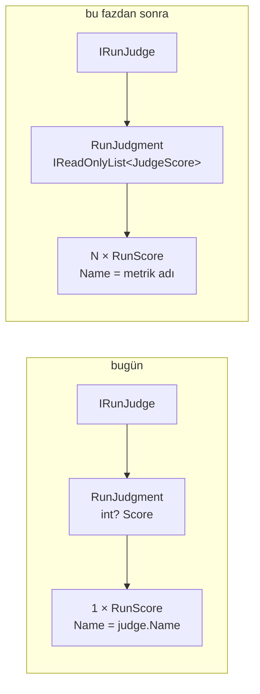

# Faz 155 — Kalibre Edilmiş Evaluator Kataloğu

> **Durum:** 📋 Planlandı (2026-09-07)
> **Kaynak:** [ADAYLAR.md](ADAYLAR.md) · **F-210**
> **Önkoşul:** [Faz 152](arsiv/fazlar/152-SKORUN-ADI-VE-SEKLI.md) — adlı ve tipli skor kaydını (`RunScore.Name`/`Kind`/`Value`) getirir. 🚨 Yalnız **kayıt** şeklini açtı; yargıcın **dönüş** şeklini açmadı — bu fazın ilk işi odur.
> **Paketler:** `AgentPrism.Abstractions`, `AgentPrism.Core`
> **Yeni paket:** `Microsoft.Extensions.AI.Evaluation.Quality` 10.9.0 — K-007 gerekçesi §155.4'te; net 1 paket, geçişli ağırlık 0 (ölçüldü 2026-09-07) · **Migration:** Yok — `run_scores` şekli yeterlidir
> **Public API:** Büyüyor **ve bir sözleşmeyi değiştiriyor** — `RunJudgment`. Bugün ucuz: `wc -l src/*/PublicAPI.Shipped.txt` = **17 satır** (yalnız `#nullable enable` başlıkları), yani hiçbir yüzey yayımlanmadı. İlk yayından sonra aynı değişiklik **kırıcıdır**.
> **Tüketici yüzeyi:** `docs-site/src/content/docs/concepts/evaluation.md` (yargıç bölümü) · sevk edilen: `IRunJudge`/`RunJudgment` XML dokümanı, `capabilities.md` satırı
> **Manuel test alanı:** [`docs/manuel-test/17-EVAL-VE-DENEYLER.md`](manuel-test/17-EVAL-VE-DENEYLER.md)

---

## Bu Faza Başlarken

> `faz-baslangic` skill'ini uygula. Aşağıdaki liste o skill'in 2. adımıdır —
> **tamamını değil, yalnız işaret edilen bölümleri oku.**

1. Bu doküman
2. Kararlar — dosyanın tamamını **okuma**, yalnız bu kalemleri grep'le:
   ```bash
   grep -n "K-710\|K-711\|K-712\|K-007" docs/KARARLAR.md
   ```
   **K-710** (`RunScore.Name` tekillik anahtarına girer, `author` `COALESCE` edilmez) ·
   **K-711** (`RunScore.Value` `double?`; `null` = ölçüm yok, `TextValue` ve `Categorical` eklendi) ·
   **K-712** (`RunScoreRules` public'tir; invariant tek kaynaktan zorlanır) ·
   **K-007** (geçişli sabitleme kapalı — yeni paket gerekçe ister)
3. [Faz 152](arsiv/fazlar/152-SKORUN-ADI-VE-SEKLI.md) — yalnız devir notu:
   ```bash
   awk '/## Sonraki Faza Devir Notu/,0' docs/arsiv/fazlar/152-SKORUN-ADI-VE-SEKLI.md
   ```
   Skorun ad/tip/değer sözleşmesini oradan devralıyorsun; bu faz o sözleşmeye **yazan** ikinci bir kaynak ekliyor.
4. Alan hafızası (bu faz iki alana dokunuyor):
   [`hafiza/maf-api.md`](hafiza/maf-api.md) (MAF tip imzaları tahmin edilmez) ·
   [`hafiza/paketleme-ve-dagitim.md`](hafiza/paketleme-ve-dagitim.md) (yeni paket, AOT ve geçişli ağırlık)
5. Gerektiğinde, tamamı değil ilgili bölümü: [`MIMARI.md`](MIMARI.md) — değerlendirme bölümü

---

## Amaç

AgentPrism'in bugün **tek** yerleşik yargıcı var ve o da elle yazılmış tek bir
genel kalite prompt'u. Microsoft on bir kalibre edilmiş evaluator sevk ediyor;
üçü doğrudan agent işidir. Bu faz o kataloğu bağlanabilir kılar. Tüketici
"cevap alakalı mı", "tool doğru çağrıldı mı", "görev yerine getirildi mi"
sorularını **kendi prompt'unu yazmadan** ölçer.

- **F-210** — `IEvaluator` tabanlı bir `IRunJudge` köprüsü ve `IAgentEvaluator`
  seam'inin `IAgentPrismBuilder` üzerinden açılması.

**Kapsam dışı:** On bir evaluator'ın hepsini bildirimsel (JSON/HTTP) yüzeye
açmak. `.Safety` ve `.NLP` paketleri — ikisi de preview (K-008 sınırı).

### Bugün ne çalışmıyor — doğrulanmış kanıt

| Kanıt | Gözlem |
|---|---|
| [`IRunJudge.cs:89`](../src/AgentPrism.Abstractions/Evaluation/IRunJudge.cs#L89) | `RunJudgment` yalnız `int? Score` + `string? Reason` taşıyor. Bir yargıç **tek** skor döndürebilir |
| [`OnlineEvalJobHandler.cs:313`](../src/AgentPrism.Core/Evaluation/OnlineEvalJobHandler.cs#L313) | Bir yargıç bir `RunScore` satırına eşleniyor: `Name = judge.Name`, `Kind = Numeric`. Ad yargıcın adıdır, metriğin değil |
| [`ModelRunJudge.cs:50`](../src/AgentPrism.Core/Evaluation/ModelRunJudge.cs#L50) | Tek yerleşik yargıç; `Name => "model"`, 0-100 tek skor |
| [`EvalJobHandler.cs:139`](../src/AgentPrism.Core/Evaluation/EvalJobHandler.cs#L139) | `new LocalEvaluator([.. checks])` **sabit kodlu**. MAF'ın `IAgentEvaluator` seam'i var ama tüketiciye açılmıyor |
| `Directory.Packages.props` | `Evaluation` girdisi **yok** — `M.E.AI.Evaluation` grafiğe `Microsoft.Agents.AI` 1.20.0 üzerinden geçişli geliyor |
| [`RunScore.cs:44`](../src/AgentPrism.Abstractions/Runs/RunScore.cs#L44) | Kayıt tarafı hazır: `Name`, `Kind`, `Value` (`double?`), `TextValue` |

> Kanıtlar 2026-09-07 tarihinde doğrulandı.
>
> 🚨 **Aday metnindeki bir iddia çürüdü.** F-210 *"Faz 152 bunu açar"* diyordu.
> Faz 152 **kayıt** şeklini açtı (`RunScore`), **yargıç dönüşünü** değil
> (`RunJudgment` hâlâ `int? Score`). Köprü bedava değildir; §155.1 bu farkı
> kapatır ve fazın en pahalı kararı odur.

---

## 155.1 — `RunJudgment` çok adlı skor taşır

Bugün bir yargıç bir skor döndürür ve o skorun adı **yargıcın adıdır**. Bir
`IEvaluator` ise adlı metrik sözlüğü döndürür. İki şekil arasında köprü kurmanın
üç yolu vardı; **kullanıcı kararı: sözleşmeyi genişlet** (2026-09-07).

Gerekçe ölçüldü: `PublicAPI.Shipped.txt` dosyalarının toplamı 17 satırdır ve
hepsi `#nullable enable` başlığıdır — hiçbir public yüzey yayımlanmamıştır.
Bu değişiklik **bugün bedava, ilk yayından sonra kırıcıdır**.



**Geriye uyum kuralı:** mevcut tek skorlu yargıçlar değişmeden derlenmeye devam
etmelidir. Taslak imza §*Planlanan Public API*'dedir; `Score`/`Reason`
alanlarının korunup korunmayacağı (yoksa tek elemanlı listeye mi çevrileceği)
**Açık Soru 1**'dir.

🚨 **Ad çakışması gerçek bir risktir.** K-710 gereği `RunScore.Name` tekillik
anahtarına girer. İki farklı evaluator aynı metrik adını üretirse
(`Relevance` gibi) ikisi aynı satıra yazar ve biri diğerini ezer. Ad şeması
**Açık Soru 2**'dir.

## 155.2 — `IEvaluator` → `IRunJudge` köprüsü

Köprü, bir MAF `IEvaluator`'ını AgentPrism'in yargıç sözleşmesine sarar. MAF
tipini **sarmalamaz**, kullanır (K3): `IEvaluator` doğrudan alınır, paralel bir
tip hiyerarşisi kurulmaz.

Köprünün üç sorumluluğu vardır:

1. `RunJudgeContext`'i evaluator'ın beklediği mesaj/yanıt şekline çevirmek.
2. `EvaluationResult`'ın adlı metriklerini `JudgeScore` listesine çevirmek —
   sayısal olan `Numeric`, derecelendirme olan `Categorical` (K-711'in şekli).
3. Ölçüm üretmeyen metriği **`null` değerle** geçirmek, `0` ile değil (K-711).

🚨 **Evaluator model çağırır.** Bir eval koşumunun faturası evaluator sayısıyla
çarpılır. Köprü, çağrıyı fazın var olan run bütçesine bağlamalıdır; bağlanmazsa
`OnlineEvalJobHandler`'ın bütçe token'ı bu yolu kapsamaz.

## 155.3 — `IAgentEvaluator` seam'inin açılması

`EvalJobHandler.cs:139` `new LocalEvaluator([.. checks])` yazıyor. MAF
`LocalEvaluator : IAgentEvaluator` olduğu için seam zaten oradadır; AgentPrism
onu tüketiciye açmıyor. Bu faz kaydı `TryAdd*` ile açar (K4): tüketicinin
kaydı kazanır, hiçbir şey kaydedilmezse bugünkü davranış **birebir** korunur
(K1 — sıfır sürpriz).

## 155.4 — Yeni paket gerekçesi (K-007)

| Ölçüm (2026-09-07) | Sonuç |
|---|---|
| `M.E.AI.Evaluation.Quality` 10.9.0 | **GA** — preview değil, K-008 sınırına girmez |
| Kendi bağımlılığı | **Yalnız** `M.E.AI.Evaluation` 10.9.0 |
| `M.E.AI.Evaluation` bugün nerede | `Core` · `AspNetCore` · `Cli` grafiğinde **zaten var** (`Microsoft.Agents.AI` 1.20.0 üzerinden) |
| ⇒ Net maliyet | **1 paket, geçişli ağırlık 0** |
| `RequiresUnreferencedCode` / `RequiresDynamicCode` | **0 / 0** — AOT sinyali iyi, **kanıt değil** |

🚨 AOT sinyali kanıt değildir. Paket `Core`'a doğrudan referans olarak girerse
AOT kapısı **gerçek yayın koşumuyla** doğrulanmalıdır; annotation temizliği
yeterli sayılmaz.

---

## Planlanan Public API

> Taslak imzalardır. Gerçekleşen imzalar kapanışta ayrı bir bölüme yazılır.

```csharp
// AgentPrism.Abstractions
/// <summary>Bir yargıcın ürettiği tek bir adlı skor.</summary>
public sealed record JudgeScore
{
    public required string Name { get; init; }
    public required RunScoreKind Kind { get; init; }
    public double? Value { get; init; }
    public string? TextValue { get; init; }
    public string? Comment { get; init; }
}

public sealed record RunJudgment
{
    // Açık Soru 1: mevcut Score/Reason korunur mu, yoksa Scores'a mı taşınır?
    public IReadOnlyList<JudgeScore> Scores { get; init; } = [];
}
```

```csharp
// AgentPrism.Core — köprü ve kayıt
public static IAgentPrismBuilder AddEvaluatorJudge(
    this IAgentPrismBuilder builder,
    string name,
    Microsoft.Extensions.AI.Evaluation.IEvaluator evaluator);

public static IAgentPrismBuilder AddAgentEvaluator<T>(this IAgentPrismBuilder builder)
    where T : class, Microsoft.Extensions.AI.Evaluation.IAgentEvaluator;
```

> 🚨 **`IEvaluator` ve `IAgentEvaluator` imzaları bu planda DOĞRULANMADI.**
> F-210'un ölçümü (2026-09-07) tiplerin var olduğunu ve parametresiz ctor
> aldıklarını söylüyor, ama `EvaluateAsync`'in tam parametre listesi ve
> `ChatConfiguration`'ın nasıl verildiği **ölçülmedi**. Uygulayan oturumun
> **ilk işi** `maf-api-kesfi` koşmaktır. Yukarıdaki imzalar tahmin değil,
> taslaktır; ölçüm onları değiştirebilir.

### HTTP `endpoint`'leri

Yeni uç **yok**. Skorlar var olan `run_scores` yüzeyinden okunur.

### Arayüz payı

Yok — bu faz arayüze dokunmuyor.

---

## Planlanan Dosya Listesi

```
src/AgentPrism.Abstractions/Evaluation/
├── IRunJudge.cs              (değişir — RunJudgment genişler)
└── JudgeScore.cs             (yeni)

src/AgentPrism.Core/Evaluation/
├── EvaluatorRunJudge.cs      (yeni — IEvaluator → IRunJudge köprüsü)
├── OnlineEvalJobHandler.cs   (değişir — N skor yazar)
├── ModelRunJudge.cs          (değişir — tek skoru yeni şekle koyar)
└── EvalJobHandler.cs         (değişir — IAgentEvaluator seam'i)

tests/AgentPrism.Core.UnitTests/Evaluation/
├── EvaluatorRunJudgeTests.cs
└── JudgeScoreShapeTests.cs

tests/AgentPrism.AspNetCore.FunctionalTests/
└── EvaluatorJudgeEndToEndTests.cs
```

---

## Hata Modları ve Testler

> Mutlu yoldan değil, **ne bozulabilir**den türetilir. Seviyeyi plan seçer.

| Ne bozulabilir | Seviye | Test sınıfı |
|---|---|---|
| İki evaluator aynı metrik adını üretir; biri diğerinin satırını ezer (K-710) | Fonksiyonel (depo sınırı) | `EvaluatorJudgeEndToEndTests` |
| Evaluator ölçüm üretemez; `0` yazılır ve ortalama bozulur (K-711 ihlali) | Birim | `EvaluatorRunJudgeTests` |
| Evaluator model çağrısı run bütçesini aşar, iptal token'ı bu yola geçmez | Fonksiyonel | `EvaluatorJudgeEndToEndTests` |
| Başka kiracının skor satırı görünür veya yazılır | Sözleşme (`TenantIsolationContract`) | dört koşumda birden |
| Evaluator istisna atar; online eval işi tamamen düşer | Fonksiyonel | `EvaluatorJudgeEndToEndTests` |
| Mevcut tek skorlu yargıç derlenmez (geriye uyum kırıldı) | Birim | `JudgeScoreShapeTests` |
| Eşzamanlı iki judge aynı run'a yazar; tekillik anahtarı yarışır | Fonksiyonel | `EvaluatorJudgeEndToEndTests` |
| `.Quality` paketi AOT yayında kırılır | E2E (yayın koşumu) | mevcut AOT kapısı |

Beş soru: **iptal** — bütçe token'ı köprüye geçer mi · **eşzamanlılık** —
aynı run'a iki judge · **boş/aşırı girdi** — metriksiz `EvaluationResult` ve
4000 karakteri aşan gerekçe · **başka kiracı** — sözleşme testi ·
**alt sistem hatası** — evaluator istisnası ve model zaman aşımı.

---

## Manuel Kabul Case'leri

| # | Ön koşul | Adımlar | Beklenen sonuç |
|---|---|---|---|
| 1 | `AddEvaluatorJudge` ile bir `.Quality` evaluator'ı kayıtlı, online eval açık | Bir run koş, `GET /api/runs/{id}/scores` | Evaluator'ın **her** metriği ayrı satır; adlar metrik adı, yargıç adı değil |
| 2 | Hiçbir evaluator kaydedilmemiş | Bir run koş | Bugünkü davranış **birebir** aynı; yeni satır yok (K1) |
| 3 | Evaluator ölçüm üretmiyor | Bir run koş | Satır `Value = null`; `0` **değil** |
| 4 | İki evaluator aynı metrik adını üretiyor | Bir run koş | İkisi de görünür; biri diğerini **ezmez** |
| 5 | Evaluator istisna atıyor | Bir run koş | Run tamamlanır; hata `JudgeFailure` olarak raporlanır |

---

## Açık Sorular

| # | Soru | Seçenekler | Öneri |
|---|---|---|---|
| 1 | `RunJudgment.Score`/`Reason` korunacak mı? | A: Korunur, `Scores` yanına eklenir (en uyumlu, iki doğruluk kaynağı) · B: Kaldırılır, tek skorlu yargıç tek elemanlı liste döndürür (tek kaynak, mevcut yargıçlar derlenmez) | **B** — yayımlanmamış yüzeyde iki doğruluk kaynağı bırakmak sonradan pahalıya gelir; mevcut yargıç sayısı ikidir (`ModelRunJudge` ve testlerdeki sahte) |
| 2 | Metrik adı nasıl kurulur? | A: Ham metrik adı (`Relevance`) · B: `{judge}:{metrik}` önekli | **B** — K-710 tekillik anahtarını adla kuruyor; önek çakışmayı yapısal olarak imkânsız kılar |
| 3 | Evaluator'ın `ChatConfiguration`'ı nereden gelir? | A: Kayıt anında sabit · B: Run'ın kendi model bağlamasından | Ölçülmeden karar verilmez — `maf-api-kesfi` sonucuna bağlıdır |
| 4 | `.Quality` hangi pakete referans olur? | A: `Core` · B: Ayrı `AgentPrism.Evaluation.Quality` paketi | **A** — net 1 paket ve geçişli ağırlık 0; ayrı paket K-007'nin gerektirdiğinden fazla yüzey açar. AOT kapısı gerçek koşumla doğrulanır |

---

## Bitiş Ölçütleri (DoD)

- [ ] Kayıtlı bir `.Quality` evaluator'ı ile koşulan run, **metrik başına** ayrı `run_scores` satırı üretir; `GET /api/runs/{id}/scores` çıktısı belgeye yazıldı
- [ ] Hiçbir evaluator kaydedilmediğinde davranış bugünküyle **birebir** aynı (K1)
- [ ] Ölçüm üretmeyen metrik `Value = null` yazar, `0` değil (K-711)
- [ ] `maf-api-kesfi` koşuldu; `IEvaluator`/`IAgentEvaluator` gerçek imzaları belgeye yazıldı
- [ ] Yeni paketin geçişli ağırlığı **gerçek restore** ile sayıldı ve belgeye yazıldı
- [ ] Dört doğrulama kapısı sıfır uyarı verir
- [ ] `samples/AgentPrism.Api` ile gerçek `run` yapıldı, çıktı belgeye yazıldı
- [ ] `secret` taraması boş döndü
- [ ] Manuel kabul case'leri `docs/manuel-test/17-EVAL-VE-DENEYLER.md` içine eklendi; otomatikleştirilebilenler koşuldu
- [ ] `faz-denetim` koşuldu; 🔴 bulgu kalmadı
- [ ] `docs-site/` güncellendi (`concepts/evaluation.md` yargıç bölümü); `npm run build` + `check-links.mjs` temiz

### Doğrulama komutları

```bash
# Metrik başına ayrı skor satırı
curl -s http://localhost:5081/agentprism/api/runs/$RUN_ID/scores | jq '[.[] | {name, kind, value}]'

# Yeni paketin gerçek geçişli ağırlığı
dotnet list src/AgentPrism.Core package --include-transitive | grep -c Evaluation
```

---

## Riskler

| Risk | Önlem |
|------|-------|
| Evaluator model çağırır; eval faturası evaluator sayısıyla çarpılır | Köprü run bütçesine bağlanır; DoD bunu ölçer. Rehberde maliyet açıkça yazılır |
| Microsoft prompt'ları sürümle değişir; skorlar kayar ve [Faz 153](arsiv/fazlar/153-EVAL-KOSUMLARI-ARASINDA-REGRESYON-FARKI.md)'ün taban çizgisi sessizce bozulur | Skor satırı üreten evaluator paket sürümünü kaydeder; sürüm değişimi taban çizgisi karşılaştırmasında görünür olur |
| AOT kapısı annotation'a bakıp geçer, gerçek yayında kırılır | AOT gerçek yayın koşumuyla doğrulanır; DoD bunu şart koşar |
| `RunJudgment` değişimi mevcut yargıçları kırar | Geriye uyum testi (`JudgeScoreShapeTests`); Açık Soru 1 kapanışta karara bağlanır |
| Talep kanıtı yok — kalem yüzey taramasından çıktı | Kapsam dar tutuldu: köprü + seam. On bir evaluator'ın bildirimsel yüzeyi **kapsam dışıdır** |

---

<!-- ============================================================
     AŞAĞISI KAPANIŞTA DOLDURULUR — `faz-tamamlama` skill'i.
     Plan anında boş kalır. Başlıkları SİLME.
     ============================================================ -->

## Plandan Sapmalar

> Kapanışta doldurulur.

## Bu Fazda Verilen Kararlar

> Kapanışta doldurulur. K-NNN numaraları burada alınır; plan numara rezerve etmez.

## Gerçekleşen Public API

> Kapanışta doldurulur.

## Dosya Listesi (gerçekleşen)

> Kapanışta doldurulur.

## Denetim Bulguları

> Kapanışta doldurulur.

## Sonraki Faza Devir Notu

> Kapanışta doldurulur.
