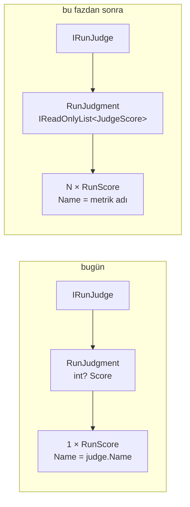

# Faz 155 — Kalibre Edilmiş Evaluator Kataloğu

> **Durum:** ✅ Tamamlandı (2026-09-08)
> **Kaynak:** [ADAYLAR.md](ADAYLAR.md) · **F-210**
> **Önkoşul:** [Faz 152](arsiv/fazlar/152-SKORUN-ADI-VE-SEKLI.md) — adlı ve tipli skor kaydını (`RunScore.Name`/`Kind`/`Value`) getirir. 🚨 Yalnız **kayıt** şeklini açtı; yargıcın **dönüş** şeklini açmadı — bu fazın ilk işi odur.
> **Paketler:** `AgentPrism.Abstractions`, `AgentPrism.Core`
> **Yeni paket:** `Microsoft.Extensions.AI.Evaluation.Quality` 10.9.0 — K-007 gerekçesi §155.4'te; net 1 paket, geçişli ağırlık 0 (ölçüldü 2026-09-07) · **Migration:** Yok — `run_scores` şekli yeterlidir
> **Public API:** Büyüyor **ve bir sözleşmeyi değiştiriyor** — `RunJudgment`. Bugün ucuz: `wc -l src/*/PublicAPI.Shipped.txt` = **17 satır** (yalnız `#nullable enable` başlıkları), yani hiçbir yüzey yayımlanmadı. İlk yayından sonra aynı değişiklik **kırıcıdır**.
> **Tüketici yüzeyi:** `docs-site/src/content/docs/concepts/evaluation.md` (yargıç bölümü) · sevk edilen: `IRunJudge`/`RunJudgment` XML dokümanı, `capabilities.md` satırı
> **Manuel test alanı:** [`docs/manuel-test/17-EVAL-VE-DENEYLER.md`](manuel-test/17-EVAL-VE-DENEYLER.md)

---

## Bu Faza Başlarken

> `faz-baslangic` skill'ini uygula. Aşağıdaki liste o skill'in 2. adımıdır —
> **tamamını değil, yalnız işaret edilen bölümleri oku.**

1. Bu doküman
2. Kararlar — dosyanın tamamını **okuma**, yalnız bu kalemleri grep'le:
   ```bash
   grep -n "K-710\|K-711\|K-712\|K-007" docs/KARARLAR.md
   ```
   **K-710** (`RunScore.Name` tekillik anahtarına girer, `author` `COALESCE` edilmez) ·
   **K-711** (`RunScore.Value` `double?`; `null` = ölçüm yok, `TextValue` ve `Categorical` eklendi) ·
   **K-712** (`RunScoreRules` public'tir; invariant tek kaynaktan zorlanır) ·
   **K-007** (geçişli sabitleme kapalı — yeni paket gerekçe ister)
3. [Faz 152](arsiv/fazlar/152-SKORUN-ADI-VE-SEKLI.md) — yalnız devir notu:
   ```bash
   awk '/## Sonraki Faza Devir Notu/,0' docs/arsiv/fazlar/152-SKORUN-ADI-VE-SEKLI.md
   ```
   Skorun ad/tip/değer sözleşmesini oradan devralıyorsun; bu faz o sözleşmeye **yazan** ikinci bir kaynak ekliyor.
4. Alan hafızası (bu faz iki alana dokunuyor):
   [`hafiza/maf-api.md`](hafiza/maf-api.md) (MAF tip imzaları tahmin edilmez) ·
   [`hafiza/paketleme-ve-dagitim.md`](hafiza/paketleme-ve-dagitim.md) (yeni paket, AOT ve geçişli ağırlık)
5. Gerektiğinde, tamamı değil ilgili bölümü: [`MIMARI.md`](MIMARI.md) — değerlendirme bölümü

---

## Amaç

AgentPrism'in bugün **tek** yerleşik yargıcı var ve o da elle yazılmış tek bir
genel kalite prompt'u. Microsoft on bir kalibre edilmiş evaluator sevk ediyor;
üçü doğrudan agent işidir. Bu faz o kataloğu bağlanabilir kılar. Tüketici
"cevap alakalı mı", "tool doğru çağrıldı mı", "görev yerine getirildi mi"
sorularını **kendi prompt'unu yazmadan** ölçer.

- **F-210** — `IEvaluator` tabanlı bir `IRunJudge` köprüsü ve `IAgentEvaluator`
  seam'inin `IAgentPrismBuilder` üzerinden açılması.

**Kapsam dışı:** On bir evaluator'ın hepsini bildirimsel (JSON/HTTP) yüzeye
açmak. `.Safety` ve `.NLP` paketleri — ikisi de preview (K-008 sınırı).

### Bugün ne çalışmıyor — doğrulanmış kanıt

| Kanıt | Gözlem |
|---|---|
| [`IRunJudge.cs:89`](../src/AgentPrism.Abstractions/Evaluation/IRunJudge.cs#L89) | `RunJudgment` yalnız `int? Score` + `string? Reason` taşıyor. Bir yargıç **tek** skor döndürebilir |
| [`OnlineEvalJobHandler.cs:313`](../src/AgentPrism.Core/Evaluation/OnlineEvalJobHandler.cs#L313) | Bir yargıç bir `RunScore` satırına eşleniyor: `Name = judge.Name`, `Kind = Numeric`. Ad yargıcın adıdır, metriğin değil |
| [`ModelRunJudge.cs:50`](../src/AgentPrism.Core/Evaluation/ModelRunJudge.cs#L50) | Tek yerleşik yargıç; `Name => "model"`, 0-100 tek skor |
| [`EvalJobHandler.cs:139`](../src/AgentPrism.Core/Evaluation/EvalJobHandler.cs#L139) | `new LocalEvaluator([.. checks])` **sabit kodlu**. MAF'ın `IAgentEvaluator` seam'i var ama tüketiciye açılmıyor |
| `Directory.Packages.props` | `Evaluation` girdisi **yok** — `M.E.AI.Evaluation` grafiğe `Microsoft.Agents.AI` 1.20.0 üzerinden geçişli geliyor |
| [`RunScore.cs:44`](../src/AgentPrism.Abstractions/Runs/RunScore.cs#L44) | Kayıt tarafı hazır: `Name`, `Kind`, `Value` (`double?`), `TextValue` |

> Kanıtlar 2026-09-07 tarihinde doğrulandı.
>
> 🚨 **Aday metnindeki bir iddia çürüdü.** F-210 *"Faz 152 bunu açar"* diyordu.
> Faz 152 **kayıt** şeklini açtı (`RunScore`), **yargıç dönüşünü** değil
> (`RunJudgment` hâlâ `int? Score`). Köprü bedava değildir; §155.1 bu farkı
> kapatır ve fazın en pahalı kararı odur.

---

## 155.1 — `RunJudgment` çok adlı skor taşır

Bugün bir yargıç bir skor döndürür ve o skorun adı **yargıcın adıdır**. Bir
`IEvaluator` ise adlı metrik sözlüğü döndürür. İki şekil arasında köprü kurmanın
üç yolu vardı; **kullanıcı kararı: sözleşmeyi genişlet** (2026-09-07).

Gerekçe ölçüldü: `PublicAPI.Shipped.txt` dosyalarının toplamı 17 satırdır ve
hepsi `#nullable enable` başlığıdır — hiçbir public yüzey yayımlanmamıştır.
Bu değişiklik **bugün bedava, ilk yayından sonra kırıcıdır**.



**Geriye uyum kuralı:** mevcut tek skorlu yargıçlar değişmeden derlenmeye devam
etmelidir. Taslak imza §*Planlanan Public API*'dedir; `Score`/`Reason`
alanlarının korunup korunmayacağı (yoksa tek elemanlı listeye mi çevrileceği)
**Açık Soru 1**'dir.

🚨 **Ad çakışması gerçek bir risktir.** K-710 gereği `RunScore.Name` tekillik
anahtarına girer. İki farklı evaluator aynı metrik adını üretirse
(`Relevance` gibi) ikisi aynı satıra yazar ve biri diğerini ezer. Ad şeması
**Açık Soru 2**'dir.

## 155.2 — `IEvaluator` → `IRunJudge` köprüsü

Köprü, bir MAF `IEvaluator`'ını AgentPrism'in yargıç sözleşmesine sarar. MAF
tipini **sarmalamaz**, kullanır (K3): `IEvaluator` doğrudan alınır, paralel bir
tip hiyerarşisi kurulmaz.

Köprünün üç sorumluluğu vardır:

1. `RunJudgeContext`'i evaluator'ın beklediği mesaj/yanıt şekline çevirmek.
2. `EvaluationResult`'ın adlı metriklerini `JudgeScore` listesine çevirmek —
   sayısal olan `Numeric`, derecelendirme olan `Categorical` (K-711'in şekli).
3. Ölçüm üretmeyen metriği **`null` değerle** geçirmek, `0` ile değil (K-711).

🚨 **Evaluator model çağırır.** Bir eval koşumunun faturası evaluator sayısıyla
çarpılır. Köprü, çağrıyı fazın var olan run bütçesine bağlamalıdır; bağlanmazsa
`OnlineEvalJobHandler`'ın bütçe token'ı bu yolu kapsamaz.

## 155.3 — `IAgentEvaluator` seam'inin açılması

`EvalJobHandler.cs:139` `new LocalEvaluator([.. checks])` yazıyor. MAF
`LocalEvaluator : IAgentEvaluator` olduğu için seam zaten oradadır; AgentPrism
onu tüketiciye açmıyor. Bu faz kaydı `TryAdd*` ile açar (K4): tüketicinin
kaydı kazanır, hiçbir şey kaydedilmezse bugünkü davranış **birebir** korunur
(K1 — sıfır sürpriz).

## 155.4 — Yeni paket gerekçesi (K-007)

| Ölçüm (2026-09-07) | Sonuç |
|---|---|
| `M.E.AI.Evaluation.Quality` 10.9.0 | **GA** — preview değil, K-008 sınırına girmez |
| Kendi bağımlılığı | **Yalnız** `M.E.AI.Evaluation` 10.9.0 |
| `M.E.AI.Evaluation` bugün nerede | `Core` · `AspNetCore` · `Cli` grafiğinde **zaten var** (`Microsoft.Agents.AI` 1.20.0 üzerinden) |
| ⇒ Net maliyet | **1 paket, geçişli ağırlık 0** |
| `RequiresUnreferencedCode` / `RequiresDynamicCode` | **0 / 0** — AOT sinyali iyi, **kanıt değil** |

🚨 AOT sinyali kanıt değildir. Paket `Core`'a doğrudan referans olarak girerse
AOT kapısı **gerçek yayın koşumuyla** doğrulanmalıdır; annotation temizliği
yeterli sayılmaz.

---

## Planlanan Public API

> Taslak imzalardır. Gerçekleşen imzalar kapanışta ayrı bir bölüme yazılır.

```csharp
// AgentPrism.Abstractions
/// <summary>Bir yargıcın ürettiği tek bir adlı skor.</summary>
public sealed record JudgeScore
{
    public required string Name { get; init; }
    public required RunScoreKind Kind { get; init; }
    public double? Value { get; init; }
    public string? TextValue { get; init; }
    public string? Comment { get; init; }
}

public sealed record RunJudgment
{
    // Açık Soru 1: mevcut Score/Reason korunur mu, yoksa Scores'a mı taşınır?
    public IReadOnlyList<JudgeScore> Scores { get; init; } = [];
}
```

```csharp
// AgentPrism.Core — köprü ve kayıt
public static IAgentPrismBuilder AddEvaluatorJudge(
    this IAgentPrismBuilder builder,
    string name,
    Microsoft.Extensions.AI.Evaluation.IEvaluator evaluator);

public static IAgentPrismBuilder AddAgentEvaluator<T>(this IAgentPrismBuilder builder)
    where T : class, Microsoft.Extensions.AI.Evaluation.IAgentEvaluator;
```

> 🚨 **`IEvaluator` ve `IAgentEvaluator` imzaları bu planda DOĞRULANMADI.**
> F-210'un ölçümü (2026-09-07) tiplerin var olduğunu ve parametresiz ctor
> aldıklarını söylüyor, ama `EvaluateAsync`'in tam parametre listesi ve
> `ChatConfiguration`'ın nasıl verildiği **ölçülmedi**. Uygulayan oturumun
> **ilk işi** `maf-api-kesfi` koşmaktır. Yukarıdaki imzalar tahmin değil,
> taslaktır; ölçüm onları değiştirebilir.

### HTTP `endpoint`'leri

Yeni uç **yok**. Skorlar var olan `run_scores` yüzeyinden okunur.

### Arayüz payı

Yok — bu faz arayüze dokunmuyor.

---

## Planlanan Dosya Listesi

```
src/AgentPrism.Abstractions/Evaluation/
├── IRunJudge.cs              (değişir — RunJudgment genişler)
└── JudgeScore.cs             (yeni)

src/AgentPrism.Core/Evaluation/
├── EvaluatorRunJudge.cs      (yeni — IEvaluator → IRunJudge köprüsü)
├── OnlineEvalJobHandler.cs   (değişir — N skor yazar)
├── ModelRunJudge.cs          (değişir — tek skoru yeni şekle koyar)
└── EvalJobHandler.cs         (değişir — IAgentEvaluator seam'i)

tests/AgentPrism.Core.UnitTests/Evaluation/
├── EvaluatorRunJudgeTests.cs
└── JudgeScoreShapeTests.cs

tests/AgentPrism.AspNetCore.FunctionalTests/
└── EvaluatorJudgeEndToEndTests.cs
```

---

## Hata Modları ve Testler

> Mutlu yoldan değil, **ne bozulabilir**den türetilir. Seviyeyi plan seçer.

| Ne bozulabilir | Seviye | Test sınıfı |
|---|---|---|
| İki evaluator aynı metrik adını üretir; biri diğerinin satırını ezer (K-710) | Fonksiyonel (depo sınırı) | `EvaluatorJudgeEndToEndTests` |
| Evaluator ölçüm üretemez; `0` yazılır ve ortalama bozulur (K-711 ihlali) | Birim | `EvaluatorRunJudgeTests` |
| Evaluator model çağrısı run bütçesini aşar, iptal token'ı bu yola geçmez | Fonksiyonel | `EvaluatorJudgeEndToEndTests` |
| Başka kiracının skor satırı görünür veya yazılır | Sözleşme (`TenantIsolationContract`) | dört koşumda birden |
| Evaluator istisna atar; online eval işi tamamen düşer | Fonksiyonel | `EvaluatorJudgeEndToEndTests` |
| Mevcut tek skorlu yargıç derlenmez (geriye uyum kırıldı) | Birim | `JudgeScoreShapeTests` |
| Eşzamanlı iki judge aynı run'a yazar; tekillik anahtarı yarışır | Fonksiyonel | `EvaluatorJudgeEndToEndTests` |
| `.Quality` paketi AOT yayında kırılır | E2E (yayın koşumu) | mevcut AOT kapısı |

Beş soru: **iptal** — bütçe token'ı köprüye geçer mi · **eşzamanlılık** —
aynı run'a iki judge · **boş/aşırı girdi** — metriksiz `EvaluationResult` ve
4000 karakteri aşan gerekçe · **başka kiracı** — sözleşme testi ·
**alt sistem hatası** — evaluator istisnası ve model zaman aşımı.

---

## Manuel Kabul Case'leri

| # | Ön koşul | Adımlar | Beklenen sonuç |
|---|---|---|---|
| 1 | `AddEvaluatorJudge` ile bir `.Quality` evaluator'ı kayıtlı, online eval açık | Bir run koş, `GET /api/runs/{id}/feedback` | Evaluator'ın **her** metriği ayrı satır; adlar metrik adı, yargıç adı değil |
| 2 | Hiçbir evaluator kaydedilmemiş | Bir run koş | Bugünkü davranış **birebir** aynı; yeni satır yok (K1) |
| 3 | Evaluator ölçüm üretmiyor | Bir run koş | Satır `Value = null`; `0` **değil** |
| 4 | İki evaluator aynı metrik adını üretiyor | Bir run koş | İkisi de görünür; biri diğerini **ezmez** |
| 5 | Evaluator istisna atıyor | Bir run koş | Run tamamlanır; hata `JudgeFailure` olarak raporlanır |

---

## Açık Sorular

| # | Soru | Seçenekler | Öneri |
|---|---|---|---|
| 1 | `RunJudgment.Score`/`Reason` korunacak mı? | A: Korunur, `Scores` yanına eklenir (en uyumlu, iki doğruluk kaynağı) · B: Kaldırılır, tek skorlu yargıç tek elemanlı liste döndürür (tek kaynak, mevcut yargıçlar derlenmez) | **B** — yayımlanmamış yüzeyde iki doğruluk kaynağı bırakmak sonradan pahalıya gelir; mevcut yargıç sayısı ikidir (`ModelRunJudge` ve testlerdeki sahte) |
| 2 | Metrik adı nasıl kurulur? | A: Ham metrik adı (`Relevance`) · B: `{judge}:{metrik}` önekli | **B** — K-710 tekillik anahtarını adla kuruyor; önek çakışmayı yapısal olarak imkânsız kılar |
| 3 | Evaluator'ın `ChatConfiguration`'ı nereden gelir? | A: Kayıt anında sabit · B: Run'ın kendi model bağlamasından | Ölçülmeden karar verilmez — `maf-api-kesfi` sonucuna bağlıdır |
| 4 | `.Quality` hangi pakete referans olur? | A: `Core` · B: Ayrı `AgentPrism.Evaluation.Quality` paketi | **A** — net 1 paket ve geçişli ağırlık 0; ayrı paket K-007'nin gerektirdiğinden fazla yüzey açar. AOT kapısı gerçek koşumla doğrulanır |

---

## Bitiş Ölçütleri (DoD)

- [x] Kayıtlı bir `.Quality` evaluator'ı ile koşulan run, **metrik başına** ayrı `run_scores` satırı üretir; `GET /api/runs/{id}/feedback` çıktısı belgeye yazıldı (§ *Gerçek koşum kanıtı*)
- [x] Hiçbir evaluator kaydedilmediğinde davranış bugünküyle **birebir** aynı (K1) — `Registering_no_evaluator_leaves_the_run_exactly_as_it_was` + manuel EVAL-137
- [x] Ölçüm üretmeyen metrik `Value = null` yazar, `0` değil (K-711) — birim + fonksiyonel test, manuel EVAL-138
- [x] `maf-api-kesfi` koşuldu; `IEvaluator`/`IAgentEvaluator` gerçek imzaları belgeye yazıldı (§ *Ölçülen MAF imzaları*) — üç tespit planı değiştirdi
- [x] Yeni paketin geçişli ağırlığı **gerçek restore** ile sayıldı ve belgeye yazıldı (§ *Yeni paketin gerçek ağırlığı*) — sevk edilen grafiğe giren yeni paket: **0**
- [x] Dört doğrulama kapısı sıfır uyarı verir — `python3 scripts/kapi.py kapanis --taban 628d3c71`
- [x] `samples/AgentPrism.Api` ile gerçek `run` yapıldı (gerçek OpenAI modeli), çıktı belgeye yazıldı (§ *Gerçek koşum kanıtı*)
- [x] `secret` taraması boş döndü — `python3 scripts/kapi.py tarama` → `Tarama: ✅ temiz`
- [x] Manuel kabul case'leri `docs/manuel-test/17-EVAL-VE-DENEYLER.md` içine eklendi (**EVAL-136…142**); otomatikleştirilebilenlerin tamamı `EvaluatorJudgeEndToEndTests` olarak koşuldu
- [x] `faz-denetim` koşuldu; **iki 🔴 bulundu ve kapatıldı** (§ *Denetim Bulguları*), her ikisi de düşen testle kanıtlandı
- [x] `docs-site/` güncellendi (`concepts/evaluation.md` iki yeni bölüm · `guides/write-your-own-judge.md` yeni sözleşme · `capabilities.md`); `npm run check` dördü de temiz (content · build · links · weight)

### Doğrulama komutları

```bash
# Metrik başına ayrı skor satırı (🚨 uç `/scores` DEĞİL `/feedback`'tir)
curl -s http://localhost:5081/agentprism/api/runs/$RUN_ID/feedback | jq '[.[] | {name, kind, value}]'

# Yeni paketin gerçek geçişli ağırlığı
dotnet list src/AgentPrism.Core package --include-transitive | grep -c Evaluation
```

---

## Riskler

| Risk | Önlem |
|------|-------|
| Evaluator model çağırır; eval faturası evaluator sayısıyla çarpılır | Köprü run bütçesine bağlanır; DoD bunu ölçer. Rehberde maliyet açıkça yazılır |
| Microsoft prompt'ları sürümle değişir; skorlar kayar ve [Faz 153](arsiv/fazlar/153-EVAL-KOSUMLARI-ARASINDA-REGRESYON-FARKI.md)'ün taban çizgisi sessizce bozulur | Skor satırı üreten evaluator paket sürümünü kaydeder; sürüm değişimi taban çizgisi karşılaştırmasında görünür olur |
| AOT kapısı annotation'a bakıp geçer, gerçek yayında kırılır | AOT gerçek yayın koşumuyla doğrulanır; DoD bunu şart koşar |
| `RunJudgment` değişimi mevcut yargıçları kırar | Geriye uyum testi (`JudgeScoreShapeTests`); Açık Soru 1 kapanışta karara bağlanır |
| Talep kanıtı yok — kalem yüzey taramasından çıktı | Kapsam dar tutuldu: köprü + seam. On bir evaluator'ın bildirimsel yüzeyi **kapsam dışıdır** |

---

<!-- ============================================================
     AŞAĞISI KAPANIŞTA DOLDURULUR — `faz-tamamlama` skill'i.
     Plan anında boş kalır. Başlıkları SİLME.
     ============================================================ -->

## Plandan Sapmalar

| Plan ne diyordu | Ne oldu | Neden |
|---|---|---|
| **Ad şeması `{judge}:{metrik}`** (Açık Soru 2, öneri B) | `{judge}.{metrik}` | 🚨 `:` **yasaktır.** `RunScoreRules.IsValidName` yalnız `[A-Za-z0-9._-]` kabul eder ve `OnlineEvalCheckpointTests` `"a:b"` adını zaten reddediyordu. Planın önerdiği ayırıcı yazma anında `ArgumentException` üretirdi; kararın **özü** (önek ile yapısal çakışma engeli) korundu, ayırıcı `.` oldu |
| **`IAgentEvaluator` `Microsoft.Extensions.AI.Evaluation` içinde** | `Microsoft.Agents.AI` içinde | `maf-api-kesfi` ölçtü. Seam bu yüzden **hiç yeni paket istemiyor** — `Microsoft.Agents.AI` zaten referanslı |
| **`AddAgentEvaluator<T>() where T : IAgentEvaluator`** | `AddEvalEvaluatorFactory` + yeni public `IEvalEvaluatorFactory` | 🚨 Çıplak bir `IAgentEvaluator` singleton'ı suite'in `Checks` alanını **sessizce yok sayardı** — `EvalJobHandler` check'siz suite'i zaten reddediyor. Fabrika suite'in derlenmiş check'lerini alır; yok sayması artık kaza değil, tercih. K1 (sıfır sürpriz) bunu gerektirdi |
| **`.Quality` `Core`'a referans olur** (Açık Soru 4, öneri A) | Hiçbir sevk edilen pakete girmedi; `Core` yalnız `.Evaluation`'ı **açık** referansladı | Kullanıcı kararı. Köprü yalnız `IEvaluator` arayüzüne bağlıdır; katalog isteyen tüketici paketi kendisi ekler. Katalog kullanmayanın grafiği büyümez |
| Plan `JudgeScore.Comment` için bir kural yazmıyordu | `Interpretation`/`Diagnostics` yorumu besliyor | Ölçüm üretmeyen bir metrik `Value = null` yazıyor; **neden** ölçemediği yalnız `Diagnostics` içindedir. Onsuz `null` satır okuyucuya açıklamasız ulaşırdı |
| Plan yargıç metrik ölçümüne değinmiyordu | 🚨 **Manşet skor kuralı** eklendi | Kalibre evaluator'lar **1-5** ölçeğinde puan verir; `RecordScoreAsync`/`agentprism.judge.score` **0-100** tanımlıdır. Köprü skorları o ortalamaya girseydi 4 puanlık sağlıklı bir koşum `LowScoreThreshold`'un altına düşer ve `run.score.low` alarmı **sürekli** yanlış çalardı. Kural yapısaldır: yalnız adı yargıcın adına **eşit** olan skor pencereye girer |
| Plan `A_judge_name_..._is_refused_at_the_score_write` davranışını korumayı öngörmüyordu | Davranış **bilerek** değişti: `ArgumentException` fırlatmak yerine `judge_contract` `JudgeFailure`'ı raporlanıyor | Tek bozuk yargıç tüm işi düşürmemelidir (Manuel case 5 ile aynı kural). Ayrıca doğrulama **ilk yazmadan önce** toplu yapılıyor: yarım yazılmış bir skor kümesi hiç yazılmamış olandan kötüdür |
| `RecordJudgeScore`/`RecordScoreAsync` `int` alıyordu | `double` | `JudgeScore.Value` `double?` (K-711). Histogram zaten `Histogram<double>` idi; `int` imzası tek daraltma noktasıydı |
| Plan `EvaluatorRunJudge` için ayrı bir çağrı bütçesi bağlaması öngörüyordu | Ek kod **gerekmedi** | Ölçüldü: `OnlineEvalJobHandler.JudgeOneAsync` `CancellationTokenSource.CreateLinkedTokenSource(cancellationToken)` + `CancelAfter(JudgeTimeout)` ile bütçeyi zaten kuruyor ve `budget.Token`'ı yargıca geçiriyor. Köprünün tek görevi o token'ı `EvaluateAsync`'e iletmekti |

### 🚨 Denetimde çıkan bir kapı tuzağı

`ExampleCompilationTests` sevk edilen her `<example>` bloğunu **gerçekten
derler**. `RelevanceEvaluator`'ı örnekte anmak, `tests/AgentPrism.Generators.UnitTests`
projesine `.Quality` referansı eklemeyi gerektirdi — referans kümesi o projenin
`TRUSTED_PLATFORM_ASSEMBLIES`'inden geliyor. Sevk edilen bir paket hâlâ katalogu
referanslamıyor; yalnız iki test projesi referanslıyor.

İkinci tuzak: `ShippedDocumentationSelfContainmentTests` bir **cırcır**tır ve
XML dokümanında 🚨 ile `K-NNN` referansını reddeder. Taban çizgisi tazelenmedi;
üç dosyanın XML metni tüketicinin sesine çevrildi (aynı bilgi `//` yorumunda kaldı).

## Bu Fazda Verilen Kararlar

| Karar | Gerekçe |
|---|---|
| **K-727 — `.Quality` katalogu sevk edilen HİÇBİR pakete girmez; `Core` yalnız `Microsoft.Extensions.AI.Evaluation`'ı açık referanslar** (kullanıcı kararı) | Köprü yalnız `IEvaluator` arayüzüne bağlıdır. `M.E.AI.Evaluation` 10.9.0 `Core` grafiğinde **zaten vardı** (`Microsoft.Agents.AI` 1.20.0 üzerinden, ölçüldü 2026-09-07); referansı açık hale getirmek geçişli ağırlığı **0** artırır ve MAF onu bir gün bırakırsa köprü kırılmaz. Katalogu isteyen tüketici `.Quality`'yi kendisi ekler; istemeyenin grafiği büyümez. AOT duruşu da korunur — sevk edilen grafiğe yeni bir paket girmediği için ölçülecek yeni bir AOT yüzeyi yoktur |
| **K-728 — `RunJudgment.Score`/`Reason` KALDIRILDI; bir yargıç `IReadOnlyList<JudgeScore>` döndürür** (kullanıcı kararı) | 🔴 KIRICI ve bilerek şimdi yapıldı: `PublicAPI.Shipped.txt` toplamı 17 satırdır ve hepsi `#nullable enable` başlığıdır — hiçbir yüzey yayımlanmamıştır. İki doğruluk kaynağı (`Score` yanında `Scores`) her okuma yolunda "hangisi kazanır" sorusunu tekrarlardı. Etkilenen yargıç sayısı ikiydi (`ModelRunJudge` + örnek) |
| **K-729 — Köprü metrik adını `{judge}.{metrik}` olarak önekler; `:` KULLANILAMAZ** (kullanıcı kararı) | `RunScore.Name` tekillik anahtarına girer (K-710); önek olmadan iki evaluator'ın aynı `Relevance` metriği birbirini ezerdi. Planın önerdiği `:` ayırıcısı `RunScoreRules.IsValidName`'den geçmez |
| **K-730 — Yalnız MANŞET skor (adı yargıcın adına eşit olan) online değerlendirme penceresine ve `agentprism.judge.score` histogramına girer** | İkisi de **0-100** ölçeğinde tanımlıdır; kalibre evaluator'lar 1-5 verir. Köprü skorları ortalamaya girseydi 4 puanlık sağlıklı bir koşum `LowScoreThreshold`'un altına düşer ve alarm yanlış çalardı. Kural yapısaldır (ad karşılaştırması), sezgisel değil — bir ölçek tahmini içermez. Skorlar yine de saklanır ve `GET /api/evaluation/scores/summary` onları `(name, kind)` kırılımıyla raporlar |
| **K-731 — `IEvalEvaluatorFactory` public'tir; seam çıplak bir `IAgentEvaluator` DEĞİL bir FABRİKADIR** | Suite `Checks` alanını beyan eder ve `EvalJobHandler` check'siz suite'i reddeder. Çıplak bir singleton o check'leri sessizce yok sayardı (K1 ihlali). Fabrika onları argüman olarak alır; yok sayması artık açık bir tercihtir |
| **K-732 — Sözleşmeyi ihlal eden bir yargıç FIRLATMAZ; `judge_contract` `JudgeFailure` olarak raporlanır ve doğrulama İLK YAZMADAN ÖNCE toplu yapılır** | Tek bozuk yargıç tüm online eval işini düşürmemelidir. Toplu doğrulama, tekrarlanan bir adın kendi kümesinin önceki satırını ezmesini de engeller: yarım yazılmış bir küme hiç yazılmamış olandan kötüdür |

## Gerçekleşen Public API

```csharp
// AgentPrism.Abstractions
public sealed record JudgeScore
{
    public required string Name { get; init; }        // [A-Za-z0-9._-]{1,64}
    public required RunScoreKind Kind { get; init; }
    public double? Value { get; init; }               // null = OLCUM YOK
    public string? TextValue { get; init; }           // yalniz Kind == Categorical
    public string? Comment { get; init; }
}

public sealed record RunJudgment
{
    public const int MaxReasonLength = 4000;
    public IReadOnlyList<JudgeScore> Scores { get; init; } = [];   // BOS = karar yok
}
// KALDIRILDI: RunJudgment.Score (int?) · RunJudgment.Reason (string?)

// AgentPrism.Core
public interface IEvalEvaluatorFactory
{
    Microsoft.Agents.AI.IAgentEvaluator Create(IReadOnlyList<Microsoft.Agents.AI.EvalCheck> checks);
}

public static class AgentPrismOnlineEvaluationBuilderExtensions
{
    public static IAgentPrismBuilder AddEvaluatorJudge(
        this IAgentPrismBuilder builder, string name,
        Microsoft.Extensions.AI.Evaluation.IEvaluator evaluator);

    public static IAgentPrismBuilder AddEvaluatorJudge(
        this IAgentPrismBuilder builder, string name,
        Microsoft.Extensions.AI.Evaluation.IEvaluator evaluator,
        Action<ModelRunJudgeOptions> configure);

    public static IAgentPrismBuilder AddEvalEvaluatorFactory<TFactory>(this IAgentPrismBuilder builder)
        where TFactory : class, IEvalEvaluatorFactory;

    public static IAgentPrismBuilder AddEvalEvaluatorFactory(
        this IAgentPrismBuilder builder, IEvalEvaluatorFactory factory);
}

// DARALTMA DEGIL GENISLETME (int -> double), K-711'in sekli:
public void AgentPrismMetrics.RecordJudgeScore(string judgeName, string agentName, string tenantId, double score);
public ValueTask OnlineEvalSummaryService.RecordScoreAsync(string tenantId, double score, CancellationToken ct = default);
```

### Ölçülen MAF imzaları (`maf-api-kesfi`, 2026-09-08)

Planın taslağı **doğrulanmamıştı**; ölçüm üç şeyi değiştirdi.

```csharp
// Microsoft.Extensions.AI.Evaluation 10.9.0
public interface IEvaluator
{
    IReadOnlyCollection<string> EvaluationMetricNames { get; }
    ValueTask<EvaluationResult> EvaluateAsync(
        IEnumerable<ChatMessage> messages,
        ChatResponse modelResponse,
        ChatConfiguration chatConfiguration,          // CAGRI BASINA, ctor'da DEGIL
        IEnumerable<EvaluationContext> additionalContext,
        CancellationToken cancellationToken);
}

public sealed class ChatConfiguration { ctor(IChatClient chatClient); }   // sealed, tek ctor
public sealed class EvaluationResult { IDictionary<string, EvaluationMetric> Metrics { get; set; } }

public class EvaluationMetric { string Name; string Reason; IList<EvaluationDiagnostic> Diagnostics;
                                EvaluationMetricInterpretation Interpretation; IDictionary<string,string> Metadata; }
public sealed class NumericMetric : EvaluationMetric<double?>  { ctor(string name, double? value, string reason); }
public sealed class BooleanMetric : EvaluationMetric<bool?>    { ctor(string name, bool? value, string reason); }
public sealed class StringMetric  : EvaluationMetric<string>   { ctor(string name, string value, string reason); }

// 🚨 IAgentEvaluator Microsoft.Extensions.AI.Evaluation'da DEGIL:
// Microsoft.Agents.AI 1.20.0
public interface IAgentEvaluator
{
    string Name { get; }
    Task<AgentEvaluationResults> EvaluateAsync(IReadOnlyList<EvalItem> items, string evalName, CancellationToken ct);
}
public sealed class LocalEvaluator : IAgentEvaluator { ctor(EvalCheck[] checks); }
```

Üç sonuç: (1) `ChatConfiguration` **çağrı başına** verilir ⇒ Açık Soru 3'ün B
seçeneği (çağrı anında `IModelProviderRegistry` ile çözme) bedelsizdir ve
kiracının **egress policy'si** o yoldan uygulanır — 🚨 denetim düzeltti:
`CreateSetupChatClientAsync` kiracının **kendi sağlayıcı anahtarını
TAŞIMAZ** (`ResolveSetupCredentialAsync` her yolda `null` döndürür, yalnız
izin listesini zorlar); BYOK `CreateChatClientAsync` yolundadır ve yerleşik
yargıç da bu ayrımı taşır; (2) `IAgentEvaluator` `Microsoft.Agents.AI`'dedir ⇒ seam **yeni paket
istemez**; (3) `.Quality`'nin on bir evaluator'ının tamamı **parametresiz ctor**
alır ⇒ `AddEvaluatorJudge(name, new RelevanceEvaluator())` yeterlidir.

### Yeni paketin gerçek ağırlığı (DoD)

| Ölçüm (2026-09-08, `dotnet list package` geçişli listesi) | Sonuç |
|---|---|
| `Microsoft.Extensions.AI.Evaluation` faz ÖNCESİ `src/AgentPrism.Core` grafiğinde | **VARDI** — geçişli, 10.9.0, üç TFM'de de |
| Faz SONRASI | **VAR** — 10.9.0, artık **açık** referans |
| `src/AgentPrism.Core` benzersiz geçişli paket sayısı | **42** (değişmedi) |
| Sevk edilen grafiğe giren yeni paket | **0** |
| `Microsoft.Extensions.AI.Evaluation.Quality` sevk edilen bir pakette | **HAYIR** — yalnız `tests/AgentPrism.AspNetCore.FunctionalTests` ve `tests/AgentPrism.Generators.UnitTests` |

Sevk edilen grafik büyümediği için AOT kapısının ölçeceği **yeni bir yüzey yoktur**;
mevcut AOT kapısı değişmeden yeşildir.

### 🚨 Gerçek koşum kanıtı (`samples/AgentPrism.Api`, 2026-09-08)

Örnek uygulamaya `.Quality` paketi ve `AddEvaluatorJudge("relevance", new RelevanceEvaluator())`
eklendi — tam olarak bir tüketicinin yapacağı şey. **Gerçek OpenAI modeliyle** koşuldu
(`AgentPrism__OnlineEvaluation__Enabled=true`, `SampleRate=1.0`):

```bash
curl -s -X POST .../api/agents/support/run -d '{"message":"Where is my order 12345?"}'
curl -s -X POST .../api/runs/$RUN_ID/judge
```

`POST /api/runs/{id}/judge` → `failures: []`, iki satır:

| name | kind | value | author | comment (kısaltıldı) |
|---|---|---|---|---|
| `model` | `Numeric` | **100** | `judge:model` | "The response directly answers the order status question and the correct tool was called." |
| `relevance.Relevance` | `Numeric` | **3** | `judge:relevance` | "The response is relevant and answers the order status, but it lacks specific location/tracking information." |

Yorumu **evaluator'ın kendisi** yazdı — AgentPrism onu üretmedi. Ad `{judge}.{metrik}`
önekiyle geldi ve yerleşik yargıcın `model` satırıyla çakışmadı.

**Manşet kuralı çalışıyor** — aynı koşumdan sonra iki uç:

```jsonc
// GET /api/evaluation/online        (0-100 CANLI pencere)
{ "sampleCount": 2, "averageScore": 100, "lowScoreThreshold": 60, "belowThreshold": false }
//   ↑ yalnız `model` skoru girdi. 1-5 olcegindeki `relevance.Relevance` = 3
//     ortalamaya girseydi ortalama ~51,5 olur ve esik 60'in ALTINA duserdi:
//     saglikli bir kosum icin `run.score.low` webhook'u yanlis calardi.

// GET /api/evaluation/scores/summary  (KALICI, (name, kind) kirilimli)
[ { "key": "model",               "kind": "Numeric", "count": 1, "average": 100 },
  { "key": "relevance.Relevance", "kind": "Numeric", "count": 1, "average": 3   } ]
//   ↑ iki skor da GORUNUR ve ayri ayri raporlanir; yalnizca ORTALAMA ayrisir.
```

> Not: DoD `GET /api/runs/{id}/scores` yazıyordu; gerçek yol
> `GET /api/runs/{id}/feedback`'tir (Faz 31'den beri insan ve yargıç skorları tek listedir).

## Dosya Listesi (gerçekleşen)

```
src/AgentPrism.Abstractions/
├── Evaluation/JudgeScore.cs                             (yeni)
├── Evaluation/IRunJudge.cs                              (RunJudgment yeniden sekillendi)
├── Runs/RunScore.cs                                     (cref)
└── PublicAPI.Unshipped.txt

src/AgentPrism.Core/
├── Evaluation/EvaluatorRunJudge.cs                      (yeni - kopru)
├── Evaluation/IEvalEvaluatorFactory.cs                  (yeni - seam + varsayilan)
├── Evaluation/AgentPrismOnlineEvaluationBuilderExtensions.cs  (4 yeni uzanti)
├── Evaluation/OnlineEvalJobHandler.cs                   (N satir + toplu dogrulama + mansset kurali)
├── Evaluation/EvalJobHandler.cs                         (LocalEvaluator -> IEvalEvaluatorFactory)
├── Evaluation/ModelRunJudge.cs                          (tek skoru yeni sekle koydu)
├── Evaluation/OnlineEvalSummaryService.cs               (int -> double)
├── Diagnostics/AgentPrismMetrics.cs                     (int -> double)
├── AgentPrismServiceCollectionExtensions.Registration.Storage.cs  (TryAdd fabrika)
├── AgentPrism.Core.csproj                               (acik .Evaluation referansi)
└── PublicAPI.Unshipped.txt

src/AgentPrism.Testing.Contracts.Xunit/
├── Contracts/Judges/RunJudgeContract.cs                 (ShouldBeStorable - sevk edilen sozlesme)
└── PublicAPI.Unshipped.txt

Directory.Packages.props                                 (iki PackageVersion + K-007 gerekcesi)

tests/AgentPrism.Core.UnitTests/
├── Evaluation/EvaluatorRunJudgeTests.cs                 (yeni - 14 test)
├── Evaluation/JudgeVerdict.cs                           (yeni - test yardimcisi)
├── Evaluation/OnlineEvalCheckpointTests.cs              (davranis degisimi + yeni test)
├── Evaluation/{OnlineEvalJobHandler,ModelRunJudge,EvalJobHandler}Tests.cs
├── Contracts/JobHandlerContractTests.cs
├── Storage/RunScoreValidationTests.cs
├── Configuration/ServiceRegistrationSnapshotTests.cs
└── Architecture/public-surface-baseline.txt

tests/AgentPrism.AspNetCore.FunctionalTests/
├── EvaluatorJudgeEndToEndTests.cs                       (yeni - 8 test, GERCEK RelevanceEvaluator dahil)
├── Evaluation/JudgeVerdict.cs                           (yeni)
├── {OnlineEvalRetry,OnlineEvaluationEndpoint}Tests.cs
└── AgentPrism.AspNetCore.FunctionalTests.csproj         (.Quality - yalniz test)

tests/AgentPrism.Generators.UnitTests/
├── Examples/ExamplePrelude.cs                           (using + LoggingEvaluatorFactory stub)
└── AgentPrism.Generators.UnitTests.csproj               (.Quality - yalniz test)

samples/AgentPrism.Samples.CustomRunJudge/ResponseQualityJudge.cs

docs-site/src/content/docs/
├── concepts/evaluation.md                               (iki yeni bolum)
├── guides/write-your-own-judge.md                       (yeni sozlesme)
└── capabilities.md                                      (iki yeni satir)
```

## Denetim Bulguları

`faz-denetim` koşuldu (2026-09-08, taze bağlamlı bağımsız denetçi). **İki 🔴, beş
🟡, üç 🟢.** İkisi de gerçek kusurdu ve ikisi de kapatıldı.

### 🔴 — kapatıldı

| # | Bulgu | Sonuç |
|---|---|---|
| 1 | **Manşet skor kuralı yapısal değildi: yalnız ADA bakıyordu, `Kind`'a bakmıyordu.** `Name = judge.Name, Kind = Stars, Value = 5` döndüren bir yargıç `TryValidate`'ten geçer ve 0-100 penceresine girerdi — 5 < 60, yani `run.score.low` webhook'u **her sağlıklı koşumda** çalardı. K-730'un önlediğini iddia ettiği hatanın tam kendisi; üstelik sevk edilen `write-your-own-judge.md` "her skor kendi `Kind`'ını söyler" diyerek bunu davet ediyordu | **DÜZELTİLDİ.** Manşet testine `judgeScore.Kind != RunScoreKind.Numeric` eklendi. Test: `A_non_numeric_headline_score_stays_out_of_the_zero_to_hundred_window` — düzeltme geri alınınca **kırmızı olduğu ölçüldü** |
| 2 | **Kısmi yazma mümkündü ve checkpoint onu KALICILAŞTIRIYORDU.** N satırın k'ıncısında `UpsertAsync` hata verirse istisna `ExecuteAsync`'ten çıkar, iş retry edilir, `skipAlreadyScored: true` olur ve `ReadAlreadyScoredJudgesAsync` yalnız `Author`'a baktığı için **hayatta kalan tek satır** yargıcı atlatır: kalan metrikler bir daha hiç yazılmaz, iş `Completed` raporlanır ve hiçbir `JudgeFailure` görünmez. K-732'nin invariant'ı yalnız *doğrulama* yolunda tutuluyordu, *store hatası* yolunda tutulmuyordu | **DÜZELTİLDİ.** Yazma döngüsü `try/catch` içine alındı; hata hâlinde `CompensateAsync` o denemede yazılan satırları geri alır (upsert idempotent olduğu için retry temiz sayfadan yeniden yazar) ve `judge_failed` (retryable) raporlanır. Temizlik **iptal edilemez** (`CancellationToken.None`): iptal edilen bir temizlik tam da önlemek için var olduğu yarım kümeyi bırakırdı. Temizlik de başarısız olursa loglanır, fırlatılmaz. Test: `A_store_failure_partway_through_a_set_leaves_nothing_behind` — düzeltme geri alınınca **kırmızı olduğu ölçüldü** |

### 🟡 — kapatıldı

| # | Bulgu | Sonuç |
|---|---|---|
| 3 | Manuel kabul case'leri (EVAL-136/138/139), DoD satırı ve doğrulama komutu **var olmayan** `GET /api/runs/{id}/scores` ucuna curl atıyordu. Gerçek uç `GET /api/runs/{id}/feedback`'tir (Faz 31'den beri insan ve yargıç skorları tek listedir) — plandan miras alınan hata | **DÜZELTİLDİ**, dört yerde |
| 4 | `The_call_budget_reaches_the_evaluator` iddiasını **kanıtlamıyordu**: ön iptal edilmiş token yargıcın kendi `ThrowIfCancellationRequested`'ında patlıyor, `EvaluateAsync` hiç çağrılmıyordu — token'ı ileten satır silinse test yine yeşil kalırdı | **DÜZELTİLDİ.** `ScriptedEvaluator` artık aldığı token'ı kaydediyor; test **evaluator'ın gördüğü** token'a iddia ediyor. Ayrıca `A_token_cancelled_inside_the_evaluator_is_honoured` eklendi |
| 5 | Çok satırlı checkpoint ve store hatası davranışı test edilmemişti | **DÜZELTİLDİ.** İki yeni test (bulgu 2'nin repro'su ve `A_judge_that_wrote_several_rows_is_skipped_on_a_retry_and_reports_all_of_them`) |
| 6 | 🚨 Köprünün XML dokümanı ve faz dokümanı **"kiracının kendi sağlayıcı anahtarı uygulanır" (BYOK)** diyordu. Yanlış: `ResolveSetupCredentialAsync` **her yolda `null`** döndürür; yalnız egress policy'yi zorlar. BYOK `CreateChatClientAsync` yolundadır ve yerleşik yargıç da bu ayrımı taşır — yani bir kiracı/faturalama sınırı hakkında yanlış bir sevk edilen iddia | **DÜZELTİLDİ.** İkisi de "kiracının **egress policy**'si uygulanır" olarak düzeltildi ve setup yolunun anahtarı taşımadığı açıkça yazıldı |
| 7 | Durum `✅ Tamamlandı` iken 11 DoD kutusunun tamamı işaretsizdi; iki kanıt dokümanda yoktu. `dokuman-bakim.py` bunu **arşivlenir arşivlenmez** kırmızıya çevirirdi | **DÜZELTİLDİ.** Kutular işaretlendi; gerçek koşum kanıtı ve `secret` taraması sonucu belgeye yazıldı |

### 🟢 — biri düzeltildi, ikisi devredildi

| # | Bulgu | Sonuç |
|---|---|---|
| 8 | `IsInRange` tanımsız bir `RunScoreKind`'ı `Value == null` iken kabul ediyor; `RunScoreRules.Validate` de enum'a bakmıyor ⇒ `(RunScoreKind)99` ile satır yazılabilir | **Devredildi.** Enum guard'ı `RunScoreRules`'a girerse HTTP ucunu ve dört store'u birden etkiler; bu fazdan geniş |
| 9 | Checkpoint isabetinde `scores.Add(existing)` yargıcın N satırından **yalnız birini** çağırana döndürüyordu | **DÜZELTİLDİ** (ucuz ve gerçek bir tuzaktı): sözlük `Dictionary<string, List<RunScore>>` oldu, `scores.AddRange(existing)`. Test: `A_judge_that_wrote_several_rows_is_skipped_on_a_retry_and_reports_all_of_them` |
| 10 | Kaldırılmış `RunJudgment.Score`'a bakan bayat yorumlar | İki test dosyasında **düzeltildi**. 🚨 Üçüncüsü (`0048_run_score_name_and_shape.sql`) **bilerek düzeltilmedi**: uygulanmış bir migration'ın içeriği `scripts/applied-migrations.json`'da sha ile pinlidir; bir yorumu değiştirmek bütünlük kapısını kırar |

**Denetçinin temiz bulduğu başlıklar:** 3.5 (imza-gövde takibi eksiksiz) · 3.6
(plan dışı public API yok; `PublicAPI.Unshipped.txt` ve `public-surface-baseline.txt`
+1/+1 tam olarak `JudgeScore` ve `IEvalEvaluatorFactory`'yi karşılıyor) · 3.7
(dil, XML dokümanı, `TryAdd*`, MAF tipi sarmalanmamış, `secret` yok,
`ConfigureAwait(false)`) · **kiracı sınırı** (köprü hiçbir store'a dokunmuyor;
başka kiracının verisine erişilebilecek yol bulunamadı) · genişleme noktası
kapısı ve muafiyet listeleri (hiçbiri büyümedi).

## Sonraki Faza Devir Notu

Devralınan sözleşme birebir:

```csharp
public sealed record RunJudgment
{
    public const int MaxReasonLength = 4000;
    public IReadOnlyList<JudgeScore> Scores { get; init; } = [];   // BOS = karar yok, satir yazilmaz
}

public sealed record JudgeScore
{
    public required string Name { get; init; }   // [A-Za-z0-9._-]{1,64}, judgment icinde TEKIL
    public required RunScoreKind Kind { get; init; }
    public double? Value { get; init; }          // null = OLCUM YOK; Binary 0/1, Stars 1-5, Numeric 0-100
    public string? TextValue { get; init; }      // yalniz Kind == Categorical, <= 256 karakter
    public string? Comment { get; init; }        // <= MaxReasonLength, handler kirpar
}
```

### 🚨 Sonraki fazın bilmesi gerekenler

- **Manşet skor kuralı bir AD KARŞILAŞTIRMASIDIR** (K-730). `score.Name == judge.Name`
  ise skor `OnlineEvalSummaryService.RecordScoreAsync` ve
  `AgentPrismMetrics.RecordJudgeScore`'a gider; değilse **gitmez**. Bu iki yol
  **0-100** tanımlıdır. Yeni bir yargıç ekliyorsan manşet skorunu bu ölçekte ver;
  başka bir ölçek kullanacaksan ona **başka bir ad** ver. Kural
  `OnlineEvalJobHandler.JudgeOneAsync` içindedir, tek yerde.
- **Doğrulama İLK YAZMADAN ÖNCE topludur** (`TryValidate`). Yeni bir invariant
  eklerken onu oraya ekle; `foreach` içine koymak yarım yazılmış küme üretir.
  🚨 Ad tekilliği ve kind-aralığı **`RunScoreRules`'ta DEĞİL** handler'dadır —
  `RunScoreRules.Validate` yalnız ad desenini ve kategorik değer şeklini bilir.
  Aralık kuralını `RunScoreRules`'a taşımak HTTP ucunu ve dört store'u etkiler;
  bu faz onu bilerek yapmadı.
- **Checkpoint `Author` üzerinden çalışır, `(author, name)` üzerinden DEĞİL**
  (K-638). Bir yargıç artık N satır yazdığı için bu **doğru** olan davranıştır:
  retry'da o yargıç atlanır. `ReadAlreadyScoredJudgesAsync` yorumunda yazılıdır.
- **Köprü metrik adını `{judge}.{metrik}` yapar ve ayırıcı `.`'dır** (K-729).
  `:` `RunScoreRules.IsValidName`'den geçmez. Yeni bir ad şeması düşünüyorsan
  önce o metodu oku.
- **`.Quality` sevk edilen hiçbir pakete girmez** (K-727). Katalogdan bir tip
  anmak isteyen her yerin (örnek, test, `<example>` bloğu) paketi **kendisi**
  referanslaması gerekir. `ExampleCompilationTests` sevk edilen her `<example>`
  bloğunu gerçekten derler ve referans kümesini
  `tests/AgentPrism.Generators.UnitTests`'ten alır.
- **`ShippedDocumentationSelfContainmentTests` bir cırcırdır.** XML dokümanına
  (`///`) 🚨 veya `K-NNN` yazma; uygulama yorumunda (`//`) meşrudur.
- **`IEvalEvaluatorFactory` suite'in check'lerini argüman alır.** Eval
  değerlendirmesini değiştiren bir faz onu buradan yakalar; `EvalJobHandler`
  artık `LocalEvaluator`'ı doğrudan `new`'lemiyor.

### Açık uçlar

- On bir kalibre evaluator'ın **bildirimsel** (JSON/HTTP) yüzeyi hâlâ yok —
  bağlama yalnız koddan yapılır. Bu faz bunu bilerek kapsam dışı bıraktı.
- `ToolCallAccuracyEvaluator` ölçüm üretemiyor: `RunJudgeContext` tool
  **adlarını** taşıyor, argüman ve sonuçlarını değil. Bağlamı genişletmek ayrı
  bir karardır (veri sızıntısı yüzeyi büyür) ve ölçülmedi.
- Evaluator paket sürümünü skor satırına damgalamak (Faz 153 taban çizgisinin
  sessizce kayması riski, plan risk tablosu) **yapılmadı**: `RunScore`'a alan
  eklemek migration ister ve bu fazın dar hedefinin dışındaydı. `docs/ADAYLAR.md`
  adayıdır.
