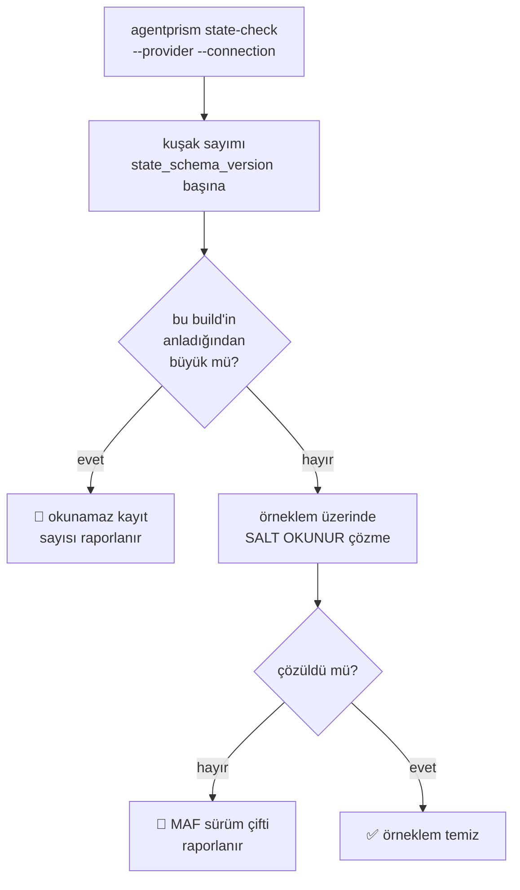

# Faz 156 — Durum Ön Kontrolü ve Upgrade Penceresi

> **Durum:** 📋 Planlandı (2026-09-07)
> **Kaynak:** [ADAYLAR.md](ADAYLAR.md) · **F-216** (doğrulamada **daraltıldı** — aşağıya bak)
> **Önkoşul:** Yok. [Faz 126](arsiv/fazlar/126-KALICI-PAYLOAD-SURUM-SOZLESMESI.md) bu fazın dayandığı sözleşmeyi kurdu; kapalıdır
> **Paketler:** `AgentPrism.Cli`, `AgentPrism.Core` (salt okunur ön kontrol mantığı)
> **Yeni paket:** Yok · **Migration:** Yok — bu faz **hiçbir şey yazmaz**
> **Public API:** Büyüyor — yeni CLI komutu ve onun okuduğu ön kontrol tipi. Faz 7'den önce ucuz
> **Tüketici yüzeyi:** `docs-site/src/content/docs/reference/versioning.md` (upgrade penceresi) · `docs-site/src/content/docs/guides/production.md` (başarısız restore prosedürü) · sevk edilen: `AgentPrism.Cli` README'si, `capabilities.md` satırı
> **Manuel test alanı:** [`docs/manuel-test/25-SAGLIK-TESHIS-OPENAPI.md`](manuel-test/25-SAGLIK-TESHIS-OPENAPI.md)

---

## Bu Faza Başlarken

> `faz-baslangic` skill'ini uygula. Aşağıdaki liste o skill'in 2. adımıdır —
> **tamamını değil, yalnız işaret edilen bölümleri oku.**

1. Bu doküman
2. Kararlar — dosyanın tamamını **okuma**, yalnız bu kalemleri grep'le:
   ```bash
   grep -n "K-649\|K-059" docs/KARARLAR.md
   ```
   **K-649** (kalıcı payload sürüm sözleşmesi: `state_schema_version` ve `state_maf_version`) ·
   **K-059** (`secret` dosyaya **ve veritabanına** yazılmaz — bu faz bağlantı dizesi işler)
3. [Faz 126](arsiv/fazlar/126-KALICI-PAYLOAD-SURUM-SOZLESMESI.md) — yalnız devir notu:
   ```bash
   awk '/## Sonraki Faza Devir Notu/,0' docs/arsiv/fazlar/126-KALICI-PAYLOAD-SURUM-SOZLESMESI.md
   ```
   🚨 **Bu faz o fazın üstüne biner.** Faz 126 corpus'u ve testi kurdu; bu faz onu operatörün **kendi verisine** taşır. Devir notunu okumadan başlama.
4. Alan hafızası (bu faz iki alana dokunuyor):
   [`hafiza/maf-oturum.md`](hafiza/maf-oturum.md) (oturum durumu ve envelope) ·
   [`hafiza/paketleme-ve-dagitim.md`](hafiza/paketleme-ve-dagitim.md) (CLI aracı sevkiyatı)
5. Fixture sözleşmesi — **okunmadan fixture'a dokunulmaz**:
   `tests/AgentPrism.Core.UnitTests/Fixtures/README.md`

---

## Amaç

Bugün "yükselttiğimde bekleyen oturumlarım okunabilir mi" sorusunun cevabı
**yalnız CI'da** vardır. Operatörün kendi veritabanına sorabileceği bir şey
yoktur; öğrenme yeri üretimdir. Bu faz o soruyu yükseltmeden **önce**
sorulabilir hâle getirir ve cevabın ne anlama geldiğini yazıya döker.

- **F-216** — salt okunur durum ön kontrolü (CLI), yazılı upgrade penceresi ve
  başarısız restore prosedürü.

### 🚨 Aday doğrulamada daraldı — ne DÜŞTÜ

F-216'nın merkezî iddiası *"önceki artifact'in ürettiği durum corpus'u test
ağacında yok"* idi. **Yanlış.** [Faz 126](arsiv/fazlar/126-KALICI-PAYLOAD-SURUM-SOZLESMESI.md)
bunu zaten yapmıştır ve 2026-09-07'de doğrulandı:

| Bugün **var** | Kanıt |
|---|---|
| Gerçek koşumdan yakalanmış oturum corpus'u | `tests/AgentPrism.Core.UnitTests/Fixtures/session-state-1.18.0.json` |
| Gerçek koşumdan yakalanmış checkpoint corpus'u | `tests/AgentPrism.Workflows.UnitTests/Fixtures/workflow-checkpoint-1.18.0.json` |
| Çapraz sürüm okuma kapısı | [`PersistedPayloadUpgradeTests.cs:24`](../tests/AgentPrism.Core.UnitTests/Sessions/PersistedPayloadUpgradeTests.cs#L24) — 1.18.0 fixture'ını **bugünkü 1.20.0** koduyla okur |
| Bilinmeyen kuşağın tanımlı hatası | Aynı dosya `:36` — gelecekteki `StateSchemaVersion` tanımlı hata verir, oturum **silinmez** |
| Fixture yenileme yasağı | `Fixtures/README.md` — "kırmızı olduğu için yenileme"; `nuget-danismani`'ye götür |

**Bu yüzden corpus yazma işi bu fazın kapsamında DEĞİLDİR.** Faz 126'nın
fixture'larına ve yenileme kuralına dokunulmaz.

### Bugün ne çalışmıyor — doğrulanmış kanıt

| Kanıt | Gözlem |
|---|---|
| `ls src/AgentPrism.Cli/Commands/` | Yalnız `Eval` · `Health` · `Migrate` · `MigrateStatus`. Durumu ön kontrol eden komut **yok** |
| `grep -rl "upgrade window" docs-site/` | **Sıfır sonuç** — desteklenen upgrade penceresi hiçbir tüketici sayfasında yazılı değil |
| [`production.md:387`](../docs-site/src/content/docs/guides/production.md) | Yalnız bir kontrol listesi satırı: "restore prosedürlerini tanımla". Başarısız restore için **adım yok** |
| [`AgentSessionManager.cs:42`](../src/AgentPrism.Core/Sessions/AgentSessionManager.cs#L42) · [`AgentPrismCheckpointStore.cs:39`](../src/AgentPrism.Workflows/Internal/AgentPrismCheckpointStore.cs#L39) | `CurrentStateSchemaVersion = 1` — ikisi de `internal const`; dışarıdan okunamaz |
| [`ISessionStore.cs:175`](../src/AgentPrism.Abstractions/Sessions/ISessionStore.cs#L175) | `QueryAsync(SessionQuery)` var — salt okunur sayım için yeterli |
| [`IWorkflowCheckpointStore.cs:64`](../src/AgentPrism.Abstractions/Workflows/IWorkflowCheckpointStore.cs#L64) | `ListAsync` var — checkpoint tarafı için aynı |
| [`MigrateCommand.cs:11`](../src/AgentPrism.Cli/Commands/MigrateCommand.cs#L11) | Doğrudan veritabanına bağlanan CLI deseni: `--provider` + `--connection` |

> Kanıtlar 2026-09-07 tarihinde doğrulandı.

---

## 156.1 — Salt okunur durum ön kontrolü

Yeni komut: `agentprism state-check`. `migrate` desenini izler (doğrudan
veritabanı, HTTP değil) — çünkü ön kontrol **yükseltmeden önce**, uygulama
ayakta değilken de koşabilmelidir.



🚨 **Üç sert kural.**

1. **Hiçbir şey yazmaz.** Ne oturum, ne checkpoint, ne migration tablosu.
   Kanıtı bir testtir, yorum değil (§*Hata Modları*).
2. **Örneklemdir, kanıt değildir.** Komut "örneklem temiz" der, "her kayıt
   okunabilir" **demez**. Çıktı bu ayrımı kelimeyle kurar; yoksa operatör
   yanlış güven kazanır.
3. **Bağlantı dizesi yazdırılmaz** (K-059). `MigrateCommand.cs:37`'nin emsali:
   sağlayıcı istisnası bağlantı dizesi taşımadığı için `ex.Message` güvenlidir;
   yeni kod bu varsayımı **kendi** hata yolları için tekrar doğrulamalıdır.

Örneklem büyüklüğü ve seçimi **Açık Soru 1**'dir.

## 156.2 — Kuşak numaralarının okunabilir olması

`CurrentStateSchemaVersion` bugün iki yerde `internal const`. Ön kontrol onu
okumak zorundadır. Seçenek **Açık Soru 2**'dir: sabiti public yapmak mı, yoksa
ön kontrolü `Core` içinde tutup CLI'a yalnız sonucu vermek mi.

Tercih edilen yön: **ikincisi**. Sabit bir uygulama ayrıntısıdır; public
yüzeye çıkarmak onu bir söz hâline getirir ve sonradan değiştirmeyi kırıcı
yapar. CLI, `Core`'un ürettiği bir rapor tipini okur.

## 156.3 — Yazılı upgrade penceresi

`reference/versioning.md`'ye yeni bir bölüm: **hangi sürümden hangisine
yükseltmek destekleniyor** ve bu sözün neye dayandığı. Bugün bu söz hiç
verilmemiştir; verilmediği için de tutulup tutulmadığı ölçülemez.

Bölüm üç şeyi söyler:

1. Desteklenen atlama aralığı (bir sürüm mü, N sürüm mü) — **Açık Soru 3**.
2. Sözün dayanağı: Faz 126'nın fixture'ları ve `PersistedPayloadUpgradeTests`.
   🚨 Söz **AgentPrism'in kendi envelope'u** içindir; MAF'ın kendi
   uyumluluğu AgentPrism'in vaadi değildir ve bu cümle sayfada durur.
3. Ön kontrolün nasıl koşulacağı ve çıktısının nasıl okunacağı.

## 156.4 — Başarısız restore prosedürü

`guides/production.md`'ye adım listesi: ön kontrol kırmızı döndüğünde ne
yapılır. Drain (mevcut `DrainTests`'in kanıtladığı davranış), eski runtime'ı
ne kadar tutmak gerektiği, ve kararın `nuget-danismani`'ye ne zaman gideceği.

🚨 Bu bölüm **eski runtime'ı süresiz tutma** beklentisi yaratmamalıdır. Pencere
yazılı olduğu için sınırlıdır; sınırın kendisi §156.3'te durur.

---

## Planlanan Public API

> Taslak imzalardır. Gerçekleşen imzalar kapanışta ayrı bir bölüme yazılır.

```csharp
// AgentPrism.Core — salt okunur ön kontrol sonucu
public sealed record StatePreflightReport
{
    public required IReadOnlyList<StateGenerationCount> Sessions { get; init; }
    public required IReadOnlyList<StateGenerationCount> Checkpoints { get; init; }
    public required int SampledCount { get; init; }
    public required int SampleFailureCount { get; init; }
    public required bool HasUnreadableGeneration { get; init; }
}

public sealed record StateGenerationCount
{
    public required int SchemaGeneration { get; init; }
    public required long RecordCount { get; init; }
    public required bool ReadableByThisBuild { get; init; }
}
```

### CLI yüzeyi

| Komut | Argümanlar | Ne yapar |
|---|---|---|
| `agentprism state-check` | `--provider` · `--connection` (veya `AGENTPRISM_CONNECTION`) · `--sample` · `--json` | Kuşakları sayar, örneklem üzerinde salt okunur çözme dener, rapor yazar |

Çıkış kodu: `0` temiz · `3` okunamaz kayıt veya örneklem hatası bulundu
(`EvalCommand`'ın regresyon için `3` kullanma emsali).

### HTTP `endpoint`'leri

Yeni uç **yok**. Ön kontrol uygulama ayakta değilken de koşmalıdır.

### Arayüz payı

Yok — bu faz arayüze dokunmuyor.

---

## Planlanan Dosya Listesi

```
src/AgentPrism.Core/Diagnostics/
├── StatePreflight.cs              (yeni — salt okunur sayım ve örneklem)
└── StatePreflightReport.cs        (yeni)

src/AgentPrism.Cli/Commands/
└── StateCheckCommand.cs           (yeni)

src/AgentPrism.Cli/
└── Program.cs                     (değişir — komut yönlendirmesi)

tests/AgentPrism.Sqlite.IntegrationTests/
└── StatePreflightTests.cs         (yeni — yazmadığını da kanıtlar)

tests/AgentPrism.Cli.FunctionalTests/
└── StateCheckCommandTests.cs      (yeni)
```

---

## Hata Modları ve Testler

> Mutlu yoldan değil, **ne bozulabilir**den türetilir. Seviyeyi plan seçer.

| Ne bozulabilir | Seviye | Test sınıfı |
|---|---|---|
| Ön kontrol **yazar** (satır günceller, migration koşar) | Fonksiyonel (depo sınırı) | `StatePreflightTests` — öncesi/sonrası tam tablo karşılaştırması |
| Okunamaz kuşak var ama komut `0` döner | Fonksiyonel | `StateCheckCommandTests` |
| Bağlantı dizesi hata çıktısına sızar (K-059) | Fonksiyonel | `StateCheckCommandTests` |
| Başka kiracının oturumu sayıma girer | Sözleşme (`TenantIsolationContract`) | dört koşumda birden |
| Örneklem "temiz" der, operatör "hepsi okunabilir" anlar | Manuel | kabul case 4 |
| Veritabanı erişilemez; komut yığın izi basar | Fonksiyonel | `StateCheckCommandTests` |
| Boş veritabanı; komut hata verir | Fonksiyonel | `StateCheckCommandTests` |
| Çok büyük tabloda tam tarama yapar ve üretimi yavaşlatır | Fonksiyonel | `StatePreflightTests` — sorgu sınırlı olmalı |

Beş soru: **iptal** — `Ctrl+C` yarıda kesince yazım olmadığı için durum
bozulmaz (test) · **eşzamanlılık** — canlı yazan uygulama varken okuma
(salt okunur, kilit almaz) · **boş/aşırı girdi** — boş veritabanı ve
`--sample 0` · **başka kiracı** — sözleşme testi · **alt sistem hatası** —
veritabanı erişilemez.

---

## Manuel Kabul Case'leri

| # | Ön koşul | Adımlar | Beklenen sonuç |
|---|---|---|---|
| 1 | Dolu bir veritabanı, güncel sürüm | `agentprism state-check --provider postgres --connection …` | Çıkış `0`; kuşak başına sayım listelenir |
| 2 | Bir oturum satırının `state_schema_version` değeri elle büyütülmüş | Aynı komut | Çıkış `3`; okunamaz kayıt sayısı raporlanır; satır **değişmemiştir** |
| 3 | Yanlış bağlantı dizesi | Aynı komut | Tek satırlık hata; bağlantı dizesi **yazdırılmaz**; yığın izi yok |
| 4 | Dolu veritabanı, `--sample 5` | Aynı komut | Çıktı "5 kayıt örneklendi" der; "tümü okunabilir" **demez** |
| 5 | Komut koşmadan ve koştuktan sonra tablo anlık görüntüsü | `state-check` koş, iki anlık görüntüyü karşılaştır | **Birebir aynı** — hiçbir satır değişmemiş |
| 6 | 👤 insan gerekir | `versioning.md` upgrade penceresi bölümünü oku | Desteklenen atlama aralığı, dayanağı ve MAF sınırı açıkça yazılı |

---

## Açık Sorular

| # | Soru | Seçenekler | Öneri |
|---|---|---|---|
| 1 | Örneklem nasıl seçilir? | A: En yeni N kayıt · B: Kuşak başına N kayıt · C: Rastgele N | **B** — risk kuşakta yoğunlaşır; en yeni kayıtlar zaten güncel kuşaktadır ve hiçbir şey kanıtlamaz |
| 2 | `CurrentStateSchemaVersion` public mi olsun? | A: Public sabit · B: `Core` içinde kalsın, CLI rapor tipini okusun | **B** — sabit uygulama ayrıntısıdır; public yapmak onu kırıcı bir söze çevirir |
| 3 | Desteklenen atlama aralığı ne olsun? | A: Yalnız bir önceki sürüm · B: Aynı ana sürüm içinde her sürüm | Yayın politikası kararı — **ilk yayın içeriği belirlenene kadar açık kalır**. Sayfa aralığı yazana kadar bölüm yayımlanmaz |
| 4 | Checkpoint tarafı ilk turda kapsam içinde mi? | A: Oturum + checkpoint birlikte · B: Yalnız oturum, checkpoint sonraya | **A** — ikisinin de envelope'u ve kuşak sabiti aynı desendedir; ayırmak ikinci bir tur maliyeti getirir |

---

## Bitiş Ölçütleri (DoD)

- [ ] `agentprism state-check` dolu bir veritabanında kuşak sayımı üretir; çıktı belgeye yazıldı
- [ ] Okunamaz kuşak varken çıkış kodu `3`, temizken `0`
- [ ] Komutun **hiçbir şey yazmadığı** öncesi/sonrası tablo karşılaştırmasıyla kanıtlandı
- [ ] Hata yolunda bağlantı dizesi yazdırılmıyor (K-059); `secret` taraması boş döndü
- [ ] `reference/versioning.md` upgrade penceresi bölümü yayımlandı; MAF sınırı açıkça yazılı
- [ ] `guides/production.md` başarısız restore prosedürü yayımlandı
- [ ] Faz 126'nın fixture'ları ve yenileme kuralı **değişmedi** (`git diff` ile doğrulandı)
- [ ] Dört doğrulama kapısı sıfır uyarı verir
- [ ] `samples/AgentPrism.Api` ile gerçek `run` yapıldı, çıktı belgeye yazıldı
- [ ] Manuel kabul case'leri `docs/manuel-test/25-SAGLIK-TESHIS-OPENAPI.md` içine eklendi; otomatikleştirilebilenler koşuldu
- [ ] `faz-denetim` koşuldu; 🔴 bulgu kalmadı
- [ ] `docs-site/` güncellendi; `npm run build` + `check-links.mjs` temiz

### Doğrulama komutları

```bash
# Temiz veritabanı
agentprism state-check --provider sqlite --connection "Data Source=./test.db" --json

# Hiçbir şey yazmadığının kanıtı
sqlite3 test.db "SELECT id, state_schema_version FROM sessions ORDER BY id" > before.txt
agentprism state-check --provider sqlite --connection "Data Source=./test.db"
sqlite3 test.db "SELECT id, state_schema_version FROM sessions ORDER BY id" > after.txt
diff before.txt after.txt   # boş olmalı
```

---

## Riskler

| Risk | Önlem |
|------|-------|
| Ön kontrol veriyi değiştirir | Salt okunur tasarım; kanıtı bir testtir (öncesi/sonrası karşılaştırma), yorum değil |
| Örneklem "temiz" der, operatör "hepsi okunabilir" anlar | Çıktı kelimesi bu ayrımı kurar; manuel kabul case 4 bunu doğrular |
| Büyük tabloda tam tarama üretimi yavaşlatır | Sayım toplulaştırılmış sorgudur; çözme yalnız örneklem üzerindedir |
| Upgrade penceresi tutulamayacak bir söz verir | Aralık, Faz 126'nın kanıtladığından geniş yazılmaz. Açık Soru 3 ilk yayın içeriğine bağlıdır |
| Yazılan pencere MAF'ın uyumluluğu sanılır | Sayfa AgentPrism envelope'u ile MAF sınırını ayrı cümlelerle söyler |
| Faz 126'nın fixture'ları yanlışlıkla yenilenir | DoD `git diff` ile bunu şart koşar; `Fixtures/README.md` okuma listesindedir |

---

<!-- ============================================================
     AŞAĞISI KAPANIŞTA DOLDURULUR — `faz-tamamlama` skill'i.
     Plan anında boş kalır. Başlıkları SİLME.
     ============================================================ -->

## Plandan Sapmalar

> Kapanışta doldurulur.

## Bu Fazda Verilen Kararlar

> Kapanışta doldurulur. K-NNN numaraları burada alınır; plan numara rezerve etmez.

## Gerçekleşen Public API

> Kapanışta doldurulur.

## Dosya Listesi (gerçekleşen)

> Kapanışta doldurulur.

## Denetim Bulguları

> Kapanışta doldurulur.

## Sonraki Faza Devir Notu

> Kapanışta doldurulur.
