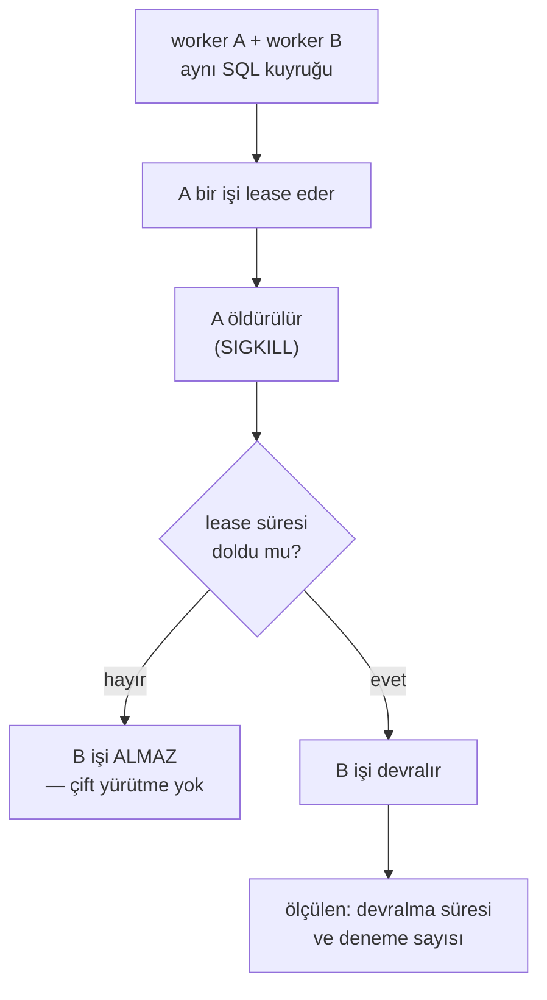

# Faz 157 — Sınırlı Yük ve İki Process Arıza Kanıtı

> **Durum:** 📋 Planlandı (2026-09-07)
> **Kaynak:** [ADAYLAR.md](ADAYLAR.md) · **F-217**
> **Önkoşul:** Yok. [Faz 116](arsiv/fazlar/116-PERFORMANS-TAHSIS-KAPISI.md) tahsis kapısını ve bench projesini kurdu; kapalıdır
> **Paketler:** Yok — bu faz **sevk edilen hiçbir pakete dokunmaz**. Yalnız `bench/` ve `tests/`
> **Yeni paket:** Yok · **Migration:** Yok
> **Public API:** Büyümüyor
> **Tüketici yüzeyi:** `docs-site/src/content/docs/guides/production.md` (arıza davranışı ve dağıtım örnekleri) · sevk edilen: Yok
> **Manuel test alanı:** [`docs/manuel-test/21-DAYANIKLILIK-VE-IPTAL.md`](manuel-test/21-DAYANIKLILIK-VE-IPTAL.md)

---

## Bu Faza Başlarken

> `faz-baslangic` skill'ini uygula. Aşağıdaki liste o skill'in 2. adımıdır —
> **tamamını değil, yalnız işaret edilen bölümleri oku.**

1. Bu doküman
2. Kararlar — dosyanın tamamını **okuma**, yalnız bu kalemleri grep'le:
   ```bash
   grep -n "K-354" docs/KARARLAR.md
   ```
   **K-354** (şema hazır olmadan SQL denemesi yapılmaz — arıza senaryolarında
   başlatma sırası bu kurala takılır)
3. [Faz 116](arsiv/fazlar/116-PERFORMANS-TAHSIS-KAPISI.md) — yalnız devir notu:
   ```bash
   awk '/## Sonraki Faza Devir Notu/,0' docs/arsiv/fazlar/116-PERFORMANS-TAHSIS-KAPISI.md
   ```
   Bench projesinin sözleşmesini ve **neden yalnız tahsisin kapı olduğunu**
   oradan devralıyorsun. Bu faz o kararı değiştirmez, üstüne ekler.
4. Alan hafızası (bu faz iki alana dokunuyor):
   [`hafiza/test-kosum-tuzaklari.md`](hafiza/test-kosum-tuzaklari.md) (kırılgan koşum ve yalıtım) ·
   [`hafiza/cekirdek-calistirma.md`](hafiza/cekirdek-calistirma.md) (lease, reconciliation, iptal)
5. Emsal kod — **yeniden yazma, oku**:
   `tests/AgentPrism.Package.Tests/Infrastructure/ProcessRunner.cs` (ayrı process başlatma)

---

## Amaç

Bugün ölçtüğümüz şey **tahsis**tir, işletim değil. "İki process çalışırken biri
ölürse ne olur" sorusunun koşulan bir cevabı yoktur. Bu faz o cevabı üretir —
ve bunu **çok node desteği vaat etmeden** yapar: amaç mevcut lease ve
reconciliation davranışının ne yaptığını kanıtlamaktır, yeni bir garanti
kurmak değil.

- **F-217** — mevcut bench üstüne sınırlı SQL yükü, iki process arıza senaryosu
  ve ayrı arıza manifestleri.

**Kapsam dışı:** Sıfırdan yük harness'i. Yeni kuyruk backend'i. SLO sayısı
vaat etmek. Tüm OS/veritabanı/sağlayıcı kombinasyonunu kapsamak.

### 🚨 Bu faz bir ürün sözü vermez

Kullanıcı kararı (2026-09-07): **çok node hedefi belirsizdir, tek process
varsayılır.** İki process senaryosu bu yüzden bir *destek beyanı* değil, bir
*ölçüm*dür. Çıktı "AgentPrism çok node destekler" cümlesini **kurmaz**;
"bir process ölünce lease şu sürede düşer ve iş şu şekilde devralınır" der.
SQLite'ın tek process tavsiyesi **korunur**.

### Bugün ne çalışmıyor — doğrulanmış kanıt

| Kanıt | Gözlem |
|---|---|
| `ls bench/AgentPrism.Benchmarks/*.cs` | Üç benchmark: `CompiledAgentCache` · `RunEventWriter` · `RunStoreQuery`. Yük senaryosu **yok** |
| [`RunEventWriterBenchmarks.cs:21`](../bench/AgentPrism.Benchmarks/RunEventWriterBenchmarks.cs#L21) | `new NoOpRunStore()` — ölçüm gerçek SQL'e **hiç dokunmuyor** |
| [`NoOpRunStore.cs:5`](../bench/AgentPrism.Benchmarks/NoOpRunStore.cs#L5) | Kendi dokümanı bunu açıkça söylüyor: "yazma maliyetinden ayırmak için" |
| [`Program.cs:19`](../bench/AgentPrism.Benchmarks/Program.cs#L19) | `scripts/kapi.py performans` yalnız `BytesAllocatedPerOperation` okuyor — kapı **tahsistir**, süre değil |
| `grep -rl "Kill\|Process.Start" tests/` | Yalnız `Package.Tests` (şablon koşumu). Ürün yolunda process öldüren test **yok** |
| `tests/AgentPrism.Package.Tests/Infrastructure/ProcessRunner.cs:27` | Ayrı process başlatma altyapısı **var** — yeniden yazılmaz, yeniden kullanılır |

> Kanıtlar 2026-09-07 tarihinde doğrulandı.

---

## 157.1 — Sınırlı SQL yükü

Mevcut bench `NoOpRunStore` ile tahsisi izole ediyor; bu doğru bir karardır ve
değişmez. Bu faz **ikinci** bir ölçüm ekler: gerçek bir SQLite/PostgreSQL
deposuna karşı sınırlı yük.

🚨 **Süre bir kapı değildir.** Faz 116'nın kararı korunur: paylaşılan CI
makinesinde süre gürültülüdür. Yük senaryosu bir **rapor** üretir, kırmızı/yeşil
değil. Kapıya dönüşmesi ayrı bir karardır ve bu fazda alınmaz.

Her koşum ortamını yazar: CPU · RAM · veritabanı sürümü · payload boyutu ·
eşzamanlılık · bağımlılık commit kimliği. 🚨 Dış model gecikmesi kontrol
düzlemi overhead'inden **ayrı** ölçülür; karıştırılırsa sayı hiçbir şey anlatmaz.

## 157.2 — İki process arıza senaryosu



Ölçülen üç şey: (1) lease düşene kadar geçen süre, (2) işin devralınıp
devralınmadığı, (3) **çift yürütmenin olmadığı**. Üçüncüsü en önemlisidir ve
`MaxAttempts = 1` varsayılanının anlamıdır.

`ProcessRunner` yeniden kullanılır. Yeni bir process altyapısı yazılmaz.

## 157.3 — Ayrı arıza manifestleri

Her arıza kendi manifestini alır; tek bir "chaos" testi yazılmaz. Manifest,
beklenen davranışın **yazılı** hâlidir — test onu doğrular, tanımlamaz.

| Arıza | Beklenen davranışın yazılacağı yer |
|---|---|
| Veritabanı erişilemez | Run ne olur, kuyruk ne olur, kayıt ne olur |
| Yavaş sink | Kayıt gecikmesi işlevi bozmaz (mevcut kural) |
| Sağlayıcı zaman aşımı | Fallback ve hata sınıflandırması |
| Retention hacmi | Büyük silmede kilit davranışı |
| Streaming fan-out | Çok abonede SSE davranışı |
| Rolling upgrade | Eski ve yeni process aynı anda ayakta |

🚨 **Rolling upgrade manifesti [Faz 156](156-DURUM-ON-KONTROLU-VE-UPGRADE-PENCERESI.md)
ile çakışır.** İkisi aynı soruyu iki ucundan sorar: 156 "yükseltmeden önce
veri okunabilir mi", 157 "yükseltme sırasında iki sürüm aynı anda ne yapar".
Sıra bağlayıcı değildir; ama 157 sonra koşarsa 156'nın penceresini girdi
olarak kullanabilir.

## 157.4 — Dağıtım örneklerinin bağlanması

`production.md`'deki API-only ve worker-only anlatısı bugün metindir. Bu faz
onu koşulan senaryoya bağlar: worker'ı olmayan bir API process'i ve API'si
olmayan bir worker process'i gerçekten ayağa kalkar ve beklenen davranışı
gösterir.

---

## Planlanan Public API

Büyümüyor. Bu faz sevk edilen hiçbir pakete dokunmaz.

### HTTP `endpoint`'leri

Yeni uç yok.

### Arayüz payı

Yok.

---

## Planlanan Dosya Listesi

```
bench/AgentPrism.Benchmarks/
└── SqlRunStoreLoadBenchmarks.cs        (yeni — gerçek depoya karşı sınırlı yük)

tests/AgentPrism.Sqlite.IntegrationTests/
├── TwoProcessLeaseTakeoverTests.cs     (yeni — kill ve devralma)
└── FailureManifests/
    ├── DatabaseUnavailableTests.cs
    ├── SlowSinkTests.cs
    └── RetentionVolumeTests.cs

tests/Shared/Infrastructure/
└── WorkerProcessHost.cs                (yeni — ProcessRunner üstüne worker başlatma)

docs-site/src/content/docs/guides/
└── production.md                       (değişir — arıza davranışı ve dağıtım)
```

> 🚨 `ProcessRunner` **taşınmaz veya kopyalanmaz**. `WorkerProcessHost` onu
> kullanır; ikinci bir kopya bu repo'nun beş kez ödediği senkronizasyon
> kopyası sınıfıdır.

---

## Hata Modları ve Testler

> Bu fazın kendisi test yazar. Tablo, **testlerin kendi** hata modlarıdır —
> yani yanlış yazılmış bir arıza testinin nasıl yanlış güven üreteceği.

| Ne bozulabilir | Seviye | Test sınıfı |
|---|---|---|
| Process öldürülür ama iş **iki kez** yürütülür | Fonksiyonel (process sınırı) | `TwoProcessLeaseTakeoverTests` |
| Lease süresi dolmadan ikinci worker işi alır | Fonksiyonel | `TwoProcessLeaseTakeoverTests` |
| Test kırılgan olur; CI'da rastgele düşer | Koşum disiplini | zaman aşımları mutlak süre değil **koşul** bekler |
| Öldürülen process artık dosya/port bırakır, sonraki test düşer | Koşum disiplini | `WorkerProcessHost` dispose'da temizler |
| Veritabanı erişilemezken run sessizce başarılı görünür | Fonksiyonel | `DatabaseUnavailableTests` |
| Yük ölçümü dış model gecikmesini kontrol düzlemi sanır | Ölçüm tasarımı | benchmark sahte sağlayıcı kullanır |
| Rolling upgrade senaryosu iki sürümü aynı şema üstünde koşturur ve veriyi bozar | Fonksiyonel | `FailureManifests` — senaryo salt okunur doğrulama ile biter |

Beş soru: **iptal** — öldürülen process'in yarım işi · **eşzamanlılık** — iki
worker aynı lease · **boş/aşırı girdi** — boş kuyruk ve çok büyük payload ·
**başka kiracı** — devralma kiracı sınırını geçmemeli · **alt sistem hatası** —
veritabanı erişilemez.

---

## Manuel Kabul Case'leri

| # | Ön koşul | Adımlar | Beklenen sonuç |
|---|---|---|---|
| 1 | İki worker, paylaşılan SQL kuyruğu, uzun süren bir iş | A'yı `SIGKILL` ile öldür | Lease süresi dolana kadar B işi **almaz**; sonra devralır; iş **bir kez** yürütülür |
| 2 | Aynı kurulum | Lease süresi dolmadan ölç | B'nin işi almadığı gözlenir |
| 3 | Veritabanı durdurulmuş | Bir run başlat | Run tanımlı hata verir; sessizce başarılı **görünmez** |
| 4 | API-only process (`RunWorker=false`) | Bir queued run gönder | Run `Queued` kalır; kuyruk ilerlemez — bu **beklenen** davranıştır |
| 5 | Worker-only process | Aynı kuyruk | İş tüketilir |
| 6 | 👤 insan gerekir | Yük raporunu oku | Ortam bilgisi (CPU/RAM/DB/eşzamanlılık/commit) raporda yazılı |

---

## Açık Sorular

| # | Soru | Seçenekler | Öneri |
|---|---|---|---|
| 1 | İki process testi hangi sağlayıcıda koşar? | A: Yalnız SQLite (ucuz, ama tek process tavsiyeli) · B: PostgreSQL (Docker, gerçek) | **B** — SQLite'ın tek process tavsiyesi bu senaryoyu anlamsız kılar; lease yarışı gerçek bir sunucuda ölçülmelidir |
| 2 | Yük ölçümü CI'da koşar mı? | A: Her PR · B: Yalnız elle/nightly | **B** — Faz 116'nın gürültü dersi geçerli; yük raporu kapı değildir, her PR'da koşmak maliyetlidir |
| 3 | Rolling upgrade manifesti bu fazda mı? | A: Evet · B: Faz 156 kapandıktan sonra | Faz sırasına bağlı; 156 önce koşarsa **A**, sonra koşarsa manifest yalnız iskelet olarak yazılır |
| 4 | Yük senaryosu bench projesinde mi, test projesinde mi? | A: `bench/` (BenchmarkDotNet) · B: `tests/` (düz koşum) | **B** — BenchmarkDotNet tahsis için doğru araçtır; yük senaryosu uzun süren ve dış kaynak isteyen bir koşumdur ve bench'in istatistik modeline uymaz |

---

## Bitiş Ölçütleri (DoD)

- [ ] İki process senaryosunda öldürülen worker'ın işi **bir kez** yürütülür; çıktı belgeye yazıldı
- [ ] Lease süresi dolmadan devralma **olmadığı** ölçüldü
- [ ] Altı arıza manifestinin her biri için beklenen davranış **yazıldı** ve testi koşuldu
- [ ] Yük raporu ortam bilgisiyle (CPU/RAM/DB/payload/eşzamanlılık/commit) üretildi
- [ ] Dış model gecikmesi kontrol düzlemi overhead'inden ayrı raporlandı
- [ ] `ProcessRunner` kopyalanmadı; `WorkerProcessHost` onu kullanıyor
- [ ] Faz 116'nın tahsis kapısı **değişmedi**; süre kapıya dönüşmedi
- [ ] Dört doğrulama kapısı sıfır uyarı verir
- [ ] `samples/AgentPrism.Api` ile gerçek `run` yapıldı, çıktı belgeye yazıldı
- [ ] `secret` taraması boş döndü
- [ ] Manuel kabul case'leri `docs/manuel-test/21-DAYANIKLILIK-VE-IPTAL.md` içine eklendi; otomatikleştirilebilenler koşuldu
- [ ] `faz-denetim` koşuldu; 🔴 bulgu kalmadı
- [ ] `docs-site/guides/production.md` güncellendi; `npm run build` + `check-links.mjs` temiz
- [ ] 🚨 Hiçbir yerde "çok node destekleniyor" cümlesi kurulmadı; SQLite tek process tavsiyesi korundu

### Doğrulama komutları

```bash
# İki process devralma senaryosu
dotnet test tests/AgentPrism.PostgreSql.IntegrationTests -c Release \
  -- --filter-class "*TwoProcessLeaseTakeoverTests*"

# Tahsis kapısı hâlâ yerinde
python3 scripts/kapi.py performans
```

---

## Riskler

| Risk | Önlem |
|------|-------|
| Arıza testleri kırılgan olur ve CI'ı gürültüye boğar | Zaman aşımları mutlak süre değil **koşul** bekler; yük koşumu CI kapısı değildir (Açık Soru 2) |
| Sentetik TPS sayısı pazarlama gibi okunur | Rapor ortamı ve sınırlarını yazar; SLO **vaat edilmez** |
| İki process senaryosu "çok node desteği" diye anlaşılır | DoD bunu açıkça yasaklar; `production.md` metni ölçüm ile vaat arasındaki farkı kurar |
| Öldürülen process CI ajanında artık bırakır | `WorkerProcessHost` dispose'da temizler; testi yalıtım kuralına bağla |
| Faz 116'nın kararı sessizce gevşer (süre kapıya döner) | DoD tahsis kapısının değişmediğini şart koşar |

---

<!-- ============================================================
     AŞAĞISI KAPANIŞTA DOLDURULUR — `faz-tamamlama` skill'i.
     Plan anında boş kalır. Başlıkları SİLME.
     ============================================================ -->

## Plandan Sapmalar

> Kapanışta doldurulur.

## Bu Fazda Verilen Kararlar

> Kapanışta doldurulur. K-NNN numaraları burada alınır; plan numara rezerve etmez.

## Gerçekleşen Public API

> Kapanışta doldurulur.

## Dosya Listesi (gerçekleşen)

> Kapanışta doldurulur.

## Denetim Bulguları

> Kapanışta doldurulur.

## Sonraki Faza Devir Notu

> Kapanışta doldurulur.
