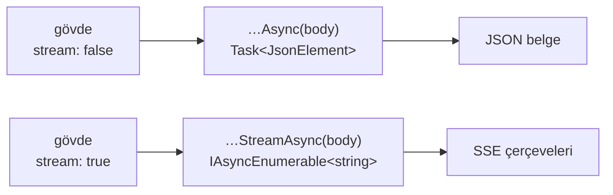

# Faz 159 — Tipli İstemcide Akışlı OpenAI Çağrısı

> **Durum:** 📋 Planlandı (2026-09-08)
> **Kaynak:** [ADAYLAR.md](ADAYLAR.md) · **F-198**
> **Önkoşul:** Yok — ama 🚨 **gövde bildirimi kusuru bu plandan ÖNCE kapandı** (2026-09-08, `DeclaredRequestBodyTests`). Plan o düzeltilmiş imzanın üstüne yazılmıştır
> **Paketler:** `AgentPrism.Client` (üretilen) · `@agentprism/client` (üretilen)
> **Yeni paket:** Yok · **Migration:** Yok
> **Public API:** Büyüyor — iki yeni üretilmiş metot. Yayımlanmamış olduğu için bugün ucuz
> **Tüketici yüzeyi:** `docs-site/src/content/docs/guides/openai-api.md` · `guides/typescript-client.md` · sevk edilen: `AgentPrism.Client` README'si
> **Manuel test alanı:** [`docs/manuel-test/34-ISTEMCI-VE-CLI.md`](manuel-test/34-ISTEMCI-VE-CLI.md)

---

## Bu Faza Başlarken

> `faz-baslangic` skill'ini uygula. **Tamamını değil, yalnız işaret edilen bölümleri oku.**

1. Bu doküman
2. Kararlar:
   ```bash
   grep -n "K-566\|K-633\|K-702" docs/KARARLAR.md
   ```
   **K-566** (`AgentPrism.Client` public API takibinin DIŞINDADIR — yüzey belgeden türetilir) ·
   **K-633** (NSwag'in gölgeleyen POCO ürettiği tipler; `COLLIDING_ANY_TYPES`) ·
   **K-702** (üretilen istemcinin koleksiyon başlangıç değeri kusuru)
3. Alan hafızası — 🚨 **ikisi de bu fazın tam merkezindedir**:
   [`hafiza/nswag-istemci-uretimi.md`](hafiza/nswag-istemci-uretimi.md) —
   **postprocess script'i IDEMPOTENT DEĞİLDİR**; yeni geçiş eklerken tam yeniden üretim yapılır ·
   [`hafiza/aspnetcore-json.md`](hafiza/aspnetcore-json.md) — `requestBody` tuzağı ve yeni kapısı
4. Emsal geçiş — yeniden yazma, oku:
   `scripts/nswag-postprocess-client.py` **dördüncü geçiş** (`SSE_STRING_RESPONSE_PATTERN`);
   beş saf-SSE ucunu düzeltir ve **bu iki ucu neden atladığını** kendi docstring'inde yazar

---

## Amaç

`/v1/responses` ve `/v1/chat/completions` 200 yanıtı için **iki içerik tipi**
ilan eder — `application/json` ve `text/event-stream` — ve hangisinin döneceğini
istek gövdesindeki `stream` bayrağı çalışma anında seçer. Üretilen tipli istemci
yalnız JSON şeklini bilir. `stream: true` gönderen bir çağıran SSE gövdesini JSON
çözücüye vermiş olur.

- **F-198** — bu iki uç için akışlı şekli tipli istemciden çağrılabilir kılmak.

### Bugün ne çalışmıyor — doğrulanmış kanıt

| Kanıt | Gözlem |
|---|---|
| `docs/openapi/agentprism.json` | Her iki operasyonun 200 yanıtı: `['application/json', 'text/event-stream']` |
| [`AgentPrismApiClient.g.cs:13760`](../src/AgentPrism.Client/Generated/AgentPrismApiClient.g.cs) | `AgentPrismOpenAIResponsesAsync(JsonElement body, …)` → `Task<JsonElement>` — yalnız JSON |
| Aynı dosya `:13880` | `AgentPrismOpenAIChatCompletionsAsync(JsonElement body, …)` → `Task<ChatCompletion>` — yalnız JSON |
| [`nswag-postprocess-client.py:76`](../scripts/nswag-postprocess-client.py) | Dördüncü geçiş beş saf-SSE ucunu düzeltiyor ve bu ikisini **bilerek** atlıyor: onlar `string` kök tipi üretmediği için eşleşen desen hiç oluşmuyor |
| Kök kısıt | NSwag **çalışma anında koşullu dönüş tipi** ifade edemez |

> Kanıtlar 2026-09-08 tarihinde doğrulandı. Gövde parametresi (`JsonElement body`)
> aynı gün kapatılan ayrı bir kusurdan gelir; ondan önce metotlar gövde bile almıyordu.

---

## 159.1 — İki metot, çalışma anı dallanması değil

**Kullanıcı kararı (2026-09-08):** JSON için mevcut metot kalır, SSE için ikinci
bir metot üretilir.



**Neden bu.** Seçim **derleme anında** olur ve yanlış kullanım orada yakalanır.
Tek metotlu çalışma anı dallanması, dönüş tipini birleşik bir sarmalayıcıya
çevirir; çağıran her kullanımda hangi şekli aldığını kontrol etmek zorunda kalır
ve hata çalışma anına kayar.

🚨 **Metot seçimi ile gövdedeki `stream` bayrağı tutarsız olabilir.** Çağıran
`stream: false` gövdesiyle `…StreamAsync`'i çağırırsa sunucu JSON döner ve
akış çözücüsü boş kalır. Bu davranışın ne olacağı **Açık Soru 2**'dir.

## 159.2 — Postprocess'e beşinci değil, ALTINCI geçiş

Dördüncü geçiş saf-SSE uçlarını düzeltiyor, beşinci geçiş koleksiyon başlangıç
değerlerini. Bu faz **yeni bir geçiş** ekler: dual JSON/SSE operasyonu için
ikinci bir metot üretmek.

🚨 **Postprocess script'i idempotent DEĞİLDİR** (`hafiza/nswag-istemci-uretimi.md`).
Yeni geçiş eklenirken doğru yol **tam yeniden üretimdir**: `dotnet tool restore`
→ `nswag-prepare-document.py` → `dotnet nswag run nswag.json` →
`nswag-postprocess-client.py` → `generate-client-json-context.py`. Belge
değişmediyse çıktı yalnız yeni geçişin deltası kadar farklı olmalıdır ve bu
`diff` ile **doğrulanır**.

## 159.3 — TypeScript tarafı ayrı bir sorudur

`@agentprism/client` `openapi-fetch` üzerinedir ve şekli farklıdır: yanıt
`Response` nesnesi olarak geri verilebilir, dolayısıyla akış zaten okunabilir
olabilir. Bunun bugün mümkün olup olmadığı **ölçülmedi** — **Açık Soru 3**.
İki istemcinin aynı çözümü almak zorunda olmadığı baştan kabul edilir.

---

## Planlanan Public API

> Taslak imzalardır. Gerçekleşen imzalar kapanışta ayrı bölüme yazılır.

```csharp
// AgentPrism.Client — ÜRETİLEN, elle yazılmaz; postprocess geçişi üretir
public virtual Task<JsonElement> AgentPrismOpenAIResponsesAsync(
    JsonElement body, CancellationToken cancellationToken = default);

public virtual IAsyncEnumerable<string> AgentPrismOpenAIResponsesStreamAsync(
    JsonElement body, CancellationToken cancellationToken = default);
```

> 🚨 Akış elemanının tipi (`string` ham çerçeve mi, ayrıştırılmış bir olay mı)
> **Açık Soru 1**'dir. Beş saf-SSE ucunun bugünkü şekli emsaldir; ondan sapmak
> ailede iki farklı akış sözleşmesi yaratır.

### HTTP `endpoint`'leri

Yeni uç **yok**. Sunucu değişmiyor; bu faz yalnız üretilen istemciyi düzeltir.

### Arayüz payı

Yok.

---

## Planlanan Dosya Listesi

```
scripts/
├── nswag-postprocess-client.py          (değişir — altıncı geçiş)
└── nswag_postprocess_client_test.py     (değişir)

src/AgentPrism.Client/Generated/
├── AgentPrismApiClient.g.cs             (ÜRETİLİR — elle düzenlenmez)
└── AgentPrismClientJsonContext.g.cs     (ÜRETİLİR)

tests/AgentPrism.AspNetCore.FunctionalTests/
└── GeneratedClientSseTests.cs           (değişir — dual uçlar eklenir)

packages/agentprism-client/
└── (Açık Soru 3'ün sonucuna göre)
```

---

## Hata Modları ve Testler

| Ne bozulabilir | Seviye | Test sınıfı |
|---|---|---|
| Akışlı metot gerçek sunucuya karşı çağrılınca ilk çerçevede çöker | Fonksiyonel (gerçek sunucu) | `GeneratedClientSseTests` |
| `stream: false` gövdesiyle `…StreamAsync` çağrılır | Fonksiyonel | `GeneratedClientSseTests` |
| `stream: true` gövdesiyle JSON metodu çağrılır — bugünkü sessiz çökme | Fonksiyonel | `GeneratedClientSseTests` |
| Postprocess geçişi idempotent olmadığı için ikinci koşumda bozar | Birim | `nswag_postprocess_client_test.py` |
| Yeni geçiş, dördüncü geçişin beş ucunu da yakalar ve iki kez işler | Birim | geçiş yalnız **dual** operasyonu eşlemeli |
| Üretilen istemci elle düzenlenir ve sonraki üretimde kaybolur | Koşum disiplini | tam yeniden üretim + `diff` doğrulaması |
| İptal token'ı akış ortasında dinlenmez | Fonksiyonel | `GeneratedClientSseTests` |

Beş soru: **iptal** — akış ortasında `CancellationToken` · **eşzamanlılık** — iki
akış aynı `HttpClient` üzerinde · **boş/aşırı girdi** — sıfır çerçeveli akış ve
çok büyük gövde · **başka kiracı** — kapsam dışı (istemci tarafı) · **alt sistem
hatası** — sunucu akış ortasında bağlantıyı keser.

---

## Manuel Kabul Case'leri

| # | Ön koşul | Adımlar | Beklenen sonuç |
|---|---|---|---|
| 1 | Örnek uygulama ayakta | `…StreamAsync` ile `stream: true` gövdesi gönder | Çerçeveler sırayla gelir; çökme yok |
| 2 | Aynı | `…Async` ile `stream: false` gövdesi gönder | JSON belge döner (bugünkü davranış korunur) |
| 3 | Aynı | `…Async` ile `stream: true` gövdesi gönder | Açık Soru 2'nin kararına göre: ya tanımlı hata ya belgelenmiş davranış — **sessiz çökme değil** |
| 4 | Akış ortasında | Token iptal et | Akış durur; kaynak sızmaz |

---

## Açık Sorular

| # | Soru | Seçenekler | Öneri |
|---|---|---|---|
| 1 | Akış elemanının tipi? | A: `string` ham çerçeve (beş saf-SSE ucunun emsali) · B: ayrıştırılmış olay tipi | **A** — ailede tek akış sözleşmesi kalır; ayrıştırma tüketicinin işidir ve OpenAI şeması bizim değildir |
| 2 | Metot ile `stream` bayrağı tutarsızsa? | A: İstemci gövdeyi düzeltir · B: Olduğu gibi gönderir, sunucunun cevabı ne ise o · C: Derleme öncesi doğrulama yok, çalışma anında tanımlı hata | **B** — istemcinin çağıranın gövdesini sessizce değiştirmesi daha kötü bir sürprizdir; davranış belgelenir |
| 3 | TypeScript istemcisi de değişecek mi? | A: Evet, simetrik · B: Hayır, `openapi-fetch` zaten `Response` verebiliyor · C: Ölç, sonra karar ver | **C** — ölçülmeden karar verilmez; ölçüm bu fazın ilk işidir |

---

## Bitiş Ölçütleri (DoD)

- [ ] `…StreamAsync` gerçek sunucuya karşı `stream: true` gövdesiyle çerçeve üretir; çıktı belgeye yazıldı
- [ ] `…Async` ile `stream: false` bugünkü davranışı **birebir** korur
- [ ] `stream: true` + JSON metodu birleşimi sessizce çökmüyor; davranış belgelendi
- [ ] Postprocess tam yeniden üretimle koşuldu ve delta `diff` ile doğrulandı — yalnız yeni geçişin farkı
- [ ] TypeScript istemcisi için ölçüm yapıldı ve Açık Soru 3 karara bağlandı
- [ ] Dört doğrulama kapısı sıfır uyarı verir
- [ ] `samples/AgentPrism.Api` ile gerçek `run` yapıldı, çıktı belgeye yazıldı
- [ ] `secret` taraması boş döndü
- [ ] Manuel kabul case'leri `docs/manuel-test/34-ISTEMCI-VE-CLI.md` içine eklendi ve **`00-INDEKS.md` sayımı güncellendi**
- [ ] `faz-denetim` koşuldu; 🔴 bulgu kalmadı
- [ ] `docs-site/` güncellendi (`guides/openai-api.md` akış bölümü); `npm run build` + `check-links.mjs` temiz

### Doğrulama komutları

```bash
# Tam yeniden üretim ve delta doğrulaması
python3 scripts/nswag-prepare-document.py docs/openapi/agentprism.json artifacts/openapi/agentprism.client-input.json
dotnet nswag run nswag.json
python3 scripts/nswag-postprocess-client.py src/AgentPrism.Client/Generated/AgentPrismApiClient.g.cs
git diff --stat src/AgentPrism.Client/Generated/
```

---

## Riskler

| Risk | Önlem |
|------|-------|
| Postprocess idempotent değil; ikinci koşum bozar | Tam yeniden üretim zorunlu; DoD `diff` doğrulamasını şart koşar |
| Yeni geçiş dördüncü geçişin uçlarını da yakalar | Desen yalnız **dual** içerik tipli operasyonu eşlemeli; birim testi bunu sabitler |
| Üretilen dosya elle düzenlenir | Dosya `Generated/` altındadır; düzeltme **script'te** yapılır |
| İki istemci farklı çözüm alır ve sözleşme ayrışır | Açık Soru 3 ölçümle kapanır; ayrışma **kararla** olur, kazayla değil |
| Yüzey büyür (iki yeni metot) ve yayın sonrası kırıcı olur | Bugün yayımlanmamış; K-566 gereği bu istemci public API takibinin dışındadır |

---

<!-- ============================================================
     AŞAĞISI KAPANIŞTA DOLDURULUR — `faz-tamamlama` skill'i.
     ============================================================ -->

## Plandan Sapmalar

> Kapanışta doldurulur.

## Bu Fazda Verilen Kararlar

> Kapanışta doldurulur. K-NNN numaraları burada alınır; plan numara rezerve etmez.

## Gerçekleşen Public API

> Kapanışta doldurulur.

## Dosya Listesi (gerçekleşen)

> Kapanışta doldurulur.

## Denetim Bulguları

> Kapanışta doldurulur.

## Sonraki Faza Devir Notu

> Kapanışta doldurulur.
