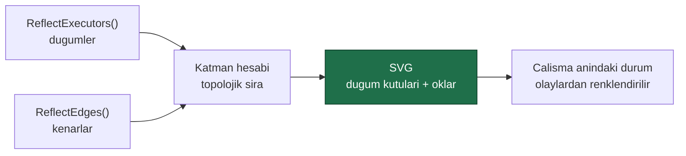
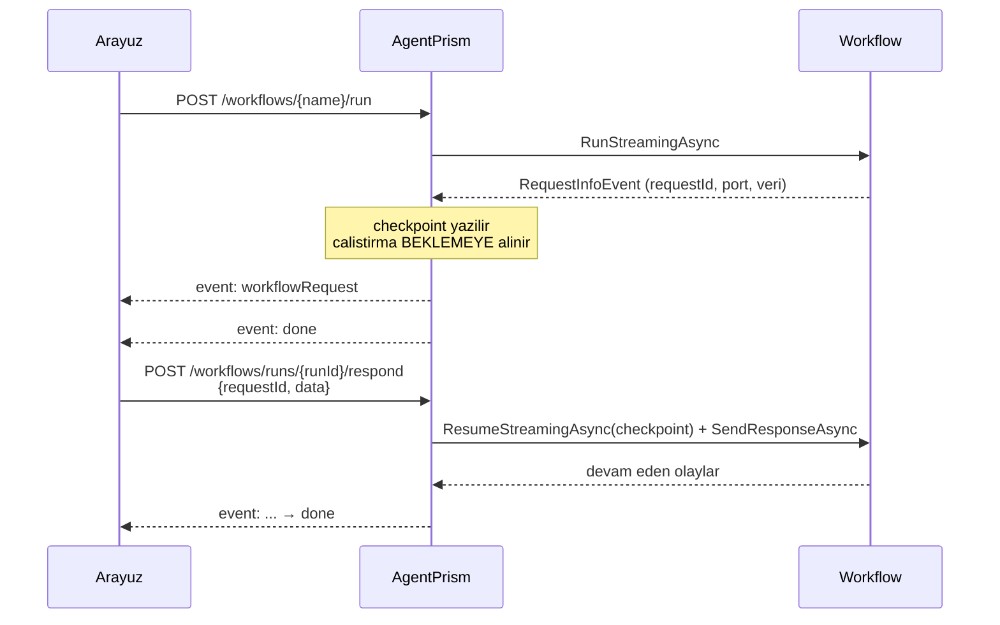

# Faz 16 — Workflows: Graf, Arayüz ve Human-in-the-Loop

> **Durum:** 📋 Planlandı
> **Kaynak:** [BEYIN-FIRTINASI.md](BEYIN-FIRTINASI.md) · **F-27** (2/2)
> **Önkoşul:** [Faz 15](15-WORKFLOWS-YURUTME.md) — zorunlu
> **Paketler:** `AgentPrism.Workflows`, `.AspNetCore`, `.UI`
> **Yeni paket:** Yok (bildirimsel tanım seçilirse `Microsoft.Agents.AI.Workflows.Declarative` bağımlılığı gelir) · **Migration:** Yok

---

## Bu Faza Başlarken

1. [`15-WORKFLOWS-YURUTME.md`](15-WORKFLOWS-YURUTME.md) — yürütme, kalıcılık, olay eşlemesi
2. [`05-AGENTPRISM-UI.md`](05-AGENTPRISM-UI.md) — arayüz mimarisi, bundle bütçesi
3. [`KARARLAR.md`](KARARLAR.md) — **K-045** (yönlendirme elle yazıldı), **K-002** (bundle bütçesi), **K-012** (K2)
4. Bu doküman

---

## Amaç

Faz 15 workflow'ları çalıştırır ama kullanıcı ne olduğunu **göremez**. Bu faz üç
şey ekler:

1. **Graf görselleştirme** — hangi düğüm hangi düğüme bağlı
2. **Human-in-the-loop** — workflow bir insandan girdi isteyebilsin
3. **Bildirimsel tanım** — `Microsoft.Agents.AI.Workflows.Declarative`
   değerlendirmesi (karar bu fazda verilir)

---

## 16.1 — Graf Görselleştirme

### Doğrulanmış API

```csharp
static class WorkflowVisualizer {
    static string ToMermaidString(Workflow workflow);
    static string ToDotString(Workflow workflow);
}

Dictionary<string, HashSet<EdgeInfo>> Workflow.ReflectEdges();
Dictionary<string, ExecutorBinding>   Workflow.ReflectExecutors();
Dictionary<string, RequestPortInfo>   Workflow.ReflectPorts();
```

MAF bize hazır Mermaid metni veriyor. Ama tarayıcıda Mermaid **render etmek**
bir kütüphane ister ve ölçüsü bellidir: mermaid.js minimum ~100 KB gzip'in
üzerindedir. Bundle bütçesi 250 KB, bugün kullanılan 92,4 KB. Tek bir ekran için
bütçenin %40'ını harcamak yanlış olur.

**Karar:** graf **elle SVG** olarak çizilir.

| Yol | Bundle | Sonuç |
|-----|--------|-------|
| mermaid.js | ~+100 KB gzip | Reddedilir |
| Elle SVG (waterfall deseni) | ~+5 KB gzip | **Seçilen** |

Faz 6'nın `waterfall.tsx` bileşeni bunun kanıtıdır: hiyerarşik bir görselleştirme
5 KB'de yazıldı. Workflow grafı katmanlı bir DAG'dır ve düzeni basittir:



- Düğüm rengi çalıştırma durumunu gösterir: bekliyor / çalışıyor / bitti / hata
- `ExecutorInvokedEvent` ve `ExecutorCompletedEvent` canlı akıştan gelir
- **"Mermaid metnini kopyala" düğmesi** eklenir: `ToMermaidString` çıktısı panoya
  kopyalanır. Kullanıcı dilerse dış bir araçta açar. Proje kuralı dokümanlarda
  Mermaid ister; bu düğme workflow'u doğrudan dokümana yapıştırılabilir yapar

Yeni uç: `GET {prefix}/api/workflows/{name}/graph` →
`{ "mermaid": "...", "nodes": [...], "edges": [...] }`

---

## 16.2 — Human-in-the-Loop

### Doğrulanmış API

```csharp
sealed record RequestPort(string Id, Type Request, Type Response) {
    static RequestPort<TRequest, TResponse> Create<TRequest, TResponse>(string id);
}
sealed record ExternalRequest(RequestPortInfo PortInfo, string RequestId, PortableValue Data) {
    ExternalResponse CreateResponse<T>(T data);
    bool TryGetDataAs<TValue>(out TValue value);
}
sealed record ExternalResponse(RequestPortInfo PortInfo, string RequestId, PortableValue Data);

StreamingRun.WatchStreamAsync(bool blockOnPendingRequest, CancellationToken ct);
StreamingRun.SendResponseAsync(ExternalResponse response);
Run.ResumeAsync(IEnumerable<ExternalResponse> responses, CancellationToken ct);
RequestInfoEvent    // akista bekleyen istek boyle gorunur
```

### Akış — Faz 6'nın onay akışıyla aynı desen



**Neden akış askıya alınmıyor:** Faz 6'da ölçüldü ve karar verildi (sapma S4).
Onay akışında çalıştırma **biter**, karar bir sonraki turun girdisidir. Aynı
model burada da doğrudur: bir HTTP isteğini insanın cevabı gelene kadar açık
tutmak, sunucu kaynağını insan hızında tüketir.

Checkpoint bu yüzden **zorunludur** — bekleyen bir istek varsa çalıştırma
durumu diske yazılmalıdır (Faz 15'in `workflow_checkpoints` tablosu).

### Yeni uçlar

| Uç | Rol | Ne yapar |
|----|-----|----------|
| `GET {prefix}/api/workflows/runs/{runId}/requests` | Reader | Bekleyen istekler |
| `POST {prefix}/api/workflows/runs/{runId}/respond` | Operator | Cevap verir ve sürdürür |

### Arayüz

- Run detay ekranında bekleyen istek **kartı** — Faz 6'nın onay kartı bileşeni
  yeniden kullanılır, yeni bileşen yazılmaz
- Cevap alanı `RequestPort`'un tipine göre: metin, seçim veya evet/hayır
- Bekleyen isteği olan çalıştırma Runs listesinde ayrı bir durumla görünür
  (`AwaitingInput`)

> `RunStatus` enum'una yeni değer eklemek gerekir. Değerler `smallint` olarak
> saklanıyor ve **mevcut değerler değişmez**; yeni değer sona eklenir.

---

## 16.3 — Bildirimsel Workflow Tanımı (karar bu fazda)

`Microsoft.Agents.AI.Workflows.Declarative` NuGet'te **vardır**.

🚨 **Sürüm uyuşmazlığı riski:** arama sonucunda görülen en yüksek sürüm serisi
`1.13.x`, çekirdek MAF ise `1.16.0`. İlk iş bunu doğrulamaktır:

```bash
dotnet package search "Microsoft.Agents.AI.Workflows.Declarative" --exact-match --format json
```

1.16.0 sürümü yoksa paket **alınmaz**: farklı sürümlü iki MAF paketi bir arada
kullanmak, K-008'in izole etmeye çalıştığı sorunun ta kendisidir.

### K2 açısından

Bildirimsel workflow bir YAML/JSON dosyasıdır. İçinde ifade ve koşul çalıştıran
alanlar varsa bu, **arayüzden yüklenebilecek bir yorumlanan dil** demektir ve K2
tartışmasını yeniden açar.

| Kullanım | K2 durumu |
|----------|-----------|
| Bildirimsel dosya **kodda** yüklenir (`AddDeclarativeWorkflow(path)`) | Sorun yok — dağıtımla gelir |
| Bildirimsel dosya **arayüzden** yüklenir | Yeni bir karar ister; Faz 11'in tartışmasına benzer |

**Öneri:** bu fazda yalnız **kodda yükleme** desteklenir. Arayüzden yükleme
istenirse Faz 11'in izin/denetim deseni uygulanarak ayrı ele alınır.

---

## 16.4 — Faz 15'ten Devreden Desenler

Faz 15 üç desenle başlamıştı (Sequential, Concurrent, Handoff). Bu fazda
`GroupChat` ve `Magentic` eklenir:

- İkisi de bir **yönetici agent** ister (`WorkflowDefinition.ManagerAgentName`)
- `MagenticWorkflowBuilder` ayrıca plan gözden geçirme isteyebilir
  (`MagenticPlanReviewRequest` / `MagenticPlanReviewResponse`) — bu, 16.2'nin
  human-in-the-loop akışının doğrudan kullanıcısıdır
- Maliyet uyarısı: yönetici agent her turda çalışır. Arayüz tanım ekranında
  bunu **açıkça** yazar

---

## Testler

| Proje | Yeni test |
|-------|-----------|
| `AgentPrism.Workflows.UnitTests` | Graf çıkarımı (düğüm/kenar/port); katman hesabı; `GroupChat`/`Magentic` kurulumu; bekleyen istekte checkpoint yazılması |
| `AgentPrism.AspNetCore.FunctionalTests` | `/graph` ucu; bekleyen istek listesi; cevap verip sürdürme; başka kiracının çalıştırmasına cevap verememe; rol matrisi |
| `AgentPrism.Ui.E2ETests` | Graf çiziliyor; düğüm renkleri canlı güncelleniyor; bekleyen istek kartı ile cevap verilebiliyor |
| Frontend (Vitest) | Katman hesabı ve SVG düzen fonksiyonu — saf mantık, `lib/` altında |

**Gerçek kanıt:** insan girdisi isteyen bir workflow çalıştırılır; bekleme,
cevap ve sürdürme adımlarının çıktısı dokümana yazılır.

---

## Bu Fazda Verilecek Kararlar

1. **Graf elle SVG ile çizilir, mermaid.js alınmaz** — ölçülmüş bundle gerekçesi.
2. **Bekleyen istekte çalıştırma biter, checkpoint'ten sürdürülür** — Faz 6'nın
   onay modeliyle aynı.
3. **Bildirimsel workflow yalnız kodda yüklenir** (bu fazda).
4. **`RunStatus`'a `AwaitingInput` eklenir**, mevcut değerler korunur.
5. **Declarative paketi sürüm uyumu sağlanmazsa alınmaz.**

---

## Açık Sorular

1. **Graf düzeni ne kadar akıllı olsun?** Basit katmanlı yerleşim çoğu grafı
   çizer; karmaşık grafta kenarlar çakışabilir. Öneri: **basit katmanlı**,
   çakışma olursa kullanıcı Mermaid metnini dışarı alır.
2. **`Magentic` bu fazda mı?** Maliyeti yüksektir. Öneri: **evet**, ama arayüzde
   uyarı ile.
3. **Bekleyen istek için bildirim gerekli mi?** Kimse arayüze bakmıyorsa istek
   görülmez — Faz 21'in webhook'u bunu çözer. Öneri: bu fazda **hayır**,
   Faz 21'de webhook olayı olarak eklenir.

---

## Bitiş Ölçütleri (DoD)

- [ ] Workflow grafı arayüzde çiziliyor; çalıştırma sırasında düğümler renkleniyor
- [ ] Mermaid metni kopyalanabiliyor
- [ ] İnsan girdisi isteyen workflow bekliyor, cevaplanıyor ve tamamlanıyor
- [ ] Bekleyen çalıştırma yeniden başlatılan bir süreçte de sürdürülebiliyor
      (checkpoint kalıcılığı kanıtı)
- [ ] `GroupChat` ve `Magentic` desenleri çalışıyor
- [ ] Declarative kararı verildi ve gerekçesi yazıldı
- [ ] Bundle **+10 KB gzip'ten az** arttı (ölçüm dokümanda)
- [ ] Dört doğrulama kapısı sıfır uyarı

---

## Riskler

| Risk | Önlem |
|------|-------|
| Graf kütüphanesi bütçeyi yer | Elle SVG; ölçüm DoD'de |
| Karmaşık grafta düzen bozulur | Mermaid dışa aktarma kaçış yolu |
| Declarative sürüm uyuşmazlığı | Önce doğrulanır; uymazsa alınmaz |
| Bekleyen çalıştırmalar birikir | Zaman aşımı (`AgentPrismWorkflowOptions.RunTimeout`) ve Faz 25 temizliği |
| `RunStatus` değişimi istemcileri kırar | Yeni değer sona eklenir; JSON'da ad olarak yazılır (K-040) |

---

## Sonraki Faza Devir Notu

- Faz 17 (zamanlanmış çalıştırma) workflow'ları da tetikleyebilmelidir; iş
  kuyruğu tasarımı `kind = Workflow` durumunu hesaba katmalıdır.
- Faz 21 (webhook) bekleyen human-in-the-loop isteği için bir olay yayınlar.
- Faz 20 (maliyet) workflow ağacının toplam maliyetini `root_run_id` üzerinden
  hesaplayabilir.
