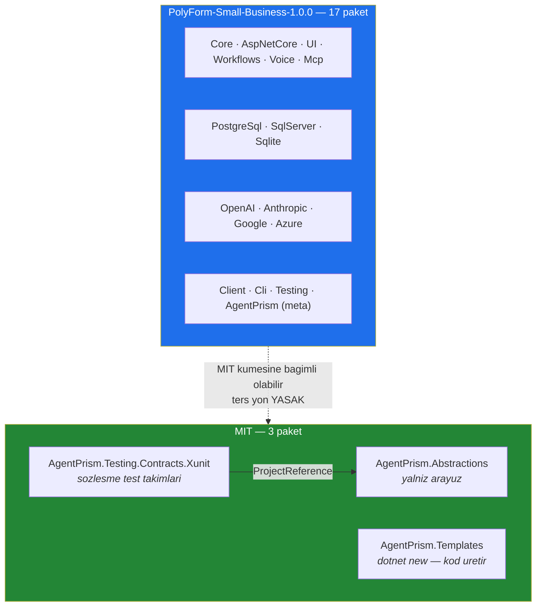

# Faz 160 — Lisans Modeli ve Paket Metaverisi

> **Durum:** 📋 Planlandı (2026-09-08)
> **Kaynak:** `nuget-danismani` turu (2026-09-08) — bu kalem [ADAYLAR.md](ADAYLAR.md) içinde hiç bulunmadı; yayın danışmanlığı üretti
> **Önkoşul:** Yok — ama yayın kapısını Faz 97 kurdu: [`arsiv/fazlar/97-SURUM-POLITIKASI-VE-YAYIN-PROVASI.md`](arsiv/fazlar/97-SURUM-POLITIKASI-VE-YAYIN-PROVASI.md)
> **Paketler:** 20 paketlenebilir projenin **tamamı** — yalnız metaveri ve lisans dosyası
> **Yeni paket:** Yok · **Migration:** Yok
> **Public API:** Büyümüyor — tek satır C# değişmez. `wc -l src/*/PublicAPI.Shipped.txt` = 17 satır, hepsi `#nullable enable` (ölçüldü 2026-09-08); taban çizgisi boştur
> **Tüketici yüzeyi:** `docs-site/src/content/docs/reference/licensing.md` (**yeni**) · `packages.md` · `docs-site/src/sidebar.mjs` · sevk edilen: kök `README.md` (pakete girer), `LICENSE.md`, `LICENSE-MIT.md`
> **Manuel test alanı:** [`docs/manuel-test/01-KURULUM-VE-PAKETLEME.md`](manuel-test/01-KURULUM-VE-PAKETLEME.md)

---

## Bu Faza Başlarken

> `faz-baslangic` skill'ini uygula. **Tamamını değil, yalnız işaret edilen bölümleri oku.**

1. Bu doküman
2. Kararlar:
   ```bash
   grep -n "K-007\|K-008\|K-659\|K-661" docs/KARARLAR.md
   ```
   **K-659** (🚨 **bu fazın merkezinde**: repo `private` kaldıkça pakete giren tüketiciye
   dönük URL'ler doküman sitesine bakar; `RepositoryUrl` repo'da kalır) ·
   **K-661** (bir `<id, version>` çifti tekil bir artifact'i adlandırır; `dotnet pack` kirli
   ağaçta reddeder) · **K-007** / **K-008** (paket ekleme ve ön sürüm sınırı — bu faz
   ihlal etmez, paket eklemez)
3. Alan hafızası — ikisi de doğrudan bu fazın konusudur:
   [`hafiza/paketleme-ve-dagitim.md`](hafiza/paketleme-ve-dagitim.md) (paket metaverisi ve
   `pack` tuzakları) · [`hafiza/yayin-ve-surumleme.md`](hafiza/yayin-ve-surumleme.md)
   (`kapi.py yayin` ne doğrular, ne doğrulamaz)
4. Site tarafı için, yalnız gerekince:
   [`hafiza/dokumantasyon.md`](hafiza/dokumantasyon.md) (dil sınırı ve site yayın hattı) ·
   [`hafiza/site-uretim-kapilari.md`](hafiza/site-uretim-kapilari.md)
5. Emsal — yeniden yazma, oku: `scripts/kapi.py` içindeki `yayin` alt komutunun paket
   kimliği ve metaveri doğrulaması (bugün `1077-1078` satırlarında lisansı sabit MIT sanar)

---

## Amaç

AgentPrism bugün MIT lisanslıdır ve hiç yayınlanmamıştır. MIT, üçüncü tarafın
paketi ticari bir üründe sınırsız ve bedelsiz kullanmasına izin verir. Kullanıcı
bu üründen gelir elde etmeyi seçti; MIT bu hedefle bağdaşmaz.

Bu faz lisans modelini **gelir eşikli, kaynağı görünür** bir modele geçirir:
`PolyForm-Small-Business-1.0.0`. Eşiğin altındaki herkes ücretsiz kullanır,
üstündeki kuruluş ticari lisans alır. Üç paket eklenti ekosistemi için MIT kalır.

**Tek satır C# değişmez.** Bu faz lisans dosyalarına, paket metaverisine, yayın
kapısına ve tüketiciye dönük metne dokunur.

- **Kapsam** — lisans matrisi · `pack` metaverisi · `kapi.py yayin` lisans doğrulaması ·
  `COMMERCIAL.md`'nin siteye taşınması · README ve site senkronu

### Neden şimdi — geri dönülemezlik

Bir NuGet sürümünün lisansı yayınlandıktan sonra **değişmez**; `unlist` edilen
paket bile tam sürüm numarasıyla indirilebilir. Aynı şekilde depo `public`
yapıldığı anda kökteki `LICENSE` dosyası dünyaya verilmiş olur.

Bugün üç koşul birden geçerlidir ve **üçü de tek yönlüdür**:

| Koşul | Ölçüm (2026-09-08) |
|---|---|
| Yayınlanmış NuGet sürümü yok | `README.md` kendi durum bloğunda yazıyor: "not yet published" |
| Depo `public` değil | K-659 anonim `curl` ile ölçtü: HTTP 404 |
| Dış katkıcı yok | `git shortlog -sne --all` → 696 commit tek yazar + 9 `dependabot` |

Üçünden biri değiştiğinde bu fazın maliyeti artar ve bir kısmı imkânsızlaşır.

### Bugün ne çalışmıyor — doğrulanmış kanıt

| Kanıt | Gözlem |
|---|---|
| `COMMERCIAL.md:9-10` | Dosya kendi başlığıyla "açık bir taahhüt"tür ve **"MIT olarak listelenen her paket sonsuza dek MIT kalır"** der. Seçilen modeli doğrudan yasaklar |
| `COMMERCIAL.md:9` | Taahhüt "README.md'deki **Paketler tablosunda MIT olarak listelenen**" pakete atıf yapar. `README.md:172` tablosunun sütunları `\| Package \| What it does \|` — **lisans sütunu yoktur**. Atıf var olmayan bir şeye bakar |
| `COMMERCIAL.md` tamamı | Türkçe. Pakete giren İngilizce README ondan link verir — dil sınırı ihlali |
| [`README.md:367`](../README.md) | `[COMMERCIAL.md](COMMERCIAL.md)` **göreli** linktir. nuget.org'da render edilen README'de göreli link ölüdür; depo `private` olduğu için GitHub'da da açılmaz. K-659'un aynı sınıfı |
| [`src/Directory.Build.props:42`](../src/Directory.Build.props) | `<PackageLicenseExpression>MIT</PackageLicenseExpression>` — 20 paketin hepsi MIT ilan eder |
| [`src/Directory.Build.props:43`](../src/Directory.Build.props) | `<PackageRequireLicenseAcceptance>false</...>` |
| [`src/Directory.Build.props:45`](../src/Directory.Build.props) | `<Company>Intelera</Company>` — kullanıcının şirketi **Atanova**. Yanlış tüzel kişilik 20 pakette dağıtılır |
| [`scripts/kapi.py:1077-1078`](../scripts/kapi.py) | Yayın kapısı `'<license type="expression">MIT</license>' not in nuspec` diye arar. Lisans değişince **her `kapi.py yayin` koşumu kırmızı olur** |
| `LICENSE` (kök) | Dosyanın **uzantısı yok**. NuGet paket içi lisans dosyası için `.txt` veya `.md` ister |
| [`src/AgentPrism.Testing.Contracts.Xunit/…csproj:26`](../src/AgentPrism.Testing.Contracts.Xunit/AgentPrism.Testing.Contracts.Xunit.csproj) | `ProjectReference: AgentPrism.Abstractions`. Abstractions kısıtlı kalırsa sözleşme paketinin MIT olması eklenti yazarına kapı açmaz |
| `docs-site/src/content/docs/` | Lisans sayfası **yok** (`ls` ile ölçüldü). `reference/` altında `changelog · compatibility · configuration · glossary · read-views · versioning` var |
| `src/*/*.csproj` | **21** proje dosyası; `AgentPrism.Generators` `IsPackable=false`. Paketlenebilir: **20**. `AgentPrism.Sql.Shared` bir `.csproj` içermez — paylaşılan kaynak dizinidir |

> Kanıtlar 2026-09-08 tarihinde doğrulandı.

---

## 160.1 — Lisans matrisi

20 paket iki kümeye ayrılır. Ayrım ölçütü tek cümledir: **üçüncü tarafın
AgentPrism'i çalıştırmadan eklenti yazması ve kendi kodunu üretmesi için gereken
her şey MIT'dir; çalıştırma düzleminin tamamı PolyForm'dur.**



### Kural — bağımlılık yönü

Bir MIT paketi **hiçbir zaman** PolyForm bir pakete bağımlı olamaz. Olursa MIT
etiketinin hiçbir anlamı kalmaz: tüketicinin lisans taraması geçişli bağımlılığı
yakalar ve zinciri durdurur. Bugün üç MIT paketi bu kuralı sağlar:

| MIT paket | AgentPrism bağımlılığı | Durum |
|---|---|---|
| `AgentPrism.Abstractions` | Yok | ✅ |
| `AgentPrism.Testing.Contracts.Xunit` | `AgentPrism.Abstractions` (MIT) | ✅ |
| `AgentPrism.Templates` | Yok (`.csproj`'unda hiç `ProjectReference` yok) | ✅ |

Bu kural bir testle kilitlenir — bkz. Hata Modları tablosu. `DependencyDirectionTests`
bugün zaten paket yönü doğruluyor; lisans yönü onun yanına eklenir.

### Neden `Abstractions` MIT

Yalnız arayüz içerir. Kimse arayüzlerle AgentPrism çalıştıramaz — çalıştırma
`Core`, `AspNetCore`, `UI` ve storage paketlerindedir ve hepsi PolyForm kalır.
Gelir kaybı yoktur; kaybedilecek olan eklenti ekosistemidir.

### Neden `Templates` MIT

Paket başkasının projesine **kaynak kod üretir**. Kısıtlı bir lisans altında
üretilen kodun kime ait olduğu tartışmalı hâle gelir. Üretilen projenin referans
ettiği AgentPrism paketleri kendi lisanslarını taşır — bu doğru ve istenen
davranıştır: şablon serbesttir, çalıştırma düzlemi değildir.

---

## 160.2 — Lisans metinleri

Kökte **iki** dosya bulunur. İsimler farklıdır; `PackagePath` ile yeniden
adlandırma denenmez — belirsizlik üretir.

| Dosya | İçerik | Kimin |
|---|---|---|
| `LICENSE.md` | `PolyForm-Small-Business-1.0.0` kanonik metni + eşik üstü için iletişim satırı | 17 paket · deponun kendisi |
| `LICENSE-MIT.md` | MIT kanonik metni | 3 paket |

Eski uzantısız `LICENSE` dosyası `git mv` ile `LICENSE.md`'ye taşınır ve içeriği
değiştirilir. GitHub deponun lisansını kök `LICENSE.md`'den okur; baskın lisans
PolyForm olduğu için doğru olan budur. Dosya, MIT istisnalarını **kendi başında**
sayan bir başlık bloğu taşır — okuyan kişi site sayfasına gitmek zorunda kalmaz.

### PolyForm metni — doğrulandı

Kanonik metin SPDX üzerinden alındı (2026-09-08; `polyformproject.org` HTTP 404
verdi, SPDX yansıması kullanıldı):

| Ölçülen | Değer |
|---|---|
| SPDX tanımlayıcı | `PolyForm-Small-Business-1.0.0` |
| Eşik | *"fewer than 100 total individuals working as employees and independent contractors, and less than 1,000,000 USD (2019) total revenue in the prior tax year"* |
| Dağıtım | İzinli |
| Değiştirme | İzinli |
| Patent | Patent lisansı verir; savunmacı fesih şartı taşır |
| OSI onayı | **Yok** |

🚨 **Kanonik metin değiştirilmez.** Eşik rakamını veya bir cümleyi düzenlemek
lisansı "PolyForm" olmaktan çıkarır ve tüketicinin lisans tarayıcısının tanıdığı
bir ad olmaktan çıkarır — bu modelin tahsilat mekanizması tam olarak o tanımadır.
Eklenecek tek şey, metnin **dışında** duran bir başlık bloğudur: telif sahibi,
ticari lisans için iletişim adresi ve MIT istisnalarının listesi.

### OSI onayı olmaması bir sonuç doğurur

NuGet `<PackageLicenseExpression>` alanına yalnız kendi izin listesindeki
(OSI/FSF onaylı) lisansları kabul eder. PolyForm bu listede değildir. Bu yüzden
tüm paketler `<PackageLicenseFile>` yoluna geçer — MIT olanlar dahil, çünkü iki
farklı mekanizmayı yan yana çalıştırmak `kapi.py`'nin doğrulamasını gereksiz
karmaşıklaştırır.

`PackageLicenseFile` lisansı **paketin içine gömer**. K-659 açısından bu bir
kazançtır: dosya bir URL'ye bağlı değildir, dolayısıyla depo `private` iken de
tüketici için ölü bağlantı üretmez.

---

## 160.3 — Paket metaverisi

`src/Directory.Build.props` PolyForm'u **varsayılan** yapar; üç MIT projesi kendi
`.csproj`'unda geçersiz kılar. Bu, deponun mevcut idiomudur — README ve ikon
zaten `Directory.Build.props:126-127` içinde bu desenle paketlenir.

| Alan | Bugün | Varsayılan (17 paket) | MIT üçlüsünün override'ı |
|---|---|---|---|
| `PackageLicenseExpression` | `MIT` | **kaldırılır** | kaldırılır |
| `PackageLicenseFile` | yok | `LICENSE.md` | `LICENSE-MIT.md` |
| `PackageRequireLicenseAcceptance` | `false` | `true` | `false` |
| `Company` | `Intelera` | `Atanova` | aynı |
| `Copyright` | `Copyright (c) Faruk Atasoy` | **değişmez** | değişmez |

`Copyright` bilerek şahsa kalır: telif Faruk Atasoy'da, satıcı Atanova'dır. İkisi
farklı alanlardır ve karıştırılmaz.

`Directory.Build.props:126-127` yanına lisans dosyasının `None`/`Pack` satırı
eklenir; hangi dosyanın paketleneceği `$(PackageLicenseFile)` üzerinden koşullanır.

---

## 160.4 — Yayın kapısının lisans doğrulaması

Bugünkü kapı tek bir string arar ve paket başına ayrım yapmaz:

```python
# scripts/kapi.py:1077-1078 — bugün
if '<license type="expression">MIT</license>' not in nuspec:
    errors.append(f"{project_id}: MIT license expression eksik")
```

Kapı üç şeyi birden doğrulayacak biçimde değiştirilir:

1. `.nuspec` `<license type="file">` taşır ve değeri **o paket için beklenen**
   dosyadır (`LICENSE.md` veya `LICENSE-MIT.md`)
2. O lisans dosyası `.nupkg` **içeriğinde** gerçekten vardır (`_entry_names` ile —
   `icon.png` ve `README.md` için zaten kullanılan yol)
3. `<requireLicenseAcceptance>` değeri o paketin kümesiyle tutarlıdır

Beklenen küme `_package_profile` yanında duran tek bir sabit tablodan gelir. Yeni
bir paket eklendiğinde tabloya girmezse kapı **hata verir** — sessizce PolyForm
varsaymaz. Faz 97 denetiminin dersi budur: kapı "eksik"i yakalıyordu, "fazla"yı
ve yanlış sınıflandırmayı yakalamıyordu.

---

## 160.5 — `COMMERCIAL.md` siteye taşınır

Kökteki `COMMERCIAL.md` **silinir**. İçeriği yeniden yazılır ve
`docs-site/src/content/docs/reference/licensing.md` olarak İngilizce yayınlanır.

Gerekçe ölçülmüştür: paketlenen README'nin göreli linki nuget.org'da ölüdür ve
depo `private` iken GitHub'da da açılmaz. Satın alma kararını verecek kişi sayfayı
her yerden açabilmelidir. K-659 aynı sınıf için aynı çözümü seçmişti.

Sayfanın cevaplaması gereken sorular:

| Soru | Neden |
|---|---|
| Ücretsiz miyim? | Eşiğin iki kolu (çalışan sayısı **ve** gelir) ve "prior tax year" ifadesi |
| Hangi paket hangi lisansta? | 3 MIT + 17 PolyForm, isim isim |
| Ticari lisansı nasıl alırım? | İletişim adresi. Fiyat **bu fazda yazılmaz** — kapsam dışı |
| Lisans anahtarı gerekiyor mu? | **Hayır.** Pakette hiçbir enforcement kodu yoktur; bu bir söz olarak yazılır |
| Zaten yayınlanmış bir sürüm geri alınır mı? | Hayır — yayınlanan sürümün lisansı değişmez |

Sayfa `docs-site/src/sidebar.mjs` içindeki **Reference** bölümüne kaydedilir
(bugün: `configuration · compatibility · read-views · versioning · changelog ·
packages · glossary`). Kaydedilmezse sayfa erişilemez kalır.

`README.md` iki yerden değişir: `172` satırındaki Packages tablosuna **License
sütunu** eklenir (üç paket ayrışıyor; sütun olmadan matris görünmez) ve `365-368`
satırlarındaki License bölümü site sayfasına **mutlak URL** ile link verir.

`docs-site/src/content/docs/packages.md` ("Choosing packages") aynı matrisi taşır.

---

## Planlanan Public API

**Yok.** Bu faz hiçbir C# imzasına dokunmaz. `PublicAPI.Unshipped.txt`
dosyalarının hiçbiri değişmez.

### Arayüz payı

**Yok.** `src/AgentPrism.UI` içindeki hiçbir dosyaya dokunulmaz, `locales/en.ts`
ve `tr.ts` değişmez.

---

## Planlanan Dosya Listesi

```
LICENSE                                    → LICENSE.md   (git mv + icerik degisir)
LICENSE-MIT.md                             (yeni)
COMMERCIAL.md                              (silinir)
README.md                                  (Packages tablosu + License bolumu)
src/Directory.Build.props                  (42 · 43 · 45 · 126-127)
src/AgentPrism.Abstractions/*.csproj       (lisans override)
src/AgentPrism.Templates/*.csproj          (lisans override)
src/AgentPrism.Testing.Contracts.Xunit/*.csproj  (lisans override)
scripts/kapi.py                            (1077-1078 → paket basina lisans dogrulamasi)
docs-site/src/content/docs/reference/licensing.md   (yeni)
docs-site/src/content/docs/packages.md     (lisans matrisi)
docs-site/src/sidebar.mjs                  (Reference bolumune kayit)
tests/…/PackageLicenseTests.cs             (yeni — lisans yonu ve matris)
docs/manuel-test/01-KURULUM-VE-PAKETLEME.md (kabul case'leri)
```

---

## Hata Modları ve Testler

> Mutlu yoldan değil, **ne bozulabilir**den türetilir. Seviyeyi plan seçer.
> Sınır geçen davranış (DI · HTTP · kiracı · akış · depo · **paket**) birim
> testiyle kanıtlanamaz — [`.agents/ortak/test-seviyeleri.md`](../.agents/ortak/test-seviyeleri.md).

| Ne bozulabilir | Seviye | Test |
|---|---|---|
| Bir MIT paketi PolyForm bir pakete bağımlı hâle gelir; MIT etiketi anlamsızlaşır | Birim (proje grafiği) | `PackageLicenseTests` — `DependencyDirectionTests` yanına |
| Yeni bir paket eklenir, lisans tablosuna girmez ve sessizce yanlış lisansla çıkar | Birim | `PackageLicenseTests` — 20 projenin tamamı tabloda mı |
| `.nuspec` `type="file"` der ama dosya `.nupkg` içine hiç paketlenmez | **Paket** (`kapi.py yayin`) | `_entry_names` kontrolü, `icon.png` deseni |
| MIT paketine PolyForm dosyası paketlenir (koşul yanlış yazılır) | **Paket** | Paket başına beklenen dosya adı doğrulaması |
| `requireLicenseAcceptance` MIT paketlerinde de `true` çıkar | **Paket** | Aynı doğrulama, üçüncü kolu |
| 🚨 `kapi.py:1077` MIT string'i unutulur; her yayın provası kırmızı olur ve sebebi lisansla ilgili görünmez | **Paket** | Kapının kendisi; DoD'de `kapi.py yayin --kuru` yeşil şartı |
| `PackageRequireLicenseAcceptance=true` bir tüketicinin `restore`'unu kırar | **E2E** | İzole `NUGET_PACKAGES` + exact sürüm ile dış tüketici — `scripts/release_extension_samples.py` yolu |
| `dotnet new agentprism-api` lisans kabul şartı yüzünden çalışmaz | **E2E** | Şablon kurulumu + üretilen projenin `build`'i |
| `COMMERCIAL.md` silinince `SourceLanguageTests` taban çizgisi kayar | Birim | Mevcut kapı; taban çizgisi **yalnız küçülür** |
| README'nin yeni mutlak URL'si 404 verir | Site | `docs-site` `check-links.mjs` |
| Yeni site sayfası sidebar'a kaydedilmez; erişilemez kalır | Site | `npm run build` + link kontrolü |
| `LICENSE.md` kanonik PolyForm metninden sapar; lisans tarayıcıları tanımaz | **Manuel** 👤 | Kabul case'i — SPDX metniyle karşılaştırma |

Beş soru, bu fazın kod yolu olmadığı için kısadır: **iptal** yok · **eşzamanlılık**
yok · **boş/aşırı girdi** yok · **başka kiracı** yok · **alt sistem hatası** =
`pack` sırasında lisans dosyasının bulunamaması, yukarıda paket seviyesinde.

---

## Manuel Kabul Case'leri

> Kapanışta [`docs/manuel-test/01-KURULUM-VE-PAKETLEME.md`](manuel-test/01-KURULUM-VE-PAKETLEME.md)
> içine eklenir.

| # | Ön koşul | Adımlar | Beklenen sonuç |
|---|---|---|---|
| 1 | Temiz ağaç | `python3 scripts/kapi.py yayin --kuru --surum 0.1.0-preview.1` | Çıkış kodu 0; 20 paketin lisans doğrulaması geçer |
| 2 | 1 koştu | Bir PolyForm paketini aç: `unzip -p <pkg>.nupkg *.nuspec` | `<license type="file">LICENSE.md</license>` ve `<requireLicenseAcceptance>true</...>` |
| 3 | 1 koştu | `AgentPrism.Abstractions.nupkg` için aynısı | `LICENSE-MIT.md` ve `requireLicenseAcceptance` `false` |
| 4 | 1 koştu | `unzip -l AgentPrism.Abstractions.nupkg \| grep LICENSE` | Yalnız `LICENSE-MIT.md` var; `LICENSE.md` **yok** |
| 5 | Yerel feed hazır | İzole `NUGET_PACKAGES` ile depo dışında tüketici projesi `restore` + `build` | Başarılı; lisans kabulü `dotnet` CLI akışını bloklamaz |
| 6 | 5 koştu | `dotnet new install` ile şablon, sonra `dotnet new agentprism-api` | Proje üretilir ve derlenir |
| 7 | Site derlendi | `reference/licensing` sayfasını aç | Eşiğin iki kolu, 3+17 matrisi ve iletişim adresi görünür |
| 8 | Site derlendi | README'deki License linkine tıkla | Site sayfası açılır — göreli link kalmamıştır |
| 9 | 👤 insan gerekir | `LICENSE.md` gövdesini SPDX `PolyForm-Small-Business-1.0.0` metniyle karşılaştır | Kanonik gövde birebir aynı; yalnız başlık bloğu eklenmiş |

---

## Açık Sorular

> Planı bloklamayan, faz uygulanırken karara bağlanacak sorular.

| # | Soru | Seçenekler | Öneri |
|---|---|---|---|
| 1 | Ticari lisans için iletişim adresi ne olsun? | A: `docs-site` üzerinde bir sayfa · B: doğrudan e-posta adresi | **B** — alan adı kararı ertelendi; sayfa URL'si değişebilir, e-posta değişmez |
| 2 | `LICENSE.md` başlık bloğu ne kadar uzun olsun? | A: üç satır (telif · iletişim · MIT istisnaları) · B: tam SSS | **A** — SSS site sayfasının işidir; lisans dosyası kısa kalmalı |
| 3 | `AgentPrism.Client` ve `AgentPrism.Cli` ileride MIT setine girer mi? | A: şimdi · B: talep ölçülünce | **B** — bugün gerekçesi yok; MIT'ye geçirmek her zaman serbesttir, tersi değildir |
| 4 | `kapi.py` lisans tablosu nerede dursun? | A: `kapi.py` içinde sabit · B: ayrı bir veri dosyası | **A** — `_package_profile` zaten orada; ikinci dosya senkron yükü ekler |

---

## Bitiş Ölçütleri (DoD)

- [x] **`ReleaseArtifactTests` 51/51 yeşil** — `EveryPackageCarriesMetadata` 20 paketin her biri için lisans dosyasını, `.nuspec` `type="file"` değerini ve `requireLicenseAcceptance`'ı doğrular. Fixture paketleri taze üretir
- [x] **`unzip -l` ile ölçüldü (`1.0.0-preview.1`, 20 paket):** 3 MIT paketi `LICENSE-MIT.md` + `acc=0`, 17 paket `LICENSE.md` + `acc=1`. Her pakette beyan edilen dosya ile içerideki dosya aynı; hiçbiri ikisini birden taşımıyor
- [ ] `python3 scripts/kapi.py yayin --kuru` çıkış kodu 0 — **kirli ağaçta reddedildi (K-661, doğru davranış)**; commit sonrası koşulacak
- [ ] `grep -rn "MIT" README.md COMMERCIAL.md src/Directory.Build.props scripts/kapi.py` yalnız beklenen (MIT üçlüsüne ait) satırları döndürür; `COMMERCIAL.md` artık yoktur
- [ ] `Company` alanı 20 pakette `Atanova`; `Copyright` değişmemiştir
- [x] `PackageLicenseTests` 6/6 yeşil: bağımlılık yönü · 20 projenin tamamı tabloda · props ↔ `kapi.py` matris uyumu · npm kopyasının birebirliği · kanonik PolyForm gövdesi. **red→green doğrulandı** (kapıda tek bir paket kaydırıldı, `The_build_matrix_and_the_release_gate_agree_on_which_packages_are_MIT` düştü)
- [ ] İzole `NUGET_PACKAGES` + exact sürümle, depo dışında bir tüketici `restore` + `build` + gerçek `run` yaptı
- [ ] Dört doğrulama kapısı sıfır uyarı verir
- [ ] `samples/AgentPrism.Api` ile gerçek `run` yapıldı, çıktı belgeye yazıldı
- [ ] `secret` taraması boş döndü
- [ ] Manuel kabul case'leri `docs/manuel-test/01-KURULUM-VE-PAKETLEME.md` içine eklendi; 1-8 koşuldu, 9 insan tarafından işaretlendi
- [ ] `faz-denetim` koşuldu; 🔴 bulgu kalmadı
- [x] `docs-site/` güncellendi (`reference/licensing.md` · `packages.md` · `sidebar.mjs`); `npm run build` 1116 sayfa, `check-links.mjs` 165.996 bağlantı **sıfır kırık**, `check-content.mjs` 53 manuel sayfa geçti
- [x] `python3 scripts/dokuman-bakim.py` çıkış kodu 0 — manuel kabul sayımı ve kırık bağlantı temiz

### Doğrulama komutları

```bash
# Paket basina lisans - beklenen dosya paketlendi mi
for p in artifacts/*.nupkg; do
  echo "== $p"; unzip -l "$p" | grep -E "LICENSE(-MIT)?\.md"
  unzip -p "$p" '*.nuspec' | grep -E "<license |requireLicenseAcceptance"
done

# Yayin provasi - aga hicbir sey yazmaz
python3 scripts/kapi.py yayin --kuru --surum 0.1.0-preview.1

# Kapanis kapilari
python3 scripts/kapi.py kapanis --taban <faz oncesi commit>
```

---

## Riskler

| Risk | Önlem |
|------|-------|
| 🚨 Bu faz kapanmadan depo `public` yapılır veya paket yayınlanır → MIT geri alınamaz biçimde dünyaya verilir | Faz kapanana kadar `public` yapılmaz ve `dotnet nuget push` çalıştırılmaz. Bu satır devir notuna da geçer |
| `kapi.py:1077` unutulur; kapı kırmızıya döner ve sebebi lisansla ilişkilendirilemez | DoD'de `kapi.py yayin --kuru` yeşil şartı var; kanıt tablosunda satır numarası yazılı |
| Kanonik PolyForm metni "iyileştirilir" ve lisans tanınmaz hâle gelir | 160.2'de 🚨 kuralı; kabul case'i 9 metni SPDX ile karşılaştırır |
| `PackageRequireLicenseAcceptance=true` bilinmeyen bir tüketici akışını bozar | E2E: izole `NUGET_PACKAGES` ile dış tüketici + şablon koşumu (case 5-6) |
| MIT üçlüsünün bağımlılık yönü ileride sessizce bozulur | `PackageLicenseTests` bunu kilitler; yeni paket tabloya girmezse kapı hata verir |
| K-659 bu fazdan sonra yeniden açılır (depo `public` yapılırsa) ve metaveri URL'leri değişir | Kapsam dışı ve bilinçli. Devir notuna yazılır: repo `public` olduğunda K-659 ve bu fazın URL kararları birlikte gözden geçirilir |
| Lisans hukuki gelir temelidir; bu faz avukat incelemesi içermez | Kapsam dışı, ama devir notunda açıkça yazılır — bir fikri mülkiyet avukatına okutmak yayından önce önerilir |

---

<!-- ============================================================
     AŞAĞISI KAPANIŞTA DOLDURULUR — `faz-tamamlama` skill'i.
     Plan anında boş kalır. Başlıkları SİLME.
     ============================================================ -->

## Plandan Sapmalar

> Uygulama sırasında ölçümle bulundu. Kapanışta gerekirse eklenir.

| # | Plan ne diyordu | Ölçüm ne gösterdi | Ne yapıldı |
|---|---|---|---|
| 1 | 🚨 "Üç MIT projesi kendi `.csproj`'unda geçersiz kılar" (160.3) | `<None Include="…$(PackageLicenseFile)">` **aynı** `Directory.Build.props` içindedir ve `ItemGroup` dosya sırasına göre, herhangi bir `csproj` gövdesinden **önce** değerlendirilir. `csproj` override'ı `.nuspec`'i doğru yazar ama **yanlış dosyayı paketlerdi** | Matris `Directory.Build.props` içine, `ItemGroup`'un **üstüne** taşındı ve `$(MSBuildProjectName)` ile anahtarlandı. `src/Directory.Build.targets` açmak kök `Directory.Build.targets`'ı sessizce devre dışı bırakacağı için seçilmedi |
| 2 | Kapı `<requireLicenseAcceptance>false</…>` metnini arayacaktı (160.4) | NuGet bu elementi **yalnız `true` iken** yazar; `false` varsayılandır ve element hiç görünmez. Üç paketle paketleyip ölçüldü | Kapı MIT tarafını elementin **yokluğu** ile doğruluyor. `MT-PKG-023` zaten bu davranışı 2026-08-15'te kaydetmişti |
| 3 | "`COMMERCIAL.md` silinince `SourceLanguageTests` taban çizgisi kayar" (hata modu tablosu) | **Yanlış.** `ScannedRootFiles` yalnız `README.md · CONTRIBUTING.md · ARCHITECTURE.md`'dir; `COMMERCIAL.md` hiç taranmıyordu. Silmenin taban çizgisine etkisi sıfır | Bunun yerine `LICENSE.md` ve `LICENSE-MIT.md` **iki kapıya da eklendi** (`SourceLanguageTests` · `ShippedDocumentationSelfContainmentTests`) — artık her pakette sevk edildikleri için paket README'siyle aynı statüdeler |
| 4 | npm paketi kapsamda değildi | `packages/agentprism-client/package.json` `"license": "MIT"` ilan ediyordu ve hiç lisans dosyası taşımıyordu — NuGet ikizi `AgentPrism.Client` ise PolyForm. Aile içinde çelişki | Kullanıcı kararıyla PolyForm'a alındı: `"PolyForm-Small-Business-1.0.0"`, `files`'a `LICENSE.md`, kök dosyanın kopyası. `PackageLicenseTests` kopyanın birebirliğini kilitler |
| 5 | — | `Directory.Build.props:120` yorumu "all 19 packages" diyordu; ölçülen sayı **20** | Düzeltildi. Değiştirdiğim `ItemGroup`'un hemen üstündeydi |
| 6 | — | `MT-PKG-023` `<license type="expression">MIT</license>` bekliyordu | Yeni beklentiye güncellendi; yoksa sonraki manuel koşum bu case'te kalırdı |
| 7 | "`packages.md` aynı matrisi taşır" (160.5) | Sayfa tek bir ana tablo değil, amaca göre bölünmüş **beş** tablo taşıyor. Matrisi oraya yaymak üçüncü bir kopya üretirdi | Kısa bir "Licensing in one line" bölümü + `reference/licensing` bağlantısı |
| 10 | 🔴 Plan yalnız `scripts/kapi.py:1077` kapısını saymıştı | **İkinci bir kapı aynı MIT dizgesini sabit kodluyordu:** `tests/AgentPrism.Package.Tests/ReleaseArtifactTests.cs:114`. Dört kapı koşumunda `EveryPackageCarriesMetadata` düştü ve izole koşumda da düştü — gerçek regresyon | Sınıf tarandı (`grep -rn 'license type='`), başka kopya çıkmadı. Test `PackableProjects.LicenceFileOf` ile **matrisi `Directory.Build.props`'tan okuyor**; dördüncü bir kopya yazılmadı. Aynı üç yönlü doğrulama (beyan · içerik · kabul) buraya da girdi |
| 11 | Plan `CHANGELOG.md`'yi hiç anmamıştı | Lisans değişikliği tam olarak sürüm notuna girmesi gereken şeydir; `Unreleased` bölümü ise MIT'den söz etmiyordu | `### Changed` altına giriş yazıldı, site changelog'u yeniden üretildi. 🚨 `kapi.py yayin --kuru` `CHANGELOG` kapısını yalnız sürüm `1.0.0-preview.N` desenine uyduğunda koşar; henüz yayınlanmış sürüm olmadığı için prova `--surum` verilmeden koşuldu ve o kapı bu fazda **görülmedi** |
| 9 | 🔴 Plan paket README'lerini hiç saymamıştı | **Sekiz paket README'si `License: MIT` diyordu** ve bunlar `PackageReadmeFile`'dır — nuget.org'un render ettiği sayfa. Paket PolyForm olurken en görünür tüketici yüzeyi MIT iddia edecekti | Sekizi de düzeltildi. Ayrıca MIT üçlüsünden sessiz kalan ikisine (`Templates`, `Testing.Contracts.Xunit`) neden MIT oldukları yazıldı — ayrıcalıklı olan onlar ve bunu söylemeyen bir README eklenti yazarını caydırır |
| 8 | — | `src/AgentPrism.Templates/content/AgentPrism.Starter/AgentPrism.Starter.csproj` bir şablon içeriğidir, paket değil. Testin proje keşfi `kapi.py`'nin `src/*/*.csproj` tek seviye globunu birebir izlemek zorunda | Test `EnumerateDirectories` + `TopDirectoryOnly` ile aynı şekli kullanıyor. İlk hâli bu farkı kırmızıyla yakaladı |

## Bu Fazda Verilen Kararlar

> Kapanışta doldurulur. K-NNN numaraları burada alınır; plan numara rezerve etmez.
> Beklenen kalemler: lisans modeli · MIT kümesinin sınırı ve gerekçesi ·
> `COMMERCIAL.md`'nin siteye taşınması.

## Gerçekleşen Public API

> Kapanışta doldurulur. Plan iddiası: **değişmedi**.

## Dosya Listesi (gerçekleşen)

> Kapanışta doldurulur.

## Denetim Bulguları

> Kapanışta doldurulur — `faz-denetim` çıktısı.

## Sonraki Faza Devir Notu

> Kapanışta doldurulur. 🚨 Şunlar mutlaka yazılır: depo `public` yapılmadan önce
> ne kontrol edilmeli · K-659'un yeniden açılma koşulu · alan adı ve fiyat/tahsilat
> işinin hâlâ açık olduğu · NuGet ID prefix rezervasyonunun yapılmadığı.
