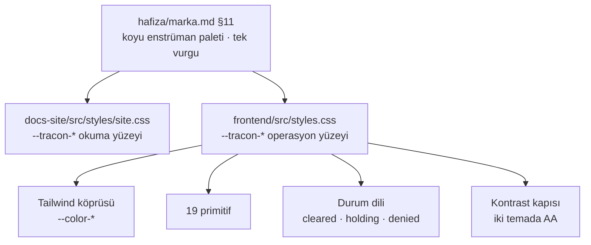

# Faz 164 — Console'un Enstrüman Katmanı

> **Durum:** 📋 Planlandı (2026-09-12)
> **Kaynak:** Kullanıcı isteği · **F-223** (aday listesi boştu; kalem doğrudan
> kullanıcıdan geldi ve dört tasarım kararı onunla birlikte alındı)
> **Önkoşul:** [Faz 163](arsiv/fazlar/163-MARKA-VE-DOKUMANTASYON.md) — marka dili,
> teal palet ve `hafiza/marka.md` orada kuruldu; bu faz onu console'a taşır
> **Paketler:** `Tracon.UI`
> **Yeni paket:** Yok · **Migration:** Yok
> **Public API:** Değişmiyor. HTTP sözleşmesi, `UseUI()` ve `MapTracon()` aynı
> **Tüketici yüzeyi:** Console'un tamamı · `docs-site/src/content/docs/ui.md` ·
> 19 ekran görüntüsü · `capabilities.md` console satırı
> **Manuel test alanı:** `docs/manuel-test/09-ARAYUZ-GENEL.md`
> **Taban:** `7cbc0f354337bd8a6be46eaa466f1eff087aa831`

---

## Bu Faza Başlarken

`faz-baslangic` skill'ini uygula. Bu fazın minimum okuma kümesi:

1. Bu doküman
2. **[`hafiza/marka.md`](hafiza/marka.md) — bağlayıcıdır.** Özellikle §5 (ses),
   §11 (görsel yön) ve §10 (terminoloji). §11 tek cümleyle bu fazın ölçütüdür:
   *"siteye bakan kişi havacılık teması değil, bir operasyon ekranı görmelidir."*
3. [`hafiza/frontend.md`](hafiza/frontend.md) — sözlük sözleşmesi, bundle kapısı
4. Kararlar — dosyanın tamamını **okuma**, yalnız bunları grep'le:
   ```bash
   grep -n "K-228\|K-232\|K-756" docs/KARARLAR.md
   ```
   **K-228** (`en.ts` ↔ `tr.ts` anahtar kümesi eşit; eksik anahtar derleme
   hatasıdır) · **K-232** (sunucu yanıtları çevrilmez) · **K-756** (bir gzip
   tavanını yükseltmek bir karardır, tercih değil)
5. Faz 163'ün devir notu — teal paletin ve kontrast cırcırının nereden geldiği:
   ```bash
   awk '/## Sonraki Faza Devir Notu/,0' docs/arsiv/fazlar/163-MARKA-VE-DOKUMANTASYON.md
   ```

---

## Amaç

Console bugün çalışır ve eksiksizdir; **konuşmaz.** 30 ekran, eski markanın mor
vurgusunu ve okuma-ağırlıklı bir yerleşimi taşır. Site Faz 163'te bir operasyon
ekranı diline kavuştu; console hâlâ eski dildedir.

Bu faz console'un **enstrüman katmanını** yeniden yazar — token seti, yoğunluk
ölçeği, 19 primitif, kabuk ve durum dili — ve onu beş ekranlık bir **kanıt
diliminde** uçtan uca ispatlar. Kalan 25 ekran Faz 165'in işidir.

- **F-223** — Console'un görsel ve etkileşim katmanı, sitenin tasarım diliyle
  yeniden kurulur; bundle tavanı ve bağımlılık grafiği değişmez.

Kapsam dışı: HTTP sözleşmesi, ekranların **ne yaptığı**, yeni yetenek. Bir ekran
bu fazda görünüş ve etkileşim olarak değişir, işlev olarak değişmez.

### Bugün ne çalışmıyor — doğrulanmış kanıt

| Kanıt | Gözlem |
|---|---|
| [`frontend/src/styles.css:33`](../src/Tracon.UI/frontend/src/styles.css) | `--ap-accent: #7c3aed` — vurgu rengi eski markadan (`AgentPrism`) kalma mor. Token önekinin tamamı `--ap-*`; 56 token bu önekte |
| [`frontend/src/styles.css:22`](../src/Tracon.UI/frontend/src/styles.css) | `:root, [data-theme='light']` açık paleti taşır, `[data-theme='dark']` (satır 57) koyuyu. **Varsayılan açıktır**; marka §11 "karanlık enstrüman paleti" diyor |
| [`frontend/src/components/ui.tsx`](../src/Tracon.UI/frontend/src/components/ui.tsx) | 19 primitif (365 satır) tipografi ölçeğini kendi içinde taşıyor; ortak bir yoğunluk ölçeği yok |
| `grep -rho "aria-[a-z]*\|role=" frontend/src --include="*.tsx" \| wc -l` | **66** — 130 dosya ve 26 585 satır için. `dialog`, `menu`, `combobox` ve `tooltip` desenleri elle ve tutarsız |
| [`frontend/scripts/postbuild.mjs:25`](../src/Tracon.UI/frontend/scripts/postbuild.mjs) | Bundle tavanı 250 KB gzip ve **gerçek bir kapıdır** — aşarsa build kırılır |
| `wwwroot/assets/index-*.js.br` | 152 378 B brotli. `ui.md:331` bunu 175,9 KB gzip diye yazar; tavanın ~%70'i, **~74 KB pay** |
| [`frontend/package.json`](../src/Tracon.UI/frontend/package.json) | Runtime bağımlılık dört tane: `react`, `react-dom`, `@tanstack/react-query`, `@tracon/client` |
| `tests/Tracon.Ui.E2ETests/UiTests.cs:95` | 375 px taşma testi yalnız **birkaç** ekranı gezer, 30'unu değil |

> Kanıtlar 2026-09-12 tarihinde doğrulandı.

---

## Onaylanan tasarım kararları

Dördü de kullanıcıyla plan yazılmadan **önce** kararlaştırıldı. Uygulama bunları
tartışmaz:

| Karar | Seçim |
|---|---|
| Kapsam | Görsel katman **ve** ekran bazında UX yeniden tasarımı. İki faza bölünür: 164 enstrüman katmanı + kanıt dilimi, 165 kalan ekranlar |
| Kimlik | Sitenin teal'ı, **koyu tema öncelikli**. Açık tema tam destekli kalır |
| "Lite" | 250 KB gzip tavanı **korunur**, **yeni runtime bağımlılığı yok**. Erişilebilirlik elle yazılır |
| Yoğunluk | Operatör yoğunluğu: 13-14 px taban, sıkı satır yüksekliği, monospace kimlikler |

---

## 164.1 — Token katmanı ve tema

`--ap-*` öneki `--tracon-*` olur ve palet sitenin token kümesinden türer. Site
ile console **aynı değerleri** paylaşmaz — biri okuma yüzeyi, diğeri operasyon
ekranı — ama aynı **aileden** gelir: koyu kömür zemin, kırık beyaz metin, tek
teal vurgu.



**Koyu öncelikli ne demektir.** `:root` koyu paleti taşır; açık tema
`:root[data-theme='light']` altında tanımlanır. Bugün tersidir. Sistem tercihi
yine okunur — varsayılanın yönü değişir, seçim hakkı değişmez.

🚨 **Bir renk yalnız bir `@media` veya bileşen kuralı içinde tanımlanırsa kapı
onu göremez ve tema değişiminde kaybolur.** Faz 163'te site tarafında ölçüldü;
aynı kural burada geçerlidir. Her token **iki temada da** değer alır.

**Durum renkleri anlam taşır, dekorasyon değildir.** Marka §11 bunu yazar ve
console'da karşılığı vardır: `Completed`/`Failed`/`Running`/`AwaitingApproval`,
onay kararı, sağlayıcı sağlığı, kota doluluğu. Bu faz renkleri **anlam
kümelerine** bağlar; bugün her ekran kendi rengini seçiyor.

**Kontrast cırcırı devralınır.** Faz 163 site tarafında metin 5,49:1 ve metin
dışı 3,74:1 ölçtü ve bunu
[`kalite-sozlesmesi.md`](../.agents/skills/tuketici-dokuman-senkronu/resources/kalite-sozlesmesi.md)
F tablosuna yazdı. Console'un kendi tabanı bu fazda **ilk kez ölçülür** ve aynı
tabloya girer; sonraki fazlarda yalnız yükselir.

## 164.2 — Yoğunluk ve tipografi ölçeği

Tek bir ölçek dosyada tanımlanır ve 19 primitif ondan okur. Bugün her primitif
kendi değerini taşıyor.

| Rol | Boyut | Nerede |
|---|---|---|
| Taban metin | 13 px | Tablo hücresi, etiket, yardım metni |
| Gövde | 14 px | Panel içeriği, form alanı, açıklama |
| Ekran başlığı | 20 px | `PageHeader` |
| Bölüm başlığı | 15 px | `Panel` başlığı |
| Kimlik (monospace) | 12,5 px | `run` id, `tenant`, `span`, API anahtarı ön eki |
| Tablo satırı | ~32 px | Yoğunluk ölçütü |

**Monospace kimlik bir marka kuralıdır** (§11: "monospace `callsign` etiketi").
Bir tanımlayıcı — `run` id, `session` id, `tenant`, `trace` — her yerde monospace
görünür ve kopyalanabilir. Bugün bazı ekranlarda düz metin.

## 164.3 — Primitifler

19 primitif yeniden yazılır. Liste
[`ui.tsx`](../src/Tracon.UI/frontend/src/components/ui.tsx) içindedir: `cx`,
`PageHeader`, `Panel`, `Button`, `Field`, `TextInput`, `TextArea`, `Select`,
`Badge`, `Mono`, `Empty`, `Loading`, `ErrorNote`, `Table`, `Th`, `Td`,
`CodeBlock`, `CopyButton`, `JsonView`.

**API'leri korunur.** Bir primitifin imzası değişirse 30 ekran birden değişir ve
bu faz kanıt dilimine sığmaz. Görünüş ve erişilebilirlik değişir, çağrı yeri
değişmez. İmza değişmesi gereken bir primitif çıkarsa **faz dokümanına yazılır**;
sessizce genişletilmez.

Eksik olan ve bu fazda eklenen primitifler — hepsi bugün ekranlarda elle yazılı:

| Yeni primitif | Neden | Bugün nerede elle yazılı |
|---|---|---|
| `Dialog` | Odak tuzağı, `Esc`, `aria-modal` tek yerde | `command-palette.tsx` kendi tuzağını kurar; diğer modal'lar kurmaz |
| `Menu` | Klavye gezinme ve `aria-activedescendant` | Ekranlarda `<select>` veya çıplak `<button>` yığını |
| `Tooltip` | Yalnız görsel değil, `aria-describedby` | Bugün `title` özniteliği — dokunmatikte ve klavyede erişilemez |
| `Toolbar` | Liste ekranlarının filtre/arama/aksiyon şeridi | Her liste ekranı kendi yerleşimini kuruyor |
| `StatusDot` | Durum renginin **tek** kaynağı | Renk seçimi ekranlara dağılmış |

🚨 **Yeni bağımlılık yok.** Kullanıcı kararı: dialog, menu, tooltip ve combobox
davranışı elle yazılır. Bu, hazır bir headless kitaplıktan **daha çok iştir** ve
plan bunu kabul eder; karşılığında tüketicinin bağımlılık grafiği değişmez.

## 164.4 — Kabuk: navigasyon, komut paleti, klavye

18 gezinme girişi bugün tek düz liste. Operatör iki farklı iş yapar — **izler**
(dashboard, runs, sessions, jobs, audit) ve **kurar** (agents, tools, skills,
workflows, models, mcp, triggers, settings). Kabuk bu ikisini ayırır; ayrım
`locales/en/common.ts` içindeki `nav.*` anahtarlarına yeni bir grup katmanı
ekler, anahtar adlarını **değiştirmez** — ekran görüntüsü kapısı
(`check-console-screens.mjs:13`) o anahtarları okur.

`command-palette.tsx` (467 satır) bugün en erişilebilir bileşendir (17 aria/role).
Bu faz onu **kabuğun omurgası** yapar: her ekran, her birincil aksiyon ve her
son görüntülenen kayıt oradan erişilir. `Cmd/Ctrl+K` korunur.

**Klavye sözleşmesi** bu fazda yazılır ve test edilir: `Tab` sırası görsel sırayı
izler, odak halkası her yerde görünür, `Esc` her katmanı bir seviye kapatır,
tablo satırı `Enter` ile açılır.

## 164.5 — Durum dili

Dört durumun **tek** bir anlatımı olur: boş · yükleniyor · hata · yetkisiz.
Bugün `Empty`, `Loading`, `ErrorNote` primitifleri var ama ekranlar bunları
tutarsız kullanıyor; yetkisiz durumun primitifi hiç yok.

| Durum | Kural |
|---|---|
| Boş | Ne olmadığını **ve** nasıl oluşturulacağını söyler. Birincil aksiyon içerir |
| Yükleniyor | İskelet (skeleton), spinner değil. Tablo yüksekliğini korur ki yerleşim zıplamasın |
| Hata | Sunucunun mesajı **çevrilmez** (K-232). Yanında tekrar deneme aksiyonu olur |
| Yetkisiz | Rolün ne olduğunu ve neyin gerektiğini söyler. Boş ekranla karıştırılmaz |

## 164.6 — Erişilebilirlik tabanı

Bugün 66 `aria-*`/`role` var. Bu faz bir **taban ölçer ve cırcıra bağlar** —
hedef sayı uydurmak yerine, ölçülebilir dört kural konur:

1. Her etkileşimli öğenin erişilebilir adı vardır.
2. Her modal katman odağı tuzaklar ve `Esc` ile kapanır.
3. Her form alanı `label` ile bağlıdır; hata `aria-describedby` ile duyurulur.
4. Kanıt dilimindeki beş ekran klavyeyle uçtan uca kullanılabilir.

Ölçüm kapıya bağlanır (§ Hata Modları). Sayı uydurulmaz; kapanışta ölçülen değer
`kalite-sozlesmesi.md` F tablosuna yazılır ve yalnız iyileşir.

## 164.7 — Kanıt dilimi: beş ekran

Enstrüman katmanı ancak gerçek bir ekranda ispatlanır. Beş ekran seçildi çünkü
beşi **beş ayrı desen sınıfını** kapsar; kalan 25 ekran bu beşinden birine
benzer.

| Ekran | Satır | Kanıtladığı desen |
|---|---|---|
| `dashboard.tsx` | 537 | Metrik, grafik, zaman aralığı |
| `runs.tsx` | 300 | Liste, filtre, sayfalama, tablo→detay geçişi |
| `run-detail.tsx` | 700 | Derin detay, canlı SSE, waterfall, transcript |
| `agent-editor/` | 1093 | Form, doğrulama, kaydetme, sürüm |
| `approvals.tsx` | 150 | Karar yüzeyi: onayla/reddet, geri alınamaz aksiyon |

Bu beşi bitmeden Faz 165 başlamaz. Gerekçe: bir deseni 25 ekrana uygulamadan
önce o desenin gerçekten çalıştığını görmek gerekir — yanlış desen 25 kez
kopyalanır.

---

## Planlanan Public API

**Değişmiyor.** `UseUI()`, `MapTracon()`, HTTP uçları, `PublicAPI.*.txt`
dosyaları ve kalıcı veri aynı kalır. Bu faz yalnız `Tracon.UI` içindeki
gömülü varlıkları değiştirir.

### Arayüz payı

| Ölçüt | Bugün | Bu fazda |
|---|---|---|
| JS | 175,9 KB gzip | **Tavan 250 KB korunur.** Kapanışta ölçülen değer dokümana yazılır |
| CSS | 5,5 KB brotli | Token seti büyür, Tailwind budaması korunur |
| Runtime bağımlılık | 4 paket | **4 paket** — değişmez |
| Widget | 30 KB tavan | Dokunulmaz; ayrı Vite yapılandırması ve ayrı kapısı var |

🚨 **Tavan yükseltmek bu fazda yasaktır.** K-756 tavanı bir kez yükseltti ve
"ikinci kez yükseltilmez" kaydını düştü. Bundle şişerse kod küçülür, tavan değil.

---

## Planlanan Dosya Listesi

```
src/Tracon.UI/frontend/src/
├── styles.css                     token seti: --ap-* → --tracon-*, koyu öncelikli
├── components/
│   ├── ui.tsx                     19 primitif yeniden yazılır, imzalar korunur
│   ├── dialog.tsx                 yeni — odak tuzağı, Esc, aria-modal
│   ├── menu.tsx                   yeni — klavye gezinme
│   ├── tooltip.tsx                yeni — aria-describedby
│   ├── toolbar.tsx                yeni — liste ekranı şeridi
│   ├── status-dot.tsx             yeni — durum renginin tek kaynağı
│   ├── layout.tsx                 kabuk: gruplu navigasyon, tema, yoğunluk
│   ├── command-palette.tsx        kabuğun omurgası olur
│   └── icons.tsx                  işaret bileşeni ve ikon seti
├── screens/
│   ├── dashboard.tsx              kanıt dilimi
│   ├── runs.tsx                   kanıt dilimi
│   ├── run-detail.tsx             kanıt dilimi
│   ├── agent-editor/              kanıt dilimi
│   └── approvals.tsx              kanıt dilimi
└── locales/{en,tr}/common.ts      nav grup anahtarları; mevcut anahtarlar korunur

tests/Tracon.Ui.E2ETests/UiTests.cs    klavye, odak, tema, yoğunluk case'leri
docs-site/src/content/docs/ui.md       yeni görünüş ve bundle ölçümü
docs-site/public/screenshots/*.png     19 görüntü yeniden üretilir
```

---

## Hata Modları ve Testler

> Mutlu yoldan değil, **ne bozulabilir**den türetildi. Seviyeyi plan seçer.

| Ne bozulabilir | Seviye | Test |
|---|---|---|
| Bir token yalnız tek temada tanımlanır; tema değişiminde renk kaybolur | Birim (Node) | `styles.test.mjs` — her token iki temada değer alır |
| Kontrast AA'nın altına düşer | Birim (Node) | Kontrast hesabı; site kapısının aynısı, console token kümesi üzerinde |
| Bundle 250 KB'yi aşar | Paket kapısı | `postbuild.mjs` — build kırılır |
| Yeni bir runtime bağımlılığı sızar | Paket kapısı | `package.json` `dependencies` kümesi dört isimle sabitlenir |
| `Esc` modal'ı kapatmaz, odak tuzağı kaçırır | E2E | `UiTests` — dialog aç, `Esc`, odak dönüşünü doğrula |
| `Tab` sırası görsel sırayı izlemez | E2E | `UiTests` — kanıt diliminde ilk 10 durak |
| Bir ekran 375 px'te yatay taşar | E2E | `UiTests:95` genişletilir — **beş kanıt ekranı** eklenir |
| Bir ekran metni sözlükten değil koddan gelir | Derleme | `Messages` tipi (K-228) — eksik anahtar derleme hatası |
| Sunucu hata mesajı çevrilir | E2E | Hata yolunda sunucu metni birebir görünür (K-232) |
| Ekran görüntüsü eski görünüşte kalır | Gerçek console E2E | `DocumentationScreenshotTests` — 19 PNG |
| Bir ekranın **işlevi** değişir | E2E | Mevcut 58 E2E olgusu omurgadır; hiçbiri **değiştirilmez**, yalnız eklenir |

**Beş soru, her yeni kod yolu için:** iptal · eşzamanlılık · boş/aşırı girdi ·
başka kiracının kaydı · alt sistem hatası. Bu faz yeni bir çalışma anı yolu
açmıyor; beşi de **arayüz durumları** olarak karşılanır — iptal edilen `run`'ın
durumu, eşzamanlı SSE akışı, boş liste, başka kiracının 404'ü, sunucu 5xx'i.
Beşi de kanıt dilimindeki ekranlarda görünür olmalıdır.

🚨 **Mevcut 58 E2E olgusu değiştirilmez.** Bir tanesi kırılıyorsa ekranın
işlevi değişmiştir ve bu kapsam dışıdır. Test uyarlanmaz; kod düzeltilir.
Faz 20'nin dersi budur: testi hizalamak kusuru gizler.

---

## Manuel Kabul Case'leri

> Kapanışta `docs/manuel-test/09-ARAYUZ-GENEL.md` içine eklenir.

| # | Ön koşul | Adımlar | Beklenen sonuç |
|---|---|---|---|
| 1 | Console açık, tema seçilmemiş | İlk açılış | Koyu tema gelir; tek vurgu rengi teal; ekran bir operasyon paneli gibi okunur 👤 |
| 2 | Aynı | Temayı açığa çevir, beş ekran gez | Hiçbir yüzey okunmaz olmuyor; durum renkleri iki temada da ayırt ediliyor 👤 |
| 3 | Aynı | `Tab` ile dashboard'dan başla, 10 durak | Odak halkası her durakta görünür; sıra görsel sırayı izler 👤 |
| 4 | Aynı | `Cmd/Ctrl+K`, bir ekran adı yaz, `Enter` | Palet açılır, odak girdiye gider, seçim o ekranı açar, `Esc` kapatır ve odak geri döner |
| 5 | Bir modal açık | `Esc` | Modal kapanır, odak onu açan düğmeye döner; arka plan kaydırılmaz |
| 6 | Boş kiracı | `runs` ekranını aç | Boş durum ne olmadığını **ve** nasıl `run` başlatılacağını söyler; birincil aksiyon taşır 👤 |
| 7 | Sunucu 500 döndürür | Bir liste ekranı aç | Sunucunun kendi mesajı **çevrilmeden** görünür; yanında tekrar deneme var |
| 8 | Reader rolü | Admin ekranı aç | Yetkisiz durumu görünür; boş ekranla karıştırılmaz 👤 |
| 9 | — | 375 px genişlikte beş kanıt ekranı | Hiçbirinde yatay taşma yok (`scrollWidth - clientWidth == 0`) |
| 10 | — | `npm run build` | Bundle 250 KB gzip altında; ölçüm çıktıya yazılır |
| 11 | — | `tr` diline geç, beş ekran gez | Arayüz metni çevrilir; sunucu yanıtları çevrilmez 👤 |
| 12 | — | Bir `run` id'sinin üstüne gel | Monospace görünür ve tek tıkla kopyalanır 👤 |

---

## Bitiş Ölçütleri (DoD)

- [ ] Token seti `--tracon-*` önekinde; her token iki temada değer alıyor; koyu
      varsayılan. Kontrast tabanı ölçüldü ve `kalite-sozlesmesi.md` F tablosuna
      yazıldı.
- [ ] 19 primitif yeniden yazıldı, **imzaları korundu**; beş yeni primitif
      (`Dialog`, `Menu`, `Tooltip`, `Toolbar`, `StatusDot`) eklendi.
- [ ] Kabuk gruplu navigasyonu ve komut paletini taşıyor; `nav.*` anahtar adları
      değişmedi ve ekran görüntüsü kapısı 18 girişin hepsini buluyor.
- [ ] Dört durum dili (boş · yükleniyor · hata · yetkisiz) tek kaynaktan geliyor.
- [ ] Beş kanıt ekranı yeni katman üzerinde; **mevcut 58 E2E olgusunun hiçbiri
      değiştirilmedi** ve hepsi yeşil.
- [ ] Klavye sözleşmesi E2E ile kanıtlandı: odak sırası, `Esc`, odak dönüşü.
- [ ] Beş kanıt ekranı 375 px'te yatay taşmıyor; E2E testi genişletildi.
- [ ] Bundle 250 KB gzip altında; **tavan yükseltilmedi**; `package.json`
      `dependencies` hâlâ dört paket. Ölçülen değer dokümana yazıldı.
- [ ] 19 ekran görüntüsü yeni görünüşle yeniden üretildi; `ui.md` güncellendi.
- [ ] Dört doğrulama kapısı sıfır uyarı (`kapi.py kapanis`).
- [ ] `samples/Tracon.Api` ile gerçek `run` — çıktı belgeye yazıldı.
- [ ] `secret` taraması boş döndü.
- [ ] Manuel kabul case'leri `docs/manuel-test/09-ARAYUZ-GENEL.md` içine eklendi;
      otomatikleştirilebilenler koşuldu.
- [ ] `faz-denetim` koşuldu; 🔴 bulgu kalmadı.

---

## Riskler

**Bundle payı ~74 KB ve beş yeni primitif ondan yiyecek.** Elle yazılan dialog,
menu ve tooltip davranışı ücretsiz değildir. Ölçüm her primitiften sonra
yapılmalıdır, faz sonunda değil — 250 KB'ye faz sonunda çarpmak kodu yeniden
yazdırır.

**19 primitifin imzasını korumak bir kısıttır ve zorlayacaktır.** Yeni bir
görünüş bazen yeni bir prop ister. Kural: prop **eklemek** serbesttir, var olanı
değiştirmek veya kaldırmak faz dokümanına yazılır. Aksi hâlde 30 ekran birden
kırılır ve kanıt dilimi anlamını yitirir.

**Erişilebilirliği elle yazmak en büyük iş kalemidir.** Odak tuzağı, `aria-*`
ilişkileri ve klavye gezinme; hazır kitaplığın çözdüğü sorunlardır. Kullanıcı
kararı bağımlılık eklememektir; plan bu maliyeti kabul eder ve kanıt dilimini
küçük tutarak dengeler.

**Ekran görüntüleri fazın sonunda üretilir.** 19 PNG gerçek console E2E ile
çıkar; ekranlar donmadan üretmek iki kez üretmek olur.

---

## Açık Sorular

> Planı bloklamayan, uygulama sırasında karara bağlanacak sorular.

1. **Navigasyon grupları nasıl adlandırılır?** "İzle" ve "Kur" ayrımı §164.4'te
   tarif edildi; İngilizce karşılıkları (`Operate` / `Configure`?) uygulama
   anında marka §10 terminolojisine göre seçilir.
2. **Grafikler (`charts.tsx`) yeni palete nasıl oturur?** Durum renkleri anlam
   taşıdığı için grafik serisi renkleri onlarla çakışmamalıdır. Ayrı bir seri
   paleti gerekebilir; ölçülmeli.
3. **Yoğunluk kullanıcı tercihi olmalı mı?** Plan tek ölçek koyuyor. Ferah mod
   isteği çıkarsa kapsam dışıdır ve aday olarak kaydedilir.

---

## Plandan Sapmalar

> `faz-tamamlama` doldurur.

## Bu Fazda Verilen Kararlar

> `faz-tamamlama` doldurur.

## Gerçekleşen Public API

> `faz-tamamlama` doldurur.

## Dosya Listesi (gerçekleşen)

> `faz-tamamlama` doldurur.

## Denetim Bulguları

> `faz-tamamlama` doldurur.

## Sonraki Faza Devir Notu

> `faz-tamamlama` doldurur. Faz 165'in kapsamı şimdiden bellidir: kalan 25 ekran,
> bu fazın ispatladığı beş desene göre yeniden tasarlanır.
