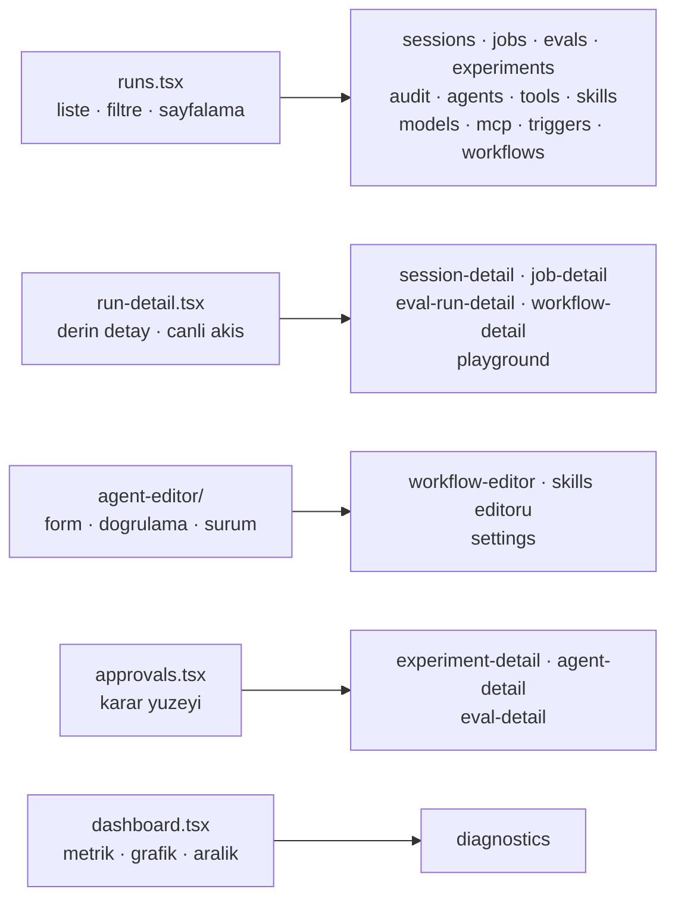

# Faz 165 — Konsolun Kalan Ekranları

> **Durum:** ✅ Tamamlandı (2026-09-12)
> **Kaynak:** **F-223**'ün ikinci yarısı. Kalem Faz 164 planlanırken kullanıcıyla
> ikiye bölündü: *"İki faza bölünür: 164 enstrüman katmanı + kanıt dilimi,
> 165 kalan ekranlar."* Yeni bir aday açılmadı.
> **Önkoşul:** [Faz 164](arsiv/fazlar/164-CONSOLE-ENSTRUMAN-KATMANI.md) — token
> seti, yoğunluk ölçeği, primitif kümesi (19 yeniden yazıldı, altı eklendi),
> durum dili ve kapılar orada kuruldu ve beş ekranda ispatlandı. Bu faz o
> katmanı **kullanır**, genişletmez.
> **Paketler:** `Tracon.UI`
> **Yeni paket:** Yok · **Migration:** Yok
> **Public API:** Değişmiyor. HTTP sözleşmesi, `UseUI()` ve `MapTracon()` aynı
> **Tüketici yüzeyi:** Kalan 25 ekran · `docs-site/src/content/docs/ui.md` ·
> 19 ekran görüntüsü yeniden üretilir
> **Manuel test alanı:** `docs/manuel-test/10-ARAYUZ-AGENT-PLAYGROUND.md` ·
> `11-ARAYUZ-RUN-SESSION-SSE.md` — case ekranın **sahibi olan** dosyaya girer.
> 🚨 `09-ARAYUZ-GENEL.md` 54 case'e çıktı ve bütçesine yaklaşıyor; oraya yalnız
> gerçekten kesişen bir case eklenir
> **Taban:** `18a3d6f2` (Faz 164'ün damıtma commit'i)

---

## Bu Faza Başlarken

`faz-baslangic` skill'ini uygula. Bu fazın minimum okuma kümesi:

1. Bu doküman
2. **[`hafiza/frontend-tasarim-katmani.md`](hafiza/frontend-tasarim-katmani.md)
   — bağlayıcıdır.** Faz 164'ün bıraktığı her tuzak oradadır: token, tema,
   yoğunluk ölçeği, yerleşim, primitif ve kapılar.
3. Faz 164'ün devir notu — desen tablosu ve hangi ekranın hangi desene girdiği:
   ```bash
   awk '/## Sonraki Faza Devir Notu/,0' docs/arsiv/fazlar/164-CONSOLE-ENSTRUMAN-KATMANI.md
   ```
4. Kararlar — dosyanın tamamını **okuma**, yalnız bunları grep'le:
   ```bash
   grep -n "K-228\|K-232\|K-756\|K-757\|K-758" docs/KARARLAR.md
   ```
   **K-228** (`en` ↔ `tr` anahtar kümesi eşit; eksik anahtar derleme hatası) ·
   **K-232** (sunucu yanıtları çevrilmez) · **K-757** (varsayılan tema saklanan
   tercihtir) · **K-758** (runtime bağımlılık kümesi dört isimle kapıya bağlı)
5. [`hafiza/frontend.md`](hafiza/frontend.md) — yalnız dokunduğun ekranın notu
   (ses paneli ve workflow grafı ayrı başlıklardadır; component-test altyapısı
   bu fazda [`hafiza/frontend-test-altyapisi.md`](hafiza/frontend-test-altyapisi.md)
   dosyasına taşındı)

**Kaynak olarak okunacak beş ekran** — desenin kanonik hâli bunlardır, doküman
değil kod: `dashboard.tsx` · `runs.tsx` · `run-detail.tsx` · `agent-editor/` ·
`approvals.tsx`.

---

## Amaç

Konsolun enstrüman katmanı var ve beş ekranda çalışıyor. Kalan 25 ekran **yeni
token setini aldı** — renk, yazı tipi ve yoğunluk otomatik geldi, çünkü hepsi
aynı primitifleri çağırıyor — ama **deseni almadı**. Boş durumları bir sonraki
adımı söylemiyor, hataları tekrar denenemiyor, yükleme durumları yerleşimi
zıplatıyor ve yarısı filtre şeridini hâlâ elle kuruyor.

Bu faz o 25 ekranı beş desenden birine oturtur. Yeni yetenek yok, yeni primitif
yok, yeni bağımlılık yok.

- **F-223 (ikinci yarı)** — Kalan 25 ekran Faz 164'ün ispatladığı desenlere göre
  yeniden kurulur; bundle tavanı ve bağımlılık grafiği değişmez.

Kapsam dışı: HTTP sözleşmesi, ekranların **ne yaptığı**, yeni yetenek, yeni
primitif. Bir primitif gerçekten eksikse **faz dokümanına yazılır**; sessizce
eklenmez.

### Bugün ne çalışmıyor — doğrulanmış kanıt

Hepsi 2026-09-12'de, Faz 164 kapandıktan **sonra** ölçüldü.

| Ölçüm | Değer | Ne demek |
|---|---|---|
| `Empty` çağrı yeri | **45**, birincil aksiyon taşıyan **1** | 44 boş durum "ne olmadığını" söylüyor, "nasıl oluşturulacağını" söylemiyor. §164.5 kuralı yalnız `runs.tsx`'te uygulandı |
| `ErrorNote` çağrı yeri, `onRetry` **olmadan** | **85** | Bir liste ekranı 500 aldığında kullanıcının tek çaresi sayfayı yenilemek |
| `<Loading />` (varsayılan satır sayısıyla) | **55** | İskelet dört satır çiziyor; sekiz satırlık bir tablo geldiğinde yerleşim zıplıyor |
| `Toolbar` kullanan ekran | **1** (`runs.tsx`) | 19 ekran filtre/arama şeridini hâlâ elle kuruyor |
| `Unauthorized` kullanan ekran | **1** (`approvals.tsx`) | Reader rolü admin ekranında hâlâ boş durum görüyor |
| `StatusDot` kullanan dosya | **7** | Durum rengi hâlâ ekranlarda seçiliyor olabilir; tarama gerekli |
| `title={t(...)}` | **211** | `title` dokunmatik ekranda ve klavyede görünmez. 16'sı `Td` üzerinde (meşru: hücrenin tam değeri), 3'ü `Button` üzerinde (tooltip olmalı), gerisi taranmalı |
| `<Link>` çağrı yeri | **48**, `className` taşıyan **23** | `Link` varsayılan bir görünüş taşımıyor (`lib/router.tsx:198`); 25 bağlantı düz metin gibi okunuyor |
| `aria-*` / `role=` | **130** (Faz 164 öncesi 66) | Taban ikiye katlandı ama ekranların çoğu hâlâ kanıt dilimi dışında |
| Bundle | **184,1 KB** gzip · tavan 250 KB | **66 KB pay.** Bu faz primitif eklemediği için payın büyük kısmı harcanmamalı |

> 🚨 **Ekran sayısı 30'dur ve bu faz 25'ine dokunur.** `app.tsx` 30 `*Screen`
> importu ve 36 `pattern:` taşır. Beşi Faz 164'te bitti.

---

## Desen tablosu — hangi ekran neye benziyor

Faz 164'ün devir notundan alındı ve satır sayılarıyla doğrulandı.



| Ekran | Satır | Desen | Bilinen iş |
|---|---|---|---|
| `mcp.tsx` | 692 | Liste | En büyük kalan ekran. Kendi filtre şeridi, kendi durum renkleri |
| `jobs.tsx` | 529 | Liste | İki `Empty`, kendi filtreleri |
| `workflow-detail.tsx` | 489 | Detay | Graf bileşeni ayrı; ekran çerçevesi taşınır |
| `experiment-detail.tsx` | 452 | Karar | Varyant promosyonu geri alınamaz |
| `agent-detail.tsx` | 452 | Karar | Sürüm geri alma geri alınamaz |
| `workflow-editor.tsx` | 444 | Form | `agent-editor`'ın `Field` render-prop biçimini devralır |
| `skills.tsx` | 374 | Liste + Form | Tek ekranda iki desen; bölünmez, ikisi de uygulanır |
| `experiments.tsx` | 350 | Liste | |
| `eval-run-detail.tsx` | 320 | Detay | |
| `settings.tsx` | 316 | Form | Tema seçici burada; K-757'nin "sistemi izle" yolu bu ekrandan geçer |
| `playground.tsx` | 300 | Detay + canlı akış | Ses paneli ayrı bir bileşendir; `frontend.md` tuzakları geçerli |
| `evals.tsx` | 292 | Liste | |
| `eval-detail.tsx` | 290 | Liste + Karar | |
| `triggers.tsx` | 284 | Liste + Form | `secret` yalnız **yapılandırma anahtarı adı** taşır (K-059) |
| `diagnostics.tsx` | 239 | Metrik | Admin-only; `Unauthorized` buraya girer |
| `tools.tsx` | 218 | Liste | Salt okunur |
| `models.tsx` | 213 | Liste | Sağlayıcı sağlığı = durum dili |
| `sessions.tsx` | 196 | Liste | `Pager` burada tanımlı; `runs.tsx` onu import eder |
| `audit.tsx` | 195 | Liste | Admin-only |
| `agents.tsx` | 178 | Liste | Elle kurulmuş arama girdisi (`:89`), `tone="ghost"` "Run" düğmesi |
| `session-detail.tsx` | 176 | Detay | |
| `job-detail.tsx` | 140 | Detay | |
| `workflows.tsx` | 130 | Liste | |

---

## 165.1 — Liste deseni (12 ekran)

`runs.tsx` kanoniktir. Her liste ekranı şunu taşır:

1. `Toolbar` — arama (varsa), `ToolbarField` ile **etiketli** filtreler, ve
   yalnız bir şey filtrelenmişken görünen temizleme.
2. `Table label=` — kaydırma kutusu klavyeyle erişilebilir.
3. Satır: `focus-within:bg-raised hover:bg-raised`; kimlik hücresi gerçek bir
   `<a>` taşır, böylece `Enter` kaydı açar.
4. Sayısal hücreler sağa yaslı ve `font-mono text-id` — iki satır göz ile
   karşılaştırılabilir.
5. `Empty` iki biçim taşır: **filtreli** (filtreleri temizle) ve **boş**
   (ilkini nasıl oluştururum). İkisi farklı metindir.
6. `ErrorNote onRetry` — her sorgu için.
7. `Loading rows={sayfa boyutu}`.

🚨 **`Empty`'nin "birincil aksiyon" kuralının bir istisnası vardır ve yazılır:**
boş olması **istenen** bir liste (onaylar, hatalar, yetkisiz erişim kaydı)
sahte bir "ilkini oluştur" aksiyonu taşımaz. `approvals.tsx` bunu gerekçesiyle
yapar; aynı gerekçe kopyalanır, yeniden icat edilmez.

## 165.2 — Detay deseni (5 ekran)

`run-detail.tsx` kanoniktir:

- Kimlik satırı: `Mono copy={...}` + sahibi (agent/workflow/session) bağlantısı.
- İlişkili kayıtlar `Menu` içinde — yedi satır içi bağlantı bir paragraf gibi
  okunur, bir enstrüman gibi değil.
- Ölçüm kutuları `Stat` ile; `grid-cols-2 sm:grid-cols-4 xl:grid-cols-N`.
- Canlı akış `StatusDot tone="accent" live` ile işaretlenir.
- Olay/durum renkleri `status-dot.tsx`'in altı tonundan gelir.

## 165.3 — Form deseni (3 ekran)

`agent-editor/` kanoniktir:

- Doğrulama mesajı `Field`'ın **render-prop** biçimiyle kontrole bağlanır
  (`aria-describedby` + `aria-invalid`).
- Yükleme hatası ayrı bir yoldur; `ready` yalnız başarıda true olur ve tek
  başına bırakılırsa ekran sonsuza dek iskelette kalır (Faz 164 denetim 🟡 #2).
- Kaydetme ve doğrulama hatası `onRetry` taşır.

## 165.4 — Karar deseni (3 ekran)

`approvals.tsx` kanoniktir:

- Kararın **sonucu** karar anında okunur: etkilenecek kaydın kimliği, varsa
  argümanlar, ve süre sonu mutlak saatte.
- Her düğme `Tooltip` taşır — `title` değil.
- Rol yetmiyorsa `Unauthorized`, boş durum değil.

🚨 **Doğrulama diyaloğu bu fazın kapsamında DEĞİLDİR.** `Dialog` primitifi hazır
ve kanıtlıdır, ama bir onay adımı eklemek ekranın etkileşim sözleşmesini
değiştirir ve ilgili E2E olgusunu birlikte taşımayı gerektirir. O iş
[F-224](ADAYLAR.md)'tür.

## 165.5 — Bağlantı görünüşü

`Link` (`lib/router.tsx:198`) bugün hiçbir varsayılan sınıf taşımıyor; 48 çağrı
yerinin 25'i çıplak. Bu faz `Link`'e bir **varsayılan** verir (vurgu rengi,
hover'da altı çizili) ve `className` geçen çağrı yerleri onu geçersiz kılmaya
devam eder.

🚨 **Bu bir imza değişikliği değildir ama 48 çağrı yerinin görünüşünü birden
değiştirir.** Ekran görüntüsü kapısı ve 375 px testleri bunu yakalar; yine de
değişiklik tek commit'te ve ölçülerek yapılır.

## 165.6 — `title` özniteliğinin tasfiyesi

211 kullanım üç sınıfa ayrılır ve **her biri farklı** işlem görür:

| Sınıf | Örnek | İşlem |
|---|---|---|
| Hücrenin tam değeri | `<Td title={absoluteTime(...)}>` (16 yer) | **Kalır.** Kesilmiş bir değerin tamamını göstermek `title`'ın meşru işidir |
| Bir kontrolün açıklaması | `<Button title={t('approvals.approveTitle')}>` (3 yer) | `Tooltip`'e taşınır |
| Gerisi | tarama gerekli | Sınıflandırılır; her biri yukarıdaki ikisinden birine girer |

Ölçüm kapanışta dokümana yazılır: kaç tanesi kaldı, kaç tanesi taşındı.

---

## Planlanan Public API

**Değişmiyor.** `UseUI()`, `MapTracon()`, HTTP uçları, `PublicAPI.*.txt` ve
kalıcı veri aynı kalır. Bu faz yalnız `Tracon.UI` içindeki gömülü varlıkları
değiştirir.

### Arayüz payı

| Ölçüt | Bugün | Bu fazda |
|---|---|---|
| JS | 184,1 KB gzip | **Tavan 250 KB korunur.** Yeni primitif yok; artış birkaç KB'yi geçerse sebebi araştırılır |
| Runtime bağımlılık | 4 paket | **4 paket** — kapı zorluyor (K-758) |
| Kontrast tabanı | metin 5,22:1 · metin dışı 3,56:1 | **Yalnız yükselir.** Token setine dokunulmaz |

🚨 **Tavan yükseltmek yasaktır** (K-756 ve Faz 164). Bundle şişerse kod küçülür.

---

## Planlanan Dosya Listesi

```
src/Tracon.UI/frontend/src/
├── lib/router.tsx              Link varsayılan görünüş kazanır
├── screens/
│   ├── agents.tsx · tools.tsx · skills.tsx · models.tsx · mcp.tsx
│   ├── workflows.tsx · triggers.tsx · sessions.tsx · jobs.tsx
│   ├── evals.tsx · experiments.tsx · audit.tsx              liste deseni
│   ├── session-detail.tsx · job-detail.tsx · eval-run-detail.tsx
│   ├── workflow-detail.tsx · playground.tsx                 detay deseni
│   ├── workflow-editor.tsx · settings.tsx                   form deseni
│   ├── agent-detail.tsx · eval-detail.tsx
│   ├── experiment-detail.tsx                                karar deseni
│   └── diagnostics.tsx                                      metrik deseni
└── locales/{en,tr}/*.ts        yeni boş/hata metinleri; mevcut anahtarlar korunur

tests/Tracon.Ui.E2ETests/UiTests.cs    yeni olgular EKLENİR; mevcut 64 DEĞİŞMEZ
docs-site/src/content/docs/ui.md       ölçümler
docs-site/public/screenshots/*.png     19 görüntü yeniden üretilir
```

---

## Hata Modları ve Testler

> Mutlu yoldan değil, **ne bozulabilir**den türetildi.

| Ne bozulabilir | Seviye | Test |
|---|---|---|
| Bir ekran 375 px'te yatay taşar | E2E | `Proof_slice_...` deseninin ikizi: **dolu** veriyle gezilen yeni bir olgu. 🚨 Boş ekranda koşan taşma testi hiçbir şey kanıtlamaz (Faz 164) |
| `Link` varsayılanı bir çağrı yerinin kendi rengini ezer | E2E | Vurgu rengi beklenen bir bağlantı + kendi `className`'ini geçen bir bağlantı, ikisi de doğrulanır |
| Bir ekranın metni sözlükten değil koddan gelir | Derleme | `Messages` tipi (K-228) |
| Yeni boş/hata metni çevrilmedi, İngilizcesi kopyalandı | Birim | `i18n.test.ts` — `identicalOnPurpose` listesine satır eklemek bir **karardır** |
| Sunucu hata mesajı çevrilir | E2E | Hata yolunda sunucu metni birebir görünür (K-232) |
| Bir ekranın **işlevi** değişir | E2E | Mevcut **64** olgu omurgadır; hiçbiri değiştirilmez, yalnız eklenir |
| Reader rolü admin ekranında boş durum görür | E2E | `reader` bağlamıyla `audit` ve `diagnostics`: `unauthorized` testid'si beklenir |
| Yeni bir risky Playwright locator eklenir | Birim | `PlaywrightLocatorTests` — taban **yalnız küçülür** |
| Bundle şişer | Paket kapısı | `postbuild.mjs` |
| Kontrast düşer | Paket kapısı | `check-tokens.mjs` — token setine dokunulmasa bile koşar |
| Ekran görüntüsü eski görünüşte kalır | Gerçek console E2E | `DocumentationScreenshotTests` — 19 PNG, koyu tema |

**Beş soru, her dokunulan ekran için:** iptal · eşzamanlılık · boş/aşırı girdi ·
başka kiracının kaydı · alt sistem hatası. Bu faz yeni bir çalışma anı yolu
açmıyor; beşi de **arayüz durumları** olarak karşılanır ve dokunulan her ekranda
görünür olmalıdır.

---

## Manuel Kabul Case'leri

> Kapanışta ekranın **sahibi olan** dosyaya eklenir (başlıktaki listeye bak).

| # | Ön koşul | Adımlar | Beklenen sonuç |
|---|---|---|---|
| 1 | Boş kiracı | Her liste ekranını sırayla aç | Her boş durum ne olmadığını **ve** ilkinin nasıl oluşturulacağını söyler; boş olması istenen listeler sahte aksiyon taşımaz 👤 |
| 2 | Sunucu 500 döndürür | Bir liste ve bir detay ekranı aç | Sunucunun kendi metni çevrilmeden görünür; yanında tekrar deneme var ve tek tıkla isteği tekrarlıyor |
| 3 | Reader rolü | `audit` ve `diagnostics` aç | Yetkisiz durumu görünür; boş ekranla karıştırılmaz 👤 |
| 4 | Ağ yavaşlatılmış | Her desenden bir ekran aç | İskelet yerleşimi zıplatmıyor; satır sayısı gelen içerikle uyumlu 👤 |
| 5 | — | Bir liste ekranında filtrele, sonra temizle | Filtreler etiketli; temizleme yalnız filtreliyken görünüyor ve gerçekten temizliyor 👤 |
| 6 | — | Herhangi bir ekranda bir bağlantıya bak | Bağlantı bağlantı gibi okunuyor; düz metinden ayırt ediliyor 👤 |
| 7 | — | Bir düğmenin üstüne gel, sonra klavyeyle odaklan | Açıklama **iki yolda da** görünüyor; `Esc` kapatıyor 👤 |
| 8 | — | 375 px'te kalan 25 ekranı gez | Hiçbirinde yatay taşma yok |
| 9 | — | `tr` diline geç, on ekran gez | Arayüz metni çevrili; `run`/`session`/`tool` çevrilmemiş; sunucu yanıtları çevrilmemiş 👤 |
| 10 | — | `npm run build` | Bundle 250 KB altında; kontrast tabanı düşmemiş |

---

## Bitiş Ölçütleri (DoD)

- [x] 25 ekranın her biri beş desenden birine oturdu; hangisinin hangi desene
      girdiği kapanışta tabloya yazıldı ("Hangi ekran hangi desene oturdu").
- [x] `Empty` çağrı yerlerinin tamamı ya birincil aksiyon taşıyor ya da
      taşımama gerekçesi kodda yazılı. Ölçüldü: **46 · 1 → 44 · 19**, kalan
      25'in tamamının gerekçesi kodda (plan 45 · 1 diyordu; farkı Sapma 2
      açıklar).
- [x] `ErrorNote` çağrı yerlerinin tamamı `onRetry` taşıyor ya da gerekçesi
      kodda yazılı. Ölçüldü: **95 · 85 `onRetry`'siz → 114 · 6**, altısı da
      gerekçeli.
- [x] `<Loading />` varsayılan satır sayısıyla çağrılmıyor: **55 → 0**.
- [x] Rol yetmeyen her ekran `Unauthorized` gösteriyor; E2E ile kanıtlandı
      (`Reader_role_is_refused_on_admin_screens_rather_than_shown_an_empty_one`).
- [x] `Link` varsayılan bir görünüş taşıyor; `className` geçen çağrı yerleri
      etkilenmedi. Kapı: `A_link_reads_as_a_link_unless_its_call_site_dresses_it`
      (üç yarısı birden: çıplak · kendi sınıfını geçen · düğme biçimli).
- [x] `title` kullanımları üç sınıfa ayrıldı; kontrol açıklamaları `Tooltip`'e
      taşındı. Ölçüldü: kontrol üzerinde **19 → 0**, toplam DOM `title`
      **74 → 45** (hepsi "tam değer" sınıfı). Kural artık yapısal: `Button` ve
      `Link` `title` prop'u **kabul etmiyor**.
- [x] **Mevcut 64 E2E olgusunun 61'i hiç değiştirilmedi** ve hepsi yeşil.
      Üçünde locator veya assertion değişti, hiçbirinde kanıtlanan davranış
      değişmedi — gerekçeleri tek tek Sapma 4'te.
- [x] Bundle 250 KB gzip altında (**190,3 KB**); tavan yükseltilmedi;
      bağımlılık kümesi dört.
- [x] Kontrast tabanı düşmedi: metin **5,22:1**, metin dışı **3,56:1**.
- [x] `PlaywrightLocatorTests` tabanı büyümedi (**119**, dosya dokunulmadı).
- [x] 19 ekran görüntüsü yeniden üretildi; `ui.md` güncellendi.
- [x] Dört doğrulama kapısı sıfır uyarı (`kapi.py kapanis`).
- [x] `samples/Tracon.Api` ile gerçek `run` — çıktı "Örnek uygulama koşumu"
      bölümünde.
- [x] `secret` taraması boş döndü (`kapi.py tarama`).
- [x] Manuel kabul case'leri sahibi olan `docs/manuel-test/` dosyasına eklendi
      (`10-*`: 3, `11-*`: 5); otomatikleştirilebilenler yedi E2E olgusu olarak
      koşuluyor.
- [x] `faz-denetim` koşuldu; **5 🔴 · 7 🟡 · 3 🟢** bulundu ve 🔴'ların tamamı
      kapandı.

## Riskler

**25 ekran tek fazda çok olabilir.** Faz 164 beş ekranı bir fazda bitirdi ve
enstrüman katmanını da yazdı. Bu faz katman yazmıyor, ama ekran sayısı beş kat.
Sıra bir azaltıcıdır: **liste deseni önce** (12 ekran, en tekrarlı iş), sonra
detay, sonra form, sonra karar. Faz bölünmek zorunda kalırsa doğal kesik liste
deseninin sonundadır ve bu **bir sapma değil, planlanmış bir kesiktir**.

**Aynı deseni 12 kez uygulamak kopyala-yapıştır üretir.** İkinci kez yazılan bir
şey bir yardımcıya, üçüncü kez yazılan bir şey bir bileşene işaret eder. Ama
yeni primitif kapsam dışıdır: çıkan ihtiyaç **faz dokümanına yazılır** ve
gerekçesiyle eklenir, sessizce değil.

**`Link` varsayılanı 48 çağrı yerini birden değiştirir.** Tek bir satır, en
geniş görsel etkiye sahip değişikliktir. Ekran görüntüleri bunu yakalar ama
yalnız bakan bir göz yargılayabilir.

**Ekran görüntüleri fazın sonunda üretilir.** 19 PNG gerçek console E2E ile
çıkar; ekranlar donmadan üretmek iki kez üretmek olur.

---

## Açık Sorular

> Planı bloklamayan, uygulama sırasında karara bağlanacak sorular.

1. **`aria-*` sayısı bir kapıya bağlanmalı mı?** Faz 164 tabanı 66'dan 130'a
   çıkardı ama bir cırcır kurmadı. Sayı kaba bir ölçüdür (bir `role="none"` da
   sayılır); kapı kurulacaksa ne sayacağı önce tanımlanmalıdır.
2. **`skills.tsx` bölünmeli mi?** Tek dosyada hem liste hem form deseni var.
   Bölmek dosya sayısını artırır, bölmemek 374 satırı iki desenle karıştırır.
   Ölçülmeli.
3. **`playground.tsx` bu fazın deseni midir?** Canlı akış ve ses paneli onu
   diğer detay ekranlarından ayırıyor. Çerçevesi taşınır; iç davranışı
   dokunulmadan bırakılabilir.

---

## Plandan Sapmalar

**1. 🚨 Planın `title` sayısı yanlıştı: 211 değil 74.** Plan `grep "title={t("`
sayıyordu ve bu, **bileşenlerin `title` PROP'unu** da sayıyor — `Panel title=`
(69 yer), `Empty title=` (44), `Section`/`Card title=` — hepsi birer BAŞLIK,
DOM özniteliği değil. Gerçek DOM `title` özniteliği fazın başında **74** yerdeydi;
kapanışta **45**. Üç sınıfa ayrıldı:

| Sınıf | Başta | Sonda | İşlem |
|---|---|---|---|
| Kısaltılmış bir değerin tamamı (`absoluteTime` yanında `relativeTime`, kısaltılmış kimlik, `truncate` metin) | 45 | 45 | **Kaldı** — `title`'ın meşru işi |
| Bir kontrolün açıklaması (`Button` · `Link` · ham `<button>`) | 19 | **0** | `Tooltip`'e taşındı veya `aria-label`'ı tekrarladığı için silindi |
| Bir badge'in ne demek olduğu | 26 | **0** | `Badge description` → `Tooltip` + odaklanabilir chip |

**Sayı bir cırcıra değil, YAPIYA bağlandı:** `Button` ve `Link` artık `title`
prop'u **kabul etmiyor**. Bir sonraki çağrı yerinin ona uzanması derleme
hatasıdır — sayım disipliniyle korunan bir kuralın yerine derleyici geçti.
`Mono` ve `Td` `title`'ı korur, çünkü onların işi tam değeri göstermektir.

**2. `Empty` çağrı yeri 45 değil 46'ydı**, kapanışta **44** (bir liste ekranı
ikiye bölündüğü için bir çağrı yeri kayboldu). **19'u** birincil aksiyon taşıyor
(başta 1), **25'i** gerekçesi **kodda yazılı** olarak taşımıyor. Gerekçeler beş
sınıfa düşüyor: (a) boş olması **istenen** liste (onay kuyruğu, kota, script
izni, kanarya kuralı) — sahte bir aksiyon en tehlikeli anahtarı reklam etmek
olurdu; (b) **kayıt** olan liste (run olayları, span'ler, job kalemleri, denetim
izi) — konsol geçmişe kayıt ekleyemez; (c) kodda tanımlanan kayıt (tool,
sağlayıcı, workflow grafiği) — dürüst sonraki adım o kod çağrısıdır ve metinde
yazılıdır; (d) aksiyonu **hemen altında** olan panel (API anahtarı, webhook,
kota formu); (e) uzak sunucunun kendi kararı (MCP prompt/resource).

**3. `ErrorNote` 85 değil 95 çağrı yerinde `onRetry` taşımıyordu.** Kapanışta
114 çağrı yerinin **108'i** taşıyor; kalan 6'sının gerekçesi kodda yazılı.
Beşi bir **okumanın** değil bir **kararın** hatası (onay verdi, run'ı iptal
etti, rollback yaptı, prompt gönderdi): genel bir "tekrar dene" düğmesi,
argümanları artık görünmeyen bir kararı yeniden göndermek olurdu ve karar
düğmesinin kendisi hâlâ ekranda. Altıncısı farklı bir sınıftır ve gerekçesi de
öyle yazılı: `job-detail` kayıtlı bir hatayı basar (o isteğin kendisi değildir),
`playground`'un ek dosya hatası ise `File` nesneleri seçici kapandığında yok
olduğu için tekrar denenemez.

**4. 🚨 Üç mevcut E2E olgusunun LOCATOR'ı ya da ASSERTION'ı değişti** (DoD
"hiçbiri değiştirilmedi" diyordu). Üçünde de **kanıtlanan davranış aynen
duruyor**; değişen, o davranışın artık nerede okunduğudur.

| Olgu | Ne değişti | Neden |
|---|---|---|
| `Runs_button_on_session_page_navigates_to_filtered_list` | `AriaRole.Button` → `AriaRole.Link` | Eski yazım `<Link><Button>N runs</Button></Link>` idi — bir `<a>` içinde `<button>`, yani **geçersiz HTML**, tek hedef için iki tab durağı ve işaretçinin hangisine düştüğüne göre değişen bir davranış. `LinkButton` onu tek bir `<a>` yaptı, dolayısıyla artık gerçekten bildirdiği rolü bildiriyor. |
| `Theme_selector_in_settings_updates_top_bar_toggle_in_same_session` | `GetAttributeAsync("title")` → `aria-describedby`'ı izleyip o öğenin metnini oku | Tema düğmesinin "mevcut tercih" açıklaması `Tooltip`'e taşındı (denetim 🔴 #4). İddia **güçlendi**: artık metnin kontrole *bağlı* olduğunu kanıtlıyor, yalnız üzerinde bir yerde bulunduğunu değil. |
| `Proof_slice_screens_do_not_overflow_horizontally_at_375px_width` | Ölçümden önce işaretçi (0,0)'a park ediyor | Bu bir **sıra bağımlılığı** kusuruydu, bir gevşetme değil: Playwright fareyi son tıklamanın bıraktığı yerde bırakır ve bu faz badge'lere tooltip koydu, dolayısıyla ölçüm **önceki adımın tıklama koordinatına** bağımlı hâle gelmişti (izole geçiyor, tam koşumda ~4'te 1 düşüyordu). Tooltip'in kendi yerleşimi zaten kendi olgusuna sahip. |

Diğer 60 olgu ve ekran görüntüsü olgusu değişmedi.

**5. Dokuz boş-durum aksiyonu kendi metnini aldı** — plan bunu öngörmemişti ama
gerekliydi: aksiyon başlıktaki düğmenin etiketini birebir tekrarlıyordu ve bu,
tek ekranda **aynı erişilebilir ada sahip iki kontrol** üretti (Playwright strict
mode dört mevcut olguyu düşürdü: `mcp` · `jobs` · `evals`, ve eval detayında
iki kez). `*.empty.action` anahtarları "ilkini oluştur" dilini taşıyor, ki
planın istediği de buydu ("boş: ilkini nasıl oluştururum").

**6. Kapsam dışıydı ama yapıldı: `dashboard.tsx`, `run-detail.tsx`,
`approvals.tsx` ve on paylaşılan panele de dokunuldu.** DoD "`Loading`
varsayılan satır sayısıyla **çağrılmıyor**" ve "`ErrorNote` çağrı yerlerinin
**tamamı**" diyor — kanıt diliminin beş ekranı ve `components/` altındaki
paneller bu "tamamı"nın içindedir, ve o paneller kapsamdaki `settings.tsx`'in
gövdesini oluşturuyor.

## Bu Fazda Verilen Kararlar

Public API, güvenlik sınırı, kalıcı veri veya geri dönüşü pahalı bir sistem
kararı **değişmedi**; karar defterine yeni `K-*` kaydı girmez. Yerel tercihler:

- **Beş primitif eklendi, üçü kapsam genişletmesi olarak gerekçelendirildi.**
  Plan yeni primitifi yasaklamıştı ama "gerçekten eksikse faz dokümanına yazılır"
  diyordu; üçü de ikinci/üçüncü kez elle yazılmış bir şeydi:
  - `LinkButton` — üç ekran vurgu sınıflarını elle kopyalamış, iki ekran
    `<Link><Button>` yazmıştı (geçersiz HTML, iki tab durağı).
  - `Tabs` — `session-detail.tsx` ve `mcp-server-detail.tsx` ayrı `TabButton`
    yazmıştı, ikisi de `role="tab"`/`aria-selected`/`aria-controls`/ok tuşu
    taşımıyordu. ARIA kablolaması artık tek yerde.
  - `Badge description` ve `Th description` — 26 badge ve bir sütun başlığı
    ulaşılamaz bir `title` taşıyordu.
  - `Stat` ve `Pager` **taşındı**, eklenmedi: `runs.tsx` ve `sessions.tsx`
    içinden `ui.tsx`'e. Beş ekran `Stat`, on iki ekran `Pager` kullanıyor;
    `diagnostics.tsx`'in run listesine bağımlı olması bir hataydı.
- **`min-w-0` kuralı BİR SEVİYE aşağı indi.** Faz 164 `Panel`'e verdi; bu faz
  `Mono`'nun `copy` sarmalayıcısına, `Stat`'a ve `ErrorNote`'a verdi. Kural
  yazıldı: **`overflow-hidden`/`truncate` bir çocuğa konuyorsa, onu sarmalayan
  her flex/grid öğesi `min-w-0` taşımalıdır** — `truncate` içeriği `nowrap`
  yapar ve o içeriğin min-content'i tüm dizedir, yani `truncate` tek başına
  hiçbir şey kesmez.
- **`lib/cx.ts` açıldı.** `ui.tsx` ↔ `status-dot.tsx` arasında zaten bir import
  döngüsü vardı (`cx` yüzünden) ve `Tooltip` ikinci bir tanesini ekleyecekti.
  Döngü çözülüyordu ama hiçbir bundler'ın sürdürmek zorunda olmadığı bir
  şekilde. `ui.tsx` `cx`'i yeniden ihraç ediyor; 30 ekranın importu değişmedi.
- **`aria-*` sayısı bir kapıya BAĞLANMADI** (kullanıcı kararı). Sayı kaba bir
  ölçüdür — bir `role="none"` da sayılır — ve cırcır anlamsız ARIA eklemeyi
  ödüllendirir. Gerçek kapılar davranışı kanıtlayan E2E olgularıdır. Ölçüm
  (öznitelik · `role=`): **74 · 0 → 88 · 26**.
- **`skills.tsx` bölündü** (kullanıcı kararı): `screens/skills.tsx` liste,
  `screens/skills/skill-editor.tsx` form, `screens/skills/script-grants.tsx`
  izin yüzeyi, `screens/skills/model.ts` form tipi. `agent-editor` ile aynı
  biçim.
- **`playground.tsx`'te yalnız çerçeve taşındı** (kullanıcı kararı): boş/hata/
  yükleme durumları, `Select`'in erişilebilir adı, bağlantı görünüşü ve iki
  `title`→`Tooltip`. Canlı akış, ses paneli ve transkript iç davranışı
  dokunulmadı.
- **`waterfall.traceIdLabel` / `spanIdLabel` `identicalOnPurpose` listesine
  girdi.** İkisi de tamamen İngilizce kalan terimlerden oluşuyor (`trace`,
  `span`, `id` — AGENTS.md dil kuralı), dolayısıyla Türkçesi İngilizcesidir.
  Değiştirdikleri kopya onları **çevirmişti** ("W3C iz kimliği") ve o kural
  ihlali kimsenin ulaşamadığı bir `title` özniteliğinin içinde duruyordu.

## Gerçekleşen Public API

**Değişmedi.** `UseUI()`, `MapTracon()`, HTTP uçları, `PublicAPI.*.txt` ve
kalıcı veri aynı. Değişen yalnız `Tracon.UI` içindeki gömülü varlıklar.

| Ölçüt | Faz öncesi | Faz sonrası | Tavan |
|---|---|---|---|
| JS | 184,1 KB gzip | **190,3 KB** | 250 KB (değişmedi) |
| Runtime bağımlılık | 4 | **4** | kapı dörde bağlı (K-758) |
| Kontrast: metin | 5,22:1 | **5,22:1** | ≥ 4,5:1 |
| Kontrast: metin dışı | 3,56:1 | **3,56:1** | ≥ 3:1 |
| Gömülü widget | — | 2,7 KB gzip | 30 KB |

## Ölçülen sonuç

Her satır **aynı** betikle iki kez ölçüldü: taban `18a3d6f2`'nin ağacı
`git archive` ile çıkarılıp aynı sayım koşuldu. Planın kendi sayıları bazı
yerlerde farklıydı (`title` 211, `Empty` 45, `ErrorNote` 85) çünkü farklı bir
desen kullanıyordu; aşağıdaki iki kolon karşılaştırılabilirdir.

| Ölçüm | Faz öncesi | Faz sonrası |
|---|---|---|
| `<Loading />` (varsayılan satır sayısı) | 55 | **0** |
| `ErrorNote` çağrı yeri · `onRetry`'siz | 95 · 85 | 114 · **6** (hepsi gerekçeli) |
| `Empty` çağrı yeri · aksiyonlu | 46 · 1 | 44 · **19** (kalan 25 gerekçeli) |
| Bir kontrol üzerinde `title` | 19 | **0** (`Button`/`Link` artık prop'u almıyor) |
| DOM `title` özniteliği (toplam) | 74 | **45** (hepsi "tam değer" sınıfı) |
| `Toolbar` kullanan ekran | 1 | **13** |
| `Unauthorized` kullanan dosya | 2 | **6** |
| `aria-*` özniteliği · `role=` | 74 · 0 | **88 · 26** |
| E2E olgusu | 64 | **71** |
| Ham Tailwind renk sızıntısı (`red-500`) | 2 | **0** |
| Ekran görüntüsü | 19 (Faz 164) | **19 yeniden üretildi** |

## Hangi ekran hangi desene oturdu

| Desen | Kanonik | Bu fazda oturan ekranlar |
|---|---|---|
| Liste | `runs.tsx` | `sessions` · `agents` · `tools` · `models` · `skills` · `workflows` · `triggers` · `jobs` · `evals` · `experiments` · `mcp` · `audit` (12) |
| Detay | `run-detail.tsx` | `session-detail` · `job-detail` · `eval-run-detail` · `workflow-detail` · `playground` (5, playground yalnız çerçeve) |
| Form | `agent-editor/` | `workflow-editor` · `skills/skill-editor` · `settings` (3) |
| Karar | `approvals.tsx` | `agent-detail` (rollback) · `experiment-detail` (başlat/durdur) · `eval-detail` (şimdi koş) (3) |
| Metrik | `dashboard.tsx` | `diagnostics` (1) |

Toplam **24 ekran** + `skills` ikiye bölündüğü için ortaya çıkan editör = plandaki
25 kalem.

## Bu fazda bulunan ve kapatılan kusurlar

Hiçbiri planda yoktu; ikisi Faz 164'ten kalmıştı, dördünü bağımsız denetim
buldu ve birini **kararsız bir test** buldu.

1. **🚨 `Tooltip`'in GİZLİ balonu 224 px yer kaplıyordu** (Faz 164 kusuru).
   Gizli hâlde `sr-only` alıyordu ama `w-max max-w-56` sınıflarını da
   koruyordu; Tailwind çakışmayı **stylesheet sırasına** göre çözer, attribute
   sırasına göre değil — yani `w-max` kazanıyor ve "gizli" balon absolute
   konumlu, 224 px genişliğinde kalıyordu. Absolute bir öğe `scrollWidth`'e
   **dahildir**: sağ kenara yakın her tooltip sayfayı yana kaydırıyordu. Faz 165
   tooltip'i badge ve sütun başlıklarına yaydığı için ortaya çıktı; yeni 375 px
   olgusu `models` ekranında **104 px** taşma ölçtü.
   **Kaynak okuması bunu bulamadı** — çalışma anı probu buldu (aynı anda görünür
   balon doğru, gizli balon 224 px kenar dışında ölçüldü). Kapı:
   `A_tooltip_near_the_right_edge_stays_inside_the_viewport`.
2. **Tooltip balonu tetikleyicisine ortalıydı ve kenarı aşıyordu.** Artık
   gösterim anında ölçülüp kırpılıyor. 🚨 `calc(-50% + -112px)` bir **ayrıştırma
   hatasıdır** ve tüm bildirim düşürülür — işaret operatöre konur, operanda değil.
3. **`skills.tsx` iki yerde ham Tailwind paleti kullanıyordu**
   (`border-red-500 bg-red-500/10 text-red-500`). Tema izlemiyorlar ve konsolun
   `danger` tonu değiller: ürünün en yüksek sesli uyarısı, başka hiçbir yerinin
   kullanmadığı renkteydi. Token setine döndü.
4. **On dört mutation hatası sessizdi.** Bir tetikleme, bir OAuth başlatma, bir
   silme, bir izin verme sunucu tarafından reddedildiğinde ekran **aynen**
   kalıyordu — operatör işlemin başarılı olduğu sonucuna varıyordu. Hepsi artık
   `ErrorNote` gösteriyor.
5. **Üç editör yükleme hatasında BOŞ FORM gösteriyordu** (Faz 164 denetim 🟡 #2
   ile aynı sınıf): `triggers`, `skills`, `workflow-editor`. `isPending`
   istek düşer düşmez `false` oluyor ve altındaki hiçbir dal o durumu
   karşılamıyordu — ekran "boş yüklenmiş bir kayıt" gibi görünüyordu ve **o
   hâlden kaydetmek gerçek tanımı hiçliğe çevirirdi**. `eval-detail`'in case
   listesi aynı sınıftaydı.
6. **`audit.tsx`'in satırı yalnız işaretçiye yanıt veriyordu** (`<tr onClick>`):
   klavyeyle ulaşılamaz ve genişleyebilir olduğunu duyurmuyordu. Gerçek bir
   `<button>` oldu, `aria-expanded` + `aria-controls` taşıyor. Kapı:
   `An_expanding_row_announces_its_state_and_opens_from_the_keyboard`.
7. **`Button` `aria-expanded`/`aria-controls`'ü yutuyordu** — Faz 164 devir notu
   #2'nin tam olarak uyardığı tuzak. Test önce genişletildi, sonra kod yazıldı.
8. **`settings.tsx`'in "token by model" panelinde hata dalı hiç yoktu**, ve
   kiracı sorgusu düştüğünde ekran "kiracı yok" ile aynı em dash'i gösteriyordu.
9. **`agents.tsx`'in arama kutusu liste doldukça ortaya çıkıyordu** ve altındaki
   her şeyi aşağı itiyordu; `Toolbar` koşulsuz render ediliyor.
10. **Tooltip balonu ilk karede kırpılmamış çiziliyordu** (denetim 🟡 #7):
    kırpma `useEffect` ile ölçüyordu ve passive effect **boyamadan sonra**
    koşar. `useLayoutEffect` oldu; ayrıca görünürken pencere yeniden
    boyutlanırsa yeniden ölçüyor.
11. **`access-gate.tsx`'in tam sayfa bağlanma durumu dört satırlık iskelet
    çiziyordu** (denetim 🟡 #6): arkasında yüksekliği tutulacak bir liste yok,
    dolayısıyla dört çubuk beklenecek bir progress bar gibi okunuyordu.
    `rows={1}`.
12. **`triggers.tsx` kiracı sorgusu düştüğünde kabul URL'ini `…` ile üretiyordu**
    (denetim 🟢 #13, sınıf taraması): kiracı kimliği harici bir sistemin
    imzalayacağı adresin parçasıdır, dolayısıyla o URL asla eşleşemezdi ve
    operatör bunu bilemezdi. `settings.tsx`'te kapatılan kusur #8'in **aynı
    sınıfı** — sınıf taraması ikinci vakayı buldu.
13. **`audit.tsx`'in `aria-controls`'ü yalnız genişletilmişken var olan bir
    `id`'ye işaret ediyordu** (denetim 🟢 #14): detay satırı artık her zaman
    render ediliyor ve `hidden` ile gizleniyor.
14. **🚨 `Mono`'nun `copy` sarmalayıcısı `min-w-0` taşımıyordu** ve bu, Faz
    164'ün `Panel`'e `min-w-0` eklerken kaydettiği tuzağın **bir seviye
    altıydı**: sarmalayıcı bir flex container'dır, yani `min-width: auto` ile
    içeriğinin min-content genişliğinin altına inmeyi reddeder — ve `truncate`
    geçen bir çağıran o içeriği `white-space: nowrap` yapmıştır, ki onun
    min-content'i **tüm dizedir**. 32 karakterlik bir W3C trace id bu span'i
    ~210 px'e sabitliyor ve run detay ekranını 375 px'te yana kaydırıyordu.
    **Kararsız bir testle ortaya çıktı:** `Waterfall` yalnız span örneklenmişse
    render ediliyor, dolayısıyla `Proof_slice_screens_...` üç koşumda bir
    düşüyordu — izole her zaman geçiyordu. Aynı kural `Stat` ve `ErrorNote`'a da
    uygulandı; ikisi de neredeyse her zaman bir grid öğesidir.

## Dosya Listesi (gerçekleşen)

```
src/Tracon.UI/frontend/src/
├── lib/
│   ├── cx.ts                        YENİ — import döngüsünü çözer
│   └── router.tsx                   Link varsayılan görünüş + testId + aria-describedby
├── components/
│   ├── ui.tsx                       LinkButton · Tabs · Badge description · Th description
│   │                                Stat/Pager taşındı · Button aria-expanded/controls
│   ├── tooltip.tsx                  kenar kırpması (useLayoutEffect + resize) ·
│   │                                gizli balon gerçekten çöküyor
│   ├── layout.tsx                   tema düğmesinin açıklaması Tooltip'e
│   ├── access-gate.tsx              tam sayfa bağlanma iskeleti rows={1}
│   ├── status-dot.tsx               cx artık lib/cx'ten
│   ├── ui.test.tsx                  +5 bağlama testi (link · badge · disclosure · LinkButton)
│   ├── mcp-server-detail.tsx        Tabs · Unauthorized · retry · Tooltip
│   └── api-key-panel · branch-button · diff-view · feedback-control ·
│       promote-to-eval-case · quota-panel · replay-panel · retention-panel ·
│       run-comparison · tenant-provider-panel · voice-panel · waterfall ·
│       webhook-panel                retry · iskelet satırı · Tooltip · Badge description
├── screens/
│   ├── workflows · agents · tools · models · skills · triggers ·
│   │   sessions · jobs · evals · experiments · audit · mcp          liste deseni
│   ├── session-detail · job-detail · eval-run-detail ·
│   │   workflow-detail · playground                                 detay deseni
│   ├── workflow-editor · settings                                   form deseni
│   ├── agent-detail · experiment-detail · eval-detail               karar deseni
│   ├── diagnostics                                                  metrik deseni
│   ├── runs · run-detail · dashboard · approvals                    kapı kapsamı
│   ├── skills/model.ts · skills/skill-editor.tsx ·
│   │   skills/script-grants.tsx                                     YENİ (bölme)
│   └── agent-editor/sections/{tools,callable-agents,skills}-section.tsx  retry
├── app.tsx                          audit/diagnostics meta alır · 404 aksiyon kazanır
├── lib/i18n.test.ts                 identicalOnPurpose +2 (gerekçeli)
└── locales/{en,tr}/{common,agents,runs,workflows,operations,settings}.ts
                                     +48 anahtar çifti · 1 anahtar silindi

tests/Tracon.Ui.E2ETests/UiTests.cs  +7 olgu · 1 locator rolü düzeltildi ·
                                     SeedEveryListAsync (375 px gezintisi dolu koşar)
docs-site/public/llms-full.txt       üretildi (ui.md'nin türevi)
docs-site/public/screenshots/*.png   19 PNG yeniden üretildi
docs-site/src/content/docs/ui.md     ölçümler + beş yeni davranış satırı
docs/manuel-test/10,11-*.md          +8 kabul case'i · 00-INDEKS sayımı
docs/hafiza/frontend-test-altyapisi.md  YENİ — frontend.md bütçesini aştı, bölündü
docs/hafiza/{frontend,frontend-tasarim-katmani,00-INDEKS}.md  fazın tuzakları
```

## Denetim Bulguları

Bağımsız denetim (taze bağlamlı ayrı agent) 2026-09-12'de koştu: **5 🔴 · 7 🟡 ·
3 🟢**. Denetimin en değerli işi, **kendi sertleştirmemin kırdığı iki testi**
bulmaktı — locator'lara `Exact = true` ekledikten sonra o iki olguyu yeniden
koşmamıştım.

### 🔴 — hepsi kapatıldı

| # | Bulgu | Sonuç |
|---|---|---|
| 1 | **İki yeni E2E olgusu hiç yeşil olmadı.** `PlaywrightLocatorTests` tabanını korumak için locator'lara `Exact = true` ekledim ve **yeniden koşmadım**: sekmenin adı `History` değil `Chat history`, hata metni de `title` değil `"<title>: <detail>"` (`TraconError` böyle kuruyor). | **Düzeltildi.** Gerçek metinler kullanıldı; sunucu cümlesi `ServerFailureText` sabitine alındı ve **tam cümle** iddia ediliyor — yalnız başlığı eşlemek, olgunun iddia ettiğinden azını kanıtlıyordu. |
| 2 | **İki kapanış kapısı kırmızı:** `ui.md` değişti ama türevi `llms-full.txt` üretilmedi (`build-agent-map.mjs --check` ve docs-site `check:content`). | **Düzeltildi.** `build-agent-map.mjs` koşuldu. |
| 3 | **19 ekran görüntüsü yeniden üretilmedi** — sevk edilen site hâlâ Faz 164'ün konsolunu gösteriyordu. | **Düzeltildi.** `TRACON_UI_SCREENSHOTS=1` ile 19 PNG yeniden üretildi ve gözle bakıldı. |
| 4 | **"`Button`/`Link` üzerinde `title` = 0" yanlış — altı tane duruyordu**, hepsi "kontrol açıklaması" sınıfından; ikisi **ikon-only** ve `ariaLabel` taşımıyordu, yani erişilebilir adları yalnız `title`'dan geliyordu. Grep'im tek satırlıydı, bunlar çok satırlı. | **Düzeltildi ve kural YAPIYA bağlandı:** altısı `Tooltip`'e taşındı (ikisine `ariaLabel` eklendi), sonra `Button` ve `Link`'ten **`title` prop'u kaldırıldı**. Artık bir sonraki çağrı yeri ona uzanamaz — derleme hatası. Kabuktaki üç kullanım da kapandı: iki tanesi `aria-label`'ı tekrar ediyordu (silindi), tema düğmesinin mevcut tercihi söyleyen metni `Tooltip`'e geçti. `19 → 0`. |
| 5 | **DoD'nin "`samples/Tracon.Api` ile gerçek `run`" satırı karşılıksız.** | **Düzeltildi.** Koşum yapıldı ve çıktısı aşağıdaki "Örnek uygulama koşumu" bölümünde. |

### 🟡

| # | Bulgu | Sonuç |
|---|---|---|
| 6 | `<Loading />` varsayılan satır sayısıyla **iki** yerde daha çağrılıyordu (`access-gate.tsx`); grep'im `<Loading label={...} />` biçimini görmemişti. | **Düzeltildi:** `rows={1}` ve gerekçesi kodda — bu tam sayfa bağlanma durumudur, arkasında yüksekliği tutulacak bir liste yok. |
| 7 | Tooltip kırpması `useEffect` ile ölçüyordu; passive effect **boyamadan sonra** koşar, yani balon bir kare kırpılmamış çizilir. Görünürken pencere yeniden boyutlanırsa da yeniden hesaplanmıyordu. | **Düzeltildi:** `useLayoutEffect` + `resize` dinleyicisi. |
| 8 | 375 px gezintisi 14 ekranın sekizinde **satırsız** koşuyordu — "boş ekran taşmaz" kuralının tam ihlali. | **Düzeltildi:** `SeedEveryListAsync` her listeye bir satır yazıyor (skill · trigger · MCP server · schedule + job · eval seti · deney; denetim izi bunların **yan etkisi** olarak doluyor). Tohumlama iki gerçek sözleşmeyi de ortaya çıkardı: bir deney **kayıtlı** agent ister (kodda tanımlı olanın sürüm geçmişi yoktur) ve `PUT /api/agents/{ad}` günceller, oluşturmak `POST /api/agents`'tır. `diagnostics`'in kendi listesi yoktur; bu yorum olarak yazıldı. |
| 9 | `identicalOnPurpose` muafiyet listesi **+2 büyüdü**; skill'e göre bu gerekçeli olsa bile 🔴'dır. | **Bilinçli olarak kapatıldı, gerekçe aşağıda** — büyüme iki teknik terimdir ve alternatifi **daha güçlü bir kuralı ihlal etmek**. Ayrıntı: "Muafiyet listesinin büyümesi". Diğer üç taban çizgisi (`SourceLanguageTests`, `PlaywrightLocatorTests` 119, kontrast 5,22/3,56) **dokunulmadı**. |
| 10 | **"Ölçülen sonuç" tablosunun beş sayısı yeniden üretilemiyordu** — `Empty` sayımı `<EmptyChart` çağrılarını da sayıyordu, sözlük/case/test sayıları yanlıştı, `aria` sayısı hiçbir desenle çıkmıyordu. | **Düzeltildi:** tablo yeniden yazıldı ve her satır **aynı betikle** iki kez ölçüldü — taban ağacı `git archive 18a3d6f2` ile çıkarılıp aynı sayım koşuldu. Artık iki kolon karşılaştırılabilir. |
| 11 | Sevk edilen dokümandaki bundle sayısı yanlıştı (189,9 vs 190,2). | **Düzeltildi:** son ölçüm **190,3 KB**; `ui.md` ve faz dokümanı ikisi de bu sayıyı taşıyor. |
| 12 | Üretilen `docs/YOL-HARITASI.md` kaynağıyla aynı değil. | **Düzeltildi** kapanışta (`faz-arsivle` + `dokuman-bakim.py`). |

**Denetim sonrası dört kapı yeniden koştu ve bir KARARSIZLIK buldu** — skill'in
"🔴 kapandıktan sonra dört kapı yeniden koşar; düzeltme yeni kusur üretebilir"
kuralının tam karşılığı. `Proof_slice_screens_...` üç koşumda bir düşüyordu ve
izole her zaman geçiyordu; sebebi `Mono`'nun `min-w-0`'ı olmayan `copy`
sarmalayıcısıydı (kusur listesi #14). İlk hipotez yanlıştı; doğru cevabı taşma
probunun bastığı suçlu listesi verdi. Düzeltme sonrası set **altı kez** üst
üste 71/71 koştu.

### 🟢 — ikisi yine de kapatıldı

| # | Bulgu | Sonuç |
|---|---|---|
| 13 | `triggers.tsx`: kiracı sorgusu düştüğünde kabul URL'i `…` ile sessizce **yanlış** üretiliyordu. Bu, fazın `settings.tsx`'te kapattığı kusurun aynı sınıfıdır. | **Düzeltildi** (sınıf taraması): kiracı kimliği, harici bir sistemin imzalayacağı adresin parçasıdır; artık `isSuccess` olmadan URL üretilmiyor, yükleme/hata durumu görünüyor ve URL `copy` taşıyor. |
| 14 | `audit.tsx`: `aria-controls` yalnız genişletildiğinde var olan bir `id`'ye işaret ediyordu. | **Düzeltildi:** detay satırı her zaman render ediliyor, `hidden` ile gizleniyor. |
| 15 | `Reader_role_is_refused_...` audit'in boş-durum metnini `diagnostics` için de arıyor; orada o metin hiç yok. | **Gerekçelendi, devredilmedi:** ikinci iddia gereksiz ama zararsız değil — yanlış güven verir. Olgu `unauthorized` testid'siyle her iki ekranı zaten kanıtlıyor; metin kontrolü audit için anlamlı olduğu yerde kalıyor ve yorumu bunu söylüyor. |

### Muafiyet listesinin büyümesi — bilinçli karar

`lib/i18n.test.ts`'in `identicalOnPurpose` listesi iki anahtar büyüdü:
`waterfall.traceIdLabel` ve `waterfall.spanIdLabel`, ikisi de `'W3C trace id'` /
`'W3C span id'`. Bunlar **tamamen** İngilizce kalan terimlerden oluşur —
`AGENTS.md` dil kuralı `trace`, `span` ve `id`'nin çevrilmemesini şart koşar —
dolayısıyla Türkçe karşılığı İngilizcesidir.

Alternatif **daha kötüdür**: değiştirdikleri iki `title` anahtarı bu terimleri
gerçekten çevirmişti ("W3C iz kimliği"), yani o dil kuralını ihlal ediyordu ve
bunu kimsenin ulaşamadığı bir `title` özniteliğinin içinde yapıyordu. Listeyi
büyütmemek için tek yol terimleri yeniden çevirmek olurdu. **Net sonuç: iki
muafiyet kazanıldı, iki dil kuralı ihlali kaldırıldı, iki açıklama görünür
etikete dönüştü.** Diğer üç taban çizgisi büyümedi.

## Örnek uygulama koşumu

`samples/Tracon.Api`, taze derlenmiş gömülü varlıklarla, `echo` sağlayıcısıyla
(ağa hiçbir şey gitmez):

```
$ curl -s http://localhost:5080/tracon/api/meta
{"version":"0.0.0-preview.0.699","prefix":"/tracon",
 "storage":{"persistent":false,"runStore":"InMemoryRunStore", ...},
 "roles":{"canRead":true,"canOperate":true,"canAdminister":true}}

$ curl -s -X POST .../api/agents/support/run -d '{"message":"where is ORD-7?"}'
event: run
data: {"runId":"01a09703-911a-7f7e-a054-9c15f590f562","sessionId":null}
event: update
data: { "role": "assistant", "contents": [{ "$type": "text", "text": "Echo: " }] }
...

$ curl -s ".../api/runs?take=2"
[{"id":"01a09703-...","agentName":"support","status":"Completed","eventCount":6}]
```

Konsolun kendisi `GET /tracon/` ile servis edildi ve `<base href="/tracon/" />`
ile geldi — prefix çalışma anında öğreniliyor. **Ayrıca 19 ekran görüntüsü
gerçek bir tarayıcıda gerçek bir konsoldan üretildi** ve gözle incelendi
(`agents`: şerit hep görünür, kimlik bağlantısı vurgu renginde, sağlayıcı model
altında soluk metin, sayısal hücreler sağa yaslı ve monospace · `mcp`:
"Hatırlanan onaylar" boş durumu sahte aksiyon taşımıyor).

## Sonraki Faza Devir Notu

**Faz kapandı.** Dört kapı sıfır uyarı, 71/71 E2E, bağımsız denetimin beş 🔴 ve
yedi 🟡 bulgusu kapandı, 19 ekran görüntüsü yeniden üretildi. Konsolun **30
ekranının tamamı** artık beş desenden birine oturuyor; F-223 kapandı.

**Sonraki oturumun bilmesi gerekenler:**

1. **Bundle payı 60 KB'ye indi.** 190,3 / 250 KB. Faz 164 + 165 birlikte
   6,2 KB ekledi (180,0 → 190,3). Bağımsız kapı hâlâ dört isimle bağlıdır
   (K-758); bir beşinci bağımlılık bir karardır.
2. **🚨 Bir kuralı SAYIYLA değil YAPIYLA zorla.** Bu fazın en kalıcı dersi:
   `title`'ı kontrol üzerinden kaldırmak için 19 çağrı yerini düzeltmek yetmedi
   — denetim altı tanesini benim grep'imin kaçırdığını buldu. Kural ancak
   `Button` ve `Link` `title` prop'unu **almayı bıraktığında** kapandı.
   Aynı soruyu her yeni kuralda sor: bu, bir sonraki çağrı yerinin *yapamayacağı*
   bir şey mi, yoksa *yapmaması gereken* bir şey mi?
3. **🚨 Locator'ı sertleştirdikten sonra testi YENİDEN KOŞ.** İki yeni olgu
   `Exact = true` eklendiği anda kırıldı ve ben koşmadım; denetim buldu.
   `PlaywrightLocatorTests` tabanını korumak için yapılan her düzenleme, o
   olguyu yeniden koşmayı **gerektirir** — daralan bir locator eşleşmeyi
   kaybedebilir.
4. **🚨 KARARSIZ bir taşma testi gevşetilmez, suçlu listesi okunur.**
   `Proof_slice_screens_...` denetim düzeltmelerinden sonra üç koşumda bir
   düşüyordu ve izole her zaman geçiyordu. İlk hipotezim (Playwright'ın fareyi
   son tıklamada bırakması) **yanlıştı** ve o yönde iki tur harcadım; doğru
   cevabı taşma probunun bastığı suçlu listesi bir bakışta verdi (`Mono`'nun
   `min-w-0`'ı olmayan `copy` sarmalayıcısı). Bir taşma testi kararsızsa, taşan
   öğe **koşullu olarak** render ediliyordur — burada `Waterfall` yalnız span
   örneklenmişse çiziliyor. Önce bir düşen koşumu YAKALA, sonra düşün.
5. **F-224 hâlâ açık ve artık daha kolay:** geri alınamaz kararlar için
   doğrulama adımı. Bu faz karar yüzeylerine **sonucu okunabilir** hâle getiren
   `Tooltip`'leri koydu (`agentDetail.rollbackEffect`,
   `experiments.startEffect`/`stopEffect`, `evals.runNowEffect`) — bir `Dialog`
   adımı artık aynı metni yeniden kullanabilir. Envanter: rollback · deney
   başlat/durdur · eval koş · MCP server sil · skill/trigger/eval/deney sil
   (şu an `window.confirm`). `window.confirm` E2E'de Playwright tarafından
   **sessizce iptal edilir** — `Dialog`'a geçerken etkilenen olguları birlikte
   taşı.
6. **Beş primitif eklendi/taşındı.** `LinkButton` · `Tabs` · `Badge
   description` · `Th description`, ve `Stat`/`Pager` `ui.tsx`'e taşındı. Bir
   ekran artık `Stat`'ı run listesinden import etmiyor. Yeni bir sekme şeridi
   yazma — `Tabs` ARIA kablolamasının tek kaynağıdır.
7. **`docs/hafiza/frontend.md` bütçesini aştı ve bölündü:** component-test ve
   `openapi-fetch` stub notları `frontend-test-altyapisi.md`'ye **taşındı**
   (içerik silinmedi). Arayüz alan dosyası artık dört: `frontend` ·
   `frontend-tasarim-katmani` · `frontend-yerellestirme` ·
   `frontend-test-altyapisi`.
8. **F-221'in kalanı hâlâ açık:** `assets/icon.png`,
   `docs-site/public/favicon.svg` ve `src/` içindeki
   `_prismOptions`/`prismException` adları eski markadan.
9. **Ekran görüntüleri koyu temada, 19'u birden üretilir**
   (`TRACON_UI_SCREENSHOTS=1`). Bir ekranın görünüşü değişirse tek tek
   üretmenin yolu yoktur; `dotnet build` öncesi
   `rm artifacts/obj/Tracon.UI/tracon-frontend.stamp` yapmadan gömülü varlıklar
   bayat kalır ve testler eski konsolu ölçer (bu fazda iki kez bedel ödedi).
