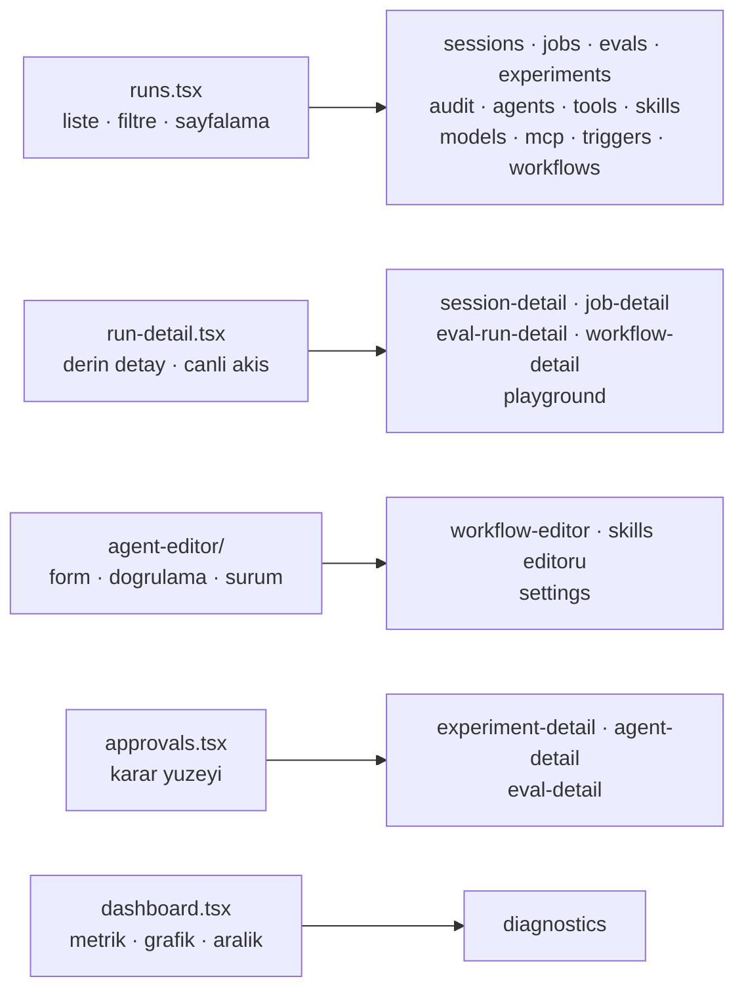

# Faz 165 — Konsolun Kalan Ekranları

> **Durum:** 📋 Planlandı (2026-09-12)
> **Kaynak:** **F-223**'ün ikinci yarısı. Kalem Faz 164 planlanırken kullanıcıyla
> ikiye bölündü: *"İki faza bölünür: 164 enstrüman katmanı + kanıt dilimi,
> 165 kalan ekranlar."* Yeni bir aday açılmadı.
> **Önkoşul:** [Faz 164](arsiv/fazlar/164-CONSOLE-ENSTRUMAN-KATMANI.md) — token
> seti, yoğunluk ölçeği, primitif kümesi (19 yeniden yazıldı, altı eklendi),
> durum dili ve kapılar orada kuruldu ve beş ekranda ispatlandı. Bu faz o
> katmanı **kullanır**, genişletmez.
> **Paketler:** `Tracon.UI`
> **Yeni paket:** Yok · **Migration:** Yok
> **Public API:** Değişmiyor. HTTP sözleşmesi, `UseUI()` ve `MapTracon()` aynı
> **Tüketici yüzeyi:** Kalan 25 ekran · `docs-site/src/content/docs/ui.md` ·
> 19 ekran görüntüsü yeniden üretilir
> **Manuel test alanı:** `docs/manuel-test/10-ARAYUZ-AGENT-PLAYGROUND.md` ·
> `11-ARAYUZ-RUN-SESSION-SSE.md` — case ekranın **sahibi olan** dosyaya girer.
> 🚨 `09-ARAYUZ-GENEL.md` 54 case'e çıktı ve bütçesine yaklaşıyor; oraya yalnız
> gerçekten kesişen bir case eklenir
> **Taban:** `18a3d6f2` (Faz 164'ün damıtma commit'i)

---

## Bu Faza Başlarken

`faz-baslangic` skill'ini uygula. Bu fazın minimum okuma kümesi:

1. Bu doküman
2. **[`hafiza/frontend-tasarim-katmani.md`](hafiza/frontend-tasarim-katmani.md)
   — bağlayıcıdır.** Faz 164'ün bıraktığı her tuzak oradadır: token, tema,
   yoğunluk ölçeği, yerleşim, primitif ve kapılar.
3. Faz 164'ün devir notu — desen tablosu ve hangi ekranın hangi desene girdiği:
   ```bash
   awk '/## Sonraki Faza Devir Notu/,0' docs/arsiv/fazlar/164-CONSOLE-ENSTRUMAN-KATMANI.md
   ```
4. Kararlar — dosyanın tamamını **okuma**, yalnız bunları grep'le:
   ```bash
   grep -n "K-228\|K-232\|K-756\|K-757\|K-758" docs/KARARLAR.md
   ```
   **K-228** (`en` ↔ `tr` anahtar kümesi eşit; eksik anahtar derleme hatası) ·
   **K-232** (sunucu yanıtları çevrilmez) · **K-757** (varsayılan tema saklanan
   tercihtir) · **K-758** (runtime bağımlılık kümesi dört isimle kapıya bağlı)
5. [`hafiza/frontend.md`](hafiza/frontend.md) — yalnız dokunduğun ekranın notu
   (ses paneli, workflow grafı, component-test altyapısı ayrı başlıklardadır)

**Kaynak olarak okunacak beş ekran** — desenin kanonik hâli bunlardır, doküman
değil kod: `dashboard.tsx` · `runs.tsx` · `run-detail.tsx` · `agent-editor/` ·
`approvals.tsx`.

---

## Amaç

Konsolun enstrüman katmanı var ve beş ekranda çalışıyor. Kalan 25 ekran **yeni
token setini aldı** — renk, yazı tipi ve yoğunluk otomatik geldi, çünkü hepsi
aynı primitifleri çağırıyor — ama **deseni almadı**. Boş durumları bir sonraki
adımı söylemiyor, hataları tekrar denenemiyor, yükleme durumları yerleşimi
zıplatıyor ve yarısı filtre şeridini hâlâ elle kuruyor.

Bu faz o 25 ekranı beş desenden birine oturtur. Yeni yetenek yok, yeni primitif
yok, yeni bağımlılık yok.

- **F-223 (ikinci yarı)** — Kalan 25 ekran Faz 164'ün ispatladığı desenlere göre
  yeniden kurulur; bundle tavanı ve bağımlılık grafiği değişmez.

Kapsam dışı: HTTP sözleşmesi, ekranların **ne yaptığı**, yeni yetenek, yeni
primitif. Bir primitif gerçekten eksikse **faz dokümanına yazılır**; sessizce
eklenmez.

### Bugün ne çalışmıyor — doğrulanmış kanıt

Hepsi 2026-09-12'de, Faz 164 kapandıktan **sonra** ölçüldü.

| Ölçüm | Değer | Ne demek |
|---|---|---|
| `Empty` çağrı yeri | **45**, birincil aksiyon taşıyan **1** | 44 boş durum "ne olmadığını" söylüyor, "nasıl oluşturulacağını" söylemiyor. §164.5 kuralı yalnız `runs.tsx`'te uygulandı |
| `ErrorNote` çağrı yeri, `onRetry` **olmadan** | **85** | Bir liste ekranı 500 aldığında kullanıcının tek çaresi sayfayı yenilemek |
| `<Loading />` (varsayılan satır sayısıyla) | **55** | İskelet dört satır çiziyor; sekiz satırlık bir tablo geldiğinde yerleşim zıplıyor |
| `Toolbar` kullanan ekran | **1** (`runs.tsx`) | 19 ekran filtre/arama şeridini hâlâ elle kuruyor |
| `Unauthorized` kullanan ekran | **1** (`approvals.tsx`) | Reader rolü admin ekranında hâlâ boş durum görüyor |
| `StatusDot` kullanan dosya | **7** | Durum rengi hâlâ ekranlarda seçiliyor olabilir; tarama gerekli |
| `title={t(...)}` | **211** | `title` dokunmatik ekranda ve klavyede görünmez. 16'sı `Td` üzerinde (meşru: hücrenin tam değeri), 3'ü `Button` üzerinde (tooltip olmalı), gerisi taranmalı |
| `<Link>` çağrı yeri | **48**, `className` taşıyan **23** | `Link` varsayılan bir görünüş taşımıyor (`lib/router.tsx:198`); 25 bağlantı düz metin gibi okunuyor |
| `aria-*` / `role=` | **130** (Faz 164 öncesi 66) | Taban ikiye katlandı ama ekranların çoğu hâlâ kanıt dilimi dışında |
| Bundle | **184,1 KB** gzip · tavan 250 KB | **66 KB pay.** Bu faz primitif eklemediği için payın büyük kısmı harcanmamalı |

> 🚨 **Ekran sayısı 30'dur ve bu faz 25'ine dokunur.** `app.tsx` 30 `*Screen`
> importu ve 36 `pattern:` taşır. Beşi Faz 164'te bitti.

---

## Desen tablosu — hangi ekran neye benziyor

Faz 164'ün devir notundan alındı ve satır sayılarıyla doğrulandı.



| Ekran | Satır | Desen | Bilinen iş |
|---|---|---|---|
| `mcp.tsx` | 692 | Liste | En büyük kalan ekran. Kendi filtre şeridi, kendi durum renkleri |
| `jobs.tsx` | 529 | Liste | İki `Empty`, kendi filtreleri |
| `workflow-detail.tsx` | 489 | Detay | Graf bileşeni ayrı; ekran çerçevesi taşınır |
| `experiment-detail.tsx` | 452 | Karar | Varyant promosyonu geri alınamaz |
| `agent-detail.tsx` | 452 | Karar | Sürüm geri alma geri alınamaz |
| `workflow-editor.tsx` | 444 | Form | `agent-editor`'ın `Field` render-prop biçimini devralır |
| `skills.tsx` | 374 | Liste + Form | Tek ekranda iki desen; bölünmez, ikisi de uygulanır |
| `experiments.tsx` | 350 | Liste | |
| `eval-run-detail.tsx` | 320 | Detay | |
| `settings.tsx` | 316 | Form | Tema seçici burada; K-757'nin "sistemi izle" yolu bu ekrandan geçer |
| `playground.tsx` | 300 | Detay + canlı akış | Ses paneli ayrı bir bileşendir; `frontend.md` tuzakları geçerli |
| `evals.tsx` | 292 | Liste | |
| `eval-detail.tsx` | 290 | Liste + Karar | |
| `triggers.tsx` | 284 | Liste + Form | `secret` yalnız **yapılandırma anahtarı adı** taşır (K-059) |
| `diagnostics.tsx` | 239 | Metrik | Admin-only; `Unauthorized` buraya girer |
| `tools.tsx` | 218 | Liste | Salt okunur |
| `models.tsx` | 213 | Liste | Sağlayıcı sağlığı = durum dili |
| `sessions.tsx` | 196 | Liste | `Pager` burada tanımlı; `runs.tsx` onu import eder |
| `audit.tsx` | 195 | Liste | Admin-only |
| `agents.tsx` | 178 | Liste | Elle kurulmuş arama girdisi (`:89`), `tone="ghost"` "Run" düğmesi |
| `session-detail.tsx` | 176 | Detay | |
| `job-detail.tsx` | 140 | Detay | |
| `workflows.tsx` | 130 | Liste | |

---

## 165.1 — Liste deseni (12 ekran)

`runs.tsx` kanoniktir. Her liste ekranı şunu taşır:

1. `Toolbar` — arama (varsa), `ToolbarField` ile **etiketli** filtreler, ve
   yalnız bir şey filtrelenmişken görünen temizleme.
2. `Table label=` — kaydırma kutusu klavyeyle erişilebilir.
3. Satır: `focus-within:bg-raised hover:bg-raised`; kimlik hücresi gerçek bir
   `<a>` taşır, böylece `Enter` kaydı açar.
4. Sayısal hücreler sağa yaslı ve `font-mono text-id` — iki satır göz ile
   karşılaştırılabilir.
5. `Empty` iki biçim taşır: **filtreli** (filtreleri temizle) ve **boş**
   (ilkini nasıl oluştururum). İkisi farklı metindir.
6. `ErrorNote onRetry` — her sorgu için.
7. `Loading rows={sayfa boyutu}`.

🚨 **`Empty`'nin "birincil aksiyon" kuralının bir istisnası vardır ve yazılır:**
boş olması **istenen** bir liste (onaylar, hatalar, yetkisiz erişim kaydı)
sahte bir "ilkini oluştur" aksiyonu taşımaz. `approvals.tsx` bunu gerekçesiyle
yapar; aynı gerekçe kopyalanır, yeniden icat edilmez.

## 165.2 — Detay deseni (5 ekran)

`run-detail.tsx` kanoniktir:

- Kimlik satırı: `Mono copy={...}` + sahibi (agent/workflow/session) bağlantısı.
- İlişkili kayıtlar `Menu` içinde — yedi satır içi bağlantı bir paragraf gibi
  okunur, bir enstrüman gibi değil.
- Ölçüm kutuları `Stat` ile; `grid-cols-2 sm:grid-cols-4 xl:grid-cols-N`.
- Canlı akış `StatusDot tone="accent" live` ile işaretlenir.
- Olay/durum renkleri `status-dot.tsx`'in altı tonundan gelir.

## 165.3 — Form deseni (3 ekran)

`agent-editor/` kanoniktir:

- Doğrulama mesajı `Field`'ın **render-prop** biçimiyle kontrole bağlanır
  (`aria-describedby` + `aria-invalid`).
- Yükleme hatası ayrı bir yoldur; `ready` yalnız başarıda true olur ve tek
  başına bırakılırsa ekran sonsuza dek iskelette kalır (Faz 164 denetim 🟡 #2).
- Kaydetme ve doğrulama hatası `onRetry` taşır.

## 165.4 — Karar deseni (3 ekran)

`approvals.tsx` kanoniktir:

- Kararın **sonucu** karar anında okunur: etkilenecek kaydın kimliği, varsa
  argümanlar, ve süre sonu mutlak saatte.
- Her düğme `Tooltip` taşır — `title` değil.
- Rol yetmiyorsa `Unauthorized`, boş durum değil.

🚨 **Doğrulama diyaloğu bu fazın kapsamında DEĞİLDİR.** `Dialog` primitifi hazır
ve kanıtlıdır, ama bir onay adımı eklemek ekranın etkileşim sözleşmesini
değiştirir ve ilgili E2E olgusunu birlikte taşımayı gerektirir. O iş
[F-224](ADAYLAR.md)'tür.

## 165.5 — Bağlantı görünüşü

`Link` (`lib/router.tsx:198`) bugün hiçbir varsayılan sınıf taşımıyor; 48 çağrı
yerinin 25'i çıplak. Bu faz `Link`'e bir **varsayılan** verir (vurgu rengi,
hover'da altı çizili) ve `className` geçen çağrı yerleri onu geçersiz kılmaya
devam eder.

🚨 **Bu bir imza değişikliği değildir ama 48 çağrı yerinin görünüşünü birden
değiştirir.** Ekran görüntüsü kapısı ve 375 px testleri bunu yakalar; yine de
değişiklik tek commit'te ve ölçülerek yapılır.

## 165.6 — `title` özniteliğinin tasfiyesi

211 kullanım üç sınıfa ayrılır ve **her biri farklı** işlem görür:

| Sınıf | Örnek | İşlem |
|---|---|---|
| Hücrenin tam değeri | `<Td title={absoluteTime(...)}>` (16 yer) | **Kalır.** Kesilmiş bir değerin tamamını göstermek `title`'ın meşru işidir |
| Bir kontrolün açıklaması | `<Button title={t('approvals.approveTitle')}>` (3 yer) | `Tooltip`'e taşınır |
| Gerisi | tarama gerekli | Sınıflandırılır; her biri yukarıdaki ikisinden birine girer |

Ölçüm kapanışta dokümana yazılır: kaç tanesi kaldı, kaç tanesi taşındı.

---

## Planlanan Public API

**Değişmiyor.** `UseUI()`, `MapTracon()`, HTTP uçları, `PublicAPI.*.txt` ve
kalıcı veri aynı kalır. Bu faz yalnız `Tracon.UI` içindeki gömülü varlıkları
değiştirir.

### Arayüz payı

| Ölçüt | Bugün | Bu fazda |
|---|---|---|
| JS | 184,1 KB gzip | **Tavan 250 KB korunur.** Yeni primitif yok; artış birkaç KB'yi geçerse sebebi araştırılır |
| Runtime bağımlılık | 4 paket | **4 paket** — kapı zorluyor (K-758) |
| Kontrast tabanı | metin 5,22:1 · metin dışı 3,56:1 | **Yalnız yükselir.** Token setine dokunulmaz |

🚨 **Tavan yükseltmek yasaktır** (K-756 ve Faz 164). Bundle şişerse kod küçülür.

---

## Planlanan Dosya Listesi

```
src/Tracon.UI/frontend/src/
├── lib/router.tsx              Link varsayılan görünüş kazanır
├── screens/
│   ├── agents.tsx · tools.tsx · skills.tsx · models.tsx · mcp.tsx
│   ├── workflows.tsx · triggers.tsx · sessions.tsx · jobs.tsx
│   ├── evals.tsx · experiments.tsx · audit.tsx              liste deseni
│   ├── session-detail.tsx · job-detail.tsx · eval-run-detail.tsx
│   ├── workflow-detail.tsx · playground.tsx                 detay deseni
│   ├── workflow-editor.tsx · settings.tsx                   form deseni
│   ├── agent-detail.tsx · eval-detail.tsx
│   ├── experiment-detail.tsx                                karar deseni
│   └── diagnostics.tsx                                      metrik deseni
└── locales/{en,tr}/*.ts        yeni boş/hata metinleri; mevcut anahtarlar korunur

tests/Tracon.Ui.E2ETests/UiTests.cs    yeni olgular EKLENİR; mevcut 64 DEĞİŞMEZ
docs-site/src/content/docs/ui.md       ölçümler
docs-site/public/screenshots/*.png     19 görüntü yeniden üretilir
```

---

## Hata Modları ve Testler

> Mutlu yoldan değil, **ne bozulabilir**den türetildi.

| Ne bozulabilir | Seviye | Test |
|---|---|---|
| Bir ekran 375 px'te yatay taşar | E2E | `Proof_slice_...` deseninin ikizi: **dolu** veriyle gezilen yeni bir olgu. 🚨 Boş ekranda koşan taşma testi hiçbir şey kanıtlamaz (Faz 164) |
| `Link` varsayılanı bir çağrı yerinin kendi rengini ezer | E2E | Vurgu rengi beklenen bir bağlantı + kendi `className`'ini geçen bir bağlantı, ikisi de doğrulanır |
| Bir ekranın metni sözlükten değil koddan gelir | Derleme | `Messages` tipi (K-228) |
| Yeni boş/hata metni çevrilmedi, İngilizcesi kopyalandı | Birim | `i18n.test.ts` — `identicalOnPurpose` listesine satır eklemek bir **karardır** |
| Sunucu hata mesajı çevrilir | E2E | Hata yolunda sunucu metni birebir görünür (K-232) |
| Bir ekranın **işlevi** değişir | E2E | Mevcut **64** olgu omurgadır; hiçbiri değiştirilmez, yalnız eklenir |
| Reader rolü admin ekranında boş durum görür | E2E | `reader` bağlamıyla `audit` ve `diagnostics`: `unauthorized` testid'si beklenir |
| Yeni bir risky Playwright locator eklenir | Birim | `PlaywrightLocatorTests` — taban **yalnız küçülür** |
| Bundle şişer | Paket kapısı | `postbuild.mjs` |
| Kontrast düşer | Paket kapısı | `check-tokens.mjs` — token setine dokunulmasa bile koşar |
| Ekran görüntüsü eski görünüşte kalır | Gerçek console E2E | `DocumentationScreenshotTests` — 19 PNG, koyu tema |

**Beş soru, her dokunulan ekran için:** iptal · eşzamanlılık · boş/aşırı girdi ·
başka kiracının kaydı · alt sistem hatası. Bu faz yeni bir çalışma anı yolu
açmıyor; beşi de **arayüz durumları** olarak karşılanır ve dokunulan her ekranda
görünür olmalıdır.

---

## Manuel Kabul Case'leri

> Kapanışta ekranın **sahibi olan** dosyaya eklenir (başlıktaki listeye bak).

| # | Ön koşul | Adımlar | Beklenen sonuç |
|---|---|---|---|
| 1 | Boş kiracı | Her liste ekranını sırayla aç | Her boş durum ne olmadığını **ve** ilkinin nasıl oluşturulacağını söyler; boş olması istenen listeler sahte aksiyon taşımaz 👤 |
| 2 | Sunucu 500 döndürür | Bir liste ve bir detay ekranı aç | Sunucunun kendi metni çevrilmeden görünür; yanında tekrar deneme var ve tek tıkla isteği tekrarlıyor |
| 3 | Reader rolü | `audit` ve `diagnostics` aç | Yetkisiz durumu görünür; boş ekranla karıştırılmaz 👤 |
| 4 | Ağ yavaşlatılmış | Her desenden bir ekran aç | İskelet yerleşimi zıplatmıyor; satır sayısı gelen içerikle uyumlu 👤 |
| 5 | — | Bir liste ekranında filtrele, sonra temizle | Filtreler etiketli; temizleme yalnız filtreliyken görünüyor ve gerçekten temizliyor 👤 |
| 6 | — | Herhangi bir ekranda bir bağlantıya bak | Bağlantı bağlantı gibi okunuyor; düz metinden ayırt ediliyor 👤 |
| 7 | — | Bir düğmenin üstüne gel, sonra klavyeyle odaklan | Açıklama **iki yolda da** görünüyor; `Esc` kapatıyor 👤 |
| 8 | — | 375 px'te kalan 25 ekranı gez | Hiçbirinde yatay taşma yok |
| 9 | — | `tr` diline geç, on ekran gez | Arayüz metni çevrili; `run`/`session`/`tool` çevrilmemiş; sunucu yanıtları çevrilmemiş 👤 |
| 10 | — | `npm run build` | Bundle 250 KB altında; kontrast tabanı düşmemiş |

---

## Bitiş Ölçütleri (DoD)

- [ ] 25 ekranın her biri beş desenden birine oturdu; hangisinin hangi desene
      girdiği kapanışta tabloya yazıldı.
- [ ] `Empty` çağrı yerlerinin tamamı ya birincil aksiyon taşıyor ya da
      taşımama gerekçesi kodda yazılı. Ölçülen sayı dokümana yazıldı (bugün
      45 çağrı yeri, 1 aksiyon).
- [ ] `ErrorNote` çağrı yerlerinin tamamı `onRetry` taşıyor ya da gerekçesi
      kodda yazılı (bugün 85 çağrı yeri `onRetry` olmadan).
- [ ] `<Loading />` varsayılan satır sayısıyla çağrılmıyor (bugün 55 yer).
- [ ] Rol yetmeyen her ekran `Unauthorized` gösteriyor; E2E ile kanıtlandı.
- [ ] `Link` varsayılan bir görünüş taşıyor; `className` geçen çağrı yerleri
      etkilenmedi.
- [ ] `title` kullanımları üç sınıfa ayrıldı; kontrol açıklamaları `Tooltip`'e
      taşındı. Kalan sayı dokümana yazıldı (bugün 211).
- [ ] **Mevcut 64 E2E olgusunun hiçbiri değiştirilmedi** ve hepsi yeşil.
- [ ] Bundle 250 KB gzip altında; tavan yükseltilmedi; bağımlılık kümesi dört.
- [ ] Kontrast tabanı düşmedi (metin 5,22:1 · metin dışı 3,56:1).
- [ ] `PlaywrightLocatorTests` tabanı büyümedi.
- [ ] 19 ekran görüntüsü yeniden üretildi; `ui.md` güncellendi.
- [ ] Dört doğrulama kapısı sıfır uyarı (`kapi.py kapanis`).
- [ ] `samples/Tracon.Api` ile gerçek `run` — çıktı belgeye yazıldı.
- [ ] `secret` taraması boş döndü.
- [ ] Manuel kabul case'leri sahibi olan `docs/manuel-test/` dosyasına eklendi;
      otomatikleştirilebilenler koşuldu.
- [ ] `faz-denetim` koşuldu; 🔴 bulgu kalmadı.

---

## Riskler

**25 ekran tek fazda çok olabilir.** Faz 164 beş ekranı bir fazda bitirdi ve
enstrüman katmanını da yazdı. Bu faz katman yazmıyor, ama ekran sayısı beş kat.
Sıra bir azaltıcıdır: **liste deseni önce** (12 ekran, en tekrarlı iş), sonra
detay, sonra form, sonra karar. Faz bölünmek zorunda kalırsa doğal kesik liste
deseninin sonundadır ve bu **bir sapma değil, planlanmış bir kesiktir**.

**Aynı deseni 12 kez uygulamak kopyala-yapıştır üretir.** İkinci kez yazılan bir
şey bir yardımcıya, üçüncü kez yazılan bir şey bir bileşene işaret eder. Ama
yeni primitif kapsam dışıdır: çıkan ihtiyaç **faz dokümanına yazılır** ve
gerekçesiyle eklenir, sessizce değil.

**`Link` varsayılanı 48 çağrı yerini birden değiştirir.** Tek bir satır, en
geniş görsel etkiye sahip değişikliktir. Ekran görüntüleri bunu yakalar ama
yalnız bakan bir göz yargılayabilir.

**Ekran görüntüleri fazın sonunda üretilir.** 19 PNG gerçek console E2E ile
çıkar; ekranlar donmadan üretmek iki kez üretmek olur.

---

## Açık Sorular

> Planı bloklamayan, uygulama sırasında karara bağlanacak sorular.

1. **`aria-*` sayısı bir kapıya bağlanmalı mı?** Faz 164 tabanı 66'dan 130'a
   çıkardı ama bir cırcır kurmadı. Sayı kaba bir ölçüdür (bir `role="none"` da
   sayılır); kapı kurulacaksa ne sayacağı önce tanımlanmalıdır.
2. **`skills.tsx` bölünmeli mi?** Tek dosyada hem liste hem form deseni var.
   Bölmek dosya sayısını artırır, bölmemek 374 satırı iki desenle karıştırır.
   Ölçülmeli.
3. **`playground.tsx` bu fazın deseni midir?** Canlı akış ve ses paneli onu
   diğer detay ekranlarından ayırıyor. Çerçevesi taşınır; iç davranışı
   dokunulmadan bırakılabilir.

---

## Plandan Sapmalar

> `faz-tamamlama` doldurur.

## Bu Fazda Verilen Kararlar

> `faz-tamamlama` doldurur.

## Gerçekleşen Public API

> `faz-tamamlama` doldurur.

## Dosya Listesi (gerçekleşen)

> `faz-tamamlama` doldurur.

## Denetim Bulguları

> `faz-tamamlama` doldurur.

## Sonraki Faza Devir Notu

> `faz-tamamlama` doldurur.
