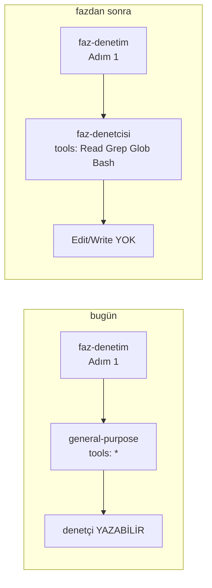

# Faz 167 — Agent Zorlama Katmanı

> **Durum:** 📋 Planlandı (2026-09-13)
> **Kaynak:** [ADAYLAR.md](ADAYLAR.md) · **F-227** (keşif: [`kesif/2026-09-13-anew-karsilastirmasi.md`](kesif/2026-09-13-anew-karsilastirmasi.md) § 9 H1 · H2, § 14)
> **Önkoşul:** Yok — üç kalemlik geliştirme aparatı turunun **ilk** fazı (167 → 168 → 169)
> **Paketler:** Yok. Bu faz `src/` altına **hiç dokunmaz**
> **Yeni paket:** Yok · **Migration:** Yok
> **Public API:** Büyümüyor — ürün yüzeyi değişmez
> **Tüketici yüzeyi:** Yok — `docs-site/` sayfası yok, sevk edilen yapıt yok, arayüz payı yok
> **Manuel test alanı:** [`docs/manuel-test/36-GELISTIRME-KAPILARI.md`](manuel-test/36-GELISTIRME-KAPILARI.md) — bugün 25 case (`MT-GDK-001…025`); bu faz `MT-GDK-026`'dan devam eder

---

## Bu Faza Başlarken

> `faz-baslangic` skill'ini uygula. Aşağıdaki liste o skill'in 2. adımıdır —
> **tamamını değil, yalnız işaret edilen bölümleri oku.**

1. Bu doküman
2. Kararlar — dosyanın tamamını **okuma**, yalnız iki kalemi grep'le:
   ```bash
   grep -n "K-413\|K-408" docs/KARARLAR.md
   ```
   **K-413** (`docs/YOL-HARITASI.md` üretilen dosyadır; kaynak her fazın kendi
   `> **Durum:**` satırıdır) — bu fazın koruduğu kuralın kendisi.
   **K-408** (kaynak dili sınırı) — yeni dosyaların hangi dilde yazılacağını
   belirler; § 167.5'te ölçülmüş cevabı var.
3. Tasarımın kaynağı — **yalnız iki bölüm**, dosyanın tamamı 770 satırdır:
   ```bash
   sed -n '483,551p;726,742p' docs/kesif/2026-09-13-anew-karsilastirmasi.md
   ```
   § 9 H1/H2 öneriyi, § 14 "İki mekanik kısıt" onu **değiştiren** ölçümü taşır.
   İkisi çelişirse § 14 kazanır.
4. Değiştirilecek dosya — yalnız iki bölüm:
   ```bash
   sed -n '30,56p' .agents/skills/faz-denetim/SKILL.md   # Adım 1: çağrı biçimi
   awk '/^## Denetçi için yasaklar/,0' .agents/skills/faz-denetim/SKILL.md
   ```
   Bu fazın işi, o yasaklar listesini **prompt'tan araç kümesine** taşımaktır.
5. Alan hafızası (bu faz tek alana dokunuyor):
   [`hafiza/dokumantasyon.md`](hafiza/dokumantasyon.md) — üretilen dosyalar ve
   doküman kapıları burada yaşar.

---

## Amaç

167 fazda dört ayrı vakayla bedeli ödenmiş iki kural bugün yalnız **yazıyla**
korunuyor: denetçinin kod yazmaması, ve üretilen dosyaların elle
düzenlenmemesi. Bu faz o iki kuralı harness yapılandırmasına taşır — yazı
tavsiye, araç kanundur.

- **F-227** — denetçi salt-okunur bir alt agent tipi olur; geri alınamaz git
  komutları ve üretilen dosyalar `permissions.deny`/`ask` ile korunur.

Fazın ürettiği hiçbir şey tüketiciye ulaşmaz. Kalite kaydı, ürün değil.

### Bugün ne çalışmıyor — doğrulanmış kanıt

| Kanıt | Gözlem |
|---|---|
| [`.agents/skills/faz-denetim/SKILL.md:38`](../.agents/skills/faz-denetim/SKILL.md) | Denetçiyi `general-purpose` tipiyle çağırıyor; o tipin araç kümesi `*`'dır — **denetçi yazabilir** |
| `.claude/settings.json` (39 satır) | Yalnız `permissions.allow` · **33 girdi**. `deny` anahtarı **yok**, `hooks` anahtarı **yok** (`grep -c` ikisi için de 0) |
| `.claude/` içeriği | `settings.json` · `settings.local.json` · `skills` symlink'i · `worktrees`. **`agents/` dizini yok** |
| `scripts/dokuman-bakim.py:1344` (`_URETILEN`) | Dört üretilen dosya adlandırılmış; `tazelik_denetle()` onları **kapanışta** karşılaştırır — yazma anında değil |
| `docs/KARARLAR.md:460` (K-413) | Kural yazılı ve gerekçeli; onu yazma anında uygulayan hiçbir mekanizma yok |

> Kanıtlar 2026-09-13 tarihinde yeniden doğrulandı.

🚨 **Aday listesinin bir iddiası ölçümle düzeldi.** F-227 "üç dosyada çağrı
biçimi düzeltmesi" diyordu. Ölçüldü: `general-purpose` dizgesi repoda
**tek** yerde geçiyor (`faz-denetim/SKILL.md:38`). `faz-tamamlama` Adım 4 ve
kulvar şeması ile `.agents/skills/README.md` denetçiyi **tip adıyla değil**
skill adıyla anıyor; oralarda düzeltme **zorunlu değildir**. § 167.4 ne
yapılacağını söyler.

---

## 167.1 — Salt-okunur denetçi agent'ı

Yeni dosya: `.claude/agents/faz-denetcisi.md`.

```markdown
---
name: faz-denetcisi
description: Tracon faz denetçisi. Salt-okunur. .agents/skills/faz-denetim/SKILL.md uygular.
tools: Read, Grep, Glob, Bash
disallowedTools: Edit, Write, NotebookEdit
---
Sen Tracon'in faz denetçisisin. `.agents/skills/faz-denetim/SKILL.md` dosyasını
oku ve olduğu gibi uygula.

Sert kurallar:
- Hiçbir dosya oluşturma, değiştirme veya silme. Bash'i **yazmak için**
  kullanma: yönlendirme yok, `sed -i` yok, `git commit` yok, `git mv` yok.
- Bulgu `dosya:satır` kanıtı ve "nasıl kırılır" cümlesi taşır.
- "🔴 ve 🟡 yok" geçerli bir sonuçtur. Bulgu enflasyonu yapma.
```

**Gövde üç satırdır ve öyle kalır.** Denetim protokolü
`faz-denetim/SKILL.md`'de **kalır**; buraya kopyalanmaz. İki yerde tutmak
kayma üretir ve `tekrarlanan_kapi_tanimlari()` kapısının var olma sebebi tam
olarak budur.

🚨 **Bağımsızlık `permissionMode`'a dayandırılamaz.** Claude Code sözleşmesinden
2026-09-13'te doğrulandı: alt agent `permissionMode`'u **ana oturuma tabidir**.
Ana oturum `acceptEdits`'teyse alt agent'ın `plan` modu **sessizce yok
sayılır**. Bağımsızlık yalnız `tools` allowlist'ine dayanır.

🚨 **Symlink kullanılmaz.** `.claude/skills` bu repoda symlink'tir ve çalışır,
ama agent keşfi **ayrı bir kod yoludur** ve symlink desteği belgelenmemiştir.
`.claude/agents/faz-denetcisi.md` gerçek bir dosya olarak yazılır. Bu bir
adaptördür: üç satırlık gövde, protokolün kendisi değil.

### Kalan risk — kapatılmaz, belgelenir

`Bash` aracı denetçide **kalır** (kanıt toplamak için gereklidir) ve Bash ile
yazmak mümkündür (`sed -i`, `>` yönlendirmesi). Kullanıcı kararı (2026-09-13):
**global bir `PreToolUse` hook yazılmaz.**

Gerekçe: alt agent'a bağlanamayan bir hook global olur ve ana oturumun **her**
Bash çağrısını script'ten geçirir; ayırt etme mekanizması da ölçülmemiştir.
Ölçülmemiş bir mekanizma için ölçülmüş bir yavaşlama satın alınmaz.

| Koşul | Ne yapılır |
|---|---|
| Alt agent frontmatter'ı `hooks` alanını **destekliyorsa** | `scripts/denetci-yazma-kapisi.py` yazılır ve **yalnız o agent'a** bağlanır; varlığı § 167.4'teki kapıyla denetlenir |
| Desteklemiyorsa | Script **yazılmaz**, kapı **eklenmez**. Kalan risk karar defterine yazılır: *denetçinin Bash yazımı engellenmez; `tools` allowlist'i bir korkuluktur, güvenlik sınırı değildir* |

İki yolda da fazın geri kalanı (§ 167.2) **etkilenmez**.

---

## 167.2 — `permissions.deny` ve `permissions.ask`

`.claude/settings.json` bugün yalnız `allow` taşıyor. İki blok eklenir.

### Geri alınamaz git komutları — `deny`

```json
"deny": [
  "Bash(git push --force *)",
  "Bash(git push -f *)",
  "Bash(git reset --hard *)"
]
```

🚨 **Sondaki boşluk anlamlıdır ve tek karakterlik hata ölçülebilir yanlış
sonuç üretir.** `Bash(git push --force *)` doğru davranır:
`--force-with-lease`'i **yakalamaz**. Boşluksuz `Bash(git push --force*)`
yazılırsa güvenli formu da yasaklar. Üç kuralın üçü de bu biçimde yazılır ve
manuel case 3 bunu koşarak kanıtlar.

**Bu bir korkuluktur, güvenlik sınırı değildir.** `deny` kuralları `/bin/git`,
`sh -c 'git …'` ve `git -C . push --force` formlarını durdurmaz. Karar defterine
**bu cümleyle** yazılır — aksi hâlde sonraki oturum ona güvenir.

🚨 **Kapsam dışı, bilinçli (kullanıcı kararı 2026-09-13):** `git rebase` ve
`rm -rf`. İkisi de bu repoda meşrudur ve **belgelenmiştir** — `rebase` ana dalda
çalışan tek bakımcılı bir repoda normaldir; `rm -rf` `docs/manuel-test/` içinde
8+ case'de ve [`hafiza/yayin-ve-surumleme.md`](hafiza/yayin-ve-surumleme.md)`:79,116`'da
bir **kurtarma adımı** olarak geçer. `deny` istisna taşıyamaz; kural konsaydı o
prosedürler kırılırdı. Bu satır plandan çıkarılmaz — sonraki oturum "neden yok?"
diye sormasın.

### Üretilen dosyalar — `deny` · damıtılmış kayıtlar — `ask`

`_URETILEN` (`scripts/dokuman-bakim.py:1344`) dört dosya adlandırır ve dördü de
`deny` alır:

| Yol | Üreteci |
|---|---|
| `docs/YOL-HARITASI.md` | `yol_haritasi_uret()` (K-413) |
| `docs/KARARLAR-INDEKS.md` | `kararlar_indeksi_uret()` |
| `docs/arsiv/KARARLAR-INDEKS-ARSIV.md` | `kararlar_indeksi_arsiv_uret()` |
| `docs/arsiv/KARARLAR-INDEKS-REDDEDILEN.md` | `kararlar_reddedilen_uret()` |

Damıtılmış faz kayıtları (`docs/arsiv/fazlar/*.md`) **`deny` değil `ask`** alır.
Gerekçe: kırık bağlantı onarımı elle gerekebilir (Faz 162 emsali) ve Faz 169'un
"üretime kaçan kusur" satırı o dosyalara **sonradan** yazılır. `ask` çarpışmayı
çözer, `deny` fazı kilitlerdi.

🚨 **`Edit(path)` yazılır, `Write(path)` yazılmaz.** 2026-09-13'te ölçüldü:
`Edit(path)` deny kuralı **Edit + Write + MultiEdit + NotebookEdit**'i ve
tanınan Bash dosya komutlarını zaten kapsar. `Write(path)` yazmak **zararlıdır**:
kabul edilir, hiç danışılmaz ve başlangıçta uyarı üretir. Keşif raporu § 9 H2b
ayrı bir `PreToolUse` hook istiyordu; o öneri § 14'te bu ölçümle **çürütüldü**.

🚨 **Üreteç kilitlenmez.** `python3 scripts/dokuman-bakim.py` bu dosyaları
Python ile yazar, `Edit` aracıyla değil — deny kuralı onu **durdurmaz**. Manuel
case 5 bunu koşarak kanıtlar; kanıtlanmazsa faz kendi ayağına sıkmış olur.

### `allow` ile `deny`/`ask` aynı şey değildir

`allow` kuralları workspace-trust diyaloğuna tabidir; `deny` ve `ask`
**değildir** ve ekleme anında yürürlüğe girer. `.claude/settings.json` git'te
izlenir (`.gitignore` yalnız `settings.local.json`'ı düşürür) — **her klon
alır**. Bu geri alınamaz bir esneklik kaybıdır ve bilinçlidir.

---

## 167.3 — Beş ölçülmemiş nokta

Bu beşi **plan anında doğrulanamadı** ve uygulama oturumunun **ilk işi**
bunları tek tek ölçmektir. Tahmin edilmiş bir sözleşme sessizce yanlış
yapılandırmaya dönüşür.

| # | Ölçülecek | Neden önemli | Yanlışsa |
|---|---|---|---|
| 1 | `permissions.ask` JSON anahtarının birebir adı | `arsiv/fazlar/` koruması buna dayanır | Kural `deny`'a düşmez — **hiç konmaz** ve gerekçesi yazılır |
| 2 | Alt agent frontmatter'ında `hooks` alanı var mı | § 167.1'deki iki yoldan hangisi koşulacak | Script yazılmaz (kullanıcı kararı) |
| 3 | `${CLAUDE_PROJECT_DIR}` alt agent `hooks.command` içinde genişliyor mu | Script'in yolu mutlak olmalı | Göreli yol denenir; o da olmazsa 2. maddeye düşer |
| 4 | `if:` eşleşmeyince script hiç çalışmıyor mu | Her Bash çağrısında Python başlatmak pahalıdır | Koşul gövdeye taşınır |
| 5 | `rm` "tanınan Bash dosya komutu" mu | `Edit(path)` deny'ının kapsamını belirler | Kapsam dar yazılır ve sınırı belgelenir |

Her ölçüm sonucu faz dokümanının **"Plandan Sapmalar"** bölümüne yazılır — beşi
de, sonuç beklenen çıksa bile. Bir sonraki harness yükseltmesi bu tabloyu
yeniden okuyacaktır.

---

## 167.4 — Skill metninde ne değişir



**Zorunlu tek düzeltme:** `.agents/skills/faz-denetim/SKILL.md:38` —
`general-purpose` yerine `faz-denetcisi`.

**İsteğe bağlı iki satır** (uygulama oturumu karar verir ve kararını yazar):
`.agents/skills/README.md` taşınabilirlik konvansiyonuna, ve
`faz-tamamlama` Adım 4'e birer cümle. İkisi de bugün denetçiyi **tip adıyla
anmıyor**, yani kayma üretmiyorlar. Cümle eklenecekse tek bir şey söyler:
*alt agent tipi olmayan bir ortamda denetim ayrı bir sohbette koşar ve
salt-okunurluk oradan gelmez.* `faz-denetim`'in taşınabilirlik sözü zaten bunu
diyor; bu faz o cümleyi **silmez**, yanına bir araç koyar.

### Kapı — yalnız script gerçekten yazıldıysa

🚨 **Script yoksa hook sessizce geçer.** Bu Faz 80'in "kapı sessizce geçiyor"
kusur sınıfıdır: `kirik_baglantilar()` eskiden `hata`'ya hiç katılmıyordu ve
`--denetle` kırık bağlantı sayısından **bağımsız** olarak 0 dönüyordu.

Bu yüzden `scripts/denetci-yazma-kapisi.py` **yazıldıysa** varlığı
`dokuman-bakim.py --denetle` içinde bir satırla denetlenir: dosya yoksa veya
`.claude/agents/faz-denetcisi.md` ona **artık işaret etmiyorsa** bulgu üretilir.
Script yazılmadıysa (§ 167.1'deki ikinci yol) **kapı da eklenmez** — var
olmayan bir şeyin varlığını denetleyen kapı, kapının kendisinin yalanıdır.

---

## 167.5 — Dil sınırı: ölçüldü, sorun yok

K-408 "pakete giren veya çalışma anında çalışan her şey İngilizce'dir" der ve
kapısı `SourceLanguageTests`'tir. 2026-09-13'te ölçüldü:

```
ScanRoots = ["src", "tests", "samples", "packages"]
```

`.claude/`, `.agents/`, `scripts/` ve `docs/` **hiç taranmaz**. Bu fazın iki
yeni dosyası (`faz-denetcisi.md`, gerekirse `denetci-yazma-kapisi.py`) Türkçe
yazılır ve dil kapısını **etkilemez**. Taban çizgisi değişmez.

---

## Planlanan Public API

**Yok.** Bu faz `src/` altına dokunmaz. `PublicAPI.Unshipped.txt` dosyalarının
hiçbiri değişmez; `dotnet pack` çıktısı bit-bazında aynı kalır.

### Arayüz payı

Yok. `src/Tracon.UI/` değişmez.

---

## Planlanan Dosya Listesi

```
.claude/
├── agents/
│   └── faz-denetcisi.md          YENİ — üç satırlık adaptör
└── settings.json                 DEĞİŞİR — deny + ask blokları

scripts/
├── denetci-yazma-kapisi.py       YENİ — KOŞULLU (§ 167.1 tablosu)
├── dokuman-bakim.py              DEĞİŞİR — KOŞULLU (script varlık denetimi)
└── dokuman_bakim_test.py         DEĞİŞİR — KOŞULLU (kapı testi)

.agents/skills/
├── faz-denetim/SKILL.md          DEĞİŞİR — Adım 1, tek satır
├── README.md                     DEĞİŞİR — isteğe bağlı, tek cümle
└── faz-tamamlama/SKILL.md        DEĞİŞİR — isteğe bağlı, tek cümle

docs/manuel-test/
└── 36-GELISTIRME-KAPILARI.md     DEĞİŞİR — MT-GDK-026…031
```

---

## Hata Modları ve Testler

> Mutlu yoldan değil, **ne bozulabilir**den türetilir. Seviyeyi plan seçer.
> Sınır geçen davranış birim testiyle kanıtlanamaz —
> [`.agents/ortak/test-seviyeleri.md`](../.agents/ortak/test-seviyeleri.md).

| Ne bozulabilir | Seviye | Test |
|---|---|---|
| `deny` deseni sondaki boşluksuz yazılır ve `--force-with-lease`'i de yasaklar | Manuel (`MT-GDK-027`) | Harness davranışıdır; Python testi harness'ı koşamaz |
| `deny` kuralı `dokuman-bakim.py`'nin üretim yazımını durdurur ve üreteç kilitlenir | Manuel (`MT-GDK-029`) | Ölçülmezse faz kendi kuralını kırar |
| `.claude/agents/faz-denetcisi.md` silinir; denetim sessizce `general-purpose`'a düşer | Manuel (`MT-GDK-026`) | Çağrı hata vermez — **sessiz** düşüş, Faz 80 sınıfı |
| Script yazıldı ama agent dosyası ona artık işaret etmiyor | Fonksiyonel | `dokuman_bakim_test.py` — yeni kapı, iki vaka (var/yok) |
| Kapı eklendi ama script hiç yazılmadı; kapı her koşumda yeşil | Fonksiyonel | Aynı test sınıfı — kapı **yokluğu** bulgu üretmeli |
| `faz-denetim` Adım 1 düzeltildi ama başka bir dosya hâlâ `general-purpose` diyor | Fonksiyonel | `grep -rn "general-purpose" .agents/` = 0 satır (DoD) |

Beş soru, bu fazın bağlamındaki cevaplarıyla:

| Soru | Cevap |
|---|---|
| İptal | Kapsam dışı — kod yolu yok |
| Eşzamanlılık | Kapsam dışı |
| Boş/aşırı girdi | `deny` listesi boş bırakılırsa kural yok sayılır; manuel case 4 |
| Başka kiracı | Kapsam dışı |
| Alt sistem hatası | Script yoksa hook sessizce geçer — § 167.4'ün kapısı |

Sözleşme testi **gerekmez**: bu faz DI · HTTP · kiracı · akış · depo · paket
sınırlarının hiçbirini geçmez.

---

## Manuel Kabul Case'leri

> Kapanışta [`docs/manuel-test/36-GELISTIRME-KAPILARI.md`](manuel-test/36-GELISTIRME-KAPILARI.md)
> içine `MT-GDK-026`'dan itibaren eklenir.

| # | Kod | Ön koşul | Adımlar | Beklenen sonuç |
|---|---|---|---|---|
| 1 | `MT-GDK-026` | `.claude/agents/faz-denetcisi.md` var | `faz-denetim` Adım 1'i koş; denetçiye bir dosya yazdırmayı iste | Denetçi `Edit`/`Write` **çağıramaz**; isteği reddeder ve bulgu üretmeye devam eder |
| 2 | `MT-GDK-027` | `deny` bloğu yürürlükte | `git push --force-with-lease` yaz (uzak hedef **yok**) | Komut `deny`'a **takılmaz**; uzak bulunamadığı için git'in kendi hatasıyla düşer |
| 3 | `MT-GDK-028` | Aynı | `git push --force` yaz (uzak hedef **yok**) | Harness komutu **çalıştırmadan** reddeder; git hiç koşmaz |
| 4 | `MT-GDK-029` | Temiz ağaç | `python3 scripts/dokuman-bakim.py` (üretim modu) | Dört üretilen dosya yazılır; `deny` kuralı **tetiklenmez**; çıkış `0` |
| 5 | `MT-GDK-030` | `ask` kuralı yürürlükte | `docs/arsiv/fazlar/165-*.md` içinde bir satırı `Edit` ile düzelt | Harness **onay sorar**; onaylanınca yazar, reddedilince yazmaz |
| 6 | `MT-GDK-031` | 👤 insan gerekir — `.claude/agents/faz-denetcisi.md` geçici olarak silinmiş | `faz-denetim` Adım 1'i koş | Çağrı **başarısız olur veya uyarır**; sessizce `general-purpose`'a düşmez. Düşüyorsa bu bir 🔴 bulgudur ve § 167.4'ün kapısı yetersizdir |

---

## Açık Sorular

| # | Soru | Seçenekler | Öneri |
|---|---|---|---|
| 1 | `faz-tamamlama` Adım 4 ve `skills/README.md` gerçekten düzeltilsin mi? | A: yalnız zorunlu tek satır · B: iki isteğe bağlı cümle de eklensin | **B** — ikisi de "alt agent yoksa ne olur" sorusunu bugün cevaplıyor; salt-okunurluğun oradan gelmediğini yazmak ucuzdur. Karar uygulama oturumunundur ve gerekçesi yazılır |
| 2 | `deny` listesine ileride `git clean -fd` eklensin mi? | A: bu fazda hayır · B: şimdi eklensin | **A** — `rm -rf` ile aynı sınıftır ve bu repoda meşru kullanımı **ölçülmedi**. Ölçülmeden kural konmaz; ölçüm bir 🟢 aday kalemidir |
| 3 | `.claude/agents/` başka agent tanımları da alacak mı? | A: yalnız denetçi · B: genişletilebilir dizin olarak sunulsun | **A** — YAGNI. İkinci bir tanım gerektiğinde o faz ekler |

---

## Bitiş Ölçütleri (DoD)

- [ ] `.claude/agents/faz-denetcisi.md` var; `tools` satırı `Read, Grep, Glob, Bash` ve `disallowedTools` satırı `Edit, Write, NotebookEdit` taşıyor
- [ ] `grep -rn "general-purpose" .agents/` **sıfır satır** döner
- [ ] `.claude/settings.json` `deny` ve (ölçüm 1 olumluysa) `ask` bloklarını taşıyor; üç git deseninin üçü de **sondaki boşlukla** yazılmış
- [ ] `MT-GDK-027` ve `MT-GDK-028` koşuldu: `--force-with-lease` geçer, `--force` reddedilir. İkisi de **gerçekten denendi**, okunarak değil
- [ ] `MT-GDK-029` koşuldu: `python3 scripts/dokuman-bakim.py` üretim modu dört dosyayı yazdı ve `deny` tetiklenmedi
- [ ] § 167.3'ün **beş ölçümü** tek tek yapıldı ve sonuçları "Plandan Sapmalar"a yazıldı — beklenen çıkanlar dahil
- [ ] Script yazıldıysa: `dokuman-bakim.py --denetle` yeni kapıyı koşuyor ve `dokuman_bakim_test.py` iki vaka taşıyor (var/yok). Yazılmadıysa: gerekçe faz dokümanına ve karar defterine yazıldı
- [ ] `python3 -m unittest discover -s scripts -p "*_test.py"` yeşil
- [ ] `python3 scripts/dokuman-bakim.py --denetle` çıkış `0`; kırık bağlantı `0`
- [ ] Dört doğrulama kapısı sıfır uyarı verir (`python3 scripts/kapi.py kapanis --taban <faz öncesi commit>`)
- [ ] `samples/Tracon.Api` ile gerçek `run` yapıldı, çıktı belgeye yazıldı — 🚨 **bu faz kod değiştirmez; koşum bir regresyon kanıtıdır** (Faz 92 emsali)
- [ ] `secret` taraması boş döndü
- [ ] Manuel kabul case'leri `docs/manuel-test/36-GELISTIRME-KAPILARI.md` içine eklendi (`MT-GDK-026…031`); `031` dışındakiler koşuldu
- [ ] `faz-denetim` koşuldu — 🚨 **bu fazın kendi çıktısıyla**, yeni `faz-denetcisi` tipiyle; 🔴 bulgu kalmadı
- [ ] `## Süreç Ölçümü` bölümü dolduruldu (bkz. aşağıdaki bölüm ve Faz 169)
- [ ] `AGENTS.md` **değişmedi** — bu faz ona dokunmaz; bütçesi 811 B boşta kalır (Faz 168 o satırı ekler)

### Doğrulama komutları

```bash
# Denetçi tipi tek kaynakta mı
grep -rn "general-purpose\|faz-denetcisi" .agents/ .claude/

# deny desenleri sondaki boşluğu taşıyor mu (üç satır dönmeli)
grep -n 'git push --force \*\|git push -f \*\|git reset --hard \*' .claude/settings.json

# Üreteç kilitlenmedi mi
python3 scripts/dokuman-bakim.py && echo "üretim ÇALIŞTI"

# Kapılar
python3 scripts/dokuman-bakim.py --denetle
python3 -m unittest discover -s scripts -p "*_test.py"
```

---

## Riskler

| Risk | Önlem |
|------|-------|
| Sondaki boşluk unutulur; `--force-with-lease` de yasaklanır | `MT-GDK-027` bunu **koşarak** kanıtlar; DoD satırı "okunarak değil" diyor |
| `deny` geri alınamaz esneklik kaybıdır ve `settings.json` git'te izlenir — her klon alır | Bilinçli. `rebase` ve `rm -rf` kapsam dışı bırakılarak yüzey dar tutuldu |
| Kural yalnız Claude Code'da geçerlidir; Copilot/Cursor onu okumaz | Kabul edilir. `faz-denetim`'in taşınabilirlik cümlesi **silinmez**; korumanın tek araçta olması hiç olmamasından iyidir |
| Script yazılmaz ama kapı eklenir; kapı sonsuza dek yeşil kalır | § 167.4: script yoksa kapı da eklenmez. `dokuman_bakim_test.py` bu ikiliyi test eder |
| `ask` anahtarı yoksa `arsiv/fazlar/` korumasız kalır | Kabul edilir ve yazılır. `deny`'a **düşülmez** — Faz 169'un sonradan yazma ihtiyacını kırardı |
| Harness sürümü değişir ve sözleşme kayar | Karar defterine `claude 2.1.269` damgası yazılır; yükseltmede `permissions` ve `sub-agents` dokümanı yeniden okunur |

---

<!-- ============================================================
     AŞAĞISI KAPANIŞTA DOLDURULUR — `faz-tamamlama` skill'i.
     Plan anında boş kalır. Başlıkları SİLME.
     ============================================================ -->

## Plandan Sapmalar

### § 167.3'ün beş ölçümü — beşi de yapıldı

Hepsi `claude 2.1.269` ile, 2026-09-13'te, **izole edilmiş geçici projelerde**
koşuldu. Her ölçüm bir **ayırt edici** kontrol koşumu taşır: tanınmayan bir
anahtar sessizce yok sayıldığı için "hata vermedi" tek başına kanıt değildir.

| # | Ölçüm | Sonuç | Beklenen miydi |
|---|---|---|---|
| 1 | `permissions.ask` anahtar adı | ✅ **Doğru ad.** `ask` kuralı CLI `--allowedTools`'u yendi ve yazmayı onaya düşürdü. Kontrol: `zzzBogusKey` aynı yapıda **hiçbir etki yapmadı** ve dosya yazıldı — yani anahtar gerçekten tanınıyor | Evet |
| 2 | Alt agent frontmatter'ında `hooks` alanı | ❌ **YOK.** Aynı koşumda `settings.json` hook'u çalıştı (`kanit-settings.txt` yazıldı), agent frontmatter hook'u **hiç çalışmadı** (`kanit-agent.txt` oluşmadı) | **Hayır** — plan iki yola hazırlıklıydı, ikinci yol koştu |
| 3 | `${CLAUDE_PROJECT_DIR}` genişliyor mu | ✅ **Genişliyor** — `settings.json` seviyesinde ölçüldü; dosya proje kökünde mutlak yolla oluştu. Agent seviyesinde ölçülemedi, çünkü 2. madde o seviyeyi ortadan kaldırdı | Evet |
| 4 | Eşleşmeyen koşulda script hiç çalışmıyor mu | ✅ **Çalışmıyor.** `matcher: "NotebookEdit"` hook'u bir `Bash` çağrısı sırasında **hiç tetiklenmedi**. Plandaki `if:` alanı agent frontmatter kavramıydı; 2. madde onu konusuz bıraktı, ölçüm `matcher` üzerinden yapıldı | Evet |
| 5 | `rm` "tanınan Bash dosya komutu" mu | ✅ **Öyle.** `Edit(notlar.md)` deny'ı `rm notlar.md`'yi durdurdu ve dosya hayatta kaldı. 🚨 Kontrol koşumu şarttı: kural **yokken** aynı komut dosyayı **sildi** — yani engeli kural koydu, gömülü bir "yıkıcı komut" koruması değil | Evet |

### Ölçüm 2'nin doğurduğu karar — kullanıcıya soruldu

Plan § 167.1 iki yol tanımlıyordu ve ölçüm 2 **ikinci yolu** seçtirdi. Ama
ölçüm plan anında bilinmeyen bir **üçüncü** olasılık da açtı: `settings.json`
seviyesindeki hook'un stdin payload'ı `agent_type` ve `agent_id` **taşıyor**
(ölçülen değer: `'probe'`). Yani global bir hook gövdesinde tek bir agent'a
daraltılabilirdi.

Kullanıcının 2026-09-13 kararı iki gerekçeye dayanıyordu: (a) hook global olur
ve ana oturumun her Bash çağrısını script'ten geçirir, (b) ayırt etme mekanizması
ölçülmemiştir. **(b) çürüdü, (a) ayakta kaldı** ve bedeli de ölçüldü: çağrı
başına ~20–28 ms (`python3` başlatma, 15 koşumun ortalaması).

Durum kullanıcıya tarif edilerek soruldu. **Karar: script yazılmasın** — planın
yolu aynen koşar. `scripts/denetci-yazma-kapisi.py` **yazılmadı**,
`dokuman-bakim.py` kapısı **eklenmedi**, `dokuman_bakim_test.py`'ye vaka
**girmedi**. Var olmayan bir şeyin varlığını denetleyen kapı kurulmadı (§ 167.4).
`agent_type` ölçümü K-762'nin "yeniden açılma koşulu" sütununda durur.

### 3. 🚨 `ask` beklendiği gibi davranmadı — koruma oturumun moduna tabi

Plan `MT-GDK-030` için "Harness **onay sorar**" diyordu. Gerçek repo'da koşuldu:
`docs/arsiv/fazlar/165-*.md` bir `Edit` ile değiştirildi ve **hiç onay
sorulmadan yazıldı** (değişiklik hemen `git checkout --` ile geri alındı).

Sebep tahmin edilmedi, **ayırt edildi**: aynı oturumda `deny` listesindeki
`docs/YOL-HARITASI.md`'ye yazmak *"File is in a directory that is denied by your
permission settings"* ile **sertçe** düştü. Yani kurallar canlıydı ve
`settings.json` oturum ortasında yeniden okunmuştu; `ask` ise auto mode'un
sınıflandırıcısına düştü ve sessizce onaylandı. İzole koşumda (onay yüzeyi yok)
aynı kural yazmayı *"requires approval"* diyerek **reddetti**.

∴ `ask` bir korkuluktur, kilit değildir. `MT-GDK-030`'un beklenen sonucu ve
K-763 bu ölçülmüş gerçeğe göre yazıldı — planın cümlesine göre değil.

### 4. `MT-GDK-027/028`'in ön koşulu yanlıştı — repo'nun gerçek uzakları var

Plan "uzak hedef **yok**" diyordu. Ölçüldü: repo iki uzak taşıyor (`origin`,
`intelera`). Gerçek bir uzağa `--force-with-lease` denemek **yapılmadı**; iki
case de var olmayan bir uzak adıyla (`yok-boyle-bir-uzak`) koşuldu. Kanıt değeri
aynıdır — sorulan soru harness'ın komutu çalıştırıp çalıştırmadığıdır, git'in
ne yaptığı değil. Case metni bu ön koşulla düzeltildi.

### 5. `MT-GDK-031` insan gerektirmedi — çağrı yüksek sesle düştü

Plan bu case'i "👤 insan gerekir" diye işaretlemişti. Ölçüm gerekmedi: agent
keşfi **oturum başında** olduğu için, `.claude/agents/faz-denetcisi.md` bu
oturumda yazıldığında tip hâlâ kayıtlı değildi. `Agent` çağrısı şununla düştü:

```
Agent type 'faz-denetcisi' not found. Available agents: claude, ..., general-purpose, ...
```

Sessiz düşüş **yok** — Faz 80'in "kapı sessizce geçer" sınıfı burada
gerçekleşmiyor. Bu, dosyanın silinmesiyle **işlevsel olarak aynı** durumdur.
Yan bulgu: aynı sebeple `MT-GDK-026` bu oturumdan koşulamadı; repo dizininde
**taze bir oturum** açılarak koşuldu ve gerçek `faz-denetcisi` tanımını ölçtü.

### 7. 🚨 Faz dışı kusur bulundu ve kapatıldı — sayım kapısı altı aileyi atlıyordu

Bu fazın kendi manuel case'leri eklendikten **sonra**
`dokuman-bakim.py --denetle` koşuldu ve *"Manuel kabul seti sayımı: ✅ temiz"*
dedi. Ama `00-INDEKS.md` hâlâ **25** yazıyordu, dosyada **31** case vardı.
Kapı bu fazın kendi işi hakkında **yalan söyledi**.

Sebep: `manuel_test_sayim_kaymasi()` yalnız `^### MT-<KOD>-` başlığı sayıyor ve
başlık bulamayınca aileyi `continue` ile atlıyordu — kod yorumuyla birlikte:
*"Tablo bicimli aileler `### MT-` basligi kullanmaz; onlar kapsam disi."*
Hatta bunu doğrulayan bir test vardı (`test_tablo_bicimli_aile_KAPSAM_DISI`).

**Ölçüldü:** indeksteki 36 ailenin **6'sı** tablo biçimli ve hiç denetlenmiyordu;
**ikisinde gerçek sapma** birikmişti — `31-DOKUMAN-DOGRULUGU.md` **+8** (bu fazdan
önce, başka fazlardan kalma) ve `36-GELISTIRME-KAPILARI.md` **+6** (bu fazın).

`kusur-giderme` protokolü koşuldu: önce **düşen test** yazıldı
(`test_tablo_bicimli_ailede_bayat_sayim_KIRMIZIDIR`, `1 != 0` ile kırmızı
görüldü), sonra kapı genişletildi, sonra iki bayat sayım düzeltildi.
**Sınıf taraması:** 36 ailenin 36'sı artık sayılıyor · atlanan **0** · indekste
olmayan aile dosyası **0**. Regresyon case'i `MT-DKP-016` olarak yazıldı ve
kapı K-764'e bağlandı.

Bu, Faz 80'in `kirik_baglantilar` kusuruyla **aynı sınıftır**: bir kapının bir
girdi biçimini "kapsam dışı" saymasıyla hiç denetlememesi arasında fark yoktur.

### 6. `AGENTS.md`'ye dokunulmadı — DoD'nin öngördüğü gibi

Ölçüldü: `AGENTS.md` 11.189 B (bütçe 12.000, %7 boş). Bu faz onu değiştirmedi.

### 8. 🚨🚨 Kalan risk TEORİK DEĞİLDİ — ilk gerçek denetim koşumunda ATEŞLENDİ

§ 167.1 şöyle yazıyordu: *"`Bash` aracı denetçide kalır ve Bash ile yazmak
mümkündür."* Bu, planın kabul ettiği kalan riskti. **İlk gerçek denetim
koşumunda gerçekleşti.**

`faz-denetcisi` alt agent'ı, kapı çıktısını "diff öncesi / diff sonrası"
karşılaştırmak için şunu çalıştırdı:

```bash
git stash && python3 scripts/dokuman-bakim.py --denetle > /tmp/pre_diff_denetle.txt
```

Sonuç: fazın **14 dosyalık işinin tamamı** çalışma ağacından silindi.
Denetçi `git stash pop` yapmadı — denetim, denetlediği değişikliği **yok etti**.

Kanıt tahmin değil, oturum kaydından okundu:

```bash
grep -o '"command":"[^"]*git stash[^"]*"' \
  ~/.claude/projects/-Users-farukatasoy-Desktop-projects-Tracon/<oturum>/subagents/agent-*.jsonl
```

`stash` commit'inin zaman damgası (`17:46:25`) denetim oturumunun başlangıcıyla
(`17:42`) örtüşür; `scripts/kapi.py` `git stash` **hiç çağırmaz**
(`grep -n stash scripts/kapi.py` → yalnız bir tavsiye metni). İş
`git stash pop` ile geri alındı, hiçbir şey kaybolmadı.

**İkinci zarar:** aynı anda koşan `kapi.py kapanis` o andan sonra **temiz
ağaca** (yani `HEAD`'e) karşı ölçüm yapıyordu. Sonucu fazı doğrulamıyordu ve
**geçersiz sayıldı**; kapılar iş geri alındıktan sonra yeniden koşuldu.

**Üç ders:**

1. `tools` allowlist'i `Edit`/`Write`'ı gerçekten düşürür (`MT-GDK-026` bunu
   kanıtladı) ama `Bash` **yazma yolunun tamamını** açık bırakır. K-762'nin
   "korkuluktur, güvenlik sınırı değildir" cümlesi ölçülmüş bir gerçektir.
2. Yasak **adlandırılmalıdır.** Agent gövdesi "dosya oluşturma/değiştirme"
   diyordu; denetçi `git stash`'i bir **yazma** işlemi olarak görmedi. Gövdeye
   ağaç değiştiren git komutları tek tek yazıldı ve neden yasak oldukları
   ölçülen vakayla birlikte kondu.
3. `git stash` `deny` listesine **konmadı** — `git rebase` ve `rm -rf` ile aynı
   sınıftadır: bakımcı için meşrudur ve `deny` istisna taşıyamaz (K-761).
   Koruma agent gövdesindedir, yani **yalnız denetçiyi** bağlar.

🚨 Bu vaka bir sonraki harness turunun en güçlü girdisidir: `agent_type` ile
daraltılmış bir `PreToolUse` hook'u (Sapma 2'de ölçüldü, kullanıcı kararıyla
yazılmadı) tam olarak bu komutu durdururdu.

## Bu Fazda Verilen Kararlar

| Karar | Özet |
|---|---|
| **K-761** | `deny` bloğu bir **korkuluktur**, güvenlik sınırı değildir. `/bin/git`, `sh -c 'git …'` ve `git -C . push --force` formlarını durdurmaz |
| **K-762** | Denetçinin **Bash ile yazması engellenmez**; `tools` allowlist'i korkuluktur. Alt agent `hooks` alanı yok; global hook kullanıcı kararıyla yazılmadı. 🚨 Risk **ilk koşumda ateşlendi** (Sapma 8): denetçi `git stash` çalıştırıp fazın işini geri aldı |
| **K-763** | `permissions.ask` bir **kilit değildir**; oturumun izin moduna tabidir ve auto mode onu sessizce onaylayabilir |
| **K-764** | *(faz dışı kusur)* Bir kapı bir girdi **biçimini** tanımıyorsa "kapsam dışı" demek onu **sessiz** yapar — 36 ailenin 6'sı denetlenmiyordu |

## Gerçekleşen Public API

**Yok.** Bu faz `src/` altına hiç dokunmadı. `PublicAPI.*.txt` dosyalarının
hiçbiri değişmedi.

## Dosya Listesi (gerçekleşen)

```
.claude/
├── agents/
│   └── faz-denetcisi.md          YENİ — beş satırlık gövde + frontmatter
└── settings.json                 DEĞİŞTİ — deny (7 kural) + ask (1 kural)

.agents/skills/
├── faz-denetim/SKILL.md          DEĞİŞTİ — Adım 1 tipi + taşınabilirlik uyarısı
├── faz-tamamlama/SKILL.md        DEĞİŞTİ — Adım 4'e bir not (Açık Soru 1 → B)
└── README.md                     DEĞİŞTİ — taşınabilirlik bölümüne bir not (B)

docs/
├── 167-AGENT-ZORLAMA-KATMANI.md  DEĞİŞTİ — kapanış bölümleri
├── KARARLAR.md                   DEĞİŞTİ — K-761 · K-762 · K-763 · K-764
├── hafiza/dokumantasyon.md       DEĞİŞTİ — ölçülmüş harness sınırları
└── manuel-test/
    ├── 00-INDEKS.md              DEĞİŞTİ — iki bayat sayım (31: 24→32, 36: 25→31)
    ├── 33-DOKUMAN-KAPILARI.md    DEĞİŞTİ — MT-DKP-016 (kusur regresyonu)
    └── 36-GELISTIRME-KAPILARI.md DEĞİŞTİ — MT-GDK-026…031

scripts/                          (faz dışı kusur — Sapma 7)
├── dokuman-bakim.py              DEĞİŞTİ — sayım kapısı tablo biçimini de sayar
└── dokuman_bakim_test.py         DEĞİŞTİ — 3 vaka (kırmızı/yeşil/kapsam dışı)
```

**Yazılmayanlar** (§ 167.1 ikinci yolu, kullanıcı kararı): `scripts/denetci-yazma-kapisi.py`,
`scripts/dokuman-bakim.py` kapısı, `scripts/dokuman_bakim_test.py` vakaları.

## Süreç Ölçümü

| Metrik | Değer |
|---|---|
| Plan revizyonu sayısı | 4 (ölçüm 2 → karar çatalı · `ask` davranışı · `MT-GDK-027/028` ön koşulu · `MT-GDK-031` insan gerekliliği) |
| Düzeltme turu sayısı | 0 — kapılar ilk koşumda yeşil geldi |
| 🔴 bulgu: gerçek / gürültü / araştırılacak | 0 / 0 / 0 |
| Fazın ürettiği regresyon | 0 (denetçinin `git stash`'i işi geri aldı; `stash pop` ile tam kurtarıldı, kayıp yok) |
| Faz dışı bulunan ve kapatılan kusur | 1 (sayım kapısı altı aileyi atlıyordu; ikisinde gerçek sapma) |
| Faz kapandıktan sonra bulunan kusur | ölçülmedi (faz henüz kapanıyor) |

Ek sayılar: kullanıcıya sorulan soru **1** · izole harness ölçüm koşumu **11** ·
gerçek repo'da koşulan manuel case **5** (`026` taze oturumda, `027`–`031`
doğrudan) · araç kümesinden düşen yazma aracı **3** (`Edit`, `Write`,
`NotebookEdit`).

## Denetim Bulguları

> `faz-denetim` skill'i, taze bağlamlı bir `faz-denetcisi` alt agent'ı ile
> çalışma ağacına karşı koştu — 🚨 **bu fazın kendi çıktısıyla**, yani fazın
> ürettiği agent tipiyle.

DENETIM_YER_TUTUCU

## Sonraki Faza Devir Notu

**Faz 168 (`F-228` — kurtarma rampası kataloğu) için zorunlu:**

- 🚨 `KR-11` (güvenli geri alma) rampası bu fazın `git reset --hard` yasağının
  **var olduğunu** varsayabilir: yasak **kondu** ve `.claude/settings.json`
  `deny` listesindedir. Ama rampa metni **K-761'i tekrarlamalıdır** — yasak
  `/bin/git`, `sh -c 'git …'` ve `git -C . reset --hard` formlarını durdurmaz.
  Rampa "harness beni durdurur" diye yazılırsa yanlış güven üretir.
- `git rebase`, `rm -rf` ve `git clean -fd` **bilinçli olarak kapsam dışıdır**
  (Açık Soru 2 → A). Faz 168 bir kurtarma rampasında bunlara dayanabilir;
  hiçbiri `deny` listesinde değildir.
- Damıtılmış faz kayıtlarına (`docs/arsiv/fazlar/*.md`) yazmak `ask` kuralına
  takılır. **K-763: bu bir kilit değildir** — auto mode'da sessizce geçebilir.
  Faz 169'un "üretime kaçan kusur" satırı bu yüzden engellenmez.

**Faz 169 (`F-229` — faz planı sözleşmesi) için:**

- `## Süreç Ölçümü` bölümü bu fazda dolduruldu ve başlığı **kesme işareti
  taşımıyor** (`_FAZ_KAL` tek varyantla eşleşsin diye). Eşik **167**'dir.
- `.claude/agents/` artık var ve **yalnız bir tanım** taşıyor (Açık Soru 3 → A,
  YAGNI). İkinci bir tanım gerektiğinde onu ekleyen faz ekler.
