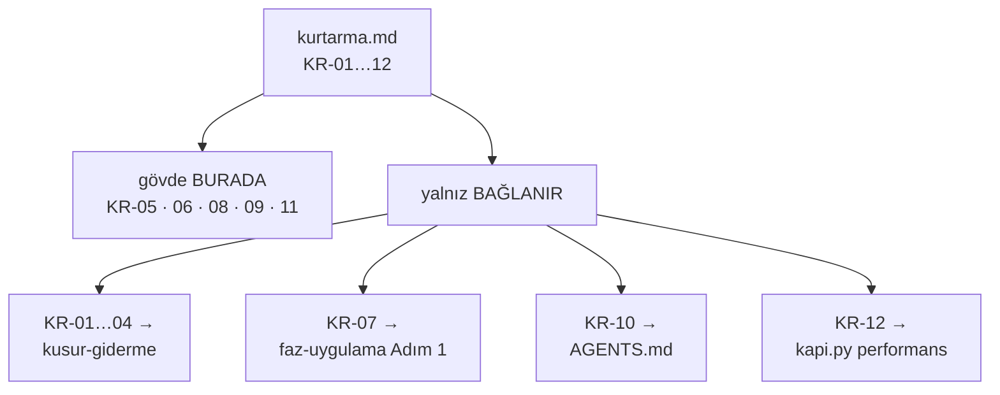

# Faz 168 — Kurtarma Rampası Kataloğu

> **Durum:** 📋 Planlandı (2026-09-13)
> **Kaynak:** [ADAYLAR.md](ADAYLAR.md) · **F-228** (keşif: [`kesif/2026-09-13-anew-karsilastirmasi.md`](kesif/2026-09-13-anew-karsilastirmasi.md) § 6 A3, § 9 H3)
> **Önkoşul:** [Faz 167](arsiv/fazlar/167-AGENT-ZORLAMA-KATMANI.md) — `KR-11` rampası `git reset --hard` yasağının **var olduğunu** varsayar. Yasak konmadıysa `KR-11`'in metni değişir
> **Paketler:** Yok. Bu faz `src/` altına **hiç dokunmaz**
> **Yeni paket:** Yok · **Migration:** Yok
> **Public API:** Büyümüyor
> **Tüketici yüzeyi:** Yok — `docs-site/` sayfası yok, sevk edilen yapıt yok
> **Manuel test alanı:** [`docs/manuel-test/36-GELISTIRME-KAPILARI.md`](manuel-test/36-GELISTIRME-KAPILARI.md) — Faz 167'nin bıraktığı numaradan devam eder

---

## Bu Faza Başlarken

> `faz-baslangic` skill'ini uygula. **Tamamını değil, yalnız işaret edilen
> bölümleri oku.**

1. Bu doküman
2. Desen kaynağı — yeni dosya **bunlara benzeyecek**, ikisi de kısadır:
   ```bash
   cat .agents/ortak/kapilar.md          # 5.962 B
   cat .agents/ortak/test-seviyeleri.md  # 1.931 B
   ```
   İkisi de `.agents/skills/` **dışında** durur, "Bağlayan dosyalar" satırı
   taşır ve tek kaynak cümlesi yazar. `kurtarma.md` üçüncüsüdür.
3. Bağlanacak protokoller — **gövdeleri kopyalanmayacak**, yalnız yerleri
   bilinecek:
   ```bash
   grep -n "^## Adım" .agents/skills/kusur-giderme/SKILL.md
   grep -n "^## Adım" .agents/skills/faz-uygulama/SKILL.md
   ```
4. Kararlar — yalnız bir kalem:
   ```bash
   grep -n "K-408" docs/KARARLAR.md
   ```
   **K-408** (kaynak dili sınırı) — `.agents/` geliştirme aparatıdır ve Türkçe
   kalır; `SourceLanguageTests` onu **taramaz** (Faz 167 § 167.5'te ölçüldü).
5. Alan hafızası: [`hafiza/dokumantasyon.md`](hafiza/dokumantasyon.md) — doküman
   kapıları ve `kirik_baglantilar()` davranışı burada yaşar.
6. Önceki fazın devir notu:
   ```bash
   awk '/## Sonraki Faza Devir Notu/,0' docs/167-AGENT-ZORLAMA-KATMANI.md
   ```
   `KR-11`'in dayandığı yasağın gerçekten konup konmadığını **oradan** öğren.

---

## Amaç

Bir şey ters gittiğinde Tracon'in protokolü **dağınık ve adsızdır**.
`kusur-giderme` yalnız kusuru kapsar; kalan durumlar için ya yarım bir cümle
vardır ya hiçbir şey. Bu faz on iki durumu adlandırır ve tek bir kataloğa
bağlar.

- **F-228** — `.agents/ortak/kurtarma.md`: beş yeni rampa yazılır, yedi mevcut
  protokol **bağlanır** (kopyalanmaz).

Bir rampanın asıl işi protokolü hatırlatmak değil, **doğaçlamayı
yasaklamaktır**. `kusur-giderme` bunu kusur için yapıyor ve ölçülebilir sonuç
verdi: üç kusur sınıfı (`AsyncLocal` 4 kez, senkronizasyon kopyası 5 kez,
Playwright locator 3 kez) ancak **adlandırıldıktan sonra** kapı kazandı.

### Bugün ne çalışmıyor — doğrulanmış kanıt

2026-09-13 taraması, on iki durumun repodaki karşılığını ölçtü:

| Durum | Repodaki karşılığı |
|---|---|
| Derleme hatası · kırmızı test · kırılgan test · regresyon | `kusur-giderme` Adım 1–4, 7 — **var, adsız** |
| Plan sapması | `faz-uygulama` Adım 1 — **var, adsız** |
| Belirsizlik · doküman-kod çelişkisi | `AGENTS.md` "Her belirsizliği sor" — **var, adsız** |
| Performans hedefi kaçtı | `kapi.py performans` — kapı var, **protokol yok** |
| **Araştırılacak bulgu** (repro gerekiyor) | **yok** |
| **Düzeltme turu limiti** | **yok** |
| **Faz ortasında kapsam değişimi** | **yok** |
| **Faz içi bağlam sisi / devir** | **yok** |
| **Güvenli geri alma** | **yok** |

> Kanıtlar 2026-09-13 tarihinde yeniden doğrulandı: `.agents/ortak/` iki dosya
> taşıyor, `kusur-giderme` yedi adımlı, `faz-uygulama` yedi adımlı,
> `kapi.py` `performans` alt komutunu tanıyor (`scripts/kapi.py:1267`).

**En keskin boşluk devir teslimdir.** `faz-tamamlama` Adım 6 **yalnız faz
sonunda** koşar. Faz ortasında bağlam bittiğinde hiçbir protokol yoktur — oturum
ya doğaçlar ya bilgiyi kaybeder.

---

## 168.1 — Dosya, önek ve biçim

Tek yeni dosya: `.agents/ortak/kurtarma.md`. Önek **`KR-`**.

### Önek neden `KR-`

| Önek | Kullanımda | Çakışır mı |
|---|---|---|
| `K-NNN` | Karar defteri, 761 kalem | ✅ çakışır |
| `F-NN` | Aday listesi | ✅ çakışır |
| `MT-*` | Manuel kabul case'i | ✅ çakışır |
| `BL-NNN` | Yayın blocker'ı | ✅ çakışır |
| `R-NN` | ANEW kıyas dokümanının **kendi** şeması | ⚠️ aynı repoda `R-05` iki farklı sisteme çıkardı |
| **`KR-`** | — | **çakışma yok** (ölçüldü 2026-09-13: `docs/`, `.agents/`, `scripts/`, `AGENTS.md` içinde sıfır eşleşme) |

`KR-01…12` ayrıca ANEW'in `R-01…12` şemasıyla **birebir hizalanır** — kıyas
dokümanını okuyan eşlemeyi anında kurar.

> 🚨 Keşif raporu § 9 H3'ün tablosu rampaları `K-01…K-12` diye yazıyor. Bu bir
> **yazım hatasıdır**; karar `KR-`'dir ve § 14'te öyle kayıtlıdır. Rapor keşif
> kaydıdır ve değiştirilmez — bu faz `KR-` kullanır.

### Biçim

`kapilar.md` ve `test-seviyeleri.md` deseni birebir izlenir:

- `.agents/skills/` **dışında** durur → skill olarak keşfedilmez (içinde
  `SKILL.md` yoktur; Faz 92 bunu yapısal olarak doğruladı)
- Başta bir **"Bağlayan dosyalar"** satırı taşır
- Her rampa **tek kaynak** cümlesi yazar; gövde ya buradadır ya **orada**,
  ikisinde birden değil

🚨 **`#fragment` bağlantısı bu repoda ilk kez kullanılacak.** Ölçüldü
(`scripts/dokuman-bakim.py:1082`):

```python
LINK = re.compile(r"\]\(([^)\s]+?)(#[^)\s]*)?\)")
```

`group(1)` fragment'ı **dışarıda bırakır**, yani `SKILL.md#adim-2` biçimi
`kirik_baglantilar()` kapısını **kırmaz**. Yine de `MT-GDK` case'i bunu koşarak
kanıtlar — ölçülmüş bir regex, koşulmuş bir kapı değildir.

---

## 168.2 — On iki rampa



| Kod | Durum | Gövde nerede |
|---|---|---|
| `KR-01` | Derleme hatası | → `kusur-giderme` Adım 1 |
| `KR-02` | Kırmızı test | → `kusur-giderme` Adım 1–4 |
| `KR-03` | Kırılgan test | → `kusur-giderme` Adım 2 |
| `KR-04` | Regresyon | → `kusur-giderme` Adım 5, 7 |
| **`KR-05`** | **Araştırılacak bulgu** — repro gerekiyor | **Yeni — burada** |
| **`KR-06`** | **Düzeltme turu limiti** | **Yeni — burada** |
| `KR-07` | Plan sapması | → `faz-uygulama` Adım 1 |
| **`KR-08`** | **Faz ortasında kapsam değişimi** 👤 | **Yeni — burada** |
| **`KR-09`** | **Faz içi bağlam sisi / devir** | **Yeni — burada** |
| `KR-10` | Belirsizlik · doküman-kod çelişkisi | → `AGENTS.md` "Her belirsizliği sor" |
| **`KR-11`** | **Güvenli geri alma** 👤 | **Yeni — burada** |
| `KR-12` | Performans hedefi kaçtı | → `kapi.py performans` |

### Beş yeni rampanın gövdesi

**`KR-05` — araştırılacak bulgu.** Tetikleyici: bir bulgu geçerli **görünüyor**
ama repro yok. Adımlar: minimal repro yaz → süre kutusu **bir tur** → repro
çıkarsa `KR-02`'ye geç, çıkmazsa **gerekçeli kapanış**. 🚨 Düzeltme yazmak
yasaktır: repro'suz düzeltme, düzeltildiğini kanıtlayamaz.

**`KR-06` — düzeltme turu limiti.** Tetikleyici: aynı davranış için **üçüncü**
düzeltme turu. Adım: **kod yazmayı durdur** ve tek soruyu sor — kök sebep
**kodda mı planda mı?** Plandaysa `KR-08`'e geç. Bu rampa bir sayı taşır ve sayı
**üçtür**; "birkaç tur" bir limit değildir.

**`KR-08` — faz ortasında kapsam değişimi** 👤. Tetikleyici: fazın DoD'si artık
doğru işi tarif etmiyor. Sıra **bağlayıcıdır**: önce **faz dokümanı** güncellenir,
sonra delta plan yazılır, sonra kod. Ters sıra `AGENTS.md`'nin "plandan sapma
gizlenmez" kuralını sessizce çiğner. 👤 kullanıcı onayı gerekir.

**`KR-09` — faz içi bağlam sisi / devir.** Tetikleyici: oturum bağlamı doluyor
ama faz bitmedi. Adımlar: durum dosyası yaz (ne bitti · ne yarım · sıradaki tek
adım · bilinen tuzak) → devret. 🚨 `faz-tamamlama` Adım 6 **buna alternatif
değildir**: o yalnız faz **sonunda** koşar. Bu rampa fazın **ortası** içindir ve
bugün karşılığı yoktur.

**`KR-11` — güvenli geri alma** 👤. Araç `git revert`'tir. `git reset --hard`
Faz 167'de yasaklanmıştır ve bu rampa o yasağı **varsayar**. Geri almadan önce
migration risk raporu yazılır ve tek kural şudur: **"bilinmiyor" bir cevaptır ve
geri almayı durdurur.** 👤 kullanıcı onayı gerekir.

---

## 168.3 — Bağlantılar: altı dosya, altı satır

Katalog **keşfedilemezse yazılmamış sayılır.** Altı giriş noktası bağlanır:

| Dosya | Ne eklenir |
|---|---|
| `AGENTS.md` | "İhtiyaç \| Yol" tablosuna **bir satır** (~90 B) |
| `.agents/skills/README.md` | Ortak sözleşme listesine `kurtarma.md` |
| `.agents/skills/kusur-giderme/SKILL.md` | `KR-01…04`'ün gövdesinin burada olduğunu söyleyen bir satır |
| `.agents/skills/faz-uygulama/SKILL.md` | Adım 1'in `KR-07` olduğunu söyleyen bir satır |
| `.agents/skills/faz-denetim/SKILL.md` | "araştırılacak" sonucu `KR-05`'e gider (Faz 169 bunu kapıya bağlar) |
| `.agents/skills/faz-baslangic/SKILL.md` | Bağlam sisi `KR-09`'dur |

🚨 **`AGENTS.md` bütçesi dar: 11.189 / 12.000 B, %7 boş — 811 B kalmış.** Bir
satır sığar, **ikinci bir ekleme sığmaz**. Bu fazda `AGENTS.md`'ye başka hiçbir
şey eklenmez. Satır eklenmezse katalog keşfedilemez; iki satır eklenirse bütçe
zorlanır. Tam olarak **bir** satır.

`.agents/` hiçbir bütçe sözlüğünde **değildir** (ölçüldü: `BASLANGIC_BUTCESI`,
`SORGU_BUTCESI`, `YONETIM_BUTCESI`, `DIZIN_BUTCESI` — dördü de yalnız `docs/` ve
kök dosyaları sayar). Yeni dosya bütçe kapısını **tetiklemez**.

---

## Planlanan Public API

**Yok.** Bu faz `src/` altına dokunmaz. Kod yok, test yok, yeni kapı yok.

### Arayüz payı

Yok.

---

## Planlanan Dosya Listesi

```
.agents/
├── ortak/
│   └── kurtarma.md               YENİ — tek dosya, ~80–120 satır
└── skills/
    ├── README.md                 DEĞİŞİR — bir satır
    ├── kusur-giderme/SKILL.md    DEĞİŞİR — bir satır
    ├── faz-uygulama/SKILL.md     DEĞİŞİR — bir satır
    ├── faz-denetim/SKILL.md      DEĞİŞİR — bir satır
    └── faz-baslangic/SKILL.md    DEĞİŞİR — bir satır

AGENTS.md                         DEĞİŞİR — TAM BİR SATIR (~90 B)

docs/manuel-test/
└── 36-GELISTIRME-KAPILARI.md     DEĞİŞİR — üç case
```

---

## Hata Modları ve Testler

| Ne bozulabilir | Seviye | Test |
|---|---|---|
| `#fragment` bağlantısı kapıyı kırar | Fonksiyonel | `python3 scripts/dokuman-bakim.py --denetle` → kırık bağlantı **0** |
| `AGENTS.md` iki satır alır ve bütçeyi aşar | Fonksiyonel | Aynı kapı — `AGENTS.md` satırı kırmızı döner |
| Rampa gövdesi **hem** katalogda **hem** skill'de yaşar; ikisi zamanla çelişir | Manuel | Yeni case: her `KR-` satırı ya gövde ya bağlantı taşır, ikisi birden değil |
| Katalog hiçbir yerden bağlanmaz ve görünmez kalır | Fonksiyonel | `grep -rn "kurtarma.md" AGENTS.md .agents/` **altı** dosya döndürmeli |
| Bağlanan bir skill adımı ileride yeniden numaralanır; bağlantı bayatlar | Fonksiyonel | `kirik_baglantilar()` dosyayı yakalar, **fragment'ı değil** — sınır bilinerek kabul edilir (bkz. Riskler) |

Beş soru, bu fazın bağlamındaki cevaplarıyla:

| Soru | Cevap |
|---|---|
| İptal · eşzamanlılık · boş/aşırı girdi · başka kiracı | Kapsam dışı — kod yolu yok |
| Alt sistem hatası | Kapı zaten var (`kirik_baglantilar`); bu faz yeni kapı **eklemez** |

Sözleşme testi gerekmez: hiçbir sınır geçilmiyor.

---

## Manuel Kabul Case'leri

> Kapanışta [`docs/manuel-test/36-GELISTIRME-KAPILARI.md`](manuel-test/36-GELISTIRME-KAPILARI.md)
> içine, Faz 167'nin bıraktığı numaradan devam ederek eklenir.

| # | Ön koşul | Adımlar | Beklenen sonuç |
|---|---|---|---|
| 1 | `kurtarma.md` yazılmış, `#fragment` bağlantısı taşıyor | `python3 scripts/dokuman-bakim.py --denetle` | Kırık bağlantı **0**; fragment'lı bağlantı bulgu üretmez |
| 2 | `kurtarma.md` içinde var olmayan bir dosyaya bağlantı konmuş | Aynı komut | Çıkış `1`; o satır **raporlanır** — kapı gerçekten koşuyor |
| 3 | `AGENTS.md` satırı eklenmiş | Aynı komut | `AGENTS.md` bütçe içinde (< 12.000 B); DAR uyarısı kabul edilir, **aşım kabul edilmez** |

---

## Açık Sorular

| # | Soru | Seçenekler | Öneri |
|---|---|---|---|
| 1 | "Bağlanır, kopyalanmaz" sözü bir kapıyla korunsun mu? | A: bu fazda hayır · B: `tekrarlanan_kapi_tanimlari()`'ye bir satır (`kurtarma.md` içinde `kapi.py kapanis` ham komutu geçmemeli) | **B** — kapı bugün `ci.yml`, `AGENTS.md` ve `faz-tamamlama` için aynı şeyi yapıyor; desen hazır ve satır ucuz. Kopyalama riski gerçektir: katalog tam olarak kopyalamaya davet eden bir biçimdir |
| 2 | `kurtarma.md` hangi dilde? | A: Türkçe · B: İngilizce | **A** — geliştirme aparatıdır (K-408), `kapilar.md` ve `test-seviyeleri.md` de Türkçe. `SourceLanguageTests` `.agents/`'ı taramaz |
| 3 | `KR-09` bir **durum dosyası şablonu** da taşısın mı? | A: dört başlık yeter (ne bitti · ne yarım · sıradaki adım · tuzak) · B: ayrı şablon dosyası | **A** — YAGNI. İkinci bir dosya kataloğun kendi "bağlanır, kopyalanmaz" sözünü zorlar |

---

## Bitiş Ölçütleri (DoD)

- [ ] `.agents/ortak/kurtarma.md` var; **on iki** `KR-` kalemi taşıyor ve beşinin gövdesi (`KR-05, 06, 08, 09, 11`) **burada**, yedisininki **bağlantıda**
- [ ] Hiçbir rampa gövdesi iki yerde yaşamıyor — `KR-01…04, 07, 10, 12` satırlarının hiçbiri protokol adımlarını **tekrarlamıyor**
- [ ] `grep -rn "kurtarma.md" AGENTS.md .agents/` **altı** dosya döndürür
- [ ] `AGENTS.md` **tam bir satır** aldı ve bütçe içinde — öncesi/sonrası bayt ölçüldü ve yazıldı (taban 11.189 B, tavan 12.000 B)
- [ ] `python3 scripts/dokuman-bakim.py --denetle` çıkış `0`; kırık bağlantı `0`; `#fragment` bağlantısı bulgu üretmedi
- [ ] Açık Soru 1 **B** seçilirse: `tekrarlanan_kapi_tanimlari()` `kurtarma.md`'yi denetliyor ve `dokuman_bakim_test.py` bir vaka taşıyor
- [ ] `python3 -m unittest discover -s scripts -p "*_test.py"` yeşil
- [ ] Dört doğrulama kapısı sıfır uyarı verir (`python3 scripts/kapi.py kapanis --taban <faz öncesi commit>`)
- [ ] `samples/Tracon.Api` ile gerçek `run` yapıldı, çıktı belgeye yazıldı — 🚨 **bu faz kod değiştirmez; koşum bir regresyon kanıtıdır** (Faz 92 emsali)
- [ ] `secret` taraması boş döndü
- [ ] Manuel kabul case'leri `docs/manuel-test/36-GELISTIRME-KAPILARI.md` içine eklendi; üçü de koşuldu
- [ ] `faz-denetim` koşuldu — Faz 167'nin `faz-denetcisi` tipiyle; 🔴 bulgu kalmadı
- [ ] `## Süreç Ölçümü` bölümü dolduruldu
- [ ] `KR-11`'in metni Faz 167'nin **gerçekleşen** sonucuyla tutarlı — `git reset --hard` yasağı konmadıysa rampa metni ona göre yazıldı

### Doğrulama komutları

```bash
# Katalog altı yerden bağlı mı
grep -rln "kurtarma.md" AGENTS.md .agents/ | wc -l    # 6 olmalı

# On iki rampa var mı
grep -c "^| \`KR-" .agents/ortak/kurtarma.md          # 12 olmalı

# AGENTS.md bütçesi
wc -c AGENTS.md                                        # < 12000

# Kapılar
python3 scripts/dokuman-bakim.py --denetle
python3 -m unittest discover -s scripts -p "*_test.py"
```

---

## Riskler

| Risk | Önlem |
|------|-------|
| `AGENTS.md` 811 B boşta; ikinci bir ekleme sığmaz | Bu fazda `AGENTS.md`'ye **yalnız bir satır** girer. DoD bunu bayt ölçümüyle kanıtlar |
| Satır hiç eklenmezse katalog keşfedilemez ve yazılmamış sayılır | DoD satırı: altı bağlayıcı dosya `grep` ile sayılır |
| "Bağlanır, kopyalanmaz" sözü yalnız yazıyla korunur | Açık Soru 1 → önerilen **B**: `tekrarlanan_kapi_tanimlari()`'ye bir satır |
| On ikinin yedisi yalnız bağlantıdır; katalog bir indekse benzer ve indeksler bayatlar | Bayatlamayı `kirik_baglantilar()` yakalar. Ayrıca değeri üreten şey içerik değil **adlandırmanın kendisidir** — "ne yapsak?" yerine "bu bir `KR-06`" denir |
| Bağlantı dosyayı doğrular ama **fragment'ı** doğrulamaz; skill adımı yeniden numaralanırsa çapa sessizce ölür | Bilinen sınır, kabul edilir ve `kurtarma.md` içine yazılır. Fragment doğrulayan bir kapı bu fazın kapsamında **değildir** — gerekirse 🟢 aday olur |
| Rampa hiç çağrılmaz ve katalog ölü metin olur | Ölçüm Faz 169'un `## Süreç Ölçümü` bölümünden gelir: bir krizde rampa **koduyla** anıldı mı |

---

<!-- ============================================================
     AŞAĞISI KAPANIŞTA DOLDURULUR — `faz-tamamlama` skill'i.
     Plan anında boş kalır. Başlıkları SİLME.
     ============================================================ -->

## Plandan Sapmalar

> Kapanışta doldurulur.

## Bu Fazda Verilen Kararlar

> Kapanışta doldurulur. K-NNN numaraları burada alınır; plan numara rezerve
> etmez. En az bir karar beklenir: `KR-` önekinin seçimi ve "gövde tek yerde
> yaşar" sözleşmesi.

## Gerçekleşen Public API

> Kapanışta doldurulur. Bu fazda **"Yok"** beklenir.

## Dosya Listesi (gerçekleşen)

> Kapanışta doldurulur.

## Süreç Ölçümü

> Kapanışta doldurulur. Sayılar **toplanabilir** olmalıdır; anlatı değil.
> `ölçülmedi` geçerli bir değerdir — boş bırakmak değildir.
>
> 🚨 Bu bölüm Faz 169'da kapıya bağlanacak; eşik **167**'dir.

| Metrik | Değer |
|---|---|
| Plan revizyonu sayısı | |
| Düzeltme turu sayısı | |
| 🔴 bulgu: gerçek / gürültü / araştırılacak | |
| Fazın ürettiği regresyon | |
| Faz kapandıktan sonra bulunan kusur | |

## Denetim Bulguları

> Kapanışta doldurulur. Bulgu yoksa "🔴 ve 🟡 yok" yazılır; boş bırakılmaz.

## Sonraki Faza Devir Notu

> Kapanışta doldurulur. Faz 169 (`F-229`) için **zorunlu** olarak şunu taşır:
> `KR-05` rampasının **tam adresi** (dosya + çapa). Faz 169'un triyajındaki
> "araştırılacak" sonucu oraya gider; adres yanlışsa triyajın üçüncü kanalı
> hiçbir yere çıkmaz.
