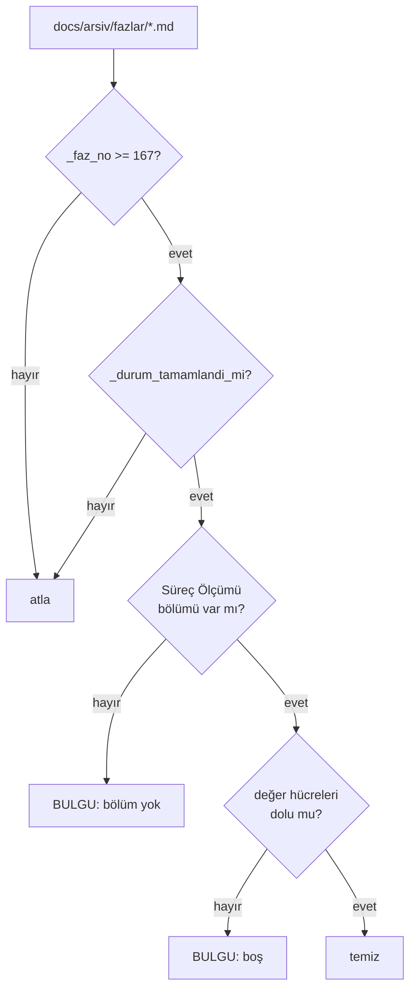

# Faz 169 — Faz Planı Sözleşmesi: Süreç Ölçümü ve Triyaj

> **Durum:** 📋 Planlandı (2026-09-13)
> **Kaynak:** [ADAYLAR.md](ADAYLAR.md) · **F-229** (keşif: [`kesif/2026-09-13-anew-karsilastirmasi.md`](kesif/2026-09-13-anew-karsilastirmasi.md) § 6 A4 · A6, § 9 H4 · H5)
> **Önkoşul:** 🚨 [Faz 168](168-KURTARMA-RAMPASI-KATALOGU.md) — triyajın "araştırılacak" sonucu `KR-05`'e gider. `KR-05` yoksa o sonucun **gideceği yer yoktur**. Ayrıca [Faz 167](167-AGENT-ZORLAMA-KATMANI.md) — `arsiv/fazlar/` için `ask` kuralı (bkz. Riskler)
> **Paketler:** Yok. Bu faz `src/` altına **hiç dokunmaz**
> **Yeni paket:** Yok · **Migration:** Yok
> **Public API:** Büyümüyor
> **Tüketici yüzeyi:** Yok — `docs-site/` sayfası yok, sevk edilen yapıt yok
> **Manuel test alanı:** [`docs/manuel-test/36-GELISTIRME-KAPILARI.md`](manuel-test/36-GELISTIRME-KAPILARI.md) — Faz 168'in bıraktığı numaradan devam eder

---

## Bu Faza Başlarken

> `faz-baslangic` skill'ini uygula. **Tamamını değil, yalnız işaret edilen
> bölümleri oku.**

1. Bu doküman
2. Değiştirilecek üç yapıt — **yalnız ilgili bölümler**:
   ```bash
   awk '/AŞAĞISI KAPANIŞTA DOLDURULUR/,0' .agents/skills/faz-planlama/resources/faz-plani-sablonu.md
   sed -n '161,215p' .agents/skills/faz-denetim/SKILL.md      # Adım 4 ve 5
   sed -n '198,215p' .agents/skills/faz-tamamlama/SKILL.md    # Adım 5
   ```
3. Yeniden kullanılacak kapı yardımcıları — **yeniden yazılmaz, çağrılır**:
   ```bash
   grep -n "_durum_tamamlandi_mi\|_faz_no\|_faz_bolumleri\|_FAZ_KAL\|_duser_mu" scripts/dokuman-bakim.py
   sed -n '654,675p' scripts/dokuman-bakim.py   # 13. kapının kalıbı
   ```
4. Kararlar — yalnız bir kalem:
   ```bash
   grep -n "K-413" docs/KARARLAR.md
   ```
   **K-413** — üretilen dosya disiplini; bu fazın kapısı aynı aileye girer.
5. Alan hafızası: [`hafiza/dokumantasyon.md`](hafiza/dokumantasyon.md) — kapı
   kalıbı, damıtma davranışı ve `_FAZ_KAL` burada yaşar.
6. Önceki fazın devir notu — `KR-05`'in **tam adresi** oradadır:
   ```bash
   awk '/## Sonraki Faza Devir Notu/,0' docs/168-KURTARMA-RAMPASI-KATALOGU.md
   ```

---

## Amaç

İki boşluk, **aynı yapıt** üzerinde: faz planı şablonu.

1. **Süreç ölçülmüyor.** 167 faz koşuldu ve "plandan sapma", "düzeltme turu",
   "gerçek/gürültü bulgu", "üretilen regresyon" sayılarının **hiçbiri**
   tutulmuyor. Bu, ölçüm kültürü olan bir repo için tuhaf bir boşluktur —
   bütçe ölçülüyor, kapı süresi ölçülüyor, **sürecin kendisi ölçülmüyor**.
2. **Triyaj bağımsız değil.** `faz-denetim` Adım 5 bulguyu **uygulayan oturuma**
   veriyor. Denetçi bağımsızdır ama bulgunun **geçerli olup olmadığına** kendi
   kodunu savunmaya eğilimli oturum karar verir. Bu, `faz-denetim`'in kapatmak
   için var olduğu kör noktanın bir adım geriden tekrarıdır.

- **F-229** — şablona `## Süreç Ölçümü` girer, `--denetle`'ye 14. kapı eklenir,
  `faz-denetim` Adım 5 ikiye bölünür.

### Bugün ne çalışmıyor — doğrulanmış kanıt

| Kanıt | Gözlem |
|---|---|
| `scripts/dokuman-bakim.py:2152` (`denetle()`) | **13** bulgu kapısı koşuyor; hepsi aynı kalıpta. Hiçbiri süreç ölçmüyor |
| `artifacts/kapi-olcum.jsonl` | 173 satır · alanlar **tam olarak** `utc, stage, command, duration_seconds, exit_code`. **Faz numarası alanı yok** — "hangi faz kaç kırmızı tur yaşadı" bu dosyadan **türetilemez** |
| `.gitignore:26` | `artifacts/` **izlenmiyor**. Dosya yerel bir koşum kaydıdır; başka bir klonda **yoktur** |
| `.agents/skills/faz-denetim/SKILL.md:198` (Adım 5) | "Uygulayan oturum bulguları kapatır" — bulguyu **sınıflandıran** da odur |
| Faz dokümanları | Anlatı taşıyor ("2 🔴 düzeltildi"), **toplanabilir sayı** taşımıyor |

> Kanıtlar 2026-09-13 tarihinde yeniden doğrulandı.

🚨 **Aday listesinin bir iddiası hassaslaştırıldı.** F-229 "`kapi-olcum.jsonl`
kapı **sürelerini** tutar, kırmızı/yeşil turunu değil" diyordu. Ölçüldü: dosya
`exit_code` **taşır** — yani kırmızı/yeşili komut başına bilir. Eksik olan
başka: **faz bağı yok** ve dosya **git'te değil**. İddia doğru yere kayar ve
sonuç değişmez: geriye dönük türetme mümkün değildir.

---

## 169.1 — Şablon: `## Süreç Ölçümü`

`faz-plani-sablonu.md`'nin **kapanış yarısına** (`AŞAĞISI KAPANIŞTA DOLDURULUR`
işaretinin altına) bir bölüm girer. Beş metrik:

| Metrik | Değer |
|---|---|
| Plan revizyonu sayısı | |
| Düzeltme turu sayısı | |
| 🔴 bulgu: gerçek / gürültü / araştırılacak | |
| Fazın ürettiği regresyon | |
| Faz kapandıktan sonra bulunan kusur | |

🚨 **Tablo olmalı, onay kutusu değil.** `tamamlanmis_faz_isaretsiz_kutular()`
(`dokuman-bakim.py:654`) arşivdeki **her** `- [ ]` satırını hata sayar. Bu
bölüm onay kutusuyla yazılırsa, doldurulmadığı her fazda **ikinci** bir kapı
kırmızı döner ve bulgu kaynağı bulanıklaşır.

### Bölüm adı neden `Süreç Ölçümü`

Aday listesi bu bölüme `## Faz Scorecard'ı` diyordu ve bir tuzak tarif
ediyordu: `_FAZ_KAL`'a **iki kesme işareti varyantıyla** (U+0027 ve U+2019)
eklenmesi gerektiği.

Tuzak, adı değiştirerek **tamamen ortadan kalkar.** `Süreç Ölçümü` kesme
işareti taşımaz, tek varyantla eşleşir ve keşif raporu § 9 H4'ün **kendi
önerdiği** addır. 2026-09-13'te ölçüldü: repoda U+2019 sayısı **sıfır**, ve
`## Süreç Ölçümü` başlığı yalnız keşif raporunun içinde (kod bloğunda) geçiyor
— faz dokümanlarında çakışma yok.

Damıtma davranışı **koşularak** doğrulandı:

```
_duser_mu("Süreç Ölçümü", "Süreç Ölçümü") -> False
```

Bölüm damıtmada **düşmez**. `_FAZ_KAL`'a eklenmesi yine de gereklidir —
eklenmezse korunur ama her damıtmada *"tanınmayan bölüm KORUNDU"* uyarısı
basar ve gürültü kapıyı öldürür.

### Onay satırı

Şablonun başlık bloğuna bir satır daha girer:

```
> **Plan onayı:** <ad>, <YYYY-AA-GG> · <yoksa "onaylanmadı — uygulama başlamaz">
```

Bu satır **geriye dönük konmaz** ve bu fazdan sonra yazılan planlar için
geçerlidir. Faz 167 · 168 · 169 planları onsuz yazıldı; bu bir sapma değil,
kapsam sınırıdır.

---

## 169.2 — 14. kapı

`denetle()` bugün 13 bulgu kapısı koşuyor ve hepsi aynı kalıpta. 14.'sü
`ci.yml`'a **dokunmadan** koşar — CI zaten `dokuman-bakim.py --denetle`
çağırıyor.



### Eşik **167**'dir

🚨 **Eşik bir sayıdır ve kullanıcı kararıyla 167'dir** (2026-09-13). Turun
**üç** fazı da kapsanır; Faz 167 ve 168 bölümü gönüllü olarak taşır ve
doldurur. Sonuç: kapı doğduğu anda elde **üç** veri noktası olur ve keşif
raporu § 12'nin ilk sorusu (*"plandan sapma sayısı ile 🔴 bulgu sayısı korele
mi?"*) Faz 169 kapanışında sorulabilir hâle gelir — Faz 171'de değil.

Alternatifler **elenmiştir**:

| Alternatif | Neden olmaz |
|---|---|
| Tarih | `faz-damit` dosyayı yeniden yazar ve `Durum:` tarihi elle yazılır |
| Dosya içi işaret | İşareti silmek kapıyı **susturur** — tam olarak Faz 80 kusur sınıfı |
| Sabit bir **sonraki** numara (170) | Fazı muaf yapar; kapı hiç koşmadan yeşil commit edilir |

Geriye dönük 166 faz **doldurulmaz** (kullanıcı kararı). Geriye dönük türetme
ölçüm değil **tahmin** üretir.

### Uygulama kuralları

**Mevcut yardımcılar yeniden yazılmaz, çağrılır:**

| Yardımcı | Neden |
|---|---|
| `_faz_no(p)` (`:46`) | Dosya adından numara |
| `_durum_tamamlandi_mi(s)` (`:623`) | ✅ ve `Tamamlandı` eşanlamlılarını **zaten** biliyor; Faz 91'de `✅ Tamam` / `✅ Kod tamam` vakaları yüzünden genişletildi |
| `_faz_bolumleri(metin)` (`:1448`) | 🚨 Düz `split("## ")` **yapılmaz** — kod bloğu içindeki başlık belgeyi parçalar; bu yardımcı `_kod_bloklarini_soy` ile o tuzağı zaten kapatıyor |

**Kapı hiçbir şey YAZMAZ.** `tazelik_denetle()`'nin docstring'i bunu açıkça
söylüyor ve aynı sözleşme burada da geçerlidir.

**"Dolu" tanımı:** beş satırın **her birinin** değer hücresi boş değildir.
`ölçülmedi` **geçerli bir değerdir**; boş hücre değildir. Kapı bir sayı değil,
bir **karar** arar.

---

## 169.3 — Triyaj: denetçi önerir, kullanıcı seçer

🚨 **Bu tasarımı bir mekanik kısıt belirledi.** Alt agent'lardan
`AskUserQuestion` aracı kaldırılmıştır — **denetçi kullanıcıya soramaz.**
Dolayısıyla triyaj mekanik olarak **ana oturuma** aittir. Keşif raporu § 9 H5b
bunu varsaymıyordu; § 14 tasarımı buna göre düzeltti.

**`faz-denetim` Adım 4** — 🔴 tablosu bir sütun kazanır:

| # | Bulgu | Kanıt | Nasıl kırılır | **Denetçi önerisi** |
|---|---|---|---|---|

Öneri üç değerden biridir: **gerçek · gürültü · araştırılacak**. Denetçi
**önerir**, karar vermez.

**`faz-denetim` Adım 5** ikiye bölünür:

**5.1 — Triyaj (yalnız 🔴).** Ana oturum her 🔴 bulguyu kullanıcıya sorar ve
kullanıcı seçer:

| Sonuç | Ne olur |
|---|---|
| **gerçek** | Düzeltilir **+ düzeltmeyi kanıtlayan test** |
| **gürültü** | Reddedilir — **gerekçesi yazılır**. Gerekçesiz ret, aynı bulgunun geri gelmesidir |
| **araştırılacak** | Düzeltme **yok**. Önce minimal repro → **`KR-05`** (Faz 168). Repro varsa gerçektir; yoksa gerekçeli kapanış |

**5.2 — Uygulayan oturum kapatır.** Bugünkü Adım 5 gövdesi buraya taşınır ve
değişmez.

**Triyaj yalnız 🔴'lara uygulanır** (kullanıcı kararı). 🟡 ve 🟢 bugünkü akışta
kalır. Gerekçe `faz-denetim`'in kendi cümlesidir: *"denetim ucuz olmalıdır,
pahalı olursa atlanır"* — ve tek başına bir fazı durduran seviye 🔴'dır.

---

## 169.4 — İki metrik bugün otomatik okunamıyor

Beş metriğin **üçü** faz dokümanında **yazılı** bilgiden türetilir:

| Metrik | Kaynağı |
|---|---|
| Plan revizyonu sayısı | "Plandan Sapmalar" bölümü |
| 🔴 bulgu dağılımı | "Denetim Bulguları" bölümü + 5.1 triyajı |
| Faz kapandıktan sonra bulunan kusur | `kusur-giderme` koşumu, **sonradan** |

**İkisi ölçülmedi ve elle sayılacaktır:** "düzeltme turu" ve "üretilen
regresyon". Bugün hiçbir artefakttan okunamıyorlar — § *Amaç*'taki
`kapi-olcum.jsonl` ölçümü bunun sebebini veriyor.

Bu bir eksiklik değil, bir **devir teslim bilgisidir**. Hiç ölçmemek, iki
metriği elle saymaktan kötüdür.

---

## Planlanan Public API

**Yok.** Bu faz `src/` altına dokunmaz.

### Arayüz payı

Yok.

---

## Planlanan Dosya Listesi

```
.agents/skills/
├── faz-planlama/resources/
│   └── faz-plani-sablonu.md      DEĞİŞİR — `## Süreç Ölçümü` + onay satırı
├── faz-denetim/SKILL.md          DEĞİŞİR — Adım 4 sütunu, Adım 5 → 5.1 + 5.2
└── faz-tamamlama/SKILL.md        DEĞİŞİR — Adım 5'e bir satır

scripts/
├── dokuman-bakim.py              DEĞİŞİR — 14. kapı + `_FAZ_KAL` girdisi + eşik sabiti
└── dokuman_bakim_test.py         DEĞİŞİR — beş vaka

docs/manuel-test/
└── 36-GELISTIRME-KAPILARI.md     DEĞİŞİR — iki case
```

---

## Hata Modları ve Testler

| Ne bozulabilir | Seviye | Test |
|---|---|---|
| Kapı eşik altındaki 166 fazı da yakalar; arşivin tamamı kırmızı döner | Fonksiyonel | `dokuman_bakim_test.py` — eşik **altı** vakası |
| Tamamlanmamış (📋 Planlandı) bir faz bulgu üretir | Fonksiyonel | Aynı sınıf — plan durumu vakası |
| Bölüm var ama hücreler boş; kapı yeşil döner | Fonksiyonel | Aynı sınıf — **boş** vakası |
| `ölçülmedi` yazan hücre boş sayılır ve kapı kırmızı döner | Fonksiyonel | Aynı sınıf — **dolu** vakası |
| Kapı bir dosyaya yazar (yan etki) | Fonksiyonel | Aynı sınıf — "hiçbir şey YAZMAZ" iddiası; `tazelik_denetle()` emsali |
| Düz `split("## ")` kullanılır; kod bloğundaki `## ` belgeyi parçalar | Fonksiyonel | Vaka: gövdesinde kod bloğu içinde `## Süreç Ölçümü` geçen bir faz kaydı **bulgu üretmemeli** |
| `_FAZ_KAL` güncellenmez; her damıtma "tanınmayan bölüm" uyarısı basar | Manuel | `faz-damit` koşulur, uyarı çıktısı **boş** olmalı |
| Şablonda bölüm eklendi ama `faz-tamamlama` onu doldurmayı söylemiyor | Manuel | Adım 5 satırı `grep` ile doğrulanır |

Beş soru, bu fazın bağlamındaki cevaplarıyla:

| Soru | Cevap |
|---|---|
| İptal · eşzamanlılık · başka kiracı | Kapsam dışı — kod yolu yok |
| Boş/aşırı girdi | Boş bölüm, boş hücre, `ölçülmedi` — üçü de test edilir |
| Alt sistem hatası | Kapı dosya okur; `OSError` mevcut kapı kalıbındaki gibi **sessizce atlanır**, çökmez |

Sözleşme testi gerekmez: hiçbir sınır geçilmiyor.

---

## Manuel Kabul Case'leri

| # | Ön koşul | Adımlar | Beklenen sonuç |
|---|---|---|---|
| 1 | Faz 167 ve 168 arşivlenmiş, ikisi de `## Süreç Ölçümü` dolu | `python3 scripts/dokuman-bakim.py --denetle` | 14. kapı **✅ temiz**; çıkış `0` |
| 2 | Faz 167 kaydındaki bölümün bir değer hücresi elle boşaltılmış | Aynı komut | Çıkış `1`; o dosya adı ve satırı **raporlanır**; dosya **değişmemiş** olmalı (`git diff` boş) |

---

## Açık Sorular

| # | Soru | Seçenekler | Öneri |
|---|---|---|---|
| 1 | Kapı yalnız `docs/arsiv/fazlar/`'ı mı tarasın, kök `docs/NN-*.md`'yi de mi? | A: ikisini de · B: yalnız arşiv | **A** — `kapanmis_faz_bulgulari()` "tamamlanmış faz kökte" durumunu zaten yakalıyor ama **farklı** bir soruyu cevaplıyor. İkisini de taramak, eksik ölçümü arşivlemeden **önce** gösterir; arşivledikten sonra göstermek bir tur daha maliyettir |
| 2 | "Faz kapandıktan sonra bulunan kusur" satırını kim günceller? | A: `kusur-giderme` Adım 6'ya bir satır · B: elle, protokolsüz | **A** — protokolsüz bırakılan alan doldurulmaz. Satır ucuzdur: *kusurun geldiği faz biliniyorsa o fazın `Süreç Ölçümü` tablosuna bir çentik at* |
| 3 | Beş metrik yeterli mi; "kapı kırmızı dönüş sayısı" da eklensin mi? | A: beş kalsın · B: altıncı eklensin | **A** — keşif raporu altı satır öneriyordu, aday listesi beşe indirdi ve beşi de bugün ya yazılı bilgiden türetilir ya elle sayılır. Altıncısı `artifacts/` gitignore'da olduğu için **hiçbir klonda** okunamaz |

---

## Bitiş Ölçütleri (DoD)

- [ ] `faz-plani-sablonu.md` kapanış yarısında `## Süreç Ölçümü` bölümü var; **tablo**, onay kutusu değil; beş satır taşıyor
- [ ] Şablonun başlık bloğunda `> **Plan onayı:**` satırı var
- [ ] `dokuman-bakim.py --denetle` **14** bulgu kapısı koşuyor (bugün 13)
- [ ] Eşik sabiti **167** ve kodda adlandırılmış; tablo/anlatı içine gömülmemiş
- [ ] Kapı `_faz_no()`, `_durum_tamamlandi_mi()` ve `_faz_bolumleri()`'ni **çağırıyor**; `split("## ")` deseni kodda **yok**
- [ ] Kapı **hiçbir şey yazmıyor** — test bunu iddia ediyor
- [ ] `_FAZ_KAL` `"Süreç Ölçümü"` taşıyor; `faz-damit` koşumu "tanınmayan bölüm KORUNDU" uyarısı **basmıyor**
- [ ] `dokuman_bakim_test.py` **beş** vaka taşıyor: eşik altı · bölüm yok · bölüm boş · bölüm dolu (`ölçülmedi` dahil) · plan durumu; artı "yazmaz" iddiası
- [ ] `faz-denetim` Adım 4 🔴 tablosu "Denetçi önerisi" sütunu taşıyor; değerler `gerçek / gürültü / araştırılacak`
- [ ] `faz-denetim` Adım 5 **5.1 (triyaj, yalnız 🔴)** ve **5.2 (kapatma)** olarak bölünmüş; 5.1 "araştırılacak" sonucunu **`KR-05`'e** bağlıyor ve bağlantı `kirik_baglantilar()`'dan geçiyor
- [ ] `faz-tamamlama` Adım 5 `## Süreç Ölçümü`'nün doldurulmasını söylüyor
- [ ] 🚨 Faz **167 ve 168**'in arşivlenmiş kayıtları `## Süreç Ölçümü` bölümünü **hâlâ taşıyor** ve dolu — damıtma onları düşürmemiş
- [ ] Bu fazın **kendi** `## Süreç Ölçümü` tablosu dolu; kapı onu **gerçekten** denetliyor (eşik 167 ≤ 169)
- [ ] `python3 -m unittest discover -s scripts -p "*_test.py"` yeşil
- [ ] `python3 scripts/dokuman-bakim.py --denetle` çıkış `0`; kırık bağlantı `0`
- [ ] Dört doğrulama kapısı sıfır uyarı verir (`python3 scripts/kapi.py kapanis --taban <faz öncesi commit>`)
- [ ] `samples/Tracon.Api` ile gerçek `run` yapıldı, çıktı belgeye yazıldı — 🚨 **bu faz kod değiştirmez; koşum bir regresyon kanıtıdır** (Faz 92 emsali)
- [ ] `secret` taraması boş döndü
- [ ] Manuel kabul case'leri `docs/manuel-test/36-GELISTIRME-KAPILARI.md` içine eklendi; ikisi de koşuldu
- [ ] `faz-denetim` koşuldu — Faz 167'nin `faz-denetcisi` tipiyle **ve** bu fazın kendi 5.1 triyajıyla; 🔴 bulgu kalmadı

### Doğrulama komutları

```bash
# 14 kapı koşuyor mu (bugün 13)
python3 scripts/dokuman-bakim.py --denetle | grep -c "✅ temiz\|❌"

# Eşik kodda adlandırılmış mı
grep -n "167" scripts/dokuman-bakim.py | grep -i "esik\|eşik"

# Yasak desen kodda yok
grep -n 'split("## ")' scripts/dokuman-bakim.py    # boş dönmeli

# 167 ve 168 kayıtları bölümü koruyor mu
grep -l "^## Süreç Ölçümü" docs/arsiv/fazlar/16[789]-*.md

# Kapı yazmıyor mu
python3 scripts/dokuman-bakim.py --denetle >/dev/null; git diff --stat   # boş
```

---

## Riskler

| Risk | Önlem |
|------|-------|
| **Süreç ölçümü ritüele döner.** Her fazda `0/0/0` yazılırsa kapı yeşil kalır ve hiçbir şey ölçmez | Kabul edilir ve **karar defterine açıkça yazılır**: kapı bölümün **varlığını** denetler, doğruluğunu değil. Hiçbir kapı doğruluğu denetleyemez |
| Triyaj her 🔴 bulguda bir kullanıcı turu ekler; denetim pahalılaşır ve atlanır | 🔴'ya sınırlamak bunu hafifletir. `faz-denetim`'de bulgu enflasyonu yasağı zaten var |
| "Faz kapandıktan sonra bulunan kusur" satırı kapanışta hep `0`'dır; değeri **sonradan** güncellenmesindedir — ama dosya o sırada `arsiv/fazlar/` altındadır | Faz 167 o yola **`deny` değil `ask`** koyar. İki kalem burada çarpışır; `ask` seçimi çarpışmayı çözer. 🚨 Faz 167 `deny` koyduysa bu satır **yazılamaz** ve faz durur |
| Şablon değişir ama akıştaki hiçbir skill onu doldurmayı söylemez; bölüm boş doğar | `faz-tamamlama` Adım 5 satırı DoD'dedir |
| 167 ve 168 arşivlenirken bölüm damıtmada düşer ve kapı doğduğu anda kırmızı olur | `_duser_mu` **koşularak** doğrulandı (`False`). Ayrıca DoD satırı arşivlenmiş kayıtları `grep` ile kontrol ediyor |
| İki metrik elle sayılır; elle sayılan metrik bayatlar ve güvenilmez olur | Üçü yazılı bilgiden türetilir, elle sayım **yalnız ikisindedir** ve kapı sayı değil **karar** arar — `ölçülmedi` geçerli bir değerdir |

---

<!-- ============================================================
     AŞAĞISI KAPANIŞTA DOLDURULUR — `faz-tamamlama` skill'i.
     Plan anında boş kalır. Başlıkları SİLME.
     ============================================================ -->

## Plandan Sapmalar

> Kapanışta doldurulur.

## Bu Fazda Verilen Kararlar

> Kapanışta doldurulur. K-NNN numaraları burada alınır; plan numara rezerve
> etmez. En az iki karar beklenir: eşiğin **167** olması ve gerekçesi; ve
> kapının bölümün **varlığını** denetlediği, doğruluğunu denetlemediği.

## Gerçekleşen Public API

> Kapanışta doldurulur. Bu fazda **"Yok"** beklenir.

## Dosya Listesi (gerçekleşen)

> Kapanışta doldurulur.

## Süreç Ölçümü

> Kapanışta doldurulur. 🚨 Bu faz **kendi kapısının ilk tüketicisidir** — bu
> tablo boş kalırsa `--denetle` kırmızı döner ve faz bitmez.

| Metrik | Değer |
|---|---|
| Plan revizyonu sayısı | |
| Düzeltme turu sayısı | |
| 🔴 bulgu: gerçek / gürültü / araştırılacak | |
| Fazın ürettiği regresyon | |
| Faz kapandıktan sonra bulunan kusur | |

## Denetim Bulguları

> Kapanışta doldurulur. Her 🔴 satırı **triyaj sonucunu** (gerçek / gürültü /
> araştırılacak) taşır — bu faz o sütunu kendi üzerinde ilk kez koşar.
> Bulgu yoksa "🔴 ve 🟡 yok" yazılır; boş bırakılmaz.

## Sonraki Faza Devir Notu

> Kapanışta doldurulur. Turun **son** fazıdır; devir notu üç fazın birlikte
> bıraktığı sözleşmeyi yazar: denetçi tipi · `KR-` kataloğu · süreç ölçümü
> eşiği. Ayrıca keşif raporu § 12'nin üç ölçütü ilk kez **cevaplanabilir**
> hâle gelir; ilk cevaplar buraya yazılır.
