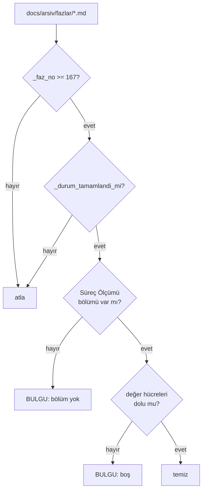

# Faz 169 — Faz Planı Sözleşmesi: Süreç Ölçümü ve Triyaj

> **Durum:** ✅ Tamamlandı (2026-09-13)
> **Kaynak:** [ADAYLAR.md](ADAYLAR.md) · **F-229** (keşif: [`kesif/2026-09-13-anew-karsilastirmasi.md`](kesif/2026-09-13-anew-karsilastirmasi.md) § 6 A4 · A6, § 9 H4 · H5)
> **Önkoşul:** 🚨 [Faz 168](arsiv/fazlar/168-KURTARMA-RAMPASI-KATALOGU.md) — triyajın "araştırılacak" sonucu `KR-05`'e gider. `KR-05` yoksa o sonucun **gideceği yer yoktur**. Ayrıca [Faz 167](arsiv/fazlar/167-AGENT-ZORLAMA-KATMANI.md) — `arsiv/fazlar/` için `ask` kuralı (bkz. Riskler)
> **Paketler:** Yok. Bu faz `src/` altına **hiç dokunmaz**
> **Yeni paket:** Yok · **Migration:** Yok
> **Public API:** Büyümüyor
> **Tüketici yüzeyi:** Yok — `docs-site/` sayfası yok, sevk edilen yapıt yok
> **Manuel test alanı:** [`docs/manuel-test/36-GELISTIRME-KAPILARI.md`](manuel-test/36-GELISTIRME-KAPILARI.md) — Faz 168'in bıraktığı numaradan devam eder

---

## Bu Faza Başlarken

> `faz-baslangic` skill'ini uygula. **Tamamını değil, yalnız işaret edilen
> bölümleri oku.**

1. Bu doküman
2. Değiştirilecek üç yapıt — **yalnız ilgili bölümler**:
   ```bash
   awk '/AŞAĞISI KAPANIŞTA DOLDURULUR/,0' .agents/skills/faz-planlama/resources/faz-plani-sablonu.md
   sed -n '161,215p' .agents/skills/faz-denetim/SKILL.md      # Adım 4 ve 5
   sed -n '198,215p' .agents/skills/faz-tamamlama/SKILL.md    # Adım 5
   ```
3. Yeniden kullanılacak kapı yardımcıları — **yeniden yazılmaz, çağrılır**:
   ```bash
   grep -n "_durum_tamamlandi_mi\|_faz_no\|_faz_bolumleri\|_FAZ_KAL\|_duser_mu" scripts/dokuman-bakim.py
   sed -n '654,675p' scripts/dokuman-bakim.py   # 13. kapının kalıbı
   ```
4. Kararlar — yalnız bir kalem:
   ```bash
   grep -n "K-413" docs/KARARLAR.md
   ```
   **K-413** — üretilen dosya disiplini; bu fazın kapısı aynı aileye girer.
5. Alan hafızası: [`hafiza/dokumantasyon.md`](hafiza/dokumantasyon.md) — kapı
   kalıbı, damıtma davranışı ve `_FAZ_KAL` burada yaşar.
6. Önceki fazın devir notu — Faz 168 **kapandı ve arşivlendi**:
   ```bash
   awk '/## Sonraki Faza Devir Notu/,0' docs/arsiv/fazlar/168-KURTARMA-RAMPASI-KATALOGU.md
   ```
   🚨 **`KR-05`'in tam adresi** (devir notundan, burada tekrarlanıyor ki
   triyajın üçüncü kanalı adressiz kalmasın): dosya
   [`.agents/ortak/kurtarma.md`](../.agents/ortak/kurtarma.md), bölüm
   `## \`KR-05\` — araştırılacak bulgu`. Çapa yazacaksan **hedefin slug'ını
   üret ve karşılaştır** — Faz 168'de elle yazılan bir çapa `İ`'nin görünmez
   `U+0307`'si yüzünden ölü çıktı ve denetim onu 🔴 olarak yakaladı.

---

## Amaç

İki boşluk, **aynı yapıt** üzerinde: faz planı şablonu.

1. **Süreç ölçülmüyor.** 167 faz koşuldu ve "plandan sapma", "düzeltme turu",
   "gerçek/gürültü bulgu", "üretilen regresyon" sayılarının **hiçbiri**
   tutulmuyor. Bu, ölçüm kültürü olan bir repo için tuhaf bir boşluktur —
   bütçe ölçülüyor, kapı süresi ölçülüyor, **sürecin kendisi ölçülmüyor**.
2. **Triyaj bağımsız değil.** `faz-denetim` Adım 5 bulguyu **uygulayan oturuma**
   veriyor. Denetçi bağımsızdır ama bulgunun **geçerli olup olmadığına** kendi
   kodunu savunmaya eğilimli oturum karar verir. Bu, `faz-denetim`'in kapatmak
   için var olduğu kör noktanın bir adım geriden tekrarıdır.

- **F-229** — şablona `## Süreç Ölçümü` girer, `--denetle`'ye 14. kapı eklenir,
  `faz-denetim` Adım 5 ikiye bölünür.

### Bugün ne çalışmıyor — doğrulanmış kanıt

| Kanıt | Gözlem |
|---|---|
| `scripts/dokuman-bakim.py:2152` (`denetle()`) | **13** bulgu kapısı koşuyor; hepsi aynı kalıpta. Hiçbiri süreç ölçmüyor |
| `artifacts/kapi-olcum.jsonl` | 173 satır · alanlar **tam olarak** `utc, stage, command, duration_seconds, exit_code`. **Faz numarası alanı yok** — "hangi faz kaç kırmızı tur yaşadı" bu dosyadan **türetilemez** |
| `.gitignore:26` | `artifacts/` **izlenmiyor**. Dosya yerel bir koşum kaydıdır; başka bir klonda **yoktur** |
| `.agents/skills/faz-denetim/SKILL.md:198` (Adım 5) | "Uygulayan oturum bulguları kapatır" — bulguyu **sınıflandıran** da odur |
| Faz dokümanları | Anlatı taşıyor ("2 🔴 düzeltildi"), **toplanabilir sayı** taşımıyor |

> Kanıtlar 2026-09-13 tarihinde yeniden doğrulandı.

🚨 **Aday listesinin bir iddiası hassaslaştırıldı.** F-229 "`kapi-olcum.jsonl`
kapı **sürelerini** tutar, kırmızı/yeşil turunu değil" diyordu. Ölçüldü: dosya
`exit_code` **taşır** — yani kırmızı/yeşili komut başına bilir. Eksik olan
başka: **faz bağı yok** ve dosya **git'te değil**. İddia doğru yere kayar ve
sonuç değişmez: geriye dönük türetme mümkün değildir.

---

## 169.1 — Şablon: `## Süreç Ölçümü`

`faz-plani-sablonu.md`'nin **kapanış yarısına** (`AŞAĞISI KAPANIŞTA DOLDURULUR`
işaretinin altına) bir bölüm girer. Beş metrik:

| Metrik | Değer |
|---|---|
| Plan revizyonu sayısı | |
| Düzeltme turu sayısı | |
| 🔴 bulgu: gerçek / gürültü / araştırılacak | |
| Fazın ürettiği regresyon | |
| Faz kapandıktan sonra bulunan kusur | |

🚨 **Tablo olmalı, onay kutusu değil.** `tamamlanmis_faz_isaretsiz_kutular()`
(`dokuman-bakim.py:654`) arşivdeki **her** `- [ ]` satırını hata sayar. Bu
bölüm onay kutusuyla yazılırsa, doldurulmadığı her fazda **ikinci** bir kapı
kırmızı döner ve bulgu kaynağı bulanıklaşır.

### Bölüm adı neden `Süreç Ölçümü`

Aday listesi bu bölüme `## Faz Scorecard'ı` diyordu ve bir tuzak tarif
ediyordu: `_FAZ_KAL`'a **iki kesme işareti varyantıyla** (U+0027 ve U+2019)
eklenmesi gerektiği.

Tuzak, adı değiştirerek **tamamen ortadan kalkar.** `Süreç Ölçümü` kesme
işareti taşımaz, tek varyantla eşleşir ve keşif raporu § 9 H4'ün **kendi
önerdiği** addır. 2026-09-13'te ölçüldü: repoda U+2019 sayısı **sıfır**, ve
`## Süreç Ölçümü` başlığı yalnız keşif raporunun içinde (kod bloğunda) geçiyor
— faz dokümanlarında çakışma yok.

Damıtma davranışı **koşularak** doğrulandı:

```
_duser_mu("Süreç Ölçümü", "Süreç Ölçümü") -> False
```

Bölüm damıtmada **düşmez**. `_FAZ_KAL`'a eklenmesi yine de gereklidir —
eklenmezse korunur ama her damıtmada *"tanınmayan bölüm KORUNDU"* uyarısı
basar ve gürültü kapıyı öldürür.

### Onay satırı

Şablonun başlık bloğuna bir satır daha girer:

```
> **Plan onayı:** <ad>, <YYYY-AA-GG> · <yoksa "onaylanmadı — uygulama başlamaz">
```

Bu satır **geriye dönük konmaz** ve bu fazdan sonra yazılan planlar için
geçerlidir. Faz 167 · 168 · 169 planları onsuz yazıldı; bu bir sapma değil,
kapsam sınırıdır.

---

## 169.2 — 14. kapı

`denetle()` bugün 13 bulgu kapısı koşuyor ve hepsi aynı kalıpta. 14.'sü
`ci.yml`'a **dokunmadan** koşar — CI zaten `dokuman-bakim.py --denetle`
çağırıyor.



### Eşik **167**'dir

🚨 **Eşik bir sayıdır ve kullanıcı kararıyla 167'dir** (2026-09-13). Turun
**üç** fazı da kapsanır; Faz 167 ve 168 bölümü gönüllü olarak taşır ve
doldurur. Sonuç: kapı doğduğu anda elde **üç** veri noktası olur ve keşif
raporu § 12'nin ilk sorusu (*"plandan sapma sayısı ile 🔴 bulgu sayısı korele
mi?"*) Faz 169 kapanışında sorulabilir hâle gelir — Faz 171'de değil.

Alternatifler **elenmiştir**:

| Alternatif | Neden olmaz |
|---|---|
| Tarih | `faz-damit` dosyayı yeniden yazar ve `Durum:` tarihi elle yazılır |
| Dosya içi işaret | İşareti silmek kapıyı **susturur** — tam olarak Faz 80 kusur sınıfı |
| Sabit bir **sonraki** numara (170) | Fazı muaf yapar; kapı hiç koşmadan yeşil commit edilir |

Geriye dönük 166 faz **doldurulmaz** (kullanıcı kararı). Geriye dönük türetme
ölçüm değil **tahmin** üretir.

### Uygulama kuralları

**Mevcut yardımcılar yeniden yazılmaz, çağrılır:**

| Yardımcı | Neden |
|---|---|
| `_faz_no(p)` (`:46`) | Dosya adından numara |
| `_durum_tamamlandi_mi(s)` (`:623`) | ✅ ve `Tamamlandı` eşanlamlılarını **zaten** biliyor; Faz 91'de `✅ Tamam` / `✅ Kod tamam` vakaları yüzünden genişletildi |
| `_faz_bolumleri(metin)` (`:1448`) | 🚨 Düz `split("## ")` **yapılmaz** — kod bloğu içindeki başlık belgeyi parçalar; bu yardımcı `_kod_bloklarini_soy` ile o tuzağı zaten kapatıyor |

**Kapı hiçbir şey YAZMAZ.** `tazelik_denetle()`'nin docstring'i bunu açıkça
söylüyor ve aynı sözleşme burada da geçerlidir.

**"Dolu" tanımı:** beş satırın **her birinin** değer hücresi boş değildir.
`ölçülmedi` **geçerli bir değerdir**; boş hücre değildir. Kapı bir sayı değil,
bir **karar** arar.

---

## 169.3 — Triyaj: denetçi önerir, kullanıcı seçer

🚨 **Bu tasarımı bir mekanik kısıt belirledi.** Alt agent'lardan
`AskUserQuestion` aracı kaldırılmıştır — **denetçi kullanıcıya soramaz.**
Dolayısıyla triyaj mekanik olarak **ana oturuma** aittir. Keşif raporu § 9 H5b
bunu varsaymıyordu; § 14 tasarımı buna göre düzeltti.

**`faz-denetim` Adım 4** — 🔴 tablosu bir sütun kazanır:

| # | Bulgu | Kanıt | Nasıl kırılır | **Denetçi önerisi** |
|---|---|---|---|---|

Öneri üç değerden biridir: **gerçek · gürültü · araştırılacak**. Denetçi
**önerir**, karar vermez.

**`faz-denetim` Adım 5** ikiye bölünür:

**5.1 — Triyaj (yalnız 🔴).** Ana oturum her 🔴 bulguyu kullanıcıya sorar ve
kullanıcı seçer:

| Sonuç | Ne olur |
|---|---|
| **gerçek** | Düzeltilir **+ düzeltmeyi kanıtlayan test** |
| **gürültü** | Reddedilir — **gerekçesi yazılır**. Gerekçesiz ret, aynı bulgunun geri gelmesidir |
| **araştırılacak** | Düzeltme **yok**. Önce minimal repro → **`KR-05`** (Faz 168). Repro varsa gerçektir; yoksa gerekçeli kapanış |

**5.2 — Uygulayan oturum kapatır.** Bugünkü Adım 5 gövdesi buraya taşınır ve
değişmez.

**Triyaj yalnız 🔴'lara uygulanır** (kullanıcı kararı). 🟡 ve 🟢 bugünkü akışta
kalır. Gerekçe `faz-denetim`'in kendi cümlesidir: *"denetim ucuz olmalıdır,
pahalı olursa atlanır"* — ve tek başına bir fazı durduran seviye 🔴'dır.

---

## 169.4 — İki metrik bugün otomatik okunamıyor

Beş metriğin **üçü** faz dokümanında **yazılı** bilgiden türetilir:

| Metrik | Kaynağı |
|---|---|
| Plan revizyonu sayısı | "Plandan Sapmalar" bölümü |
| 🔴 bulgu dağılımı | "Denetim Bulguları" bölümü + 5.1 triyajı |
| Faz kapandıktan sonra bulunan kusur | `kusur-giderme` koşumu, **sonradan** |

**İkisi ölçülmedi ve elle sayılacaktır:** "düzeltme turu" ve "üretilen
regresyon". Bugün hiçbir artefakttan okunamıyorlar — § *Amaç*'taki
`kapi-olcum.jsonl` ölçümü bunun sebebini veriyor.

Bu bir eksiklik değil, bir **devir teslim bilgisidir**. Hiç ölçmemek, iki
metriği elle saymaktan kötüdür.

---

## Planlanan Public API

**Yok.** Bu faz `src/` altına dokunmaz.

### Arayüz payı

Yok.

---

## Planlanan Dosya Listesi

```
.agents/skills/
├── faz-planlama/resources/
│   └── faz-plani-sablonu.md      DEĞİŞİR — `## Süreç Ölçümü` + onay satırı
├── faz-denetim/SKILL.md          DEĞİŞİR — Adım 4 sütunu, Adım 5 → 5.1 + 5.2
└── faz-tamamlama/SKILL.md        DEĞİŞİR — Adım 5'e bir satır

scripts/
├── dokuman-bakim.py              DEĞİŞİR — 14. kapı + `_FAZ_KAL` girdisi + eşik sabiti
└── dokuman_bakim_test.py         DEĞİŞİR — beş vaka

docs/manuel-test/
└── 36-GELISTIRME-KAPILARI.md     DEĞİŞİR — iki case
```

---

## Hata Modları ve Testler

| Ne bozulabilir | Seviye | Test |
|---|---|---|
| Kapı eşik altındaki 166 fazı da yakalar; arşivin tamamı kırmızı döner | Fonksiyonel | `dokuman_bakim_test.py` — eşik **altı** vakası |
| Tamamlanmamış (📋 Planlandı) bir faz bulgu üretir | Fonksiyonel | Aynı sınıf — plan durumu vakası |
| Bölüm var ama hücreler boş; kapı yeşil döner | Fonksiyonel | Aynı sınıf — **boş** vakası |
| `ölçülmedi` yazan hücre boş sayılır ve kapı kırmızı döner | Fonksiyonel | Aynı sınıf — **dolu** vakası |
| Kapı bir dosyaya yazar (yan etki) | Fonksiyonel | Aynı sınıf — "hiçbir şey YAZMAZ" iddiası; `tazelik_denetle()` emsali |
| Düz `split("## ")` kullanılır; kod bloğundaki `## ` belgeyi parçalar | Fonksiyonel | Vaka: gövdesinde kod bloğu içinde `## Süreç Ölçümü` geçen bir faz kaydı **bulgu üretmemeli** |
| `_FAZ_KAL` güncellenmez; her damıtma "tanınmayan bölüm" uyarısı basar | Manuel | `faz-damit` koşulur, uyarı çıktısı **boş** olmalı |
| Şablonda bölüm eklendi ama `faz-tamamlama` onu doldurmayı söylemiyor | Manuel | Adım 5 satırı `grep` ile doğrulanır |

Beş soru, bu fazın bağlamındaki cevaplarıyla:

| Soru | Cevap |
|---|---|
| İptal · eşzamanlılık · başka kiracı | Kapsam dışı — kod yolu yok |
| Boş/aşırı girdi | Boş bölüm, boş hücre, `ölçülmedi` — üçü de test edilir |
| Alt sistem hatası | Kapı dosya okur; `OSError` mevcut kapı kalıbındaki gibi **sessizce atlanır**, çökmez |

Sözleşme testi gerekmez: hiçbir sınır geçilmiyor.

---

## Manuel Kabul Case'leri

| # | Ön koşul | Adımlar | Beklenen sonuç |
|---|---|---|---|
| 1 | Faz 167 ve 168 arşivlenmiş, ikisi de `## Süreç Ölçümü` dolu | `python3 scripts/dokuman-bakim.py --denetle` | 14. kapı **✅ temiz**; çıkış `0` |
| 2 | Faz 167 kaydındaki bölümün bir değer hücresi elle boşaltılmış | Aynı komut | Çıkış `1`; o dosya adı ve satırı **raporlanır**; dosya **değişmemiş** olmalı (`git diff` boş) |

---

## Açık Sorular

| # | Soru | Seçenekler | Öneri |
|---|---|---|---|
| 1 | Kapı yalnız `docs/arsiv/fazlar/`'ı mı tarasın, kök `docs/NN-*.md`'yi de mi? | A: ikisini de · B: yalnız arşiv | **A** — `kapanmis_faz_bulgulari()` "tamamlanmış faz kökte" durumunu zaten yakalıyor ama **farklı** bir soruyu cevaplıyor. İkisini de taramak, eksik ölçümü arşivlemeden **önce** gösterir; arşivledikten sonra göstermek bir tur daha maliyettir |
| 2 | "Faz kapandıktan sonra bulunan kusur" satırını kim günceller? | A: `kusur-giderme` Adım 6'ya bir satır · B: elle, protokolsüz | **A** — protokolsüz bırakılan alan doldurulmaz. Satır ucuzdur: *kusurun geldiği faz biliniyorsa o fazın `Süreç Ölçümü` tablosuna bir çentik at* |
| 3 | Beş metrik yeterli mi; "kapı kırmızı dönüş sayısı" da eklensin mi? | A: beş kalsın · B: altıncı eklensin | **A** — keşif raporu altı satır öneriyordu, aday listesi beşe indirdi ve beşi de bugün ya yazılı bilgiden türetilir ya elle sayılır. Altıncısı `artifacts/` gitignore'da olduğu için **hiçbir klonda** okunamaz |

---

## Bitiş Ölçütleri (DoD)

- [x] `faz-plani-sablonu.md` kapanış yarısında `## Süreç Ölçümü` bölümü var; **tablo**, onay kutusu değil; beş satır taşıyor — ✅ beş satırlı tablo, `Denetim Bulguları`'nın önünde
- [x] Şablonun başlık bloğunda `> **Plan onayı:**` satırı var — ✅ `Durum:` satırının hemen altında; geriye dönük konmadı (kapsam sınırı)
- [x] `dokuman-bakim.py --denetle` **14** bulgu kapısı koşuyor (bugün 13) — ✅ ölçüldü: 14 (taban 13). Sayım komutu düzeltildi — üç sonuç biçimi de kapsanıyor (denetim 🟡 4)
- [x] Eşik sabiti **167** ve kodda adlandırılmış; tablo/anlatı içine gömülmemiş — ✅ `SUREC_OLCUMU_ESIGI = 167` (`dokuman-bakim.py:739`)
- [x] Kapı `_faz_no()`, `_durum_tamamlandi_mi()` ve `_faz_bolumleri()`'ni **çağırıyor**; `split("## ")` deseni kodda **yok** — ✅ üçü de çağrılıyor; `split("## ")` yalnız yasağı anlatan yorumda geçiyor
- [x] Kapı **hiçbir şey yazmıyor** — test bunu iddia ediyor — ✅ `test_kapi_HICBIR_SEY_YAZMAZ` bayt bayt karşılaştırıyor; gerçek repoda da `git diff` boş
- [x] `_FAZ_KAL` `"Süreç Ölçümü"` taşıyor; `faz-damit` koşumu "tanınmayan bölüm KORUNDU" uyarısı **basmıyor** — ✅ ve denetim 🟡 1 ile iki bölüm daha eklendi (`Örnek Uygulama Koşumu`, `Faz Dışı Bulunan ve Kapatılan Kusur`); `faz-damit` koşumu **sıfır** uyarı basıyor
- [x] `dokuman_bakim_test.py` **beş** vaka taşıyor: eşik altı · bölüm yok · bölüm boş · bölüm dolu (`ölçülmedi` dahil) · plan durumu; artı "yazmaz" iddiası — ✅ aşıldı: `SurecOlcumuTestleri` **12** vaka (beş DoD vakası + kod bloğu + kök tarama + fazladan satır + eksik metrik + yazmaz + `_FAZ_KAL` + 🔴 1'in düzeltmesi)
- [x] `faz-denetim` Adım 4 🔴 tablosu "Denetçi önerisi" sütunu taşıyor; değerler `gerçek / gürültü / araştırılacak` — ✅ sütun eklendi; bu fazın kendi denetimi onu **ilk kez** doldurdu
- [x] `faz-denetim` Adım 5 **5.1 (triyaj, yalnız 🔴)** ve **5.2 (kapatma)** olarak bölünmüş; 5.1 "araştırılacak" sonucunu **`KR-05`'e** bağlıyor ve bağlantı `kirik_baglantilar()`'dan geçiyor — ✅ bölündü; 5.1 `KR-05`'e hem dosya yolu hem **üretilip karşılaştırılmış** çapa ile bağlanıyor. `kirik_baglantilar()` → 0
- [x] `faz-tamamlama` Adım 5 `## Süreç Ölçümü`'nün doldurulmasını söylüyor — ✅ ve iki metriğin elle sayılacağı **açıkça** yazıldı
- [x] 🚨 Faz **167 ve 168**'in arşivlenmiş kayıtları `## Süreç Ölçümü` bölümünü **hâlâ taşıyor** ve dolu — damıtma onları düşürmemiş — ✅ ikisi de bölümü dolu taşıyor; damıtma düşürmedi (`_duser_mu` → `False`, koşularak doğrulandı)
- [x] Bu fazın **kendi** `## Süreç Ölçümü` tablosu dolu; kapı onu **gerçekten** denetliyor (eşik 167 ≤ 169) — ✅ dolu; kapı onu kökte **gerçekten** denetliyor (mutation ile kırmızı görüldü, satır numarası raporlandı)
- [x] `python3 -m unittest discover -s scripts -p "*_test.py"` yeşil — ✅ **279** yeşil (taban 260)
- [x] `python3 scripts/dokuman-bakim.py --denetle` çıkış `0`; kırık bağlantı `0` — ✅ arşivleme sonrası 0; kırık bağlantı 0
- [x] Dört doğrulama kapısı sıfır uyarı verir (`python3 scripts/kapi.py kapanis --taban <faz öncesi commit>`) — ✅ `kapi.py kapanis --taban 66fcddbd`. 🚨 İlk tam test koşumunda **bir** test düştü (`TwoProcessLeaseTakeoverTests.A_dead_workers_job_is_not_taken_over_before_its_lease_expires`); izole geçti ve **ikinci tam koşum** 21 proje / 7039 test ile temiz döndü — kaynak çekişmesi sınıfı, kusur değil
- [x] `samples/Tracon.Api` ile gerçek `run` yapıldı, çıktı belgeye yazıldı — 🚨 **bu faz kod değiştirmez; koşum bir regresyon kanıtıdır** (Faz 92 emsali) — ✅ koşuldu; SSE akışı, 7 agent ve 401/200 guard'ı belgeye yazıldı
- [x] `secret` taraması boş döndü — ✅ `kapi.py tarama` → temiz; token yalnız ortam değişkeninde yaşadı (K-059)
- [x] Manuel kabul case'leri `docs/manuel-test/36-GELISTIRME-KAPILARI.md` içine eklendi; ikisi de koşuldu — ✅ **üç** case eklendi (`MT-GDK-036`·`037`·`038` — üçüncüsü faz dışı kusurun kapısını koruyor); üçü de koşuldu
- [x] `faz-denetim` koşuldu — Faz 167'nin `faz-denetcisi` tipiyle **ve** bu fazın kendi 5.1 triyajıyla; 🔴 bulgu kalmadı — ✅ `faz-denetcisi` tipiyle; 1 🔴 (triyaj: gerçek, düzeltildi) · 6 🟡 (hepsi kapandı) · 1 🟢 (düzeltildi). 🔴 kalmadı

### Doğrulama komutları

```bash
# 14 kapı koşuyor mu (bugün 13) — üç ayrı sonuç biçimi vardır, deseni üçü de
# kapsar: `✅ temiz` · `❌ N bulgu` · `N bulgu` · `Kırık bağlantı: N`
python3 scripts/dokuman-bakim.py --denetle | grep -cE ": (✅ temiz|❌ [0-9]+ bulgu|[0-9]+ bulgu|[0-9]+)$"

# Eşik kodda adlandırılmış mı — sabitin ADI aranır, sayı değil
grep -n "SUREC_OLCUMU_ESIGI = " scripts/dokuman-bakim.py

# Yasak desen KOD olarak yok (tek eşleşme, yasağı anlatan yorum satırıdır)
grep -n 'split("## ")' scripts/dokuman-bakim.py | grep -v "^[0-9]*: *#"

# 167 ve 168 kayıtları bölümü koruyor mu
grep -l "^## Süreç Ölçümü" docs/arsiv/fazlar/16[789]-*.md

# Kapı yazmıyor mu
python3 scripts/dokuman-bakim.py --denetle >/dev/null; git diff --stat   # boş
```

---

## Riskler

| Risk | Önlem |
|------|-------|
| **Süreç ölçümü ritüele döner.** Her fazda `0/0/0` yazılırsa kapı yeşil kalır ve hiçbir şey ölçmez | Kabul edilir ve **karar defterine açıkça yazılır**: kapı bölümün **varlığını** denetler, doğruluğunu değil. Hiçbir kapı doğruluğu denetleyemez |
| Triyaj her 🔴 bulguda bir kullanıcı turu ekler; denetim pahalılaşır ve atlanır | 🔴'ya sınırlamak bunu hafifletir. `faz-denetim`'de bulgu enflasyonu yasağı zaten var |
| "Faz kapandıktan sonra bulunan kusur" satırı kapanışta hep `0`'dır; değeri **sonradan** güncellenmesindedir — ama dosya o sırada `arsiv/fazlar/` altındadır | Faz 167 o yola **`deny` değil `ask`** koyar. İki kalem burada çarpışır; `ask` seçimi çarpışmayı çözer. 🚨 Faz 167 `deny` koyduysa bu satır **yazılamaz** ve faz durur |
| Şablon değişir ama akıştaki hiçbir skill onu doldurmayı söylemez; bölüm boş doğar | `faz-tamamlama` Adım 5 satırı DoD'dedir |
| 167 ve 168 arşivlenirken bölüm damıtmada düşer ve kapı doğduğu anda kırmızı olur | `_duser_mu` **koşularak** doğrulandı (`False`). Ayrıca DoD satırı arşivlenmiş kayıtları `grep` ile kontrol ediyor |
| İki metrik elle sayılır; elle sayılan metrik bayatlar ve güvenilmez olur | Üçü yazılı bilgiden türetilir, elle sayım **yalnız ikisindedir** ve kapı sayı değil **karar** arar — `ölçülmedi` geçerli bir değerdir |

---

<!-- ============================================================
     AŞAĞISI KAPANIŞTA DOLDURULUR — `faz-tamamlama` skill'i.
     Plan anında boş kalır. Başlıkları SİLME.
     ============================================================ -->

## Plandan Sapmalar

**1. `hafiza/dokumantasyon.md` planın iddia ettiği bilgiyi TAŞIMIYORDU.**
"Bu Faza Başlarken" 5. kalem oraya yolluyordu: *"kapı kalıbı, damıtma
davranışı ve `_FAZ_KAL` burada yaşar"*. Ölçüldü:
`grep -n "_FAZ_KAL\|kapı kalıbı\|damıtma" docs/hafiza/dokumantasyon.md` →
**sıfır** eşleşme. Kaynak kodun kendisi okundu (`dokuman-bakim.py:1397`
`_FAZ_KAL`, `:1625` `_faz_damit_metni`). Plan satırı yanlıştı; kod doğruydu.
Satır numaraları da kaymıştı: `_faz_bolumleri` `:1448` değil `:1468`'de.

**2. Kapı beş satırı ADIYLA arar, satır SAYISINA bakmaz.** Plan *"beş satırın
her birinin değer hücresi boş değildir"* diyordu. Ölçüldü: Faz 167'nin
tablosu **yedi** satır taşıyor (`Denetim sonrası düzeltme turu`, `Faz dışı
bulunan ve kapatılan kusur`) ve bazı değerleri **kalın** yazıyor. Satır
sayısına bakan bir kapı gerçek bir tabloyu eksik sanardı. Uygulama: beş
**zorunlu etiket** aranır, fazladan satır serbesttir, eşleşme `_tablo_etiketi`
ile biçimden bağımsızdır (`**`/`` ` ``/boşluk normalize edilir).

**3. Bölüm gövdesindeki kod bloğu da soyulur.** Plan yalnız BAŞLIK tespitinde
`_faz_bolumleri`'yi zorunlu kılıyordu. Satır ayrıştırması da
`_kod_bloklarini_soy`'dan geçirildi: şablonu **gösteren** bir faz kaydının
örnek tablosu gerçek tablonun yerine geçmesin. Bu sınıfın repodaki beşinci
vakası; dördü kod yorumlarında yazılı.

**4. Kapsam bir faz dışı kusurla büyüdü** (kullanıcı talimatı: *"konuyla
alakasız bug/defect'lerle karşılaşırsan onları da çöz"*). Ayrıntı aşağıda.

**5. `docs/hafiza/dokumantasyon.md` bütçeyi aştı ve İKİYE BÖLÜNDÜ.** Faz dışı
kusurun notu eklenince 16.702 B > 16.000 B. Kural içeriği silmez, taşır:
karar defteri bakımı, karar indeksi üretimi ve faz arşivleme bölümleri yeni
[`hafiza/defter-bakimi.md`](hafiza/defter-bakimi.md) dosyasına gitti
(12.645 B + 4.691 B, ikisi de bütçede ve DAR değil). İki dosya birbirine
başlıktan yollar; `00-INDEKS.md` satırı eklendi.

**Sapmayan:** eşik 167, `## Süreç Ölçümü` adı, `_duser_mu` davranışı, `KR-05`
adresi, `ask` kuralı (`deny` değil) ve `split("## ")` yasağı — hepsi
ölçümde tuttu.

## Faz Dışı Bulunan ve Kapatılan Kusur

**Karar başlığındaki İÇ İÇE `**` üretilen indeksi SESSİZCE kesiyordu.**

Bu fazın kendi K-767'sini yazarken ortaya çıktı: indeks satırı
`Süreç ölçümü eşiği sabit sayı 👤` diye bitti. Sebep `_kararlar_kalemleri()`'nin
tembel `\*\*(.+?)\*\*` deseniydi — başlığın içindeki ilk `**` başlığı orada
kapatıyordu.

**Sınıf taraması** (`kusur-giderme` Adım 5) iki **mevcut** vaka buldu:

| Kalem | İndekste nasıl görünüyordu |
|---|---|
| K-413 | `… ÜRETİLEN dosyadır; kaynak her fazın kendi \`>` — cümle yarıda |
| K-523 | `… \`docs/` — cümle yarıda |

İkisi de `--denetle` **yeşilken** bozuktu; hiçbir kapı görmedi. İki ayrı hata
modu, iki ayrı çözüm:

- K-413 ve K-523'te `**` bir **kod parçasının içindeydi** (`` `> **Durum:**` ``,
  `` `docs/**.md` ``) — orada `**` bir vurgu değil, **gösterilen metindir**.
  Kaçış (`\*\*`) eklemek kod parçasının içinde birebir görüntülenir ve
  başlığı bozar. Doğru çözüm üreteçtedir: yeni `_karar_basligi()` başlığın
  kapanışını `_kod_bloklarini_soy`'dan geçmiş satırda bulur, metni
  **orijinalden** keser (soyucu uzunluğu korur, indeksler hizalıdır).
- K-767'de `**` gerçek bir vurguydu; başlık `` `167` `` koduna çevrildi.

Üçüncü vaka kapı gerektirdi (`kusur-giderme` Adım 6): yeni
`_kesik_karar_basliklari()`, `kararlar_denetle()` içinden koşar. İmza,
başlığı kapatan `**`den sonraki kuyruğun **boşlukla başlamamasıdır** — meşru
kuyruklar (`**(Faz 168)**`, `*(kullanıcı kararı)*`, `🚨`) her zaman boşlukla
başlar. Kapı mutation ile kırmızı görüldü; düzeltmeden önce iki gerçek bulgu
bastı, düzeltmeden sonra temiz. Ders
[`hafiza/defter-bakimi.md`](hafiza/defter-bakimi.md) içine yazıldı.

Bu bir bulgu **kapısı değildir** — mevcut "Karar defteri" kapısının içine
girdi, bu yüzden `--denetle`'nin kapı sayısı **14**'te kalır.

## Bu Fazda Verilen Kararlar

| Karar | Özet |
|---|---|
| **K-766** | Süreç ölçümü kapısı bölümün **varlığını** denetler, doğruluğunu denetlemez. `0/0/0` yeşil geçer; hiçbir kapı bir fazın gerçekten kaç düzeltme turu yaşadığını doğrulayamaz. Sınır yazıldı (K-764 deseni) |
| **K-767** | Eşik sabit sayı `167`'dir (kullanıcı kararı); geriye dönük 166 faz doldurulmaz. Tarih · dosya içi işaret · "sonraki numara" alternatifleri gerekçesiyle elendi |
| **K-768** | 🔴 bulgunun triyajını **kullanıcı** yapar; denetçi yalnız önerir. Mekanik kısıt: alt agent'ların araç kümesinde `AskUserQuestion` yoktur |

Faz dışı kusur için **karar kaydı açılmadı**: üreteç davranışı yerel bir
implementation tercihidir, public API/güvenlik/kalıcı veri sınırı geçmez
(`AGENTS.md` karar defteri kuralı). Ders alan dosyasında yaşıyor.

## Gerçekleşen Public API

**Yok.** `git diff --stat 66fcddbd -- src/` → **0 satır**. Bu faz `src/`,
`samples/` ve `tests/` altına hiç dokunmadı.

## Dosya Listesi (gerçekleşen)

```
.agents/skills/
├── faz-planlama/resources/faz-plani-sablonu.md   `## Süreç Ölçümü` + `Plan onayı:` satırı
├── faz-denetim/SKILL.md                          Adım 4 sütunu · Adım 5 → 5.1 + 5.2
├── faz-tamamlama/SKILL.md                        Adım 5'e iki satır
└── kusur-giderme/SKILL.md                        Adım 6'ya "çentik at" satırı (Açık Soru 2 → A)

scripts/
├── dokuman-bakim.py          `surec_olcumu_bulgulari` · `_tablo_etiketi` · eşik sabiti ·
│                             `_FAZ_KAL` girdisi · `_karar_basligi` · `_kesik_karar_basliklari`
└── dokuman_bakim_test.py     19 yeni vaka (12 süreç ölçümü + 7 kesik başlık)

docs/
├── KARARLAR.md               K-766 · K-767 · K-768; K-413 ve K-523 başlıkları onarıldı
├── hafiza/dokumantasyon.md   BÖLÜNDÜ (bütçe aşımı)
├── hafiza/defter-bakimi.md   YENİ — defter bakımı tuzakları
├── hafiza/00-INDEKS.md       yeni alan satırı
├── manuel-test/36-GELISTIRME-KAPILARI.md   `MT-GDK-036` · `MT-GDK-037`
└── manuel-test/00-INDEKS.md  sayım 35 → 37

ÜRETİLEN (elle yazılmadı): docs/KARARLAR-INDEKS.md · docs/arsiv/KARARLAR-INDEKS-ARSIV.md
```

## Testler

| Sınıf | Ne doğrular | Vaka |
|---|---|---|
| `SurecOlcumuTestleri` | Eşik altı atlanır · bölüm yok · tamamlanmamış faz · boş hücre (satır numarasıyla) · eksik metrik satırı · dolu tablo (`ölçülmedi` dahil) · fazladan satır ve kalın yazım · kod bloğundaki başlık · kök `docs/` taraması · **kapı hiçbir şey yazmaz** · `_FAZ_KAL` koruması · 🔴 1'in düzeltmesi: satır içi kod (`` `ölçülmedi` ``) geçerli bir değerdir | 12 |
| `KesikKararBasligiTestleri` | İç içe vurgu bulgudur · meşru kuyruk işaretçileri yanlış pozitif üretmez · karar olmayan satır atlanır · **kod parçası içindeki `**` bulgu değildir** · gerçek defterde kesik başlık yok · kapı üretecin gördüğü HER satırı tarar | 7 |

`python3 -m unittest discover -s scripts -p "*_test.py"` → **279 test, yeşil**
(faz öncesi **260**; ölçüldü — `git stash` ile taban sürümde koşuldu).

## Süreç Ölçümü

| Metrik | Değer |
|---|---|
| Plan revizyonu sayısı | **5** — plan okuma listesi yanlış dosyaya yolluyordu · kapı satır sayısı yerine etiket arar · gövde kod bloğu da soyulur · kapsam faz dışı kusurla büyüdü · alan hafızası bütçeyi aşıp ikiye bölündü |
| Düzeltme turu sayısı | **4** — `kapi_test` bayat doküman referansı (test fixture adı) · K-767 indeks kesilmesi · kaçış yerine üreteç düzeltmesi · `dokumantasyon.md` bütçe aşımı. Hiçbiri `KR-06`'nın üç tur limitini kod üzerinde zorlamadı; dördü de ayrı yüzeylerde |
| 🔴 bulgu: gerçek / gürültü / araştırılacak | **1 / 0 / 0** — tek 🔴 gerçekti ve düzeltildi (triyajı kullanıcı verdi, Adım 5.1). Ayrıca 🟡 **6** (altısı da kapandı) · 🟢 **1** (aday listesine gitmedi, düzeltildi) |
| Fazın ürettiği regresyon | **0** — `src/`, `samples/`, `tests/` altına sıfır satır; dört kapı yeşil |
| Faz kapandıktan sonra bulunan kusur | ölçülmedi (faz yeni kapanıyor) |

Faz dışı bulunan ve kapatılan kusur: **1** (iç içe `**` → kesik karar indeksi;
sınıf taraması iki mevcut vaka buldu).

## Örnek Uygulama Koşumu

`samples/Tracon.Api` Release'te ayağa kaldırıldı (2026-09-13, `:5080`).
Bu faz `src/`, `samples/` ve `tests/` altına **hiç** dokunmadı
(`git diff --stat 66fcddbd -- src/ samples/ tests/` → **0 satır**), bu yüzden
koşum bir davranış kanıtı değil, **regresyon kanıtıdır**.

| Ne | Gerçek çıktı |
|---|---|
| Başlatma | `MCP discovery completed: 0 tools available` · `Now listening on: http://localhost:5080` · `Application started` |
| `GET /tracon/api/agents` (token'sız) | `401` · `"A valid 'Authorization: Bearer <token>' header is required."` |
| `GET /tracon/api/agents` (Bearer) | `200` · **7 agent**: `cached-support`, `order-summary`, `researcher`, `router`, `summarizer`, `support`, `translator` |
| `POST /tracon/api/agents/support/run` | SSE: `event: run` + `{"runId":"01a09bbb-74a8-7cdf-ae65-8b7e9f7c6210","sessionId":null}`, ardından beş `event: update` (`"Echo: "`, `"Faz "`, `"169 "`, `"süreç "`, `"ölçümü "`) ve `event: done`. Akış parça parça geldi, `authorName` `support` |
| `GET /health` | `Degraded` — Faz 168'deki ile **aynı**; `TraconHealthCheck` teyit edilmiş bir model sağlayıcısı ister ve demo `echo` sağlayıcısı o listeye girmez. Bu fazın ürettiği bir kusur değildir |

🚨 **Koşumun kendisi bir tuzak öğretti.** İlk denemede `AuthToken`
`Tracon__Api__AuthToken` ile verildi ve etkisiz kaldı: gerçek anahtar
`Tracon:Ui:AuthToken`'dır (`samples/Tracon.Api/appsettings.json:42`). Sonuç
**sessizdi ve ters okunuyordu** — token'sız istek `200` döndü (auth kapalıydı),
Bearer taşıyan istek `401` döndü (boş yapılandırılmış token hiçbir değerle
eşleşmez). Yanlış bir env değişkeni adı, guard'ı "çalışmıyor" gibi gösterir.
`AuthToken` yerel bir ortam değişkeninden verildi; hiçbir dosyaya veya
veritabanına yazılmadı (K-059) ve `kapi.py tarama` temiz döndü.

## Denetim Bulguları

Denetçi `faz-denetcisi` tipiyle, taze bağlamla koştu (2026-09-13). Taban
`66fcddbd`; 14 dosya + izlenmeyen `defter-bakimi.md`. **Triyaj bu fazın kendi
5.1 adımıyla koştu — 🔴 kullanıcıya soruldu ve kullanıcı karar verdi.**

### 🔴 (1) — triyaj: **gerçek**

| # | Bulgu | Triyaj | Sonuç |
|---|---|---|---|
| 1 | Yeni kapı gövdeyi `_kod_bloklarini_soy`'dan geçiriyordu; o yardımcı **satır içi kodu da** boşlukla doldurur. `` `ölçülmedi` `` yazan geçerli bir hücre kapıya **boş** görünüyordu — oysa `faz-tamamlama` Adım 5 ve şablonun kendisi tam olarak o yazımı öğretiyor | **gerçek** (kullanıcı kararı; denetçi önerisi de gerçekti) | **Düzeltildi.** `_fence_bloklarini_soy` ayrıldı: hücre ayrıştırması yalnız **fence**'i soyar, satır içi kodu korur. `_kod_bloklarini_soy` artık onu çağırır — diğer çağıranların davranışı **değişmedi**. Düşen test önce yazıldı: `test_SATIR_ICI_KOD_degeri_GECERLIDIR` |

### 🟡 (6) — altısı da **kapandı**

| # | Bulgu | Sonuç |
|---|---|---|
| 1 | `faz-damit` iki "tanınmayan bölüm KORUNDU" uyarısı basıyordu; biri bu fazın açtığı H2 | Düzeltildi — `_FAZ_KAL`'a `Örnek Uygulama Koşumu` **ve** `Faz Dışı Bulunan ve Kapatılan Kusur` eklendi. Koşum artık **sıfır** uyarı basıyor (ikincisi taban durumdan devralınan bir gürültüydü, o da kapandı) |
| 2 | Kapanış bölümlerini sayan iki skill listesi yeni bölümü bilmiyordu | Düzeltildi — `faz-planlama/SKILL.md:174` tablosuna ve `faz-tamamlama/SKILL.md:322` listesine eklendi; `faz-planlama`'ya ayrıca "tablo, onay kutusu değil" uyarısı kondu |
| 3 | Kesik başlık kapısı yalnız §2'yi tarıyordu; üreteç dosyanın **tamamını** okur (134 satırlık reddedilen kararlar tablosu denetlenmiyordu) | Düzeltildi — kapı artık üretecin gördüğü satır kümesinin aynısını tarar. Mutation ile doğrulandı: reddedilen tablodaki bir kesik başlık (`KARARLAR.md:15`) yakalanıyor. Yeni test: `test_kapi_URETECIN_gordugu_HER_satiri_tarar` |
| 4 | Doküman sayıları ölçümle tutmuyordu (15/5 → gerçek 19/7) ve üç doğrulama komutu yanlış sonuç veriyordu | Düzeltildi — sayılar ölçüldü (sınıf başına test sayımıyla; taban 260, şimdi 279), üç komut da **koşularak** doğrulandı. Kapı sayım komutu artık üç sonuç biçimini de kapsıyor ve **14** döndürüyor |
| 5 | `docs/hafiza/defter-bakimi.md` izlenmiyordu; `git commit -am` onu dışarıda bırakırdı | Kapandı — dosya `git add` ile açıkça eklendi ve commit içeriği `git status` ile doğrulandı |
| 6 | `docs/KARARLAR.md` bütçenin %99,4'ünde; üç karar yazan sonraki faz kapıyı kırar | Gerekçelendi ve **devredildi** — bu fazda `karar-damit` koşulmadı (ayrı bir iş ve ayrı bir risk); zorunluluk ve K-214 kuralı **Devir Notu**'na yazıldı |

### 🟢 (1)

| # | Bulgu | Sonuç |
|---|---|---|
| 1 | `MT-GDK-036/037` satırları kapanış `\|`'ını taşımıyor; `036`'nın "çıkış `0`" beklentisini kendi 🚨 cümlesi çürütüyor | Aday listesine **gitmedi, düzeltildi** — kozmetikti ve maliyeti bir satırdı. `036` artık yalnız kapı satırını iddia ediyor, çıkış kodu iddiasını bırakıyor |

### Denetçinin ayrıca doğruladıkları (bulgu değil)

`KR-05` çapası canlı (başlık hexdump'landı, gizli `U+0307` yok, slug birebir) ·
`K-413`/`K-523` üretilen indekste artık **tam** · eşik davranışı (166 atlanır,
167/168 dolu, kök `docs/169-*.md` gerçekten taranır) · `split("## ")` kodda yok ·
test tiyatrosu yok (`test_kapi_HICBIR_SEY_YAZMAZ` bayt karşılaştırır) · public
API büyümedi · `secret` taraması temiz.

**Temiz çıkan denetim başlıkları:** 3.2 · 3.3 · 3.5 · 3.6 · 3.7

## Sonraki Faza Devir Notu

Bu, üç fazlık turun **son** fazıdır. Üçünün birlikte bıraktığı sözleşme:

| Sözleşme | Nerede yaşar | Faz |
|---|---|---|
| Denetçi tipi — salt-okunur, yazma araçları araç kümesinde yok | [`.claude/agents/faz-denetcisi.md`](../.claude/agents/faz-denetcisi.md) | 167 |
| `KR-01…12` kurtarma rampaları — gövde **tek yerde**, katalog bağlar | [`.agents/ortak/kurtarma.md`](../.agents/ortak/kurtarma.md) | 168 |
| `## Süreç Ölçümü` — eşik **167**, kapı `surec_olcumu_bulgulari()` | `faz-plani-sablonu.md` + `dokuman-bakim.py` | 169 |
| 🔴 triyajı **kullanıcıya** aittir (5.1), kapatma uygulayana (5.2) | `faz-denetim/SKILL.md` | 169 |

**🚨 Sonraki faz için zorunlu — `docs/KARARLAR.md` bütçe duvarında.**
Ölçüldü (2026-09-13): 417.565 / 420.000 B, kalan **2.435 B**. Bu faz tek başına
2.169 B yazdı. **İki karar yazan bir sonraki faz kapıyı kırar.** K-214 kuralı
açıktır: *"bu kez bütçe büyütülmez, bölünme uygulanır."* Yol `karar-damit`
(satır sınırı `KARAR_SINIRI = 450`) ya da eski kalemlerin
`arsiv/KARARLAR-GECMISI.md`'ye damıtılmasıdır. Bunu keşfe bırakma — kapı
kırmızı döndüğünde faz **ortasında** olacaksın.

**Keşif raporu § 12'nin üç ölçütü ilk kez cevaplanabilir.** Elde **üç** veri
noktası var (167 · 168 · 169):

| Faz | Plan revizyonu | Düzeltme turu | 🔴 (gerçek/gürültü/araştırılacak) | Regresyon |
|---|---|---|---|---|
| 167 | 4 | 0 kod turu | 0 / 0 / 0 (🟡 4) | 0 |
| 168 | 0 | 2 | 2 / 0 / 0 | 0 |
| 169 | 5 | 4 | 1 / 0 / 0 (🟡 6, 🟢 1) | 0 |

İlk okumalar — **üç nokta bir eğilim değildir**, hipotezdir:

1. *Plandan sapma ile 🔴 korele mi?* Üç noktada **ters** görünüyor: sapması
   sıfır olan Faz 168 en çok 🔴 aldı. Olası açıklama: sapma sayısı planın
   **yanlışlığını** değil, uygulayanın planı **ölçtüğünü** gösterir.
2. *Düzeltme turu ile regresyon korele mi?* Üçünde de regresyon **0**; ölçüt
   bu turda ayırt edici değil. Regresyon üreten bir faz gelmeden cevaplanamaz.
3. *Ölçüm ritüele döndü mü?* Henüz hayır — üç tablo da farklı sayılar taşıyor
   ve hiçbiri `0/0/0` değil. 🚨 K-766 bu riski **kabul etti**: kapı varlığı
   denetler, doğruluğu denetleyemez. Beşinci veri noktasında yeniden bak.

**Bilinen sınırlar (devralınıyor, yeni değil):**

- `kirik_baglantilar()` **dosyayı** doğrular, `#fragment`'ı doğrulamaz. Bu fazın
  eklediği `KR-05` çapası elle üretilip karşılaştırıldı; kapı onu korumaz.
  Fragment doğrulayan kapı hâlâ 🟢 adaydır (Faz 168'den devrediyor).
- `## Süreç Ölçümü`'nün **iki** metriği ("düzeltme turu", "üretilen regresyon")
  elle sayılır. `artifacts/kapi-olcum.jsonl` faz numarası taşımaz ve
  `.gitignore`'dadır. `kapi.py`'ye bir `--faz` bayrağı eklemek bu ikisini
  otomatik okunur hâle getirir; ölçülmedi, aday değil, **gözlem**.
- `Plan onayı:` satırı şablona girdi ama **geriye dönük konmadı**. Faz 170 bu
  satırı taşıyan **ilk** plan olmalıdır; taşımıyorsa kapı sessizdir — o satırın
  kapısı **yoktur** (bilinçli: onay bir insan eylemidir, dosya durumu değil).
