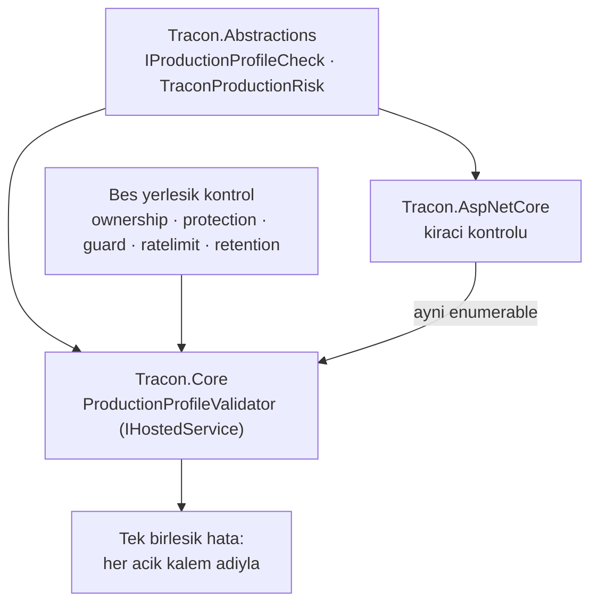

# Faz 170 — Production Profil Kapısı

> **Durum:** 📋 Planlandı (2026-09-14)
> **Plan onayı:** onaylanmadı — uygulama başlamaz
> **Kaynak:** [ADAYLAR.md](ADAYLAR.md) · **F-231**
> **Önkoşul:** [Faz 150](arsiv/fazlar/150-ZORUNLU-BINDING-PROFILI.md) — `RequireCustomBinding` + `RequiredBindingValidator` deseni; bu faz onun **options yarısıdır**
> **Paketler:** `Tracon.Abstractions` (risk enum'u + katkı sözleşmesi) · `Tracon.Core` (doğrulayıcı + beş yerleşik kontrol) · `Tracon.AspNetCore` (kiracı kontrolünün katkısı)
> **Yeni paket:** Yok · **Migration:** Yok
> **Public API:** Büyüyor — bir `ITraconBuilder` üyesi, bir seçenek sınıfı, bir `enum`, bir istisna tipi, bir katkı arayüzü. `wc -l src/*/PublicAPI.Shipped.txt` → **17 satır / 17 dosya** (2026-09-14, yalnız `#nullable enable` başlıkları): **shipped giriş sıfır, bugün eklemek bedava.** GA'da `Shipped` dolduktan sonra aynı ekleme bir sürüm kararıdır
> **Tüketici yüzeyi:** Site: `guides/production.md` (Production-sensitive defaults tablosu ve dağıtım checklist'i — ikisi de 2026-09-14'te güncellendi, bu faz onlara kapıyı bağlar) · `guides/embedding.md` ("Make a binding required" bölümünün kardeşi) · `getting-started/security.md`
> · Sevk edilen: `ITraconBuilder`'ın XML `<example>`'ı · `src/Tracon.Core/README.md` · `capabilities.md` satırı
> **Manuel test alanı:** [`docs/manuel-test/13-KIRACI-VE-GUVENLIK.md`](manuel-test/13-KIRACI-VE-GUVENLIK.md) — `MT-SEC-182`'den devam

---

## Bu Faza Başlarken

> `faz-baslangic` skill'ini uygula. **Tamamını değil, yalnız işaret edilen
> bölümleri oku.**

1. Bu doküman; ilk kod satırından önce `faz-uygulama` skill'i.
2. Kararlar — dosyanın tamamını **okuma**, yalnız bu kalemleri grep'le:
   ```bash
   grep -n "K-059\|K-421\|K-057\|K-228\|K-232" docs/KARARLAR.md
   ```
   **K-059** (`secret` veritabanına da yazılmaz — risk kabul kaydı bir `secret`
   taşımaz), **K-421** (`EnablePublicApiTracking` açıktır), **K-057**
   (bağımlılık yönü — bu fazın en belirleyici kısıtı, §170.2),
   **K-228/K-232** (arayüz sözlüğü ve sunucu yanıtı; bu faz arayüze dokunmaz
   ama kararın sınırını bilmek gerekir).
3. [Faz 150](arsiv/fazlar/150-ZORUNLU-BINDING-PROFILI.md) — yalnız devir notu ve
   "Amaç" bölümü:
   ```bash
   awk '/## Sonraki Faza Devir Notu/,0' docs/arsiv/fazlar/150-ZORUNLU-BINDING-PROFILI.md
   ```
   Bu faz onun kardeşidir: 150 **binding**'leri, 170 **options**'ı kapsar.
   Aynı hata mesajı sözleşmesi (hangi kalem · bugünkü değer · nasıl düzeltilir)
   birebir devralınır.
4. Alan hafızası (bu faz üç alana dokunuyor):
   [`hafiza/aspnetcore-di.md`](hafiza/aspnetcore-di.md) (`TryAdd` sırası ve
   yaşam döngüsü) · [`hafiza/olcum-kota-ve-secenekler.md`](hafiza/olcum-kota-ve-secenekler.md)
   (`Bind()` ve seçenek tuzakları) ·
   [`hafiza/genisleme-noktalari-ve-denetim.md`](hafiza/genisleme-noktalari-ve-denetim.md)
   (genişleme noktası kaydı).
5. Gerektiğinde, tamamı değil ilgili bölümü:
   [`MIMARI-GUVENLIK.md`](MIMARI-GUVENLIK.md) — kiracı ve rol bölümleri.

---

## Amaç

`AddTracon()` her genişleme noktasını `TryAdd` ile kaydeder ve güvenlik duyarlı
her anahtar **izin verici** varsayılanla gelir. Bu K1'in ("sıfır sürpriz")
doğru sonucudur: ilk koşumda hiçbir şey sürpriz yapmaz. Bir production
dağıtımı içinse yanlış varsayılandır — bir kurulum, kiracı yalıtımını hiç
açmadan, oturum sahipliğini hiç kararlaştırmadan ve içerik denetimini hiç
kaydetmeden **sessizce** ayağa kalkar.

Faz 150 bu sorunun **binding** yarısını çözdü: `RequireCustomBinding<T>()` ilan
edilen bir sözleşme hâlâ yerleşik varsayılana çözülüyorsa host'u başlatmaz.
Aynı argümanın **options** yarısında kapı yoktur. Bu faz onu kurar.

- **F-231** — `RequireProductionProfile()`: hiçbir seçenek değerini
  **değiştirmez**; izin verici varsayılanda kalan her güvenlik duyarlı anahtarı
  **adıyla sayar** ve host'u başlatmaz. Tüketici ya anahtarı açar ya riski
  **açıkça kabul eder**.

🚨 **Bu metot bir "güvenli mod" değildir ve öyle anlatılmaz.** Değer ayarlamaz,
politika seçmez ve hiçbir şeyi güvenli hâle getirmez. Yaptığı tek şey, atlanmış
bir kararı **başlatma hatasına** çevirmektir. XML dokümanının ilk cümlesi bunu
söyler; `capabilities.md` satırı ve site metni de öyle.

### Bugün ne çalışmıyor — doğrulanmış kanıt

| Kanıt | Gözlem |
|---|---|
| [`TraconTenancyOptions.cs:42`](../src/Tracon.AspNetCore/Tenancy/TraconTenancyOptions.cs#L42) | `Enabled` initializer'sız — çok kiracılık **kapalı**; her istek tek varsayılan kiracıya çözülür |
| [`TraconSessionOwnershipOptions.cs:63`](../src/Tracon.Abstractions/Options/TraconSessionOwnershipOptions.cs#L63) | `Enabled` initializer'sız. Kendi XML'i "geri dönüşlü değildir" der: kapalıyken açılan oturum sonsuza dek sahipsiz kalır |
| [`TraconContentProtectionOptions.cs:36`](../src/Tracon.Core/Security/TraconContentProtectionOptions.cs#L36) | `Enabled` initializer'sız — at-rest şifreleme (AES-256-GCM) **kapalı** |
| [`TraconRateLimitOptions.cs:37`](../src/Tracon.Core/Quotas/TraconRateLimitOptions.cs#L37) | `Enabled` initializer'sız — hız sınırı **kapalı** |
| [`TraconRetentionOptions.cs:28`](../src/Tracon.Core/Retention/TraconRetentionOptions.cs#L28) | `Enabled` initializer'sız — hiçbir şey otomatik silinmez |
| [`TraconContentGuardBuilderExtensions.cs:60`](../src/Tracon.Core/Guards/TraconContentGuardBuilderExtensions.cs#L60) | İçerik denetimi bir **bayrak değil, kayıttır**: `AddTracon()` hiç guard kaydetmez, `IEnumerable<IContentGuard>` boştur ve denetim sarmalayıcısı boru hattına hiç eklenmez |
| [`RequiredBindingValidator.cs:43`](../src/Tracon.Core/Diagnostics/RequiredBindingValidator.cs#L43) | `IHostedService`; `IEnumerable<RequiredBindingRegistration>` okur, `IServiceScopeFactory` ile scope açar. Bu fazın birebir izleyeceği desen |
| [`TraconServiceCollectionExtensions.Registration.Core.cs:50`](../src/Tracon.Core/TraconServiceCollectionExtensions.Registration.Core.cs#L50) | `TryAddEnumerable(ServiceDescriptor.Singleton<IHostedService, RequiredBindingValidator>())` — kayıt biçimi |
| [`Tracon.Core.csproj:9`](../src/Tracon.Core/Tracon.Core.csproj#L9) | `Tracon.Core` **yalnız** `Tracon.Abstractions`'ı referans eder; `TraconTenancyOptions`'ı **göremez** (§170.2'nin sebebi) |
| `wc -l src/*/PublicAPI.Shipped.txt` → 17 | 17 dosyanın toplamı 17 satır: hepsi yalnız başlık taşır, **shipped giriş sıfırdır** |
| `grep -rl "IValidateOptions" src \| wc -l` → 34 | Seçenek doğrulama seam'i olgun; bu faz yeni bir mekanizma icat etmez |

> Kanıtlar **2026-09-14** tarihinde doğrulandı.

---

## 170.1 — Kapsam: altı anahtar, iki gerekçe

👤 **Kullanıcı kararı (2026-09-14).** Profil **altı** anahtarı kapsar. Küme
keyfî değildir; iki gerekçeden birine dayanır ve her satır gerekçesini taşır.

| Anahtar | Gerekçe | İzin verici varsayılanın anlamı |
|---|---|---|
| Çok kiracılık | Veri sınırı | Her istek tek varsayılan kiracıya çözülür |
| Oturum sahipliği | Veri sınırı | Oturum bir kullanıcıya damgalanmaz; listeler sahibe göre süzülmez |
| İçerik koruma (at-rest) | Veri sınırı | Kayıtlı içerik açık metindir |
| İçerik denetimi | Veri sınırı | Hiçbir istem veya yanıt incelenmez |
| Hız sınırı | İstismar ve maliyet | Bir çağıran tek başına sağlayıcı bütçesini tüketebilir |
| Saklama | İstismar ve maliyet | Veri sınırsız büyür; silinme politikası yoktur |

**Dışarıda bırakılanlar ve sebepleri — bu liste de plandır:**

| Kalem | Neden dışarıda |
|---|---|
| Skill script yürütme · teşhis ucu · özel ağ egress | **Zaten katı.** Varsayılanları güvenli yöndedir; profil "her anahtarı aç" değildir |
| Uzak erişim · rol politikası zorlaması | Faz 150'nin **binding** yarısına aittir; `RequireCustomBinding` onları zaten kapsar. İki kapı aynı kalemi sormaz |
| Ön kontrol (`Preflight`) · run mutabakatı | İşletim hijyeni, veri sınırı değil. Onay yorgunluğu gerçek bir maliyettir; her şeyi sordurmak hiçbirini sordurmamakla aynı yere çıkar |

---

## 170.2 — 🚨 Bağımlılık yönü tasarımı belirliyor

`Tracon.Core` yalnız `Tracon.Abstractions`'ı referans eder
(`Tracon.Core.csproj:9`); `TraconTenancyOptions` ise `Tracon.AspNetCore`'da
yaşar. Doğrulayıcıyı Core'a koyup kiracıyı oradan okumak **imkânsızdır** ve
K-057'nin bağımlılık yönünü kırar.

Çözüm, bu repo'nun zaten kullandığı biçimdir: doğrulayıcı **katkı toplar**.



- `IProductionProfileCheck` ve `TraconProductionRisk` **`Tracon.Abstractions`**'tadır;
  ikisini de hem Core hem AspNetCore görür.
- `Tracon.Core` doğrulayıcıyı ve **beş** yerleşik kontrolü kaydeder.
- `Tracon.AspNetCore` kiracı kontrolünü `TryAddEnumerable` ile **ekler**.
  AspNetCore yoksa kiracı kontrolü de yoktur — gömülü bir host'ta
  `TraconTenancyOptions` kavramı zaten yoktur, dolayısıyla bu doğru davranıştır
  ve plan bunu bir eksiklik değil, **yazılı bir sınır** olarak kaydeder.
- Kontrol **açık kaydedilir**, yansımayla taranmaz: `Abstractions`, `Core` ve
  `OpenAI` AOT uyumlu kalmalıdır ve tip taraması bu duruşu bozar.

🚨 **Kayıt sırası tuzağı.** Faz 150 ölçtü: `RequireCustomBinding` `AddTracon`'dan
**sonra** çağrılmalıdır, çünkü `TryAdd` ilk kaydı tutar. Aynı tuzak buradadır ve
aynı biçimde test edilir — `AddTracon` öncesi çağrı senaryosu ayrı bir hata
modu satırıdır.

---

## 170.3 — Kontrolün cevabı üç değerlidir

Bir kontrol `true/false` dönmez. Üç durum vardır ve ikisini karıştırmak yanlış
bir kapı üretir:

| Cevap | Anlamı | Doğrulayıcının davranışı |
|---|---|---|
| `Satisfied` | Anahtar açık | Geç |
| `Permissive` | Anahtar izin verici varsayılanda | Kabul edilmediyse **başlatma** |
| `NotApplicable` | Kalem bu kurulumda **anlamsız** | Geç, ama raporda **sayılır** |

`NotApplicable` gerçek bir ihtiyaçtır: içerik koruma anahtarları hiç
yapılandırılmamış bir kurulumda "kapalı" ile "bu kurulumda yok" aynı şey
değildir. Üçüncü değeri olmayan bir kapı, tüketiciyi anlamsız bir kalemi kabul
etmeye zorlar ve kabul listesi gürültüye boğulur.

**Kabul, anahtar başına ve açıktır** (👤 kullanıcı kararı: enum kabul listesi):

```csharp
builder.AddTracon()
       .RequireProductionProfile(p => p
           .Accept(TraconProductionRisk.SingleTenant)
           .Accept(TraconProductionRisk.UnencryptedContentAtRest));
```

Kabul edilen bir risk **sessizce geçmez**: doğrulayıcı onu `Information`
seviyesinde, riskin adıyla loglar. Kabul bir karardır; kaydı kalır.

🚨 **Kabul kaydı `secret` taşımaz** (K-059). `enum` değeri ve kalem adından
başka hiçbir şey loglanmaz veya bir istisna mesajına girmez — seçenek
değerlerinin kendisi (anahtar kimliği, bağlantı dizesi, politika adı) mesaja
**konmaz**.

---

## 170.4 — Yükseltme sözleşmesi

👤 **Kullanıcı kararı (2026-09-14):** sonraki bir sürüm profile yeni bir anahtar
eklerse, `RequireProductionProfile()` çağıran bir kurulum **yükseltmede
başlamaz**. Bu bir kusur değil, metodun amacıdır: yeni bir güvenlik kararının
sessizce atlanması tam olarak engellenmek istenen şeydir.

Bunun bir **yayın yükümlülüğü** vardır ve plan onu şimdi yazar:

- Profile anahtar ekleyen her sürüm, bunu `CHANGELOG.md`'de **davranışsal
  kırıcı değişiklik** olarak ilan eder ve hangi riskin kabul edilebileceğini
  adıyla yazar.
- İlan metni yeni anahtarın **neden** eklendiğini söyler; "sıkılaştırıldı"
  yeterli değildir.
- `reference/compatibility.md` bu kuralı taşır: `RequireProductionProfile`
  çağıran bir kurulum için profil kümesi **sürüme bağlı bir sözleşmedir**.
- XML dokümanı bunu metodun kendi `<remarks>`'ında söyler; tüketici bu maliyeti
  metodu çağırmadan **önce** okumalıdır.

---

## Planlanan Public API

> Taslak imzalardır. Gerçekleşen imzalar kapanışta ayrı bir bölüme yazılır.

```csharp
// Tracon.Abstractions
/// <summary>One production decision the profile gate asks about.</summary>
public enum TraconProductionRisk
{
    SingleTenant,
    UnownedSessions,
    UnencryptedContentAtRest,
    UninspectedContent,
    UnlimitedRequestRate,
    UnboundedRetention,
}

public enum ProductionProfileState { Satisfied, Permissive, NotApplicable }

public sealed record ProductionProfileResult(
    ProductionProfileState State,
    string Detail);

/// <summary>One check the production profile gate runs at startup.</summary>
public interface IProductionProfileCheck
{
    TraconProductionRisk Risk { get; }

    ProductionProfileResult Evaluate(IServiceProvider services);
}

// Tracon.Core
public sealed class TraconProductionProfileOptions
{
    public TraconProductionProfileOptions Accept(TraconProductionRisk risk);
}

public sealed class TraconProductionProfileException : InvalidOperationException;

// Tracon.Core — ITraconBuilder üyesi (Faz 150'nin RequireCustomBinding'i ile aynı aile)
ITraconBuilder RequireProductionProfile(Action<TraconProductionProfileOptions>? configure = null);
```

**Üye mi extension metot mu — bu bir karardır ve uygulama anında verilir.**
`RequireCustomBinding` bir **arayüz üyesidir** (`ITraconBuilder.cs:489`);
`AddContentGuard` ise bilerek **extension metottur** ve kendi XML'i sebebini
yazar ("yayın sonrası arayüze üye eklemek kırıcıdır, extension metot eklemek
değildir"). `Shipped` bugün boş olduğu için üye yapmak **şu an bedavadır** ve
`Require*` ailesiyle tutarlıdır; uygulayan oturum bu iki gerekçeyi tartar ve
seçimini "Bu Fazda Verilen Kararlar"a yazar. Açık Soru 1.

### HTTP `endpoint`'leri

Yok. Bu faz hiçbir uç eklemez veya değiştirmez.

### Arayüz payı

Yok — arayüze dokunulmaz. Yeni ekran metni yok, `en.ts`/`tr.ts` değişmez.

---

## Planlanan Dosya Listesi

```
src/Tracon.Abstractions/
└── Diagnostics/
    ├── TraconProductionRisk.cs
    ├── ProductionProfileState.cs
    ├── ProductionProfileResult.cs
    └── IProductionProfileCheck.cs

src/Tracon.Core/
├── Diagnostics/
│   ├── ProductionProfileValidator.cs          (IHostedService)
│   ├── TraconProductionProfileOptions.cs
│   ├── TraconProductionProfileException.cs
│   └── Checks/
│       ├── SessionOwnershipProfileCheck.cs
│       ├── ContentProtectionProfileCheck.cs
│       ├── ContentGuardProfileCheck.cs        (kayıt yokluğu — bayrak değil)
│       ├── RateLimitProfileCheck.cs
│       └── RetentionProfileCheck.cs
├── ITraconBuilder.cs                          (üye eklenirse)
├── TraconBuilder.cs
└── TraconServiceCollectionExtensions.Registration.Core.cs

src/Tracon.AspNetCore/
└── Tenancy/
    └── TenancyProfileCheck.cs                 (TryAddEnumerable ile katkı)

tests/Tracon.Core.UnitTests/Diagnostics/
└── ProductionProfileValidatorTests.cs

tests/Tracon.AspNetCore.FunctionalTests/
└── ProductionProfileStartupTests.cs
```

---

## Hata Modları ve Testler

> Mutlu yoldan değil, **ne bozulabilir**den türetilir. Seviyeyi plan seçer.

| Ne bozulabilir | Seviye | Test sınıfı |
|---|---|---|
| Metot hiç çağrılmayan kurulumun davranışı değişir (kompozisyon sırası dâhil) | Fonksiyonel | `ProductionProfileStartupTests` — çağrısız host **aynı** kalır; hiçbir servis erkenden çözülmez |
| Altı kalemden biri izin verici olduğu hâlde host başlar | Fonksiyonel | `ProductionProfileStartupTests` — **altı kalem için ayrı ayrı** kanıt, tek bir toplu test değil |
| Kabul edilen risk yine de host'u durdurur | Fonksiyonel | `ProductionProfileStartupTests` |
| Kabul edilmemiş **başka** bir kalem kabul yüzünden sessizce geçer | Fonksiyonel | `ProductionProfileStartupTests` — kabul **yalnız** adlandırılan riski kapsar |
| 🚨 Kiracı kontrolü hiç kaydedilmediği için kapı kiracıyı **hiç sormaz** | Fonksiyonel (HTTP sınırı) | `ProductionProfileStartupTests` — AspNetCore'lu host'ta kiracı kalemi **görünür**; Core-only host'ta `NotApplicable` ve raporda sayılır |
| `AddTracon`'dan **önce** çağrılınca kayıt `TryAdd` yüzünden kaybolur | Fonksiyonel | `ProductionProfileStartupTests` — Faz 150'nin ölçtüğü tuzak |
| İçerik denetimi bayrak sanılır; guard kaydı olmadığı hâlde "açık" denir | Fonksiyonel | `ProductionProfileStartupTests` — `IEnumerable<IContentGuard>` boşken `Permissive`, guard kayıtlıyken `Satisfied` |
| Hata mesajı hangi kalemin açık olduğunu söylemez | Birim | `ProductionProfileValidatorTests` — mesaj üç bilgiyi taşır: kalem · bugünkü değer · nasıl düzeltilir (Faz 150 sözleşmesi) |
| Mesaj veya log bir `secret` ya da seçenek değeri taşır | Birim + `kapi.py tarama` | `ProductionProfileValidatorTests` — canary değerli seçenekle mesaj taranır (K-059) |
| Doğrulayıcı scope'suz çözüm yapar (captive dependency) | Birim | `ProductionProfileValidatorTests` — `IServiceScopeFactory` üzerinden çözüm; Faz 150 ile aynı |
| İptal edilen başlatmada doğrulayıcı `CancellationToken`'ı yok sayar | Birim | `ProductionProfileValidatorTests` |
| Kabul listesi aynı riski iki kez alınca hata verir | Birim | `ProductionProfileValidatorTests` — tekrar **no-op**'tur, hata değil |
| İki kalem birden açık kalınca yalnız ilki raporlanır | Birim | `ProductionProfileValidatorTests` — **tüm** açık kalemler tek mesajda |
| AOT publish yansıma yüzünden kırılır | Paket (AOT smoke) | Mevcut AOT smoke; kontrol kaydı **açıktır**, tip taraması yoktur |

Beş soru ve cevapları: **iptal** — `StartAsync` token'ı kontrol eder (satır
yukarıda) · **eşzamanlılık** — doğrulayıcı başlatmada bir kez koşar, paylaşılan
durum yoktur · **boş/aşırı girdi** — kabul listesi boş olabilir (varsayılan) ve
tekrar no-op'tur · **başka kiracı** — bu faz kiracı verisine dokunmaz, yalnız
kiracılığın **açık olup olmadığını** sorar · **alt sistem hatası** — bir kontrol
istisna atarsa host **başlamaz** ve hangi kontrolün attığı yazılır; sessizce
`Satisfied` sayılmaz.

---

## Manuel Kabul Case'leri

> Kapanışta [`docs/manuel-test/13-KIRACI-VE-GUVENLIK.md`](manuel-test/13-KIRACI-VE-GUVENLIK.md)
> içine eklenecek; numaralar `MT-SEC-182`'den devam eder ve `00-INDEKS.md`
> sayacı güncellenir.

| # | Ön koşul | Adımlar | Beklenen sonuç |
|---|---|---|---|
| 1 | Varsayılan kurulum, `RequireProductionProfile` **çağrılmamış** | `samples/Tracon.Api` başlat | Host normal başlar; hiçbir davranış değişmez |
| 2 | Aynı kurulum, `RequireProductionProfile()` eklenmiş | Host'u başlat | Host **başlamaz**; mesaj altı kalemden açık olanların **hepsini** adıyla ve nasıl düzeltileceğiyle sayar |
| 3 | Case 2'nin mesajındaki kalemler açılmış | Host'u başlat | Host başlar |
| 4 | Tek kiracılı kurulum, `Accept(SingleTenant)` verilmiş, diğerleri açık | Host'u başlat | Host başlar; log'da kabul edilen risk `Information` olarak adıyla görünür |
| 5 | `Accept(SingleTenant)` verilmiş ama oturum sahipliği hâlâ kapalı | Host'u başlat | Host **başlamaz**; yalnız oturum sahipliği raporlanır — kabul komşu kalemi kapsamaz |
| 6 | `MapTracon` çağırmayan gömülü host | Host'u başlat | Kiracı kalemi `NotApplicable` olarak raporlanır; bu kalem yüzünden host durmaz |
| 7 | Guard kaydı olmayan kurulum, içerik denetimi kabul edilmemiş | Host'u başlat | Host **başlamaz**; mesaj `AddContentGuard` kaydının yokluğunu söyler, bir seçenek bayrağını değil |
| 8 | Canary değerli bir içerik koruma anahtarı yapılandırılmış, host durduruluyor | Hata mesajını ve log'u incele | Hiçbir yerde anahtar değeri yok; yalnız kalem adı ve risk adı var |

---

## Açık Sorular

> Planı bloklamayan, faz uygulanırken karara bağlanacak sorular. Bloklayan
> dört soru plan yazılmadan **önce** soruldu ve cevaplandı (§170.1, §170.3,
> §170.4 ve metodun adı).

| # | Soru | Seçenekler | Öneri |
|---|---|---|---|
| 1 | `RequireProductionProfile` arayüz **üyesi** mi extension metot mu? | A: Üye — `RequireCustomBinding` ile aynı aile, `Shipped` boş olduğu için bugün bedava · B: Extension metot — `AddContentGuard`'ın gerekçesi, yayın sonrası büyütmek kırıcı değil | **A.** `Shipped` bugün boş (ölçüldü: 17 satır); `Require*` ailesinin tutarlılığı bu sürümde ücretsiz kazanılır. Uygulayan oturum kararı yazar |
| 2 | Bir kontrol istisna atarsa host durmalı mı, o kalem `NotApplicable` mı sayılmalı? | A: Dur — sessiz geçiş bu kapının amacını bozar · B: `NotApplicable` say ve logla | **A.** Bir kapının sessizce kapanması, kapı olmamasından kötüdür |
| 3 | Kabul edilen riskler tek satırda mı, kalem başına mı loglanır? | A: Kalem başına — `grep`'lenir · B: Tek özet satırı | **A.** Operasyon log'unda satır başına bir karar aranabilir olmalıdır |

---

## Bitiş Ölçütleri (DoD)

- [ ] `RequireProductionProfile` **çağrılmayan** kurulumda hiçbir davranış değişmez — kompozisyon sırası ve servis çözüm anı dâhil (Faz 150 ile aynı şart).
- [ ] Altı kalemin **her biri** için ayrı kanıt: kalem izin verici varsayılandayken host **başlamaz**. Tek bir toplu test yeterli sayılmaz.
- [ ] İçerik denetimi kalemi **kayıt yokluğuyla** ölçülür (`IEnumerable<IContentGuard>` boş), bir seçenek bayrağıyla değil.
- [ ] Kiracı kalemi `Tracon.AspNetCore`'dan katkı olarak gelir; `Tracon.Core` `TraconTenancyOptions`'a **referans vermez** ve `DependencyDirectionTests` temizdir.
- [ ] `MapTracon` çağırmayan gömülü host'ta kiracı kalemi `NotApplicable` döner ve raporda **sayılır**; bu yüzden host durmaz.
- [ ] Kabul edilen risk host'u durdurmaz ve `Information` seviyesinde **adıyla** loglanır; kabul **yalnız** adlandırılan riski kapsar — komşu kalem yine durdurur.
- [ ] `AddTracon`'dan **önce** çağrılan kurulum başlamaz (`TryAdd` senaryosu).
- [ ] Hata mesajı üç bilgiyi taşır: hangi kalem · bugünkü değer · nasıl düzeltilir. Açık kalemlerin **hepsi** tek mesajda listelenir.
- [ ] Hata mesajı, istisna ve log hiçbir seçenek **değeri** veya `secret` taşımaz; canary değerli bir kurulumla ölçülmüştür (K-059).
- [ ] Bir kontrol istisna atarsa host başlamaz ve hangi kontrolün attığı yazılır.
- [ ] AOT smoke koşar; kontrol kaydı açıktır, hiçbir yerde tip taraması yoktur. `Abstractions`/`Core` AOT uyumluluğu korunur.
- [ ] `reference/compatibility.md` yükseltme sözleşmesini taşır: profile anahtar eklemek **davranışsal kırıcı değişikliktir** ve `CHANGELOG.md`'de öyle ilan edilir (§170.4).
- [ ] `guides/production.md`'nin "Production-sensitive defaults" tablosu ve dağıtım checklist'i kapıya bağlanır; `guides/embedding.md` "Make a binding required" bölümünün kardeşi yazılır.
- [ ] Dört doğrulama kapısı sıfır uyarı verir: `python3 scripts/kapi.py kapanis --taban <uygulama öncesi commit>`.
- [ ] `samples/Tracon.Api` ile gerçek `run` yapıldı, çıktı belgeye yazıldı — hem profil **çağrılmadan** hem çağrılıp karşılanarak.
- [ ] `secret` taraması boş döndü.
- [ ] Manuel kabul case'leri `docs/manuel-test/13-KIRACI-VE-GUVENLIK.md` içine `MT-SEC-182`'den eklendi ve `00-INDEKS.md` sayacı güncellendi; otomatikleştirilebilenler koşuldu.
- [ ] `faz-denetim` koşuldu; 🔴 bulgu kalmadı.

### Doğrulama komutları

```bash
# Profil çağrılmayan host aynı kalır
dotnet run --project samples/Tracon.Api

# Altı kalemin ayrı kanıtı
./artifacts/bin/Tracon.AspNetCore.FunctionalTests/release/Tracon.AspNetCore.FunctionalTests \
  --filter-class "*ProductionProfileStartupTests*"

# Mesaj ve log secret taşımıyor
python3 scripts/kapi.py tarama
```

---

## Riskler

| Risk | Önlem |
|------|-------|
| Metot "güvenli mod" sanılır; tüketici değerleri ayarladığını düşünür | XML'in **ilk cümlesi** değer değiştirmediğini söyler; site metni ve `capabilities.md` satırı aynı cümleyi taşır. Ad da `Require*` ailesindendir, `Use*` değil |
| Altı kalem onay yorgunluğu üretir; tüketici hepsini refleksle `Accept` eder | Kabul **kalem başına** ve **adıyla** yazılır; toplu bir "hepsini kabul et" yolu yoktur ve eklenmez. Her `Accept` satırı kod incelemesinde görünür |
| Yeni anahtar eklendiğinde yükseltmeler kırılır ve sürpriz olur | §170.4'ün yayın yükümlülüğü: `CHANGELOG.md`'de davranışsal kırıcı ilan + `reference/compatibility.md` kuralı + XML `<remarks>` uyarısı |
| Kiracı kontrolü AspNetCore'a bağlı olduğu için gömülü host'ta sessizce eksilir | `NotApplicable` üçüncü değeri tam bu yüzden vardır; kalem raporda **sayılır**, gizlenmez. DoD ayrı satır taşır |
| Kontrol listesi yansımayla taranmaya çalışılır ve AOT kırılır | Kayıt **açıktır** (`TryAddEnumerable`); DoD ve AOT smoke bunu kilitler |
| Kapı, güvenliğin kendisi sanılır | XML ve site metni Faz 150'nin cümlesini tekrarlar: bu bir **kompozisyon kapısıdır**, güvenlik kanıtı değil. Anahtarın açık olması, politikanın doğru olduğunu söylemez |

---

<!-- ============================================================
     AŞAĞISI KAPANIŞTA DOLDURULUR — `faz-tamamlama` skill'i.
     Plan anında boş kalır. Başlıkları SİLME.
     ============================================================ -->

## Plandan Sapmalar

> Kapanışta doldurulur. Plan ile gerçek arasındaki fark **gizlenmez** — sonraki
> oturumun en değerli bilgisidir.

## Bu Fazda Verilen Kararlar

> Kapanışta doldurulur. K-NNN numaraları burada alınır; plan numara rezerve etmez.

## Gerçekleşen Public API

> Kapanışta doldurulur. Koddaki **gerçek** imzalar.

## Dosya Listesi (gerçekleşen)

> Kapanışta doldurulur.

## Süreç Ölçümü

> Kapanışta doldurulur. **Tablo olarak** — onay kutusu DEĞİL.

| Metrik | Değer |
|---|---|
| Plan revizyonu sayısı | |
| Düzeltme turu sayısı | |
| 🔴 bulgu: gerçek / gürültü / araştırılacak | |
| Fazın ürettiği regresyon | |
| Faz kapandıktan sonra bulunan kusur | |

## Denetim Bulguları

> Kapanışta doldurulur — `faz-denetim` çıktısı.

## Sonraki Faza Devir Notu

> Kapanışta doldurulur.
