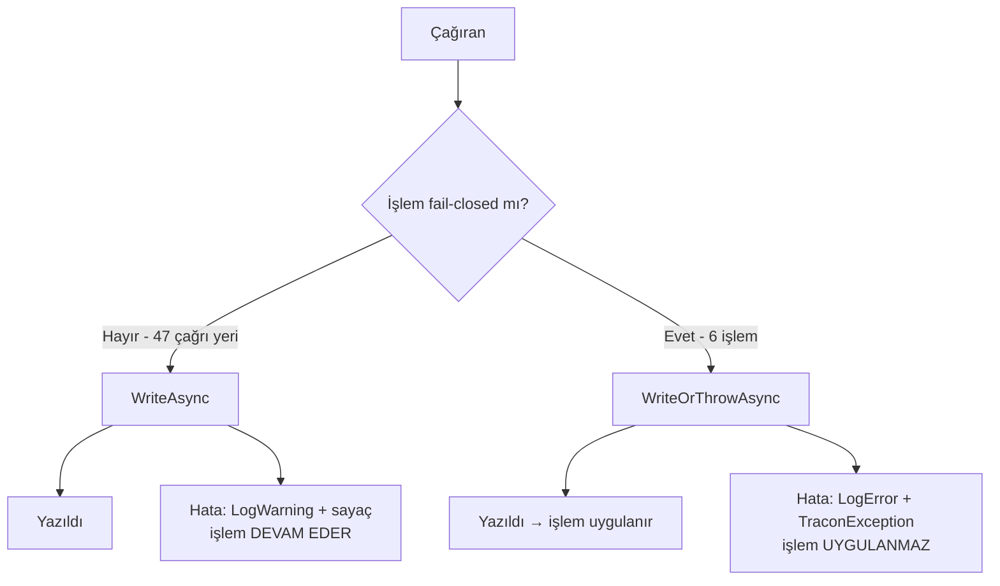

# Faz 171 — Denetim İzi Yazma Politikası

> **Durum:** 📋 Planlandı (2026-09-15)
> **Plan onayı:** onaylanmadı — uygulama başlamaz
> **Kaynak:** [ADAYLAR.md](ADAYLAR.md) · **F-234** · [YAYIN-HAZIRLIK.md](YAYIN-HAZIRLIK.md) **BL-047**
> **Önkoşul:** Yok. K-776 sözleşmeyi zaten sabitledi
> **Paketler:** `Tracon.Core`, `Tracon.AspNetCore`, `Tracon.Abstractions`
> **Yeni paket:** Yok · **Migration:** Yok
> **Public API:** Büyüyor — iki giriş. `PublicAPI.Shipped.txt` bugün **0 giriş** taşır (ölçüldü 2026-09-15), yani ekleme Faz 7'den önce ucuzdur; sonra bir sürüm kararı olur
> **Tüketici yüzeyi:** site: `concepts/governance.md` (garanti tablosu satırı), `guides/observability.md` (yeni sayaç)
> · sevk edilen: `IAuditLog` XML sözleşme metni, `capabilities.md` audit satırı
> **Manuel test alanı:** `docs/manuel-test/13-KIRACI-VE-GUVENLIK.md`

---

## Bu Faza Başlarken

> `faz-baslangic` skill'ini uygula. Aşağıdaki liste o skill'in 2. adımıdır —
> **tamamını değil, yalnız işaret edilen bölümleri oku.**

1. Bu doküman
2. Kararlar — dosyanın tamamını **okuma**, yalnız bu kalemleri grep'le:
   ```bash
   grep -n "K-776\|K-089\|K-370\|K-378\|K-771\|K-421" docs/KARARLAR.md
   ```
   **K-776** (garanti ayrımı yayımlanmış bir sözleşmedir — bu fazın tek gerekçesi),
   **K-089** (denetim izine yazılamayan `script` çalıştırılmaz),
   **K-370** (approval kararı doğrudan yazılır, hata yutulmaz),
   **K-378** (yalnız otomatik geri alma mutasyondan önce yazar),
   **K-771** (toplu kabul anahtarı yok — bu fazın kapsam sınırı),
   **K-421** (public API takibi açıktır)
3. [`arsiv/fazlar/170-PRODUCTION-PROFIL-KAPISI.md`](arsiv/fazlar/170-PRODUCTION-PROFIL-KAPISI.md) — yalnız devir notu:
   ```bash
   awk '/## Sonraki Faza Devir Notu/,0' docs/arsiv/fazlar/170-PRODUCTION-PROFIL-KAPISI.md
   ```
   🚨 O notun ilk maddesi bu faz için geçerlidir: `Tracon.AspNetCore`'un her
   host'ta koşan bir servis kayıt noktası **yoktur**. Bu fazın ortak metodu
   bu yüzden `static`'tir ve DI kaydı gerektirmez.
4. Alan hafızası (bu faz bir alana dokunuyor):
   [`hafiza/genisleme-noktalari-ve-denetim.md`](hafiza/genisleme-noktalari-ve-denetim.md)
   (denetim izi kapsamı; hangi `store`'un dekoratörü var)
5. Gerektiğinde, tamamı değil ilgili bölümü:
   [`MIMARI-GUVENLIK.md`](MIMARI-GUVENLIK.md) — denetim izi bölümü

---

## Amaç

K-776 denetim izinin garanti ayrımını **yayımlanmış bir sözleşme** hâline
getirdi: altı işlem fail-closed'dır, kalan her audit yazımı best-effort'tur.
Sözleşme yayımlandı, ama kodda onu zorlayan tek bir yer yok. Fail-closed yol
**dört ayrı elle yazılmış kopya** ve **iki ayrı doğrudan çağrı** olarak yaşıyor;
best-effort yolun ise hiçbir metriği yok, yani üretimde bozulduğu yalnız log
taranarak anlaşılıyor.

Bu faz iki şey yapar: altı yeri tek bir metoda indirir ve best-effort yola bir
sayaç verir. **Hiçbir işlemin fail-closed veya best-effort olma durumu
değişmez** — bu bir yeniden düzenlemedir, yeni bir yetenek değil.

- **F-234** — altı fail-closed çağrı yeri tek bir ortak metoda iner; `IAuditLog`
  sözleşme metni istisnayı da söyler.
- **BL-047** — best-effort audit yazma hatası bir sayaç artırır.

### Bugün ne çalışmıyor — doğrulanmış kanıt

| Kanıt | Gözlem |
|---|---|
| [`AuditRecorder.cs:53-60`](../src/Tracon.Core/Audit/AuditRecorder.cs) | Best-effort yolun tek `catch`'i. **47** çağrı sitesi, **26** dosya. Hata yalnız `LogWarning` — sayaç yok |
| [`AuditingSkillScriptGrantStore.cs:93`](../src/Tracon.Core/Audit/AuditingSkillScriptGrantStore.cs) | Birinci kopya. Çağrıları: `:76`, `:138`. `LogError` **yazar** |
| [`SandboxedSkillScriptRunner.cs:467`](../src/Tracon.Core/Skills/Scripts/SandboxedSkillScriptRunner.cs) | İkinci kopya. Çağrısı: `:300`. `LogError` **yazmaz** |
| [`ApprovalEndpoints.cs:347`](../src/Tracon.AspNetCore/Endpoints/ApprovalEndpoints.cs) | Üçüncü kopya. Çağrısı: `:226`. `:345` kopyayı kendi yorumunda kabul eder: *"the SAME pattern as `SandboxedSkillScriptRunner.WriteAuditOrThrowAsync`"* |
| [`TriggerEndpoints.cs:496`](../src/Tracon.AspNetCore/Endpoints/TriggerEndpoints.cs) | Dördüncü kopya. Çağrıları: `:220`, `:251`. `:491` de kopyayı kabul eder |
| [`CanaryEvaluationService.cs:180`](../src/Tracon.Core/Experiments/CanaryEvaluationService.cs) | Kopyasız fail-closed. `IAuditLog`'u doğrudan çağırır ve `Actor` alanına **sabit dize** yazar (`"system:canary-evaluator"`), `IAuditActorResolver` kullanmaz |
| [`DataSubjectEndpoints.cs:115`](../src/Tracon.AspNetCore/Endpoints/DataSubjectEndpoints.cs) | Kopyasız fail-closed. Yazma bir **geri çağrı** içinde, `store.EraseAsync`'in içinden koşar — sıralamayı `store` zorlar, çağıran değil |
| [`IAuditLog.cs:11-13`](../src/Tracon.Abstractions/Audit/IAuditLog.cs) | Sözleşme yalnız best-effort'u yazıyor: *"A write failure does not stop the operation."* Altı istisnadan hiç söz etmiyor |
| [`TraconDiagnostics.cs`](../src/Tracon.Core/Diagnostics/TraconDiagnostics.cs) | Sekiz sayaç adı sabiti var; audit için **hiçbiri yok** |
| `cat src/*/PublicAPI.Shipped.txt` | **0 giriş** — yüzeyi büyütmek bugün ucuz |

> Kanıtlar 2026-09-15 tarihinde doğrulandı.

---

## 171.1 — Tek politika: `AuditRecorder.WriteOrThrowAsync`

Mevcut `WriteAsync`'in kardeşi. Aynı `AuditEntry`'yi kurar, aynı secret
filtresini uygular; tek farkı hatayı **yutmamasıdır**.



İki tasarım kısıtı kanıttan doğar:

**Actor sabit olabilmeli.** `CanaryEvaluationService` `IAuditActorResolver`
kullanmaz; sistem aktörünü sabit dize olarak yazar. Ortak metot bu yüzden
aktörü iki biçimde almalıdır — çözücüden veya doğrudan. Çözücüyü zorunlu
kılan bir imza bu çağrı yerini dışarıda bırakır.

**Hata metni çağrı yerine özgü kalmalı.** Bugün dört kopya dört farklı cümle
yazar (*"was not changed"*, *"was not run"*, *"was not saved"*, *"the decision
was not applied"*). Bu cümleler tüketiciye görünür ve bilgi taşır; tek bir
genel cümleye indirilmezler. Ortak metot cümlenin **fiil kısmını** çağırandan
alır.

## 171.2 — Altı çağrı yerinin taşınması

| # | Çağrı yeri | Bugünkü şekli | Taşıma notu |
|---|---|---|---|
| 1 | `AuditingSkillScriptGrantStore.cs:76`, `:138` | Özel kopya | Düz taşıma |
| 2 | `SandboxedSkillScriptRunner.cs:300` | Özel kopya | Düz taşıma. `LogError` kazanır — bugün yazmıyor |
| 3 | `ApprovalEndpoints.cs:226` | Özel kopya | Düz taşıma |
| 4 | `TriggerEndpoints.cs:220`, `:251` | Özel kopya | Düz taşıma |
| 5 | `CanaryEvaluationService.cs:180` | Doğrudan `IAuditLog` | Sabit aktör yolu gerekir (171.1) |
| 6 | `DataSubjectEndpoints.cs:115` | Doğrudan `IAuditLog`, geri çağrı içinde | 🚨 En riskli taşıma. Sıralamayı `store.EraseAsync` zorlar; ortak metot geri çağrının **içinden** çağrılmalı, dışından değil |

🚨 **Sıralama semantiği korunur.** Beş ve altıncı çağrı yerinde audit satırı
mutasyondan **önce** yazılır (K-089, K-370). Taşıma bu sırayı değiştirirse
karar sessizce geri alınmış olur. Her iki yer için sıralamayı kanıtlayan test
zorunludur.

## 171.3 — Sözleşme metninin düzeltilmesi

[`IAuditLog.cs:11-13`](../src/Tracon.Abstractions/Audit/IAuditLog.cs) bugün
yalnız best-effort kuralını yazıyor. K-776 sonrası bu metin **eksiktir**:
tüketici sözleşmeyi okuyup altı istisnayı göremez. Metin istisnayı adıyla
söyler ve site tablosuna işaret eder.

Bu bir XML dokümanı değişikliğidir; imza değişmez, `PublicAPI` girişi
etkilenmez.

## 171.4 — Best-effort yolun sayacı (BL-047)

`TraconDiagnostics`'e yeni bir sabit, `TraconMetrics`'e yeni bir sayaç:

| Ad | Birim | Ne sayar |
|---|---|---|
| `tracon.audit.write_failures` | `{failure}` | Yazılamayan audit satırı |

Adlandırma mevcut desene uyar (`tracon.agent_source.failures`, `TraconDiagnostics.cs:73`).

**Açık tasarım noktası:** sayaç yalnız best-effort yolda mı artar, yoksa
fail-closed yolda da mı? İkisini de saymak "denetim izi ne sıklıkla
yazılamıyor" sorusunu tek sayıyla cevaplar; ayırmak ise "kaç işlem gerçekten
durdu" sorusunu cevaplar. Öneri: **tek sayaç, `outcome` etiketiyle ayrılır**
(`swallowed` · `refused`). Açık Sorular §1.

## 171.5 — Kaymayı önleyen mimari test

Bu fazın kendisi bir kopya kusurunu kapatıyor. Kapatan fazın kopyanın geri
gelmesini engellememesi, aynı kusuru bir sonraki faza devretmek olur.

Repo'da emsal var: [`AuditCoverageTests`](../tests/Tracon.Core.UnitTests/Architecture/AuditCoverageTests.cs)
her `governance` `store`'unun denetim dekoratörüne çözüldüğünü gerçek bir
kaptan doğrular. Aynı desen burada da kurulur: kaynak taramasıyla
`IAuditLog.WriteAsync`'in `Tracon.Core` ve `Tracon.AspNetCore` içinde
**yalnız `AuditRecorder` gövdesinden** çağrıldığı iddia edilir; başka her
doğrudan çağrı testi düşürür.

🚨 Kaynak taraması kırılgandır. Test, taradığı dosya kümesini ve beklenen
istisna listesini **açıkça** yazmalıdır; boş küme tarayıp yeşil dönen bir test
bu repo'da daha önce kusur üretti (`check-console-screens.mjs:28` aynı
korumayı taşır).

---

## Planlanan Public API

> Taslak imzalardır. Gerçekleşen imzalar kapanışta ayrı bir bölüme yazılır.

```csharp
// Tracon.Core — AuditRecorder (mevcut public static sınıf)
public static class AuditRecorder
{
    // MEVCUT — değişmez
    public static ValueTask WriteAsync(
        IAuditLog auditLog,
        IAuditActorResolver actorResolver,
        ILogger logger,
        string tenantId,
        string action,
        string entity,
        string? before,
        string? after,
        CancellationToken cancellationToken = default);

    // YENİ — hatayı yutmaz
    public static ValueTask WriteOrThrowAsync(
        IAuditLog auditLog,
        string actor,
        ILogger logger,
        string tenantId,
        string action,
        string entity,
        string? before,
        string? after,
        string refusalVerb,
        CancellationToken cancellationToken = default);
}

// Tracon.Core — TraconDiagnostics
public static partial class TraconDiagnostics
{
    public const string AuditWriteFailureCounterName = "tracon.audit.write_failures";
}
```

`actor` bir `string`'dir, `IAuditActorResolver` değil: 171.1'deki sabit aktör
kısıtı bunu gerektirir. Çözücüsü olan çağıran `actorResolver.Resolve()`
sonucunu geçer. `refusalVerb` hata cümlesinin çağrı yerine özgü kısmıdır
(örnek: `"was not run"`).

**Kırıcılık:** iki giriş de **yenidir**; mevcut hiçbir imza değişmez.
`PublicAPI.Shipped.txt` boş olduğu için bugün eklemek bedava, Faz 7'den sonra
eklemek bir sürüm kararı olur.

### HTTP `endpoint`'leri

Yok. Bu faz hiçbir `endpoint` eklemez veya değiştirmez.

### Arayüz payı

Yok. Arayüze dokunulmaz.

---

## Planlanan Dosya Listesi

```
src/Tracon.Abstractions/
└── Audit/
    └── IAuditLog.cs                          (XML sözleşme metni)

src/Tracon.Core/
├── Audit/
│   ├── AuditRecorder.cs                      (yeni metot + sayaç)
│   └── AuditingSkillScriptGrantStore.cs      (kopya kaldırılır)
├── Skills/Scripts/
│   └── SandboxedSkillScriptRunner.cs         (kopya kaldırılır)
├── Experiments/
│   └── CanaryEvaluationService.cs            (doğrudan çağrı taşınır)
├── Diagnostics/
│   ├── TraconDiagnostics.cs                  (sayaç adı sabiti)
│   └── TraconMetrics.cs                      (sayaç)
└── PublicAPI.Unshipped.txt                   (+2 giriş)

src/Tracon.AspNetCore/
└── Endpoints/
    ├── ApprovalEndpoints.cs                  (kopya kaldırılır)
    ├── TriggerEndpoints.cs                   (kopya kaldırılır)
    └── DataSubjectEndpoints.cs               (geri çağrı içinden taşınır)

tests/Tracon.Core.UnitTests/
├── Architecture/
│   └── AuditWritePolicyTests.cs              (YENİ — 171.5)
└── Audit/
    └── AuditRecorderTests.cs                 (YENİ veya genişletilir)

tests/Tracon.AspNetCore.FunctionalTests/
└── Audit/
    └── FailClosedAuditTests.cs               (YENİ — HTTP sınırında)

docs-site/src/content/docs/
├── concepts/governance.md                    (tablo satırı — şekil değişmez)
└── guides/observability.md                   (yeni sayaç)
```

---

## Hata Modları ve Testler

> Mutlu yoldan değil, **ne bozulabilir**den türetilir. Seviyeyi plan seçer.
> Sınır geçen davranış (DI · HTTP · kiracı · akış · depo · paket) birim
> testiyle kanıtlanamaz — [`.agents/ortak/test-seviyeleri.md`](../.agents/ortak/test-seviyeleri.md).

| Ne bozulabilir | Seviye | Test sınıfı |
|---|---|---|
| Taşıma sırasında bir işlem sessizce best-effort'a düşer | Fonksiyonel (HTTP sınırı) | `FailClosedAuditTests` |
| `store` yazamazken approval kararı yine de uygulanır | Fonksiyonel | `FailClosedAuditTests` |
| Canary geri alma audit'ten **sonra** yazar (sıra tersine döner) | Fonksiyonel | `FailClosedAuditTests` |
| Data-subject silme audit yazılamadan commit eder | Fonksiyonel | `FailClosedAuditTests` |
| Yeni bir doğrudan `IAuditLog.WriteAsync` çağrısı eklenir, politika atlanır | Birim (mimari) | `AuditWritePolicyTests` |
| Mimari test boş küme tarar ve yeşil döner | Birim (mimari) | `AuditWritePolicyTests` — sayı iddiası taşır |
| Best-effort hata sayacı hiç artmaz | Birim | `AuditRecorderTests` |
| Sayaç `OperationCanceledException`'da da artar (yanlış alarm) | Birim | `AuditRecorderTests` |
| `refusalVerb` hata mesajına `secret` sızdırır | Birim | `AuditRecorderTests` |
| Başka kiracının audit satırı yazılır | Sözleşme (`AuditLogContract`) | dört koşumda birden |
| İptal jetonu fail-closed yolda yutulur | Birim | `AuditRecorderTests` |

Beş sorunun cevabı: **iptal** — `OperationCanceledException` her iki yolda da
yutulmaz ve sayacı artırmaz. **Eşzamanlılık** — `AuditRecorder` `static` ve
durumsuzdur; yeni durum eklenmez. **Boş/aşırı girdi** — `refusalVerb` boşsa
genel cümle kullanılır; sınırı test eder. **Başka kiracı** — mevcut
`AuditLogContract` kapsar, yeni yol ona bağlanır. **Alt sistem hatası** — bu
fazın tam konusu.

---

## Manuel Kabul Case'leri

> Kapanışta [`docs/manuel-test/13-KIRACI-VE-GUVENLIK.md`](manuel-test/13-KIRACI-VE-GUVENLIK.md)
> içine eklenecek case'lerin taslağı.

| # | Ön koşul | Adımlar | Beklenen sonuç |
|---|---|---|---|
| 1 | `samples/Tracon.Api` koşuyor, PostgreSQL bağlı | `audit_log` tablosuna yazmayı reddet (rol izni kaldır), sonra bekleyen bir approval'ı onayla | `500` döner, karar **uygulanmaz**, `GET /api/approvals/{id}` hâlâ `Pending` |
| 2 | Aynı kurulum | Aynı durumda bir agent `run` başlat | `run` normal tamamlanır; log'da bir `LogWarning` ve `tracon.audit.write_failures` sayacı **1** artmıştır |
| 3 | Aynı kurulum | `audit_log` yazımını geri aç, aynı approval'ı onayla | Karar uygulanır, audit satırı yazılır, zincir `GET /api/audit/verify` ile `Valid` döner |
| 4 | Aynı kurulum | `audit_log` yazılamazken `DELETE /api/data-subjects/{id}?dryRun=false` çağır | Silme **gerçekleşmez**; sayım değişmez |

---

## Açık Sorular

> Planı bloklamayan, faz uygulanırken karara bağlanacak sorular.

| # | Soru | Seçenekler | Öneri |
|---|---|---|---|
| 1 | Sayaç fail-closed yolda da artsın mı? | A: tek sayaç + `outcome` etiketi (`swallowed`/`refused`) · B: yalnız best-effort | **A** — "denetim izi ne sıklıkla yazılamıyor" tek sorgudan cevaplanır, ayrım etiketle korunur |
| 2 | `DataSubjectEndpoints`'in geri çağrısı ortak metoda taşınabilir mi, yoksa `store` sözleşmesi mi engelliyor? | A: taşınır · B: yerinde kalır, XML gerekçe yazar | Uygulama anında ölçülür. Ölçüm B derse **DoD'den düşülmez** — gerekçe plana sapma olarak yazılır |
| 3 | `AuditWritePolicyTests` kaynak taraması mı, Roslyn analyzer mı olsun? | A: kaynak taraması (ucuz, kırılgan) · B: analyzer (pahalı, kesin) | **A** — B bir analyzer paketi maliyetidir; emsal `AuditCoverageTests` de kaptan doğrular, analyzer değildir |

---

## Bitiş Ölçütleri (DoD)

- [ ] `grep -rn "WriteAuditOrThrowAsync" src/` **hiç eşleşme döndürmez**
- [ ] `grep -rn "IAuditLog" src/ | grep "WriteAsync("` yalnız `AuditRecorder.cs` içinde eşleşir
- [ ] Altı fail-closed işlemin altısı da `AuditRecorder.WriteOrThrowAsync` çağırır
- [ ] `audit_log` yazılamazken approval kararı uygulanmaz — `FailClosedAuditTests` kanıtlar
- [ ] `audit_log` yazılamazken `run` normal tamamlanır ve `tracon.audit.write_failures` artar
- [ ] `IAuditLog` XML sözleşmesi altı istisnayı adıyla yazar
- [ ] `AuditWritePolicyTests` beklenen çağrı sayısını **rakamla** iddia eder; boş küme taraması testi düşürür
- [ ] Dört doğrulama kapısı sıfır uyarı verir
- [ ] `samples/Tracon.Api` ile gerçek `run` yapıldı, çıktı belgeye yazıldı
- [ ] `secret` taraması boş döndü
- [ ] Manuel kabul case'leri `docs/manuel-test/13-KIRACI-VE-GUVENLIK.md` içine eklendi; otomatikleştirilebilenler koşuldu
- [ ] `faz-denetim` koşuldu; 🔴 bulgu kalmadı
- [ ] `docs-site/` güncellendi; `npm run check` temiz
- [ ] `YAYIN-HAZIRLIK.md`'de **BL-047 kapandı** olarak işaretlendi

### Doğrulama komutları

```bash
# Kopya kalmadı
grep -rn "WriteAuditOrThrowAsync" src/ ; echo "beklenen: eşleşme yok"

# IAuditLog.WriteAsync yalnız tek yerden çağrılıyor
grep -rn "\.WriteAsync(" src/ | grep -i audit

# Sayaç sevk edildi
curl -s http://localhost:5081/metrics | grep tracon_audit_write_failures
```

---

## Riskler

| Risk | Önlem |
|------|-------|
| Taşıma sırasında bir işlemin fail-closed'lığı sessizce kaybolur — **bu fazın en büyük riski**, çünkü kayıp yalnız `store` bozulduğunda görünür | DoD'nin ilk üç satırı ve `FailClosedAuditTests` her altı işlemi ayrı ayrı koşar |
| `CanaryEvaluationService` ve `DataSubjectEndpoints`'in sıralama semantiği (mutasyondan **önce** yazma) taşımada tersine döner ve K-089/K-370 sessizce geri alınır | İki yer için sıralamayı kanıtlayan ayrı test; 171.2 tablosunda 🚨 ile işaretli |
| `DataSubjectEndpoints`'in geri çağrı şekli ortak metoda oturmaz ve taşıma yarım kalır | Açık Sorular §2 — ölçüm sonucu ne olursa olsun plana sapma olarak yazılır, sessizce atlanmaz |
| Mimari test boş küme tarar, yeşil döner, koruma sanılır | Test beklenen eşleşme sayısını rakamla iddia eder (171.5) |
| Public API +2 giriş; Faz 7'den sonra geri alınamaz | `PublicAPI.Shipped.txt` bugün 0 giriş — ölçüldü. Ekleme bugün ucuz |
| Sayaç `secret` taşıyan bir etiket alır | Sayaç yalnız sabit etiket taşır (`outcome`); `action`/`entity` etikete girmez |

---

<!-- ============================================================
     AŞAĞISI KAPANIŞTA DOLDURULUR — `faz-tamamlama` skill'i.
     Plan anında boş kalır. Başlıkları SİLME.
     ============================================================ -->

## Plandan Sapmalar

> Kapanışta doldurulur. Plan ile gerçek arasındaki fark **gizlenmez** — sonraki
> oturumun en değerli bilgisidir.

## Bu Fazda Verilen Kararlar

> Kapanışta doldurulur. K-NNN numaraları burada alınır; plan numara rezerve etmez.

## Gerçekleşen Public API

> Kapanışta doldurulur. Koddaki **gerçek** imzalar.

## Dosya Listesi (gerçekleşen)

> Kapanışta doldurulur.

## Süreç Ölçümü

> Kapanışta doldurulur. **Tablo olarak** — onay kutusu DEĞİL.

| Metrik | Değer |
|---|---|
| Plan revizyonu sayısı | |
| Düzeltme turu sayısı | |
| 🔴 bulgu: gerçek / gürültü / araştırılacak | |
| Fazın ürettiği regresyon | |
| Faz kapandıktan sonra bulunan kusur | |

## Denetim Bulguları

> Kapanışta doldurulur — `faz-denetim` çıktısı.

## Sonraki Faza Devir Notu

> Kapanışta doldurulur.
