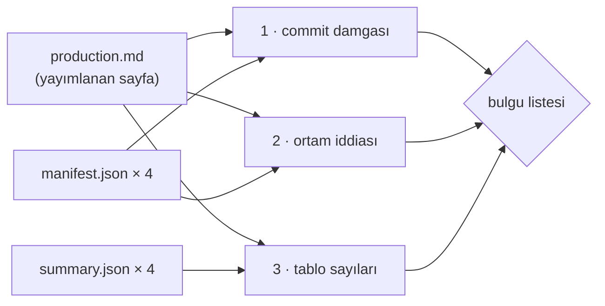

# Faz 174 — Kapasite Damgası Kapısı

> **Durum:** ✅ Tamamlandı (2026-09-15)
> **Plan onayı:** onaylandı (2026-09-15, kullanıcı) — üç açık soru + bir kapsam sorusu cevaplandı
> **Kaynak:** [ADAYLAR.md](ADAYLAR.md) · **F-239**
> **Önkoşul:** [Faz 166](arsiv/fazlar/166-HTTP-KAPASITE-OLCUMU.md) — ölçüm aparatını, `summary.json`/`manifest.json` şemasını ve K-775'i o faz kurdu
> **Paketler:** Yok — `docs-site/scripts/` ve sayfa içinde kalır (plan `scripts/` diyordu; sapma 2)
> **Yeni paket:** Yok · **Migration:** Yok
> **Public API:** Büyümüyor
> **Tüketici yüzeyi:** `docs-site/src/content/docs/guides/production.md` — yalnız **makine okunur işaret** eklenir, yayımlanan sayı değişmez · sevk edilen yapıt: Yok
> **Manuel test alanı:** `docs/manuel-test/33-DOKUMAN-KAPILARI.md`

---

## Bu Faza Başlarken

> `faz-baslangic` skill'ini uygula. Aşağıdaki liste o skill'in 2. adımıdır —
> **tamamını değil, yalnız işaret edilen bölümleri oku.**

1. Bu doküman
2. Kararlar — dosyanın tamamını **okuma**, yalnız bu kalemleri grep'le:
   ```bash
   grep -n "K-775\|K-766" docs/KARARLAR.md
   ```
   **K-775** (yayımlanan kapasite sayısı sürüm ve commit taşır; ölçüm
   yenilenmeden sürüm satırı güncellenmez), **K-766** (süreç ölçümü kapısı
   bölümün VARLIĞINI denetler, DOĞRULUĞUNU denetlemez — bu fazın kapısı
   bilerek **tersini** yapar, farkı §174.4 anlatır)
3. [Faz 166](arsiv/fazlar/166-HTTP-KAPASITE-OLCUMU.md) — yalnız devir notu ve
   denetim bulguları:
   ```bash
   awk '/## Denetim Bulguları/,0' docs/arsiv/fazlar/166-HTTP-KAPASITE-OLCUMU.md
   ```
   Bu fazın var olma sebebi o beş 🔴 bulgudur. Hangi hata sınıfının
   tekrarlandığını görmeden kapı yanlış yere kurulur.
4. Alan hafızası (bu faz bir alana dokunuyor):
   [`hafiza/dokumantasyon.md`](hafiza/dokumantasyon.md) (doküman kapısı yazma
   tuzakları; `docs/` ile `docs-site/` sınırı)
5. Gerektiğinde, tamamı değil ilgili bölümü: `scripts/dokuman-bakim.py`
   `denetle()` (satır 2461) ve emsal kapı `manuel_test_sayim_kaymasi()`
   (satır 1051)

---

## Amaç

Faz 166 kapasite sayılarını ölçtü ve yayımladı. Denetimi **beş 🔴 bulgu**
buldu ve beşi de aynı sınıftandı: ölçüm dosyasında duran bir sayı, sayfaya
elle taşınırken bozuldu. K-775 bunu bir **sözleşme** olarak kurdu — yayımlanan
her kapasite sayısı sürüm ve commit taşır. Sözleşmenin kapısı yok. Bu faz o
kapıyı kurar.

- **F-239** — Yayımlanan her kapasite sayısının ve ortam iddiasının ölçüm
  yapıtında bir karşılığı olduğunu doğrulayan bir `dokuman-bakim.py` kapısı.

### Bugün ne çalışmıyor — doğrulanmış kanıt

| Kanıt | Gözlem |
|---|---|
| [`production.md:589-602`](../docs-site/src/content/docs/guides/production.md) | 12 satırlık tablo **48 sayı** yayımlıyor (`n`, `p50`, `p95`, `Completed/s`). Hiçbiri bir kapıyla ölçüm dosyasına bağlı değil |
| [`production.md:575-579`](../docs-site/src/content/docs/guides/production.md) | Sayfa iki commit damgası anıyor: `e44d89f5` (sweep + arrival) ve `df45a7ba` (worker + soak). Damgalar **düz metin**; hiçbir kapı manifest'le karşılaştırmıyor |
| [`production.md:570-573`](../docs-site/src/content/docs/guides/production.md) | Ortam iddiası düz metin: `Darwin 25.6.0`, 10 işlemci, 16 GiB, `.NET 10.0.100`, PostgreSQL `18.4`, `pgvector/pgvector:pg18` |
| `bench/capacity/measurements/{arrival,soak,sweep,workers}/manifest.json` | Dördü de `commit`, `packageVersion`, `operatingSystem`, `architecture`, `processorCount`, `physicalMemoryBytes`, `runtimeVersion`, `postgreSqlVersion`, `databaseImage` taşıyor — sayfanın her ortam iddiasının makine okunur karşılığı **zaten var** |
| `bench/capacity/measurements/*/summary.json` | `rows[]` her hücre için `latency.p50/p95/p99/count`, `lowSampleP95`, `lowSampleP99` taşıyor — tablonun her sayısının karşılığı **zaten var** |
| [`dokuman-bakim.py:2614`](../scripts/dokuman-bakim.py) | Kapılar `denetle()` içinde `(ad, bulgular)` demetiyle kaydediliyor; yeni kapı bu listeye bir satırdır |
| [`dokuman-bakim.py:1051`](../scripts/dokuman-bakim.py) | `manuel_test_sayim_kaymasi()` birebir emsal: yayımlanan bir sayıyı kaynağıyla karşılaştırır |

> Kanıtlar 2026-09-15 tarihinde doğrulandı.
>
> 🚨 **ADAYLAR.md yanlış yol yazıyordu.** Kayıt `docs-site/guides/production.md`
> diyor; o dosya **yok**. Kaynak `docs-site/src/content/docs/guides/production.md`,
> üretilen çıktı `docs-site/dist/guides/production/index.md`. Kapı **kaynağı**
> okur.

---

## 174.1 — Kapı neyi denetler

Üç bağımsız denetim. Üçü de **yalnız okur**; `--denetle`nin "yazmaz" sözü korunur.



| # | Denetim | Kural |
|---|---|---|
| 1 | **Commit damgası** | Sayfada anılan her kısa SHA, bir `manifest.json`'un `commit` alanının ön eki olmalıdır. Eşleşmeyen damga bulgudur |
| 2 | **Ortam iddiası** | Sayfanın ortam cümlesindeki her değer (`operatingSystem`, `processorCount`, `runtimeVersion`, `postgreSqlVersion`, `databaseImage`, bellek) bir manifest'te birebir bulunmalıdır |
| 3 | **Tablo sayıları** | Tablonun her hücresi, işaret ettiği `summary.json` satırından **yeniden hesaplanabilir** olmalıdır |

Faz 166'nın beş 🔴 bulgusunun her biri bu üçünden birine düşer:

| Faz 166 bulgusu | Bu kapının hangi denetimi yakalar |
|---|---|
| Yanlış commit damgası | 1 |
| Yanlış birleştirilmiş percentile | 3 |
| Tek tekrarın ortalama gibi sunulması | 3 (`repeats` ve `completeRepeats` karşılaştırması) |
| Elle kopyalarken bozulan yüzde | 3 |
| Kanıtın izlenmeyen dizinde kalması | 1 (manifest bulunamazsa bulgu) |

## 174.2 — Tablo satırı ile ölçüm satırını ne bağlar

Kapının çözmesi gereken tek gerçek problem budur. Tablo satırı insan için
yazılmıştır (`Buffered (Idempotency-Key)`); ölçüm satırı makine için
(`scenario: "buffered"`, `seedShape: "empty"`, `concurrency: 1`).

Seçilen bağ: sayfaya **görünmez bir işaret** girer. Markdown yorumu Astro
çıktısında render edilmez, `git diff`'te görünür ve sayfanın okunurluğunu
bozmaz.

```markdown
<!-- kapasite: profile=sweep scenario=buffered seedShape=empty concurrency=1 -->
| Buffered (`Idempotency-Key`) | 1 | 174 | 1044 ms | 1057 ms | 0.94 |
```

Kural: **işaretsiz bir kapasite tablosu satırı bulgudur.** Böylece sayfaya
sonradan eklenen bir satır sessizce kapının dışında kalamaz — Faz 166'nın
beşinci bulgusunun sınıfı tam olarak budur.

Sayı karşılaştırması `summary.json`'daki ham değerden **yeniden yuvarlanarak**
yapılır; sayfa `1044 ms` yazarken kaynak `1044.104` taşır. Yuvarlama kuralı
kapının içinde tek bir yerde durur ve testi vardır.

## 174.3 — Ortam iddiasının bağı

Ortam cümlesi tablo değildir, bu yüzden satır işareti almaz. Kapı manifest'ten
**beklenen cümleyi üretir** ve sayfanın o bölümünde her değerin geçtiğini
doğrular. Değer arama yönü tek taraflıdır: manifest'teki değer sayfada
**bulunmalıdır**. Sayfanın fazladan yazdığı bir şey bulgu değildir — sayfa
anlatıdır, manifest'in kopyası değil.

## 174.4 — Bu kapı K-766'nın istisnasıdır

K-766 süreç ölçümü kapısı için "bölümün VARLIĞINI denetler, DOĞRULUĞUNU
denetlemez" diyor ve gerekçesi "hiçbir kapı doğruluğu denetleyemez"dir.

Bu kapı **doğruluğu denetler** ve bu bir çelişki değildir. Fark: süreç ölçümü
bir **yargıdır** (kaç tur sürdü, kaç bulgu gerçekti) ve dış kaynağı yoktur.
Kapasite sayısının **makine okunur bir kaynağı vardır**. Doğruluk ancak kaynak
varken denetlenebilir; bu faz yeni bir kural koymuyor, aynı kuralın diğer
tarafını kullanıyor. Kapanışta bu ayrımın karar defterine girip girmeyeceği
§ *Açık Sorular* 2'dedir.

---

## Planlanan Public API

Yok. Bu faz `src/` altına hiç dokunmaz.

### Script yüzeyi

```python
# scripts/dokuman-bakim.py
def kapasite_damgasi_bulgulari(kok: pathlib.Path = ROOT) -> list[str]:
    """Yayımlanan kapasite sayılarını ölçüm yapıtlarıyla karşılaştırır."""
```

`denetle()` içindeki kapı listesine bir satır olarak katılır:

```python
("Kapasite damgası", kapasite_damgasi_bulgulari()),
```

### HTTP `endpoint`'leri

Yok.

### Arayüz payı

Yok — arayüze dokunulmuyor.

---

## Planlanan Dosya Listesi

```
scripts/
├── dokuman-bakim.py          (değişir — yeni kapı + denetle() kaydı)
└── dokuman_bakim_test.py     (değişir — yeni kapının testleri)

docs-site/src/content/docs/guides/
└── production.md             (değişir — YALNIZ satır işaretleri eklenir)

docs/manuel-test/
└── 33-DOKUMAN-KAPILARI.md    (değişir — kabul case'leri)
```

---

## Hata Modları ve Testler

> Mutlu yoldan değil, **ne bozulabilir**den türetilir. Seviyeyi plan seçer.

| Ne bozulabilir | Seviye | Test |
|---|---|---|
| Sayfa bir sayıyı bozuk kopyalıyor, kapı sessiz kalıyor | Birim (Python) | `dokuman_bakim_test.py::test_bozuk_sayi_bulgu_uretir` |
| Sayfaya işaretsiz yeni satır ekleniyor, kapının dışında kalıyor | Birim (Python) | `test_isaretsiz_satir_bulgu_uretir` |
| Commit damgası hiçbir manifest'le eşleşmiyor | Birim (Python) | `test_eslesmeyen_commit_bulgu_uretir` |
| Ortam iddiası manifest'ten sapıyor | Birim (Python) | `test_ortam_sapmasi_bulgu_uretir` |
| Ölçüm dizini hiç yok (kanıt izlenmiyor) | Birim (Python) | `test_eksik_olcum_dizini_bulgu_uretir` |
| Yuvarlama kuralı iki yerde ayrışıyor → sahte bulgu | Birim (Python) | `test_yuvarlama_tek_kaynaktan_gelir` |
| Kapı bir şey **yazıyor** (`--denetle` sözünü bozuyor) | Birim (Python) | `test_kapi_hicbir_dosyayi_degistirmez` |
| Kapı bugünkü sayfada bulgu üretiyor (yanlış pozitif) | Birim (Python) | `test_bugunku_sayfa_temiz` |

Beş soru: **iptal** yok (senkron script) · **eşzamanlılık** yok · **boş/aşırı
girdi** → boş ölçüm dizini ve işaretsiz tablo testlerle kapsandı · **başka
kiracı** yok · **alt sistem hatası** → bozuk JSON ayrıca test edilir.

🚨 Bu faz sınır geçmiyor (DI · HTTP · kiracı · akış · depo · paket yok), bu
yüzden birim testi burada **yeterli** kanıttır. Bu, `test-seviyeleri.md`
tablosundaki nadir durumdur ve bilerek seçilmiştir.

---

## Manuel Kabul Case'leri

| # | Ön koşul | Adımlar | Beklenen sonuç |
|---|---|---|---|
| 1 | Temiz ağaç | `python3 scripts/dokuman-bakim.py --denetle` | "Kapasite damgası: ✅ temiz" satırı görünür, çıkış kodu 0 |
| 2 | `production.md`'de bir `p95` değeri elle bozulur | Aynı komut | Bulgu satırı bozulan hücreyi `dosya:satır` ile gösterir, çıkış kodu ≠ 0 |
| 3 | Tabloya işaretsiz bir satır eklenir | Aynı komut | "işaretsiz kapasite satırı" bulgusu üretilir |
| 4 | Sayfadaki bir commit damgası değiştirilir | Aynı komut | "eşleşmeyen commit damgası" bulgusu üretilir |
| 5 | `bench/capacity/measurements/sweep/` geçici olarak taşınır | Aynı komut | "ölçüm yapıtı bulunamadı" bulgusu üretilir; kapı çökmez |

---

## Açık Sorular

| # | Soru | Seçenekler | Öneri |
|---|---|---|---|
| 1 | İşaret sözdizimi ne olsun? | A: `<!-- kapasite: profile=… -->` satır üstü yorum · B: tabloya görünür bir `Kaynak` sütunu · C: sayfanın yanında ayrı bir `production.capacity.json` eşleme dosyası | **A** — sayfa okunurluğunu bozmaz, `git diff`'te görünür ve eşleme veriyle **aynı dosyada** durur. C ikinci bir senkron problemi üretir; kapının çözmeye çalıştığı sınıfın ta kendisi |
| 2 | §174.4'teki K-766 ayrımı karar defterine girsin mi? | A: girsin — "kapı doğruluğu ancak makine okunur kaynak varken denetler" · B: girmesin, faz dokümanında kalsın | **A** — bu bir kapı yazma kuralıdır ve sonraki fazlar da kapı yazacak. Numarayı kararı gerçekten veren kapanış alır |
| 3 | `lowSampleP95`/`lowSampleP99` bayrağı taşıyan bir satır sayfada uyarı taşımak zorunda mı? | A: zorunlu — bayraklı satır uyarısız yayımlanamaz · B: serbest | **A** — Faz 166'nın "tek tekrarın ortalama gibi sunulması" bulgusu tam olarak budur. Sayfa bugün eşzamanlılık-1 satırları için bu uyarıyı **zaten** yazıyor (`production.md:604-606`), yani kural bugünü kırmaz |

---

## Bitiş Ölçütleri (DoD)

> 🚨 Kapı `dokuman-bakim.py`'ye değil `check-content.mjs`'e kuruldu (sapma 2).
> Aşağıdaki satırlar ve komutlar **gerçekleşen** yeri gösterir; planın ilk
> yazımı `dokuman-bakim.py` diyordu ve o adres artık yanlıştır.

- [x] `cd docs-site && node scripts/check-content.mjs` kapasite kapısını koşar ve bugünkü sayfada **temiz** döner
- [x] Sayfadaki **19 tablo satırının tamamı** işaret taşır; işaretsiz satır **ve işaretsiz tablo** bulgu üretir
- [x] Sayfadaki iki commit damgası da manifest'le eşleştiği doğrulandı — **iki yönde** (sayfanın andığı damga saklı olmalı, saklı koşum sayfada anılmalı)
- [x] Kapı hiçbir dosyayı değiştirmez — `the gate changes no file` testi ağacı bayt bayt karşılaştırır
- [x] Dört doğrulama kapısı sıfır uyarı verir — `kapi.py kapanis --taban f4cfb9d0`, on adımın onu da ✅
- [x] ~~`samples/Tracon.Api` ile gerçek `run`~~ — **muaf.** Bu faz çalışma anı kodu içermiyor: `git diff f4cfb9d0 --stat -- src/ tests/ samples/` boş. Çalıştırılacak yeni davranış yok; kapının kendisi `node scripts/check-content.mjs` ile gerçekten koşuldu
- [x] `secret` taraması boş döndü — `kapi.py tarama` ✅ (3,71 sn)
- [x] Manuel kabul case'leri `docs/manuel-test/33-DOKUMAN-KAPILARI.md` içine eklendi (`MT-DKP-017…021`); beşinin beşi de koşuldu
- [x] `faz-denetim` koşuldu; **2 🔴 + 6 🟡** bulgu üretti, hepsi kapandı — bkz. *Denetim Bulguları*
- [x] `docs-site/` güncellendi; `npm run build` + `check-links.mjs` + `check-weight.mjs` temiz

### Doğrulama komutları

```bash
# Kapı bugünkü sayfada temiz mi
cd docs-site && node scripts/check-content.mjs

# Kapının kendi testleri (34 test)
cd docs-site && node --test scripts/check-capacity-stamp.test.mjs

# Bozuk sayı gerçekten yakalanıyor mu (elle, geri al)
sed -i.bak 's/| 1044 ms |/| 9999 ms |/' docs-site/src/content/docs/guides/production.md
(cd docs-site && node scripts/check-content.mjs)   # bulgu vermeli
mv docs-site/src/content/docs/guides/production.md{.bak,}
```

---

## Riskler

| Risk | Önlem |
|------|-------|
| Kapı yanlış pozitif üretir ve ekip onu susturmayı öğrenir — kapının en kötü sonu | `test_bugunku_sayfa_temiz` DoD'dedir; kapı bugünkü sayfada **temiz** dönmeden faz bitmez |
| Yuvarlama kuralı sayfa ile kapı arasında ayrışır | Yuvarlama kapının içinde **tek** bir fonksiyondur ve kendi testi vardır |
| İşaretler zamanla bayatlar (satır taşınır, işaret kalır) | İşaret **satırın hemen üstündedir** ve işaretsiz satır bulgudur; ikisi birlikte kaymayı yakalar |
| Ölçüm yenilenince 48 sayı + 4 damga elle güncellenir, kapı iş yükünü artırır | Kapsam dışı ama devir notuna yazılır: sayfayı ölçümden **üreten** bir adım F-NN adayıdır. Bu faz yalnız doğrular |
| Kapı `docs/` ile `docs-site/` sınırını bulanıklaştırır | Kapı `docs-site/`'ı **okur**, yazmaz; `dokuman-bakim.py` bunu `site_denetle()` ile zaten yapıyor |

---

<!-- ============================================================
     AŞAĞISI KAPANIŞTA DOLDURULUR — `faz-tamamlama` skill'i.
     Plan anında boş kalır. Başlıkları SİLME.
     ============================================================ -->

## Plandan Sapmalar

> Plan ile gerçek arasındaki fark **gizlenmez** — sonraki oturumun en değerli
> bilgisidir.

### 1 — 🚨 Planın işaret sözdizimi tabloyu YOK EDİYORDU (§174.2)

Plan işareti satırın **üstüne**, kendi satırına koyuyordu:

```markdown
<!-- kapasite: profile=sweep … -->
| Buffered (`Idempotency-Key`) | 1 | 174 | 1044 ms | 1057 ms | 0.94 |
```

`faz-uygulama` Adım 1 gereği ölçüldü — kabul edilmedi. Sonuç: **GFM tabloyu ilk
yorumda bitirir.** Repo'nun kendi remark sürümüyle koşuldu:

| Sözdizimi | Ayrıştırma sonucu |
|---|---|
| Plandaki (satır üstü yorum) | tablo **1 satıra** düşer, kalan satırlar boş `paragraph` olur |
| Kapan `\|` sonrası yorum | başlıkta olmayan **4. hücre** üretir (render'da atılır, yapı bozuk) |
| **Hücre içi** (kapan `\|` öncesi) | tablo **bozulmaz**, hücre sayısı doğru, HTML'de görünmez |

Seçilen: **hücre içi.** Kullanıcı kararı. Bu aynı zamanda repo'nun Faz 158'de
kurduğu emsaldir (`<!-- claim:option … -->`, `configuration.md:324` bunu zaten
bir tablo hücresinde yapıyor) — plan o emsali bilmiyordu.

**Ders:** plan doğru problemi çözüyordu, yanlış mekanizmayla. Sözdizimi
iddiaları da yapısal iddiadır ve ölçülmeden kabul edilmez.

### 2 — Kapı `dokuman-bakim.py`'ye değil `check-content.mjs`'e kuruldu

Plan kapıyı `scripts/dokuman-bakim.py`'ye koyuyordu. Sapma 1'den sonra işaret
sözdizimi `claim:` emsaliyle aynı aileye girdi ve o emsalin kapısı
`docs-site/scripts/check-content.mjs`'tedir. Kullanıcı kararı.

Ölçüldü: `check-content.mjs` `repositoryRoot` sabitini **zaten** taşıyor
(satır 31), yani `bench/` ağacını okumak tek satırdır — taşımanın maliyeti
yoktu. Sonuç: kapasite sayısı da, davranış iddiası da, konsol ekranı da aynı
kapıdan geçiyor ve sevk edilen sayfayı denetleyen tek bir yer var.

Bedeli: testler Python `unittest` yerine `node --test`. `package.json`'daki
`check:content` betiğine eklendi, yani CI'da **koşuyor** (eklenmeseydi test
dosyası var olur ama hiç çalışmazdı).

### 3 — İşaret Türkçe değil İngilizce: `capacity:`, `kapasite:` değil

Plan `<!-- kapasite: … -->` yazıyordu. `production.md` **sevk edilen İngilizce
bir sayfadır** ve dil sınırı (K-228) pakete giren/çalışma anında çalışan her
şeyin İngilizce olmasını ister. `SourceLanguageTests` bu dosyayı taramıyor
(kapsamı `src`·`tests`·`samples`·`packages`), yani kapı yakalamazdı — kural
yine de geçerli. Emsal de İngilizce: `claim:`.

### 4 — Kapsam 12 satırdan 19 satıra çıktı, çünkü 3 satır YANLIŞTI

DoD "12 tablo satırı" diyordu. Kapsam üç tabloya çıkarıldı (12 latency + 4
open-loop + 3 storage). Gerekçe: planın kendi eşleme tablosu Faz 166'nın
**4 numaralı** bulgusunu ("tek tekrarın ortalama gibi sunulması") Denetim 3'e
düşürüyor ve o bulgu storage tablosundadır. 12 satırla sınırlı bir kapı, var
olma sebebinin bir bölümünü açıkta bırakırdı.

🚨 **Bunu yaparken Faz 166'nın 4 numaralı 🔴 bulgusunun KAPANMADIĞI bulundu.**
Kapanış "Düzeltildi. …seed şekli de karışıktı" diyordu; ölçüm aksini gösterdi:

| Yayımlanan | İzlendiği hücre | Uyuşmazlık |
|---|---|---|
| `~8.4 KiB (1 clean repeat)` | `sweep buffered/**full**/c1` = 8.41 KiB, `storageRepeats=**2**` | seed `full`, tekrar 2 — ikisi de yanlış yazılmış |
| `~10.3 KiB (1 clean repeat)` | `sweep queued/empty/c1` = 10.26 KiB, `storageRepeats=1` | doğru |
| `~14.9 KiB (3 clean repeats)` | `sweep streaming/**full**/c8` = 14.93 KiB | seed `full`, diğer ikisi `empty` |

Satır sayıları da üç ayrı hücreden geliyordu. Yani tablo **tek bir ölçüm
hücresine izlenmiyordu** ve bunu hiçbir şey ölçmüyordu.

**Düzeltme (kullanıcı kararı):** üçü de aynı hücre ailesine (`empty`,
`concurrency=1`) bağlandı ve sayılar o hücreden yeniden üretildi:

| Sütun | Önce | Sonra |
|---|---|---|
| Buffered satır/bayt | 10.5 · ~8.4 KiB (1 clean repeat) | 10.5 · **~8.6 KiB** (1 clean repeat) |
| Queued satır/bayt | 10.6 · ~10.3 KiB (1 clean repeat) | **10.9** · ~10.3 KiB (1 clean repeat) |
| Streaming satır/bayt | 27.6 · ~14.9 KiB (3 clean repeats) | **27.8** · **~14.0 KiB** (**1** clean repeat) |
| 1M projeksiyonu | ~15 GB | **~14 GB** |

Yeniden ölçüm **gerekmedi** ve K-775 çiğnenmedi: sayılar saklanan yapıttan
geliyor, değişen yalnız hangi hücrenin alıntılandığıdır. Faz 166 denetiminin
beş bulgusunu kapattığı yöntemin aynısı.

### 5 — Plandaki `test_yuvarlama_tek_kaynaktan_gelir` gerçek bir kural buldu

Sayfanın `Completed/s` biçimi tek kural değildi: `0.94` iki ondalık, `29.5` üç
anlamlı basamak. Tek bir kuralla ifade edildi — **üç anlamlı basamak, en çok
iki ondalık** — ve 12 satırın 12'sinde tutuyor. Yuvarlama **bir kez** yapılır;
üçe sonra ikiye yuvarlamak tek turdan farklı basamak verebilir.

### 6 — Kapının kendi testleri kapıda ÜÇ kusur buldu

Test yazmak bir tören değildi; üçü de gerçek kusurdu ve ikisi kapıyı sessizce
işe yaramaz kılıyordu:

| # | Kusur | Neden ciddi |
|---|---|---|
| 1 | `processorCount` **çıplak sayıyla** aranıyordu | Sayfa "64 logical processors" yazarken kapı **yeşil** dönüyordu: `10` dizesi `.NET 10.0.**10**0` içinde geçiyor. Tesadüfen eşleşebilen bir değer hiç denetlenmiyor demektir. Düzeltme: her alan sayfanın kullandığı **ifadeyi** üretir (`10 logical processors`) |
| 2 | Bozuk işaretli satır kapıyı **çökertiyordu** | `kinds` boş kalıyor, `SCHEMAS[undefined].join` atıyordu. Kapının çökmesi, bulgu vermemesiyle aynı sonucu verir |
| 3 | Manifest'ler çelişince **yanlış profili** suçluyordu | Referans alfabetik ilk profildi; `soak`=4 iken `sweep`=10 için "sapma" raporlanıyor, üstüne bir de "sayfa '4 logical processors' yazmıyor" deniyordu. Düzeltme: çelişkide sayfa o alan için **hiç** denetlenmez, çelişki tek bulgu olarak raporlanır |

Ayrıca satır sonu kaydırmasına karşı ortam paragrafı boşluk-normalize edilerek
aranıyor: `16 GiB,\n.NET 10.0.100` ile tek satır aynı iki olguyu söyler.

### 7 — Kapı düz metindeki sayıları da denetliyor (denetim sonrası)

Plan yalnız tabloları ve ortam cümlesini kapsıyordu. `faz-denetim` sayfanın düz
metinde iki `p95` değerini **"p99" diye** yayımladığını buldu — kapının var olma
sebebi olan sınıf, kapının göremediği yerde. Yeni bir `kind=value` işareti tek
bir sayıyı tek bir ölçüm alanına bağlar:

```markdown
a p99 of 1721 ms<!-- capacity: kind=value profile=sweep scenario=buffered seed=full concurrency=1 field=latency.p99 -->
```

Beş sayı böyle bağlandı. Biri (`p50-spread`) **tavan** olarak denetlenir:
"within about N%" iddiası ölçülen en geniş farktan küçükse bulgudur.

### 8 — `Queue wait p95` artık yayılımı iki uçla yayımlıyor (denetim sonrası)

İlk yazım "yayılımın içinde olmak" istiyordu; denetim ölçtü: 16,45/16,65/16,71 s
pencereleri için **"16.5 s" de "16.7 s" de** yeşil geçiyordu. Sütun artık
`16.5-16.7 s` yazmak zorunda ve yuvarlama `formatRate` ile tek kaynaktan gelir.
Sayfanın iki satırı buna göre düzeltildi.

### 9 — Envanter kapının içine taşındı (denetim sonrası)

"İşaretli satır ara" kuralı tek yönlüydü: işaretleri **silmek** kapıyı
susturuyordu. İki kural eklendi — başlığı bir şemayla eşleşen **işaretsiz
tablo** bulgudur, ve beklenen satır sayısı (`EXPECTED_ROWS`) kapının içinde
durur. Ayrıntı ve ölçüm: *Denetim Bulguları* 4.

## Bu Fazda Verilen Kararlar

| # | Karar | Tür |
|---|---|---|
| **K-784** | Bir kapı, iddianın **makine okunur bir kaynağı varsa** DOĞRULUĞU denetler; kaynak yoksa yalnız VARLIĞI denetleyebilir. K-766'nın diğer yüzüdür, istisnası değil | Kapı yazma kuralı (§174.4, Açık Soru 2 → A) |

Karar defterine **girmeyenler** (faz dokümanında kalır): işaret sözdizimi,
kapının hangi dosyada yaşadığı, yuvarlama kuralı. Üçü de yerel tercihtir;
`AGENTS.md`'nin karar defteri eşiğini geçmezler.

## Gerçekleşen Public API

**Büyümedi.** `src/` altına hiç dokunulmadı — `git diff --stat f4cfb9d0 -- src/`
yalnız üretilen `Tracon.AgentMap.md`'yi gösterir ve o da bayt bayt aynıdır
(içeriği `capabilities.md`'den türer, `production.md`'den değil).

### Script yüzeyi (gerçekleşen)

```js
// docs-site/scripts/check-capacity-stamp.mjs
export function checkCapacityStamp(docsRoot, measurementsRoot): string[]
```

Plan `kapasite_damgasi_bulgulari(kok) -> list[str]` diyordu; sapma 2 uyarınca
JS'e taşındı. Sözleşme aynı: **salt-okunur**, bulgu listesi döndürür, atmaz.

## Dosya Listesi (gerçekleşen)

```
docs-site/scripts/
├── check-capacity-stamp.mjs        (YENİ — kapı, 3 denetim)
├── check-capacity-stamp.test.mjs   (YENİ — 21 test)
└── check-content.mjs               (değişti — import + kapı kaydı)

docs-site/
├── package.json                    (değişti — check:content'e test dosyası)
└── public/llms-full.txt            (ÜRETİLDİ — sayfa değişti)

docs-site/src/content/docs/guides/
└── production.md                   (değişti — 19 işaret + storage tablosu düzeltmesi)

docs/manuel-test/
├── 33-DOKUMAN-KAPILARI.md          (değişti — MT-DKP-017…021)
└── 00-INDEKS.md                    (ÜRETİLDİ — sayım 16 → 21)

docs/
├── KARARLAR.md · KARARLAR-INDEKS.md · arsiv/KARARLAR-GECMISI.md   (K-784)
└── 174-KAPASITE-DAMGASI-KAPISI.md  (bu doküman)
```

Plana göre **eksik:** `scripts/dokuman-bakim.py` ve `scripts/dokuman_bakim_test.py`
hiç değişmedi (sapma 2). **Fazla:** `package.json`, `llms-full.txt`,
`00-INDEKS.md` — üçü de sapmanın veya sayfa değişikliğinin zorunlu sonucu.

## Süreç Ölçümü

| Metrik | Değer |
|---|---|
| Plan revizyonu sayısı | 5 (işaret sözdizimi · kapı yeri · işaret dili · kapsam 12→19 satır · düz metin sayıları kapıya alındı) |
| Düzeltme turu sayısı | 5 (3'ü kapının kendi testlerinden, 2'si `faz-denetim`den) |
| 🔴 bulgu: gerçek / gürültü / araştırılacak | **7 / 0 / 0** — 3'ü kapının kusuru (kendi testleri buldu), 1'i Faz 166'dan devreden açık storage bulgusu, 2'si `faz-denetim` (yanlış adres + sayfanın p95'i p99 diye yayımlaması), 1'i denetimin gösterdiği envanter deliği |
| Fazın ürettiği regresyon | 0 — on kapı adımının onu da ✅ |
| Faz kapandıktan sonra bulunan kusur | (kapanışta boş) |

Ölçülen ek: **plandaki 8 test 34 oldu.** Fark tesadüf değil — planın test
listesi mutlu yoldan türetilmişti; ters yön testleri (solid p95'in indicative
işaretlenmesi, çelişen manifest, bozuk işaret, boş envanter) kapının üç
kusurunu bunlar buldu; son 13'ü denetimin açtığı kapsanmamış yolları kapatıyor.

**Mutasyon testi koşuldu.** Üç karşılaştırma tek tek silindi (`storage` satır
sayısı · düz metin değeri · `arrival` kuyruk beklemesi); **üçü de** bir testi
düşürdü. Kapsanmayan dal oranı %10,7 ve kalanlar yalnız savunma yollarıdır.

## Denetim Bulguları

`faz-denetim` bağımsız denetçisi (taze bağlam, salt-okunur) **2 🔴**, **6 🟡**
ve **5 🟢** bulgu üretti. Denetçi kapının kendisini bağımsız doğruladı: sayfanın
kopyası üzerinde 24 mutasyon denedi, 19 işaretin 19'unun **tek** eşleşen hücreyi
gösterdiğini doğruladı ve storage düzeltmesini kendi hesabıyla onayladı.

🚨 **Denetimin en değerli bulgusu bir 🟡 değil, bir 🔴'nin sınıfıydı:** bu fazın
kapısı kurulurken sayfa hâlâ iki `p95` değerini `p99` diye yayımlıyordu —
kapının var olma sebebi olan sınıfın ta kendisi, kapının göremediği bir yerde.

| # | Seviye | Bulgu | Kapanış |
|---|---|---|---|
| 1 | 🔴 | DoD'un 1. satırı ve "Doğrulama komutları" bloğu `dokuman-bakim.py`'yi adres gösteriyordu; sapma 2 kapıyı taşımıştı ama reçete güncellenmemişti. Sonraki oturum dokümanın kendi komutunu koşup "kapı yok" sonucuna varırdı | **Düzeltildi.** DoD ve komut bloğu `check-content.mjs`'i gösteriyor; DoD'un başına taşımayı anlatan bir uyarı kondu |
| 2 | 🔴 | Sayfa `production.md:610-612`'de iki **p95** değerini "p99" diye yayımlıyordu (9376/8946 = queued c64'ün p95'leri; gerçek p99 10429/9003). Üstelik 8946 üstteki tabloda p95 sütununda **zaten** duruyordu. Aynı paragrafın "within about 1%" iddiası da sapıyordu — ölçülen en geniş p50 farkı **%1,73** (streaming/c32) | **Düzeltildi ve KAPIYA ALINDI.** Sayılar düzeltildi (10429/9003, "about 2%") ve yeni bir `kind=value` işareti düz metindeki sayıyı da ölçüm alanına bağlıyor. Yayılım iddiası `kind=value field=p50-spread` ile **tavan** olarak denetleniyor: iddia ölçülen farktan küçükse bulgu |
| 3 | 🟡 | `storage` ve `arrival` denetimlerinin hiçbir hata yolu testle kilitli değildi; `compare()` çağrılarını silmek 21 testin hiçbirini düşürmüyordu | **Düzeltildi.** 13 test eklendi (34 toplam) ve **mutasyon testiyle** doğrulandı: üç karşılaştırmanın her biri silindiğinde bir test düşüyor |
| 4 | 🟡 | **İşaretsiz bir tablonun tamamı** kapının envanterine girmiyordu. Ölçüldü: uydurma sayılarla 4. bir kapasite tablosu → kapı yeşil; 12 latency işareti silinip sayı bozulunca → kapı yeşil | **Düzeltildi.** İki yeni kural: (a) başlığı bir şemayla eşleşen **işaretsiz tablo** bulgudur — başlık kapasite tablosunun imzasıdır; (b) `EXPECTED_ROWS` kapının içinde durur, işaret silmek kapıyı sessizleştirmez. İkisi de testle kilitli |
| 5 | 🟡 | Kapının kaç sayı denetlediği **üç ayrı yerde üç farklı** yazılmıştı (67 · 64 · 48), üçü de yanlış | **Düzeltildi.** Ölçüldü: **90** birebir karşılaştırma. Tek sayı üç belgede de aynı, ve `check-capacity-stamp.test.mjs` kind başına sayımı iddia ediyor |
| 6 | 🟡 | `Queue wait p95` yalnız aralık **içinde** olmayı istiyordu; ölçüldü: 16,45/16,65/16,71 s pencereleri için "16.5 s" de "16.7 s" de yeşil geçiyordu | **Düzeltildi.** Sütun artık ölçülen yayılımı **iki ucuyla** yayımlamak zorunda (`16.5-16.7 s`) ve yuvarlama `formatRate` ile tek kaynaktan geliyor. Sayfa buna göre düzeltildi |
| 7 | 🟡 | `Path` sütunu hiç karşılaştırılmıyordu; `Buffered` ↔ `Streaming` etiketlerini takas etmek kapıyı yeşil bırakıyordu | **Düzeltildi.** Etiket, işaretin `scenario`'sunu içermek zorunda (latency + storage, 15 satır) |
| 8 | 🟡 | İki DoD satırının (`samples/Tracon.Api` ile gerçek `run`, `secret` taraması) ne kanıtı ne muafiyeti vardı | **Düzeltildi.** `secret` taraması koşuldu (`kapi.py tarama` ✅); `run` satırı **açıkça muaf** tutuldu ve gerekçesi yazıldı — faz `src/`·`tests/`·`samples/`'a hiç dokunmuyor |

🟢 bulguların beşi de [`ADAYLAR.md`](ADAYLAR.md)'ye **F-240** olarak düştü:
`SCHEMAS.storage`'daki sabit tekrar sayısı · `P95_SAMPLE_FLOOR`'un elle senkronu ·
7 karakterlik commit damgasının sessizce denetlenmemesi · `checkArrivalRow`'un
`status` bakmadan toplaması · işaretlerin `llms-full.txt`'e sızması.

## Sonraki Faza Devir Notu

- **🚨 Bir kapı kurmak, kapının kapattığını iddia ettiği sınıfın kapandığını
  KANITLAMAZ.** Faz 166 denetiminin 4 numaralı 🔴 bulgusu "Düzeltildi" yazıyordu;
  bu faz ölçtüğünde **hâlâ açıktı** — storage tablosu `full` ve `empty` seed'leri
  karıştırıyor, 2 tekrarı "1 clean repeat" diye yayımlıyordu. Bir düzeltmenin
  tuttuğunu yalnız **onu koşan bir kapı** söyler. Bir bulguyu "kapandı" diye
  işaretlerken, kapanışı koşan şeyin ne olduğunu yaz.

- **🚨 Markdown tablosunun satırları arasına yorum konmaz** — tablo o satırda
  biter, 13 satır 1'e düşer ve `npm run build` **yeşil kalır**. İşaret hücrenin
  **içine**, kapan `|`'dan önce girer. Ölçüm ve emsal:
  [`hafiza/dokumantasyon.md`](hafiza/dokumantasyon.md).

- **🚨 Bir kapının envanterini sayfanın kendisi belirleyemez.** İlk yazım
  "işaretli satır" arıyordu; işaretleri silmek kapıyı **sessizleştiriyordu**.
  İki yönlü olmalı: beklenen sayı kapının içinde durur (`EXPECTED_ROWS`) ve
  tablonun **başlığı** onu kapasite tablosu yapar, işaretleri değil. Envanterini
  denetlediği şeyden okuyan her kapı bu deliği taşır — yeni kapı yazarken sor:
  *"denetlenecek şeyi silersem kapı bağırır mı, susar mı?"*

- **Yayımlanan sayı yalnız tabloda olmaz.** Bu fazın ikinci 🔴'si düz metin
  cümlesindeydi. `kind=value` işareti tek bir sayıyı tek bir alana bağlar ve
  ucuzdur; sayfaya yeni bir sayı yazan sonraki oturum onu da işaretlesin.

- **Tablo hâlâ elle güncelleniyor.** Bu faz yalnız **doğrular**. Ölçüm
  yenilendiğinde 90 karşılaştırmanın hepsi elle güncellenir ve `EXPECTED_ROWS`
  da değişebilir. Sayfayı ölçümden **üreten** bir adım F-NN adayıdır; kapı o
  adımın kabul testi olur.

- **Kapı `docs-site/scripts/`'te, `dokuman-bakim.py`'de değil.** Kapasite,
  davranış iddiası (`claim:`) ve konsol ekranı artık aynı kapıdan geçiyor:
  `npm run check:content`. Sevk edilen sayfaya kural ekleyen sonraki faz oraya
  baksın; `dokuman-bakim.py` geliştirme dokümanlarının kapısıdır.
