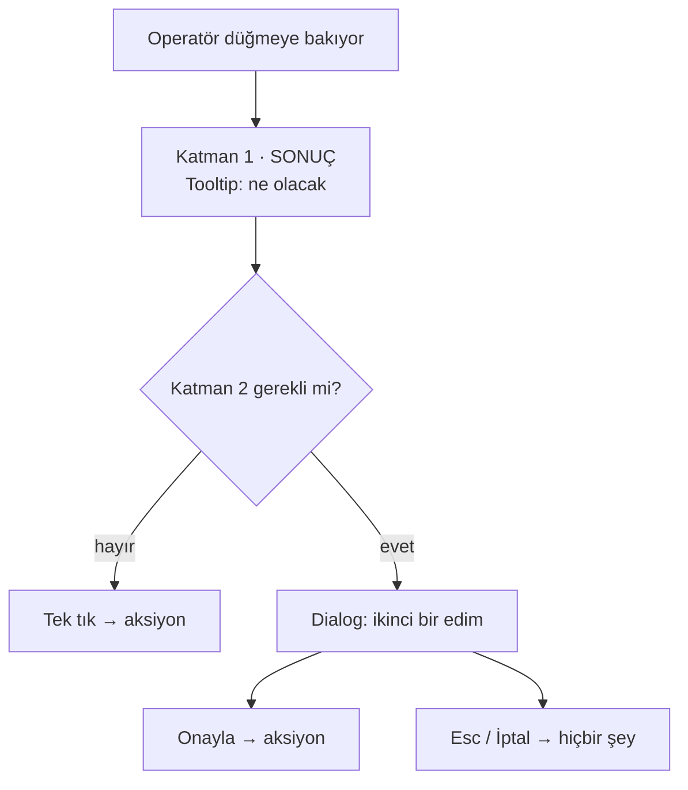

# Faz 175 — Geri Alınamaz Karar Doğrulaması

> **Durum:** 📋 Planlandı (2026-09-15)
> **Plan onayı:** onaylanmadı — uygulama başlamaz
> **Kaynak:** [ADAYLAR.md](ADAYLAR.md) · **F-224**
> **Önkoşul:** [Faz 164](arsiv/fazlar/164-CONSOLE-ENSTRUMAN-KATMANI.md) — `Dialog` primitifini ve `Tooltip` sonuç-bildirim desenini o faz kurdu
> **Paketler:** `Tracon.UI`
> **Yeni paket:** Yok · **Migration:** Yok
> **Public API:** Büyümüyor — değişiklik `Tracon.UI` frontend'inde, sevk edilen .NET yüzeyinde değil
> **Tüketici yüzeyi:** `docs-site/src/content/docs/guides/ui.md` (onay akışı ekran görüntüsüyle) · sevk edilen: `locales/en.ts` + `tr.ts` yeni anahtarlar
> **Manuel test alanı:** `docs/manuel-test/09-ARAYUZ-GENEL.md`

---

## Bu Faza Başlarken

> `faz-baslangic` skill'ini uygula. Aşağıdaki liste o skill'in 2. adımıdır —
> **tamamını değil, yalnız işaret edilen bölümleri oku.**

1. Bu doküman
2. Kararlar — dosyanın tamamını **okuma**, yalnız bu kalemleri grep'le:
   ```bash
   grep -n "K-368\|K-228\|K-232" docs/KARARLAR.md
   ```
   **K-368** (`AwaitingApproval`; onay kararından sonra AYNI `RunId` devam
   ETMEZ, yeni bir çalıştırma açılır — bu fazın en güçlü gerekçesi),
   **K-228** (i18n elle yazıldı; eksik anahtar **derleme hatasıdır**),
   **K-232** (sunucu yanıtı çevrilmez)
3. [Faz 164](arsiv/fazlar/164-CONSOLE-ENSTRUMAN-KATMANI.md) — yalnız "Plandan
   Sapmalar" §3 ve devir notu:
   ```bash
   awk '/## Plandan Sapmalar/,/## Bu Fazda Verilen Kararlar/' docs/arsiv/fazlar/164-CONSOLE-ENSTRUMAN-KATMANI.md
   ```
   `Dialog` o fazda yazıldı, ölçüldü ve DoD gereği **geri alındı**. Neden geri
   alındığını bilmeden bu faz aynı duvara çarpar.
4. Alan hafızası (bu faz bir alana dokunuyor):
   [`hafiza/frontend.md`](hafiza/frontend.md) (ekran ve bileşen tuzakları) ·
   [`hafiza/frontend-tasarim-katmani.md`](hafiza/frontend-tasarim-katmani.md)
   (`Dialog` ve `Tooltip` primitiflerinin yaşadığı katman) ·
   [`hafiza/frontend-yerellestirme.md`](hafiza/frontend-yerellestirme.md) (K-228)
5. Gerektiğinde: [`components/dialog.tsx`](../src/Tracon.UI/frontend/src/components/dialog.tsx)
   tamamı (177 satır) — primitifin sözleşmesi

---

## Amaç

Onaylar ekranında bir tool çağrısını onaylamak veya reddetmek **tek tıktır** ve
geri alınamaz. K-368 bunu kesinleştirir: karar verildikten sonra aynı `RunId`
devam etmez. İki düğme yan yanadır. Aynı desen on bir yerde daha yaşıyor.

Faz 164 `Dialog` primitifini yazdı, ölçtü ve **geri aldı** — o fazın DoD'si
mevcut E2E olgularının hiçbirinin değişmemesini şart koşuyordu, oysa bir
doğrulama adımı tanım gereği etkileşim sözleşmesini değiştirir. Bu faz o
kısıtı taşımaz.

- **F-224** — Geri alınamaz aksiyonların envanterini çıkarmak, hangilerinin
  doğrulama hak ettiğine bir **ölçüte** göre karar vermek, seçilenlere
  `Dialog` tabanlı bir doğrulama adımı eklemek ve etkilenen E2E olgularını
  **birlikte** taşımak.

### Bugün ne çalışmıyor — doğrulanmış kanıt

| Kanıt | Gözlem |
|---|---|
| [`approvals.tsx:50`](../src/Tracon.UI/frontend/src/screens/approvals.tsx#L50) | `decide` mutation'ı `approved: boolean` gövdesiyle doğrudan `POST` atıyor; arada hiçbir adım yok |
| [`dialog.tsx:128`](../src/Tracon.UI/frontend/src/components/dialog.tsx#L128) | `Dialog` hazır: `open`/`onClose`/`title`/`description`/`children`/`footer`/`width`/`testId`. Odak tuzağı `useFocusTrap` (satır 49), `Esc` ve odak dönüşü kanıtlı |
| `grep -rln 'Dialog' src/Tracon.UI/frontend/src/` | Primitifi **üç bileşen** kullanıyor (`dialog.tsx` · `command-palette.tsx` · `menu.tsx`) — **hiçbir ekran kullanmıyor** |
| [`agent-detail.tsx:327`](../src/Tracon.UI/frontend/src/screens/agent-detail.tsx#L327) | Faz 164 bir **sonuç-bildirim** katmanı kurmuş: `Tooltip` + `agentDetail.rollbackEffect`. Yorum açıkça "the CONSEQUENCE is readable at the moment of deciding" diyor |
| `tests/Tracon.Ui.E2ETests/UiTests.cs` | E2E olgu sayısı **71** |
| `src/Tracon.UI/wwwroot/assets/index-4SrOSlGr.js.br` | Bugünkü bundle **160 188 B** (brotli). Bütçe gzip üzerinden tanımlı; faz gzip payını ayrıca ölçer |

> Kanıtlar 2026-09-15 tarihinde doğrulandı.
>
> 🚨 **ADAYLAR.md iki yerde yanlıştı.** (1) "E2E olgu sayısı bugün 70" → **71**.
> (2) "geri alınamaz aksiyon çağrı yeri **10**" → o sayı bir **grep eşleşme
> sayısıdır**, çağrı yeri sayısı değil; gerçek envanter §175.1'dedir ve **12**
> kalemdir. (3) Kayıt gerekçe olarak **K-014**'ü gösteriyor; K-014
> `run_events` append-only kuralıdır. Doğru karar **K-368**'dir.

---

## 175.1 — Envanter: geri alınamaz aksiyonlar

Ekranlardaki her `useMutation` tarandı; yalnız **geri alınamaz** olanlar
listeye girdi. Kaydetme ve tetikleme aksiyonları (tekrarlanabilir) dışarıda.

| # | Çağrı yeri | Aksiyon | HTTP |
|---|---|---|---|
| 1 | [`approvals.tsx:50`](../src/Tracon.UI/frontend/src/screens/approvals.tsx#L50) | `decide` (onayla **ve** reddet) | `POST /api/approvals/{id}/decide` |
| 2 | [`agent-detail.tsx:41`](../src/Tracon.UI/frontend/src/screens/agent-detail.tsx#L41) | `remove` — agent sil | `DELETE /api/agents/{name}` |
| 3 | [`agent-detail.tsx:228`](../src/Tracon.UI/frontend/src/screens/agent-detail.tsx#L228) | `rollback` — sürüm geri al | `POST /api/agents/{name}/rollback` |
| 4 | [`sessions.tsx:57`](../src/Tracon.UI/frontend/src/screens/sessions.tsx#L57) | `remove` — oturum sil | `DELETE /api/sessions/{sessionId}` |
| 5 | [`evals.tsx:117`](../src/Tracon.UI/frontend/src/screens/evals.tsx#L117) | `remove` — eval seti sil | `DELETE /api/evals/{name}` |
| 6 | [`experiments.tsx:134`](../src/Tracon.UI/frontend/src/screens/experiments.tsx#L134) | `remove` — deney sil | `DELETE /api/experiments/{name}` |
| 7 | [`jobs.tsx:181`](../src/Tracon.UI/frontend/src/screens/jobs.tsx#L181) | `remove` — zamanlama sil | `DELETE /api/schedules/{name}` |
| 8 | [`triggers.tsx:225`](../src/Tracon.UI/frontend/src/screens/triggers.tsx#L225) | `remove` — tetikleyici sil | `DELETE /api/triggers/{name}` |
| 9 | [`mcp.tsx:171`](../src/Tracon.UI/frontend/src/screens/mcp.tsx#L171) | `remove` — MCP sunucusu sil | `DELETE /api/mcp-servers/{name}` |
| 10 | [`mcp.tsx:192`](../src/Tracon.UI/frontend/src/screens/mcp.tsx#L192) | `removeRule` — onay kuralı sil | `DELETE /api/approvals/rules/{ruleId}` |
| 11 | [`skills/skill-editor.tsx:70`](../src/Tracon.UI/frontend/src/screens/skills/skill-editor.tsx#L70) | `remove` — skill sil | `DELETE /api/skills/{name}` |
| 12 | [`skills/script-grants.tsx:55`](../src/Tracon.UI/frontend/src/screens/skills/script-grants.tsx#L55) | `revoke` — script izni iptal | `DELETE /api/skill-script-grants/{skillName}` |

Sınırda kalan üç kalem bilerek **dışarıda**: `job-detail.tsx:50 cancel`,
`jobs.tsx:195 cancel`, `experiment-detail.tsx:143 stop`. İptal geri alınamaz
ama **yok edici değildir** — iş yeniden tetiklenebilir.

## 175.2 — İki katmanlı model

Faz 164 birinci katmanı zaten kurdu. Bu faz ikincisini ekler; birincisini
**değiştirmez**.



| Katman | Ne yapar | Bugünkü durum |
|---|---|---|
| 1 — **Sonuç bildirimi** | Karar anında etkiyi okunur kılar (`Tooltip`) | `rollback` için **var**; diğer 11'i için yok |
| 2 — **Doğrulama** | İkinci bir edim ister (`Dialog`) | Hiçbiri için yok |

🚨 **Onay yorgunluğu gerçek bir maliyettir.** Her şeyi doğrulatmak hiçbirini
doğrulatmamakla aynı yere çıkar. Bu yüzden katman 2 bir **ölçüte** bağlanır.

## 175.3 — Ölçüt: hangisi katman 2 hak eder

Bir aksiyon doğrulama adımı alır **ancak ve ancak** şu ikisinden biri doğruysa:

- **(a) Yeniden yaratılamaz:** aksiyon, arayüzden aynı girdilerle geri
  getirilemeyen bir durumu yok eder (geçmiş, kayıt, sonuç).
- **(b) Bir daha verilemez:** aksiyon, tekrarlanamayan bir kararı kesinleştirir
  (K-368: onay kararından sonra soran `run` sonsuza dek `AwaitingApproval`
  kalır).

Aksi hâlde katman 1 yeterlidir.

### Aday sınıflandırma

> 🚨 Bu tablo bir **öneridir**, fazın çıktısı değil. Fazın **1. adımı** her
> satırı ölçütle sınamak ve kararı burada gerekçelendirmektir. Ölçüt bir satırı
> düşürürse satır düşer.

| # | Aksiyon | Ölçüt | Öneri |
|---|---|---|---|
| 1 | `approvals.decide` | (b) — K-368 | ✅ doğrulama |
| 2 | `agent-detail.remove` | (a) — tanım **ve** sürüm geçmişi gider | ✅ doğrulama |
| 4 | `sessions.remove` | (a) — konuşma geçmişi gider | ✅ doğrulama |
| 5 | `evals.remove` | (a) — case'ler ve koşum geçmişi gider | ✅ doğrulama |
| 6 | `experiments.remove` | (a) — deney sonuçları gider | ✅ doğrulama |
| 11 | `skill-editor.remove` | (a) — skill ve script'leri gider | ✅ doğrulama |
| 3 | `agent-detail.rollback` | ikisi de değil — eski sürüm geçmişte kalır, tekrar geri alınabilir | ❌ katman 1 yeter (**bugün var**) |
| 7 | `jobs.remove` | ikisi de değil — aynı formdan yeniden kurulur | ❌ katman 1 eklenir |
| 8 | `triggers.remove` | ikisi de değil | ❌ katman 1 eklenir |
| 9 | `mcp.remove` | ikisi de değil — yapılandırma yeniden girilir | ❌ katman 1 eklenir |
| 10 | `mcp.removeRule` | ikisi de değil | ❌ katman 1 eklenir |
| 12 | `script-grants.revoke` | ikisi de değil — izin yeniden verilir | ❌ katman 1 eklenir |

Sonuç: **6 doğrulama · 5 yeni sonuç bildirimi · 1 zaten kapsanmış**.

## 175.4 — `ConfirmDialog` bileşeni

`Dialog` genel amaçlıdır. Doğrulama adımı tekrarlanan bir şekildir, bu yüzden
ince bir sarmalayıcı alır. Her ekranın kendi dialog gövdesini yazması K-483
sınıfı bir kopya üretir.

```tsx
// components/confirm-dialog.tsx
export function ConfirmDialog({
  open, onClose, onConfirm, title, consequence, confirmLabel, busy, tone, testId,
}: {
  open: boolean;
  onClose: () => void;
  onConfirm: () => void;
  title: string;
  /** Ne olacağını söyleyen cümle. Katman 1'in metniyle AYNI kaynaktan gelir. */
  consequence: string;
  confirmLabel: string;
  busy?: boolean;
  tone?: 'danger' | 'default';
  testId?: string;
}): ReactNode;
```

İki kural:

1. **Onay düğmesi varsayılan odakta değildir.** `Enter` kazayla onaylamaz;
   odak `İptal`dedir. `Esc` her zaman iptal eder (`Dialog` bunu zaten veriyor).
2. **`consequence` metni katman 1 ile aynı anahtardan gelir.** İki yerde iki
   farklı cümle yazmak kayma üretir — `rollbackEffect` emsali budur.

## 175.5 — E2E olgularının taşınması

Doğrulama adımı bir **etkileşim sözleşmesini** değiştirir. Bugün silme
düğmesine tıklayan her E2E olgusu artık bir adım daha atar.

Kural: **davranışı değiştiren her olgu aynı commit'te taşınır.** E2E olgusu
"geçsin diye" gevşetilmez; yeni adım olgunun içine yazılır ve olgu doğrulama
adımının **varlığını** da kanıtlar.

Ayrıca **iki yeni olgu** eklenir:

- `Esc` doğrulamayı iptal eder ve **hiçbir istek atılmaz** (ağ çağrısı sayılır).
- `İptal` düğmesi aynı şeyi yapar ve odak tetikleyen düğmeye döner.

---

## Planlanan Public API

Sevk edilen .NET yüzeyi **büyümüyor**. Değişiklik `Tracon.UI` frontend'indedir.

### Yeni i18n anahtarları

`en.ts` ve `tr.ts` **birlikte** değişir; eksik anahtar derleme hatasıdır (K-228).

```ts
confirm: {
  cancel: '…',
  title: { deleteAgent: '…', deleteSession: '…', deleteEval: '…',
           deleteExperiment: '…', deleteSkill: '…', approve: '…', reject: '…' },
  consequence: { /* aksiyon başına bir cümle */ },
}
```

### HTTP `endpoint`'leri

Yok — hiçbir uç değişmiyor. Bu faz yalnız arayüz katmanıdır.

### Arayüz payı

`ConfirmDialog` mevcut `Dialog`'un üstüne biner; yeni bağımlılık yok. Bugünkü
bundle **160 188 B** (brotli, `index-4SrOSlGr.js.br`). Faz gzip payını ölçer ve
kapanışta **gzip KB olarak** yazar. Beklenen artış küçüktür ama **ölçülmeli** —
tahmin yazılmaz.

---

## Planlanan Dosya Listesi

```
src/Tracon.UI/frontend/src/
├── components/
│   └── confirm-dialog.tsx        (yeni)
├── locales/
│   ├── en.ts                     (değişir)
│   └── tr.ts                     (değişir)
└── screens/
    ├── approvals.tsx             (değişir — doğrulama)
    ├── agent-detail.tsx          (değişir — doğrulama + rollback dokunulmaz)
    ├── sessions.tsx              (değişir — doğrulama)
    ├── evals.tsx                 (değişir — doğrulama)
    ├── experiments.tsx           (değişir — doğrulama)
    ├── skills/skill-editor.tsx   (değişir — doğrulama)
    ├── jobs.tsx                  (değişir — katman 1)
    ├── triggers.tsx              (değişir — katman 1)
    ├── mcp.tsx                   (değişir — katman 1 × 2)
    └── skills/script-grants.tsx  (değişir — katman 1)

tests/Tracon.Ui.E2ETests/
└── UiTests.cs                    (değişir — etkilenen olgular + 2 yeni olgu)
```

---

## Hata Modları ve Testler

> Seviyeyi plan seçer. Doğrulama adımı **tarayıcıda** yaşar: odak, klavye ve
> ağ etkisi birim testiyle kanıtlanamaz — akış sınırı geçer.

| Ne bozulabilir | Seviye | Test |
|---|---|---|
| Doğrulama açıkken `Enter` kazayla onaylıyor | E2E | `UiTests.Confirm_does_not_default_focus_the_destructive_button` |
| `Esc` dialogu kapatıyor ama istek yine de gidiyor | E2E | `UiTests.Escape_cancels_without_any_request` |
| İptal sonrası odak tetikleyen düğmeye dönmüyor | E2E | `UiTests.Cancel_returns_focus_to_the_trigger` |
| Onay sonrası aksiyon **iki kez** çalışıyor (çift tık) | E2E | `UiTests.Confirm_is_idempotent_under_double_click` |
| Sunucu reddederse dialog açık kalıyor ve hata görünmüyor | E2E | `UiTests.Server_refusal_is_shown_in_the_dialog` |
| `tr.ts` anahtarı eksik | Derleme (K-228) | `npm run build` — kapı zaten var |
| Onay yorgunluğu: ölçüt dışı bir aksiyona dialog eklenmiş | Denetim | `faz-denetim` §175.3 tablosuna karşı okur |
| Doğrulama adımı ekranı klavyeyle erişilemez kılıyor | E2E | `UiTests.Confirm_is_reachable_by_keyboard_only` |

Beş soru: **iptal** → `Esc`/İptal olguları · **eşzamanlılık** → çift tık
olgusu · **boş/aşırı girdi** → uzun `consequence` metni dialogu taşırmaz
(görsel, `👤 insan gerekir`) · **başka kiracı** → bu katmanda yok, yetki
sunucuda · **alt sistem hatası** → sunucu reddi olgusu.

---

## Manuel Kabul Case'leri

| # | Ön koşul | Adımlar | Beklenen sonuç |
|---|---|---|---|
| 1 | Bekleyen bir onay var | Onaylar ekranı → `Reddet` | Doğrulama açılır; etki cümlesi run'ın `AwaitingApproval` kalacağını söyler |
| 2 | Aynı dialog açık | `Esc` | Dialog kapanır, hiçbir istek gitmez, onay hâlâ bekliyor |
| 3 | Aynı dialog açık | `Tab` ile gez | Odak dialog içinde kalır; ilk odak `İptal`dedir |
| 4 | Bir agent var | Agent detay → `Sil` → `Onayla` | Agent silinir, `agents` ekranına dönülür |
| 5 | Bir agent sürümü var | Agent detay → `Rollback` üstüne gel | **Tooltip** görünür, dialog **açılmaz** (ölçüt dışı) |
| 6 | Bir MCP sunucusu var | MCP → `Sil` | Dialog **açılmaz**; tooltip etkiyi söyler |
| 7 | 👤 insan gerekir | Dar ekranda (400 px) dialog aç | Dialog taşmaz, düğmeler erişilebilir |

---

## Açık Sorular

| # | Soru | Seçenekler | Öneri |
|---|---|---|---|
| 1 | Yıkıcı aksiyonlarda ad yazdırma ("agent adını yaz") istensin mi? | A: hayır, tek onay yeter · B: yalnız agent silmede · C: tüm (a) sınıfında | **A** — Tracon tek kiracılı bir konsol değil ama bu ekranlar zaten rol korumalı. Ad yazdırma onay yorgunluğunun en pahalı biçimidir; talep kanıtı yok |
| 2 | `approvals.decide` için onayla ve reddet **aynı** dialog metnini mi alsın? | A: ayrı metin · B: aynı metin, farklı başlık | **A** — iki kararın sonucu farklıdır; tek metin K-368'in asimetrisini gizler |
| 3 | Katman 1 eklenen 5 aksiyon bu fazda mı yapılsın, ayrılsın mı? | A: bu fazda · B: ayrı faz | **A** — aynı envanter turu, aynı i18n dosyası, aynı ekranlar. Ayırmak iki kez dokunmaktır |
| 4 | `tone: 'danger'` görsel ayrım getirsin mi? | A: evet, kırmızı onay düğmesi · B: hayır | **A** — mevcut `Button` tonları zaten var; ek bundle maliyeti yok |

---

## Bitiş Ölçütleri (DoD)

- [ ] §175.3 tablosunun her satırı ölçütle sınandı ve karar **bu dokümana** yazıldı
- [ ] Ölçütü geçen her aksiyon `ConfirmDialog` kullanıyor; geçmeyen **hiçbiri** kullanmıyor
- [ ] `Esc` ve `İptal` hiçbir istek atmadan kapatıyor — E2E olgusu ağ çağrısını sayarak kanıtlıyor
- [ ] Onay düğmesi varsayılan odakta **değil**
- [ ] Etkilenen E2E olguları aynı commit'te taşındı; olgu sayısı 71'den kaça çıktığı yazıldı
- [ ] `en.ts` ve `tr.ts` eksiksiz; `npm run build` temiz
- [ ] Bundle payı **gzip KB olarak** ölçüldü ve yazıldı; 250 KB bütçesi korunuyor
- [ ] Dört doğrulama kapısı sıfır uyarı verir
- [ ] `samples/Tracon.Api` ile gerçek `run` yapıldı, çıktı belgeye yazıldı
- [ ] `secret` taraması boş döndü
- [ ] Manuel kabul case'leri `docs/manuel-test/09-ARAYUZ-GENEL.md` içine eklendi; otomatikleştirilebilenler koşuldu
- [ ] `faz-denetim` koşuldu; 🔴 bulgu kalmadı
- [ ] `docs-site/` güncellendi; `npm run build` + `check-links.mjs` temiz

### Doğrulama komutları

```bash
# E2E olgu sayısı ve geçiş
dotnet test tests/Tracon.Ui.E2ETests

# i18n bütünlüğü ve bundle
cd src/Tracon.UI/frontend && npm run build
gzip -c ../wwwroot/assets/index-*.js | wc -c   # gzip payı
```

---

## Riskler

| Risk | Önlem |
|------|-------|
| Onay yorgunluğu — her şeyi doğrulatmak hiçbirini doğrulatmamaktır | §175.3 ölçütü DoD'dedir; ölçüt dışı bir dialog `faz-denetim` bulgusudur |
| E2E olguları "geçsin diye" gevşetilir | Kural §175.5'te: olgu doğrulama adımının **varlığını** da kanıtlar. Denetçi bunu okur |
| `Enter` ile kazara onay — doğrulama adımının kendisi yeni bir mis-click yüzeyi üretir | Odak `İptal`dedir ve E2E olgusu bunu kanıtlar |
| Faz 164 duvarı tekrarlanır (DoD mevcut olguların değişmemesini şart koşar) | Bu fazın DoD'si **tersini** şart koşar: etkilenen olgular taşınmalıdır |
| Bundle bütçesi zorlanır | `ConfirmDialog` mevcut `Dialog` üstüne biner; yeni bağımlılık yok. Yine de gzip payı ölçülür |
| Katman 1 ile katman 2 metinleri ayrışır | `consequence` katman 1 ile **aynı i18n anahtarından** gelir (§175.4 kural 2) |

---

<!-- ============================================================
     AŞAĞISI KAPANIŞTA DOLDURULUR — `faz-tamamlama` skill'i.
     Plan anında boş kalır. Başlıkları SİLME.
     ============================================================ -->

## Plandan Sapmalar

> Kapanışta doldurulur.

## Bu Fazda Verilen Kararlar

> Kapanışta doldurulur. K-NNN numaraları burada alınır; plan numara rezerve etmez.

## Gerçekleşen Public API

> Kapanışta doldurulur.

## Dosya Listesi (gerçekleşen)

> Kapanışta doldurulur.

## Süreç Ölçümü

> Kapanışta doldurulur. **Tablo olarak** — onay kutusu DEĞİL.

| Metrik | Değer |
|---|---|
| Plan revizyonu sayısı | |
| Düzeltme turu sayısı | |
| 🔴 bulgu: gerçek / gürültü / araştırılacak | |
| Fazın ürettiği regresyon | |
| Faz kapandıktan sonra bulunan kusur | |

## Denetim Bulguları

> Kapanışta doldurulur — `faz-denetim` çıktısı.

## Sonraki Faza Devir Notu

> Kapanışta doldurulur.
