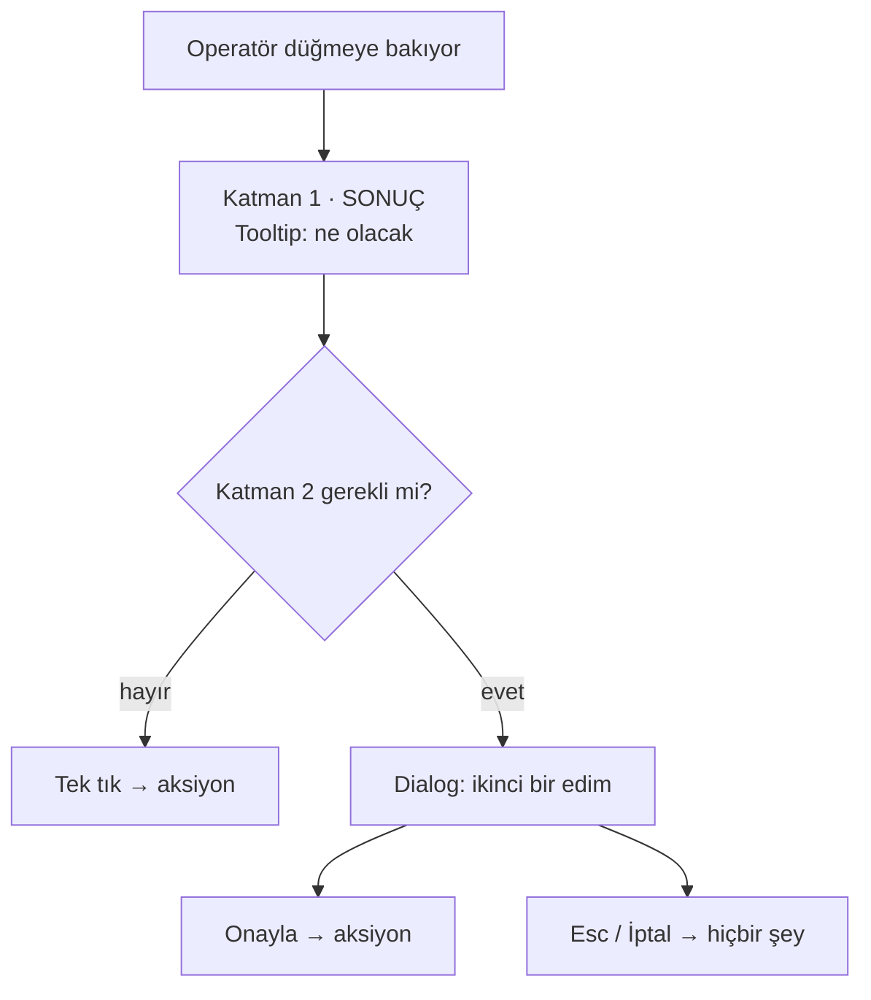

# Faz 175 — Geri Alınamaz Karar Doğrulaması

> **Durum:** ✅ Tamamlandı (2026-09-16)
> **Plan onayı:** onaylandı (2026-09-16, kullanıcı) — dört açık sorunun dördü de
> önerilen seçenekle kapandı
> **Kaynak:** [ADAYLAR.md](ADAYLAR.md) · **F-224**
> **Önkoşul:** [Faz 164](arsiv/fazlar/164-CONSOLE-ENSTRUMAN-KATMANI.md) — `Dialog` primitifini ve `Tooltip` sonuç-bildirim desenini o faz kurdu
> **Paketler:** `Tracon.UI`
> **Yeni paket:** Yok · **Migration:** Yok
> **Public API:** Büyümüyor — değişiklik `Tracon.UI` frontend'inde, sevk edilen .NET yüzeyinde değil
> **Tüketici yüzeyi:** `docs-site/src/content/docs/ui.md` (plan `guides/ui.md` yazıyordu; o yol YOKTUR) · sevk edilen: `locales/{en,tr}/*.ts` yeni anahtarlar
> **Manuel test alanı:** `docs/manuel-test/09-ARAYUZ-GENEL.md`

---

## Bu Faza Başlarken

> `faz-baslangic` skill'ini uygula. Aşağıdaki liste o skill'in 2. adımıdır —
> **tamamını değil, yalnız işaret edilen bölümleri oku.**

1. Bu doküman
2. Kararlar — dosyanın tamamını **okuma**, yalnız bu kalemleri grep'le:
   ```bash
   grep -n "K-368\|K-228\|K-232" docs/KARARLAR.md
   ```
   **K-368** (`AwaitingApproval`; onay kararından sonra AYNI `RunId` devam
   ETMEZ, yeni bir çalıştırma açılır — bu fazın en güçlü gerekçesi),
   **K-228** (i18n elle yazıldı; eksik anahtar **derleme hatasıdır**),
   **K-232** (sunucu yanıtı çevrilmez)
3. [Faz 164](arsiv/fazlar/164-CONSOLE-ENSTRUMAN-KATMANI.md) — yalnız "Plandan
   Sapmalar" §3 ve devir notu:
   ```bash
   awk '/## Plandan Sapmalar/,/## Bu Fazda Verilen Kararlar/' docs/arsiv/fazlar/164-CONSOLE-ENSTRUMAN-KATMANI.md
   ```
   `Dialog` o fazda yazıldı, ölçüldü ve DoD gereği **geri alındı**. Neden geri
   alındığını bilmeden bu faz aynı duvara çarpar.
4. Alan hafızası (bu faz bir alana dokunuyor):
   [`hafiza/frontend.md`](hafiza/frontend.md) (ekran ve bileşen tuzakları) ·
   [`hafiza/frontend-tasarim-katmani.md`](hafiza/frontend-tasarim-katmani.md)
   (`Dialog` ve `Tooltip` primitiflerinin yaşadığı katman) ·
   [`hafiza/frontend-yerellestirme.md`](hafiza/frontend-yerellestirme.md) (K-228)
5. Gerektiğinde: [`components/dialog.tsx`](../src/Tracon.UI/frontend/src/components/dialog.tsx)
   tamamı (177 satır) — primitifin sözleşmesi

---

## Amaç

Onaylar ekranında bir tool çağrısını onaylamak veya reddetmek **tek tıktır** ve
geri alınamaz. K-368 bunu kesinleştirir: karar verildikten sonra aynı `RunId`
devam etmez. İki düğme yan yanadır. Aynı desen on bir yerde daha yaşıyor.

Faz 164 `Dialog` primitifini yazdı, ölçtü ve **geri aldı** — o fazın DoD'si
mevcut E2E olgularının hiçbirinin değişmemesini şart koşuyordu, oysa bir
doğrulama adımı tanım gereği etkileşim sözleşmesini değiştirir. Bu faz o
kısıtı taşımaz.

- **F-224** — Geri alınamaz aksiyonların envanterini çıkarmak, hangilerinin
  doğrulama hak ettiğine bir **ölçüte** göre karar vermek, seçilenlere
  `Dialog` tabanlı bir doğrulama adımı eklemek ve etkilenen E2E olgularını
  **birlikte** taşımak.

### Bugün ne çalışmıyor — doğrulanmış kanıt

| Kanıt | Gözlem |
|---|---|
| [`approvals.tsx:50`](../src/Tracon.UI/frontend/src/screens/approvals.tsx#L50) | `decide` mutation'ı `approved: boolean` gövdesiyle doğrudan `POST` atıyor; arada hiçbir adım yok |
| [`dialog.tsx:128`](../src/Tracon.UI/frontend/src/components/dialog.tsx#L128) | `Dialog` hazır: `open`/`onClose`/`title`/`description`/`children`/`footer`/`width`/`testId`. Odak tuzağı `useFocusTrap` (satır 49), `Esc` ve odak dönüşü kanıtlı |
| `grep -rln 'Dialog' src/Tracon.UI/frontend/src/` | Primitifi **üç bileşen** kullanıyor (`dialog.tsx` · `command-palette.tsx` · `menu.tsx`) — **hiçbir ekran kullanmıyor** |
| [`agent-detail.tsx:327`](../src/Tracon.UI/frontend/src/screens/agent-detail.tsx#L327) | Faz 164 bir **sonuç-bildirim** katmanı kurmuş: `Tooltip` + `agentDetail.rollbackEffect`. Yorum açıkça "the CONSEQUENCE is readable at the moment of deciding" diyor |
| `tests/Tracon.Ui.E2ETests/UiTests.cs` | E2E olgu sayısı **71** — ⚠️ yanlış: o dosyada **70** vardır, 71 PROJE toplamıdır (bkz. Plandan Sapmalar §3) |
| `src/Tracon.UI/wwwroot/assets/index-4SrOSlGr.js.br` | Bugünkü bundle **160 188 B** (brotli) — ⚠️ bayat: temiz worktree'de ölçülen taban **162,6 KB brotli / 190,5 KB gzip**'tir |

> Kanıtlar 2026-09-15 tarihinde doğrulandı.
>
> 🚨 **ADAYLAR.md iki yerde yanlıştı.** (1) "E2E olgu sayısı bugün 70" → **71**.
> (2) "geri alınamaz aksiyon çağrı yeri **10**" → o sayı bir **grep eşleşme
> sayısıdır**, çağrı yeri sayısı değil; gerçek envanter §175.1'dedir ve **12**
> kalemdir. (3) Kayıt gerekçe olarak **K-014**'ü gösteriyor; K-014
> `run_events` append-only kuralıdır. Doğru karar **K-368**'dir.

---

## 175.1 — Envanter: geri alınamaz aksiyonlar

Ekranlardaki her `useMutation` tarandı; yalnız **geri alınamaz** olanlar
listeye girdi. Kaydetme ve tetikleme aksiyonları (tekrarlanabilir) dışarıda.

| # | Çağrı yeri | Aksiyon | HTTP |
|---|---|---|---|
| 1 | [`approvals.tsx:50`](../src/Tracon.UI/frontend/src/screens/approvals.tsx#L50) | `decide` (onayla **ve** reddet) | `POST /api/approvals/{id}/decide` |
| 2 | [`agent-detail.tsx:41`](../src/Tracon.UI/frontend/src/screens/agent-detail.tsx#L41) | `remove` — agent sil | `DELETE /api/agents/{name}` |
| 3 | [`agent-detail.tsx:228`](../src/Tracon.UI/frontend/src/screens/agent-detail.tsx#L228) | `rollback` — sürüm geri al | `POST /api/agents/{name}/rollback` |
| 4 | [`sessions.tsx:57`](../src/Tracon.UI/frontend/src/screens/sessions.tsx#L57) | `remove` — oturum sil | `DELETE /api/sessions/{sessionId}` |
| 5 | [`evals.tsx:117`](../src/Tracon.UI/frontend/src/screens/evals.tsx#L117) | `remove` — eval seti sil | `DELETE /api/evals/{name}` |
| 6 | [`experiments.tsx:134`](../src/Tracon.UI/frontend/src/screens/experiments.tsx#L134) | `remove` — deney sil | `DELETE /api/experiments/{name}` |
| 7 | [`jobs.tsx:181`](../src/Tracon.UI/frontend/src/screens/jobs.tsx#L181) | `remove` — zamanlama sil | `DELETE /api/schedules/{name}` |
| 8 | [`triggers.tsx:225`](../src/Tracon.UI/frontend/src/screens/triggers.tsx#L225) | `remove` — tetikleyici sil | `DELETE /api/triggers/{name}` |
| 9 | [`mcp.tsx:171`](../src/Tracon.UI/frontend/src/screens/mcp.tsx#L171) | `remove` — MCP sunucusu sil | `DELETE /api/mcp-servers/{name}` |
| 10 | [`mcp.tsx:192`](../src/Tracon.UI/frontend/src/screens/mcp.tsx#L192) | `removeRule` — onay kuralı sil | `DELETE /api/approvals/rules/{ruleId}` |
| 11 | [`skills/skill-editor.tsx:70`](../src/Tracon.UI/frontend/src/screens/skills/skill-editor.tsx#L70) | `remove` — skill sil | `DELETE /api/skills/{name}` |
| 12 | [`skills/script-grants.tsx:55`](../src/Tracon.UI/frontend/src/screens/skills/script-grants.tsx#L55) | `revoke` — script izni iptal | `DELETE /api/skill-script-grants/{skillName}` |

Sınırda kalan üç kalem bilerek **dışarıda**: `job-detail.tsx:50 cancel`,
`jobs.tsx:195 cancel`, `experiment-detail.tsx:143 stop`. İptal geri alınamaz
ama **yok edici değildir** — iş yeniden tetiklenebilir.

## 175.2 — İki katmanlı model

Faz 164 birinci katmanı zaten kurdu. Bu faz ikincisini ekler; birincisini
**değiştirmez**.



| Katman | Ne yapar | Bugünkü durum |
|---|---|---|
| 1 — **Sonuç bildirimi** | Karar anında etkiyi okunur kılar (`Tooltip`) | `rollback` için **var**; diğer 11'i için yok |
| 2 — **Doğrulama** | İkinci bir edim ister (`Dialog`) | Hiçbiri için yok |

> 🚨 **İkinci satır yanlıştı.** Uygulamada dokuz çağrı yeri `window.confirm`
> kullanıyordu — erişilemez, biçimlenemez ve varsayılan düğmesi KABUL eden bir
> doğrulama. Ayrıntı ve sonuç: Plandan Sapmalar §1, karar **K-790**.

🚨 **Onay yorgunluğu gerçek bir maliyettir.** Her şeyi doğrulatmak hiçbirini
doğrulatmamakla aynı yere çıkar. Bu yüzden katman 2 bir **ölçüte** bağlanır.

## 175.3 — Ölçüt: hangisi katman 2 hak eder

Bir aksiyon doğrulama adımı alır **ancak ve ancak** şu ikisinden biri doğruysa:

- **(a) Yeniden yaratılamaz:** aksiyon, arayüzden aynı girdilerle geri
  getirilemeyen bir durumu yok eder (geçmiş, kayıt, sonuç).
- **(b) Bir daha verilemez:** aksiyon, tekrarlanamayan bir kararı kesinleştirir
  (K-368: onay kararından sonra soran `run` sonsuza dek `AwaitingApproval`
  kalır).

Aksi hâlde katman 1 yeterlidir.

### Aday sınıflandırma

> 🚨 Bu tablo bir **öneridir**, fazın çıktısı değil. Fazın **1. adımı** her
> satırı ölçütle sınamak ve kararı burada gerekçelendirmektir. Ölçüt bir satırı
> düşürürse satır düşer.

| # | Aksiyon | Ölçüt | Öneri |
|---|---|---|---|
| 1 | `approvals.decide` | (b) — K-368 | ✅ doğrulama |
| 2 | `agent-detail.remove` | (a) — tanım **ve** sürüm geçmişi gider | ✅ doğrulama |
| 4 | `sessions.remove` | (a) — konuşma geçmişi gider | ✅ doğrulama |
| 5 | `evals.remove` | (a) — case'ler ve koşum geçmişi gider | ✅ doğrulama |
| 6 | `experiments.remove` | (a) — deney sonuçları gider | ✅ doğrulama |
| 11 | `skill-editor.remove` | (a) — skill ve script'leri gider | ✅ doğrulama |
| 3 | `agent-detail.rollback` | ikisi de değil — eski sürüm geçmişte kalır, tekrar geri alınabilir | ❌ katman 1 yeter (**bugün var**) |
| 7 | `jobs.remove` | ikisi de değil — aynı formdan yeniden kurulur | ❌ katman 1 eklenir |
| 8 | `triggers.remove` | ikisi de değil | ❌ katman 1 eklenir |
| 9 | `mcp.remove` | ikisi de değil — yapılandırma yeniden girilir | ❌ katman 1 eklenir |
| 10 | `mcp.removeRule` | ikisi de değil | ❌ katman 1 eklenir |
| 12 | `script-grants.revoke` | ikisi de değil — izin yeniden verilir | ❌ katman 1 eklenir |

Sonuç: **6 doğrulama · 5 yeni sonuç bildirimi · 1 zaten kapsanmış**.

## 175.4 — `ConfirmDialog` bileşeni

`Dialog` genel amaçlıdır. Doğrulama adımı tekrarlanan bir şekildir, bu yüzden
ince bir sarmalayıcı alır. Her ekranın kendi dialog gövdesini yazması K-483
sınıfı bir kopya üretir.

```tsx
// components/confirm-dialog.tsx
export function ConfirmDialog({
  open, onClose, onConfirm, title, consequence, confirmLabel, busy, tone, testId,
}: {
  open: boolean;
  onClose: () => void;
  onConfirm: () => void;
  title: string;
  /** Ne olacağını söyleyen cümle. Katman 1'in metniyle AYNI kaynaktan gelir. */
  consequence: string;
  confirmLabel: string;
  busy?: boolean;
  tone?: 'danger' | 'default';
  testId?: string;
}): ReactNode;
```

İki kural:

1. **Onay düğmesi varsayılan odakta değildir.** `Enter` kazayla onaylamaz;
   odak `İptal`dedir. `Esc` her zaman iptal eder (`Dialog` bunu zaten veriyor).
2. **`consequence` metni katman 1 ile aynı anahtardan gelir.** İki yerde iki
   farklı cümle yazmak kayma üretir — `rollbackEffect` emsali budur.

## 175.5 — E2E olgularının taşınması

Doğrulama adımı bir **etkileşim sözleşmesini** değiştirir. Bugün silme
düğmesine tıklayan her E2E olgusu artık bir adım daha atar.

Kural: **davranışı değiştiren her olgu aynı commit'te taşınır.** E2E olgusu
"geçsin diye" gevşetilmez; yeni adım olgunun içine yazılır ve olgu doğrulama
adımının **varlığını** da kanıtlar.

Ayrıca **iki yeni olgu** eklenir:

- `Esc` doğrulamayı iptal eder ve **hiçbir istek atılmaz** (ağ çağrısı sayılır).
- `İptal` düğmesi aynı şeyi yapar ve odak tetikleyen düğmeye döner.

---

## Planlanan Public API

Sevk edilen .NET yüzeyi **büyümüyor**. Değişiklik `Tracon.UI` frontend'indedir.

### Yeni i18n anahtarları

`en.ts` ve `tr.ts` **birlikte** değişir; eksik anahtar derleme hatasıdır (K-228).

```ts
confirm: {
  cancel: '…',
  title: { deleteAgent: '…', deleteSession: '…', deleteEval: '…',
           deleteExperiment: '…', deleteSkill: '…', approve: '…', reject: '…' },
  consequence: { /* aksiyon başına bir cümle */ },
}
```

### HTTP `endpoint`'leri

Yok — hiçbir uç değişmiyor. Bu faz yalnız arayüz katmanıdır.

### Arayüz payı

`ConfirmDialog` mevcut `Dialog`'un üstüne biner; yeni bağımlılık yok. Bugünkü
bundle **160 188 B** (brotli, `index-4SrOSlGr.js.br`). Faz gzip payını ölçer ve
kapanışta **gzip KB olarak** yazar. Beklenen artış küçüktür ama **ölçülmeli** —
tahmin yazılmaz.

---

## Planlanan Dosya Listesi

```
src/Tracon.UI/frontend/src/
├── components/
│   └── confirm-dialog.tsx        (yeni)
├── locales/
│   ├── en.ts                     (değişir)
│   └── tr.ts                     (değişir)
└── screens/
    ├── approvals.tsx             (değişir — doğrulama)
    ├── agent-detail.tsx          (değişir — doğrulama + rollback dokunulmaz)
    ├── sessions.tsx              (değişir — doğrulama)
    ├── evals.tsx                 (değişir — doğrulama)
    ├── experiments.tsx           (değişir — doğrulama)
    ├── skills/skill-editor.tsx   (değişir — doğrulama)
    ├── jobs.tsx                  (değişir — katman 1)
    ├── triggers.tsx              (değişir — katman 1)
    ├── mcp.tsx                   (değişir — katman 1 × 2)
    └── skills/script-grants.tsx  (değişir — katman 1)

tests/Tracon.Ui.E2ETests/
└── UiTests.cs                    (değişir — etkilenen olgular + 2 yeni olgu)
```

---

## Hata Modları ve Testler

> Seviyeyi plan seçer. Doğrulama adımı **tarayıcıda** yaşar: odak, klavye ve
> ağ etkisi birim testiyle kanıtlanamaz — akış sınırı geçer.

| Ne bozulabilir | Seviye | Test |
|---|---|---|
| Doğrulama açıkken `Enter` kazayla onaylıyor | E2E | `UiTests.Confirm_does_not_default_focus_the_destructive_button` |
| `Esc` dialogu kapatıyor ama istek yine de gidiyor | E2E | `UiTests.Escape_cancels_without_any_request` |
| İptal sonrası odak tetikleyen düğmeye dönmüyor | E2E | `UiTests.Cancel_returns_focus_to_the_trigger` |
| Onay sonrası aksiyon **iki kez** çalışıyor (çift tık) | E2E | `UiTests.Confirm_is_idempotent_under_double_click` |
| Sunucu reddederse dialog açık kalıyor ve hata görünmüyor | E2E | `UiTests.Server_refusal_is_shown_in_the_dialog` |
| `tr.ts` anahtarı eksik | Derleme (K-228) | `npm run build` — kapı zaten var |
| Onay yorgunluğu: ölçüt dışı bir aksiyona dialog eklenmiş | Denetim | `faz-denetim` §175.3 tablosuna karşı okur |
| Doğrulama adımı ekranı klavyeyle erişilemez kılıyor | E2E | `UiTests.Confirm_is_reachable_by_keyboard_only` |

Beş soru: **iptal** → `Esc`/İptal olguları · **eşzamanlılık** → çift tık
olgusu · **boş/aşırı girdi** → uzun `consequence` metni dialogu taşırmaz
(görsel, `👤 insan gerekir`) · **başka kiracı** → bu katmanda yok, yetki
sunucuda · **alt sistem hatası** → sunucu reddi olgusu.

---

## Manuel Kabul Case'leri

| # | Ön koşul | Adımlar | Beklenen sonuç |
|---|---|---|---|
| 1 | Bekleyen bir onay var | Onaylar ekranı → `Reddet` | Doğrulama açılır; etki cümlesi run'ın `AwaitingApproval` kalacağını söyler |
| 2 | Aynı dialog açık | `Esc` | Dialog kapanır, hiçbir istek gitmez, onay hâlâ bekliyor |
| 3 | Aynı dialog açık | `Tab` ile gez | Odak dialog içinde kalır; ilk odak `İptal`dedir |
| 4 | Bir agent var | Agent detay → `Sil` → `Onayla` | Agent silinir, `agents` ekranına dönülür |
| 5 | Bir agent sürümü var | Agent detay → `Rollback` üstüne gel | **Tooltip** görünür, dialog **açılmaz** (ölçüt dışı) |
| 6 | Bir MCP sunucusu var | MCP → `Sil` | Dialog **açılmaz**; tooltip etkiyi söyler |
| 7 | 👤 insan gerekir | Dar ekranda (400 px) dialog aç | Dialog taşmaz, düğmeler erişilebilir |

---

## Açık Sorular

| # | Soru | Seçenekler | Öneri |
|---|---|---|---|
| 1 | Yıkıcı aksiyonlarda ad yazdırma ("agent adını yaz") istensin mi? | A: hayır, tek onay yeter · B: yalnız agent silmede · C: tüm (a) sınıfında | **A** — Tracon tek kiracılı bir konsol değil ama bu ekranlar zaten rol korumalı. Ad yazdırma onay yorgunluğunun en pahalı biçimidir; talep kanıtı yok |
| 2 | `approvals.decide` için onayla ve reddet **aynı** dialog metnini mi alsın? | A: ayrı metin · B: aynı metin, farklı başlık | **A** — iki kararın sonucu farklıdır; tek metin K-368'in asimetrisini gizler |
| 3 | Katman 1 eklenen 5 aksiyon bu fazda mı yapılsın, ayrılsın mı? | A: bu fazda · B: ayrı faz | **A** — aynı envanter turu, aynı i18n dosyası, aynı ekranlar. Ayırmak iki kez dokunmaktır |
| 4 | `tone: 'danger'` görsel ayrım getirsin mi? | A: evet, kırmızı onay düğmesi · B: hayır | **A** — mevcut `Button` tonları zaten var; ek bundle maliyeti yok |

---

## Bitiş Ölçütleri (DoD)

- [x] §175.3 tablosunun her satırı ölçütle sınandı ve karar **bu dokümana** yazıldı — "Ölçütün Şema Kanıtıyla Sınanması" tablosu; her satırın gerekçesi bir `ON DELETE` kuralıdır, tahmin değil. Plan sınıflandırması **aynen doğrulandı**, hiçbir satır düşmedi
- [x] Ölçütü geçen her aksiyon `ConfirmDialog` kullanıyor; geçmeyen **hiçbiri** kullanmıyor — tam 6 kullanım, denetçi bağımsız doğruladı. Ölçütü geçen dört ekranın `onRetry` yolu da (denetim 🟡 #2) artık doğrulamayı yeniden açıyor, silmeyi tetiklemiyor
- [x] `Esc` ve `İptal` hiçbir istek atmadan kapatıyor — `Escape_and_cancel_close_the_confirmation_without_any_request` `DELETE` sayısını sayar ve **0** bekler. Örnek uygulamada da doğrulandı (`Esc` sonrası `GET /api/sessions` hâlâ `['faz175-manuel']`)
- [x] Onay düğmesi varsayılan odakta **değil** — `Confirm_does_not_default_focus_the_destructive_button`; ayrıca gerçek tarayıcı anlık görüntüsünde `Cancel` `[active]`
- [x] Etkilenen E2E olguları aynı commit'te taşındı; olgu sayısı yazıldı — `UiTests.cs` **70 → 78**, proje **71 → 79**. Taşınan tek olgu `Approvals_screen_…` ve **gevşetilmedi**
- [x] `en` ve `tr` eksiksiz; `npm run build` temiz — 16 anahtar iki dile birlikte eklendi, 4 ölü anahtar silindi; `Pick<Messages, …>` eksik anahtarı derleme hatası yapar (K-228)
- [x] Bundle payı **gzip KB olarak** ölçüldü ve yazıldı — **190,5 → 192,4 KB** (+1,9 KB), 250 KB bütçesinin altında. Taban temiz bir `git worktree` içinde ölçüldü
- [x] Dört doğrulama kapısı sıfır uyarı verir — `python3 scripts/kapi.py kapanis --taban 54eea002`
- [x] `samples/Tracon.Api` ile gerçek `run` yapıldı, çıktı belgeye yazıldı — aşağıda
- [x] `secret` taraması boş döndü — `kapi.py tarama`: "✅ temiz (6 işaretli sentetik credential atlandı)"
- [x] Manuel kabul case'leri eklendi; otomatikleştirilebilenler koşuldu — `09-ARAYUZ-GENEL.md` MT-UI-055…057, üçünün de otomatik karşılığı yeşil. Ayrıca **yedi bayat case** yeni akışa taşındı (denetim 🟡 #4 + sınıf taraması)
- [x] `faz-denetim` koşuldu; 🔴 bulgu kalmadı — iki 🔴 bulundu, ikisi de kapandı ve her kapanış düşen bir testle kanıtlandı ("Denetim Bulguları")
- [x] `docs-site/` güncellendi; `npm run build` + `check-links.mjs` temiz — `ui.md`: onay akışı, ölçüt anlatısı, `confirm()` notu ve güncel bundle sayısı

### Örnek uygulamayla gerçek koşum

`dotnet run --project samples/Tracon.Api -c Release`, `http://localhost:5000/tracon`.

| Adım | Sonuç |
|---|---|
| `POST /api/agents/support/run` (`sessionId=faz175-manuel`) | `200`, SSE akışı, `runId=01a0a709-…` |
| Oturumlar ekranı, silme düğmesine **odak** | Tooltip: "Deletes the conversation and every message in it. The runs it started keep their own rows…" |
| Silme düğmesine tık | Konsolun kendi dialogu açıldı; erişilebilirlik ağacı `button "Cancel" [active]` — açılış odağı İptal'de |
| `Esc` | Dialog kapandı, `GET /api/sessions` hâlâ `['faz175-manuel']` — **hiçbir istek gitmedi** — ve odak `button "Delete session" [active]` ile tetikleyiciye döndü |
| Tekrar aç → `Delete` | `GET /api/sessions` → `[]`, `GET /api/runs` → **1 run** hâlâ kayıtlı. Etki cümlesinin vaadi birebir gerçekleşti |
| Jobs ekranı (düzeltme öncesi bundle) | 🚨 Sızan yorum aksiyon hücresinde **basılı görüldü** — denetim 🔴 #1'in canlı kanıtı |
| Jobs ekranı (düzeltme sonrası bundle) | Hücrede yalnız `Trigger` · `Edit` · `Delete this schedule` ve etki tooltip'i; metin yok |

### Doğrulama komutları

```bash
# E2E olgu sayısı ve geçiş
dotnet test tests/Tracon.Ui.E2ETests

# i18n bütünlüğü ve bundle
cd src/Tracon.UI/frontend && npm run build
gzip -c ../wwwroot/assets/index-*.js | wc -c   # gzip payı
```

---

## Riskler

| Risk | Önlem |
|------|-------|
| Onay yorgunluğu — her şeyi doğrulatmak hiçbirini doğrulatmamaktır | §175.3 ölçütü DoD'dedir; ölçüt dışı bir dialog `faz-denetim` bulgusudur |
| E2E olguları "geçsin diye" gevşetilir | Kural §175.5'te: olgu doğrulama adımının **varlığını** da kanıtlar. Denetçi bunu okur |
| `Enter` ile kazara onay — doğrulama adımının kendisi yeni bir mis-click yüzeyi üretir | Odak `İptal`dedir ve E2E olgusu bunu kanıtlar |
| Faz 164 duvarı tekrarlanır (DoD mevcut olguların değişmemesini şart koşar) | Bu fazın DoD'si **tersini** şart koşar: etkilenen olgular taşınmalıdır |
| Bundle bütçesi zorlanır | `ConfirmDialog` mevcut `Dialog` üstüne biner; yeni bağımlılık yok. Yine de gzip payı ölçülür |
| Katman 1 ile katman 2 metinleri ayrışır | `consequence` katman 1 ile **aynı i18n anahtarından** gelir (§175.4 kural 2) |

---

<!-- ============================================================
     AŞAĞISI KAPANIŞTA DOLDURULUR — `faz-tamamlama` skill'i.
     Plan anında boş kalır. Başlıkları SİLME.
     ============================================================ -->

## Plandan Sapmalar

> Plan doğru bir ölçüt yazdı ve kanıt tablosunda üç yerde bayattı. Üçü de burada.

**1. 🚨 Planın en büyük iddiası yanlıştı: doğrulama adımı YOKTU değil, DOKUZ
yerde `window.confirm` VARDI.** §175.2 tablosu katman 2 için "Hiçbiri için yok"
diyor. `grep -rn "window\.confirm" src/Tracon.UI/frontend/src/` dokuz çağrı yeri
gösterdi: `agent-detail` · `sessions` · `evals` · `experiments` · `skill-editor` ·
`jobs` · `triggers` · `mcp` · `cancel-run-button`. Faz bu yüzden "olmayan bir
adımı eklemek" değil, **erişilebilir olmayan bir adımı değiştirmek** oldu.

Bu bir ayrıntı değil, fazın gerekçesini güçlendiren bir bulgudur. Native
`confirm()` üç şeyi birden yapamaz: biçimlenemez (tarayıcının kendi dilinde
gelir, konsolun `locale`'ini tanımaz), **varsayılan düğmesi KABUL edendir** —
yani §175.4 kural 1'in önlemek için var olduğu tam mis-click — ve olay döngüsünü
bloke eder. Sonuncusu §175.5'in sessiz cevabıdır: **Playwright native dialog'u
otomatik dismiss eder**, dolayısıyla bugüne kadar hiçbir E2E olgusu bir silme
düğmesine tıklayamıyordu. Plan "silme düğmesine tıklayan her olgu taşınır"
diyordu; tıklayan olgu **yoktu**. Taşınan tek olgu onay ekranınınkiydi.

Kullanıcı kararı (2026-09-16): ölçüt harfiyen uygulanır. Ölçütü geçmeyen üçün
(`jobs.remove`, `triggers.remove`, `mcp.remove`) `window.confirm`'i **kaldırıldı**
ve yerine katman 1 kondu. Konsolda `window.confirm` sayısı **sıfırdır** ve bir
kapı bunu zorlar (aşağıda).

**2. `cancel-run-button.tsx` envanterde hiç yoktu ve `window.confirm` taşıyordu.**
§175.1 iptali "yok edici değil" diye dışarıda bırakmış ama o dosyaya hiç
bakmamıştı. Kullanıcı kararı: ölçütü geçmiyor → `window.confirm` kalktı,
`runDetail.cancel.confirm` bir etki cümlesine (`runDetail.cancel.effect`)
dönüştü ve `Tooltip`'e taşındı. Envanter 12 değil **13** kalemdir.

**3. E2E olgu sayısı ve bundle tabanı ikisi de bayattı.** Plan "olgu sayısı 71"
diyor ve `UiTests.cs`'i gösteriyor; o dosyada **70** olgu vardır, 71 projenin
toplamıdır (`DocumentationScreenshotTests` bir olgu taşır). Bundle tabanı olarak
`160 188 B` brotli yazılmış; temiz bir worktree'de (`git worktree add --detach
HEAD`) ölçülen taban **162,6 KB brotli / 190,5 KB gzip**'tir.

**4. `ConfirmDialog` planlanan imzaya iki alan ekledi: `error` ve `Dialog`'a
`initialFocus`.** İkisinin de gerekçesi plandaki hata modu tablosundadır.

- `error`: tablo `Server_refusal_is_shown_in_the_dialog` istiyor ama §175.4'ün
  imzasında hata alanı yok. Dialog aksiyon uçarken **açık kalır** ve reddi
  içinde gösterir; modal olduğu için ekranın kendi `ErrorNote`'u arkada kalır ve
  operatör aynı cümleyi iki kez görmez.
- `initialFocus`: `useFocusTrap` DOM sırasındaki ilk odaklanabilir öğeye
  odaklanıyordu; `Dialog`'da o öğe başlıktaki **kapatma düğmesidir**, `İptal`
  değil. Ebeveyn-çocuk effect sırasına yaslanıp sonradan odak taşımak çalışırdı
  ve bir sonraki render sırası değişikliğinde sessizce bozulurdu. Primitife
  isteğe bağlı bir `initialFocus` eklemek sözleşmeyi açık yapar.

**5. `Button` bir `ref` prop'u aldı.** `ConfirmDialog`'un `İptal` düğmesine
odaklanabilmesi için bir ref gerekiyordu. İlk uygulama düğmeyi elle yazdı ve
`CONTROL_BASE` + `CONTROL_TONES.default` kopyası üretti — Faz 165'in kapattığı
sınıfın ta kendisi ("ayrı yazılırsa 1 px kayarlar"). React 19 `ref`'i sıradan
bir prop olarak geçirir, `forwardRef` gerekmez.

**6. Kapsam dışı bir kapı eklendi: `scripts/check-modal-layer.mjs`.** Dokuz
`window.confirm`'i temizlemek tek vakayı kapatır; kapı **sınıfı** kapatır
(Faz 93 deseni). İki kural zorlar: (a) `window.confirm|alert|prompt` yok, (b)
kendi `fixed inset-0` katmanını çizen her dosya `useFocusTrap` koşar. (b) için
allowlist yazmak kolay ve **yanlış** olurdu: `command-palette.tsx` meşru olarak
kendi backdrop'ını çizer ve doğru olmasının sebebi tam olarak `useFocusTrap`
koşmasıdır. Kapı `npm run build` zincirinde, `check-tokens.mjs`'den hemen
sonradır; kırmızı olduğu ölçüldü (`mcp.tsx`'e geçici bir `window.confirm`
kondu → `exit=1`).

**7. Ölçüt tablosu şema kanıtıyla sınandı ve plan sınıflandırması AYNEN
doğrulandı** (DoD 1. satırı). Tablo §175.3'ün altındadır; her satırın gerekçesi
artık bir tahmin değil, bir `ON DELETE` kuralıdır.

---

## Ölçütün Şema Kanıtıyla Sınanması

Her satır `grep -rn "ON DELETE" src/Tracon.PostgreSql/Migrations/*.sql` ile
sınandı. **Plan önerisinin tamamı doğrulandı; hiçbir satır düşmedi.**

| # | Aksiyon | Şema kanıtı | Ölçüt | Karar |
|---|---|---|---|---|
| 1 | `approvals.decide` | — (veri değil karar) | (b) K-368: soran `run` sonsuza dek `AwaitingApproval` | ✅ doğrulama |
| 2 | `agent-detail.remove` | `agent_definition_versions → agent_definitions ON DELETE CASCADE` | (a) sürüm geçmişi gider | ✅ doğrulama |
| 4 | `sessions.remove` | `conversation_items → conversations ON DELETE CASCADE` | (a) mesaj geçmişi gider | ✅ doğrulama |
| 5 | `evals.remove` | `eval_cases` **ve** `eval_runs → eval_suites ON DELETE CASCADE` | (a) case'ler ve puanlar gider | ✅ doğrulama |
| 6 | `experiments.remove` | `runs.experiment_id` FK **taşımaz** | (a) — satırlar kalır, **anlamları** gider: varyant eşlemesini yalnız deney satırı taşır ve aynı adla yeniden oluşturmak YENİ bir `uuid` verir | ✅ doğrulama |
| 11 | `skill-editor.remove` | `skill_scripts` + bağlar `→ agent_skills ON DELETE CASCADE` | (a) script gövdeleri başka yerde yok | ✅ doğrulama |
| 3 | `agent-detail.rollback` | — | ikisi de değil | ❌ katman 1 (Faz 164'ten beri var) |
| 7 | `jobs.remove` | `jobs.schedule_id → job_schedules ON DELETE **SET NULL**` | ikisi de değil — job geçmişi kalır | ❌ katman 1 eklendi |
| 8 | `triggers.remove` | `inbound_triggers` yalnız `signing_secret_configuration_name` tutar (K-059) | ikisi de değil | ❌ katman 1 eklendi |
| 9 | `mcp.remove` | `mcp_servers` yalnız `authorization_configuration_key` tutar (K-059) | ikisi de değil | ❌ katman 1 (metni etki cümlesine çevrildi) |
| 10 | `mcp.removeRule` | bağımlı tablo yok | ikisi de değil | ❌ katman 1 eklendi |
| 12 | `script-grants.revoke` | bağımlı tablo yok | ikisi de değil | ❌ katman 1 eklendi |
| **13** | `cancel-run-button` (**plan dışı**) | — | ikisi de değil — iş yeniden tetiklenir | ❌ katman 1 eklendi |

Sonuç: **6 doğrulama · 6 yeni/düzeltilmiş sonuç bildirimi · 1 zaten kapsanmış**.

---

## Bu Fazda Verilen Kararlar

| Karar | Gerekçe |
|---|---|
| **K-790 — Konsolda `window.confirm` / `alert` / `prompt` KULLANILMAZ; tek bir modal katmanı vardır (`components/dialog.tsx`) ve `scripts/check-modal-layer.mjs` bunu zorlar** | Native dialog biçimlenemez (tarayıcının dilinde gelir, `locale`'i tanımaz), varsayılan düğmesi KABUL edendir (§175.4 kural 1'in önlediği mis-click), ve olay döngüsünü bloke eder — Playwright onu otomatik dismiss ettiği için hiçbir E2E olgusu bir silme düğmesine tıklayamıyordu. Faz 175 dokuz çağrı yeri buldu ve sıfıra indirdi. Kapı ayrıca kendi `fixed inset-0` katmanını çizen her dosyanın `useFocusTrap` koşmasını ister; allowlist DEĞİL, çünkü `command-palette.tsx` meşru olarak kendi backdrop'ını çizer ve doğruluğunun sebebi hook'u koşmasıdır. |
| **K-791 — Bir aksiyon doğrulama adımı alır ancak ve ancak (a) arayüzden aynı girdilerle geri getirilemeyen bir durumu yok ediyorsa VEYA (b) tekrarlanamayan bir kararı kesinleştiriyorsa; ölçüt şema kanıtıyla sınanır** | Onay yorgunluğu gerçek bir maliyettir: her şeyi doğrulatmak hiçbirini doğrulatmamakla aynı yere çıkar. Ölçüt bir tercih değil bir **ölçüm**dür — `ON DELETE CASCADE` varsa (a), `ON DELETE SET NULL` veya bağımlı tablo yoksa değil. K-059 gereği `secret` satırda hiç durmadığı için tetikleyici ve MCP kaydı ölçütü geçmez. Ölçüt dışı bir dialog `faz-denetim` bulgusudur ve `UiTests.An_action_that_fails_the_criterion_stays_one_click_and_still_says_what_it_does` onu bir olgu olarak da tutar. |
| **K-792 — Doğrulama dialogu aksiyon uçarken AÇIK KALIR ve sunucu reddini kendi içinde gösterir; `consequence` metni katman 1'in tooltip'iyle AYNI anahtardan gelir** | Reddedilince kapanan bir dialog operatöre başarıyla birebir aynı görünen bir ekran bırakır. Dialog modal olduğu için ekranın kendi `ErrorNote`'u arkada kalır ve aynı cümle iki kez görünmez. Tek anahtar kuralı `rollbackEffect` emsalinin tersidir: iki yerde iki cümle yazmak, aceleci bir operatörün hangisine baktığına bağlı bir kayma üretir. |

## Gerçekleşen Public API

Sevk edilen .NET yüzeyi **büyümedi** — `PublicAPI.*.txt` dosyalarının hiçbiri
değişmedi. Değişikliğin tamamı `Tracon.UI` frontend'indedir.

Frontend bileşen sözleşmesi (paket yüzeyi değil):

```tsx
// components/confirm-dialog.tsx  (yeni)
export function ConfirmDialog(props: {
  open: boolean; onClose: () => void; onConfirm: () => void;
  title: string; consequence: string; confirmLabel: string;
  busy?: boolean; error?: unknown; tone?: 'danger' | 'default'; testId?: string;
}): ReactNode;

// components/dialog.tsx  (genişledi)
export function Dialog(props: { …; initialFocus?: React.RefObject<HTMLElement | null> }): ReactNode;
export function useFocusTrap(open, container, onClose, initialFocus?): (e: React.KeyboardEvent) => void;

// components/ui.tsx  (genişledi)
export function Button(props: { …; ref?: Ref<HTMLButtonElement> }): ReactNode;
```

### Sözlük

`en` ve `tr` birlikte değişti. **Eklenen 16 anahtar** (etki cümleleri ve dialog
başlıkları), **silinen 4** (`common.confirmDelete`, `agentDetail.confirmDelete`,
`sessions.confirmDelete`, `runDetail.cancel.confirm` — dördü de `window.confirm`
metinleriydi ve çağıranı kalmadı). `mcp.removeServerTitle` bir etiketten bir
etki cümlesine yeniden yazıldı.

### Arayüz payı

| | gzip | brotli |
|---|---|---|
| Taban (`HEAD`, temiz worktree) | **190,5 KB** | 162,6 KB |
| Faz sonrası | **192,4 KB** | 164,2 KB |
| Fark | **+1,9 KB** | +1,6 KB |

250 KB bütçesinin altında; `dependencies` hâlâ dört isimdir.

## Dosya Listesi (gerçekleşen)

```
src/Tracon.UI/frontend/
├── package.json                      (değişti — check-modal-layer zincire girdi)
├── scripts/check-modal-layer.mjs     (YENİ — kapı)
└── src/
    ├── components/
    │   ├── confirm-dialog.tsx        (YENİ)
    │   ├── (postbuild.mjs'ye sızan-yorum kapısı eklendi — denetim 🔴 #1)
    │   ├── dialog.tsx                (değişti — initialFocus)
    │   ├── ui.tsx                    (değişti — Button ref)
    │   └── cancel-run-button.tsx     (değişti — katman 1, PLAN DIŞI)
    ├── locales/{en,tr}/{agents,common,operations,runs,workflows}.ts
    └── screens/
        ├── approvals.tsx · agent-detail.tsx · sessions.tsx
        ├── evals.tsx · experiments.tsx · skills/skill-editor.tsx   (doğrulama)
        ├── jobs.tsx · triggers.tsx · mcp.tsx · skills/script-grants.tsx (katman 1)

tests/Tracon.Ui.E2ETests/UiTests.cs   (değişti — 1 olgu taşındı, 8 olgu eklendi)
docs-site/src/content/docs/ui.md      (değişti)
docs/manuel-test/09-ARAYUZ-GENEL.md   (değişti — MT-UI-055…057)
```

### E2E olgu sayısı

`UiTests.cs` **70 → 78**; proje toplamı **71 → 79** (8 yeni olgu). Taşınan olgu:
`Approvals_screen_shows_pending_request_and_run_completes_once_approved`
(gevşetilmedi — doğrulama adımının **varlığını** ve etki cümlesinin metnini de
kanıtlıyor). Eklenenler:

| Olgu | Ne kanıtlıyor |
|---|---|
| `Confirm_does_not_default_focus_the_destructive_button` | Açılış odağı `İptal`; `Enter` **sıfır** istek gönderir |
| `Escape_and_cancel_close_the_confirmation_without_any_request` | İki çıkış yolu da ağ çağrısı **saymadan** kapatır; satır yerinde kalır |
| `Cancelling_the_confirmation_returns_focus_to_the_trigger` | Odak tetikleyen düğmeye döner |
| `Confirming_twice_in_one_frame_sends_one_request` | Çift tık tek istek üretir (`fired` ref'i, `busy` yetmez) |
| `A_refused_action_keeps_the_confirmation_open_and_says_why` | 409 dialogu **açık bırakır**, sunucunun sözleri içindedir, ikinci deneme sunucuya **ulaşır** (denetim 🔴 #2) ve ekranın `Yeniden dene` düğmesi doğrulamayı **yeniden açar**, silmeyi tetiklemez |
| `The_whole_confirmation_is_reachable_with_the_keyboard_alone` | `Tab` dialog içinde döner; cevap klavyeyle verilir |
| `An_action_that_fails_the_criterion_stays_one_click_and_still_says_what_it_does` | Ölçütü geçmeyen aksiyon dialog **açmaz** ve etkiyi yine söyler |
| `A_confirmation_fits_a_narrow_screen_in_the_longer_language` | 375 px + `tr`: taşma yok, iki cevap da basılabilir |

## Süreç Ölçümü

| Metrik | Değer |
|---|---|
| Plan revizyonu sayısı | 0 (plan onaylandı; 4 açık soru + 2 sapma sorusu kullanıcıya soruldu) |
| Düzeltme turu sayısı | 3 (JSX yorum konumu · analyzer MA0006/MA0002 + `NoWaitAfter` · `tr-TR` locale ile İngilizce başlık arayan yardımcı) |
| 🔴 bulgu: gerçek / gürültü / araştırılacak | `faz-denetim` bölümüne bakınız |
| Fazın ürettiği regresyon | 1 — `Approvals_screen_...` strict mode ihlali (dialog başlığı `cancel_order` içeriyor). Faz 165'in kayıtlı sınıfı; olgu gevşetilmedi, `Exact = true` ile daraltıldı |
| Faz kapandıktan sonra bulunan kusur | — |

## Denetim Bulguları

`faz-denetim` taze bağlamlı bir denetçiyle koşuldu (2026-09-16). **İki 🔴, altı
🟡, üç 🟢.** Her 🔴 kapandı ve her kapanış **düşen bir testle** kanıtlandı.

### 🔴 1 — Bir kaynak yorumu SEVK EDİLEN METİN olarak bundle'a girdi

Bu fazın kendi ürettiği kusur. `{/* … */}` bir JSX yorumudur; **çocuk
konumunda** parantezleri düşürmek aynı karakterleri bir metin düğümüne çevirir.
`jobs.tsx`'te tam olarak bu oldu ve bir düğmenin neden doğrulama adımı
taşımadığını anlatan 300 karakterlik not, zamanlama satırının aksiyon
hücresinde **basıldı**.

Hiçbir kapı yakalamadı: `tsc` iki biçimi de geçerli sayar, o ekranın bileşen
testi yok ve hiçbir E2E olgusu oraya uğramıyor. Denetçi bundle'ı çözerek buldu.

**Düzeltme + kapı.** Yorum parantezlerine geri kondu ve sınıf
`scripts/postbuild.mjs` içindeki `rejectLeakedComments` ile kapatıldı: kapı
**derleme çıktısında** koşar, çünkü iki biçim ancak orada ayrışır — gerçek bir
yorum kaybolmuştur, sızmış olan ise düz bir string literal'dir. Kaynak
düzeyinde ayırt etmek "bu satır ifade konumunda mı çocuk konumunda mı"
sorusunu gerektirir; o bir parser'ın işidir, regex'in değil. Kırmızı olduğu
ölçüldü (parantezler kaldırıldı → derleme hata verdi).

### 🔴 2 — Sunucu reddinden sonra onay düğmesi ÖLÜ kalıyordu

Çift tık koruması (`fired` ref'i) yalnız dialog **kapandığında** sıfırlanıyordu.
Ama dialog bir reddi göstermek için bilerek **açık kalır**: 409'dan sonra
`busy` yine `false` olduğu için düğme etkin görünüyor, basıldığında hiçbir
istek gitmiyor ve hiçbir geri bildirim üretmiyordu — operatörün tek çıkışı
geri çekilmekti.

**Düzeltme.** Guard'ın koruduğu şey "**uçuşta** olan tek aksiyon"dur, o yüzden
aksiyon **sonuçlandığında** bırakılmalıdır. `busy`'nin düşen kenarı izleniyor.
Mevcut olgu (`A_refused_action_…`) bu yolu tam da atlıyordu: reddi görüyor,
sonra yalnız `İptal`e basıyordu. Olgu genişletildi — ikinci `Onayla` basışı
sunucuya ulaşmalıdır. Guard bırakma bloğu silinip test kırmızıya düşürülerek
kanıtlandı.

### 🟡 — beşi kapandı, biri gerekçelendi

| # | Bulgu | Ne yapıldı |
|---|---|---|
| 1 | Çift tık olgusu `fired` ref'ini **ayırt etmiyordu**: iki ayrı Playwright tıklaması arasında React yeniden çizer, `busy` düğmeyi `disabled` yapar ve `disabled` bir `<button>` olay göndermez — guard silinse de olgu yeşil kalıyordu | Olgu tek bir `EvaluateAsync` içinde `element.click(); element.click();` çağırıyor: React yeniden çizmeden işleyiciye **iki kez** girilir. Guard silinerek kırmızıya düşürüldü, geri konarak yeşile |
| 2 | Ölçütü **geçen** dört ekranın `ErrorNote onRetry`'si doğrulamayı **atlayarak** tek tıkla siliyordu — DoD ile doğrudan çelişki | Dördü de (`sessions`, `evals`, `experiments`, `skill-editor`) artık doğrulamayı **yeniden açıyor**. `A_refused_action_…` olgusu bunu da sayıyor |
| 3 | Belgedeki olgu sayısı yanlıştı (77/78 yazılmıştı) | Ölçüldü: `UiTests.cs` **70 → 78**, proje **71 → 79**, **8** yeni olgu |
| 4 | Kaldırılan `window.confirm` akışının manuel kabul setinde çağıranı kalmıştı | **Sınıf tarandı** (denetimin bulduğu bir case değil, **yedi** yer): `MT-UIAG-019` · `MT-UIAG-024` · `MT-UIRUN-021` · `MT-UIRUN-022` · `MT-UIRUN-037` · `MT-EVAL-015` · `00-INDEKS` asimetri notu · `21-DAYANIKLILIK` kapsam tablosu. Hepsi yeni akışa taşındı |
| 5 | DoD satırlarının hiçbiri işaretlenmemişti | Kapanışta kanıtlarıyla işaretlendi |
| 6 | `check-modal-layer.mjs`'in backdrop kuralı `useFocusTrap` **adını** arıyordu — hook'tan bahseden bir yorum kapıyı yeşile çeviriyordu; ayrıca `globalThis.confirm(…)` ve `window['confirm'](…)` biçimleri görünmüyordu | Kural artık **çağrıyı** arıyor (`useFocusTrap(`); regex `globalThis`/`self` öneklerini ve köşeli parantez biçimini de kapsıyor. `window["confirm"](…)` ile kırmızıya düşürüldüğü ölçüldü |

### 🟢 — aday listesine

1. `busy` iken `Esc` ve backdrop dialogu kapatıyor; sözleşme metni "both answers
   lock" diyor ve bu yalnız iki düğme için geçerli. Yönü güvenlidir (istek yine
   uçar, hata ekranın kendi notunda görünür).
2. Arayüz payı tablosunda gzip sütunu yalnız `index-*.js`, brotli sütunu
   js+css kapsıyor. İki sayı da doğru ölçülmüş; kapsamları farklı.
3. `The_whole_confirmation_is_reachable_…` ikinci `Tab` durağını indeksle değil
   `ShouldContain` ile sınıyor. Sıra zaten `stops[0]` ve `stops[3]` ile sabit.

**Denetçinin temiz bulduğu başlıklar:** ölçüt uygulaması (6 dialog, tam olarak
K-791 tablosuyla örtüşüyor) · E2E gevşetmesi **yok** · kaldırılan
`window.confirm`'lerde gizlenmiş güvenlik ağı kaybı **yok** · i18n eksiksiz ·
imza-gövde kayması yok · sevk edilen .NET yüzeyi büyümedi · `secret` yazımı yok.

## Sonraki Faza Devir Notu

**Konsolda tek bir modal katmanı var ve iki kapı onu koruyor.** `window.confirm`
sayısı sıfırdır ve `frontend/scripts/check-modal-layer.mjs` geri gelmesini
engeller; `scripts/postbuild.mjs` ise bir kaynak yorumunun sevk edilen metne
dönüşmesini engeller. İkisi de `npm run build` zincirindedir.

**Yeni bir yıkıcı düğme eklerken önce ölçütü koş.** K-791: aksiyon
`ConfirmDialog` alır ancak (a) arayüzden geri getirilemeyen bir durumu yok
ediyorsa veya (b) tekrarlanamayan bir kararı kesinleştiriyorsa. Ölçüt tahmin
edilmez, **ölçülür**: `grep -rn "ON DELETE" src/Tracon.PostgreSql/Migrations/*.sql`.
`CASCADE` varsa (a) vardır. Ölçütü geçmeyen bir aksiyon **yine de** bir etki
cümlesi taşır — `Tooltip` ile, ve o cümle dialogunkiyle **aynı i18n
anahtarından** gelir.

**Bir davranış değiştiğinde manuel kabul setini `grep`'le.** Bu fazda
`window.confirm` kaldırılınca yedi manuel case bayatladı; denetim bunlardan
**birini** buldu, sınıf taraması altısını daha. Yeni bir kabul case'i yazmak
kolay kısımdır; bayatlayanı bulmak `grep -rn "<eski davranış>" docs/manuel-test/`
ile başlar.

**Açık kalan üç 🟢 aday** yukarıdadır; hiçbiri bir kusur değildir.

