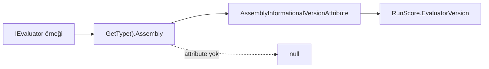

# Faz 176 — Evaluator Sürüm Damgası

> **Durum:** 📋 Planlandı (2026-09-15)
> **Plan onayı:** onaylanmadı — uygulama başlamaz
> **Kaynak:** [ADAYLAR.md](ADAYLAR.md) · **F-218**
> **Önkoşul:** [Faz 155](arsiv/fazlar/155-KALIBRE-EDILMIS-EVALUATOR-KATALOGU.md) — `IEvaluator` → `IRunJudge` köprüsünü o faz kurdu; damga onun üstüne biner
> **Paketler:** `Tracon.Abstractions`, `Tracon.Core`, `Tracon.PostgreSql`, `Tracon.SqlServer`, `Tracon.Sqlite`
> **Yeni paket:** Yok · **Migration:** gerekli — **üç set** (PostgreSQL + SqlServer + Sqlite); numara uygulama anında alınır
> **Public API:** büyüyor — `RunScore`'a bir alan. Faz 7'den **önce** ucuz, sonra **kırıcı**
> **Tüketici yüzeyi:** `docs-site/src/content/docs/concepts/` skor sayfası · sevk edilen: `RunScore` XML dokümanı
> **Manuel test alanı:** `docs/manuel-test/17-EVAL-VE-DENEYLER.md`

---

## Bu Faza Başlarken

> `faz-baslangic` skill'ini uygula. Aşağıdaki liste o skill'in 2. adımıdır —
> **tamamını değil, yalnız işaret edilen bölümleri oku.**

1. Bu doküman
2. Kararlar — dosyanın tamamını **okuma**, yalnız bu kalemleri grep'le:
   ```bash
   grep -n "K-711\|K-059\|K-178" docs/KARARLAR.md
   ```
   **K-711** (`RunScore.Value` `double?`; `null` = ölçüm yok — bu fazın
   migration emsali), **K-059** (`secret` veritabanına da yazılmaz; kayıtta
   yalnız **adı** durur — damga bir sürüm dizesidir, kimlik bilgisi değildir),
   **K-178** (migration numaraları sağlayıcı başına bağımsızdır)
3. [Faz 155](arsiv/fazlar/155-KALIBRE-EDILMIS-EVALUATOR-KATALOGU.md) — yalnız
   devir notu:
   ```bash
   awk '/## Sonraki Faza Devir Notu/,0' docs/arsiv/fazlar/155-KALIBRE-EDILMIS-EVALUATOR-KATALOGU.md
   ```
   Köprünün sözleşmesini (metrik adı ön eki, `null` = ölçüm yok) oradan devralıyoruz.
4. Alan hafızası (bu faz iki alana dokunuyor):
   [`hafiza/sql-migration.md`](hafiza/sql-migration.md) (üç sağlayıcı
   migration'ı) · [`hafiza/sql-paylasilan-sorgu-uretimi.md`](hafiza/sql-paylasilan-sorgu-uretimi.md)
   (paylaşılan okuyucu ve ordinal tuzağı) · [`hafiza/00-INDEKS.md`](hafiza/00-INDEKS.md)
   üzerinden değerlendirme alanı
5. Gerektiğinde: [`MIMARI.md`](MIMARI.md) veri modeli bölümü

---

## Amaç

`AddEvaluatorJudge` ile bağlanan bir `IEvaluator`'ın puanı
`Microsoft.Extensions.AI.Evaluation.Quality`'nin **prompt'una** bağlıdır ve o
prompt paket sürümüyle değişir. Skor satırı hangi sürümün ürettiğini
kaydetmiyor. Bir paket yükseltmesi
[Faz 153](arsiv/fazlar/153-EVAL-KOSUMLARI-ARASINDA-REGRESYON-FARKI.md)'ün
regresyon taban çizgisini **sessizce** kaydırabilir; fark "model bozuldu" gibi
görünür, oysa yargıcın kendisi değişmiştir.

- **F-218** — `RunScore`'a evaluator sürümünü taşıyan bir alan; `Comment`'e
  sıkıştırmadan, ayrı ve sorgulanabilir bir sütun olarak.

### Bugün ne çalışmıyor — doğrulanmış kanıt

| Kanıt | Gözlem |
|---|---|
| [`RunScore.cs:72`](../src/Tracon.Abstractions/Runs/RunScore.cs#L72) | `Source` (`human` / `api` / `judge:{ad}`) **required**; yargıcın kim olduğunu söylüyor |
| [`RunScore.cs:75`](../src/Tracon.Abstractions/Runs/RunScore.cs#L75) | `Author` bir **kimlik** alanı ("the actor who gave the score") |
| `RunScore.cs` tamamı | Tip **12 alan** taşıyor; **sürüm alanı yok** |
| [`EvaluatorRunJudge.cs:47`](../src/Tracon.Core/Evaluation/EvaluatorRunJudge.cs#L47) | Köprü `IEvaluator`'ı **sarmalamadan** kullanıyor (K3). Sürüm bu tipin `Assembly`'sinden okunabilir |
| 🚨 [`SqlRunScoreStore.cs:124-134`](../src/Tracon.Sql.Shared/Stores/SqlRunScoreStore.cs#L124) | Store **çıplak ordinal** ile okuyor: `reader.GetGuid(0)` … `reader.GetString(10)`. Ortaya sütun eklemek her okuyucuyu **sessizce** kaydırır |
| `grep -rln SqlRunScoreStore src/` | 🚨 Okuyucu **`Tracon.Sql.Shared`'dadır**, sağlayıcı paketinde değil: üç sağlayıcı da onu kullanıyor (`TraconPostgreSqlBuilderExtensions` · `TraconSqlServerBuilderExtensions` · `TraconSqliteBuilderExtensions`). **Bir** okuyucu değişir, **üç** migration yazılır |
| `src/Tracon.PostgreSql/Migrations/0050_voice_session_cost.sql` | Aynı tuzak Faz 161'de belgelenmiş: *"The columns are added at the END of the table on purpose"* |
| Migration sayıları | PostgreSql **49** dosya (son `0050_*`), SqlServer **38** (son `0038_*`), Sqlite **37** (son `0037_*`) — numaralar bağımsız (K-178) |

> Kanıtlar 2026-09-15 tarihinde doğrulandı.

---

## 176.1 — Alanın şekli

**Karar (kullanıcı, 2026-09-15): tek nullable alan.**

```csharp
/// <summary>
/// The version of the component that produced this score, when one is known.
/// </summary>
public string? EvaluatorVersion { get; init; }
```

Gerekçe ve reddedilen alternatifler:

| Seçenek | Neden seçilmedi |
|---|---|
| İki alan (`EvaluatorPackage` + `EvaluatorVersion`) | Paket adı `Source` içinde `judge:{ad}` olarak **zaten** var. İkinci bir ad alanı aynı bilgiyi iki yerde tutar |
| Yapılandırılmış `Provenance` nesnesi | Yeni public tip, JSON sütun, üç sağlayıcıda serileştirme ve AOT maliyeti. Talep kanıtı bunu taşımıyor |
| `Author`'a sıkıştırmak | K-059 sınıfı bir hata: **ad alanı sürüm alanı değildir**. Migration'dan kaçmak için anlam bozmak, kaçılan maliyetten pahalıdır |

`null` **ölçülmedi** demektir, "sürüm 0" değil — K-711'in `Value` için kurduğu
kuralın aynısı. İnsan ve API kaynaklı skorlarda alan her zaman `null`'dır.

## 176.2 — Sürüm nereden gelir

Köprü `IEvaluator`'ı sarmalamadan kullanıyor, bu yüzden sürüm **evaluator'ın
kendi assembly'sinden** okunur. Bu, üçüncü taraf bir `IEvaluator` için de
çalışır — Microsoft'un kataloğuna özel bir yol açılmaz.



Üç kural:

1. **Bir kez çözülür, her satırda değil.** `EvaluatorRunJudge` sürümü kurulumda
   hesaplar ve saklar; her `JudgeAsync` çağrısında yansıma yapmaz.
2. **Çözülemezse `null`.** Attribute yoksa veya okuma hata verirse alan `null`
   kalır ve **skor yine yazılır**. Gözlemlenebilirlik işlevselliği bozmaz.
3. **Yalnız köprü doldurur.** `ModelRunJudge` bu alanı **doldurmaz** — onun
   puanı bir paketin prompt'una değil, yapılandırılan modele bağlıdır ve o
   bilgi başka yerde durur. Kapsam dışı kalması bilerek seçilmiştir.

🚨 **AOT:** `Tracon.Core` AOT-uyumlu kalmalıdır. Assembly attribute okuması
dinamik kod üretmez ve NativeAOT'ta korunur, ama bu **ölçülmeli** — faz bunu
`Tracon.Package.Tests` AOT koşumuyla doğrular.

## 176.3 — Migration: sütun tablonun **sonuna** gider

🚨 Bu fazın tek gerçek tuzağı budur. `SqlRunScoreStore` satırı **çıplak
ordinal** ile okuyor (`reader.GetString(10)`). Ortaya eklenen bir sütun her
okuyucuyu sessizce kaydırır ve test **yeşil kalabilir** — kayma tip uyumlu
olduğu sürece yalnız veriyi bozar.

```sql
-- Sütun tablonun SONUNA eklenir. SqlRunScoreStore çıplak ordinal ile okur;
-- ortaya eklemek her okuyucuyu sessizce kaydırır (0050_voice_session_cost.sql
-- aynı tuzağı Faz 161'de belgeledi).
ALTER TABLE {schema}.run_scores ADD COLUMN IF NOT EXISTS evaluator_version text;
```

Üç set yazılır ve numaralar **bağımsızdır** (K-178). Plan numara **rezerve
etmez**; uygulama anında her sağlayıcının bir sonraki boş numarası alınır.

| Sağlayıcı | Bugünkü son | Uygulama anında alınacak |
|---|---|---|
| PostgreSql | `0050_voice_session_cost.sql` | sıradaki boş |
| SqlServer | `0038_voice_session_cost.sql` | sıradaki boş |
| Sqlite | `0037_voice_session_cost.sql` | sıradaki boş |

## 176.4 — Bu alan Faz 7'den önce ucuzdur

`RunScore` public bir `sealed record`'dur. Bugün alan eklemek **bedavadır**;
Faz 7'den (yayın) sonra eklemek **kırıcıdır**. `PublicAPI.Shipped.txt`
dosyalarının bugün boş olduğu (`wc -l src/*/PublicAPI.Shipped.txt`) uygulama
anında ölçülür ve bu cümle doğrulanır.

---

## Planlanan Public API

> Taslak imzalardır. Gerçekleşen imzalar kapanışta ayrı bir bölüme yazılır.

```csharp
// Tracon.Abstractions/Runs/RunScore.cs
public sealed record RunScore
{
    // … mevcut 12 alan değişmez …

    /// <summary>
    /// The version of the component that produced this score, when one is known.
    /// </summary>
    /// <remarks>
    /// <see langword="null"/> means <strong>no version was resolved</strong> —
    /// a human or API score, or an evaluator whose assembly carries no
    /// informational version. It never means "version zero".
    /// <para>
    /// A bridged evaluator's score depends on that package's prompt, so a
    /// package upgrade can move a regression baseline without the model
    /// changing. This field is what separates the two.
    /// </para>
    /// </remarks>
    public string? EvaluatorVersion { get; init; }
}
```

### HTTP `endpoint`'leri

Yeni uç **yok**. Mevcut skor uçlarının yanıt şeması bir alan büyür; OpenAPI
anlık görüntüsü (`OpenApiSnapshotTests`) bunu yakalar ve güncellenir.

### Arayüz payı

Yok — bu faz arayüze dokunmaz. Skor satırının arayüzde gösterilmesi ayrı bir
karardır ve § *Açık Sorular* 3'tedir.

---

## Planlanan Dosya Listesi

```
src/Tracon.Abstractions/Runs/
└── RunScore.cs                              (değişir — bir alan)

src/Tracon.Core/Evaluation/
└── EvaluatorRunJudge.cs                     (değişir — sürüm çözümü)

src/Tracon.Sql.Shared/
├── Stores/SqlRunScoreStore.cs               (değişir — yeni ordinal SONDA; ÜÇ sağlayıcı da bunu kullanır)
└── Internal/SqlQueriesBase.cs               (değişir — SELECT sütun listesi)

src/Tracon.PostgreSql/Migrations/NNNN_run_score_evaluator_version.sql   (yeni)
src/Tracon.SqlServer/Migrations/NNNN_run_score_evaluator_version.sql    (yeni)
src/Tracon.Sqlite/Migrations/NNNN_run_score_evaluator_version.sql       (yeni)

src/Tracon.Core/Storage/
└── InMemoryRunScoreStore.cs                 (değişir — alanı taşır)

src/Tracon.Testing.Contracts.Xunit/Contracts/
└── RunScoreStoreContract.cs                 (değişir — alanın gidiş-dönüşü)
```

---

## Hata Modları ve Testler

> Seviyeyi plan seçer. Kalıcı şema **depo sınırını** geçer; birim testi bunu
> kanıtlamaz.

| Ne bozulabilir | Seviye | Test |
|---|---|---|
| 🚨 Sütun ortaya eklenir, ordinal okuma kayar, veri sessizce bozulur | Sözleşme (`RunScoreStoreContract`) | Dört koşumda birden: bellek içi + üç SQL |
| Alan yazılıyor ama geri okunmuyor (asimetri) | Sözleşme (`RunScoreStoreContract`) | `Evaluator_version_round_trips` |
| Migration bir sağlayıcıda atlanıyor | Fonksiyonel | `MigrationParityTests` — üç sağlayıcı aynı sütunu taşır |
| Eski satırlar (`NULL`) okunurken patlıyor | Sözleşme | `Legacy_rows_read_back_with_a_null_version` |
| Evaluator assembly'sinde attribute yok → skor **hiç** yazılmıyor | Fonksiyonel | `EvaluatorJudgeTests.Missing_version_does_not_stop_the_score` |
| Sürüm her satırda yansımayla çözülüyor (sıcak yol maliyeti) | Birim | `EvaluatorJudgeTests.Version_is_resolved_once` |
| `ModelRunJudge` yanlışlıkla alanı dolduruyor | Birim | `ModelRunJudgeTests.Does_not_stamp_an_evaluator_version` |
| AOT koşumu assembly attribute okumasında kırılıyor | Paket | `Tracon.Package.Tests` AOT koşumu |
| OpenAPI anlık görüntüsü güncellenmeden kalıyor | Fonksiyonel | `OpenApiSnapshotTests` |
| Başka kiracının skoru görünür hâle geliyor | Sözleşme (`TenantIsolationContract`) | Mevcut kapı; alan eklemek onu gevşetmemeli |

Beş soru: **iptal** → `RunScoreStoreContract` zaten bir iptal case'i taşıyor
(satır 688), alan onu bozmamalı · **eşzamanlılık** → mevcut
`Summary_can_be_read_while_a_score_is_being_written` olgusu korunur ·
**boş/aşırı girdi** → çok uzun sürüm dizesi (sütun sınırı) ·
**başka kiracı** → `TenantIsolationContract` · **alt sistem hatası** →
attribute okuması hata verirse skor yine yazılır.

---

## Manuel Kabul Case'leri

| # | Ön koşul | Adımlar | Beklenen sonuç |
|---|---|---|---|
| 1 | `AddEvaluatorJudge` ile bir evaluator bağlı | Bir `run` koş, skoru oku | `evaluatorVersion` paket sürümünü taşır |
| 2 | İnsan skoru verilir | Arayüzden puan ver, satırı oku | `evaluatorVersion` `null` |
| 3 | `AddModelRunJudge` ile yargıç bağlı | Bir `run` koş | `evaluatorVersion` `null` |
| 4 | Migration öncesi yazılmış skorlar var | Migration koş, eski satırı oku | Satır okunur, alan `null`, hata yok |
| 5 | Üç sağlayıcı da kurulu | Her birinde 1. case'i tekrarla | Üçünde de aynı sonuç |
| 6 | Evaluator sürümü yükseltilir | Yeni bir `run` koş, iki satırı karşılaştır | İki satır **farklı** sürüm taşır; regresyon farkı yorumlanabilir |

---

## Açık Sorular

| # | Soru | Seçenekler | Öneri |
|---|---|---|---|
| 1 | Sütun uzunluk sınırı ne olsun? | A: `text` (sınırsız) · B: `varchar(64)` · C: `RunScoreRules` içinde bir sabit + doğrulama | **C** — `RunScoreRules.MaxTextValueLength` emsali var. Sınırsız bir sütun kalıcı şemada gereksiz risktir; sınır sabiti tek yerde durur |
| 2 | `EvaluatorVersion` skor sorgularında filtrelenebilir olsun mu? | A: hayır, yalnız okunur · B: evet, `RunScoreQuery`'ye alan eklenir | **A** — talep kanıtı yok ve sorgu yüzeyi büyütmek ayrı bir sözleşmedir. Satır okunabildiği için soru bugün de cevaplanabilir |
| 3 | Arayüzde gösterilsin mi? | A: bu fazda değil · B: skor detayında rozet | **A** — bu faz bir kalıcılık fazıdır. Arayüz kararı ayrı ölçülür |
| 4 | `Source` `judge:{ad}` iken alan `null` kalırsa bu bir uyarı mı? | A: hayır, sessiz · B: bir kez `Debug` seviyesinde loglanır | **B** — üçüncü taraf evaluator'ların sürümsüz gelmesi normaldir, ama tamamen sessiz kalmak teşhisi zorlaştırır. `Warning` değil, `Debug` |

---

## Bitiş Ölçütleri (DoD)

- [ ] `RunScore.EvaluatorVersion` üç sağlayıcıda **ve** bellek içi store'da gidiş-dönüş yapıyor
- [ ] 🚨 Sütun üç migration'da da tablonun **sonuna** eklendi; `SqlRunScoreStore` ordinal'i buna göre **sonda**
- [ ] Migration öncesi yazılmış satırlar `null` ile okunuyor; hata yok
- [ ] `AddEvaluatorJudge` ile üretilen skor sürümü taşıyor; `AddModelRunJudge` ile üretilen **taşımıyor**
- [ ] Attribute çözülemediğinde skor **yine yazılıyor**
- [ ] Sürüm çağrı başına değil, kurulumda **bir kez** çözülüyor
- [ ] `PublicAPI.Shipped.txt` boş olduğu ölçüldü ve "bugün eklemek bedava" iddiası doğrulandı
- [ ] AOT koşumu temiz
- [ ] Dört doğrulama kapısı sıfır uyarı verir
- [ ] `samples/Tracon.Api` ile gerçek `run` yapıldı, çıktı belgeye yazıldı
- [ ] `secret` taraması boş döndü
- [ ] Manuel kabul case'leri `docs/manuel-test/17-EVAL-VE-DENEYLER.md` içine eklendi; otomatikleştirilebilenler koşuldu
- [ ] `faz-denetim` koşuldu; 🔴 bulgu kalmadı
- [ ] `docs-site/` güncellendi; `npm run build` + `check-links.mjs` temiz

### Doğrulama komutları

```bash
# Üç sağlayıcıda sözleşme
dotnet test tests/Tracon.PostgreSql.IntegrationTests
dotnet test tests/Tracon.SqlServer.IntegrationTests
dotnet test tests/Tracon.Sqlite.IntegrationTests

# Public API yüzeyi bugün gerçekten boş mu
wc -l src/*/PublicAPI.Shipped.txt

# Skor satırını gör
curl -s http://localhost:5081/tracon/api/runs/{runId}/scores | jq '.[].evaluatorVersion'
```

---

## Riskler

| Risk | Önlem |
|------|-------|
| 🚨 Ordinal kayması — sütun ortaya eklenirse veri **sessizce** bozulur ve test yeşil kalabilir | Sütun **sonda**; sözleşme testi gidiş-dönüşü dört koşumda birden kanıtlar; migration dosyası tuzağı yorumla taşır |
| Kalıcı şemaya alan eklemek geri dönüşü pahalıdır | Faz 7'den önce yapılıyor; `PublicAPI.Shipped.txt`'nin boş olduğu DoD'de ölçülüyor |
| Talep kanıtı tek bir risk satırı — kanıtsız şema büyütmek | Alan **nullable** ve additive; hiçbir tüketiciyi bugün etkilemiyor. Yanlış çıkarsa maliyeti bir sütundur, bir sözleşme değil |
| Üç migration'dan biri atlanır | `MigrationParityTests` DoD'de |
| Yansıma AOT'u kırar | `Tracon.Package.Tests` AOT koşumu DoD'de; kırılırsa alan `null` kalır ve **skor yine yazılır** |
| `Author`'a sıkıştırma cazibesi geri gelir | §176.1 tablosu gerekçeyi taşıyor: ad alanı sürüm alanı değildir |

---

<!-- ============================================================
     AŞAĞISI KAPANIŞTA DOLDURULUR — `faz-tamamlama` skill'i.
     Plan anında boş kalır. Başlıkları SİLME.
     ============================================================ -->

## Plandan Sapmalar

> Kapanışta doldurulur.

## Bu Fazda Verilen Kararlar

> Kapanışta doldurulur. K-NNN numaraları burada alınır; plan numara rezerve etmez.

## Gerçekleşen Public API

> Kapanışta doldurulur.

## Dosya Listesi (gerçekleşen)

> Kapanışta doldurulur.

## Süreç Ölçümü

> Kapanışta doldurulur. **Tablo olarak** — onay kutusu DEĞİL.

| Metrik | Değer |
|---|---|
| Plan revizyonu sayısı | |
| Düzeltme turu sayısı | |
| 🔴 bulgu: gerçek / gürültü / araştırılacak | |
| Fazın ürettiği regresyon | |
| Faz kapandıktan sonra bulunan kusur | |

## Denetim Bulguları

> Kapanışta doldurulur — `faz-denetim` çıktısı.

## Sonraki Faza Devir Notu

> Kapanışta doldurulur.
