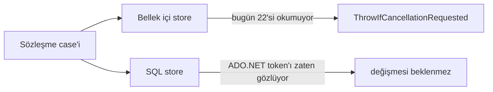

# Faz 177 — Store İptal Sözleşmesi

> **Durum:** 📋 Planlandı (2026-09-15)
> **Plan onayı:** onaylanmadı — uygulama başlamaz
> **Kaynak:** [ADAYLAR.md](ADAYLAR.md) · **F-213**
> **Önkoşul:** [Faz 152](arsiv/fazlar/152-SKORUN-ADI-VE-SEKLI.md) — case'i bilerek dışarıda bıraktı; gerekçesi o fazın "Plandan Sapmalar" sapma 3'tedir
> **Paketler:** `Tracon.Testing.Contracts.Xunit`, `Tracon.Core`, (üç SQL sağlayıcısı doğrulanır, değişmesi beklenmez)
> **Yeni paket:** Yok · **Migration:** Yok
> **Public API:** büyüyor — sevk edilen **sözleşme** büyür. Faz 7'den **önce** ucuz, sonra **kırıcı**
> **Tüketici yüzeyi:** `docs-site/src/content/docs/` store uygulama rehberi · sevk edilen: sözleşme sınıflarının XML dokümanı
> **Manuel test alanı:** `docs/manuel-test/21-DAYANIKLILIK-VE-IPTAL.md`

---

## Bu Faza Başlarken

> `faz-baslangic` skill'ini uygula. Aşağıdaki liste o skill'in 2. adımıdır —
> **tamamını değil, yalnız işaret edilen bölümleri oku.**

1. Bu doküman
2. Kararlar — dosyanın tamamını **okuma**, yalnız bu kalemleri grep'le:
   ```bash
   grep -n "K-421\|K-483" docs/KARARLAR.md
   ```
   **K-421** (public API takibi açık ama `PublicAPI.Shipped.txt` **boş** —
   yüzey büyüten kalem Faz 7'den önce ucuzdur), **K-483** (elle tekrarlanan
   ifade bir kusur **sınıfı** üretir — 56 case elle yazılırsa bu kural devreye
   girer, §177.3)
3. [Faz 152](arsiv/fazlar/152-SKORUN-ADI-VE-SEKLI.md) — yalnız "Plandan
   Sapmalar" sapma 3:
   ```bash
   awk '/## Plandan Sapmalar/,/## Bu Fazda/' docs/arsiv/fazlar/152-SKORUN-ADI-VE-SEKLI.md
   ```
   Case'in **neden** dışarıda bırakıldığını bilmeden aynı gerekçe tekrar üretilir.
4. Alan hafızası (bu faz iki alana dokunuyor):
   [`hafiza/sql-saglayicilari.md`](hafiza/sql-saglayicilari.md) (sağlayıcı
   davranış farkları) · [`hafiza/test-altyapisi.md`](hafiza/test-altyapisi.md)
   (sözleşme paketinin koşum yolu) ·
   [`ortak/test-seviyeleri.md`](../.agents/ortak/test-seviyeleri.md) (sözleşme
   seviyesi tanımı)
5. Gerektiğinde: [`RunScoreStoreContract.cs:682-691`](../src/Tracon.Testing.Contracts.Xunit/Contracts/RunScoreStoreContract.cs#L682)
   — emsalin tamamı **on satırdır**

---

## Amaç

Bir tüketici `UpsertAsync(score, alreadyCancelledToken)` çağırdığında ne
olacağını sözleşmeden öğrenemiyor. SQL store'lar token'ı ADO.NET üzerinden
doğal olarak gözlüyor; bellek içi store'ların **22'si** token'ı hiç okumuyor.

Bugünkü durum tekdüze sessizlikten **daha kötüdür**: 28 store sözleşmesinden
**2'si** iptal davranışını vaat ediyor, 26'sı susuyor. Sözleşmeleri okuyan bir
tüketici keyfî bir bölünme görüyor ve hangi tarafın kural olduğunu bilemiyor.

- **F-213** — İptal davranışını store sözleşmelerine yazmak ve bellek içi
  uygulamaları ona hizalamak.

### Bugün ne çalışmıyor — doğrulanmış kanıt

| Kanıt | Gözlem |
|---|---|
| `src/Tracon.Testing.Contracts.Xunit/Contracts/*StoreContract.cs` | **28** store sözleşmesi var (toplam sözleşme sınıfı 32) |
| [`RunScoreStoreContract.cs:682`](../src/Tracon.Testing.Contracts.Xunit/Contracts/RunScoreStoreContract.cs#L682) | `Canceled_token_throws()` — `SummarizeAsync` üzerinde, on satır |
| [`EvalStoreContract.cs:583`](../src/Tracon.Testing.Contracts.Xunit/Contracts/EvalStoreContract.cs#L583) | Aynı desen, `DiffRunsAsync` üzerinde |
| Kalan 26 store sözleşmesi | `OperationCanceledException` **hiç geçmiyor** |
| `find src/Tracon.Core -name 'InMemory*Store.cs'` | **24** bellek içi store; yalnız `InMemoryRunScoreStore` ve `InMemoryEvalStore` token'ı okuyor — **tam olarak sözleşmesi case taşıyan ikisi** |

> Kanıtlar 2026-09-15 tarihinde doğrulandı.
>
> 🚨 **ADAYLAR.md'nin merkezî iddiası yanlıştı.** Kayıt *"29 sözleşme sınıfı
> var ve **hiçbiri** iptal case'i taşımıyor"* diyordu. İkisi de yanlış: sayı
> 28 (store sözleşmesi; toplam 32) ve **ikisi taşıyor**. Kalemin gerekçesi bu
> yüzden **değişti** — artık "boşluk var" değil, "**bölünme var**"dır. Deseni
> sıfırdan tasarlamaya gerek yok; repoda zaten iki emsali var.

---

## 177.1 — Sözleşmenin vaadi

**Karar (kullanıcı, 2026-09-15): 28 store sözleşmesinin tamamı hizalanır; her
store'da bir okuma ve bir yazma metodu kapsanır.**

Vaat, iki emsalin bugün yaptığının aynısıdır:

> Zaten iptal edilmiş bir token ile çağrılan bir store metodu
> `OperationCanceledException` fırlatır ve **hiçbir yan etki bırakmaz**.

İki sınır bilerek dışarıda:

| Dışarıda kalan | Neden |
|---|---|
| Çağrı **ortasında** iptal | Yarış içerir; deterministik bir sözleşme case'i yazılamaz. Emsallerin ikisi de yalnız **önceden** iptal edilmiş token'ı sınıyor |
| Store başına **her** metot | Onay yorgunluğunun sözleşme karşılığı. Her store'da bir okuma + bir yazma, sözleşmeyi kanıtlamaya yeter; kalanı uygulama detayıdır |

## 177.2 — Yazma tarafının ek yükümlülüğü

Okuma tarafı basittir: fırlat, hiçbir şey döndürme. Yazma tarafı bir soru
daha sorar — **yarım yazma olabilir mi?**

Vaat: iptal edilmiş token ile çağrılan bir yazma metodu **hiçbir satır
yazmaz**. Sözleşme bunu yalnız fırlatmayı doğrulayarak değil, **arkasından
okuyarak** kanıtlar.

```csharp
[Fact]
public async Task Canceled_token_writes_nothing()
{
    using var source = new CancellationTokenSource();
    await source.CancelAsync();

    await Should.ThrowAsync<OperationCanceledException>(async () =>
        await Store.UpsertAsync(Sample(), source.Token));

    // Fırlatmak yetmez: yan etki bırakmadığı OKUNARAK kanıtlanır.
    (await Store.GetAsync(SampleId())).ShouldBeNull();
}
```

Bu, fazın gerçek değeridir. Yalnız `ThrowIfCancellationRequested` eklemek
"fırlattı" der; yan etkisizliği kanıtlamaz.

## 177.3 — 56 case elle yazılmaz

28 sözleşme × 2 case = **56 case**. K-483 açıktır: elle tekrarlanan ifade bir
kusur **sınıfı** üretir. Emsal on satırdır ve 56 kez kopyalanırsa 56 kez
kayabilir.

Çözüm: ortak davranış sözleşme **taban sınıfına** iner; her store yalnız
**kendi bağlamını** bildirir.

```csharp
// Tracon.Testing.Contracts.Xunit/Contracts/CancellationContract.cs
public abstract class StoreCancellationContract<TStore> : TenantIsolationContract<TStore>
{
    /// <summary>A read that must observe an already-cancelled token.</summary>
    protected abstract ValueTask ReadAsync(CancellationToken cancellationToken);

    /// <summary>A write that must observe the token and leave no trace.</summary>
    protected abstract ValueTask WriteAsync(CancellationToken cancellationToken);

    /// <summary>Whether <see cref="WriteAsync"/> left anything behind.</summary>
    protected abstract ValueTask<bool> WroteAnythingAsync();

    [Fact] public async Task Canceled_token_throws_on_read() { … }
    [Fact] public async Task Canceled_token_throws_on_write() { … }
    [Fact] public async Task Canceled_token_writes_nothing() { … }
}
```

Her store sözleşmesi üç küçük metot yazar; case gövdeleri **tek yerde** durur.

🚨 Mevcut iki emsal (`RunScoreStoreContract`, `EvalStoreContract`) bu tabana
**taşınır**, yanına eklenmez. İki farklı iptal deseni bırakmak fazın kendi
çözdüğü problemi yeniden üretir.

## 177.4 — Bellek içi uygulamaların hizalanması

22 bellek içi store token'ı hiç okumuyor. Sözleşme onlara bir yükümlülük
getirir.



SQL store'ların davranışı **doğrulanır**, değiştirilmesi beklenmez. Beklenti
kırılırsa o bir bulgudur ve fazın içinde çözülür.

🚨 **Sözleşme sayısı ile store sayısı eşit değildir** (28 sözleşme, 24 bellek
içi store). Bazı sözleşmelerin bellek içi karşılığı başka pakettedir veya
yoktur. Fazın **1. adımı** bu eşlemeyi çıkarmaktır; karşılıksız sözleşme
bulunursa nasıl koşulacağı orada karara bağlanır.

## 177.5 — Bu sözleşme Faz 7'den önce ucuzdur

Sözleşmeyi genişletmek **sevk edilen bir söz vermektir**. Üçüncü taraf bir
`IRunStore` uygulaması bugün bu case'leri koşmuyor; yarın koşacak.

Faz 7 (yayın) **kapanmadı** ve `PublicAPI.Shipped.txt` dosyaları **boş**
(K-421). Bugün bu genişletme bedavadır; yayından sonra **kırıcıdır**.
ADAYLAR'ın "talep kanıtı yok" karşı görüşü geçerliliğini koruyor — ama aynı
kayıt tersini de söylüyor: *"1.0 öncesi bedava olması ise tersini söylüyor;
yayından sonra bu genişletme kırıcıdır."* Bu fazın zamanlaması o cümleye
dayanıyor.

---

## Planlanan Public API

> Taslak imzalardır. Gerçekleşen imzalar kapanışta ayrı bir bölüme yazılır.

```csharp
// Tracon.Testing.Contracts.Xunit
namespace Tracon.Testing.Contracts.Storage;

/// <summary>
/// Behavior every store contract shares for an already-cancelled token.
/// </summary>
/// <remarks>
/// A store that is handed a token which is already cancelled throws
/// <see cref="OperationCanceledException"/> and leaves no trace. Cancellation
/// <em>during</em> a call is deliberately outside this contract: it races, so
/// no deterministic case can assert it.
/// </remarks>
public abstract class StoreCancellationContract<TStore> : TenantIsolationContract<TStore>
{
    protected abstract ValueTask ReadAsync(CancellationToken cancellationToken);
    protected abstract ValueTask WriteAsync(CancellationToken cancellationToken);
    protected abstract ValueTask<bool> WroteAnythingAsync();
}
```

### HTTP `endpoint`'leri

Yok.

### Arayüz payı

Yok.

---

## Planlanan Dosya Listesi

```
src/Tracon.Testing.Contracts.Xunit/Contracts/
├── StoreCancellationContract.cs      (yeni — ortak case gövdeleri)
├── RunScoreStoreContract.cs          (değişir — emsal tabana TAŞINIR)
├── EvalStoreContract.cs              (değişir — emsal tabana TAŞINIR)
└── <26 sözleşme daha>                (değişir — üç küçük metot)

src/Tracon.Core/**/InMemory*Store.cs  (22 dosya değişir — token okuma)
```

---

## Hata Modları ve Testler

> Bu fazın **çıktısı** bir test seviyesidir. Sözleşme testi dört koşumda
> birden koşar: bellek içi + üç SQL sağlayıcısı.

| Ne bozulabilir | Seviye | Test |
|---|---|---|
| Bellek içi store token'ı yok sayıyor | Sözleşme | `StoreCancellationContract.Canceled_token_throws_on_read` |
| Yazma fırlatıyor ama **yarım satır bırakıyor** | Sözleşme | `Canceled_token_writes_nothing` |
| SQL store beklenenden farklı bir istisna fırlatıyor | Sözleşme | Aynı case, üç sağlayıcı koşumunda |
| `ThrowIfCancellationRequested` yanlış yere konuyor — iş yapıldıktan **sonra** | Sözleşme | `Canceled_token_writes_nothing` yakalar (fırlatma testi yakalamaz) |
| İki farklı iptal deseni yan yana kalıyor | Denetim | `faz-denetim` §177.3 taşıma kuralına karşı okur |
| Sözleşme genişlemesi mevcut bir kiracı case'ini gevşetiyor | Sözleşme (`TenantIsolationContract`) | Mevcut kapı korunur |
| Karşılıksız sözleşme sessizce atlanıyor | Fonksiyonel | 1. adımın eşleme tablosu DoD'de |
| `ValueTask` dönen yolda `ConfigureAwait(false)` unutuluyor | Derleme/analyzer | `.editorconfig` kapısı zaten var |

Beş soru: **iptal** → fazın konusu · **eşzamanlılık** → kapsam dışı (§177.1,
yarış) · **boş/aşırı girdi** → boş store üzerinde iptal · **başka kiracı** →
`TenantIsolationContract` korunur · **alt sistem hatası** → SQL bağlantısı
kapalıyken iptal önceliği (hangi istisna kazanır — § *Açık Sorular* 2).

---

## Manuel Kabul Case'leri

| # | Ön koşul | Adımlar | Beklenen sonuç |
|---|---|---|---|
| 1 | Bellek içi kurulum | Sözleşme paketini koş | 28 store için iptal case'leri geçer |
| 2 | PostgreSQL kurulumu | Aynı sözleşme | Aynı sonuç |
| 3 | SQL Server kurulumu | Aynı sözleşme | Aynı sonuç |
| 4 | SQLite kurulumu | Aynı sözleşme | Aynı sonuç |
| 5 | Üçüncü taraf bir `IRunStore` taslağı | Sözleşmeyi ona karşı koş | Token'ı okumayan uygulama **düşer** — sözleşmenin sevk edilen değeri budur |

---

## Açık Sorular

| # | Soru | Seçenekler | Öneri |
|---|---|---|---|
| 1 | 1. adımda karşılıksız bir sözleşme bulunursa ne olur? | A: o sözleşme case'siz kalır ve gerekçesi yazılır · B: sahte bir bellek içi uygulama yazılır · C: sözleşme kapsamdan düşer | **A** — sahte uygulama yazmak test tiyatrosudur. Gerekçeli boşluk, sessiz boşluktan iyidir |
| 2 | Bağlantı kapalıyken iptal edilmiş token verilirse hangi istisna kazanmalı? | A: `OperationCanceledException` (iptal önce denetlenir) · B: sağlayıcının kendi istisnası | **A** — iptal bir **ön koşuldur**; işi hiç başlatmamak sözleşmenin vaadidir. Bu ayrıca uygulamalar arası tekdüzeliği garantiler |
| 3 | `IAsyncEnumerable` dönen okuma metotları (`ReadEventsAsync`) nasıl kapsanır? | A: bu fazda kapsam dışı · B: ilk `MoveNextAsync` fırlatmalı | **B** — ama ölçülmeli: akış sınırı geçtiği için davranışı bugün ne olduğu 1. adımda ölçülür. Ölçüm negatifse A'ya düşer |
| 4 | 22 bellek içi store'da `ThrowIfCancellationRequested` nereye konur? | A: her public metodun ilk satırı · B: ortak bir yardımcı | **A** — bellek içi store'lar küçüktür ve ortak yardımcı bir dolaylılık katmanıdır. Tek satır okunur kalır |

---

## Bitiş Ölçütleri (DoD)

- [ ] 28 store sözleşmesinin **tamamı** `StoreCancellationContract` üzerinden iptal case'i taşıyor (veya taşımıyorsa gerekçesi bu dokümanda yazılı)
- [ ] Mevcut iki emsal ortak tabana **taşındı**; repoda tek bir iptal deseni kaldı
- [ ] Yazma case'i yan etkisizliği **okuyarak** kanıtlıyor — yalnız fırlatmayı değil
- [ ] Sözleşme dört koşumda da geçiyor: bellek içi + PostgreSQL + SQL Server + SQLite
- [ ] Sözleşme ile bellek içi store eşleme tablosu çıkarıldı ve dokümana yazıldı
- [ ] `PublicAPI.Shipped.txt` boş olduğu ölçüldü; "bugün ucuz" iddiası doğrulandı
- [ ] Dört doğrulama kapısı sıfır uyarı verir
- [ ] `samples/Tracon.Api` ile gerçek `run` yapıldı, çıktı belgeye yazıldı
- [ ] `secret` taraması boş döndü
- [ ] Manuel kabul case'leri `docs/manuel-test/21-DAYANIKLILIK-VE-IPTAL.md` içine eklendi; otomatikleştirilebilenler koşuldu
- [ ] `faz-denetim` koşuldu; 🔴 bulgu kalmadı
- [ ] `docs-site/` güncellendi; `npm run build` + `check-links.mjs` temiz

### Doğrulama komutları

```bash
# Dört koşum
dotnet test tests/Tracon.Testing.Contracts.Xunit.UnitTests
dotnet test tests/Tracon.PostgreSql.IntegrationTests
dotnet test tests/Tracon.SqlServer.IntegrationTests
dotnet test tests/Tracon.Sqlite.IntegrationTests

# Tek desen kaldı mı — ortak taban dışında ham case kalmamalı
grep -rn "OperationCanceledException" src/Tracon.Testing.Contracts.Xunit/Contracts/ \
  | grep -v StoreCancellationContract.cs
```

---

## Riskler

| Risk | Önlem |
|------|-------|
| Sözleşmeyi genişletmek sevk edilen bir sözdür; üçüncü taraf uygulamalara yük biner | Faz 7 kapanmadan yapılıyor; `PublicAPI.Shipped.txt` boş olduğu DoD'de ölçülüyor. Yayından sonra aynı iş **kırıcı** olurdu |
| Talep kanıtı **yok** — kanıtsız sözleşme genişletmesi | Kapsam iki emsalin **zaten vaat ettiğini** tekdüze kılıyor; yeni bir vaat icat etmiyor. Bölünmeyi sürdürmek de bir maliyettir |
| 56 case elle kopyalanır ve kayar (K-483) | §177.3: gövdeler ortak tabanda, store'lar yalnız bağlam bildirir. DoD "tek desen kaldı" kontrolünü taşıyor |
| `ThrowIfCancellationRequested` iş yapıldıktan sonra konur — test yeşil, vaat yalan | Yazma case'i yan etkisizliği **okuyarak** kanıtlar; fırlatma testi bunu yakalayamaz |
| SQL store'ların "zaten gözlüyor" varsayımı yanlış çıkar | Varsayım **doğrulanır**, kabul edilmez. Kırılırsa faz içinde çözülür |
| Akış dönen metotlar (`IAsyncEnumerable`) sessizce kapsam dışı kalır | Açık Soru 3 ölçümü fazın 1. adımındadır; sonucu dokümana yazılır |

---

<!-- ============================================================
     AŞAĞISI KAPANIŞTA DOLDURULUR — `faz-tamamlama` skill'i.
     Plan anında boş kalır. Başlıkları SİLME.
     ============================================================ -->

## Plandan Sapmalar

> Kapanışta doldurulur.

## Bu Fazda Verilen Kararlar

> Kapanışta doldurulur. K-NNN numaraları burada alınır; plan numara rezerve etmez.

## Gerçekleşen Public API

> Kapanışta doldurulur.

## Dosya Listesi (gerçekleşen)

> Kapanışta doldurulur.

## Süreç Ölçümü

> Kapanışta doldurulur. **Tablo olarak** — onay kutusu DEĞİL.

| Metrik | Değer |
|---|---|
| Plan revizyonu sayısı | |
| Düzeltme turu sayısı | |
| 🔴 bulgu: gerçek / gürültü / araştırılacak | |
| Fazın ürettiği regresyon | |
| Faz kapandıktan sonra bulunan kusur | |

## Denetim Bulguları

> Kapanışta doldurulur — `faz-denetim` çıktısı.

## Sonraki Faza Devir Notu

> Kapanışta doldurulur.
