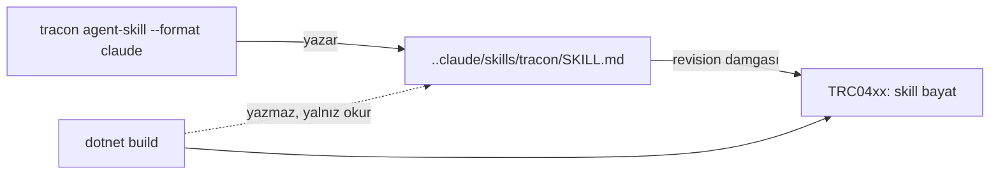

# Faz 178 — Tüketici Kapı Skill'i

> **Durum:** 📋 Planlandı (2026-09-15)
> **Plan onayı:** onaylanmadı — uygulama başlamaz
> **Kaynak:** [ADAYLAR.md](ADAYLAR.md) · **F-232**
> **Önkoşul:** [Faz 73](arsiv/fazlar/73-TUKETICI-AGENT-DESTEGI.md) (bilgi kanalı: harita, `AGENTS.md`, yerel referans) · [Faz 167](arsiv/fazlar/167-AGENT-ZORLAMA-KATMANI.md) (zorlama kanalı: `TRC0*` diagnostic'leri **ve** § 167.3 ölçüm emsali)
> **Paketler:** `Tracon.Cli`, `Tracon.Generators`
> **Yeni paket:** Yok · **Migration:** Yok
> **Public API:** büyüyor — yalnız **CLI yüzeyinde**; `src/` çekirdeğine dokunulmaz
> **Tüketici yüzeyi:** `docs-site/src/content/docs/guides/coding-agent-support.md` · sevk edilen: yeni CLI komutu, yeni `TRC04xx` diagnostic metni
> **Manuel test alanı:** `docs/manuel-test/29-AGENT-DESTEGI.md`

---

## Bu Faza Başlarken

> `faz-baslangic` skill'ini uygula. Aşağıdaki liste o skill'in 2. adımıdır —
> **tamamını değil, yalnız işaret edilen bölümleri oku.**

1. Bu doküman
2. Kararlar — dosyanın tamamını **okuma**, yalnız bu kalemleri grep'le:
   ```bash
   grep -n "K-761\|K-008" docs/KARARLAR.md
   ```
   **K-761** (`.claude/settings.json` `deny` bloğu bir **korkuluktur**, güvenlik
   sınırı değildir — üretilen skill de aynı sınıftadır ve metni bunu söylemeli),
   **K-008** (ön sürüm MAF paketi yalnız `Tracon.AspNetCore` içinde)
3. [Faz 167](arsiv/fazlar/167-AGENT-ZORLAMA-KATMANI.md) — yalnız **§ 167.3**
   ve devir notu:
   ```bash
   awk '/167\.3/,/^## /' docs/arsiv/fazlar/167-AGENT-ZORLAMA-KATMANI.md
   awk '/## Sonraki Faza Devir Notu/,0' docs/arsiv/fazlar/167-AGENT-ZORLAMA-KATMANI.md
   ```
   🚨 § 167.3 bu fazın **1. adımının şablonudur**: izole geçici projede ölç ve
   **ayırt edici** bir kontrol koşumu taşı.
4. Alan hafızası (bu faz iki alana dokunuyor):
   [`hafiza/dokumantasyon.md`](hafiza/dokumantasyon.md) (üretilen metin ve
   bütçe) · [`hafiza/00-INDEKS.md`](hafiza/00-INDEKS.md) üzerinden üreteç alanı
5. Gerektiğinde: [`Tracon.Core.targets`](../src/Tracon.Core/buildTransitive/Tracon.Core.targets)
   satır 79-135 (bugünkü yazma yolu ve "asla üzerine yazma" sözleşmesi)

---

## Amaç

Tracon bugün bir coding agent'a iki kanal veriyor:

| Kanal | Nasıl | Ne zaman konuşur |
|---|---|---|
| **Bilgi** | `Tracon.AgentMap.md` → `AGENTS.md`, `Tracon.LocalReference.md`, `llms.txt` | Okunmayı **bekler** |
| **Zorlama** | Dokuz `TRC0*` usage diagnostic | Kod **yazıldıktan sonra** |

İkisi de geç konuşur. Diagnostic agent'ın retry loop'unu yazmasını,
derlemesini, uyarıyı görmesini ve silmesini bekler. Eksik olan üçüncü kanal
**prosedürdür**: *"Tracon yüzeyine dokunan kod yazmadan önce şunu şu sırayla
yap."* Skill formatı tam olarak bunu taşır — tetikleyicisi olan bir iş akışıdır.

- **F-232** — `tracon` global tool'una, tüketicinin reposuna tek bir kapı
  skill'i yazan bir komut; bayatlığını raporlayan bir usage diagnostic.

### Bugün ne çalışmıyor — doğrulanmış kanıt

| Kanıt | Gözlem |
|---|---|
| `src/Tracon.Core/buildTransitive/Tracon.AgentMap.md` | Harita üretiliyor, **10 583 B** ve damgalı: `revision: 46aeb54b` |
| [`UsageDiagnostics.cs`](../src/Tracon.Generators/UsageDiagnostics.cs) | Dokuz diagnostic: `TRC0101` · `0102` · `0201` · `0301` · `0302` · `0401` · `0402` · `0501` · `0502` |
| [`UsageDiagnostics.cs:93`](../src/Tracon.Generators/UsageDiagnostics.cs#L93) | `TRC0401` **birebir emsal**: harita revizyonunu karşılaştırır, bayatsa uyarır. Açıklaması bu fazın yazma sözleşmesini de söylüyor: *"It is never overwritten in place, because it may carry hand-written notes"* |
| [`Tracon.Core.targets:97`](../src/Tracon.Core/buildTransitive/Tracon.Core.targets#L97) | `AGENTS.md` yalnız **yokken** yazılıyor |
| `src/Tracon.Cli/Program.cs:27-35` | CLI **beş** komut dağıtıyor: `migrate` · `migrate status` · `state-check` · `health` · `eval` |
| `src/Tracon.Cli/Commands/HealthCommand.cs` | Komut deseni: `internal static class` + `RunAsync(IReadOnlyList<string>, CancellationToken)` |
| `MigrateCommand` | Bugünkü beş komuttan **yalnız** `migrate` bir şey değiştiriyor — o da veritabanını, çalışma ağacını değil |

> Kanıtlar 2026-09-15 tarihinde doğrulandı.
>
> 🚨 **ADAYLAR.md damgayı bayat yazıyordu:** kayıt `9039142d` diyor, bugünkü
> harita `46aeb54b` taşıyor. Harita yeniden üretilmiş; bu, bayatlama
> mekanizmasının **çalıştığının** da kanıtıdır.

---

## 178.1 — 🚨 1. adım bir ölçümdür, kod değil

**Bu fazın ilk işi kod yazmak değildir.** Ölçülmemiş ve fazın kapsamını
belirleyen soru şudur:

> Üretilen skill, dört harness'ın her birinde gerçekten **yükleniyor ve
> çağrılıyor mu?**

Faz 167 § 167.3 emsali aynen geçerlidir:

1. İzole, **geçici** bir proje kur.
2. Her format için skill'i yaz.
3. **Ayırt edici** bir kontrol koşumu taşı — skill yalnız kendisi yüklendiğinde
   üretilebilecek bir çıktı istesin.
4. Sonucu kaydet.

🚨 **"Hata vermedi" tek başına kanıt değildir.** Tanınmayan bir anahtar
sessizce yok sayılır. Ölçüm ayırt edici olmazsa faz dört formatı da
"çalışıyor" sanarak sevk eder.

**Bir format ölçümü geçemezse kapsamdan DÜŞER.** Kapsam daralması bir
başarısızlık değil, bu adımın **amacıdır**.

| Format | Yol | Ölçüm sonucu |
|---|---|---|
| Claude Code | `.claude/skills/<ad>/SKILL.md` | ölçülmeli |
| Vendor-nötr | `AGENTS.md` eki veya `.agents/` | ölçülmeli |
| Copilot | `.github/` | ölçülmeli |
| Cursor | `.cursor/rules/*.mdc` | ölçülmeli |

## 178.2 — Yazıcı CLI'dır, build değil

**Karar (ADAYLAR, kullanıcı 2026-09-15):** dosyayı `tracon` global tool'u yazar.
Build **yazmaz**, yalnız bayatlığı raporlar.

Gerekçe:

- Skill dizini **çok dosyalıdır** ve commit edilir.
- İçerik **tüketicinin sahibi olduğu** bir şeydir.
- `AGENTS.md`'nin "yalnız yokken yaz" sözleşmesi bir dizin ağacına
  genişletilemez.



## 178.3 — Yazma sözleşmesi: yalnız yokken yaz

**Karar (kullanıcı, 2026-09-15).** Bu, bugünkü `AGENTS.md` ve `TRC0401`
sözleşmesinin aynısıdır; yeni bir davranış sınıfı icat edilmez.

| Durum | Davranış |
|---|---|
| Dosya yok | Yazılır, çıkış kodu 0 |
| Dosya var | **Dokunulmaz**, çıkış kodu 0, ne yapıldığı yazdırılır |
| Dosya var + `--force` | Üzerine yazılır |
| Dosya var + bayat | Build'de `TRC04xx` uyarır; düzeltmeyi **kullanıcı** ister |

🚨 Bu, `tracon` komutunun tüketicinin **çalışma ağacını ilk kez**
değiştirmesidir. Bugünkü beş komuttan yalnız `migrate` bir şey değiştiriyor ve
o da veritabanıdır. Sözleşme bu yüzden karar defterine girer (kapanışta).

## 178.4 — İçerik: tek kapı skill'i

**Kapsam (ADAYLAR, kullanıcı kararı):** içerik **tek** bir kapı skill'idir.

> Tracon yüzeyine dokunan kod yazmadan önce yetenek haritasını ve **kurulu
> sürümün** XML dokümanını oku.

Görev prosedürü seti (agent ekle · tool ekle · run teşhisi · sürüm yükseltme)
kapsam **dışıdır**.

İki içerik kuralı:

1. **Tek kanonik metin, N ince emitter.** Metin bir yerde durur; her format
   onu kendi kabuğuna sarar. Dört ayrı metin dört ayrı bayatlama demektir.
2. **Metin bir korkuluk olduğunu söyler.** K-761'in dersi: sınırını yazmayan
   bir yönlendirme yanlış güven üretir. Skill "bunu oku" der, "bu her şeyi
   kapsar" demez.

Üretilen dosya harita damgasını taşır:

```markdown
<!-- Tracon gate skill · revision: 46aeb54b · written by `tracon agent-skill` -->
```

## 178.5 — Bayatlama: mekanizma hazır

`TRC0401` deseni birebir tekrarlanır. Build üretilen skill'i `AdditionalFiles`
olarak görür, damgasını okur, kurulu sürümün revizyonuyla karşılaştırır.

Yeni diagnostic: **`TRC0403` — kapı skill'i bayat.** (Numara uygulama anında
doğrulanır; `0402` kullanımdadır.)

Metin `TRC0401`'in sözleşmesini izler: *dosya silinerek tazelenir; asla yerinde
üzerine yazılmaz.*

---

## Planlanan Public API

> Taslak imzalardır. Gerçekleşen imzalar kapanışta ayrı bir bölüme yazılır.

### CLI yüzeyi

```
tracon agent-skill [--format <claude|agents|github|cursor|all>]
                   [--output <dizin>]
                   [--force]
                   [--json]
```

| Seçenek | Varsayılan | Ne yapar |
|---|---|---|
| `--format` | `all` (ölçümü geçen formatlar) | Hangi format(lar) yazılacak |
| `--output` | çalışma dizini | Repo kökü |
| `--force` | kapalı | Var olan dosyanın üzerine yaz |
| `--json` | kapalı | Ne yazıldığını makine okunur bildir |

```csharp
// src/Tracon.Cli/Commands/AgentSkillCommand.cs
internal static class AgentSkillCommand
{
    public static Task<int> RunAsync(IReadOnlyList<string> args, CancellationToken cancellationToken);
}
```

### Yeni diagnostic

```csharp
// src/Tracon.Generators/UsageDiagnostics.cs
public static readonly DiagnosticDescriptor StaleGateSkill = new(
    "TRC0403",
    "The Tracon gate skill is stale",
    "The gate skill was written from capability map revision '{0}', but the installed Tracon ships revision '{1}'. Delete the file and run 'tracon agent-skill' again.",
    Category,
    DiagnosticSeverity.Warning,
    isEnabledByDefault: true,
    description: "The file is refreshed by deleting it and running the command again; it is never overwritten in place, because it may carry hand-written notes.",
    helpLinkUri: $"{HelpBase}coding-agent-support",
    WellKnownDiagnosticTags.CompilationEnd);
```

### HTTP `endpoint`'leri

Yok.

### Arayüz payı

Yok.

---

## Planlanan Dosya Listesi

```
src/Tracon.Cli/
├── Program.cs                        (değişir — altıncı komut)
└── Commands/
    ├── AgentSkillCommand.cs          (yeni)
    └── GateSkillText.cs              (yeni — tek kanonik metin + emitter'lar)

src/Tracon.Generators/
└── UsageDiagnostics.cs               (değişir — TRC0403)

src/Tracon.Core/buildTransitive/
└── Tracon.Core.targets               (değişir — skill dosyası AdditionalFiles)

tests/Tracon.Cli.FunctionalTests/
└── AgentSkillCommandTests.cs         (yeni)

tests/Tracon.Generators.UnitTests/
└── (değişir — TRC0403 olguları)
```

---

## Hata Modları ve Testler

> Seviyeyi plan seçer. Dosya yazan bir komut **paket sınırını** geçer; birim
> testi gerçek tüketici davranışını kanıtlamaz.

| Ne bozulabilir | Seviye | Test |
|---|---|---|
| 🚨 Üretilen skill hiçbir harness'ta çağrılmıyor (ölü ağırlık) | **Ölçüm** (§178.1) | Fazın 1. adımı; izole proje + ayırt edici koşum |
| Var olan dosyanın üzerine yazılıyor — elle yazılmış not kayboluyor | Fonksiyonel | `AgentSkillCommandTests.Existing_file_is_never_touched` |
| `--force` var olan dosyayı yazmıyor | Fonksiyonel | `Force_overwrites` |
| Komut çalışma ağacının **dışına** yazıyor | Fonksiyonel | `Output_stays_within_the_target_directory` |
| Dört emitter ayrışıyor — metinler farklılaşıyor | Birim | `GateSkillTextTests.All_formats_share_one_canonical_text` |
| Damga yazılmıyor → bayatlık hiç raporlanmıyor | Birim | `Written_file_carries_the_map_revision` |
| Bayat skill uyarı vermiyor | Birim (üreteç) | `TRC0403` olguları |
| Kurulu sürüm güncelken yanlış uyarı veriyor | Birim (üreteç) | `Fresh_skill_does_not_warn` |
| Komut var olmayan dizine yazamıyor ve anlaşılmaz hata veriyor | Fonksiyonel | `Missing_directory_is_reported_clearly` |
| İptal edilen komut yarım dosya bırakıyor | Fonksiyonel | `Cancellation_leaves_no_partial_file` |
| Skill tüketicinin agent bağlam bütçesini yiyor | Bütçe | Üretilen metnin bayt sınırı testi |

Beş soru: **iptal** → yarım dosya olgusu · **eşzamanlılık** → aynı anda iki
koşum (son yazan kazanır, yarım dosya kalmaz) · **boş/aşırı girdi** → geçersiz
`--format` · **başka kiracı** → yok · **alt sistem hatası** → salt okunur
dizin.

---

## Manuel Kabul Case'leri

| # | Ön koşul | Adımlar | Beklenen sonuç |
|---|---|---|---|
| 1 | Temiz tüketici reposu | `tracon agent-skill --format claude` | `.claude/skills/tracon/SKILL.md` yazılır, damga taşır |
| 2 | Dosya zaten var, elle düzenlenmiş | Aynı komut | Dosya **değişmez**; komut ne yaptığını söyler; çıkış kodu 0 |
| 3 | Aynı durum | `tracon agent-skill --format claude --force` | Üzerine yazılır |
| 4 | Skill eski revizyon damgası taşıyor | `dotnet build` | `TRC0403` uyarısı görünür |
| 5 | Skill güncel | `dotnet build` | Uyarı **yok** |
| 6 | 👤 insan gerekir | Claude Code'da skill'i çağır | Skill yükleniyor ve kapı metni uygulanıyor |
| 7 | 👤 insan gerekir | Aynısını Cursor / Copilot'ta dene | Ölçüm sonucu §178.1 tablosuna yazılır |

---

## Açık Sorular

| # | Soru | Seçenekler | Öneri |
|---|---|---|---|
| 1 | Komut adı ne olsun? | A: `tracon agent-skill` · B: `tracon skill` · C: `tracon init-agent` | **A** — `tracon skill` Tracon'un kendi agent skill'leriyle (Faz 10) karışır; bu ikisi farklı şeylerdir |
| 2 | Ölçümü **hiçbir** format geçemezse ne olur? | A: faz kapanır, bulgu kaydedilir, kod sevk edilmez · B: yine de Claude formatı sevk edilir | **A** — çağrılmayan skill ölü ağırlıktır ve tüketicinin bağlam bütçesini yer. Negatif ölçüm de bir çıktıdır |
| 3 | Üretilen metnin bayt bütçesi ne olsun? | A: haritanın bütçesine bağlansın · B: kendi sabit tavanı olsun | **B** — kapı skill'i haritadan **çok daha kısadır**; haritanın tavanına bağlamak bütçeyi anlamsız kılar |
| 4 | `--output` dışına yazma denemesi nasıl karşılansın? | A: hata, çıkış kodu ≠ 0 · B: sessizce hedefe sınırla | **A** — dosya yazan bir komutta sessiz sınırlama sürpriz üretir (K1) |
| 5 | Vendor-nötr format `AGENTS.md` ekine mi, `.agents/` dizinine mi yazsın? | A: `.agents/` · B: `AGENTS.md` eki | **A** — `AGENTS.md` bugün build tarafından yönetiliyor; iki yazıcının aynı dosyaya dokunması §178.3 sözleşmesini bulanıklaştırır |

---

## Bitiş Ölçütleri (DoD)

- [ ] 🚨 §178.1 ölçümü koşuldu; **her formatın** sonucu (yüklendi / yüklenmedi) bu dokümana yazıldı
- [ ] Ölçümü geçemeyen formatlar kapsamdan **düştü** ve gerekçesi yazıldı
- [ ] `tracon agent-skill` var olan bir dosyaya `--force` olmadan **hiç** dokunmuyor
- [ ] Üretilen dosya harita revizyon damgasını taşıyor
- [ ] Bayat skill `TRC0403` uyarısı üretiyor; güncel skill **üretmiyor**
- [ ] Dört emitter tek kanonik metinden türüyor — test bunu kanıtlıyor
- [ ] Komut hedef dizinin dışına yazamıyor
- [ ] İptal yarım dosya bırakmıyor
- [ ] Üretilen metin bayt bütçesinin altında
- [ ] Dört doğrulama kapısı sıfır uyarı verir
- [ ] `samples/Tracon.Api` ile gerçek `run` yapıldı, çıktı belgeye yazıldı
- [ ] `secret` taraması boş döndü
- [ ] Manuel kabul case'leri `docs/manuel-test/29-AGENT-DESTEGI.md` içine eklendi; otomatikleştirilebilenler koşuldu
- [ ] `faz-denetim` koşuldu; 🔴 bulgu kalmadı
- [ ] `docs-site/` güncellendi; `npm run build` + `check-links.mjs` temiz

### Doğrulama komutları

```bash
# İzole ölçüm (1. adım) — geçici dizinde
mkdir -p /tmp/tracon-skill-olcum && cd /tmp/tracon-skill-olcum
dotnet new tracon-api && tracon agent-skill --format all
# sonra her harness'ta AYIRT EDİCİ kontrol koşumunu çalıştır

# Var olan dosyaya dokunulmuyor mu
tracon agent-skill --format claude
sha256sum .claude/skills/tracon/SKILL.md > /tmp/before
tracon agent-skill --format claude
sha256sum -c /tmp/before      # eşleşmeli

# Bayatlık uyarısı
sed -i.bak 's/revision: [0-9a-f]*/revision: deadbeef/' .claude/skills/tracon/SKILL.md
dotnet build      # TRC0403 vermeli
```

---

## Riskler

| Risk | Önlem |
|------|-------|
| 🚨 Çağrılmayan skill ölü ağırlıktır ve tüketicinin agent bağlam bütçesini yer | §178.1 ölçümü fazın **1. adımıdır**; geçemeyen format düşer. Açık Soru 2: hiçbiri geçmezse kod sevk edilmez |
| Skill formatları vendor'a özgü ve hareketlidir — bugün dört sözleşme, yarın dört bayat dosya | Tek kanonik metin + ince emitter; damga + `TRC0403` bayatlığı raporlar. Bir formatı düşürmek bir emitter silmektir |
| Dosya yazan komut tüketicinin çalışma ağacını **ilk kez** değiştirir | "Yalnız yokken yaz" sözleşmesi (§178.3) bugünkü `AGENTS.md` davranışının aynısıdır; karar defterine kapanışta girer |
| CLI ayrı kurulum ister; benimseme sürtünmesi build hattından yüksek | Kabul edilen maliyet — gerekçesi §178.2. `--json` ile betiklenebilir olması sürtünmeyi azaltır |
| Diagnostic zaten yönlendiriyor; skill'in ek değeri ölçülmemiş | Ölçülen şey **yüklenme**dir, "daha iyi kod" değil. İkincisi bu fazın iddiası değildir ve öyle yazılmaz |
| Skill "her şeyi kapsar" sanılır ve yanlış güven üretir (K-761 sınıfı) | Metin sınırını **kendisi** söyler (§178.4 kural 2) |
| `TRC0403` numarası çakışır | Uygulama anında `UsageDiagnostics.cs` taranır; bugün `0401` ve `0402` kullanımda |

---

<!-- ============================================================
     AŞAĞISI KAPANIŞTA DOLDURULUR — `faz-tamamlama` skill'i.
     Plan anında boş kalır. Başlıkları SİLME.
     ============================================================ -->

## Plandan Sapmalar

> Kapanışta doldurulur.

## Bu Fazda Verilen Kararlar

> Kapanışta doldurulur. K-NNN numaraları burada alınır; plan numara rezerve etmez.

## Gerçekleşen Public API

> Kapanışta doldurulur.

## Dosya Listesi (gerçekleşen)

> Kapanışta doldurulur.

## Süreç Ölçümü

> Kapanışta doldurulur. **Tablo olarak** — onay kutusu DEĞİL.

| Metrik | Değer |
|---|---|
| Plan revizyonu sayısı | |
| Düzeltme turu sayısı | |
| 🔴 bulgu: gerçek / gürültü / araştırılacak | |
| Fazın ürettiği regresyon | |
| Faz kapandıktan sonra bulunan kusur | |

## Denetim Bulguları

> Kapanışta doldurulur — `faz-denetim` çıktısı.

## Sonraki Faza Devir Notu

> Kapanışta doldurulur.
