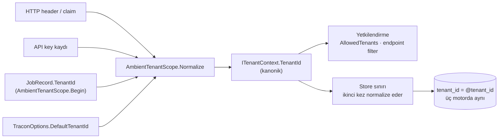

# Faz 179 — Kiracı Kimliğinin Normalleştirilmesi

> **Durum:** ✅ Tamamlandı (2026-09-19)
> **Plan onayı:** farukatasoy, 2026-09-19 (K1 · KG-034)
> **Kaynak:** [YAYIN-HAZIRLIK.md](YAYIN-HAZIRLIK.md) §4 "🔴 1" · §13.0 **A-1**
> **Önkoşul:** Yok — K-639'un kapattığı kardeş vaka (`provider_name`) zaten sevk edildi ve şablon odur
> **Paketler:** `Tracon.Abstractions`, `Tracon.Core`, `Tracon.AspNetCore`, `Tracon.Sql.Shared`, `Tracon.PostgreSql`, `Tracon.SqlServer`, `Tracon.Sqlite`, `Tracon.Testing.Contracts.Xunit`
> **Yeni paket:** Yok · **Migration:** Gerekli — üç sağlayıcı için birer **guard** script'i; numaralar uygulama anında alınır
> **Public API:** Büyüyor (bir statik metot) — `wc -l src/*/PublicAPI.Shipped.txt` ölçüldü: **boş olmayan 0 satır**, yani Faz 7'den önce ucuz
> **Tüketici yüzeyi:** `docs-site/` — kiracı kimliği biçim kuralı bugün **hiçbir sayfada yok** (ölçüldü); `concepts/` altında bir kural bölümü açılır · sevk edilen: `AmbientTenantScope`, `ITenantContext`, `TraconTenancyOptions.AllowedTenants` XML'leri
> **Manuel test alanı:** [`docs/manuel-test/13-KIRACI-VE-GUVENLIK.md`](manuel-test/13-KIRACI-VE-GUVENLIK.md)

---

## Bu Faza Başlarken

> `faz-baslangic` skill'ini uygula. Aşağıdaki liste o skill'in 2. adımıdır —
> **tamamını değil, yalnız işaret edilen bölümleri oku.**

1. Bu doküman
2. Kararlar — dosyanın tamamını **okuma**, yalnız bu kalemleri grep'le:
   ```bash
   grep -n "K-639\|K-382\|K-603\|K-178" docs/KARARLAR.md
   ```
   **K-639** (bu fazın birebir şablonu: `provider_name` karşılaştırıcı değiştirilerek
   değil **değer normalleştirilerek** case-duyarsız yapıldı; kural public, store
   hem yazarken hem sorgularken uygular) · **K-382** (kiracı allowlist reddi
   `HttpTenantContext`'te değil `TraconEndpointFilter`'dadır — bu fazda iki
   yüzeyin **aynı** kanonik değeri karşılaştırdığından emin ol) · **K-603**
   (`PublicAPI.Shipped.txt` boştur, yüzey Faz 7'ye kadar ucuzdur) · **K-178**
   (migration numaraları sağlayıcı başına **bağımsızdır**)
3. Alan hafızası (bu faz üç alana dokunuyor):
   [`hafiza/http-uc-guvenlik-ve-sozlesme.md`](hafiza/http-uc-guvenlik-ve-sozlesme.md)
   (kiracı çözümü ve uç güvenliği) ·
   [`hafiza/sql-migration.md`](hafiza/sql-migration.md) (üç sağlayıcı için
   migration yazımı) ·
   [`hafiza/sql-server-tuzaklari.md`](hafiza/sql-server-tuzaklari.md)
   (🚨 collation — bu fazın ana tuzağı orada yaşıyor)
4. Gerektiğinde, tamamı değil ilgili bölümü:
   [`MIMARI-GUVENLIK.md`](MIMARI-GUVENLIK.md) — kiracı yalıtımı bölümü
5. Emsalin kendisi — **oku, kopyalama**:
   ```bash
   sed -n '19,60p' src/Tracon.Abstractions/Tenancy/TenantProviderBinding.cs
   cat src/Tracon.PostgreSql/Migrations/0038_provider_name_case.sql
   cat src/Tracon.SqlServer/Migrations/0025_provider_name_case.sql
   ```

---

## Amaç

Tracon'un **birincil yalıtım anahtarı** olan kiracı kimliği hiçbir yerde
normalleştirilmiyor. Bu yüzden `acme` ile `Acme`'nin aynı kiracı mı ayrı kiracı
mı olduğu **hangi veritabanını kullandığına** göre değişiyor: SQL Server'ın
varsayılan collation'ı ikisini birleştirirken PostgreSQL ve SQLite ayırıyor.
Yetkilendirme katmanı ise her üçünde de `Ordinal` — yani ayırıyor. Bir kurulumda
yetkilendirme ile depolama **ters** yönde karar veriyor.

Bu faz, K-639'un `provider_name` için kurduğu deseni ürünün birincil kimlik
alanına taşır: **değer** kanonik hâle getirilir, karşılaştırıcı değişmez.
Böylece düz bir `=` yüklemi üç motorda da aynı davranır.

- **A-1** — kiracı kimliği giriş sınırında ve depolama sınırında kanonik
  (invariant küçük harf) forma çevrilir; kural public'tir ve üç sağlayıcı
  kanonik olmayan veriyle karşılaşırsa migration **durur**.

### Bugün ne çalışmıyor — doğrulanmış kanıt

| Kanıt | Gözlem |
|---|---|
| `grep -rn "TenantId" src/ \| grep -iE "ToLower\|Normaliz\|Canonical"` | **0 eşleşme.** Kiracı kimliği hiçbir yerde normalleştirilmiyor |
| [`HttpTenantContext.cs:145`](../src/Tracon.AspNetCore/Tenancy/HttpTenantContext.cs#L145) | Biçim `^[a-zA-Z0-9_.-]+$` — **büyük harf serbest**, uzunluk ≤ 64 |
| [`HttpTenantContext.cs:142`](../src/Tracon.AspNetCore/Tenancy/HttpTenantContext.cs#L142) | `AllowedTenants` üyeliği `StringComparer.Ordinal` ile ölçülüyor |
| [`TraconEndpointFilter.cs:275`](../src/Tracon.AspNetCore/Security/TraconEndpointFilter.cs#L275) | Aynı allowlist ikinci kez, yine `StringComparer.Ordinal` |
| `grep -rn "Ordinal" src/ \| grep -ci tenant` | **116 satır** kiracı kimliğini `Ordinal` karşılaştırıyor — bu, kapatılacak sınıfın boyutudur |
| SQL Server `tenant_id nvarchar(200)` sütunları | **Hiçbirinde `COLLATE` yok** ⇒ sunucu varsayılanı geçerli. Testlerin kullandığı imajda ölçüldü: `SQL_Latin1_General_CP1_CI_AS`; `'acme'` yazılan satır **`'Acme'` sorgusuna döndü** |
| `CREATE TABLE` taraması (PostgreSQL) | **34 tablo** `tenant_id` taşıyor — migration kapsamı budur |
| [`ModelProviderRegistry.cs:287`](../src/Tracon.Core/Models/ModelProviderRegistry.cs#L287) | `if (policy is not null)` — harf durumu kayması politika satırını **ıskalarsa** hiçbir egress kısıtı uygulanmaz |
| [`TenantProviderBinding.cs:53`](../src/Tracon.Abstractions/Tenancy/TenantProviderBinding.cs#L53) | Emsal **sevk edilmiş durumda**: `NormalizeProviderName` public, `ToLowerInvariant()`, store iki yönde de uyguluyor |
| `wc -l src/*/PublicAPI.Shipped.txt` | Boş olmayan **0** satır — public yüzey eklemek bugün ucuz (K-603) |

> Kanıtlar 2026-09-19 tarihinde doğrulandı.

🚨 **Sınıf taramasının sonucu, `tenant_id`'yi neden tek başına ele aldığımızı
söyler:** aynı ayrışma `tool_name`, `agent_name`, `skill_name`/`script_name`
için de vardır, fakat üçü de **fail-closed** yöndedir (grant ıskalanır ⇒ yetki
doğmaz). `provider_name` K-639 ile, API anahtarı hash'i `varbinary(32)` ile
kapalıdır. `tenant_id` bu sınıfın **tek fail-open üyesidir**.

---

## 179.1 — Kanonik form ve kuralın yeri

Kanonik form **invariant küçük harf**tir; emsalle birebir aynıdır.

🚨 `ToLowerInvariant()` kullanılır, `ToLower()` **kullanılmaz**. `tr-TR`
kültüründe `ToLower()` `I` harfini `ı`'ya çevirir; o hâlde aynı kiracı kimliği
sunucunun kültürüne göre iki farklı kanonik değere düşerdi. Emsal de
`ToLowerInvariant()` kullanır.

Kural `AmbientTenantScope` üzerine konur — tip zaten `Tracon.Abstractions`
altında public'tir ve zaten kiracı kimliğinin ambient kaynağıdır. Yeni tip
açılmaz.



Store katmanı kuralı **ikinci kez** uygular. Bu tekrar değil savunma
derinliğidir: `ITenantContext` public bir seam'dir ve kendi implementasyonunu
yazan bir tüketici giriş normalleştirmesini atlayabilir. K-639 de tam olarak
böyle yapılmıştı.

## 179.2 — Giriş sınırı

| Yer | Değişiklik |
|---|---|
| `AmbientTenantScope.Begin` | Değeri normalleştirerek saklar; `Current` kanonik döner |
| `SingleTenantContext` · `FixedTenantContext` | Döndürdükleri değeri normalleştirir |
| `HttpTenantContext.Accept` | Biçim kontrolünden **sonra** normalleştirir; allowlist üyeliğini **kanonik** değerle ölçer ve allowlist girdilerini de normalleştirir |
| `HttpTenantContext.ResolveFromApiKey` | Kayıttan gelen `TenantId`'yi normalleştirir |
| `TraconEndpointFilter.CheckTenancyWhitelist` | Aynı iki tarafı aynı kanonik formla karşılaştırır (K-382: iki yüzey ayrışamaz) |
| `TraconOptionsValidator` | `DefaultTenantId` kanonik değilse **başlangıçta** açık bir mesajla reddeder |

`TraconOptionsValidator`'ın sessizce normalleştirmek yerine reddetmesi
bilinçlidir: yapılandırmada `Acme` yazan operatör, kayıtlarda `acme` görünce
bunun nereden geldiğini bulamaz. Başlangıçta durmak ucuz ve okunur. Varsayılan
değer (`"default"`) zaten kanoniktir, yani mevcut hiçbir kurulum kırılmaz.

🚨 Biçim regex'i **daraltılmaz**; `^[a-zA-Z0-9_.-]+$` kalır. Büyük harf içeren
bir kimlik reddedilmez, **normalleştirilir** — K1 kararı budur.

## 179.3 — Store sınırı

İki aile vardır ve ikisi de ayrı bir tıkaç noktası ister.

**SQL aileleri** (`Tracon.Sql.Shared`, 36 dosya `tenant_id`'ye dokunuyor):
parametre ekleme tek bir yardımcıdan geçirilir. Bugün her çağrı yeri
`DbHelpers.Add(command, "tenant_id", value)` yazıyor; bunun yerine
normalleştiren bir `DbHelpers.AddTenant(command, value)` açılır ve **tüm** çağrı
yerleri ona çevrilir. Tek tıkaç noktası, `grep` ile denetlenebilir bir kapı verir.

**Bellek içi aileler** (`Tracon.Core` altındaki `InMemory*Store`): kiracı
parametresi alan her public metot değeri en üstte normalleştirir. Karşılaştırma
`Ordinal` **kalır** — iki taraf da kanonik olduğunda doğru olan budur.

🚨 Karşılaştırıcıyı `OrdinalIgnoreCase`'e çevirmek **çözüm değildir** ve
emsalin gerekçesi bunu yazar: `=` yüklemi o zaman motorun collation'ına bağlı
kalır, birincil anahtar çift kaydı reddetmeyi bırakır ve index kullanılamaz hâle
gelir.

## 179.4 — Migration: veri değiştirmez, **durur**

Üç sağlayıcı için birer guard script'i yazılır. Script hiçbir satırı
değiştirmez; 34 tablonun herhangi birinde kanonik olmayan bir `tenant_id`
bulursa açık bir mesajla **durur** ve operatörü kendi verisini çözmeye çağırır.

Gerekçe (KG-034 · K1): yayınlanmış paket ve üçüncü taraf veritabanı **yoktur**.
102 tabloda sessiz bir veri birleştirmesi, kapattığı riskten büyük bir risk
üretir — iki kiracının verisini yanlış birleştirmek geri alınamaz. Emsalin tek
tablosunda `DELETE` + `UPDATE` savunulabilirdi; burada savunulamaz.

🚨 **SQL Server'da `COLLATE Latin1_General_BIN2` taşıyıcı öğedir.** Varsayılan CI
collation altında `tenant_id <> LOWER(tenant_id)` **her zaman false**'tur —
karşılaştırmanın kendisi, bulması istenen harf farkını yok sayar. Guard bu
collation olmadan **hiçbir satır bulamaz ve sessizce yeşil döner**. Aynı tuzak
`0025_provider_name_case.sql` içinde yazılıdır; oradan oku.

## 179.5 — Sözleşme testi

`TenantIsolationContract` bir senaryo kazanır: bir store `acme` olarak yazılan
satırı `ACME` ile sorgulandığında **döndürmelidir**. Sözleşme dört koşumda
birden (bellek içi + üç SQL sağlayıcısı) çalıştığı için bu tek senaryo, üç
motorun ayrışmadığını tek seferde kanıtlar — ayrışmanın kendisi zaten bu fazın
konusudur.

## 179.6 — Kapsam dışı

- **Egress fail-open** (`ModelProviderRegistry.cs:287`, `policy is null` ⇒ kısıt
  yok). Normalleştirme, bulgudaki gerçek tetikleyiciyi (harf kaymasıyla politika
  satırını ıskalamak) kapatır. `policy is null`'ın kendisi ürünün belgelenmiş
  varsayılanıdır; fail-closed yapmak ayrı bir ürün kararıdır. Faz bunu ölçer ve
  `docs/ADAYLAR.md`'ye bir kalem olarak yazar (KG-034).
- Biçim kuralının daraltılması (uzunluk, karakter kümesi).
- `tool_name` · `agent_name` · `skill_name` — sınıf taraması bu üçünü
  **fail-closed** ölçtü; kayıt altına alınır, değiştirilmez.

---

## Planlanan Public API

> Taslak imzalardır. Gerçekleşen imzalar kapanışta ayrı bir bölüme yazılır.

```csharp
// Tracon.Abstractions — AmbientTenantScope
public static class AmbientTenantScope
{
    /// <summary>Returns the canonical form a store persists and looks a tenant up by.</summary>
    public static string Normalize(string tenantId);
}
```

Tek yeni public üye budur. `Begin`, `Current`, `ITenantContext.TenantId` ve
`TraconTenancyOptions.AllowedTenants` imzaları **değişmez**; yalnız
davranışları ve XML sözleşmeleri değişir.

### HTTP `endpoint`'leri

Yeni uç yok. Mevcut uçların davranışı değişir: `X-Tenant-Id: Acme` taşıyan bir
istek artık `acme` kiracısı olarak çözülür.

### Arayüz payı

Yok — arayüze dokunulmuyor.

---

## Planlanan Dosya Listesi

```
src/Tracon.Abstractions/Tenancy/
├── AmbientTenantScope.cs          (Normalize + Begin)
└── ITenantContext.cs              (XML sözleşmesi: kanonik form zorunlu)

src/Tracon.Core/
├── Tenancy/SingleTenantContext.cs
├── Tenancy/FixedTenantContext.cs
├── TraconOptionsValidator.cs      (DefaultTenantId kanonik değilse reddet)
└── **/InMemory*Store.cs           (kiracı parametresi alan public metotlar)

src/Tracon.AspNetCore/
├── Tenancy/HttpTenantContext.cs
├── Tenancy/TraconTenancyOptions.cs   (XML: biçim + harf duyarlılığı kuralı)
└── Security/TraconEndpointFilter.cs

src/Tracon.Sql.Shared/
├── DbHelpers.cs                   (AddTenant tıkaç noktası)
└── Stores/*.cs                    (36 dosya çağrı yerine çevrilir)

src/Tracon.PostgreSql/Migrations/NNNN_tenant_id_case_guard.sql
src/Tracon.SqlServer/Migrations/NNNN_tenant_id_case_guard.sql
src/Tracon.Sqlite/Migrations/NNNN_tenant_id_case_guard.sql

src/Tracon.Testing.Contracts.Xunit/Contracts/TenantIsolationContract.cs

docs-site/src/content/docs/concepts/   (kiracı kimliği biçim kuralı)
```

---

## Hata Modları ve Testler

| Ne bozulabilir | Seviye | Test sınıfı |
|---|---|---|
| `X-Tenant-Id: Acme` ile yazılan kayıt `acme` ile okunamıyor | Fonksiyonel | `TenantIdNormalizationTests` |
| Store `acme` yazıyor, `ACME` sorgusu boş dönüyor | Sözleşme (`TenantIsolationContract`) | dört koşumda birden |
| Allowlist `acme` içeriyor, istek `Acme` geliyor ve **403 yerine geçiyor** | Fonksiyonel (HTTP sınırı) | `TenantWhitelistCaseTests` |
| Allowlist `Acme` yazılmış, istek `acme` geliyor ve **geçmesi gerekirken 403** | Fonksiyonel | `TenantWhitelistCaseTests` |
| `HttpTenantContext` ile `TraconEndpointFilter` farklı kanonik değer üretiyor (K-382 ayrışması) | Fonksiyonel | `TenantWhitelistCaseTests` |
| SQL Server guard'ı CI collation altında kanonik olmayan satırı **göremiyor** | Fonksiyonel (gerçek SQL Server) | `TenantIdCaseGuardTests` |
| Guard temiz veritabanında yanlışlıkla durduruyor | Fonksiyonel (üç sağlayıcı) | `TenantIdCaseGuardTests` |
| `DefaultTenantId = "Acme"` ile uygulama sessizce açılıyor | Birim | `TraconOptionsValidatorTests` |
| Sunucu `tr-TR` kültüründeyken `TenantIdI` → `tenantıdı` oluyor | Birim | `TenantIdNormalizationTests` (kültür değiştirilerek) |
| Arka planda `AmbientTenantScope.Begin("Acme")` ile koşan job başka kiracının verisini yazıyor | Fonksiyonel | `TenantIdNormalizationTests` |
| Bir store `AddTenant` yerine düz `Add(command, "tenant_id", …)` kullanmaya devam ediyor | Kapı (metin taraması) | `TenantParameterChokePointTests` |
| İptal: normalleştirme `CancellationToken` yolunu değiştirmiyor | — | Değişmiyor; yeni async yol yok |
| Eşzamanlılık: `AmbientTenantScope` `AsyncLocal` yazımı çağırana akmıyor | Fonksiyonel | Mevcut `AmbientTenantScope` testleri korunur |
| Boş/aşırı girdi: `Normalize(null)` · `Normalize("   ")` | Birim | `TenantIdNormalizationTests` |
| Alt sistem hatası: migration yarıda kalırsa şema tutarsız kalıyor | Fonksiyonel | Guard veri değiştirmez ⇒ yarım kalma yok |

🚨 Son satırdaki kapı (`TenantParameterChokePointTests`) bu fazın kendi
regresyonunu kapatır. 36 dosyayı elle çevirmek, 37.'sini unutmayı kolaylaştırır;
metin kapısı olmadan bu faz kendi sınıfını üretir (K-483 sınıfı).

---

## Manuel Kabul Case'leri

| # | Ön koşul | Adımlar | Beklenen sonuç |
|---|---|---|---|
| 1 | `samples/Tracon.Api` ayakta, tenancy açık, header çözümü açık | `X-Tenant-Id: Acme` ile bir agent çalıştır, sonra `X-Tenant-Id: acme` ile `GET /api/runs` | `run` **listede görünür** |
| 2 | Aynı kurulum, `AllowedTenants: ["acme"]` | `X-Tenant-Id: ACME` ile istek | **200** (bugün 403 dönüyor) |
| 3 | Aynı kurulum, `AllowedTenants: ["acme"]` | `X-Tenant-Id: other` ile istek | **403** — reddin kendisi bozulmadı |
| 4 | PostgreSQL'e elle `INSERT … tenant_id = 'Acme'` | Migration'ları koş | Migration **durur**, mesaj tabloyu ve sütunu adlandırır |
| 5 | SQL Server, varsayılan CI collation, elle `Acme` satırı | Migration'ları koş | Migration **durur** — 🚨 bu case `COLLATE` tuzağını ölçer, atlanamaz |
| 6 | Üç sağlayıcı, temiz veritabanı | Migration'ları koş | Hepsi sorunsuz geçer, guard yanlış pozitif vermez |
| 7 | `appsettings.json`'da `DefaultTenantId: "Acme"` | Uygulamayı başlat | Başlangıçta açık mesajla durur |

---

## Açık Sorular

| # | Soru | Seçenekler | Öneri |
|---|---|---|---|
| 1 | SQLite'ta migration'ı nasıl durdururuz? SQLite'ta `RAISE` yalnız trigger içinde çalışır | A: geçici tabloya `CHECK` kısıtı ile yazıp ihlal ürettirmek · B: guard'ı SQL yerine migration koşucusunda kodla uygulamak | **A** ölçülür; mesajı okunur değilse **B**'ye geçilir. Karar uygulama anında, gerçek hata metni görüldükten sonra verilir |
| 2 | Guard 34 tabloyu tek script'te mi yoksa üretilen bir döngüyle mi tarar? | A: PostgreSQL'de `DO` bloğu + katalog sorgusu (tablo listesi **otomatik**) · B: 34 tablo adı elle yazılır | **A** — elle yazılan liste 35. tablo eklendiğinde bayatlar; bu tam olarak K-483 sınıfıdır. SQL Server'da `sys.columns`, SQLite'ta `pragma_table_info` karşılığı ölçülmeli |
| 3 | `InMemory*Store` ailesinde kaç public metot kiracı parametresi alıyor? | — | Uygulama anında `grep` ile **sayılır** ve gerçekleşen listeye yazılır. Plan tahmin yazmaz |
| 4 | `TenantParameterChokePointTests` yalnız `Tracon.Sql.Shared`'ı mı tarar? | A: yalnız orası · B: `InMemory*Store` için de bir kapı | **A** ile başla; B'nin karşılığı metinle ölçülemez (parametre normalleştirme bir çağrı değil bir ifadedir) |

---

## Bitiş Ölçütleri (DoD)

- [ ] `X-Tenant-Id: Acme` ile yazılan `run`, `X-Tenant-Id: acme` ile listelenir (manuel case 1, çıktı belgeye yazıldı)
- [ ] `AllowedTenants: ["acme"]` iken `X-Tenant-Id: ACME` **200**, `other` **403** döner
- [ ] `TenantIsolationContract`'ın harf-kayması senaryosu **dört koşumda** yeşil
- [ ] Üç guard migration'ı temiz veritabanında geçer, kanonik olmayan satırda **durur** — SQL Server case'i CI collation altında ölçüldü
- [ ] `TenantParameterChokePointTests` yeşil; `Tracon.Sql.Shared` içinde normalleştirmeyen `tenant_id` parametresi **0**
- [ ] `grep -rn "Ordinal" src/ | grep -ci tenant` sonucu **yeniden ölçüldü** ve kalan her satırın iki tarafının da kanonik olduğu gerekçelendi
- [ ] Dört doğrulama kapısı sıfır uyarı verir
- [ ] `samples/Tracon.Api` ile gerçek `run` yapıldı, çıktı belgeye yazıldı
- [ ] `secret` taraması boş döndü
- [ ] Manuel kabul case'leri `docs/manuel-test/13-KIRACI-VE-GUVENLIK.md` içine eklendi; otomatikleştirilebilenler koşuldu
- [ ] `faz-denetim` koşuldu; 🔴 bulgu kalmadı
- [ ] `docs-site/` kiracı kimliği biçim ve harf duyarlılığı kuralını **yayımlıyor**; `npm run build` + `check-links.mjs` temiz
- [ ] Egress fail-open kalemi `docs/ADAYLAR.md`'ye yazıldı

### Doğrulama komutları

```bash
# Harf kayması artık aynı kiracıdır
curl -s -H "X-Tenant-Id: Acme" -X POST http://localhost:5081/tracon/api/agents/echo/run -d '{"input":"hi"}'
curl -s -H "X-Tenant-Id: acme" http://localhost:5081/tracon/api/runs

# Tıkaç noktası kapısı: normalleştirmeyen parametre kalmadı
grep -rn '"tenant_id"' src/Tracon.Sql.Shared/ | grep -v AddTenant
```

---

## Riskler

| Risk | Önlem |
|------|-------|
| 36 dosyanın biri çevrilmeden kalır ve o store sessizce case-sensitive kalır | `TenantParameterChokePointTests` metin kapısı — DoD'de ayrı satır |
| SQL Server guard'ı CI collation altında sessizce yeşil döner | `COLLATE Latin1_General_BIN2` zorunlu; manuel case 5 tam bunu ölçer; emsal `0025` aynı tuzağı yazıyor |
| Tablo listesi elle yazılır ve 35. tablo eklendiğinde bayatlar | Açık Soru 2 — katalog sorgusuyla otomatik liste |
| `ToLower()` kullanılır ve `tr-TR` altında `I` harfi kayar | `ToLowerInvariant()` zorunlu; kültür değiştiren birim testi |
| Giriş normalleştirmesi eklenir, store katmanı atlanır ⇒ kendi `ITenantContext`'ini yazan tüketici korunmaz | İki katman da DoD'de ayrı satır; sözleşme testi store katmanını dört koşumda ölçer |
| `TraconOptionsValidator` reddi mevcut bir kurulumu kırar | Varsayılan `"default"` zaten kanonik; kırılan kurulum **açık mesajla** kırılır, sessizce değil |
| Faz `preview.1` tag'ini geciktirir | Bulgu 🔴'dir ve ürünün birincil yalıtım anahtarındadır; gecikme kabul edildi (KG-034) |

---

<!-- ============================================================
     AŞAĞISI KAPANIŞTA DOLDURULUR — `faz-tamamlama` skill'i.
     Plan anında boş kalır. Başlıkları SİLME.
     ============================================================ -->

## Plandan Sapmalar

**1. Guard üç `.sql` migration'ı değil, tek bir C# adımı oldu.** Plan
`NNNN_tenant_id_case_guard.sql` ×3 öngörüyordu; Açık Soru 1 zaten "SQLite'ta
nasıl durdururuz" diye soruyordu ve cevabı B çıktı. SQLite'ta `RAISE` yalnız
trigger içinde çalışır ve dinamik SQL yoktur — 34 tabloyu dolaşan bir guard
orada SQL ile ifade edilemez. Üç prosedürel lehçe yazmak aynı kuralı üç kez
kopyalar ve SQL Server'ın `COLLATE` tuzağını üç yere dağıtırdı. Sonuç:
`TenantIdCaseGuard` + `SqlDialect.TenantIdTableCatalogSql` /
`NonCanonicalTenantIdPredicate` / `QualifyCatalogTable`, `MigrationRunner`
içinden. Tablo listesi katalogdan okunur (Açık Soru 2 → A). **Yan etki:** guard
tek seferlik değil, her migration koşumunda çalışır — kalıcı bir koruma, ama
başlangıçta bir katalog sorgusu + bir `UNION ALL` maliyeti (K-838).

**2. Bir değil iki public üye eklendi.** `Normalize`'ın yanına
`NormalizeOrNull` geldi: nullable kiracı alan sorgu tipleri (`AuditQuery`,
`JobQuery`) için gerekliydi ve store yazan tüketicinin de işine yarar.

**3. Bellek içi store'ların tamamı normalleştirilmedi — kullanıcı kararı.**
Ölçüm plandan sonra yapıldı: bellek içi ailede **82** metot kiracı parametresi
alıyor ve **116** satır `Ordinal` karşılaştırıyor. Kullanıcıya üç seçenek
sunuldu; "yalnız 11 HTTP ucu + sözleşme" seçildi. Kapsama alınan iki istisna:
`InMemoryTenantEgressPolicyStore` ve `InMemoryTenantProviderBindingStore` —
ikisinde de ıskalama **fail-open**'dır. Kalan 30 bellek içi store kanonik
girdi bekler; `ITenantContext` XML'i bunu yazar (K-839).

**4. Ölçüm planı GÜÇLENDİRDİ — tetikleyici spekülatif değilmiş.**
`PUT /api/tenants/{tenantId}/egress` kiracı kimliğini **doğrudan URL'den**
store'a yazıyor. `Acme` ile kaydedilen politika, runtime `acme` çözdüğü için
bulunamıyor ve `ModelProviderRegistry` satır yokken **hiçbir kısıt
uygulamıyor**. Planın "fail-open" iddiasının gerçek yolu budur; bu yüzden
route'tan kiracı alan 11 uç normalleştirmeye dahil edildi ve
`TenantIdCaseTests` bunu ayrı bir case olarak ölçüyor.

**6. Harf-kayması senaryosu paylaşılan `TenantIsolationContract<T>` tabanına
DEĞİL, iki türemiş sözleşmeye eklendi.** Plan §179.5 "sözleşme dört koşumda
birden çalıştığı için bu tek senaryo üç motorun ayrışmadığını tek seferde
kanıtlar" diyordu. Gerçekleşemedi: taban sözleşme bellek içi store'lar üzerinde
de koşuyor ve sapma 3 gereği onların 30'u normalleştirmiyor — senaryoyu tabana
koymak o 30 koşumu kırardı. Senaryo, ıskalaması **fail-open** olan iki store'a
kondu (`TenantEgressPolicyStoreContract`, `TenantProviderBindingStoreContract`)
ve her ikisi de dört koşumda birden geçiyor. Depolama sınırının kalanının
güvencesi `TenantParameterChokePointTests`'in metin kapısı + SQL Server ve
SQLite guard testleridir. Bağımsız denetimin 🟡 #9'u budur; kapsanmayan
store'lar için sözleşme senaryosu **F-256** olarak aday listesine yazıldı.

**5. `TenantParameterChokePointTests` bir yanlış pozitif buldu ve kapsam
daraltıldı.** `SqlQueriesBase.cs:133`'teki `new("tenant_id", RunColumnSource.Own)`
bir sütun tanımlayıcısıdır, parametre bağlama değil. Kapı bugünkü bağlama
şekillerine daraltılmadı (o hâlde yarınki şekli kaçırırdı); tek bir adlandırılmış
istisna eklendi.

## Bu Fazda Verilen Kararlar

| Karar | Ne |
|---|---|
| **K-836** | Kiracı kimliği karşılaştırıcı değil DEĞER normalleştirilerek case-duyarsız olur; kural `AmbientTenantScope.Normalize` olarak public |
| **K-837** | Kanonik olmayan `tenant_id` taşıyan veritabanında migration DURUR; satırlar katlanmaz 👤 |
| **K-838** | Guard üç `.sql` yerine tek bir C# adımıdır ve tablo listesini KATALOGDAN okur |
| **K-839** | Bellek içi store'ların yalnız ikisi (fail-open olanlar) normalleştirir; kalanı kanonik girdi bekler 👤 |

## Gerçekleşen Public API

```csharp
// Tracon.Abstractions
public static class AmbientTenantScope
{
    public static string Normalize(string tenantId);
    public static string? NormalizeOrNull(string? tenantId);
}
```

Davranışı değişen, imzası değişmeyen üyeler: `AmbientTenantScope.Begin`
(kanonik saklar), `ITenantContext.TenantId` (sözleşme: kanonik dönmeli),
`TraconTenancyOptions.AllowedTenants` (iki taraf da katlanır),
`TraconOptions.DefaultTenantId` (kanonik değilse başlangıçta reddedilir).

`Tracon.Testing.Contracts.Xunit` dört yeni sözleşme senaryosu kazandı
(`TenantEgressPolicyStoreContract` ×3, `TenantProviderBindingStoreContract` ×1).

## Dosya Listesi (gerçekleşen)

Faz 179'a ait olanlar (oturumun tamamı 105 dosya; kalanı §13.0'ın diğer
kalemleridir):

```
src/Tracon.Abstractions/Tenancy/AmbientTenantScope.cs        (+Normalize, +NormalizeOrNull)
src/Tracon.Abstractions/Tenancy/ITenantContext.cs            (sözleşme XML'i)
src/Tracon.Core/Tenancy/{SingleTenantContext,FixedTenantContext}.cs
src/Tracon.Core/Tenancy/InMemoryTenant{EgressPolicy,ProviderBinding}Store.cs
src/Tracon.Core/TraconOptionsValidator.cs                    (kanonik DefaultTenantId)
src/Tracon.AspNetCore/Tenancy/{HttpTenantContext,TraconTenancyOptions}.cs
src/Tracon.AspNetCore/Security/TraconEndpointFilter.cs       (K-382: ortak IsAllowed)
src/Tracon.AspNetCore/Endpoints/{TenantProvider,Trigger}Endpoints.cs  (7 route değeri)
src/Tracon.Sql.Shared/Internal/{DbHelpers,SqlDialect}.cs     (+AddTenant, +katalog üyeleri)
src/Tracon.Sql.Shared/Stores/*.cs                            (155 çağrı yeri)
src/Tracon.Sql.Shared/Migrations/{TenantIdCaseGuard.cs,MigrationRunner.cs}
src/Tracon.{PostgreSql,SqlServer,Sqlite}/Internal/*Dialect.cs
src/Tracon.PostgreSql/Stores/PgVectorSearchStore.cs
src/Tracon.Testing.Contracts.Xunit/Contracts/TenantEgressPolicyStoreContract.cs
src/Tracon.Testing.Contracts.Xunit/Contracts/TenantProviderBindingStoreContract.cs

tests/Tracon.Core.UnitTests/Tenancy/TenantIdNormalizationTests.cs        (15 case)
tests/Tracon.Core.UnitTests/Architecture/TenantParameterChokePointTests.cs
tests/Tracon.AspNetCore.FunctionalTests/TenantIdCaseTests.cs             (6 case)
tests/Tracon.Sqlite.IntegrationTests/TenantIdCaseGuardTests.cs           (3 case)

docs-site/src/content/docs/concepts/governance.md            (biçim + harf kuralı)
docs-site/src/content/docs/getting-started/persistence.md    (guard uyarısı)
docs/manuel-test/13-KIRACI-VE-GUVENLIK.md                    (MT-SEC-194…198)
```

**Yeni `.sql` migration yok** — sapma 1.

## Süreç Ölçümü

| Metrik | Değer |
|---|---|
| Plan revizyonu sayısı | 0 — plan yazıldıktan sonra revize edilmedi; altı sapma uygulama sırasında doğdu ve yukarıda kayıtlı |
| Düzeltme turu sayısı | 2 (biri denetim öncesi kapı düzeltmeleri, biri denetim bulguları) |
| 🔴 bulgu: gerçek / gürültü / araştırılacak | 2 / 0 / 0 — ikisi de gerçekti ve ikisi de düzeltildi |
| Fazın ürettiği regresyon | 0 ölçülen. Kapılar üç kez kızardı ve üçü de fazın kendi eksiğiydi: Turkish karakteri sevk edilen metinde, 🚨 sevk edilen XML'de, `public-surface-baseline` bir eksik |
| Faz kapandıktan sonra bulunan kusur | ölçülmedi — faz bugün kapandı |

## Denetim Bulguları

`faz-denetim` taze bağlamlı `faz-denetcisi` ile koşuldu (2026-09-19). Denetçi
ağaca yazmadı. **🔴 2 · 🟡 8 · 🟢 2.** İkisi de gerçek çıktı; on iki bulgunun
onu düzeltildi, ikisi gerekçelendi. Kayıt: [KG-035](YAYIN-HAZIRLIK.md).

### 🔴 — ikisi de kapandı

| # | Bulgu | Triyaj | Sonuç |
|---|---|---|---|
| 1 | 🚨 SQL Server'ın `COLLATE Latin1_General_BIN2` predicate'i **hiçbir testten geçmiyordu**. Guard'ın tek testi SQLite'tı ve orada temel yüklem zaten doğru çalıştığı için override silinse tek bir test bile kırılmıyordu — bu, fazın kendi risk tablosunun **birinci satırıydı** | **gerçek** | İhlal yolu artık gerçek SQL Server üzerinde ölçülüyor (`Tracon.SqlServer.IntegrationTests/TenantIdCaseGuardTests.cs`) ve **mutasyonla kanıtlandı**: `COLLATE` override'ı kaldırılınca test kırmızı yanıyor |
| 2 | Guard, `MigrationRunner` içindeki **tek sarmalanmamış bootstrap adımıydı** — hata yolu diğer adımların sözleşmesini izlemiyordu | **gerçek** | Adım diğerleriyle aynı sarmalamaya alındı |

### 🟡 · 🟢 — onu düzeltildi, ikisi gerekçelendi

Düzeltilen dört kalem ayrıca **mutasyonla** kanıtlandı: kiracı normalleştirme
(altı vakanın beşi), tıkaç noktası kapısı, arka plan servisi OCE davranışı ve
onay parmak izi çakışması (üç vakanın üçü).

Gerekçelendirilen iki kalem aday listesine yazıldı — kapsam dışı bırakma
bilinçlidir, gizlenmemiştir:

| Bulgu | Neden kapsam dışı | Nereye gitti |
|---|---|---|
| 🟡 #9 — harf-kayması sözleşme senaryosu paylaşılan tabana değil iki türemiş sözleşmeye kondu | Taban sözleşme bellek içi store'lar üzerinde de koşuyor; K-839 gereği onların 30'u normalleştirmiyor, senaryoyu tabana koymak o 30 koşumu kırardı (sapma 6) | [**F-256**](ADAYLAR.md) |
| Egress politikası satırı **yokken** hiçbir kısıt uygulanmaması | Fazın kapattığı şey tetikleyiciydi (harf kayması artık satırı ıskalamıyor); `policy is null ⇒ kısıt yok` ürünün belgelenmiş varsayılanıdır ve fail-closed yapmak ayrı bir ürün kararıdır (KG-034) | [**F-254**](ADAYLAR.md) |

## Sonraki Faza Devir Notu

**Bu faz bir kusur sınıfını kapattı, bir tanesini açık bıraktı.** Kiracı kimliği
artık **değer** düzeyinde kanonik (K-836) ve kural public
(`AmbientTenantScope.Normalize` / `NormalizeOrNull`). Karşılaştırıcı hiçbir
yerde değişmedi — `Ordinal` kalır, çünkü iki tarafı da kanonik olan bir
karşılaştırma doğrudur. Bu deseni bozan bir sonraki faz iki kimlik alanını iki
ayrı kurala bağlar.

**Devralınan üç sınır — hepsi ölçülmüş, hiçbiri varsayım değil:**

1. **Bellek içi ailenin 30 store'u normalleştirmez** (K-839 👤). Kanonik girdi
   beklerler ve `ITenantContext` XML'i bunu yazar. Kapsama alınan iki istisna
   (`InMemoryTenantEgressPolicyStore`, `InMemoryTenantProviderBindingStore`)
   ıskalaması **fail-open** olduğu için alındı. Bu aileye dokunan faz, önce
   sapma 3'ün ölçümünü okusun: **82** metot kiracı parametresi alıyor, **116**
   satır `Ordinal` karşılaştırıyor.
2. **Guard her migration koşumunda çalışır**, tek seferlik değil (K-838).
   Maliyeti başlangıçta bir katalog sorgusu + bir `UNION ALL`. Migration
   ekleyen faz bunu bilerek ödesin; tablo listesi katalogdan okunduğu için
   yeni tablo **otomatik** kapsama girer — elle liste güncellemesi yoktur.
3. **`TenantParameterChokePointTests` bir metin kapısıdır.** `Tracon.Sql.Shared`
   içinde normalleştirmeyen `tenant_id` parametresini yakalar ve tek bir
   adlandırılmış istisnası vardır (`SqlQueriesBase.cs:133` — sütun tanımlayıcısı,
   parametre bağlama değil). Kapı bugünkü bağlama şekillerine daraltılmadı;
   yeni bir bağlama şekli eklemek isteyen faz kapıyı **genişletir**, istisna
   listesini değil.

**Yayın hattına devir:** A-1 kapandı, `preview.1` öncesi 🔴 kalmadı. Bu fazın
açtığı kalemler yayın turunun sırasındadır: **A-26** (zaman aşımına uğrayan
workflow run'ı sebep taşımıyor — `WorkflowRunTimeoutTests` boşluğu şimdiden
kilitliyor, kapandığı gün test kırmızı döner), **A-27** (`KARARLAR.md` bütçenin
tam sınırında), **F-254**, **F-255**, **F-256**.
