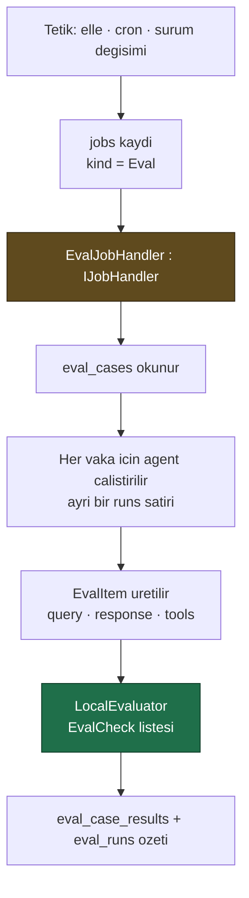

# Faz 18 — Değerlendirme (Eval) Altyapısı

> **Durum:** ✅ **Tamamlandı (2026-08-03)**
> **Kaynak:** [BEYIN-FIRTINASI.md](arsiv/BEYIN-FIRTINASI.md) · **F-14**
> **Önkoşul:** [Faz 17](17-TOPLU-VE-ZAMANLANMIS-CALISTIRMA.md) — iş kuyruğu
> **Sonraki bağımlı:** [Faz 19](19-SURUM-KARSILASTIRMA-VE-AB.md) — "v3 v2'den iyi mi?"
> **Paketler:** `AgentPrism.Abstractions`, `.Core`, `.PostgreSql`, `.AspNetCore`, `.UI`
> **Yeni paket:** Yok — bkz. K-139 · **Migration:** 0009 (`0009_eval.sql`)

---

## Plandan Sapmalar

1. **Yeni paket hiç gerekmedi (K-139).** 18.2'nin öngördüğü ölçüm yapıldığında
   `EvalItem`/`EvalCheck`/`LocalEvaluator` gibi tiplerin `Microsoft.Extensions.AI.Evaluation`
   değil **`Microsoft.Agents.AI`** ad alanında olduğu görüldü — `AgentPrism.Core`
   zaten o pakete doğrudan referans veriyor. Destek tipleri (`EvaluationMetric` vb.)
   geçişli olarak geldi. Planlanandan da kolay çıktı.
2. **`LocalEvaluator.DetailedItems` boş döner (K-142, 🚨).** Plan bu alanı okuma
   yolu sanıyordu; gerçek sonuç `AgentEvaluationResults.Items[0].Metrics`'tedir.
   Bir repro programıyla ölçüldü, bkz. karar defteri.
3. **`RunKind.Eval` plandan sonra, doğrulama sırasında eklendi.** Doc'un açık
   soru 4'ü ("eval çalıştırmaları istatistiklere dâhil olsun mu?") bir öneriyle
   kapatılmıştı ama ilk uygulamada kodlanmadı; örnek uygulamada gerçek bir
   çalıştırmayla `/api/stats`'ın kirlendiği görüldü ve düzeltildi (K-141).
   Bu, "birim testleri geçti ama örnek uygulama gerçek hatayı yakaladı" durumuna
   bir örnek daha.
4. **Vaka düzenleyici JSON değil, tekrarlanan alan formu.** `checks` alanı JSON
   metin kutusu olarak kaldı. Bkz. K-143.
5. **`POST .../run` gövdesi `agentVersion` almaz** — yalnız `modelId` ve
   `numRepetitions`. Faz 19'un 19.4 bölümündeki "açık soru 2" (`agentVersion`
   ile belirli bir sürüme karşı eval koşma) bu yüzden **henüz desteklenmiyor**;
   `agent_version` yalnız kayıt amaçlı, koşu anında **otomatik** çözülen
   agent'ın güncel sürümünden okunur. Faz 19 bunu genişletmek isterse
   `EvalRunTriggerRequest`'e alan eklemesi ve `EvalJobHandler`'ın belirli bir
   sürümü derleyip çalıştırması gerekir (bugün yalnız `IAgentCatalog.ResolveAsync`
   ile **güncel** sürüm çözülüyor).

---

## Bu Faza Başlarken

1. [`17-TOPLU-VE-ZAMANLANMIS-CALISTIRMA.md`](17-TOPLU-VE-ZAMANLANMIS-CALISTIRMA.md) — `IJobHandler`
2. [`KARARLAR.md`](KARARLAR.md) — **K-032** (model kataloğu), **K-007** (bağımlılık), **K-041** (özet depoda hesaplanır)
3. [`MIMARI.md`](MIMARI.md) — bölüm 5 (`agent_definition_versions`)
4. Bu doküman

---

## Amaç

Bir agent için test kümesi tanımlamak, düzenli çalıştırmak ve regresyonu
görmek. Sürüm geçmişi (`agent_definition_versions`) Faz 1'den beri var; "v3
v2'den daha mı iyi?" sorusu doğal devamıdır ve bugün cevaplanamıyor.

---

## Doğrulanmış MAF API'si

`Microsoft.Agents.AI` içinde **hazır** (reflection ile doğrulandı):

```csharp
// Girdi ve sonuc
sealed class EvalItem {
    EvalItem(string query, string? response);
    EvalItem(string query, string? response, IReadOnlyList<ChatMessage>? conversation);
    static IReadOnlyList<EvalItem> PerTurnItems(IReadOnlyList<ChatMessage> conversation, ...);
    string Query { get; }  string? Response { get; }
    string? ExpectedOutput { get; set; }
    IReadOnlyList<ExpectedToolCall>? ExpectedToolCalls { get; set; }
    IReadOnlyList<AITool>? Tools { get; set; }
    string? Context { get; set; }
    ChatResponse? RawResponse { get; set; }
}

// Kod ile yazilan denetimler — MODEL CAGIRMAZ, UCRETSIZ
sealed delegate EvalCheck : EvalCheckResult Invoke(EvalItem item);
static class EvalChecks {
    EvalCheck ContainsExpected(bool caseSensitive);
    EvalCheck KeywordCheck(params string[] keywords);
    EvalCheck NonEmpty(int minLength);
    EvalCheck ToolCalledCheck(ToolCalledMode mode, params string[] toolNames);
    EvalCheck ToolCallArgsMatch();
    EvalCheck ToolCallsPresent();
    EvalCheck HasImageContent();
}
static class FunctionEvaluator { static EvalCheck Create(string name, Func<EvalItem, EvalCheckResult> check); }
sealed record EvalCheckResult(bool Passed, string? Reason, string? CheckName);

// Degerlendirici
interface IAgentEvaluator {
    string Name { get; }
    Task<AgentEvaluationResults> EvaluateAsync(IReadOnlyList<EvalItem> items, string? evalName, CancellationToken ct);
}
sealed class LocalEvaluator : IAgentEvaluator { LocalEvaluator(params EvalCheck[] checks); }

sealed class AgentEvaluationResults {
    bool AllPassed { get; }  int Passed { get; }  int Failed { get; }  int Total { get; }
    IReadOnlyList<EvalItemResult> DetailedItems { get; set; }
    IReadOnlyDictionary<string, PerEvaluatorResult> PerEvaluator { get; set; }
    void AssertAllPassed(string? message);   // test icin
}
sealed class EvalItemResult {
    string ItemId { get; }  string Status { get; }  bool IsPassed { get; }  bool IsFailed { get; }
    IReadOnlyList<EvalScoreResult> Scores { get; }
    IReadOnlyDictionary<string, int>? TokenUsage { get; set; }
}
record EvalScoreResult(string Name, double Score, bool? Passed) { IReadOnlyList<RubricScore>? Dimensions { get; set; } }
record RubricScore(string Id, int? Score, bool Applicable, int Weight, string? Reason);

// Agent uzerinden dogrudan calistirma
static class AgentEvaluationExtensions {
    static Task<AgentEvaluationResults> EvaluateAsync(this AIAgent agent, IEnumerable<string> queries,
        IAgentEvaluator evaluator, string? evalName, IEnumerable<string>? expectedOutput,
        IEnumerable<IEnumerable<ExpectedToolCall>>? expectedToolCalls, IConversationSplitter? splitter,
        int numRepetitions, CancellationToken ct);
}

// Donguyu degerlendirenler (LoopAgent icin — bu fazin kapsaminda DEGIL)
sealed class AIJudgeLoopEvaluator(IChatClient judgeClient, AIJudgeLoopEvaluatorOptions? options);
sealed class LoopAgent : DelegatingAIAgent;
```

### 🚨 İki ayrı kavram — karıştırmayın

| Kavram | Ne yapar | Bu fazda |
|--------|----------|----------|
| **Eval** (`IAgentEvaluator`, `EvalItem`) | Bir agent'ı test kümesi üzerinde ölçer | **Evet** |
| **LoopEvaluator** (`AIJudgeLoopEvaluator`, `LoopAgent`) | Bir çalıştırmayı yeterli olana kadar **tekrarlar** | **Hayır** — ayrı bir yetenektir, gelecekte ele alınır |

İsimler benzer, işleri farklıdır. Beyin fırtınası belgesi ikisini aynı satırda
sayıyordu; bu faz yalnız birincisini yapar.

---

## 18.1 — Veri Modeli (Migration 0009)

```sql
CREATE TABLE {schema}.eval_suites (
    id          uuid        NOT NULL PRIMARY KEY,
    tenant_id   text        NOT NULL,
    name        text        NOT NULL,
    description text,
    agent_name  text        NOT NULL,
    checks      jsonb       NOT NULL DEFAULT '[]'::jsonb,   -- denetim tanimlari
    created_at  timestamptz NOT NULL,
    updated_at  timestamptz NOT NULL,
    CONSTRAINT eval_suites_tenant_name_uq UNIQUE (tenant_id, name)
);

CREATE TABLE {schema}.eval_cases (
    id            uuid    NOT NULL PRIMARY KEY,
    suite_id      uuid    NOT NULL REFERENCES {schema}.eval_suites (id) ON DELETE CASCADE,
    seq           integer NOT NULL,
    query         text    NOT NULL,
    expected_output text,
    expected_tools  text,          -- virgulle ayrilmis tool adlari
    context       text,
    CONSTRAINT eval_cases_suite_seq_uq UNIQUE (suite_id, seq)
);

CREATE TABLE {schema}.eval_runs (
    id             uuid        NOT NULL PRIMARY KEY,
    tenant_id      text        NOT NULL,
    suite_id       uuid        NOT NULL REFERENCES {schema}.eval_suites (id) ON DELETE CASCADE,
    job_id         uuid,
    agent_version  integer,                    -- hangi surum olculdu
    model_id       text,
    status         smallint    NOT NULL,
    total          integer     NOT NULL DEFAULT 0,
    passed         integer     NOT NULL DEFAULT 0,
    failed         integer     NOT NULL DEFAULT 0,
    input_tokens   bigint,
    output_tokens  bigint,
    started_at     timestamptz NOT NULL,
    completed_at   timestamptz
);

CREATE TABLE {schema}.eval_case_results (
    id           uuid    NOT NULL PRIMARY KEY,
    eval_run_id  uuid    NOT NULL REFERENCES {schema}.eval_runs (id) ON DELETE CASCADE,
    case_id      uuid    NOT NULL,
    run_id       uuid,                          -- olusan calistirma
    passed       boolean NOT NULL,
    output       text,
    scores       jsonb   NOT NULL DEFAULT '[]'::jsonb,
    failure_reason text
);

CREATE INDEX IF NOT EXISTS eval_runs_suite_started_idx
    ON {schema}.eval_runs (tenant_id, suite_id, started_at DESC);
```

`agent_version` ve `model_id` **kritiktir**: regresyon takibi, aynı testin farklı
sürümlerdeki sonucunu karşılaştırmaktır. Sürüm kaydedilmezse tablo yalnız
"geçti/kaldı" listesi olur.

---

## 18.2 — Denetimler (checks) ve Bağımlılık Ölçümü

Suite'in `checks` alanı arayüzden tanımlanır ve **kod içermez** (K2):

```jsonc
[
  { "kind": "nonEmpty", "minLength": 10 },
  { "kind": "containsExpected", "caseSensitive": false },
  { "kind": "keywords", "values": ["iade", "kargo"] },
  { "kind": "toolCalled", "tools": ["get_order_status"], "mode": "all" }
]
```

Bunlar `EvalChecks` fabrikalarına eşlenir. Serbest ifade **yoktur**; özel
denetim isteyen kullanıcı kodda `FunctionEvaluator.Create(...)` ile yazar ve
`AddEvalCheck("adim", check)` ile kaydeder — tıpkı tool'lar gibi.

### Ölçülecek bağımlılık

`Microsoft.Extensions.AI.Evaluation` derlemesi reflection taramasında
görüldü (19 public tip). Uygulamadan **önce** ölçün:

```bash
dotnet list src/AgentPrism.Core/AgentPrism.Core.csproj package --include-transitive | grep -i evaluation
```

- Geçişli bağımlılıksa ek paket yok — iş kolaydır
- Değilse ayrı bir `PackageReference` gerekir ve bu, K-007 gereği bilinçli bir
  karardır. O durumda seçenek: eval kodunu `AgentPrism.Core`'a değil ayrı bir
  pakete koymak

`AIJudgeLoopEvaluator` bu fazın kapsamında olmadığı için "AI yargıç" ile
puanlama **ilk sürümde yoktur**; yalnız kod denetimleri çalışır. Bu, eval'i
**ücretsiz** yapar (agent çalıştırma maliyeti hariç) ve ilk sürüm için doğru
kısıttır.

---

## 18.3 — Çalıştırma Akışı



- Her vaka **kendi `runs` satırını** üretir. Böylece bir eval hatası tek tıkla
  transcript'e ve span ağacına gider. Bu, eval'i AgentPrism'de yapmanın ana
  değeridir; dışarıdaki bir eval aracı bunu veremez
- Vakalar **yeni oturumda** çalışır; oturum geçmişi sızarsa sonuçlar
  karşılaştırılamaz
- `numRepetitions` desteklenir: aynı vaka N kez çalışır, kararlılık ölçülür

---

## 18.4 — HTTP Uçları ve Arayüz

| Uç | Rol | Ne yapar |
|----|-----|----------|
| `GET/PUT/DELETE {prefix}/api/evals[/{name}]` | Admin | Suite yönetimi |
| `GET/PUT/DELETE {prefix}/api/evals/{name}/cases` | Admin | Vaka yönetimi |
| `POST {prefix}/api/evals/{name}/run` | Operator | Şimdi çalıştır (iş kuyruğuna girer) |
| `GET {prefix}/api/evals/{name}/runs` | Reader | Geçmiş sonuçlar, sürüm kırılımıyla |
| `GET {prefix}/api/evals/runs/{id}` | Reader | Vaka bazında sonuç |

Arayüz: yeni **Evals** ekranı.

- Suite listesi, son sonuç, geçme oranı
- Vaka düzenleyici (sorgu, beklenen çıktı, beklenen tool'lar)
- Sonuç ekranı: geçen/kalan tablo, her satırdan çalıştırmaya bağlantı
- **Zaman içinde geçme oranı** — sürüm bazlı basit bir çubuk gösterim
  (grafik kütüphanesi Faz 20'nin kararıdır; burada CSS ile çizilir)

Bütçe hedefi: **+8 KB gzip'ten az**.

---

## Gerçekleşen Public API

Plandaki taslak API büyük ölçüde aynen gerçekleşti; asıl fark şudur: MAF
tiplerini doğrudan `IEvalStore`'un kendi sözleşmesine karıştırmadık — depo
saf veri (JSON/string/Guid) taşır, MAF'ın `EvalCheck`/`LocalEvaluator` ile
eşleme yalnız `EvalCheckRegistry`'de (Core) yapılır.

```csharp
// AgentPrism.Abstractions — Evaluation/
public sealed record EvalSuite { Guid Id; string TenantId; string Name; string? Description;
    string AgentName; JsonElement Checks; DateTimeOffset CreatedAt; DateTimeOffset UpdatedAt; }
public sealed record EvalCase { Guid Id; Guid SuiteId; int Seq; string Query;
    string? ExpectedOutput; IReadOnlyList<string> ExpectedTools; string? Context; }
public enum EvalRunStatus { Pending, Running, Completed, Failed, Cancelled }
public sealed record EvalRun { Guid Id; string TenantId; Guid SuiteId; Guid? JobId;
    int? AgentVersion; string? ModelId; EvalRunStatus Status;
    int Total; int Passed; int Failed; long? InputTokens; long? OutputTokens;
    DateTimeOffset StartedAt; DateTimeOffset? CompletedAt; }
public sealed record EvalCaseResult { Guid Id; Guid EvalRunId; Guid CaseId; Guid? RunId;
    bool Passed; string? Output; JsonElement Scores; string? FailureReason; }

public interface IEvalStore
{
    ValueTask<IReadOnlyList<EvalSuite>> ListSuitesAsync(string tenantId, CancellationToken ct = default);
    ValueTask<EvalSuite?> GetSuiteAsync(string tenantId, string name, CancellationToken ct = default);
    ValueTask<EvalSuite> SaveSuiteAsync(EvalSuite suite, CancellationToken ct = default);
    ValueTask<bool> DeleteSuiteAsync(string tenantId, string name, CancellationToken ct = default);
    ValueTask<IReadOnlyList<EvalCase>> ListCasesAsync(Guid suiteId, CancellationToken ct = default);
    ValueTask<IReadOnlyList<EvalCase>> ReplaceCasesAsync(Guid suiteId, IReadOnlyList<EvalCase> cases, CancellationToken ct = default);
    ValueTask<EvalRun> CreateRunAsync(EvalRun run, CancellationToken ct = default);
    ValueTask MarkRunRunningAsync(Guid evalRunId, int? agentVersion, string? modelId, CancellationToken ct = default);
    ValueTask CompleteRunAsync(EvalRunCompletion completion, CancellationToken ct = default);
    ValueTask<EvalRun?> GetRunAsync(string tenantId, Guid evalRunId, CancellationToken ct = default);
    ValueTask<EvalRun?> GetRunByJobIdAsync(string tenantId, Guid jobId, CancellationToken ct = default);
    ValueTask<IReadOnlyList<EvalRun>> QueryRunsAsync(EvalRunQuery query, CancellationToken ct = default);
    ValueTask RecordCaseResultAsync(EvalCaseResult result, CancellationToken ct = default);
    ValueTask<IReadOnlyList<EvalCaseResult>> ListCaseResultsAsync(string tenantId, Guid evalRunId, CancellationToken ct = default);
}

// AgentPrism.Core — Evaluation/
public sealed record AgentPrismEvalCheckRegistration(string Kind, EvalCheck Check);
public sealed class EvalCheckRegistry
{
    public EvalCheckRegistry(IEnumerable<AgentPrismEvalCheckRegistration> registrations);
    public IReadOnlyList<EvalCheck> BuildChecks(JsonElement checks); // AgentPrismException: bilinmeyen 'kind'
}
internal sealed class EvalJobHandler : IJobHandler // JobKind.Eval
public sealed class InMemoryEvalStore : IEvalStore

// IAgentPrismBuilder — ozel denetim kaydi
IAgentPrismBuilder AddEvalCheck(string kind, Microsoft.Agents.AI.EvalCheck check);

// AgentPrism.PostgreSql
public sealed class PostgresEvalStore : IEvalStore

// AgentPrism.AspNetCore — Contracts/EvaluationContracts.cs
public sealed record EvalSuiteSaveRequest { string? Description; string AgentName; JsonElement Checks; }
public sealed record EvalCaseInput { string Query; string? ExpectedOutput; IReadOnlyList<string> ExpectedTools; string? Context; }
public sealed record EvalRunTriggerRequest { string? ModelId; int? NumRepetitions; } // agentVersion YOK, bkz. Plandan Sapmalar #5
public sealed record EvalRunDetailResponse { EvalRun Run; IReadOnlyList<EvalCaseResult> Results; }
```

`RunKind` içine `Eval = 2` eklendi (bkz. K-141); `AgentPrismRunOptions.Kind`
alanı bunu taşır.

---

## Dosya Listesi

| Dosya | Ne |
|-------|-----|
| `src/AgentPrism.Abstractions/Evaluation/{EvalSuite,EvalCase,EvalRun,EvalRunStatus,EvalCaseResult,IEvalStore}.cs` | Veri modeli + sözleşme |
| `src/AgentPrism.Abstractions/Runs/RunKind.cs` | `Eval = 2` eklendi |
| `src/AgentPrism.Abstractions/Runs/AgentPrismRunOptions.cs` | `Kind` alanı eklendi |
| `src/AgentPrism.Core/Evaluation/{InMemoryEvalStore,EvalCheckRegistry,AgentPrismEvalCheckRegistration,EvalJobHandler}.cs` | Uygulama |
| `src/AgentPrism.Core/Recording/RunRecordingAgent.cs` | `RunStart.Kind` → `RunStartInfo.Kind` aktarımı |
| `src/AgentPrism.Core/Storage/InMemoryRunStore.cs` | `GetStatisticsAsync` eval hariç tutması |
| `src/AgentPrism.Core/AgentPrismBuilder.cs`, `IAgentPrismBuilder.cs` | `AddEvalCheck(...)` |
| `src/AgentPrism.Core/AgentPrismServiceCollectionExtensions.cs` | `IEvalStore`, `EvalCheckRegistry`, `EvalJobHandler` kaydı |
| `src/AgentPrism.PostgreSql/Migrations/0009_eval.sql` | `eval_suites`, `eval_cases`, `eval_runs`, `eval_case_results` |
| `src/AgentPrism.PostgreSql/Stores/PostgresEvalStore.cs` | PostgreSQL uygulaması |
| `src/AgentPrism.PostgreSql/Internal/SqlQueries.cs` | Eval sorguları + `SelectRunStatistics` eval filtresi |
| `src/AgentPrism.PostgreSql/Stores/PostgresRunStore.cs` | `kind_eval` parametresi |
| `src/AgentPrism.AspNetCore/Contracts/EvaluationContracts.cs`, `Endpoints/EvalEndpoints.cs` | HTTP uçları |
| `src/AgentPrism.AspNetCore/AgentPrismEndpointRouteBuilderExtensions.cs` | `EvalEndpoints.Map` kaydı |
| `src/AgentPrism.UI/frontend/src/screens/{evals,eval-detail,eval-run-detail}.tsx` | Arayüz ekranları |
| `src/AgentPrism.UI/frontend/src/lib/{types,api}.ts`, `components/{icons,layout}.tsx`, `app.tsx` | Tipler, istemci, gezinme, rota |
| `tests/AgentPrism.Core.UnitTests/Evaluation/{EvalCheckRegistryTests,InMemoryEvalStoreTests,EvalJobHandlerTests}.cs` | Birim testleri |
| `tests/AgentPrism.PostgreSql.IntegrationTests/Contracts/EvalStoreContract.cs` | Sözleşme testi (iki uygulamada da koşar) |
| `tests/AgentPrism.PostgreSql.IntegrationTests/Contracts/RunStoreContract.cs` | Eval hariç tutma regresyon testi (K-141) |
| `tests/AgentPrism.AspNetCore.FunctionalTests/EvalEndpointTests.cs` | CRUD, rol, tetikleme testleri |
| `tests/AgentPrism.Ui.E2ETests/UiTests.cs` | `Eval_takimi_olusturulur_vaka_eklenir_ve_kosu_gecer` |

---

## Testler

| Proje | Gerçekleşen test | Sayı |
|-------|-------------------|------|
| `AgentPrism.Core.UnitTests` | `EvalCheckRegistryTests` (altı yerleşik tür + özel kayıt + bilinmeyen tür hatası), `InMemoryEvalStoreTests` (cascade, tenant yalıtımı, yaşam döngüsü), `EvalJobHandlerTests` (mutlu yol, denetim hatası, iptal, `numRepetitions`) | 303 (toplam Core paketi, eval dahil) |
| `AgentPrism.PostgreSql.IntegrationTests` | `EvalStoreContract` (InMemory + Postgres'te koşar), `RunStoreContract.Ozet_eval_calistirmalarini_haric_tutar` | 296 (toplam paket, eval dahil) |
| `AgentPrism.AspNetCore.FunctionalTests` | `EvalEndpointTests` — CRUD, bilinmeyen denetim reddi, vaka değiştirme/temizleme, tetikleme, rol denetimi | 199 (toplam paket, eval dahil) |
| `AgentPrism.Ui.E2ETests` | `Eval_takimi_olusturulur_vaka_eklenir_ve_kosu_gecer` — gerçek Kestrel + gerçek tarayıcı | 24 (toplam paket, eval dahil) |

Dört doğrulama kapısı (`build`/`test`/`pack`/`format`) sıfır uyarı; toplam
**968 .NET testi** ve **55 Vitest testi** geçiyor. Frontend bundle: **109,6 KB
gzip** (bütçe 250 KB) — Faz 18 eklemesi yaklaşık +8-9 KB.

**Gerçek kanıt (örnek uygulama, gerçek OpenAI modeli `gpt-5.4-mini`):**

1. **Mutlu yol** — `destek-testi` takımı, `support` agent'ı, denetimler
   `nonEmpty` + `toolCalled(get_order_status)`. Tetikleme sonrası ~5 saniyede
   `Completed`: `passed:1 failed:0`, gerçek model çıktısı ("ORD-7 siparişiniz
   kargoya verildi...") ve `tool_called_check: passed, reason: "Called:
   get_order_status"`.
2. **Sürüm karşılaştırma (DoD #3)** — veritabanı kaynaklı `versiyon-testi`
   agent'ı iki kez güncellendi (`version: 1` → `version: 2`, talimat "kısa
   yanıt" → "kısa yanıt, artık daha resmi konuş"). Aynı suite iki kez
   çalıştırıldı: `GET .../runs` iki satır döndü, `agentVersion: 1` ve
   `agentVersion: 2`, karşılık gelen çıktılar sırasıyla "İyiyim, teşekkürler.
   Sen nasılsın?" (gündelik) ve "Merhaba, iyiyim, teşekkür ederim. Siz
   nasılsınız?" (resmi) — talimat değişikliği ölçülebilir şekilde yansıdı.
3. **İstatistik hariç tutma (K-141)** — düzeltmeden önce tek bir eval vakası
   `/api/stats`'ta `totalRuns:1` olarak görünüyordu; düzeltmeden sonra aynı
   senaryoda `totalRuns:0` (eval kosusunun kendisi `Completed`, `passed:1`).
4. **Eksik agent hata yolu** — var olmayan bir agent'a işaret eden takım
   tetiklendiğinde iş üç kez yeniden denendi, sonunda `Failed` oldu ve
   `agentVersion`/`modelId` `null` kaldı (hiç çözülemediği için) — beklenen
   davranış.

---

## Bu Fazda Verilecek Kararlar

1. **Eval ve LoopEvaluator ayrı kavramlardır**; bu faz yalnız eval'i yapar (K-140).
2. **AI yargıç ilk sürümde yok** — eval ücretsiz kalmalıdır; ihtiyaç somutlaşınca
   eklenir (K-140).
3. **Denetimler bildirimseldir, kod değil** (K2); özel denetim kodda kaydedilir
   (`AddEvalCheck`).
4. **Her vaka kendi `runs` satırını üretir** — hata ayıklanabilirlik. Gerçek
   çalıştırmada doğrulandı: her sonucun `runId`'si gerçek bir `runs` satırına
   çözülüyor.
5. **`agent_version` ve `model_id` kaydedilir** — regresyon takibinin şartı.
   Gerçek çalıştırmada doğrulandı (yukarı bakınız).
6. **Yeni paket gerekmedi** (K-139) — plandaki 18.2 ölçümü bunu doğruladı.
7. **Eval çalıştırmaları `runs` istatistiklerinden hariç tutulur** (K-141) —
   plandaki açık soru 4, uygulama sırasında gerçek bir hatayla doğrulanıp
   kodlandı.

---

## Açık Sorular

1. **Eval, agent sürümü değişince otomatik tetiklensin mi?** ~~Faydalıdır ama
   beklenmeyen maliyet üretir.~~ **Kapatıldı: hayır, bu fazda yapılmadı.**
   Tetikleme yalnız elle (`POST .../run`) veya Faz 17'nin cron zamanlamasıyla
   (`JobKind.Eval` zamanlaması) olur; otomatik "sürüm değişince tetikle" kancası
   eklenmedi. İhtiyaç somutlaşırsa `IAgentDefinitionStore.SaveAsync` sonrası bir
   olay yayını gerekir.
2. **Vakalar dosyadan içe aktarılabilsin mi (CSV/JSONL)?** **Yapılmadı.**
   `PUT .../cases` zaten tam bir JSON dizisi kabul ediyor; içe aktarma bunun
   üzerine ince bir istemci-taraflı katman olurdu (arayüzde dosya seçip
   `EvalCaseInput[]`'e çevirmek). Ayrı bir uç gerekmiyor.
3. **AI yargıç ne zaman?** Değişmedi: kullanıcı isterse ayrı bir faz; maliyet
   uyarısı ve model seçimi ister.
4. **Eval çalıştırmaları `runs` istatistiklerine dâhil olsun mu?** **Kapatıldı:
   hayır** — bkz. K-141. `runs.kind` sütununa `Eval = 2` eklendi;
   `GetStatisticsAsync` bu türü hem `InMemoryRunStore` hem `PostgresRunStore`'da
   filtreler. `/api/runs` listesi ise **filtrelenmedi** — bir eval vakasının
   transkriptine tek tıkla gitme ihtiyacı (18.3) bunu gerektiriyordu.

---

## Bitiş Ölçütleri (DoD)

- [x] Suite tanımlanıp çalıştırılıyor; sonuçlar kaydediliyor — bkz. "Gerçek kanıt" #1
- [x] Her vaka için `runs` satırı ve transcript bağlantısı var — her `EvalCaseResult.RunId`
      gerçek bir `runs` satırına çözülüyor (`GET /api/runs/{runId}` ile doğrulandı)
- [x] Aynı suite iki farklı agent sürümünde çalıştırılıp sonuçlar
      karşılaştırılabiliyor (gerçek çıktı dokümanda) — bkz. "Gerçek kanıt" #2
- [x] Tool çağrısı denetimi (`ToolCalledCheck`) gerçek bir çalıştırmada doğru
      sonuç veriyor — bkz. "Gerçek kanıt" #1 (`tool_called_check: passed`)
- [x] Eval çalıştırmaları normal istatistikleri kirletmiyor — bkz. "Gerçek kanıt" #3 (K-141)
- [x] Bağımlılık ölçümü yapıldı ve karar yazıldı — K-139
- [x] Dört doğrulama kapısı sıfır uyarı — build/test/pack/format, 968 .NET + 55 Vitest testi

---

## Riskler

| Risk | Önlem | Durum |
|------|-------|-------|
| Eval maliyeti fark edilmeden büyür | Vaka sayısı sınırı (`MaxItemsPerJob`, Faz 17); `numRepetitions` varsayılan 1; maliyet Faz 20'de görünür | Uygulandı |
| MAF eval API'si değişir | Tipler `Microsoft.Agents.AI` içinde; sürüm sabit; imzalar uygulama öncesi yeniden doğrulanır | Uygulandı |
| Yeni paket bağımlılığı | Önce ölçülür (18.2) | Gerekmedi — K-139 |
| Sonuçlar karşılaştırılamaz | `agent_version` + `model_id` + yeni oturum kuralı | Gerçek çalıştırmada doğrulandı |
| `LocalEvaluator.DetailedItems` boş döner | Gerçek sonuç `Items[0].Metrics`'ten okunur | Keşfedildi ve düzeltildi — K-142 |
| Eval koşuları normal istatistikleri kirletir | `RunKind.Eval` + `GetStatisticsAsync` filtresi | Keşfedildi (örnek uygulamada) ve düzeltildi — K-141 |

---

## Sonraki Faza Devir Notu

- **Faz 19 bu fazın çıktısını kullanır:** iki sürümü aynı suite ile ölçüp yan
  yana koymak, A/B'nin çevrimdışı hâlidir — bu fazda **elle** (agent'ı
  güncelleyip suite'i tekrar çalıştırarak) gösterildi, otomatikleştirilmedi.
- 🚨 **`EvalRunTriggerRequest` bir `agentVersion` alanı taşımaz.** Faz 19'un
  19.4 bölümündeki açık soru 2 ("Faz 18'in suite'i bir varyanta karşı
  çalıştırılabilir... `POST /api/evals/{name}/run` gövdesi `agentVersion`
  alabilsin") **bu fazda karşılanmadı**. Bugün `EvalJobHandler` her zaman
  `IAgentCatalog.ResolveAsync` ile agent'ın **güncel** derlenmiş sürümünü
  çalıştırır; belirli bir geçmiş sürümü çalıştırma yolu yoktur (`CompiledAgentCache`
  anahtarı `(name, version)` olsa da, `IAgentCatalog.ResolveAsync` bir sürüm
  parametresi almaz — Faz 19'un 19.3 bölümü zaten bu genişletmeyi planlıyor).
  Faz 19 A/B deneyi eklerken `EvalJobHandler`'ı da güncelleyip belirli bir
  varyantın sürümüne karşı koşabilmesini sağlamalıdır.
- Faz 20 (maliyet) eval çalıştırmalarının maliyetini ayrı bir kalem olarak
  gösterebilir; `RunKind.Eval` bunu HTTP katmanında filtrelemeyi kolaylaştırır.
- Faz 25 (saklama) eski `eval_case_results` kayıtlarını temizlemekle yükümlüdür;
  `eval_runs` özeti korunur.
- 🚨 **`LocalEvaluator.EvaluateAsync(...).DetailedItems` her zaman boştur** —
  yeni bir MAF eval tipi kullanan biri bu tuzağa düşebilir. Gerçek sonuç
  `Items[0].Metrics`'tedir (bkz. K-142, `MEMORY.md`).
