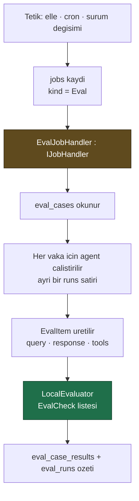

# Faz 18 — Değerlendirme (Eval) Altyapısı

> **Durum:** 📋 Planlandı
> **Kaynak:** [BEYIN-FIRTINASI.md](BEYIN-FIRTINASI.md) · **F-14**
> **Önkoşul:** [Faz 17](17-TOPLU-VE-ZAMANLANMIS-CALISTIRMA.md) — iş kuyruğu
> **Sonraki bağımlı:** [Faz 19](19-SURUM-KARSILASTIRMA-VE-AB.md) — "v3 v2'den iyi mi?"
> **Paketler:** `AgentPrism.Abstractions`, `.Core`, `.PostgreSql`, `.AspNetCore`, `.UI`
> **Yeni paket:** Yok (ölçüme bağlı — 18.2) · **Migration:** 0009 (planlanan sırada)

---

## Bu Faza Başlarken

1. [`17-TOPLU-VE-ZAMANLANMIS-CALISTIRMA.md`](17-TOPLU-VE-ZAMANLANMIS-CALISTIRMA.md) — `IJobHandler`
2. [`KARARLAR.md`](KARARLAR.md) — **K-032** (model kataloğu), **K-007** (bağımlılık), **K-041** (özet depoda hesaplanır)
3. [`MIMARI.md`](MIMARI.md) — bölüm 5 (`agent_definition_versions`)
4. Bu doküman

---

## Amaç

Bir agent için test kümesi tanımlamak, düzenli çalıştırmak ve regresyonu
görmek. Sürüm geçmişi (`agent_definition_versions`) Faz 1'den beri var; "v3
v2'den daha mı iyi?" sorusu doğal devamıdır ve bugün cevaplanamıyor.

---

## Doğrulanmış MAF API'si

`Microsoft.Agents.AI` içinde **hazır** (reflection ile doğrulandı):

```csharp
// Girdi ve sonuc
sealed class EvalItem {
    EvalItem(string query, string? response);
    EvalItem(string query, string? response, IReadOnlyList<ChatMessage>? conversation);
    static IReadOnlyList<EvalItem> PerTurnItems(IReadOnlyList<ChatMessage> conversation, ...);
    string Query { get; }  string? Response { get; }
    string? ExpectedOutput { get; set; }
    IReadOnlyList<ExpectedToolCall>? ExpectedToolCalls { get; set; }
    IReadOnlyList<AITool>? Tools { get; set; }
    string? Context { get; set; }
    ChatResponse? RawResponse { get; set; }
}

// Kod ile yazilan denetimler — MODEL CAGIRMAZ, UCRETSIZ
sealed delegate EvalCheck : EvalCheckResult Invoke(EvalItem item);
static class EvalChecks {
    EvalCheck ContainsExpected(bool caseSensitive);
    EvalCheck KeywordCheck(params string[] keywords);
    EvalCheck NonEmpty(int minLength);
    EvalCheck ToolCalledCheck(ToolCalledMode mode, params string[] toolNames);
    EvalCheck ToolCallArgsMatch();
    EvalCheck ToolCallsPresent();
    EvalCheck HasImageContent();
}
static class FunctionEvaluator { static EvalCheck Create(string name, Func<EvalItem, EvalCheckResult> check); }
sealed record EvalCheckResult(bool Passed, string? Reason, string? CheckName);

// Degerlendirici
interface IAgentEvaluator {
    string Name { get; }
    Task<AgentEvaluationResults> EvaluateAsync(IReadOnlyList<EvalItem> items, string? evalName, CancellationToken ct);
}
sealed class LocalEvaluator : IAgentEvaluator { LocalEvaluator(params EvalCheck[] checks); }

sealed class AgentEvaluationResults {
    bool AllPassed { get; }  int Passed { get; }  int Failed { get; }  int Total { get; }
    IReadOnlyList<EvalItemResult> DetailedItems { get; set; }
    IReadOnlyDictionary<string, PerEvaluatorResult> PerEvaluator { get; set; }
    void AssertAllPassed(string? message);   // test icin
}
sealed class EvalItemResult {
    string ItemId { get; }  string Status { get; }  bool IsPassed { get; }  bool IsFailed { get; }
    IReadOnlyList<EvalScoreResult> Scores { get; }
    IReadOnlyDictionary<string, int>? TokenUsage { get; set; }
}
record EvalScoreResult(string Name, double Score, bool? Passed) { IReadOnlyList<RubricScore>? Dimensions { get; set; } }
record RubricScore(string Id, int? Score, bool Applicable, int Weight, string? Reason);

// Agent uzerinden dogrudan calistirma
static class AgentEvaluationExtensions {
    static Task<AgentEvaluationResults> EvaluateAsync(this AIAgent agent, IEnumerable<string> queries,
        IAgentEvaluator evaluator, string? evalName, IEnumerable<string>? expectedOutput,
        IEnumerable<IEnumerable<ExpectedToolCall>>? expectedToolCalls, IConversationSplitter? splitter,
        int numRepetitions, CancellationToken ct);
}

// Donguyu degerlendirenler (LoopAgent icin — bu fazin kapsaminda DEGIL)
sealed class AIJudgeLoopEvaluator(IChatClient judgeClient, AIJudgeLoopEvaluatorOptions? options);
sealed class LoopAgent : DelegatingAIAgent;
```

### 🚨 İki ayrı kavram — karıştırmayın

| Kavram | Ne yapar | Bu fazda |
|--------|----------|----------|
| **Eval** (`IAgentEvaluator`, `EvalItem`) | Bir agent'ı test kümesi üzerinde ölçer | **Evet** |
| **LoopEvaluator** (`AIJudgeLoopEvaluator`, `LoopAgent`) | Bir çalıştırmayı yeterli olana kadar **tekrarlar** | **Hayır** — ayrı bir yetenektir, gelecekte ele alınır |

İsimler benzer, işleri farklıdır. Beyin fırtınası belgesi ikisini aynı satırda
sayıyordu; bu faz yalnız birincisini yapar.

---

## 18.1 — Veri Modeli (Migration 0009)

```sql
CREATE TABLE {schema}.eval_suites (
    id          uuid        NOT NULL PRIMARY KEY,
    tenant_id   text        NOT NULL,
    name        text        NOT NULL,
    description text,
    agent_name  text        NOT NULL,
    checks      jsonb       NOT NULL DEFAULT '[]'::jsonb,   -- denetim tanimlari
    created_at  timestamptz NOT NULL,
    updated_at  timestamptz NOT NULL,
    CONSTRAINT eval_suites_tenant_name_uq UNIQUE (tenant_id, name)
);

CREATE TABLE {schema}.eval_cases (
    id            uuid    NOT NULL PRIMARY KEY,
    suite_id      uuid    NOT NULL REFERENCES {schema}.eval_suites (id) ON DELETE CASCADE,
    seq           integer NOT NULL,
    query         text    NOT NULL,
    expected_output text,
    expected_tools  text,          -- virgulle ayrilmis tool adlari
    context       text,
    CONSTRAINT eval_cases_suite_seq_uq UNIQUE (suite_id, seq)
);

CREATE TABLE {schema}.eval_runs (
    id             uuid        NOT NULL PRIMARY KEY,
    tenant_id      text        NOT NULL,
    suite_id       uuid        NOT NULL REFERENCES {schema}.eval_suites (id) ON DELETE CASCADE,
    job_id         uuid,
    agent_version  integer,                    -- hangi surum olculdu
    model_id       text,
    status         smallint    NOT NULL,
    total          integer     NOT NULL DEFAULT 0,
    passed         integer     NOT NULL DEFAULT 0,
    failed         integer     NOT NULL DEFAULT 0,
    input_tokens   bigint,
    output_tokens  bigint,
    started_at     timestamptz NOT NULL,
    completed_at   timestamptz
);

CREATE TABLE {schema}.eval_case_results (
    id           uuid    NOT NULL PRIMARY KEY,
    eval_run_id  uuid    NOT NULL REFERENCES {schema}.eval_runs (id) ON DELETE CASCADE,
    case_id      uuid    NOT NULL,
    run_id       uuid,                          -- olusan calistirma
    passed       boolean NOT NULL,
    output       text,
    scores       jsonb   NOT NULL DEFAULT '[]'::jsonb,
    failure_reason text
);

CREATE INDEX IF NOT EXISTS eval_runs_suite_started_idx
    ON {schema}.eval_runs (tenant_id, suite_id, started_at DESC);
```

`agent_version` ve `model_id` **kritiktir**: regresyon takibi, aynı testin farklı
sürümlerdeki sonucunu karşılaştırmaktır. Sürüm kaydedilmezse tablo yalnız
"geçti/kaldı" listesi olur.

---

## 18.2 — Denetimler (checks) ve Bağımlılık Ölçümü

Suite'in `checks` alanı arayüzden tanımlanır ve **kod içermez** (K2):

```jsonc
[
  { "kind": "nonEmpty", "minLength": 10 },
  { "kind": "containsExpected", "caseSensitive": false },
  { "kind": "keywords", "values": ["iade", "kargo"] },
  { "kind": "toolCalled", "tools": ["get_order_status"], "mode": "all" }
]
```

Bunlar `EvalChecks` fabrikalarına eşlenir. Serbest ifade **yoktur**; özel
denetim isteyen kullanıcı kodda `FunctionEvaluator.Create(...)` ile yazar ve
`AddEvalCheck("adim", check)` ile kaydeder — tıpkı tool'lar gibi.

### Ölçülecek bağımlılık

`Microsoft.Extensions.AI.Evaluation` derlemesi reflection taramasında
görüldü (19 public tip). Uygulamadan **önce** ölçün:

```bash
dotnet list src/AgentPrism.Core/AgentPrism.Core.csproj package --include-transitive | grep -i evaluation
```

- Geçişli bağımlılıksa ek paket yok — iş kolaydır
- Değilse ayrı bir `PackageReference` gerekir ve bu, K-007 gereği bilinçli bir
  karardır. O durumda seçenek: eval kodunu `AgentPrism.Core`'a değil ayrı bir
  pakete koymak

`AIJudgeLoopEvaluator` bu fazın kapsamında olmadığı için "AI yargıç" ile
puanlama **ilk sürümde yoktur**; yalnız kod denetimleri çalışır. Bu, eval'i
**ücretsiz** yapar (agent çalıştırma maliyeti hariç) ve ilk sürüm için doğru
kısıttır.

---

## 18.3 — Çalıştırma Akışı



- Her vaka **kendi `runs` satırını** üretir. Böylece bir eval hatası tek tıkla
  transcript'e ve span ağacına gider. Bu, eval'i AgentPrism'de yapmanın ana
  değeridir; dışarıdaki bir eval aracı bunu veremez
- Vakalar **yeni oturumda** çalışır; oturum geçmişi sızarsa sonuçlar
  karşılaştırılamaz
- `numRepetitions` desteklenir: aynı vaka N kez çalışır, kararlılık ölçülür

---

## 18.4 — HTTP Uçları ve Arayüz

| Uç | Rol | Ne yapar |
|----|-----|----------|
| `GET/PUT/DELETE {prefix}/api/evals[/{name}]` | Admin | Suite yönetimi |
| `GET/PUT/DELETE {prefix}/api/evals/{name}/cases` | Admin | Vaka yönetimi |
| `POST {prefix}/api/evals/{name}/run` | Operator | Şimdi çalıştır (iş kuyruğuna girer) |
| `GET {prefix}/api/evals/{name}/runs` | Reader | Geçmiş sonuçlar, sürüm kırılımıyla |
| `GET {prefix}/api/evals/runs/{id}` | Reader | Vaka bazında sonuç |

Arayüz: yeni **Evals** ekranı.

- Suite listesi, son sonuç, geçme oranı
- Vaka düzenleyici (sorgu, beklenen çıktı, beklenen tool'lar)
- Sonuç ekranı: geçen/kalan tablo, her satırdan çalıştırmaya bağlantı
- **Zaman içinde geçme oranı** — sürüm bazlı basit bir çubuk gösterim
  (grafik kütüphanesi Faz 20'nin kararıdır; burada CSS ile çizilir)

Bütçe hedefi: **+8 KB gzip'ten az**.

---

## Testler

| Proje | Yeni test |
|-------|-----------|
| `AgentPrism.Core.UnitTests` | Denetim tanımı → `EvalCheck` eşlemesi; bilinmeyen denetim türü hatası; sonuç özetleme; `numRepetitions` |
| `AgentPrism.PostgreSql.IntegrationTests` | `EvalStoreContract`; cascade silme; sürüm bazlı sorgular; kiracı yalıtımı |
| `AgentPrism.AspNetCore.FunctionalTests` | CRUD, roller, çalıştırma tetikleme, sonuç okuma |
| `AgentPrism.Ui.E2ETests` | Suite oluşturma → çalıştırma → sonuç görme |

**Gerçek kanıt:** 5 vakalı bir suite gerçek modelle çalıştırılır; geçme oranı,
başarısız vakanın nedeni ve ilgili `run_id` dokümana yazılır.

---

## Bu Fazda Verilecek Kararlar

1. **Eval ve LoopEvaluator ayrı kavramlardır**; bu faz yalnız eval'i yapar.
2. **AI yargıç ilk sürümde yok** — eval ücretsiz kalmalıdır; ihtiyaç somutlaşınca
   eklenir.
3. **Denetimler bildirimseldir, kod değil** (K2); özel denetim kodda kaydedilir.
4. **Her vaka kendi `runs` satırını üretir** — hata ayıklanabilirlik.
5. **`agent_version` ve `model_id` kaydedilir** — regresyon takibinin şartı.

---

## Açık Sorular

1. **Eval, agent sürümü değişince otomatik tetiklensin mi?** Faydalıdır ama
   beklenmeyen maliyet üretir. Öneri: **kapalı**, suite ayarında açılabilir.
2. **Vakalar dosyadan içe aktarılabilsin mi (CSV/JSONL)?** Öneri: **evet**,
   JSONL — Faz 14'ün yükleme altyapısı hazır olacaktır.
3. **AI yargıç ne zaman?** Öneri: kullanıcı isterse ayrı bir faz; maliyet
   uyarısı ve model seçimi ister.
4. **Eval çalıştırmaları `runs` istatistiklerine dâhil olsun mu?** Olursa
   gösterge paneli şişer. Öneri: **hariç tutulur**; `runs.kind` alanına
   (Faz 15) `Eval` değeri eklenir ve varsayılan filtrelerde gizlenir.

---

## Bitiş Ölçütleri (DoD)

- [ ] Suite tanımlanıp çalıştırılıyor; sonuçlar kaydediliyor
- [ ] Her vaka için `runs` satırı ve transcript bağlantısı var
- [ ] Aynı suite iki farklı agent sürümünde çalıştırılıp sonuçlar
      karşılaştırılabiliyor (gerçek çıktı dokümanda)
- [ ] Tool çağrısı denetimi (`ToolCalledCheck`) gerçek bir çalıştırmada doğru
      sonuç veriyor
- [ ] Eval çalıştırmaları normal istatistikleri kirletmiyor
- [ ] Bağımlılık ölçümü yapıldı ve karar yazıldı
- [ ] Dört doğrulama kapısı sıfır uyarı

---

## Riskler

| Risk | Önlem |
|------|-------|
| Eval maliyeti fark edilmeden büyür | Vaka sayısı sınırı; `numRepetitions` varsayılan 1; maliyet Faz 20'de görünür |
| MAF eval API'si değişir | Tipler `Microsoft.Agents.AI` içinde; sürüm sabit; imzalar uygulama öncesi yeniden doğrulanır |
| Yeni paket bağımlılığı | Önce ölçülür (18.2) |
| Sonuçlar karşılaştırılamaz | `agent_version` + `model_id` + yeni oturum kuralı |

---

## Sonraki Faza Devir Notu

- **Faz 19 bu fazın çıktısını kullanır:** iki sürümü aynı suite ile ölçüp yan
  yana koymak, A/B'nin çevrimdışı hâlidir.
- Faz 20 (maliyet) eval çalıştırmalarının maliyetini ayrı bir kalem olarak
  gösterebilir.
- Faz 25 (saklama) eski `eval_case_results` kayıtlarını temizlemekle yükümlüdür;
  `eval_runs` özeti korunur.
