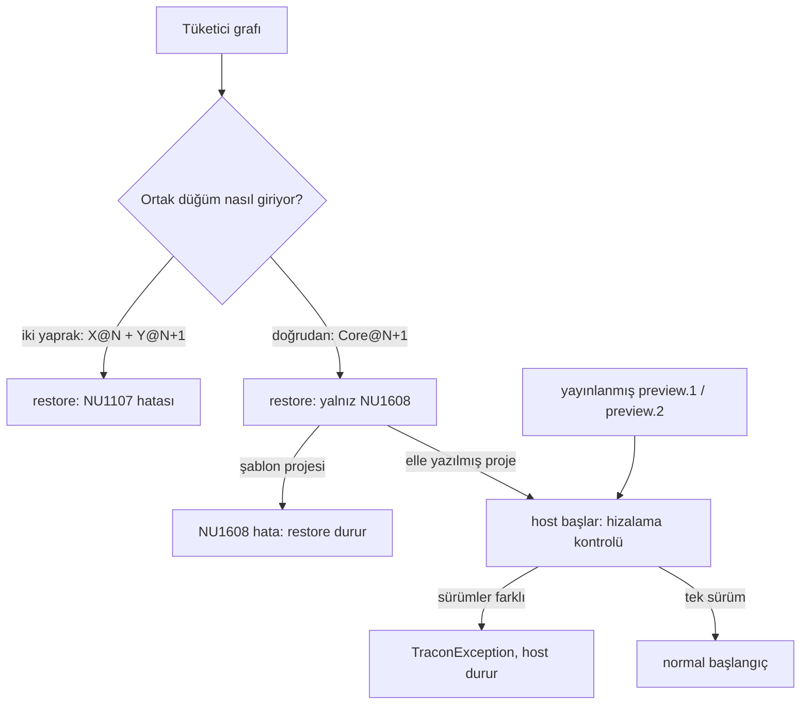

# Faz 185 — Kardeş Paket Sürüm Sabitleme ve Karışık Graf Koruması

> **Durum:** ✅ Tamamlandı (2026-09-24)
> **Plan onayı:** Bakımcı, 2026-09-23 (engelleyici kararlar sohbette alındı)
> **Kaynak:** [ADAYLAR.md](ADAYLAR.md) · **F-265**
> **Önkoşul:** Yok — turun ilk fazı. Varsayım: K-852…K-854 (`bb9953e3`) ve bu turun `kusur-giderme` işleri ana dalda. **Sonraki yayın (K-852…K-854 güvenlik yayını) bu fazı bekler** (kullanıcı kararı). Sonra 186…191 sırayla. 187 `src/Directory.Build.props:86-95`'i düzenler; 191 `kapi.py yayin`'in pack çağrısını değiştirir. İkisi de `TraconPinSiblingDependencies`'i adlandırmaz: hedefi nuspec fact'i korur, devir notu ikisini adlandırır
> **Paketler:** `Tracon.Core` (başlangıç kontrolü) · 16 paketin nuspec'i (`src/Directory.Build.props` hedefi) · `Tracon.Templates` (şablon) · örnek `samples/Tracon.Samples.ExtensionAotSmoke`
> **Yeni paket:** Yok · **Migration:** Yok
> **Public API:** Büyümüyor, daralmıyor — kontrol `internal`. `wc -l src/*/PublicAPI.Shipped.txt` → 17 dosya × 1 satır; K-603 gereği Shipped boş (2026-09-23). Değişen: nuspec aralığı ve başlangıç davranışı; ikisi de K-* açar (185.9)
> **Tüketici yüzeyi:** site: `reference/versioning.md`, `troubleshooting.md`, `capabilities.md` (bir satır), `packages.md` · sevk edilen: `src/Tracon/README.md`, `src/Tracon.Core/README.md`, `src/Tracon.Templates/README.md` (birer satır), şablon `Tracon.Starter.csproj`, `CHANGELOG.md`. XML `<example>`: Yok (public API yok)
> **Manuel test alanı:** `docs/manuel-test/01-KURULUM-VE-PAKETLEME.md` (son `MT-PKG-129`) · `docs/manuel-test/24-TEST-PAKETI-VE-SABLON.md` (son `MT-TEST-094`)

---

## Bu Faza Başlarken

> `faz-baslangic` skill'ini uygula. Aşağıdaki liste o skill'in 2. adımıdır —
> **tamamını değil, yalnız işaret edilen bölümleri oku.**

1. Bu doküman
2. `grep -n "K-602\|K-603\|K-614\|K-622\|K-661\|K-850" docs/KARARLAR.md` —
   K-602 tek sürüm hattı · K-603 Shipped boş · K-614 başlangıç reddi emsali ·
   K-622 izole `NUGET_PACKAGES` + tek exact sürüm · K-661
   `TraconSkipCleanWorkingTreeCheck`'e yeni çağıran yok · K-850 IVT azaltmak çare değil
3. Alan hafızası: `hafiza/paketleme-ve-dagitim.md` "Tüketiciye giden MSBuild" ·
   `hafiza/yayin-ve-surumleme.md` "MinVer surumu calisma agacinin durumunu
   GORMEZ" ve "Repo dışı bir tüketiciyi yerel feed'e bağlama" ·
   `hafiza/test-kosum-tuzaklari.md` yalnız `grep -n "GLOBAL NuGet"` maddesi ·
   `hafiza/aspnetcore-di.md` "HER host'ta koşan bir servis kayıt noktası
   YOKTUR" ve "`BackgroundService.StartAsync` HOST'u BLOKLAMAZ"

**İlk iş — önbellek temizliği** (185.6 🚨). Yalnız kaynağı yerel feed olan
dizinler silinir:

```bash
for d in ~/.nuget/packages/tracon*/1.0.0-preview.1; do
  grep -q '"source": "[^"]*/artifacts/package/release"' "$d/.nupkg.metadata" && rm -rf "$d"
done
ls -d ~/.nuget/packages/tracon*/1.0.0-preview.1 2>/dev/null   # beklenen: boş
```

---

## Amaç

Tracon tek sürüm hattında çıkar (K-602). Ama `dotnet pack` her
`ProjectReference`'ı nuspec'e **alt sınır** yazar (`version="x"` = `>= x`).
Tek paketi yükselten tüketicinin karışık grafı **sıfır uyarıyla** restore olur
ve çalışma anında `MissingMethodException` veya `MethodAccessException` verir.
Sonraki yayın güvenlik yayınıdır: K-852 Core, AspNetCore **ve** Mcp'de, K-853
AspNetCore'dadır (`git show --stat bb9953e3`). Karışık graf düzeltmeyi kısmen
uygular; tüketici bunu görmez.

Faz sonraki her yayında kardeş bağımlılığını tam sürüme sabitler, yayınlanmış
açık aralıklı paketlere (preview.1, preview.2) karşı host'u başlangıçta
durdurur ve kalan geçişi yükseltme notuyla belgeler.

- **F-265** — kardeş bağımlılıklarını tam sürüme sabitle, paket kapısıyla
  kilitle, karışık grafı başlangıçta reddet.

### Bugün ne çalışmıyor — doğrulanmış kanıt

| Kanıt | Gözlem |
|---|---|
| `artifacts/package/release/*.1.0.0-preview.2.40.nupkg` nuspec'leri | 20 paket; 16'sı **22 tekil kardeş kenarı** = 3 TFM grubunda **66** `<dependency id="Tracon…">` (meta `Tracon`: 6 × 3 = 18). Hepsi alt sınır (`version="1.0.0-preview.2.40" exclude="Build,Analyzers"`). Tracon dışı `[`: 0. Kenarsız: Abstractions, Cli, Client, Templates |
| `~/.nuget/packages/tracon.aspnetcore/1.0.0-preview.2/tracon.aspnetcore.nuspec:20` (`api.nuget.org`, `804d94b2`) | Yayınlanmış preview.2 de açık aralıklı. Kısıt eski pakette; preview.2 geçişini yalnız başlangıç kontrolü yakalar |
| `/usr/local/share/dotnet/sdk/10.0.100/NuGet.Build.Tasks.Pack.targets:313-341, 343-351, 239` | `_GetProjectVersion` kardeş sürümünü `ProjectVersion=$(PackageVersion)` okur; `ProjectReferencesWithVersions` `PackTask`'a gider. Public ayar yok; hedefler private |
| docs-site `reference/versioning.md:90-92, 236`, `getting-started/first-agent.md:27` | "Do not mix Tracon preview versions" yazılı; zorlayan yok |
| `Tracon.Starter.csproj:24-41` | Her paket aynı sürümde; `WarningsAsErrors` yok |
| `ReleaseArtifactTests.cs:62-88, 254-261` | Nuspec okuyan fact var (`ReadNuspec`); kardeş aralığı denetimi yok |
| `AssemblyVersionText.cs:15-38` | `internal` yardımcı (informational version, `+` öncesi); çağıranlar `AgentSessionManager.cs:523`, `StatePreflight.cs:37`, `TraconCheckpointStore.cs:98`. Core IVT ile erişir (`Tracon.Abstractions.csproj:14`). `v1.0.0-preview.1` ve `.2`'ye karşı `git diff` boş |
| `ToolRegistrationValidationService.cs:8-12`, `…Registration.Core.cs:449` | Başlangıçta `TraconException` atan `internal` hosted service emsali (K-614, `TryAddEnumerable`) |
| `TraconPostgreSqlBuilderExtensions.cs:155`, `TraconSqlServerBuilderExtensions.cs:135`, `TraconSqliteBuilderExtensions.cs:124` | `MigrationHostedService` kaydı; `StartAsync` kayıt sırasıyla koşar, düz `IHostedService` kontrolü migration'dan **sonra** koşabilir |
| `ExtensionAotSmoke/Program.cs:19, 27`, `ObjectToolAotConsumerProject.cs:74`, `Net8Consumer/Program.cs:18-30` | İki AOT tüketicisi host **başlatmaz** (`BuildServiceProvider()`; yalnız `TraconGeneratedTools.Create()`); `IHostedService` koşmaz. Gerçek host yalnız net8 JIT örneğinde |
| `~/.nuget/packages/tracon*/1.0.0-preview.1/.nupkg.metadata` (9 dizin: meta, Abstractions, AspNetCore, Core, Mcp, OpenAI, PostgreSql, UI, Workflows) | **Önbellek zaten zehirli:** `source` = `…/Tracon/artifacts/package/release`. nuget.org gerçek bir `1.0.0-preview.1` sunar (flat-container); içerik farklı (Core `contentHash` `4TLPSN…` ≠ katalog `MjYL+n…`). Kaynağı ölçülmedi |

> Kanıtlar 2026-09-23 tarihinde, HEAD `bb9953e3` üzerinde doğrulandı.

### Ölçülen karışık graf kırılmaları (preview.2 → HEAD)

17 preview.2 derlemesinin başvurduğu her üye HEAD release derlemesinde arandı
(2026-09-23, planlama oturumunun geçici aracı; repo'da yok). Kapanış ölçümü:
185.7.

| Tüketen → Sağlayan | preview.2 çağrısı (`git grep … v1.0.0-preview.2`) | HEAD | Çalışma anı |
|---|---|---|---|
| AspNetCore → Core | `TenantProviderEndpoints.cs:154` `ValidatePrefix(string)`, tag'de public (`Tracon.Core/PublicAPI.Unshipped.txt:627`) | yok; `ValidateKeyName` `TenantProviderCredentialResolver.cs:72`; bilerek (`CHANGELOG.md:124-128`) | BYOK `PUT` → `MissingMethodException` |
| AspNetCore → Core | `TriggerEndpoints.cs:189` `ValidatePrefix(string)` (`:266`) | yok; `InboundTriggerSecretResolver.cs:19, 59` | trigger kaydı → `MissingMethodException` |
| Contracts.Xunit → Abstractions | `JobScheduleStoreContract.cs:62, 66` `JobPayload.ExtractItems` | `internal` (`JobPayload.cs:14`, `CHANGELOG.md:86-91`); IVT yok | 2 case → `MethodAccessException` |
| Contracts.Xunit → Abstractions | `WorkflowCheckpointStoreContract.cs:156` `WorkflowCheckpointState.IsOmitted` | `internal` (`WorkflowCheckpointState.cs:17`) | 1 case → `MethodAccessException` |

🚨 **Liste bir alt sınırdır.** Araç (`monodis`) harici tip argümanlı generic
TypeSpec ebeveynlerini çözemedi (AspNetCore 19, Contracts.Xunit 34 başvuru) ve
IVT ile uygulanan internal arayüzleri görmedi. `kusur-giderme` başka üyeleri
değiştirebilir. Ölçüm kapanışta 185.7 tanımıyla yeniden koşulur; boşluğu
başlangıç kontrolü kapatır.

### Kapsam dışı

- **IVT azaltmak.** Ölçülen `ValidatePrefix` kırılmaları public üyedir; K-850 yeniden açılmaz.
- **Kırıcı değişiklik kapısı** → Faz 187. 🚨 `src/Directory.Build.props:86-94` ve `Directory.Build.targets:20-28` 187'nindir; bu faz dokunmaz.
- **`kapi.py yayin`'e aralık denetimi.** Package testi aynı `dotnet pack Tracon.src.slnf` zincirini ölçer; `yayin`'i 187 ve 191 değiştirir.

---

## 185.1 — Bağlayıcı tasarım kararları

1. **Tam sürüm, bütün kardeş kenarlarında** (kullanıcı kararı, 2026-09-23).
   Her Tracon→Tracon nuspec bağımlılığı `[x]` olur, yalnız IVT kenarları değil
   (IVT'siz Contracts.Xunit→Abstractions da kırılır). Kapı: her `Tracon.*`
   bağımlılığı tam aralık ve paketin kendi sürümüne eşit.
2. **Başlangıçta fail-fast hizalama kontrolü, `Tracon.Core`'da** (kullanıcı
   kararı, 2026-09-23). Host yüklü Tracon derlemelerini tarar (`AppDomain` +
   mevcut `AssemblyVersionText`); sürümler farklıysa **başlamaz**, mesaj
   sürümleri listeler. DI kaydına dayanan tasarım reddedildi: preview.2
   kardeşleri işaretçi taşımaz. **Opt-out yoktur** (bu kararın sonucu;
   `TraconOptions`'a alan eklenmez). Opt-out yeni public API'dir; yalnız yeni
   bakımcı kararıyla açılır, uygulama anında değil.
3. **Silinen üyeler silinmiş kalır** (kullanıcı kararı, 2026-09-23). İki
   `ValidatePrefix` geri gelmez: eski anlamlı shim K-852'nin daralttığı
   kontrolü geri getirirdi. Geçişi başlangıç kontrolü ve yükseltme notu karşılar.
4. **NU1608** (kullanıcı kararı, 2026-09-23). Doğrudan başvuru tam aralığı
   ezerse NuGet yalnız uyarır; `reference/versioning.md` anlatır; `dotnet new`
   şablonunun projesi NU1608'i hataya çevirir.
5. **Eski preview'lar deprecated** (kullanıcı kararı, 2026-09-23). Sonraki
   yayından sonra bakımcı nuget.org'da preview.1 ve preview.2'yi deprecated
   işaretler — **bakımcı eylemi** (185.8).
6. **Bu faz sonraki yayını bloklar** (kullanıcı kararı, 2026-09-23).
   Packed-consumer testi zorunlu: iki sürümlü yerel feed'de `Tracon.X@N` +
   `Tracon.Y@N+1` restore'da düşer; önce açık aralıkla **kırmızı** koşulur
   (185.6). Güvenlik yayınının korunması karar 2'ye bağlıdır.



---

## 185.2 — Kardeş bağımlılığını tam sürüme sabitleme (MSBuild)

**Konum:** `src/Directory.Build.props`; emsal `TraconSetPackageReleaseNotes`
(`:120`, `BeforeTargets="GenerateNuspec"`). **Taslak** (triyaj önerisi,
**ölçülmeli**): hedef `TraconPinSiblingDependencies`,
`AfterTargets="_GetProjectReferenceVersions"`, `_ProjectReferencesWithVersions`
öğelerinin `ProjectVersion`'ını `[%(ProjectVersion)]` yapar. Alternatif
`BeforeTargets="GenerateNuspec"` (`DependsOnTargets` önce koşar). Uygulayan
oturum seçer, ölçümle yazar.

**İlk iş olarak ölç:** (1) `PackTask` `[x]` mi, `[x, x]` mi yazar (Roslyn
emsali `[5.0.0, 5.0.0]`; kapı ikisini de kabul eder)? (2) `exclude` korunur mu?
(3) Üç TFM grubu da değişir mi? (4) Meta `Tracon` (`IncludeBuildOutput=false`)
ve `Tracon.Testing` doğru mu? (5) `Tracon.Generators` (`IsPackable=false`)
nuspec'e girmiyor mu? (6) Public mekanizma varsa onu kullan, farkı "Plandan
Sapmalar"a yaz.

🚨 **Private hedefe bağlanmak kırılgandır.** SDK hedef adını değiştirirse hedef
sessizce koşmaz; aralık açık, derleme yeşil kalır. Yalnız 185.3 kapısı
yakalar. Hedefin XML yorumu bu bağımlılığı ve kapının adını yazar.

## 185.3 — Nuspec kapısı (`Tracon.Package.Tests`)

`ReleaseArtifactTests`'e fact (taslak
`EverySiblingDependencyIsExactAndMatchesOwnVersion`). `ReleaseArtifactFixture`
paketlerini (`1.0.0-preview.1`) okur; `PackableProjects.Ids()`'deki her paketin
**her TFM grubunda** doğrular: her `Tracon…` bağımlılığı tam aralık (`[v]` /
`[v, v]`) · `v` = kendi sürümü (K-602) · kimlik `PackableProjects.Ids()`
içinde (Generators sızmaz) · `exclude="Build,Analyzers"` korunur · Tracon dışı
aralık `[` ile başlamaz (bugün 0).

**Kırmızı kanıtı:** önce hedef yokken koşulur. İhlali **grup başına** listeler
(paket · TFM · kimlik · aralık), tekilleştirmez. Beklenen: 22 kenar = **66
satır**. Faz başında manuel case 1 ile yeniden say; farklıysa yeni sayıyı yaz.

## 185.4 — Başlangıç hizalama kontrolü (`Tracon.Core`)

### Ne tarar

- **Ad listesi, önek değil.** 🚨 `Tracon.` önekiyle taramak yanlış pozitif
  üretir: test ve `Tracon.*` adlı tüketici derlemeleri aynı süreçtedir.
- **Liste (16, `Tracon.` önekli):** `Abstractions`, `Core`, `AspNetCore`,
  `Mcp`, `Workflows`, `Voice`, `UI`, `PostgreSql`, `SqlServer`, `Sqlite`,
  `OpenAI`, `Anthropic`, `Azure`, `Google`, `Testing`,
  `Testing.Contracts.Xunit`. **Dışarıda:** meta `Tracon`, `Templates` (derleme
  yok); `Cli` (nuspec bağımlılığı yok, Core'u içinde taşır:
  `tools/net10.0/any/Tracon.Core.dll`, ölçüldü); `Client` (HTTP sözleşmesi;
  eski sunucuda `404`, `versioning.md:110-116`); `Generators` (analyzer).
- **Senkron kapısı:** liste = `Library` profilli paketler − `Tracon.Client`
  (`PackableProjects` ile test).
- **Kaynak:** `AppDomain.CurrentDomain.GetAssemblies()`. Kayıt metodu çağrılmış
  her kardeş yüklüdür; hiç çağrılmayan paket görünmez ve koşmaz da.
- **Okuma sınırı geçer.** `AssemblyVersionText.Read` Core'a IVT ile gelir.
  Doğrudan `Abstractions@N+1` Core@N'in aralığını ezer (yalnız NU1608) ve
  yardımcı değişirse kontrol `MissingMethodException` atar (bugün gizli risk).
  Kural **fail-closed**: derleme `unknown` sürümle listeye girer, kontrol yine
  sürüm listeli `TraconException` atar (Açık Soru 2). Okuma ayrı
  `[MethodImpl(NoInlining)]` metottadır, istisnayı çağıran yakalar
  (**ölçülmeli:** aynı metottaki `try/catch` JIT anı istisnasını yakalar mı).

### Ne zaman koşar

- 🚨 `Tracon.AspNetCore`'un her host'ta koşan kayıt noktası **yoktur**. Kontrol
  Core'un `RegisterCoreInfrastructure` yolunda `TryAddEnumerable` ile
  kaydedilir (`:449` deseni).
- **Öneri: `IHostedLifecycleService.StartingAsync`.** Düz `StartAsync` kayıt
  sırasıyla koşar; tüketici servisi `AddTracon`'dan önce kaydedilebilir,
  migration önce koşabilir. `StartingAsync` bütün `StartAsync`'lerden önce
  koşar. **Ölçülmeli:** istisna host'u `StartAsync`'ten önce durdurur mu,
  `ServicesStartConcurrently = true` iken de mi? Arayüz Hosting.Abstractions
  8.0'dan beri var; Core her TFM'de 10.0.11 kullanır
  (`Directory.Packages.props:25, 104`).

### Ne yapar

- Aile derlemelerinden (ad, sürüm) toplar; farklı sürüm > 1 ise
  `TraconException` atar (mevcut public tip).
- Mesaj İngilizce (`SourceLanguageTests`); derlemeleri ada göre sıralar,
  sürümleri yazar, tek eylem söyler: bütün Tracon paketlerini aynı sürüme
  getir. Testler ad + sürüm parçalarını doğrular.
- Hizalı grafta hiçbir şey yazmaz. Senkron, bellek içi; token'a dokunmaz;
  kiracı ekseni yok.
- **K1:** koruma, genişleme noktası değil; her zaman açık. Önceden başlayan
  karışık host artık başlamaz (CHANGELOG `Changed`).

### Bilinen sınırlar

- 🚨 **Kayıt anında kırılma kontrolü önler.** Eski kardeşin **kayıt** metodu
  silinmiş üyeye başvuruyorsa JIT onu derlerken atar; kontrol koşmaz. Ölçülen
  `ValidatePrefix` çağrıları uç işleyicisindedir. Şekil 4 bunu ölçer.
- **Host başlatmayan süreç kontrolü hiç koşturmaz** (hosted service'tir). Düz
  `ServiceCollection` + `BuildServiceProvider()` tüketicisi (bugünkü
  `ExtensionAotSmoke` deseni) ve Contracts.Xunit ile store test eden proje bu
  sınıftadır; onları tam sabitleme (gelecek) ve yükseltme notu (bugün) kapsar.
- **AOT.** NativeAOT'de `AppDomain.GetAssemblies()` dönüşü ve informational
  version özniteliğinin kırpılması **ölçülmeli**. Kontrol zayıf olabilir ama
  **yanlış red üretmemelidir** (her AOT host'u durdurur). Kanıt: 185.6 "AOT host
  smoke". AOT'de görülen aile derlemesi sayısı bir kez ölçülür (geçici
  çıktı), "Plandan Sapmalar"a yazılır; sıfırsa bakımcıya sorulur.

## 185.5 — NU1608: doğrudan başvuru tam aralığı ezer

"Doğrudan bağımlılık kazanır": `Core@N+1`'e doğrudan başvuru
`AspNetCore@N`'in `[N]`'ini ezer; restore yalnız **NU1608** ile geçer (NuGet
belgesi; şekil 2 ölçer). NU1107 yalnız ortak düğüm geçişliyse çıkar. Daha
**düşük** doğrudan başvuru NU1605 verir; SDK'nın onu hata sayması
**ölçülmeli**.

- **Site** (`reference/versioning.md` "Pin the whole package family"):
  kardeşler tam sürümde istenir; doğrudan başvuru NU1608 verir ve
  `WarningsAsErrors`'taki `NU1608` onu durdurur; restore'dan geçen karışık graf
  başlamaz; `Contracts.Xunit@N` + `Abstractions@N+1` kullanan `IStore` yazarı
  NU1608 görür (kabul); şablon satırı üçüncü taraf NU1608'ini de hataya
  çevirir, silinebilir.
- **Şablon:** `Tracon.Starter.csproj` `<WarningsAsErrors>$(WarningsAsErrors);NU1608</WarningsAsErrors>`
  alır; yorum tüketici dilinde. 🚨 Sevk edilen metin `K-NNN`, `Faz NN`, `docs/`
  yolu taşıyamaz (`docs-site/scripts/internal-history.pattern`).
  **Ölçülmeli:** restore bu özelliği NU uyarıları için okur mu (şekil 3).

## 185.6 — Packed-consumer testleri (paket sınırı)

`ProjectReference`'lı iç test bu sınıfı görmez (`test-seviyeleri.md`
"Paketlenmiş tüketicinin gördüğü yüzey").

### İki sürümlü feed — yeni `dotnet pack` noktası YOK

🚨 **K-661: `TraconSkipCleanWorkingTreeCheck`'e yeni çağıran eklenmez.** Feed'de
iki damga zaten var: `N` = `1.0.0-preview.1` (`ReleaseArtifactFixture.cs:19`,
sınıf fixture'ı) ve `V` = MinVer yüksekliği (`TemplateFixture`,
`AssemblyFixtures.cs:5`). Aynı kaynak, farklı informational version.

- Yeni fact'ler `ReleaseArtifactFixture`'ı **ikinci kez paketletmez**: ya
  `ReleaseArtifactTests`'e girer ya fixture koleksiyon fixture'ı olur.
- 🚨 **`1.0.0-preview.1` önbellek zehirlenmesi bugün vardır** (9 dizin).
  nuget.org'da gerçek ve farklı bir preview.1 vardır; yerel preview.1'i global
  önbelleğe restore eden her koşum onu yeniden zehirler. Kural: preview.1
  restore eden **her** test ve manuel case **izole `NUGET_PACKAGES`** ile
  koşar (K-622); `packageSourceMapping` `Tracon*`'u yalnız yerel feed'e bağlar
  (`samples/NuGet.config:20-27`). Temizlik faz başında; tuzak kapanışta
  `hafiza/test-kosum-tuzaklari.md`'ye 🚨 satırı olur. İzole önbelleğin süresi
  **ölçülmeli**.
- Tüketici projeleri geçici dizindedir (`ConsumerProject` deseni).

### Dört şekil — her biri önce KIRMIZI

Her fact önce hedef ve kontrol **yokken** düşer (çıktı kapanış kanıtına), sonra
yeşile döner.

| # | Tüketici grafı | Bugün | Hedef |
|---|---|---|---|
| 1 | `AspNetCore@N` + `Voice@V` (iki yaprak, ortak Core) | geçer, Core `V` | **NU1107** ile düşer |
| 2 | `AspNetCore@N` + doğrudan `Core@V` | uyarısız geçer | **NU1608** ile geçer; sıfır olmayan çıkış, mesajda `Tracon.AspNetCore 1.0.0-preview.1` ve `Tracon.Core <V>` |
| 3 | Şablon (`--TraconVersion 1.0.0-preview.1`) + doğrudan `Core@V` | uyarısız geçer | NU1608 **hata**, restore durur |
| 4 | nuget.org `AspNetCore@1.0.0-preview.2` + yerel `Core@V` (kimlik başına kaynak) | host başlar; BYOK `PUT` → `MissingMethodException` | host başlamaz; mesajda `Tracon.AspNetCore 1.0.0-preview.2` |

Şekil 4 karar 2'nin gerekçesidir: kontrol **işaretçisiz** preview.2'yi görür.
Uygulama şekil 2'nin en küçük host'udur (`AddTracon()` + `MapTracon()`). Host
kontrolden önce çökerse bu **ölçüm sonucudur**: "Plandan Sapmalar"a yazılır,
bakımcıya sorulur; test gevşetilmez.

### AOT host smoke — yanlış red yok

`ExtensionAotSmoke/Program.cs` `Host.CreateApplicationBuilder()` üzerine
taşınır (`Net8Consumer/Program.cs:18-30` deseni): `AddTracon()` → `Build()` →
`StartAsync()` → mevcut doğrulamalar → `StopAsync()`. csproj
`Microsoft.Extensions.Hosting` alır (CPM `Directory.Packages.props:111`;
`:105-110` yorumu yalnız WorkerHarness'ı sayar, düzeltilir).
`release_extension_samples.py:217-218` AOT dosyasını koşturur, çıkış kodunu
denetler: tek sürümlü grafta **çıkış 0** = yanlış red yok.
`ObjectToolAotPackageTests` host başlatmaz; bu kanıtı vermez.

Hizalı graf regresyonu: `ConsumerRunTests`, `TemplateRunTests`,
`ObjectToolAotPackageTests`, `ConstrainedToolPackageTests` ve `yayin`'deki
Net8Consumer (gerçek host) yeşil kalır.

## 185.7 — Yükseltme notu ve geçiş

- **Kapanış ölçümü** (HEAD bütün `kusur-giderme` işlerini içerir): **tek
  seferlik, atılacak** bir `System.Reflection.Metadata` aracı; repo'ya girmez
  (kalıcı yüzey kapısı Faz 187). Tanım:
  - **Girdi:** `~/.nuget/packages/tracon.*/1.0.0-preview.2/lib/net10.0/*.dll`
    (`.nupkg.metadata` `source` = `api.nuget.org` doğrulanır) ve
    `artifacts/bin/Tracon.*/release_net10.0/*.dll`.
  - **Varlık:** çözüm kapsamı bir kardeş olan her `TypeReference` ve
    `MemberReference` HEAD'de ad **ve imza** ile aranır; ebeveyni generic
    `TypeSpecification` olanlar (`monodis` kör noktası) açık generic tanıma
    indirilir; iç içe tipler dahil.
  - **Erişim:** hedef public'tir (dış tip zinciri dahil) ya da `internal`dır ve
    sağlayanın `InternalsVisibleTo`'su tüketeni adlandırır.
  - **Uygulama yönü:** kardeş arayüzüne giden her `InterfaceImplementation`'da
    arayüz erişilebilir ve HEAD'deki her gövdesiz üyesi karşılanmış olmalı.
  - **Çıktı:** kırılma tablosu (tüketen · üye · neden) → "Plandan Sapmalar" ve
    CHANGELOG.
- **CHANGELOG `[Unreleased]` `Changed`:** kardeş bağımlılıkları tam sürüm; tek
  paket yükseltmesi hata veya NU1608 verir · karışık sürümlü host başlamaz ·
  şablon NU1608'i hata sayar. **Yükseltme notu:** bütün paketleri birlikte
  yükselt; her kırılma adıyla (iki `ValidatePrefix` → `MissingMethodException`;
  `JobPayload`, `WorkflowCheckpointState` → `Tracon.Testing.Contracts.Xunit`
  da yükseltilmeli).
- **README'ler:** `src/Tracon/README.md`, `src/Tracon.Core/README.md`: aynı
  sürüm kuralı, karışık graf başlangıçta durur. `src/Tracon.Templates/README.md`:
  proje NU1608'i hata sayar.
- **Site:** `reference/versioning.md` (185.5); `troubleshooting.md`
  "Installation and startup" (`:53`) altında iki başlık (hizalama mesajı;
  NU1107/NU1608); `capabilities.md` "Observability and operations" (`:212`)
  bir satır; `packages.md` şablon paragrafı (`:207`) bir cümle.

## 185.8 — Bakımcı eylemi: nuget.org deprecation (yayından sonra)

Agent yapmaz; kapanış "Sonraki Faza Devir Notu"na açık iş yazar.

1. Sonraki yayın nuget.org'da görünür olur (push başarısı ≠ görünürlük,
   `hafiza/yayin-ve-surumleme.md`).
2. Bakımcı preview.1 ve preview.2'nin **her paket kimliğini** deprecated
   işaretler (preview.1 paket sayısı ölçülmeli); alternatif: aynı kimliğin
   yeni sürümü.
3. Neden metni: sürüm desteklenmez (`reference/security-policy.md:50-58`);
   bütün paketler birlikte yükseltilir.
4. Doğrulama: `dotnet list package --deprecated` uyarı verir; restore
   engellenmez.

🚨 `dotnet nuget delete` ve unlist bu adım **değildir**
(`dokuman-bakim.py:1239` `geri_alinamaz_registry_islemi`).

## 185.9 — Açılacak kararlar (numara rezerve edilmez)

Numarayı `faz-tamamlama` alır; her satır kategori etiketi taşır (K-855+).

| Karar | Kategori | Yeniden açılma koşulu |
|---|---|---|
| Tracon→Tracon nuspec bağımlılıkları tam sürüm (`[x]`), paketin kendi sürümüne eşit; kapı Package testi. Gerekçe: K-602 + ölçülen kırılma + Roslyn emsali | `public-api` | K-602 biter, paketler ayrı sürümlenir |
| Aile derlemeleri farklı sürümdeyse host başlamaz; opt-out yok; preview hattında silinen üyeye ikili uyum shim'i yazılmaz | `public-api` | K-602 biter ya da bakımcı karışık grafı desteklenen durum ilan eder |

**K-* almayan ("Bu Fazda Verilen Kararlar"):** şablonun NU1608'i hata sayması ·
deprecation · ad listesi · `StartingAsync` · iki damgalı feed · AOT host
smoke'un yeri.

---

## Planlanan Public API

> Taslak imzalardır. Gerçekleşen imzalar kapanışta ayrı bir bölüme yazılır.

Public tip eklenmez ve değişmez. İç taslak:

```csharp
// Tracon.Core — internal
internal static class PackageFamilyAlignment
{
    internal static IReadOnlyList<string> FamilyAssemblyNames { get; }   // 16 ad
    internal static string? Describe(IEnumerable<(string Name, string Version)> loaded); // null = hizalı
}

internal sealed class PackageFamilyAlignmentService : IHostedLifecycleService
{
    // StartingAsync tarar; hizalı değilse TraconException.
    // Seam: internal kurucu derleme kaynağı ve sürüm okuyucu alır.
}
```

| Sözleşme | Bugün | GA'dan sonra |
|---|---|---|
| Nuspec kardeş aralığı (`[x]`) | değiştirmek ucuz (pre-1.0, Shipped boş) | gevşetmek/sıkılaştırmak kırıcı |
| Başlangıç davranışı (karışık grafı reddetme) | eklemek ucuz (pre-1.0, Shipped boş) | kaldırmak/gevşetmek uyumluluk kararı |
| `TraconException` (mevcut) | imza değişmez | — |

### HTTP `endpoint`'leri

Yok.

### Arayüz payı

Yok.

---

## Planlanan Dosya Listesi

```
src/Directory.Build.props                                    (hedef TraconPinSiblingDependencies)
src/Tracon.Core/Diagnostics/PackageFamilyAlignment.cs        (yeni, internal)
src/Tracon.Core/Diagnostics/PackageFamilyAlignmentService.cs (yeni, internal)
src/Tracon.Core/TraconServiceCollectionExtensions.Registration.Core.cs  (kayıt)
src/Tracon.Core/README.md · src/Tracon/README.md · src/Tracon.Templates/README.md
src/Tracon.Templates/content/Tracon.Starter/Tracon.Starter.csproj       (NU1608 → hata)
samples/Tracon.Samples.ExtensionAotSmoke/Program.cs + .csproj           (AOT host smoke)
Directory.Packages.props                                     (:105-110 yorumu)
tests/Tracon.Package.Tests/ReleaseArtifactTests.cs           (nuspec kapısı + şekiller ya da ayrı sınıf)
tests/Tracon.Package.Tests/Infrastructure/MixedVersionConsumerProject.cs (yeni)
tests/Tracon.Core.UnitTests/Diagnostics/PackageFamilyAlignmentTests.cs  (yeni)
tests/Tracon.AspNetCore.FunctionalTests/…/PackageFamilyAlignmentHostTests.cs (yeni)
docs-site/src/content/docs/{reference/versioning,troubleshooting,capabilities,packages}.md
CHANGELOG.md
docs/MIMARI.md                                               (§8 Sürüm Politikası)
docs/hafiza/paketleme-ve-dagitim.md                          (ProjectReference >= paketlenir)
docs/hafiza/test-kosum-tuzaklari.md                          (🚨 yerel preview.1 önbelleği zehirler)
docs/manuel-test/01-KURULUM-VE-PAKETLEME.md · docs/manuel-test/24-TEST-PAKETI-VE-SABLON.md
docs/KARARLAR.md                                             (iki K satırı; indeks üretilir)
```

---

## Hata Modları ve Testler

> Mutlu yoldan değil, **ne bozulabilir**den türetilir. Seviyeyi plan seçer.
> Sınır geçen davranış (DI · HTTP · kiracı · akış · depo · paket) birim
> testiyle kanıtlanamaz — [`.agents/ortak/test-seviyeleri.md`](../.agents/ortak/test-seviyeleri.md).

`PFA` = `PackageFamilyAlignmentTests`, `PFAH` = `PackageFamilyAlignmentHostTests`.

| Ne bozulabilir | Seviye | Test |
|---|---|---|
| Hedef `ProjectVersion`'ı değiştirmez ya da SDK private hedef adını değiştirir | Paket | `ReleaseArtifactTests.EverySiblingDependencyIsExactAndMatchesOwnVersion` (her paket, her TFM; önce kırmızı) |
| Hedef Tracon dışı bağımlılığı tam yapar ya da `exclude`'u düşürür | Paket | aynı fact |
| Paketlenmeyen proje (Generators) nuspec'e sızar | Paket | aynı fact |
| İki yaprak farklı sürümde; restore geçer | Paket (izole önbellek) | şekil 1 |
| Doğrudan başvuru ortak düğümü ezer; yalnız uyarı, çalışma anında kırılma | Paket + gerçek süreç | şekil 2 |
| Şablon NU1608'i hata saymaz | Paket (şablon) | şekil 3 |
| İşaretçisiz preview.2 kardeşi görülmez | Paket (nuget.org preview.2) | şekil 4 |
| Kontrol migration'dan veya tüketicinin hosted service'inden sonra koşar | Fonksiyonel (gerçek `WebApplication` + `AddTracon`) | `PFAH` — tüketici servisi `AddTracon`'dan önce kayıtlı; red sonrası onun `StartAsync`'i çağrılmaz; `ServicesStartConcurrently` true/false |
| Kontrol `AddTracon` ile kaydedilmez (bir kayıt yolu unutur) | Fonksiyonel | `PFAH` — seam'le karışık liste host'u durdurur |
| Hizalı grafta yanlış pozitif (`Tracon.` önekli test/tüketici derlemesi) | Birim + Fonksiyonel | `PFA` (liste dışı ad yok sayılır) + bütün `AspNetCore.FunctionalTests`, `ConsumerRunTests` yeşil |
| Ad listesi paket kümesinden kayar | Birim (senkron) | `PFA` — `Library` paketleri − `Tracon.Client` |
| Boş girdi: yalnız Core yüklü | Birim | `PFA` — hizalı |
| Aşırı girdi: aynı ad iki ALC'de, farklı sürüm | Birim | `PFA` — Açık Soru 1 |
| Sürüm okunamaz ya da öznitelik okuma istisna atar | Birim | `PFA` — Açık Soru 2 |
| Alt sistem hatası: IVT'li `AssemblyVersionText.Read` yeni Abstractions'ta yok/değişmiş | Birim | `PFA` — seam okuyucusu `MissingMethodException` atar; kontrol yine sürüm listeli `TraconException` atar (fail-closed, `unknown`) |
| İptal: host başlarken token iptal | Birim | `PFA` — yanlış red yok |
| Başka kiracı | — | Uygulanmaz: süreç düzeyi |
| AOT'de derleme listesi eksik/öznitelik kırpılmış; hizalı AOT host reddedilir | Paket (NativeAOT, gerçek host) | `ExtensionAotSmoke` host bloğu, `kapi.py yayin --kuru` — çıkış 0 |
| Yerel döngüde farklı damgalı bin klasörü hizalı kodu reddeder | Kapanış kapısı | `kapi.py kapanis` tam koşum; kırmızıysa kök neden |
| Yükseltme notu bir kırılmayı atlar | Ölçüm | 185.7 aracı, kapanış HEAD'i |
| Contracts.Xunit preview.2 + yeni Abstractions, host yok | Belge | CHANGELOG yükseltme notu |

---

## Manuel Kabul Case'leri

> Kapanışta `01-KURULUM-VE-PAKETLEME.md` (MT-PKG) ve
> `24-TEST-PAKETI-VE-SABLON.md` (MT-TEST) içine sıradaki boş numaralarla
> eklenecek case'lerin taslağı. Otomatikleştirilebilenler kapanışta koşulur;
> fiziksel/görsel olanlar `👤 insan gerekir` diye işaretlenir. preview.1
> restore eden case `export NUGET_PACKAGES=$(mktemp -d)` ile koşar.

| # | Ön koşul | Adımlar | Beklenen sonuç |
|---|---|---|---|
| 1 | Temiz ağaç | `dotnet pack Tracon.src.slnf -c Release`; `for f in artifacts/package/release/*.<V>.nupkg; do unzip -p "$f" '*.nuspec' \| grep -o '<dependency id="Tracon[^/]*/>'; done` | 66 satır (22 kenar × 3 TFM; faz başı sayımı farklıysa o); hepsi `[<V>]` (ya da `[<V>, <V>]`) ve `exclude="Build,Analyzers"` |
| 2 | Case 1 feed'i + preview.1 paketleri; izole önbellek | Geçici classlib: `Tracon.AspNetCore@1.0.0-preview.1` + `Tracon.Voice@<V>`; `dotnet restore` | Çıkış ≠ 0; `NU1107`, `Tracon.Core` |
| 3 | Case 2 feed'i; izole önbellek | Geçici web projesi: `Tracon.AspNetCore@1.0.0-preview.1` + `Tracon.Core@<V>`; `dotnet run` | `NU1608` uyarısı; sıfır olmayan çıkış, iki derleme sürümleriyle |
| 4 | `samples/Tracon.Api` release derlemesi | `artifacts/bin/Tracon.Api/release/Tracon.AspNetCore.dll`'i `~/.nuget/packages/tracon.aspnetcore/1.0.0-preview.2/lib/net10.0/` kopyasıyla değiştir (kaynak `api.nuget.org` mı bak); `hafiza/elle-kosum-ortami.md` ile başlat | Host başlamaz; `Tracon.AspNetCore 1.0.0-preview.2`, `Tracon.Core <V>`. Geri al: `dotnet build samples/Tracon.Api -c Release` |
| 5 | Yerel `Tracon.Templates` kurulu; izole önbellek | `dotnet new tracon-api -n Mix --TraconVersion 1.0.0-preview.1`; `Tracon.Core@<V>` ekle; `dotnet restore` | Çıkış ≠ 0; `NU1608` hata (MT-TEST) |
| 6 | Şablon kurulu | Değiştirilmemiş `dotnet new tracon-api`; `dotnet build`, `dotnet run` | Normal başlar (MT-TEST, regresyon) |
| 7 | 👤 insan gerekir — yayın ve 185.8 sonrası | preview.2'li projede `dotnet list package --deprecated` | Deprecated görünür; restore engellenmez |

---

## Açık Sorular

> Planı bloklamayan, faz uygulanırken karara bağlanacak sorular. Bloklayan
> sorular plan yazılmadan **önce** soruldu (185.1). Opt-out karar 2 altında
> kapandı.

| # | Soru | Seçenekler | Öneri |
|---|---|---|---|
| 1 | Aynı adlı Tracon derlemesi iki `AssemblyLoadContext`'te farklı sürümde? | A: `AppDomain` taraması reddeder · B: yalnız Core'un ALC'si | **A** — karar 2 ile uyumlu; eklentide ikinci Tracon desteklenmez |
| 2 | Sürümü okunamayan aile derlemesi? | A: `unknown` fark sayılır (fail-closed) · B: atlanır | **A** — MinVer'li her aile derlemesi sürüm taşır |
| 3 | `Tracon.Testing` ve `Testing.Contracts.Xunit` listede mi? | A: evet · B: hayır | **A** — aynı hatta çıkar; `TraconTestHost` süreç içinde host başlatır |
| 4 | Önceki preview'ı deprecate etmek kalıcı `YAYIN-HAZIRLIK` adımı mı? | A: evet · B: yalnız bu sefer | **A** — `security-policy.md:52` yalnız son sürümü destekler; bakımcı onaylarsa |

---

## Bitiş Ölçütleri (DoD)

- [x] Faz başında yerel feed kaynaklı `tracon*/1.0.0-preview.1` dizinleri silindi (9 dizin, hepsinin `source`'u yerel feed); kapanışta `ls` boş — ve kaynağı kapandı (Sapma 5)
- [x] Nuspec fact'i hedef yokken grup başına **66 satırla kırmızı**, hedefle yeşil — iki çıktı "Süreç Ölçümü" § Kırmızı → yeşil
- [x] `dotnet pack` sonrası 16 paketin her `Tracon.*` bağımlılığı her TFM grubunda kendi sürümüne eşit tam aralık; `exclude` korunur; Tracon dışı `[` yok — `MT-PKG-130`: 66 / 66 / 0
- [x] Dört şekil önce kırmızı, sonra yeşil (`MixedVersionGraphTests`) — çıktılar "Süreç Ölçümü" § Kırmızı → yeşil
- [x] `PackageFamilyAlignmentHostTests.A_mixed_family_stops_the_host_before_any_hosted_service_starts(false/true)`: `AddTracon()`'dan önce kayıtlı servisin `StartAsync`'i koşmaz, SQLite'ta tablo yok
- [x] `ExtensionAotSmoke` NativeAOT altında gerçek host başlatıp durdurur — elle AOT publish'i çıkış 0; AOT'de görülen aile derlemesi **2** (Sapma 8). `kapi.py yayin --kuru` commit sonrası: son madde
- [x] Hizalı graf regresyonu yok: `Tracon.Package.Tests` 67/67 (`ConsumerRunTests`, `TemplateRunTests`, `ObjectToolAotPackageTests`, `ConstrainedToolPackageTests` dahil); `AspNetCore.FunctionalTests` kapanış kapısında tam koştu
- [x] Package testlerinin süre farkı — "Süreç Ölçümü" § Test süreleri
- [x] 185.7 aracı koştu (11.415 başvuru; beş kırılma, biri planın listesinde yoktu — Sapma 6); her kırılma CHANGELOG yükseltme notunda adıyla. Aracın koştuğu ağaçtan sonra `src/` public imzası değişmedi
- [x] K-858 ve K-859 `*(kategori: public-api)*` ile açıldı; K dışı kararlar "Bu Fazda Verilen Kararlar"da
- [x] Devir notu 185.8 bakımcı eylemini açık iş yazar (20 kimlik × 2 sürüm, ölçüldü); `TraconPinSiblingDependencies` ve nuspec fact'ini adlandırır
- [x] `hafiza/test-kosum-tuzaklari.md` preview.1 önbellek zehirlenmesi 🚨 satırını taşır (kaynağıyla birlikte)
- [x] Dört doğrulama kapısı sıfır uyarı: `python3 scripts/kapi.py kapanis --taban 04532a83` — sonuç "Kapanış Kapısı" bölümünde
- [x] `samples/Tracon.Api` ile gerçek `run` — "Örnek Uygulama Koşumu"
- [x] `secret` taraması boş (`kapi.py tarama`, kapanışın ilk adımı)
- [x] Manuel case'ler `MT-PKG-130…134` ve `MT-TEST-095…097`; 134 👤 dışında hepsi koşuldu
- [x] `faz-denetim` koşuldu; 🔴 yok, 🟡 1 düzeltildi
- [x] `docs-site/` güncel; `npm run check` temiz (içerik · derleme · bağlantı · ağırlık)
- [ ] `python3 scripts/kapi.py yayin --kuru` commit sonrası yeşil (AOT host smoke, net8 tüketici dahil)

### Doğrulama komutları

```bash
# Nuspec aralıkları: manuel case 1
python3 scripts/kapi.py test --proje Tracon.Package.Tests --sinif ReleaseArtifactTests
python3 scripts/kapi.py test --proje Tracon.Core.UnitTests --sinif PackageFamilyAlignmentTests
python3 scripts/kapi.py test --proje Tracon.AspNetCore.FunctionalTests --sinif PackageFamilyAlignmentHostTests
python3 scripts/kapi.py kapanis --taban <faz öncesi commit>
python3 scripts/kapi.py yayin --kuru   # AOT host smoke burada
```

---

## Riskler

| Risk | Önlem |
|------|-------|
| Farklı damgalı bin klasörü hizalı kodu reddeder (`ReleaseArtifactFixture`, `capacity.py` `src`'yi başka damgayla derler) | Mesaj sürümleri adlandırır; `kapi.py kapanis` ölçer; kök neden düzeltilir, kontrol gevşetilmez |
| İzole `NUGET_PACKAGES` Package testlerini yavaşlatır, ağa bağlar | Süre ölçülür; kabul edilemezse bakımcıya sorulur |
| Kısmi paketlenmiş yükseklikte `*-*` sample'ları NU1107 ile düşer (önce sessizce karışırdı) | Doğru davranış; `hafiza/yayin-ve-surumleme.md` feed temizliği |
| 191'in pack komutu (build işi paketler, `yayin --paket-dizini`) hedefi yine koşturmalı | Hedef her `dotnet pack`'te koşar; nuspec fact'i aynı zinciri ölçer; devir notu hedefi ve fact'i adlandırır |

---

<!-- ============================================================
     AŞAĞISI KAPANIŞTA DOLDURULUR — `faz-tamamlama` skill'i.
     Plan anında boş kalır. Başlıkları SİLME.
     ============================================================ -->

## Plandan Sapmalar

> Kapanışta doldurulur. Plan ile gerçek arasındaki fark **gizlenmez** — sonraki
> oturumun en değerli bilgisidir.

1. **Hedefin yeri ölçüldü: `BeforeTargets="GenerateNuspec"`.** İki taslak da
   çalıştı (`AfterTargets="_GetProjectReferenceVersions"` ve `BeforeTargets`);
   seçilen yalnız **bir** SDK-private ada bağlıdır (öğe `_ProjectReferencesWithVersions`),
   çünkü `GenerateNuspec`'in `DependsOnTargets`'ı `BeforeTargets` kancasından önce
   koşar. Ölçümler (plan 185.2 (1)–(6)): `PackTask` **`[x]`** yazar (`[x, x]`
   değil); `exclude="Build,Analyzers"` korunur; üç TFM grubu değişir; meta `Tracon`
   ve `Tracon.Testing` doğru; `Tracon.Generators` nuspec'e girmez (Core'da yalnız
   `Tracon.Abstractions`); public mekanizma yok (`NuGet.Build.Tasks.Pack.targets`
   aralığı yalnız bu öğeden okur). Hedef içinde metadata, öğe elemanına koşul
   yazılarak güncellenir. 🚨 `StartsWith('(')` koşulu `MSB4109` verdi (MSBuild
   koşul ayrıştırıcısı tırnaklı argümandaki parantezi sayar); idempotens yalnız `[`
   ile korunur.
2. **`ReleaseArtifactFixture` koleksiyon fixture'ı oldu.** Yeni `MixedVersionGraphTests`
   aynı `1.0.0-preview.1` paketlerine ihtiyaç duyar; sınıf fixture'ı olarak kalsaydı
   ikinci kez paketlerdi (plan 185.6 yasak). `RepositoryTreeGate : ICollectionFixture<ReleaseArtifactFixture>`;
   `ReleaseArtifactTests` `IClassFixture`'ı bıraktı. Bedel: `PackCleanlinessGateTests`
   tek başına koşulduğunda da sürüm paketlemesini öder.
3. **Seam DI'dadır, kurucu değil.** Plan "internal kurucu derleme kaynağı ve sürüm
   okuyucu alır" diyordu. Fonksiyonel testin "kontrolü `AddTracon()` kaydediyor"
   iddiası için seam `internal class LoadedPackageFamily` oldu (`TryAddSingleton`):
   test onu `AddTracon()`'dan **önce** kaydeder, kontrolü kendisi eklemez. Okuyucu
   seam'i `PackageFamilyAlignment.ReadLoaded(assemblies, readVersion)` parametresidir
   (birim testleri).
4. **`PackableProjects` `tests/Shared/Infrastructure`'a taşındı.** Ad listesinin
   senkron kapısı (`Library` paketleri − `Tracon.Client`) profil kurallarını
   yeniden yazmadan okur; `Tracon.Package.Tests` ve `Tracon.Core.UnitTests` aynı
   dosyayı link'ler (K-411). Namespace `Tracon.Tests.Common` (zaten global using).
5. **🚨 Fazda bulunan ve düzeltilen kusur — önbellek zehirlenmesinin KAYNAĞI.**
   `TemplateFixture` sürümü "en son yazılan `Tracon.<v>.nupkg`" ile seçiyordu. Artımlı
   pack meta paketi, girdisi değişmediği için (build çıktısı yok, sürüm dosya girdisi
   değil) **yeniden yazmaz**; arka arkaya ikinci koşumda önceki koşumun
   `ReleaseArtifactFixture` paketi (`Tracon.1.0.0-preview.1.nupkg`) en yeni dosyaydı,
   fixture `1.0.0-preview.1`'i seçti ve şablon testleri yerel preview.1'i **global**
   önbelleğe restore etti. Planlamada bulunan 9 zehirli dizin (meta, Abstractions,
   AspNetCore, Core, Mcp, OpenAI, PostgreSql, UI, Workflows) varsayılan şablonun
   bağımlılık kümesiyle **birebir** aynıdır — "kaynağı ölçülmedi" satırının cevabı
   budur. Repro: kod değiştirmeden Package testlerini iki kez koş. Önce düşen test:
   `TemplateFixtureVersionTests` (`The template fixture resolved 1.0.0-preview.1 ...`).
   Düzeltme: sürüm MinVer'e sorulur (`dotnet msbuild src/Tracon/Tracon.csproj
   -t:MinVer -getProperty:PackageVersion`, 0,5 sn). Sınıf taraması: zaman damgasıyla
   sürüm seçen tek yer buydu; `kapi.py _resolve_nupkg` yalnız koşuma özgü taze staging
   dizininde zaman damgasına bakar (belgelenmiş, aynı sınıf değil).
6. **Kapanış ölçümü (185.7) planın listesinde olmayan bir kırılma buldu.**
   Araç repo dışında (scratch) `System.Reflection.Metadata` ile yazıldı: tip ve üye
   başvuruları (generic `TypeSpecification` ebeveynleri açık tanıma indirilerek, iç
   içe tipler dahil) HEAD'de ad **ve** imza ile (`modreq` dahil) arandı; erişim
   public ya da IVT'nin tüketeni adlandırmasıyla; uygulama yönü (arayüz ve soyut
   taban üyeleri) ad ile. Girdi: nuget.org kaynaklı 17 `1.0.0-preview.2` derlemesi
   (`lib/net10.0`) ve HEAD `release_net10.0` derlemeleri; kardeşe giden **11.415**
   başvuru denetlendi. Sonuç (CHANGELOG yükseltme notunda adıyla):

   | Tüketen → Sağlayan | Üye | Neden |
   |---|---|---|
   | AspNetCore → Core | `TenantProviderCredentialResolver.ValidatePrefix(string)` | yok (`MissingMethodException`) |
   | AspNetCore → Core | `InboundTriggerSecretResolver.ValidatePrefix(string)` | yok |
   | AspNetCore → Core | `ConfigurationKeyGuard.RequirePrefix(string,string,string)` | **yeni**: preview.2'de public, HEAD'de `private` (`MethodAccessException`); MCP sunucusu ve webhook kaydında |
   | Mcp → Core | `ConfigurationKeyGuard.RequirePrefix(...)` | **yeni**: aynı; MCP taşıması açılırken |
   | Contracts.Xunit → Abstractions | `JobPayload.ExtractItems`, `WorkflowCheckpointState.IsOmitted` | tip `internal`, IVT yok |

   Uygulama yönünde kırılma yok. Başvurular uç işleyicisinde ya da çalışma anında
   derlenir; hiçbiri kayıt metodunda değil, yani başlangıç kontrolü hepsinden önce koşar.
7. **Şekil 4 kontrolden önce çökmedi.** nuget.org `Tracon.AspNetCore 1.0.0-preview.2`'nin
   `MapTracon`'u HEAD Core'a karşı derlendi; host `StartingAsync`'te durdu (planın
   endişesi gerçekleşmedi, bakımcıya sorulacak durum oluşmadı).
8. **AOT ölçümü:** NativeAOT'de `AppDomain.GetAssemblies()` 81 derleme döndürdü;
   aile derlemesi **2** (`Tracon.Abstractions`, `Tracon.Core`; meta paketin öteki
   kardeşleri kırpıldı), ikisinde de informational version tam
   (`1.0.0-preview.2.43+04532a83…`). Hizalı AOT host çıkış 0 verdi. Sıfır değil —
   bakımcıya sorulacak durum oluşmadı. Ölçüm geçici bir prob satırıyla yapıldı; prob
   geri alındı.
9. **`NU1605` SDK'da varsayılan olarak hatadır** (185.5 "ölçülmeli"): daha düşük
   doğrudan başvuru `error NU1605: Warning As Error: Detected package downgrade`
   verdi (fixture kusurunun koşumunda görüldü).
10. **Restore `WarningsAsErrors`'u NU uyarıları için okur** (şekil 3 ölçer):
    şablon projesi `error NU1608` ile durur.
11. **`troubleshooting.md` girdileri eklenmedi.** Sayfa 58 994 B gzip, tavan
    59 000 B (6 B boşluk). İki başlık 59 850 B, tek başlığa indirilmiş hâli
    59 335 B ölçüldü; kapının kendi yorumu bir sonraki adımın tavanı yükseltmek değil
    sayfayı bölmek olduğunu söyler. İçerik `reference/versioning.md`'dedir
    (diyagram + beş madde); hata mesajı eylemi kendisi söyler. Bölme işi **F-282**.
12. **`capabilities.md` satırı "Observability and operations" tablosundadır** (plan)
    ama tablonun kapanış cümlesi "her sinyal run'ın yan etkisidir" diyordu; satır bir
    başlangıç koruması olduğu için cümleye tek istisna eklendi.
13. **`guides/coding-agents.md` `llms-full.txt` boyutu 700 → 825 KB.** Faz
    eklemesi dosyayı %15 toleransın dışına itti (821 → 825 KB); içerik kapısı
    kızardı, sayı güncellendi.
14. **Ortam:** net8 runtime'ı bu makinede yalnız `~/.dotnet`'tedir; çok hedefli
    testler `DOTNET_ROOT=$HOME/.dotnet` ile koşuldu (hafıza notu zaten vardı).

## Bu Fazda Verilen Kararlar

> Kapanışta doldurulur. K-NNN numaraları burada alınır; plan numara rezerve etmez.

- **K-858** *(public-api)* — Tracon→Tracon nuspec bağımlılıkları tam sürüm, paketin
  kendi sürümüne eşit; kapı `ReleaseArtifactTests.EverySiblingDependencyIsExactAndMatchesOwnVersion`.
- **K-859** *(public-api)* — karışık aile grafında host başlamaz; opt-out yok; silinen
  üyeye shim yazılmaz.

K-* almayanlar:

| Karar | Gerekçe |
|---|---|
| Şablon projesi `NU1608`'i hata sayar (kullanıcı kararı, 185.1-4) | Tüketici dilinde yorum; satır silinebilir |
| Eski preview'lar yayından sonra deprecated (kullanıcı kararı, 185.1-5) | Bakımcı eylemi, 185.8 — agent yapmaz |
| Ad listesi, önek değil (16 ad) | `Tracon.`-önekli test ve tüketici derlemeleri aynı süreçtedir |
| `IHostedLifecycleService.StartingAsync` | Bütün `StartAsync`'lerden önce; fonksiyonel testle ölçüldü |
| İki damgalı feed (yeni pack yok) | K-661 — `TraconSkipCleanWorkingTreeCheck`'e yeni çağıran yok |
| AOT host smoke'un yeri `ExtensionAotSmoke` | `release_extension_samples.py` zaten koşturup çıkış kodunu denetliyor; betik değişmedi |
| Açık Soru 1 → **A** (`AppDomain` taraması, iki ALC'de farklı sürüm reddedilir) | Karar 2 ile uyumlu |
| Açık Soru 2 → **A** (`unknown` fark sayılır, tek başına bile) | Fail-closed; MinVer'li her aile derlemesi sürüm taşır |
| Açık Soru 3 → **A** (`Tracon.Testing`, `Testing.Contracts.Xunit` listede) | Aynı hatta çıkar |
| Açık Soru 4 → **açık** (deprecate'i kalıcı `YAYIN-HAZIRLIK` adımı yapmak) | Öneri A'dır ama "bakımcı onaylarsa" koşuludur; bu faz `YAYIN-HAZIRLIK`'e yazmadı — devir notunda |
| `TemplateFixture` sürümü MinVer'e sorar | Kusur düzeltmesi (Sapma 5) |

## Gerçekleşen Public API

> Kapanışta doldurulur. Koddaki **gerçek** imzalar.

Public yüzey değişmedi (`PublicAPI.Unshipped.txt` dokunulmadı). İç tipler
(`src/Tracon.Core/Diagnostics/`):

```csharp
internal static class PackageFamilyAlignment
{
    internal const string UnknownVersion = "unknown";
    internal static IReadOnlyList<string> FamilyAssemblyNames { get; }   // 16 ad, ordinal sıralı
    internal static IReadOnlyList<LoadedFamilyAssembly> ReadLoaded(IEnumerable<Assembly> assemblies, Func<Assembly, string> readVersion);
    internal static string? Describe(IEnumerable<LoadedFamilyAssembly> loaded);   // null = hizalı
}

internal sealed record LoadedFamilyAssembly(string Name, string Version);

internal sealed class PackageFamilyAlignmentService(LoadedPackageFamily family) : IHostedLifecycleService;

internal class LoadedPackageFamily
{
    internal virtual IReadOnlyList<LoadedFamilyAssembly> Read();   // AppDomain + AssemblyVersionText (NoInlining)
}
```

Kayıt (`RegisterCoreInfrastructure`, en başta): `TryAddSingleton<LoadedPackageFamily>()` ·
`TryAddEnumerable(Singleton<IHostedService, PackageFamilyAlignmentService>())`.

MSBuild: `TraconPinSiblingDependencies` (`src/Directory.Build.props`,
`BeforeTargets="GenerateNuspec"`). Şablon: `<WarningsAsErrors>$(WarningsAsErrors);NU1608</WarningsAsErrors>`.

Mesaj biçimi (İngilizce, her derleme ayrı satırda, ada göre sıralı):

```
Tracon packages from more than one release are loaded into this process. Every Tracon package ships on one version line, and these assemblies disagree:
    Tracon.Abstractions 1.0.0-preview.2.43
    Tracon.AspNetCore 1.0.0-preview.2
    Tracon.Core 1.0.0-preview.2.43
Reference every Tracon package at the same version, then restore and build again.
```

## Dosya Listesi (gerçekleşen)

> Kapanışta doldurulur.

```
src/Directory.Build.props                                              (hedef TraconPinSiblingDependencies)
src/Tracon.Core/Diagnostics/PackageFamilyAlignment.cs                  (yeni, internal)
src/Tracon.Core/Diagnostics/PackageFamilyAlignmentService.cs           (yeni, internal; LoadedPackageFamily)
src/Tracon.Core/TraconServiceCollectionExtensions.Registration.Core.cs (kayıt)
src/Tracon.Core/README.md · src/Tracon/README.md · src/Tracon.Templates/README.md
src/Tracon.Core/buildTransitive/Tracon.AgentMap.md                     (üretildi)
src/Tracon.Templates/content/Tracon.Starter/Tracon.Starter.csproj      (NU1608 → hata)
samples/Tracon.Samples.ExtensionAotSmoke/Program.cs + .csproj          (gerçek generic host)
Directory.Packages.props                                               (Hosting yorumu: üç tüketici)
tests/Shared/Infrastructure/PackableProjects.cs                        (Package.Tests'ten taşındı, iki projeye link)
tests/Tracon.Package.Tests/ReleaseArtifactTests.cs                     (nuspec kapısı)
tests/Tracon.Package.Tests/MixedVersionGraphTests.cs                   (yeni, dört şekil)
tests/Tracon.Package.Tests/TemplateFixtureVersionTests.cs              (yeni, kusur kapısı)
tests/Tracon.Package.Tests/Infrastructure/MixedVersionConsumerProject.cs (yeni; IsolatedPackageCache)
tests/Tracon.Package.Tests/Infrastructure/TemplateFixture.cs           (MinVer sorgusu)
tests/Tracon.Package.Tests/Infrastructure/RepositoryTreeGate.cs        (koleksiyon fixture'ı)
tests/Tracon.Package.Tests/Tracon.Package.Tests.csproj                 (link)
tests/Tracon.Core.UnitTests/Diagnostics/PackageFamilyAlignmentTests.cs (yeni, 16 test)
tests/Tracon.Core.UnitTests/Configuration/ServiceRegistrationSnapshotTests.cs (iki satır)
tests/Tracon.Core.UnitTests/Tracon.Core.UnitTests.csproj               (link)
tests/Tracon.AspNetCore.FunctionalTests/PackageFamilyAlignmentHostTests.cs (yeni, 3 test)
docs-site/src/content/docs/{reference/versioning,capabilities,packages,guides/coding-agents}.md
docs-site/public/{llms.txt,llms-full.txt}                              (üretildi)
CHANGELOG.md · docs/MIMARI.md · docs/KARARLAR.md (+ üretilen indeksler) · docs/ADAYLAR.md (F-282)
docs/hafiza/{paketleme-ve-dagitim,test-kosum-tuzaklari,aspnetcore-di}.md
docs/manuel-test/{00-INDEKS,01-KURULUM-VE-PAKETLEME,24-TEST-PAKETI-VE-SABLON}.md
docs/186-SCRIPT-IZNI-ICERIK-PINI.md                                    (ortam devri)
```

Planda olup yapılmayan: `docs-site/.../troubleshooting.md` (Sapma 11).

## Süreç Ölçümü

> Kapanışta doldurulur. **Tablo olarak** — onay kutusu DEĞİL: arşivdeki her
> `- [ ]` satırı `tamamlanmis_faz_isaretsiz_kutular()` kapısında ayrıca hata
> sayılır ve bulgunun kaynağı bulanıklaşır.
>
> `dokuman-bakim.py --denetle` 14. kapısı (`surec_olcumu_bulgulari`) bu tabloyu
> **eşik 167**'den itibaren her kapanmış fazda arar. Boş bir değer hücresi
> kırmızıdır; `ölçülmedi` **geçerli bir değerdir** — kapı bir sayı değil, bir
> **karar** arar. Kapı bölümün VARLIĞINI denetler, doğruluğunu denetlemez
> (K-766).

| Metrik | Değer |
|---|---|
| Plan revizyonu sayısı | 0 (plan metni değişmedi; sapmalar yukarıda) |
| Düzeltme turu sayısı | 5 — `TemplateFixture` kusuru (Sapma 5) · sevk kapısı: `///` bloğunda alarm işareti · site ağırlık tavanı ve `llms-full.txt` boyut iddiası (Sapma 11, 13) · F-ID sayacı (devir notunda numara anmak onu "kullanılmış" sayar) · denetim 🟡 1 |
| 🔴 bulgu: gerçek / gürültü / araştırılacak | 0 / 0 / 0 |
| Fazın ürettiği regresyon | 0 — iki doküman kapısı kızarması (ağırlık, boyut iddiası) commit'ten önce kapandı; `ServiceRegistrationSnapshotTests` güncellemesi beklenen değişiklik |
| Faz kapandıktan sonra bulunan kusur | ölçülmedi (faz yeni kapandı) |

**Test süreleri** (`DOTNET_ROOT=~/.dotnet`, aynı makine, 2026-09-24):

| Koşum | Süre | Not |
|---|---|---|
| `ReleaseArtifactTests` + `MixedVersionGraphTests` — kırmızı (hedef ve kontrol yok) | 2 dk 13 sn | iki paketleme dahil; şekiller 13,4 · 1,2 · 4,1 · 2,5 sn (ilki izole önbelleği doldurur) |
| Aynı sınıflar + `TemplateFixtureVersionTests` — yeşil | 1 dk 37 sn | şekiller 2,9 · 2,0 · 2,8 · 0,9 sn |
| `Tracon.Package.Tests` tamamı — yeşil | 1 dk 33 sn (67/67) | Fazın eklediği süre ≈ dört şekil (~10–20 sn); iki fixture paketlemesi fazdan önce de vardı |

İzole `NUGET_PACKAGES` ağa bağlanır (preview.2 ve üçüncü taraf paketler) ama
HTTP önbelleğinden beslenir; ilk şekil 13 sn, sonrakiler 1–3 sn.

### Kırmızı → yeşil kanıtı

- **Nuspec fact'i, hedef yokken:** `66 sibling dependency group(s) are not pinned to
  the package's own version:` ve grup başına 66 satır, örn. `Tracon · net8.0 ·
  Tracon.AspNetCore · 1.0.0-preview.1: expected [1.0.0-preview.1]`. Hedefle: yeşil.
- **Şekil 1, bugün:** `Restored .../MixedLibrary.csproj` (çıkış 0). Hedefle: `error
  NU1107: Version conflict detected for Tracon.Core.`
- **Şekil 2, bugün:** `Build succeeded. 0 Warning(s)`. Hedef + kontrolle: `warning
  NU1608: ... Tracon.AspNetCore 1.0.0-preview.1 requires Tracon.Core (= 1.0.0-preview.1)
  but version Tracon.Core 1.0.0-preview.2.43 was resolved.` ve `Hosting failed to start`
  · `Tracon.AspNetCore 1.0.0-preview.1` · `Tracon.Core 1.0.0-preview.2.43` satırları.
- **Şekil 3, bugün:** `Restored .../Mix.csproj` (çıkış 0). Şablon satırıyla: `error NU1608`.
- **Şekil 4, bugün:** `MIXED-GRAPH-HOST-STARTED` (host başladı, çıkış 0). Kontrolle:
  `Tracon.AspNetCore 1.0.0-preview.2` satırı, host başlamaz.
- **`TemplateFixtureVersionTests`, düzeltmeden önce (ikinci arka arkaya koşum):**
  `The template fixture resolved 1.0.0-preview.1, the version ReleaseArtifactFixture
  forces, not the one its own pack produced.`

## Örnek Uygulama Koşumu

`samples/Tracon.Api` (`dotnet build -c Release`, `--contentRoot` ile DLL, Production;
agent'lar `echo` sağlayıcısında):

- Hizalı: `POST /tracon/api/agents/support/run` `{"message":"Hello from phase 185"}` →
  SSE `event: run` ×1 · `event: update` ×5 · `event: done` ×1; `GET /tracon/api/runs/01a0d0e3-164e-7399-b773-c473ea1cb964` → `Completed`.
- Case 4 (`MT-PKG-133`): `Tracon.AspNetCore.dll` nuget.org `1.0.0-preview.2` kopyasıyla
  değişti → çıkış 134, `Unhandled exception. Tracon.TraconException: Tracon packages from
  more than one release ...`, 14 satır; geri alma sonrası DLL HEAD çıktısıyla aynı (`cmp`).

## Denetim Bulguları

> Kapanışta doldurulur — `faz-denetim` çıktısı. Her satır: bulgu · seviye
> (🔴/🟡/🟢) · sonuç (düzeltildi / gerekçelendi / F-NN olarak devredildi).
> Bulgu yoksa "🔴 ve 🟡 yok" yazılır; boş bırakılmaz.

Denetçi: `faz-denetcisi` (salt-okunur alt agent), çalışma ağacı, taban `04532a83`,
2026-09-24. **🔴 yok** (triyaj gerekmedi). 🟢 yok.

| # | Bulgu | Seviye | Sonuç |
|---|---|---|---|
| 1 | CHANGELOG kontrolün kapsamını koddan geniş anlatıyordu: "only the start-up check stops that graph" (host başlatmayan Contracts.Xunit koşumu kontrolü koşturmaz) ve "loaded Tracon assemblies" (`Tracon.Client` bilerek listede yok). Aynı ifade iki README'de | 🟡 | **Düzeltildi** — CHANGELOG iki madde, `src/Tracon/README.md`, `src/Tracon.Core/README.md`, `reference/versioning.md`, `capabilities.md`: "package assemblies", `Tracon.Client`'ın neden karşılaştırılmadığı ve host'suz sözleşme koşumunun çağrıda düştüğü yazıldı |

Denetçinin temiz saydığı başlıklar: 3.1 (kod/test), 3.2–3.8. Kendi ölçümleri: iki
damgada 66 bağımlılık `[v]`; `BeforeTargets` hedefi artımlı atlamada da koşar;
iki `AddTracon` aşırı yüklemesi `RegisterCoreInfrastructure`'dan geçer; Tracon'da
başka `IHostedLifecycleService` yok; CHANGELOG kırılma listesi `git grep` ile kısmen
yeniden ölçüldü. Uyarısı: yedi yeni dosya izlenmiyordu — commit'e girmezse `main`
derlenmez (K-411 sınıfı); commit bunları içerir.

## Sonraki Faza Devir Notu

> Kapanışta doldurulur: devralınan sözleşmeler, bilinen tuzaklar (🚨), yarım
> kalan işler, sıradaki faz.

**Sıradaki faz:** [186](186-SCRIPT-IZNI-ICERIK-PINI.md) (sözleşme devralmaz;
ortam notları o dokümanın "Bu Faza Başlarken" 4. maddesinde). Sonraki yayın
(K-852…K-854 güvenlik yayını) artık bu fazı beklemiyor.

**🚨 Açık iş — bakımcı eylemi (185.8, agent yapmaz).** Sonraki yayın nuget.org'da
**görünür** olduktan sonra `1.0.0-preview.1` ve `1.0.0-preview.2`'nin her paket
kimliği deprecated işaretlenir. Ölçüldü (2026-09-24, flat-container): iki sürüm de
**20** kimlikle yayınlı (meta, Abstractions, Anthropic, AspNetCore, Azure, Cli,
Client, Core, Google, Mcp, OpenAI, PostgreSql, SqlServer, Sqlite, Templates,
Testing, Testing.Contracts.Xunit, UI, Voice, Workflows) — 40 sürüm. Alternatif: aynı
kimliğin yeni sürümü; neden: sürüm desteklenmez (`reference/security-policy.md`),
bütün paketler birlikte yükseltilir. `dotnet nuget delete` ve unlist bu adım
**değildir**. Doğrulama: `MT-PKG-134`. Açık Soru 4 (bunu kalıcı `YAYIN-HAZIRLIK`
adımı yapmak) bakımcı onayı bekliyor.

**Faz 187 ve 191 için (ikisi de yayın zincirine dokunur):**

- 🚨 `TraconPinSiblingDependencies` `src/Directory.Build.props`'ta
  `TraconSetPackageReleaseNotes`'ın **altındadır** (187'nin dokunduğu
  `EnablePackageValidation` bloğu `:86-95` değişmedi). Hedef her `dotnet pack`'te
  koşar; `--no-build` pack'te de (`GenerateNuspec` yine koşar). Aralığı başka bir
  yoldan (`.nuspec` dosyası, `NuspecFile`) üreten bir pack `_GetProjectReferenceVersions`'ı
  atlar — hedef boş koşar ve aralık açık kalır.
- Kapı `ReleaseArtifactTests.EverySiblingDependencyIsExactAndMatchesOwnVersion`
  `dotnet pack Tracon.src.slnf` zincirini ölçer. 191 `kapi.py yayin`'in pack
  çağrısını değiştirirse yayın zincirinin de aynı hedefi koşturduğunu kanıtlayan
  bir kontrol ekler (ya da nuspec'i yayın çıktısında okur).
- 🚨 `ReleaseArtifactFixture` artık `RepositoryTreeGate` koleksiyonunun fixture'ıdır;
  koleksiyona sınıf ekleyen her test aynı `1.0.0-preview.1` paketlemesini paylaşır.
- 🚨 `TemplateFixture.Version` MinVer'e sorulur; feed'deki dosya zaman damgası
  **kullanılmaz** (Sapma 5, `TemplateFixtureVersionTests`).

**Bilinen tuzaklar:**

- 🚨 Her Tracon host'u başlangıçta aile derlemelerinin sürümünü karşılaştırır.
  Farklı damgayla derlenmiş bir bin klasörü (`ReleaseArtifactFixture`,
  `PackCleanlinessGateTests` src'yi başka `MinVerVersionOverride` ile derler) o
  klasörden **doğrudan** yükleyen bir süreci durdurur; test projeleri kendi
  kopyalarını taşıdığı için bugün etkilenmez. Mesaj sürümleri adlandırır; kontrolü
  gevşetme, kök nedeni düzelt.
- 🚨 `troubleshooting.md` ağırlık tavanında (58 994 / 59 000 B) — yeni semptom girdisi
  için önce sayfa bölünmeli (F-282).
- Host başlatmayan süreç (düz `BuildServiceProvider()`, Contracts.Xunit ile store
  testi) kontrolü koşturmaz; yükseltme notu ve NU1608 kapsar.

## Kapanış Kapısı

`DOTNET_ROOT=~/.dotnet python3 scripts/kapi.py kapanis --taban 04532a83`, commit
öncesi çalışma ağacı (kod bu hâliyle commit edildi; sonraki arşivleme ve damıtma
yalnız dokümandır), 2026-09-24 → **EXIT 0, ~600 sn**:

| Adım | Süre | Sonuç |
|---|---|---|
| `kapi.py tarama` | 4,9 sn | ✅ temiz |
| `dokuman-bakim.py --denetle` · Python testleri · ajan haritası · denetim paketi | ~7 sn | ✅ |
| `dotnet build Tracon.slnx -c Release` | 40,1 sn | ✅ 0 uyarı |
| `dotnet test … -maxcpucount:2 -- --report-trx` | **410,2 sn** | ✅ 17.441 test (38 TRX), 0 kırmızı |
| `dotnet pack` | 6,5 sn | ✅ |
| `dotnet format --verify-no-changes` | 100,7 sn | ✅ |
| `docs-site npm run check` | 32,1 sn | ✅ en ağır sayfa `troubleshooting` 58 994 B |

Performans kapısı tetiklenmedi (sıcak yol değişmedi). İlk kapanış denemesi doküman
denetiminde durdu: Faz 186 devir notunda anılan bir F-ID sayacı "kullanılmış" saydırdı
(düzeltme turu 4).

