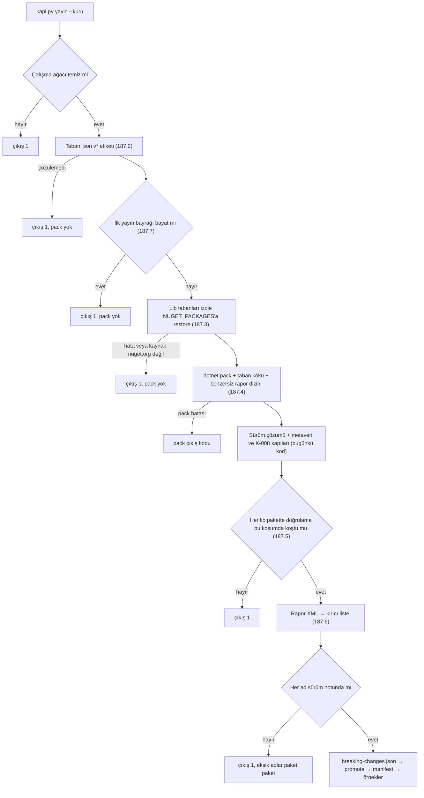

# Faz 187 — Yayınlanmış Sürüme Karşı Kırıcı Değişiklik Kapısı

> **Durum:** 📋 Planlandı (2026-09-23)
> **Plan onayı:** Bakımcı, 2026-09-23 (engelleyici kararlar sohbette alındı)
> **Kaynak:** [ADAYLAR.md](ADAYLAR.md) · **F-270** (triaj bulgusu `P6P9`, alt bulgu 6)
> **Önkoşul:** [Faz 185](arsiv/fazlar/185-KARDES-PAKET-SURUM-SABITLEME.md) ve [Faz 186](arsiv/fazlar/186-SCRIPT-IZNI-ICERIK-PINI.md) kapanmış olmalı (sıra kararı) · aynı turun `kusur-giderme` kulvarları ana dalda olmalı. Denetim: "Bu Faza Başlarken" adım 3 · etkileşim: 187.9
> **Paketler:** Kaynak kodu değişen paket yok. 17 `lib` paketinin paketleme davranışı değişir (187.4). Aparat: `scripts/`, `Directory.Build.targets`, `src/Directory.Build.props`, `CHANGELOG.md`
> **Yeni paket:** Yok — ApiCompat .NET SDK'nın içindedir; yeni NuGet bağımlılığı yok, K-007 gerekmez · **Migration:** Yok
> **Public API:** Büyümüyor, daralmıyor — C# yüzeyine dokunulmaz. `wc -l src/*/PublicAPI.Shipped.txt` → 17 dosya × 1 satır (`#nullable enable`), toplam 17 (ölçüldü 2026-09-23; K-603 gereği boş). Strict mode bundan sonra TFM'ye özgü public üyeyi reddeder (187.4)
> **Tüketici yüzeyi:** site: `reference/versioning.md` ("Release notes" bölümüne bir söz) · `reference/changelog` (üretilen, `docs-site/scripts/build-changelog.mjs`; joker satırı düzelince değişir)
> · sevk edilen: `CHANGELOG.md` (site sayfası ve GitHub Release gövdesi ondan üretilir). XML `<example>` yok · paket `README.md`'si yok · `capabilities.md` satırı yok — yayın süreci ürün yeteneği değildir
> **Manuel test alanı:** `docs/manuel-test/01-KURULUM-VE-PAKETLEME.md` (`MT-PKG`) — numara uygulama anında alınır (bugün son `MT-PKG-129`; Faz 185 de ekleyebilir)

---

## Bu Faza Başlarken

> `faz-baslangic` skill'ini uygula. Liste o skill'in 2. adımıdır — **yalnız
> işaret edilen bölümleri oku.** Liste dışında doküman okunmaz.

1. Bu doküman
2. Kararlar — dosyanın tamamını **okuma**, yalnız grep'le:
   ```bash
   grep -n "^| \*\*K-60[234] \|^| \*\*K-421 \|^| \*\*K-825 \|^| \*\*K-633 \|^| \*\*K-850 " docs/KARARLAR.md
   ```
   **K-602** (tek sürüm hattı; preview'da yüzey daraltma kırıcı sayılmaz) ·
   **K-603** (`Shipped` GA'ya kadar boş) · **K-604** (`publish` işleri
   `release-dryrun`'a bağlı) · **K-421** (Unshipped takibi) · **K-825** (sürüm
   bölümü etiket anında doğar) · **K-633** (`Tracon.Client` Unshipped takibi
   dışında) · **K-850** (Faz 182'nin 93 paket×tipi `internal` oldu)
3. Önkoşul denetimi ve Faz 185/186 devir notları: 185 `src/Directory.Build.props`'a
   hedef ekler ve güvenlik sürümünü yazar; 186 public yüzeyi değiştirir
   (187.9). Bir faz arşivde yoksa 187 başlamaz.
   ```bash
   for n in 185 186; do
     f=$(find docs/arsiv/fazlar -name "$n-*.md" | head -1)   # zsh'te eşleşmeyen glob komutu düşürür
     if [ -z "$f" ]; then echo "❌ Faz $n kapanmamış — 187 başlamaz"; else awk '/## Sonraki Faza Devir Notu/,0' "$f"; fi
   done
   grep -n "^KATEGORI_ESIGI" scripts/dokuman-bakim.py    # boşsa K kategori kulvarı birleşmemiş
   grep -n "^### Deprecated" CHANGELOG.md                # boşsa Deprecated kulvarı birleşmemiş
   git tag -l 'v*' --sort=-v:refname | head -1           # güvenlik sürümü kesildi mi
   git log --oneline -1                                  # faz öncesi commit: kapanış --taban
   ```
4. Alan hafızası (paketleme ve yayın):
   - [`hafiza/paketleme-ve-dagitim.md`](hafiza/paketleme-ve-dagitim.md) — yeni tuzaklar buraya; başlıkları tara. Bütçe 16.000 B; bugün 11.895 B, kulvardan sonra 13.091 B, 185 de yazar (ölçüldü 2026-09-23). Yazmadan önce `wc -c`.
   - [`hafiza/yayin-ve-surumleme.md`](hafiza/yayin-ve-surumleme.md) — yalnız MinVer bölümleri (bugün `sed -n 11,97p`): etiketsiz sürüm `1.0.0-preview.N.<yükseklik>`'tir.
   - [`hafiza/build-ve-analyzer.md`](hafiza/build-ve-analyzer.md) — yalnız `grep -n IsAotCompatible` satırı: `src/Directory.Build.props` csproj gövdesinden önce yüklenir.
   - [`hafiza/kod-haritasi.md`](hafiza/kod-haritasi.md) — yalnız satır 14-15; bu faz ikisini düzeltir.

---

## Amaç

`1.0.0-preview.1` ve `.2` 2026-09-20'de nuget.org'a çıktı (`CHANGELOG.md:146`,
`:182`). O günden beri public yüzey küçüldü:
`git diff --numstat v1.0.0-preview.2 HEAD -- 'src/*/PublicAPI.Unshipped.txt'` →
5 ekleme, 656 silme (Unshipped toplamı 9.120 satır). Değişikliğin tek listesi
elle yazılan `CHANGELOG.md`'dir; hiçbir kapı onu yayınlanmış pakete karşı
denetlemez. K-602 preview'da kırıcı değişikliğe izin verir; bu faz izni
kaldırmaz, yalnız duyuruyu zorlar. Listeyi makine çıkarır, insan adlandırır.

- **F-270** — Yayın provası son `v*` sürümüne karşı paket doğrulaması koşar. Kırılan her public tip ve düşen her TFM sürüm notunda adıyla geçmezse prova kırmızıdır ve `publish` koşmaz (K-604). Strict mode açılır; bayat yorumlar ve ölü anahtarlar temizlenir.

### Bugün ne çalışmıyor — doğrulanmış kanıt

> Doğrulandı: 2026-09-23, HEAD `bb9953e3`. SDK satırları `global.json`'un
> seçtiği `10.0.100`'ün kurulu dosyalarından okundu.
> `KARARLAR-INDEKS-REDDEDILEN.md`'de ilgili kayıt yoktur. **Satır numaraları
> kayar:** 185, 186 ve kulvarlar birleşince değişir (ölçüldü: kulvar
> `wf_64ac0fcb-10c-4` `Directory.Build.props:58`'i `:60`'a,
> `scripts/dokuman-bakim.py:910`'u `:951`'e taşır). Oturum her kanıtı
> **sembolle** grep'ler.

Her kanıt kullanıldığı bölümde bir kez durur (187.3–187.8). Başka bölümün
kullanmadığı iki kanıt:

| Kanıt | Gözlem |
|---|---|
| `scripts/kapi.py:1380` | Prova pack'i taban özelliği taşımaz; hiçbir kod yolu `PackageValidationBaselineVersion` vermez |
| `src/Tracon.Client/Tracon.Client.csproj:17` | `TraconPublicApiTrackingEnabled=false`. Client'ın kırıcı değişikliği Unshipped diff'inde görünmez (K-633); onu yalnız taban doğrulaması görür |

### Kapsam dışı

- **`NU5104`** (triaj alt bulgusu 9) — kapandı; yalnız referans. Kararlı pack
  `Tracon.AspNetCore`'da beş ön sürüm bağımlılık yüzünden durur (K-008).
- **K-603** — `Shipped` dolumu GA'da kalır; `PublicAPI.*.txt`'e dokunulmaz.
- **Günlük döngü** (`ic-dongu`, `kapanis`, CI `pack`) taban doğrulaması koşmaz
  (karar 1).
- **`ReleaseArtifactFixture` gölgesi** (187.3) düzeltilmez; ayrı aday olur.

---

## Tasarım — bağlayıcı kararlar

Bakımcı engelleyici soruları plan yazılmadan önce yanıtladı. Aşağıdakilerin
hepsi **(kullanıcı kararı, 2026-09-23)**'dir ve tartışmaya açık değildir.

| # | Karar |
|---|---|
| 1 | Son yayınlanmış sürüme karşı paket doğrulaması **yalnız yayın provasında** koşar: `python3 scripts/kapi.py yayin` (CI `release-dryrun` her push'ta koşar). Her `dotnet pack`'te koşmaz. Günlük döngü ve K-603 değişmez. Makine üretimi kırıcı liste `CHANGELOG.md` ile karşılaştırılır |
| 2 | `CHANGELOG.md`'de adıyla geçmeyen kırılmış bir public tip **her koşumu** kırar, `release-dryrun` dahil. Notlar `changelog.read_release_notes` ile okunur, `section_body('Unreleased')` ile değil — etiket anında `[Unreleased]` başlığı yeniden adlandırılır (K-825) |
| 3 | Strict mode (TFM'ler arası aynı public yüzey) `src/Directory.Build.props`'ta **koşulsuz** açılır. `Directory.Build.targets:20-28`'deki ölü `EnablePackageValidationGate` bloğu silinir. `src/Directory.Build.props:86-94`'teki bayat "has not shipped yet" yorumu düzeltilir. Triajın "20 paket geçiyor" iddiası temiz bir ölçümle yeniden ölçülür |
| 4 | Taban sürümü **otomatiktir**: HEAD'den önceki son `v*` etiketi (`git describe`) |
| 5 | `CHANGELOG.md` her tipi **tam adıyla** anar. Joker satırı (`*ChatClientFactory` / `*ModelCatalog`) açık adlarla yeniden yazılır |
| 6 | nuget.org'da tabanı olmayan (ilk kez yayınlanacak) paket **açık bir csproj bayrağıyla** muaf tutulur |
| 7 | Taban paketi **izole bir `NUGET_PACKAGES`'a** restore edilir, asla geliştirici cache'ine değil |
| 8 | TFM düşürme (`PKV006`) **kırıcı sayılır**; `CHANGELOG.md`'de paket + TFM ile anılır. net8.0/net9.0 düşüşü 2026-11-10'dan sonraki ilk sürümde gelir (F-266) |
| 9 | Ölü `EnablePublicApiTracking` anahtarının akıbeti Açık Soru 2'dir |
| — | Triajın alt bulgusu (9) `NU5104` kapandı; yalnız referans verilir |

---

## 187.0 — Temiz ölçüm (ilk iş; kod yazmadan önce)

Triaj log'ları kayboldu ve strict iddiası yanlıştı: `Tracon.Client` ve `Tracon`
bayat semaphore yüzünden atlandı, `Tracon.Cli` hiç doğrulanmadı. İlk iş yedi
ölçümdür; sonucu adımın altına yaz. Tabana dokunan her komut izole cache
kullanır (karar 7). Kabuk durumu çağrılar arasında kalmaz; her çağrı üç
değişkeni yeniden tanımlar (`SCRATCH` sabit yoldur):

```bash
REPO=$(git -C /Users/farukatasoy/Desktop/projects/Tracon rev-parse --show-toplevel)
SCRATCH="${TMPDIR:-/tmp}/tracon-187-olcum"; mkdir -p "$SCRATCH"   # depo DIŞINDA
SEM=Microsoft.NET.ApiCompat.ValidatePackage.semaphore
```

1. **Taban.** `git -C "$REPO" describe --tags --abbrev=0 --match 'v*'` → bugün
   `v1.0.0-preview.2`; güvenlik sürümü kesildiyse `v1.0.0-preview.3` ve adım
   3'ün listesi küçülür.
2. **Strict mode, 20 paket.**
   ```bash
   find "$REPO/artifacts/obj" -name "$SEM" -delete
   date; dotnet pack "$REPO/Tracon.src.slnf" -c Release -o "$SCRATCH/strict" -p:TraconSkipCleanWorkingTreeCheck=true \
     -p:EnableStrictModeForCompatibleTfms=true -p:EnableStrictModeForCompatibleFrameworksInPackage=true \
     > "$SCRATCH/strict.log" 2>&1; echo "EXIT=$?"
   for c in "$REPO"/src/*/*.csproj; do echo "$c → $(dotnet msbuild "$c" -getProperty:IntermediateOutputPath -p:Configuration=Release)"; done
   find "$REPO/artifacts/obj" -name "$SEM" -exec ls -l {} +
   ```
   `packable_project_ids` 20 proje verir: 17 `library`, `Tracon` (meta),
   `Tracon.Templates` (content), `Tracon.Cli` (tool). Her biri için yaz.
   Beklenen: 17 lib `EXIT=0`, semaphore `date`'ten yeni ve `-getProperty`
   yolunda · meta ve Templates semaphore yeni, `lib/` yok → "boş karşılaştırma"
   · Cli semaphore yok → sebebi `-v:d` log'unda `RunPackageValidation` aranarak
   yazılır. Yolun harfini de yaz: bugün macOS'ta lib `artifacts/obj/<P>/Release/`,
   Templates `artifacts/obj/Tracon.Templates/release/`. APFS farkı gizler;
   `release-dryrun` harf duyarlı Linux'ta koşar. Lib kırmızıysa Açık Soru 4.
3. **Taban listesi.**
   ```bash
   NUGET_PACKAGES="$SCRATCH/nuget" dotnet pack "$REPO/Tracon.src.slnf" -c Release -o "$SCRATCH/pv" \
     -p:TraconSkipCleanWorkingTreeCheck=true -p:PackageValidationBaselineVersion=<adım 1> > "$SCRATCH/pv.log" 2>&1; echo "EXIT=$?"
   grep -o "error CP00[0-9]*" "$SCRATCH/pv.log" | sort | uniq -c
   ```
   Taban preview.2 ise triaj değeri beklenir: çıkış 1; 279 `CP0001` + 6
   `CP0002` (her biri üç TFM'de); 10 pakette 93 ayrık tip + 2 üye — Core 69 + 2
   üye, Abstractions 11, OpenAI 3, Anthropic/Azure/Google 2'şer, üç SQL
   paketinde `MigrationRunner`, Voice 1 (K-850 ile tutarlı); artı Faz 186
   (187.9). Paket paket yaz.
4. **`PKV006` biçimi** (187.6 fikstürü):
   ```bash
   git -C "$REPO" worktree add "$SCRATCH/wt" HEAD
   NUGET_PACKAGES="$SCRATCH/nuget" dotnet pack "$SCRATCH/wt/src/Tracon.Voice" -c Release -o "$SCRATCH/tfm" \
     -p:TraconSkipCleanWorkingTreeCheck=true -p:TargetFrameworks=net10.0 -p:PackageValidationBaselineVersion=<adım 1> \
     -p:ApiCompatGenerateSuppressionFile=true -p:ApiCompatSuppressionOutputFile="$SCRATCH/voice-tfm.xml"
   ```
   `DiagnosticId`, `Target`, `Left`, `Right` alanlarını yaz. **Doğrulanmadı —
   ölçülmeli.**
5. **Zorlama.** Triaj listesinde olmayan bir lib paketi (ör. `Tracon.Mcp`), iki
   kez, her seferinde yeni çıktı yoluyla:
   ```bash
   for i in 1 2; do
     NUGET_PACKAGES="$SCRATCH/nuget" dotnet pack "$REPO/src/Tracon.Mcp" -c Release -o "$SCRATCH/mcp$i" \
       -p:TraconSkipCleanWorkingTreeCheck=true -p:PackageValidationBaselineVersion=<adım 1> \
       -p:ApiCompatGenerateSuppressionFile=true -p:ApiCompatSuppressionOutputFile="$SCRATCH/mcp$i.xml"
     find "$REPO/artifacts/obj/Tracon.Mcp" -name "$SEM" -exec ls -l {} +; ls -l "$SCRATCH/mcp$i.xml"
   done
   ```
   Yok olan girdi dosyası `RunPackageValidation`'ı yeniden koşturuyor mu
   (ikinci koşumda semaphore dokunuldu mu)? **Doğrulanmadı — ölçülmeli.**
6. **Farksız paket.** Adım 5'in `mcp1.xml`'i: fark yokken SDK dosyayı yazıyor
   mu, boş mu yazıyor, hiç yazmıyor mu? Sonuç 187.5'i ve Faz 191 sözleşmesini
   (187.9) belirler. **Doğrulanmadı — ölçülmeli.**
7. **Aşırı girdi fikstürü (Core, sabit preview.2).**
   ```bash
   find "$REPO/artifacts/obj/Tracon.Core" -name "$SEM" -delete
   NUGET_PACKAGES="$SCRATCH/nuget" dotnet pack "$REPO/src/Tracon.Core" -c Release -o "$SCRATCH/core" \
     -p:TraconSkipCleanWorkingTreeCheck=true -p:PackageValidationBaselineVersion=1.0.0-preview.2 \
     -p:ApiCompatGenerateSuppressionFile=true -p:ApiCompatSuppressionOutputFile="$SCRATCH/core.xml"; echo "EXIT=$?"
   grep -c "<Suppression>" "$SCRATCH/core.xml"; grep -c "<IsBaselineSuppression>true" "$SCRATCH/core.xml"
   find "$REPO/src" -name CompatibilitySuppressions.xml      # boş olmalı
   ```
   Beklenen (triaj): çıkış 0; 213 kayıt (207 `CP0001`, 6 `CP0002`), hepsi
   `IsBaselineSuppression=true`, ~58 KB; 186'nın kayıtları eklenebilir. Biçim
   DocId'dir: `T:Tracon.AgentCallGraph`,
   `M:Tracon.TenantProviderCredentialResolver.ValidatePrefix(System.String)`.
   Dosyanın **tamamı** `scripts/testdata/breaking-changes/core-preview2.xml`
   olur (hata modu 24); mutlak yollar göreli yola çevrilir.

Sonra: `git -C "$REPO" worktree remove "$SCRATCH/wt"` ve `rm -rf "$SCRATCH"`.

---

## 187.1 — Kapı akışı

Taban ve restore pack'ten **önce** koşar; pack taban yolunu ister. Kırıcı kapı
sürüm çözümünden **sonra**, promote'tan **önce** koşar: not okumak çözümlenen
sürümü ister ve kırmızı koşum `artifacts/package/release`'e paket bırakmaz.



Mantık yeni `scripts/breaking_changes.py`'dedir. `scripts/kapi.py` onu iki
noktada çağırır: `release_rehearsal` (`:1336`) içinde pack'ten önce,
`_finish_release_rehearsal` (`:1399`) içinde promote'tan (`:1564-1574`) önce.
Sebep: Faz 191 aynı fonksiyonları değiştirir (187.9).

---

## 187.2 — Taban seçimi (karar 4)

- HEAD bir `v*` etiketi taşıyorsa (etiket koşumu) taban **bir önceki** `v*`
  etiketidir, yoksa HEAD'den erişilen son `v*` etiketidir:
  `git describe --tags --exact-match --match 'v*' HEAD` başarılıysa
  `git describe --tags --abbrev=0 --match 'v*' HEAD^`, değilse aynısı `HEAD`
  ile.
- Sürüm etiketten `v` atılarak alınır (`MinVerTagPrefix=v`,
  `src/Directory.Build.props:101`). Bugün `v1.0.0-preview.2` (commit
  `804d94b2`, ölçüldü 2026-09-23).
- **Sağlama:** çözümlenen sürüm tabandan büyük olmalıdır (NuGet SemVer;
  `1.0.0-preview.2.N` > preview.2). Eşitse kırmızı: kendisiyle karşılaştırma
  sessiz bir "kırıcı değişiklik yok" üretir.
- **Git yok, etiket yok, sığ klon** → kırmızı: "taban çözülemedi" + sebep;
  sessiz atlama yok. `scripts/kapi_test.py:970`
  `test_yayin_git_bulunamazsa_atlar_ve_packi_yine_de_dener` güncellenir. Git
  yokken temizlik denetimi yine uyarıyla atlanır (Faz 136); onun ikinci
  savunma hattı (MSBuild kapısı) vardır, taban adımının yoktur.
- CI: `release-dryrun` (`.github/workflows/ci.yml:334-375`) her push/PR'da
  koşar; `publish` (`:389`) ve `npm-publish` (`:450`) ona bağlıdır. Checkout
  `fetch-depth: 0` (`:343`); etiketler vardır. İşte NuGet cache adımı yoktur.

---

## 187.3 — İzole taban cache'i (karar 7)

Yalnız taban izole edilir; diğer bağımlılıklar normal cache'ten gelir.

1. Taban kümesi: profili `library` (`scripts/kapi.py:1162` `_package_profile`)
   olan ve `TraconPackageFirstRelease` taşımayan paketler; bugün 17.
2. **Depo dışında** geçici dizin (`tempfile.mkdtemp`): `NuGet.config`
   (`<clear/>` + yalnız nuget.org) ve tek restore projesi (`net10.0`, taban
   başına `<PackageDownload Include="<id>" Version="[<taban>]" />`); depo
   `Directory.Build.props`'u ona uygulanmaz.
3. `NUGET_PACKAGES=<geçici>/packages dotnet restore <proje> --configfile <geçici>/NuGet.config`
   (emsal `scripts/release_extension_samples.py:150-173`).
4. Her `<geçici>/packages/<id küçük>/<taban>/.nupkg.metadata` okunur; `source`
   `https://api.nuget.org/v3/index.json` değilse kırmızı (garantinin kanıtı).
5. Pack'e `-p:TraconPackageBaselineRoot=<geçici>/packages` ve
   `-p:TraconPackageBaselineVersion=<taban>` geçer; MSBuild
   `PackageValidationBaselinePath`'i türetir (187.4). Yol dolu olduğu için SDK
   `PackageDownload` eklemez (SDK `Microsoft.NET.ApiCompat.targets:18-24`).
6. Geçici dizin `finally` içinde silinir; iptal ve istisnada da.

🚨 **Tuzak — taban geliştirici cache'inden okunur.**
`PackageValidationBaselineVersion`'ı doğrudan vermek (triajın yaptığı gibi)
`PackageDownload` ekletir; o da cache'te bulduğunu kullanır. Bugün
`~/.nuget/packages/tracon.core/1.0.0-preview.1/.nupkg.metadata` kaynağı yerel
`artifacts/package/release`'tir (`tracon.abstractions`, `tracon.aspnetcore`
aynı): `tests/Tracon.Package.Tests/Infrastructure/ReleaseArtifactFixture.cs:19`
`Version = "1.0.0-preview.1"` ile paketler, `TemplateFixture` bu dizini feed
yapar. preview.2'nin 17 lib paketi `api.nuget.org`'dandır. Taban preview.1
olsaydı kapı yerel pakete karşı yeşil verirdi. CI'da gölge yoktur; yerel prova
ise bir yayın kanıtıdır.

---

## 187.4 — MSBuild bağlantısı

### Strict mode (karar 3)

- Bugün `src/Directory.Build.props:87-94` yorumu "Tracon has not shipped yet …
  a future phase adds PackageValidationBaselineVersion after the first release"
  der (`:90-93`); `EnablePackageValidation=true` (`:95`) yalnız TFM'ler arası
  denetler. `:95`'in yanına koşulsuz `EnableStrictModeForCompatibleTfms=true`
  ve `EnableStrictModeForCompatibleFrameworksInPackage=true` girer (adlar SDK
  `Microsoft.NET.ApiCompat.ValidatePackage.targets:48-49`'dan).
- `EnableStrictModeForBaselineValidation` **açılmaz**: tabana göre EKLEMEYİ de
  hata sayar; preview'da yüzey büyüyebilir.
- Yorum yeniden yazılır: her pack strict denetler; taban denetimi yalnız
  `kapi.py yayin`'de koşar; gerekçe yeni K satırıdır. Yorum faz dokümanına
  bağlanmaz (doküman arşive gider, yol bayatlar).
- `Directory.Build.targets:20-28` silinir: koşulu `EnablePackageValidationGate`'i
  hiçbir yer atamaz (`grep` yalnız bu bloğu ve `docs/hafiza/kod-haritasi.md:15`'i
  bulur).

### Taban bağlantısı — `Directory.Build.targets`

Koşul csproj gövdesine bakar; props gövdeden önce yüklenir
(`hafiza/build-ve-analyzer.md:25`). Koşul (hepsi):
`'$(TraconPackageBaselineRoot)' != ''` · `'$(IsPackable)' == 'true'` ·
`'$(IncludeBuildOutput)' != 'false'` · `'$(PackAsTool)' != 'true'` ·
`'$(TraconPackageFirstRelease)' != 'true'`. Türetilenler "Planlanan Public
API" tablosundadır. Kimlik `$(MSBuildProjectName)`'dir: depo sözleşmesi proje
adı = paket kimliğidir (`scripts/kapi.py:1150` `packable_project_ids`);
`PackageId`'nin bu noktada atandığı ölçülmedi. Kökü yalnız `kapi.py yayin`
verir; boşken hiçbir şey türetilmez (karar 1).

🚨 **Tuzak 1 — rapor kaynak ağacına yazılır.** Üretim bayrağı açık ve çıktı
yolu boşsa SDK `$(MSBuildProjectDirectory)/CompatibilitySuppressions.xml`'e
yazar (SDK `Microsoft.NET.ApiCompat.Common.targets:47-49`). Dosya varsa sonraki
**her** pack onu bastırma girdisi okur (`:53-55`) ve kırılmayı kalıcı gizler.
Bugün `src/*/CompatibilitySuppressions.xml` yok. Önlem: (a) bayrak ve yol
birlikte, yalnız yukarıdaki koşulda türetilir; (b) `kapi.py` bayrağı **asla**
global vermez (meta/içerik/tool `src/` altına yazardı); (c)
`src/**/CompatibilitySuppressions.xml` birim testiyle yasaktır.

🚨 **Tuzak 2 — tek dosya.** Global çıktı yolu 17 projeyi aynı dosyaya yazdırır;
yol proje adından türetilir.

🚨 **Tuzak 3 — üretim her hatayı yutar.** Bayrak strict hataları da dosyaya
çevirir; provada strict hata pack'i kırmaz. Kapı `IsBaselineSuppression=false`
kaydını hata sayar (187.6). Diğer pack'lerde strict hata pack'i yine kırar.

---

## 187.5 — Doğrulamanın gerçekten koştuğunun kanıtı

`RunPackageValidation` artımlıdır (SDK `ValidatePackage.targets:19-26`).
Girdiler: `@(NuGetPackInput)`, bastırma girdileri, bastırma çıktı dosyası.
Çıktı: `$(IntermediateOutputPath)Microsoft.NET.ApiCompat.ValidatePackage.semaphore`
(`:14`). Strict ve taban özellikleri girdi değildir.

- **Zorlama.** Rapor dizini koşum başına benzersizdir (`tempfile.mkdtemp`,
  `artifacts/package/api-compat/` altında); çıktı dosyası önceden yoktur. Yok
  olan girdinin hedefi koşturması beklenir (187.0 adım 5); tutmazsa `kapi.py`
  pack'ten önce beklenen semaphore'ları siler.
- **Yol.** Kod yolu tahmin etmez: dosyayı `artifacts/obj/<P>/` altında bir alt
  dizin derinliğinde **adıyla** arar, üst dizin adını harf duyarsız `release`
  ile eşler (`Release` ve `release`). Tam bir eşleşme beklenir; sıfır veya çok
  eşleşme kırmızıdır ve mesaj aranan yolu yazar. Sonuç 187.0 adım 2'nin
  `-getProperty` yoluyla aynıdır.
- **Kanıt.** Her beklenen lib paketinin semaphore'u pack başlangıcından sonra
  dokunulmuştur (`Touch AlwaysCreate`, `:61-62`); değilse kırmızı: "`<paket>`:
  paket doğrulaması bu koşumda koşmadı". SDK iç adı değişirse kapı kırmızı
  döner (güvenli yön); mesaj bunu söyler. Kanıt **pack'i koşan süreçte**
  hesaplanır; semaphore o makinenin `artifacts/obj/`'undadır (187.9, Faz 191).
- **Taban bağlıydı kanıtı:** 187.3 adım 4 + `PackageBaselineWiringTests`. 187.0
  adım 6 farksız pakette de dosya yazıldığını gösterirse kanıt paket başına
  rapor dosyasına geçer.

---

## 187.6 — Kırıcı liste ve sürüm notu eşleşmesi

### Rapor → kırıcı liste

Her `<proje>.xml` okunur; bozuk XML → kırmızı. Her kayıt **ilk eşleşen**
kurala göre işlenir:

| Kayıt | Sonuç |
|---|---|
| `IsBaselineSuppression=false` | Strict uyumsuzluk → kırmızı (187.4 tuzak 3) |
| `DiagnosticId` `CP*` ve `Target` DocId (`T:`, `M:`, `P:`, `F:`, `E:`) | Tipe indirgenir → kırıcı liste. `CP0001`, `CP0002`, `CP0005`, `CP0006`, `CP0008`, `CP0009` ve DocId hedefli her `CP` kodu |
| `DiagnosticId` = `PKV006` | (paket, TFM) → düşen TFM. Paket rapor dosyasının adıdır; TFM alanı 187.0 adım 4'te ölçülür |
| Diğer her kayıt — `PKV007` (RID varlığı düştü), DocId olmayan `CP` hedefi | Kırmızı: "tanınmayan kayıt `<id>` `<target>` — kapı genişletilmeli" |

DocId indirgeme: `T:` → tip; `M:`, `P:`, `F:`, `E:` → bildiren tip, üye ve
parametreler atılır (`M:Tracon.TenantProviderCredentialResolver.#ctor(...)` →
`TenantProviderCredentialResolver`). Jenerik arity (`` `1 ``) ve ad alanı
atılır; iç içe tipte son bölüm kalır. Üç TFM tekrarı tek kayıttır.

### Sürüm notlarının okunması (karar 2, K-825)

- `changelog.read_release_notes(CHANGELOG.md, <çözümlenen sürüm>)`
  (`scripts/changelog.py:78`): sürüm bölümü, yoksa `[Unreleased]`; ikisi de
  boşsa `(None, None)`.
- Bugünkü not kapısı yalnız sürüm biçimli koşumda okur
  (`scripts/kapi.py:1433-1467`) ve değişmez; kırıcı kapı **her** koşumda okur.
- Kesilmiş ama etiketlenmemiş sürümde sonuç `(None, None)`'dır; davranış
  **Açık Soru 1**'e bağlıdır (kod yazılmadan bakımcıya sorulur).
- Liste boşsa not okunmaz; boş not + boş liste yeşildir.

### Eşleşme kuralı (karar 5 ve 8)

- **Tip.** Bir code span (`` `…` ``) tipi adlandırır: span'den `<…>` ve `(…)`
  atılır, kalan `.` ile bölünür, bir bölüm tip adına **tam** eşittir. Kabul:
  `` `Ad` ``, `` `Ad<T>` ``, `` `Ns.Ad` ``, `` `Dis.Ad` ``, `` `Ad.Uye(...)` ``.
  Alt dize yok: `` `OpenAIChatClientFactoryOptions` ``
  `OpenAIChatClientFactory`'yi, `` `*ModelCatalog` `` `OpenAIModelCatalog`'u
  karşılamaz. Span dışı metin sayılmaz. Yer: notun herhangi bir alt bölümü
  (Açık Soru 3).
- **TFM düşüşü.** Aynı madde (liste öğesi + girintili devamı) içinde bir span
  paket kimliğine, biri TFM'ye **tam** eşittir: `` `Tracon.Core` `` ve
  `` `net8.0` `` (`` `Tracon.Core` `` `Tracon`'u karşılamaz); bir madde çok
  paket sayabilir. Sevk edilen
  politika (`docs-site/src/content/docs/reference/compatibility.md:45-47`) TFM
  düşüşünü SemVer'de kırıcı saymaz ama notta anılacağını söyler; kapı bu sözü
  zorlar.

### Çıktı

- **Kırmızı:** taban, not başlığı, paket paket eksik adlar; çıkış 1; release
  dizinine paket yazılmaz.
- **Yeşil:** `artifacts/package/breaking-changes.json` (taban, not başlığı,
  paket → tipler, paket → düşen TFM'ler). Release dizininin **dışındadır**; o
  dizin örneklerin yerel feed'idir (`scripts/release_extension_samples.py:157-164`).
- CLI: `python3 scripts/breaking_changes.py --rapor-dizini <dizin> --taban <sürüm> [--surum <sürüm>]` (Manuel 7).

### Joker satırı (karar 5)

`CHANGELOG.md:81-82` jokeri sekiz `internal` olmuş tipi tam adıyla anmaz:
`AnthropicChatClientFactory`, `AnthropicModelCatalog`,
`AzureOpenAIChatClientFactory`, `AzureOpenAIModelCatalog`,
`GoogleChatClientFactory`, `GoogleModelCatalog`, `OpenAIChatClientFactory`,
`OpenAIModelCatalog` (Unshipped diff'i ve `[Unreleased]` ile yeniden sayıldı,
2026-09-23). Kalan 85 tip adıyla geçer; iki `CP0002` üyesinin tipi
`TenantProviderCredentialResolver` `CHANGELOG.md:124`'tedir. Satır sekiz açık
adla yazılır (`OpenAIApiSurface` zaten açık); düzeltme kapıyla aynı commit'e
girer, yoksa taban preview.2 iken ilk koşum kırmızıdır. Güvenlik sürümü
kesildiyse satır o sürüm bölümündedir; karar 5 yine uygulanır, site sayfası
`build-changelog.mjs` ile yeniden üretilir.

---

## 187.7 — İlk yayın bayrağı (karar 6)

- Bayrak: csproj'da `<TraconPackageFirstRelease>true</TraconPackageFirstRelease>`.
  `kapi.py` o paketin tabanını restore etmez; `Directory.Build.targets` taban
  yolunu türetmez; strict doğrulama sürer.
- **Bayat bayrak:** paket taban etiketinde vardı (`git show <etiket>:src/<P>/<P>.csproj`
  var ve `IsPackable=false` taşımıyor) ama bayrak duruyor → kırmızı. Ağ gerekmez.
- Bugün bayrak yok; 21 `src/*/*.csproj`'un hepsi `v1.0.0-preview.2`'de var
  (`git cat-file -e`, ölçüldü 2026-09-23).
- `.agents/skills/faz-tamamlama/SKILL.md:62-67` yeni paket listesine madde:
  ilk yayına kadar bayrak, sonra kaldır.

---

## 187.8 — Doküman ve sınıf temizliği

Sınıf: "ilk yayından önce yazılmış, sonra yanlış kalan paketleme yorumu" ve
"hiçbir şeyin okumadığı MSBuild anahtarı". Aynı turun kulvarı bayat analyzer
yorumlarını düzeltir, 187.4'ün iki yerine dokunmaz. Her satırı düzenlemeden
önce `grep` ile ölç; kulvar düzelttiyse satır düşer.

| Yer | İş | Karar |
|---|---|---|
| 187.4'ün iki yeri | 187.4 | Karar 3 |
| `Directory.Build.props:58` `EnablePublicApiTracking` | Hiçbir props/targets okumaz; gerçek anahtar `src/Directory.Build.props:167,171` `TraconPublicApiTrackingEnabled`. Üstteki "Faz 7" yorumunu (`:52-57`) kulvar `wf_64ac0fcb-10c-4` yazar; anahtar kalır | AS 2 |
| `Directory.Build.targets:30-33` | "false iken … NoWarn" der; `NoWarn` Faz 60'ta kalktı (`docs/manuel-test/01-KURULUM-VE-PAKETLEME.md:2294`) | AS 2 |
| `README.md:14` | Ölü anahtarı "public API gate" diye anlatır | AS 2 |
| `scripts/dokuman-bakim.py:910-934` (`dokuman_iddia_cakismalari`), `scripts/dokuman_bakim_test.py:610-625`, `docs/manuel-test/33-DOKUMAN-KAPILARI.md:89` (`MT-DKP-014`) | Ölü anahtarın etkisiz değerini denetler | AS 2 |
| `.agents/skills/faz-planlama/SKILL.md:116` | "Faz 7" eşiğini kulvar GA'ya çevirir; anahtar adı kalır | AS 2 |
| `.agents/skills/faz-planlama/SKILL.md:120` | "Faz 7'den sonra kırıcıdır" → `1.0.0` GA (K-603) | Bu faz |
| `.agents/skills/faz-planlama/resources/faz-plani-sablonu.md:24` | "Faz 7'den önce ucuz" → GA'dan önce (K-603) | Bu faz |
| `.agents/skills/faz-denetim/SKILL.md:121` | Uyarıyı üreten anahtar `TraconPublicApiTrackingEnabled`'dır | AS 2 |
| `docs/hafiza/kod-haritasi.md:14-15` | 14: "`false` iken `NoWarn`" ve "Faz 7'de `true`" bayat; 15: ölü kapı → yeni taban bağlantısı | Bu faz |
| `docs/manuel-test/00-INDEKS.md:734-739` | "Faz 7 için iki eksik yüzey" bayat: `Tracon.Mcp`, `Tracon.Workflows` `PublicAPI.*.txt` taşır | Bu faz |
| `docs/YAYIN-HAZIRLIK.md` "Package validation sonucu incelendi" (bugün `:505`, kulvardan sonra `:507`) | Kutu yeni kapıya bağlanır | Bu faz |
| `docs/YAYIN-HAZIRLIK.md` §13 "GA turuna ertelenenler" (bugün `:620-625`) | Taban doğrulaması çıkar; `Shipped` dolumu (K-603) kalır | Bu faz |
| `docs/hafiza/paketleme-ve-dagitim.md` | Tuzaklar: 187.3, 187.4 (1-3), 187.5 semaphore ve yol harfi | Bu faz |
| `docs/hafiza/yayin-ve-surumleme.md` | Kesim commit'i ve etiket tek komutla itilir | AS 1 = C ise |
| `docs-site/src/content/docs/reference/versioning.md:20-25` | "Release notes"a bir söz: not, önceki yayından beri kaldırılan veya değişen her public tipi ve düşen her TFM'i adıyla anar; yayın süreci bunu makine listesiyle denetler | Bu faz |

K-421 başlığı ölü anahtarın adını taşır; satır silinmez, yeniden yazılmaz. AS 2
= B ise sonuna bir not eklenir.

---

## 187.9 — Komşu fazlarla etkileşim

| Faz / aday | Etkileşim |
|---|---|
| 185 (F-265) | `src/Directory.Build.props`'a bir hedef ekler; 187 onu korur. Güvenlik sürümü 185'ten sonra kesilirse taban `v1.0.0-preview.3`'tür ve Faz 182'nin 93 tipi listede yoktur |
| 186 (F-269) | `SandboxedSkillScriptRunner.RunStoredScriptAsync`'in imzası değişir (bugün `src/Tracon.Core/Skills/Scripts/SandboxedSkillScriptRunner.cs:171`, `src/Tracon.Core/PublicAPI.Unshipped.txt:327`). Taban 186'dan önceyse ilk koşum `Tracon.Core`'da `SandboxedSkillScriptRunner` için `CP0002` bekler; 186'nın `CHANGELOG.md` girdisi tipi code span olarak anmalıdır, anmıyorsa 187 ekler. `ISkillScriptGrantStore`'un imzası değişmez. Yeni özellikler (`SkillScriptGrant.ContentHash` vb.) eklemedir; `EnableStrictModeForBaselineValidation` kapalı olduğu için raporlanmaz |
| 188/189 (F-271) | İlk gerçek tüketici. Kurucu daraltması `CP0002` üretir; her bildiren tip notta adıyla geçer |
| 190 (F-272) | Public tipe dokunursa aynı kural |
| 191 (F-273) | `kapi.py yayin` ve `ci.yml`'yi 187'den sonra değiştirir; pack'i CI build işine taşır (191.8). 191.8 187'yi `PackageValidationBaselineVersion` geçiren tasarım sanır; bu plan onu vermez (187.3 tuzak). 191'in taşıyacağı sözleşme: (1) tek pack komutu üç `-p` alır — `TraconPackageBaselineRoot`, `TraconPackageBaselineVersion`, `TraconApiCompatReportDir`; (2) taban restore'u (187.3) aynı işte pack'ten **önce** koşar; (3) koşum kanıtı (187.5) pack'i koşan işte hesaplanır, ya da 187.0 adım 6 SDK'nın her pakete rapor yazdığını gösterirse kanıt paket başına rapora geçer ve raporlar artifact'la taşınır. Sözleşme devir notuna yazılır |
| F-266 (net8.0/net9.0 düşüşü) | `PKV006` üretir; düşüş fazının `### Removed` maddesi 17 lib kimliğini ve `net8.0`, `net9.0`'ı code span olarak taşır. Kulvarın `### Deprecated` notu kırıcı değildir |

---

## 187.10 — Açılacak kararlar (numara rezerve edilmez)

K-855'ten itibaren her K satırı kategori etiketi taşır; yalnız dört kategori K
alır: `public-api` · `güvenlik` · `kalıcı-veri` ·
geri dönüşü pahalı. Etiket biçimi kulvarın kapısındadır.

- **K (yeni) — Yayın provası son yayınlanmış sürüme karşı kırıcı değişiklik
  kapısı koşar.** Kategori: `public-api`. `kapi.py yayin` (her push)
  son `v*` etiketine karşı ApiCompat taban doğrulaması koşar; makine listesi
  (kırılan tip, üyesi kırılan tip, düşen TFM) notta tam adıyla geçmezse prova
  kırmızıdır ve `publish` koşmaz (K-604). K-602 (kırıcı değişiklik serbest,
  duyurusuz sevk yasak) ve K-603 değişmez. YAYIN-HAZIRLIK §13'ün package
  validation ertelemesini taban için kapatır. Yeniden açılma: `1.0.0` GA —
  `Shipped` dolunca kural "adlandır"dan "reddet"e döner.
- **K (yeni) — Her lib paketinin public yüzeyi TFM'ler arasında aynıdır
  (strict mode).** Kategori: `public-api` · `geri-dönüşü-pahalı`.
  Yeniden açılma: yalnız bir TFM'de var olan bir BCL tipinin public imzaya
  girmesi gerçek bir ihtiyaç olduğunda.

Yerel kararlar K almaz; kapanışta "Bu Fazda Verilen Kararlar"a girer: iki
adımlı izole restore (187.3) · rapor dizini, semaphore kanıtı ve yol kuralı
(187.5) · `MSBuildProjectName` (187.4) · tanı kodu tablosu ve code span kuralı
(187.6) · `breaking-changes.json`'un yeri · git yokken kırmızı (187.2) ·
bayrağın adı (187.7) · Açık Soru 1, 3, 4, 5.

---

## Planlanan Public API

> C# public yüzeyi **değişmez**; tip başına maliyet satırı yoktur. Dolaylı
> etki: strict mode TFM'ye özgü public üyeyi yasaklar — bugün eklemek ucuzdu
> (pre-1.0, `Shipped` boş), GA'dan sonra kaldırmak kırıcı olurdu. Aşağısı depo
> içi sözleşmedir; `Directory.Build.*` sevk edilmez.

### MSBuild özellik sözleşmesi

| Özellik | Kim verir | Okuyan | Değer |
|---|---|---|---|
| `EnableStrictModeForCompatibleTfms` | `src/Directory.Build.props` | SDK | Koşulsuz `true` |
| `EnableStrictModeForCompatibleFrameworksInPackage` | `src/Directory.Build.props` | SDK | Koşulsuz `true` |
| `TraconPackageBaselineRoot` | `kapi.py yayin` (`-p:`) | `Directory.Build.targets` | İzole cache kökü; boşsa hiçbir şey türetilmez |
| `TraconPackageBaselineVersion` | `kapi.py yayin` (`-p:`) | `Directory.Build.targets` | Taban sürüm, `v`'siz |
| `TraconApiCompatReportDir` | `kapi.py yayin` (`-p:`) | `Directory.Build.targets` | Koşum başına benzersiz rapor dizini |
| `TraconPackageFirstRelease` | csproj | `Directory.Build.targets` + `breaking_changes.py` (metin) | `true` → taban doğrulaması yok |
| `PackageValidationBaselinePath` | Türetilir | SDK | `$(TraconPackageBaselineRoot)/<ad küçük>/<sürüm>/<ad küçük>.<sürüm>.nupkg` |
| `ApiCompatGenerateSuppressionFile` | Türetilir | SDK | `true` |
| `ApiCompatSuppressionOutputFile` | Türetilir | SDK | `$(TraconApiCompatReportDir)/$(MSBuildProjectName).xml` |

### `scripts/breaking_changes.py` — imza taslağı

```python
resolve_baseline(root) -> str                                   # 187.2; çözülemezse BaselineError
baseline_package_ids(root) -> list[str]                         # 187.3 adım 1
stale_first_release_flags(root, baseline_tag) -> list[str]      # 187.7
restore_baselines(ids, version, work_dir) -> Path               # 187.3; izole cache kökü
baseline_source_violations(ids, version, cache) -> list[str]    # 187.3 adım 4
semaphore_path(root, project_id) -> Path                        # 187.5; yok/çoksa SemaphoreError
validation_not_run(root, ids, since: float) -> list[str]        # 187.5
read_breaking_changes(report_dir) -> BreakingChanges            # 187.6 tanı kodu tablosu
release_notes_for(changelog, version, baseline) -> tuple[str | None, str | None]
unnamed_changes(changes, notes) -> list[str]                    # 187.6 eşleşme kuralı
```

### `kapi.py yayin --kuru` çıktısı (yeni satırlar)

- `Taban: v<sürüm> (git describe)`
- `Taban paketleri izole cache'ten: <n> paket, kaynak api.nuget.org`
- Yeşil: `Kırıcı liste: <n> tip, <m> TFM düşüşü, <k> paket — hepsi '<başlık>' notunda` + `breaking-changes.json` yolu
- Kırmızı: `❌ Kırıcı değişiklik sürüm notunda adıyla geçmiyor (taban v<sürüm>, not '<başlık>'):` + paket başına bir satır

### HTTP `endpoint`'leri

Yok.

### Arayüz payı

Yok.

---

## Planlanan Dosya Listesi

```
scripts/
├── breaking_changes.py            (yeni — taban, izole restore, kanıt, rapor, eşleşme, CLI)
├── breaking_changes_test.py       (yeni — birim)
├── testdata/breaking-changes/core-preview2.xml  (yeni — 187.0 adım 7'nin tam raporu)
├── kapi.py                        (release_rehearsal: taban + üç -p; _finish_release_rehearsal: kapı)
├── kapi_test.py                   (YayinTestleri: sıra, git-yok :970)
├── dokuman-bakim.py               (AS 2'ye göre dokuman_iddia_cakismalari)
└── dokuman_bakim_test.py          (AS 2'ye göre :610-625)
src/Directory.Build.props          (strict mode; :87-94 yorumu)
Directory.Build.targets            (:20-28 silinir; taban bağlantısı; :30-33 yorumu)
Directory.Build.props              (AS 2'ye göre EnablePublicApiTracking)
README.md                          (AS 2'ye göre :14)
CHANGELOG.md                       (:81-82 joker satırı)
tests/Tracon.Package.Tests/PackageBaselineWiringTests.cs  (yeni — paket seviyesi)
docs/
├── YAYIN-HAZIRLIK.md              (package validation kutusu; §13)
├── KARARLAR.md, KARARLAR-INDEKS.md (kapanışta — iki K satırı, etiketli)
├── hafiza/paketleme-ve-dagitim.md (tuzaklar)
├── hafiza/kod-haritasi.md         (:14-15)
├── hafiza/yayin-ve-surumleme.md   (yalnız AS 1 = C ise)
└── manuel-test/
    ├── 01-KURULUM-VE-PAKETLEME.md (MT-PKG case'leri)
    ├── 00-INDEKS.md               (:734-739)
    └── 33-DOKUMAN-KAPILARI.md     (AS 2'ye göre :89)
.agents/skills/
├── faz-planlama/SKILL.md          (:116 anahtar adı; :120 eşik)
├── faz-planlama/resources/faz-plani-sablonu.md  (:24 eşik)
├── faz-denetim/SKILL.md           (:121)
└── faz-tamamlama/SKILL.md         (:62-67 ilk yayın bayrağı)
docs-site/src/content/docs/reference/versioning.md
```

Paket içeriği değişmez. `CHANGELOG.md`'ye yeni madde yazılmaz; yalnız joker
satırı düzelir.

---

## Hata Modları ve Testler

Bu fazın sınırı **paket** ve **süreç**tir: MSBuild değerlendirmesi ve gerçek
`dotnet pack` birim testinde görünmez
([`test-seviyeleri.md`](../.agents/ortak/test-seviyeleri.md)). **Birim** =
`scripts/*_test.py` (geçici dizin, geçici git deposu, sahte alt süreç) ·
**Paket** = `tests/Tracon.Package.Tests` (gerçek `dotnet msbuild -getProperty`
ve `dotnet pack`, `[Collection(RepositoryTreeGate.Name)]`, emsal
`PackCleanlinessGateTests.cs`) · **Manuel** = MT-PKG · **CI** = gerçek
`release-dryrun` (Linux).

| # | Ne bozulabilir | Seviye | Test |
|---|---|---|---|
| 1 | Etiketli HEAD'de taban kendi etiketi → sessiz yeşil | Birim (git deposu) | `TabanSecimiTestleri.test_etiketli_headde_taban_bir_onceki_etikettir` · `test_etiketsiz_headde_taban_son_etikettir` |
| 2 | Sürüm tabana eşit | Birim | `test_surum_tabana_esitse_kirmizi` |
| 3 | Etiket yok / sığ klon / git yok → kapı atlanır | Birim | `test_taban_cozulemezse_pack_denenmez` · `kapi_test.py:970` güncellenir |
| 4 | Taban geliştirici cache'inden okunur | Birim + Manuel | `IzoleRestoreTestleri.test_restore_izole_cache_ve_yalniz_nugetorg_kullanir` · `test_kaynak_nugetorg_degilse_kirmizi` · Manuel 4 |
| 5 | Alt sistem: nuget.org erişilemez; taban nuget.org'da yok | Birim (sahte restore) | `test_restore_hatasi_paketi_adiyla_bildirir_pack_denenmez` (AS 5) |
| 6 | Rapor `src/` altına yazılır; commit'lenen dosya kırılmayı kalıcı gizler | Paket + Birim | `PackageBaselineWiringTests.ReportPathIsUnderReportDirPerProject` · `test_depoda_compatibility_suppressions_dosyasi_yok` |
| 7 | 17 proje aynı rapora yazar | Paket | `PackageBaselineWiringTests.ReportPathsAreDistinct` |
| 8 | Taban yolu meta/içerik/tool'a veya bayraklı pakete türetilir; ya da bir lib pakete türetilmez | Paket | `PackageBaselineWiringTests.BaselinePathIsDerivedOnlyForLibraryPackages` — 20 paket, `kapi.py` profil listesiyle |
| 9 | Günlük döngü etkilenir (kök boşken bir şey türetilir) | Paket | `PackageBaselineWiringTests.NothingIsDerivedWithoutBaselineRoot` |
| 10 | Strict mode bir lib pakette kapalı | Paket | `PackageBaselineWiringTests.StrictModeIsOnForEveryLibraryPackage` |
| 11 | Doğrulama semaphore yüzünden sessizce atlanır | Birim + Paket (iki ardışık pack, kendi paketine karşı taban, ağ yok) | `DogrulamaKanitiTestleri.test_eski_semaphore_kirmizi` · `PackageBaselineWiringTests.SecondPackStillValidates` |
| 12 | Semaphore yolu yanlış çözülür (Linux'ta `Release` ≠ `release`) | Birim + CI | `test_semaphore_yolu_harf_duyarsiz_bulunur` · `test_semaphore_bulunamazsa_aranan_yol_mesajda` (beklenen: kırmızı, yol mesajda) · `release-dryrun` |
| 13 | Kırılan tip notta yok → yeşil | Birim + Manuel | `SurumNotuEslesmeTestleri.test_eksik_tip_adiyla_raporlanir` · Manuel 2 |
| 14 | Joker kabul edilir | Birim + Manuel | `test_joker_kabul_edilmez` · Manuel 3 |
| 15 | Uzun ad kısa adı karşılar (`OpenAIChatClientFactoryOptions`; `Tracon.Core` → `Tracon`) → sessiz yeşil | Birim | `test_uzun_ad_kisa_adi_karsilamaz` · `test_paket_kimligi_tam_esitlik_ister` |
| 16 | DocId yanlış indirgenir (jenerik, üye, `#ctor`, iç içe, ad alanı, `CP0008`) | Birim | `KiriciListeTestleri.test_docid_indirgeme` · `test_cp0008_docid_ile_indirgenir` |
| 17 | Üç TFM tekrarı üç kayıt olur | Birim | `test_tfm_tekrari_tek_kayit` |
| 18 | TFM düşüşü (`PKV006`) sayılmaz | Birim (187.0 adım 4 fikstürü) + Manuel | `test_pkv006_paket_ve_tfm_ister` · Manuel 7 |
| 19 | Strict hata (`IsBaselineSuppression=false`) dosyaya düşer ve geçer | Birim | `test_taban_disi_kayit_kirmizi` |
| 20 | Tanınmayan kayıt (`PKV007`, DocId olmayan hedef) veya bozuk XML geçer | Birim | `test_pkv007_kirmizi` · `test_docid_olmayan_hedef_kirmizi` · `test_bozuk_xml_kirmizi` |
| 21 | Etiket koşumunda sürüm bölümü okunmaz (K-825) | Birim + Manuel | `test_etiket_kosumunda_surum_bolumu_okunur` · Manuel 9 |
| 22 | Kesilmiş, etiketlenmemiş sürüm → yanlış kırmızı ya da yeşil | Birim + Manuel | `test_kesilmis_etiketsiz_surum` (AS 1'e göre) · Manuel 10 |
| 23 | Boş girdi: liste ve not boş → yanlış kırmızı | Birim | `test_bos_liste_bos_notla_gecer` |
| 24 | Aşırı girdi: tam Core raporu yanlış indirgenir | Birim | `test_gercek_rapor_fikstur` — `core-preview2.xml` (187.0 adım 7); beklenen sayı adım 7'nin ölçümüdür (triaj: 69 tip + 1 üye tipi) |
| 25 | Bayraklı paketin tabanı restore edilir → pack durur | Birim + Paket | `IlkYayinBayragiTestleri.test_bayrakli_paket_restore_listesinde_yok` · satır 8 |
| 26 | İlk yayın bayrağı yayından sonra unutulur | Birim (git deposu) + Manuel | `test_tabanda_var_olan_pakette_bayrak_kirmizi` · Manuel 5 |
| 27 | Strict mode TFM'ye özgü üyeyi yakalamaz | Manuel | Manuel 6 |
| 28 | İptal (Ctrl-C) / istisna → geçici dizin kalır, yarım promote | Birim | `test_istisnada_gecici_dizinler_silinir_promote_yok` |
| 29 | Eşzamanlılık: iki prova birbirinin raporunu okur | Birim | `test_rapor_dizini_kosum_basina_benzersiz`. Semaphore paylaşımı çözülmez: Faz 136 paralel provayı desteklemez |
| 30 | Kapı promote'tan sonra koşar → kırmızı koşum paket bırakır | Birim | `YayinTestleri.test_kirici_kapi_kirmiziyken_promote_yok` |
| 31 | Gerçek ağ ve SDK ile uçtan uca | CI + Manuel | `release-dryrun` · Manuel 1, 8 |
| 32 | Başka kiracının kaydı | — | Uygulanmaz: build aracıdır, kiracı verisi yok |

Beş soru: iptal (28) · eşzamanlılık (29) · boş/aşırı girdi (23, 24) · başka
kiracı (32) · alt sistem hatası (3, 5, 12). Sözleşme testi gerekmez.

---

## Manuel Kabul Case'leri

> Kapanışta `docs/manuel-test/01-KURULUM-VE-PAKETLEME.md`'ye eklenir; hepsi
> otomatikleştirilebilir, `👤` yok. "Worktree" = `git worktree add <depo dışı>
> HEAD` (sonra `remove`). Etiket isteyen case **klon** kullanır
> (`git clone "$REPO" <depo dışı>`): worktree etiketleri ana depoyla paylaşır.

| # | Ön koşul | Adımlar | Beklenen sonuç |
|---|---|---|---|
| 1 | Temiz ağaç, HEAD etiketsiz | `python3 scripts/kapi.py yayin --kuru` | Çıkış 0; çıktı taban, "17 paket" ve `breaking-changes.json` yolunu yazar. Sonra `git status --porcelain` ve `find src -name CompatibilitySuppressions.xml` boş |
| 2 | Worktree; nottan bir tip adı (ör. `` `SchemaReadyGate` ``) silinip commit edildi | Aynı komut | Çıkış 1; mesaj `Tracon.Abstractions: SchemaReadyGate` taşır; `artifacts/package/release`'e dosya yazılmaz |
| 3 | Worktree; açık adlar yerine eski joker satırı | Aynı komut | Çıkış 1; dört pakette sekiz ad |
| 4 | Geliştirici cache'inde yerel kaynaklı bir Tracon sürümü | Case 1'in komutu; izole cache yolunu not et | Her taban `.nupkg.metadata` kaynağı `https://api.nuget.org/v3/index.json`; geliştirici cache'inin dosya zamanları değişmedi |
| 5 | Worktree; `Tracon.Voice.csproj`'a `TraconPackageFirstRelease=true` | Aynı komut | Çıkış 1, pack yok; mesaj: paket tabanda var, bayrağı kaldır |
| 6 | Worktree; `Tracon.Voice`'a yalnız `net10.0`'da derlenen public üye (`#if NET10_0_OR_GREATER`) | `dotnet pack src/Tracon.Voice -c Release -p:TraconSkipCleanWorkingTreeCheck=true -p:TraconPublicApiTrackingEnabled=false` | Çıkış ≠ 0; strict mode üyeyi adıyla raporlar (tanı kodu ölçülmeli) |
| 7 | 187.0 adım 4'ün `voice-tfm.xml`'i bir rapor dizininde | `python3 scripts/breaking_changes.py --rapor-dizini <dizin> --taban <sürüm>` | Çıkış 1; `Tracon.Voice` `net8.0`, `net9.0` düşüşü. Scratch `CHANGELOG.md` maddesi `` `Tracon.Voice` ``, `` `net8.0` ``, `` `net9.0` `` taşıyınca çıkış 0 |
| 8 | Bu fazın push'u | `gh run list --workflow CI --limit 1` → `gh run view <id> --log` | `release-dryrun` yeşil; log taban ve "17 paket" satırını taşır |
| 9 | Worktree; `## [Unreleased]` → `## [1.0.0-preview.<N+1>] - <tarih>`, üstüne boş `## [Unreleased]`; commit | `python3 scripts/kapi.py yayin --kuru --surum 1.0.0-preview.<N+1>` | Çıkış 0; not başlığı `1.0.0-preview.<N+1>` |
| 10 | Klon; case 9'un değişikliği commit edildi, etiket yok | (a) `python3 scripts/kapi.py yayin --kuru` · (b) AS 1 = C ise `git tag v1.0.0-preview.<N+1>`, sonra aynı komut | AS 1 = A: (a) çıkış 0, başlık `1.0.0-preview.<N+1>`. AS 1 = C: (a) çıkış 1, mesaj kesim commit'ini etiketle birlikte itmeyi söyler; (b) çıkış 0, aynı başlık, taban bir önceki etiket |

---

## Açık Sorular

> Planı bloklamayan, uygulama sırasında karara bağlanacak sorular. Bloklayan
> sorular plandan önce soruldu (Tasarım).

| # | Soru | Seçenekler | Öneri |
|---|---|---|---|
| 1 | Kesilmiş ama etiketlenmemiş sürümde (`docs/YAYIN-HAZIRLIK.md:591` KG-037 sırası: kesim önce itilir, etiket sonra) `read_release_notes` `(None, None)` döner. Kapı ne yapar? Karar 2'nin mekanizmasına dokunur: **187.6'nın kodundan önce bakımcıya sorulur** | A: taban başlığının üstündeki en yeni sürüm bölümü okunur — karar 2'ye bir geri düşüş yolu ekler · C: kod değişmez; kesim ve etiket tek komutla itilir (`git push --atomic origin main v<sürüm>`). Branch koşumu etiketli HEAD'i görür (`fetch-depth: 0`), MinVer sürümü etiketten gelir, sürüm bölümü bulunur; kapı yalnız mesajı iyileştirir | **C.** Karar 2'yi harfiyen korur. Kural unutulursa sonuç yanlış kırmızıdır (güvenli yön); etiket itilince yeşile döner. A unutkanlığa dayanıklıdır ama karar 2'yi genişletir; A seçilirse genişletme onaylanmış olur |
| 2 | Ölü `EnablePublicApiTracking` ne olsun (karar 9)? | A: bağla — `TraconPublicApiTrackingEnabled` varsayılanı `$(EnablePublicApiTracking)`'ten · B: sil — tek anahtar `TraconPublicApiTrackingEnabled`; 187.8'in "AS 2" satırları bu ada çevrilir · C: bırak, yalnız yorumları düzelt | **B.** Tek anlam kalır. A, K-421'in açtığı kapıya global kapatma anahtarı getirir. C ölü anahtarı "gate" diye anlatmayı sürdürür |
| 3 | Tip adı notun neresinde geçmeli? | A: herhangi bir yerde, code span olarak · B: paketin kendi maddesinde | **A.** Karar 5 tam ad ister, paket ilişkisi istemez. `MigrationRunner` üç pakette tek maddededir; B onu üç kez yazdırırdı |
| 4 | 187.0 adım 2'de strict mode bir lib pakette kırmızıysa? | A: yüzeyi eşitle — TFM'ye özgü üye kalkar veya `internal` olur ve notta kırıcı olarak anılır · B: pakete özel strict muafiyeti | **A.** Karar 3 koşulsuz strict ister; B ilk istisnada kuralı gevşetir |
| 5 | Etiket var ama taban nuget.org'da yok (yayın yarıda)? | A: kırmızı; mesaj yayını tamamlamayı söyler · B: önceki etikete otomatik düş | **A.** B yanlış tabanla sessiz yeşil üretebilir. `hafiza/yayin-ve-surumleme.md` fazladan `v*` etiketini zaten yasaklar |

---

## Bitiş Ölçütleri (DoD)

- [ ] 187.0'ın yedi ölçümü yazıldı: taban · 20 projenin her biri ve `IntermediateOutputPath`'i (17 lib: strict `EXIT=0`, semaphore bu koşumdan; `Tracon`, `Tracon.Templates`: doğrulandı veya boş karşılaştırma; `Tracon.Cli`: doğrulanmadı + sebep) · paket paket taban listesi · `PKV006` biçimi · zorlama · farksız pakette rapor · Core raporunun kayıt sayısı
- [ ] `scripts/testdata/breaking-changes/core-preview2.xml` 187.0 adım 7'nin tam raporudur; `test_gercek_rapor_fikstur` onu okur
- [ ] `grep -rn "EnablePackageValidationGate" --exclude-dir=arsiv --exclude-dir=.git --exclude-dir=.claude --exclude-dir=artifacts .` → yalnız bu faz dokümanı
- [ ] `grep -n "not shipped yet" src/Directory.Build.props` → boş
- [ ] `dotnet msbuild src/Tracon.Client/Tracon.Client.csproj -getProperty:EnableStrictModeForCompatibleTfms` → `true`; `StrictModeIsOnForEveryLibraryPackage` 17 pakette yeşil
- [ ] `grep -n '\*ChatClientFactory\|\*ModelCatalog' CHANGELOG.md` → boş; sekiz ad code span olarak geçer
- [ ] `python3 scripts/kapi.py yayin --kuru` temiz ağaçta çıkış 0; çıktı taban, "17 paket" ve `breaking-changes.json` yolunu yazar; ardından `git status --porcelain` ve `find src -name CompatibilitySuppressions.xml` boş; koşum süresi yazıldı
- [ ] Bilerek kırmızı koşum (Manuel 2): çıkış 1, eksik ad paketiyle, release dizinine yeni dosya yok
- [ ] `python3 -m unittest discover -s scripts -p '*_test.py'` yeşil; her Birim satırının testi var
- [ ] `python3 scripts/kapi.py test --proje Tracon.Package.Tests --sinif "*PackageBaselineWiring*"` yeşil
- [ ] CI `release-dryrun` bu fazın push'unda yeşil; koşum kimliği yazıldı
- [ ] `docs/YAYIN-HAZIRLIK.md` package validation kutusu yeni kapıya bağlı; §13'ten taban doğrulaması çıktı, `Shipped` dolumu kaldı
- [ ] İki K satırı kategori etiketiyle açıldı; yerel kararlar "Bu Fazda Verilen Kararlar"da
- [ ] Açık Soru 1 ve 2 uygulandı; `python3 scripts/dokuman-bakim.py --denetle` çıkış 0
- [ ] Faz 191 sözleşmesi (187.9) devir notunda
- [ ] `docs/hafiza/paketleme-ve-dagitim.md` yeni tuzakları taşır ve 16.000 B altındadır
- [ ] Dört doğrulama kapısı sıfır uyarı verir: `python3 scripts/kapi.py kapanis --taban <faz öncesi commit>`
- [ ] `samples/Tracon.Api` ile gerçek `run` yapıldı, çıktı belgeye yazıldı (komut aşağıda)
- [ ] `secret` taraması boş döndü: `python3 scripts/kapi.py tarama`
- [ ] Manuel kabul case'leri `docs/manuel-test/01-KURULUM-VE-PAKETLEME.md` içine eklendi; otomatikleştirilebilenler koşuldu
- [ ] `faz-denetim` koşuldu; 🔴 bulgu kalmadı
- [ ] `docs-site/` güncellendi (`reference/versioning.md`; `reference/changelog` üretildi); `npm run build` + `check-links.mjs` temiz

### Doğrulama komutları

Kapı ve grep komutları DoD satırlarındadır. Örnek uygulama koşumu:

```bash
REPO=$(git -C /Users/farukatasoy/Desktop/projects/Tracon rev-parse --show-toplevel)
# Yerelde Faz 183'ün notu geçerlidir: DOTNET_ROOT=~/.dotnet
# Tarif: docs/hafiza/elle-kosum-ortami.md "Uygulamayı başlatma"; ortam (Staging, geçici SQLite):
# awk '/## Örnek Uygulama Koşumu/,/## Kapanış Kapısı/' docs/arsiv/fazlar/183-COKLU-TFM-TEST-MATRISI.md
dotnet build "$REPO/samples/Tracon.Api" -c Release
curl -s http://127.0.0.1:5199/tracon/api/diagnostics            # 200, canConnect: true
curl -s -N -X POST http://127.0.0.1:5199/tracon/api/agents/support/run \
  -H 'Content-Type: application/json' -d '{"message":"ping"}'  # SSE: run · update · done
```

---

## Riskler

| Risk | Önlem |
|------|-------|
| `release-dryrun` her push'ta nuget.org'dan okur; kesinti `publish`'i durdurur | Mesaj restore'u ve paketi adıyla söyler; yeniden koşum yeter. K-604 ağa yazmayı yasaklar, okumayı değil |
| Prova süresi uzar (17 taban indirme + doğrulama) | Süre 187.0'da ve kapanışta ölçülür ve yazılır; eşik konmaz |
| Strict mode gelecekte TFM'ye özgü bir API ihtiyacını engeller | K satırının yeniden açılma koşulu bunu yazar |
| Kapı K-602'yi daraltıyor sanılır | K satırı yazar: kırıcı değişiklik serbest, duyurusuz sevk yasak |

---

<!-- ============================================================
     AŞAĞISI KAPANIŞTA DOLDURULUR — `faz-tamamlama` skill'i.
     Plan anında boş kalır. Başlıkları SİLME.
     ============================================================ -->

## Plandan Sapmalar

> Kapanışta doldurulur. Plan ile gerçek arasındaki fark **gizlenmez** — sonraki
> oturumun en değerli bilgisidir.

## Bu Fazda Verilen Kararlar

> Kapanışta doldurulur. K-NNN numaraları burada alınır; plan numara rezerve etmez.

## Gerçekleşen Public API

> Kapanışta doldurulur. Koddaki **gerçek** imzalar.

## Dosya Listesi (gerçekleşen)

> Kapanışta doldurulur.

## Süreç Ölçümü

> Kapanışta doldurulur. **Tablo olarak** — onay kutusu DEĞİL: arşivdeki her
> `- [ ]` satırı `tamamlanmis_faz_isaretsiz_kutular()` kapısında ayrıca hata
> sayılır ve bulgunun kaynağı bulanıklaşır.
>
> `dokuman-bakim.py --denetle` 14. kapısı (`surec_olcumu_bulgulari`) bu tabloyu
> **eşik 167**'den itibaren her kapanmış fazda arar. Boş bir değer hücresi
> kırmızıdır; `ölçülmedi` **geçerli bir değerdir** — kapı bir sayı değil, bir
> **karar** arar. Kapı bölümün VARLIĞINI denetler, doğruluğunu denetlemez
> (K-766).

| Metrik | Değer |
|---|---|
| Plan revizyonu sayısı | |
| Düzeltme turu sayısı | |
| 🔴 bulgu: gerçek / gürültü / araştırılacak | |
| Fazın ürettiği regresyon | |
| Faz kapandıktan sonra bulunan kusur | |

## Denetim Bulguları

> Kapanışta doldurulur — `faz-denetim` çıktısı. Her satır: bulgu · seviye
> (🔴/🟡/🟢) · sonuç (düzeltildi / gerekçelendi / F-NN olarak devredildi).
> Bulgu yoksa "🔴 ve 🟡 yok" yazılır; boş bırakılmaz.

## Sonraki Faza Devir Notu

> Kapanışta doldurulur: devralınan sözleşmeler, bilinen tuzaklar (🚨), yarım
> kalan işler, sıradaki faz.
