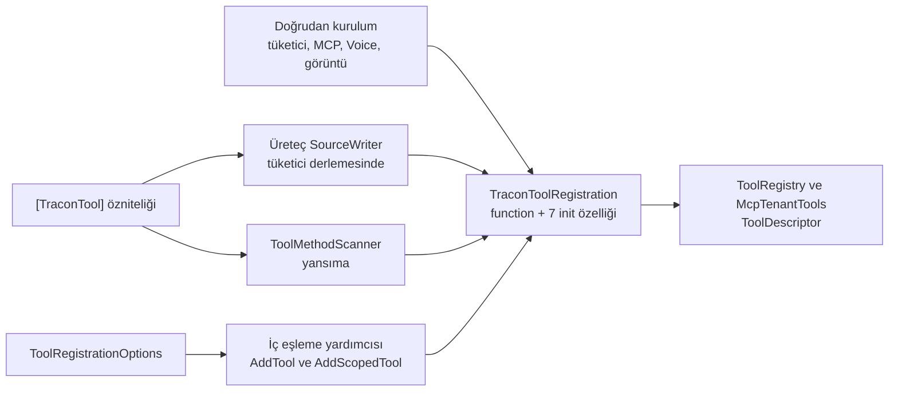

# Faz 189 — Tüketici Yüzeyi: TraconToolRegistration ve ITraconBuilder

> **Durum:** ✅ Tamamlandı (2026-09-24)
> **Plan onayı:** Bakımcı, 2026-09-23 (engelleyici kararlar sohbette alındı)
> **Kaynak:** [ADAYLAR.md](ADAYLAR.md) · **F-271** — B yarısı. A yarısı (DI kurucuları + ratchet) [Faz 188](arsiv/fazlar/188-DI-KURUCU-DARALTMA.md)'dir
> **Önkoşul:** [Faz 188](arsiv/fazlar/188-DI-KURUCU-DARALTMA.md) — **zorunlu**: kurucu ratchet'ini kurar; bu faz onun `TraconToolRegistration` satırını siler · [Faz 187](arsiv/fazlar/187-KIRICI-DEGISIKLIK-KAPISI.md) — `kapi.py yayin` kırıcı değişiklik kapısı; kırılmalar o kapıdan sürüm notuyla geçer · [Faz 186](arsiv/fazlar/186-SCRIPT-IZNI-ICERIK-PINI.md) — numara sırası; `ITraconBuilder.AddSkill` XML'ine (Açık Soru 1'ine göre gövdesine) dokunur (`186-…md:445`) · [Faz 185](arsiv/fazlar/185-KARDES-PAKET-SURUM-SABITLEME.md) — kardeş sabitlemesi; karışık graf riskini daraltır
> **Paketler:** `Tracon.Abstractions`, `.Core` (üreteç `Tracon.Generators` dahil — `analyzers/dotnet/cs`), `.Mcp`, `.Voice`, `.Testing` (README + XML)
> **Yeni paket:** Yok · **Migration:** Yok
> **Public API:** **Daralıyor ve büyüyor (bilinçli kırıcı, pre-1.0).** `TraconToolRegistration` kurucusu 8 → 1 parametre, 7 özellik `init` kazanır. `ITraconBuilder` 28 → 1 üye (`Services`); 27 metot yeni public statik uzantı sınıfına taşınır (Core +1 tip). Ölçüldü: `wc -l src/*/PublicAPI.Shipped.txt` → 17 dosya, her biri 1 satır (`#nullable enable`) — K-603
> **Tüketici yüzeyi:** site: `concepts/tools.md:212`, `guides/write-your-own-tool.md` (gözden geçirme), `reference/changelog.md` ve `api/` (üretilir)
> · sevk edilen: XML `<example>` (`TraconToolRegistration` için yeni; 15 metot `<example>`'ı uzantı sınıfına taşınır), `src/Tracon.Testing/README.md:126`, `TraconTestHost.cs:25` XML, `CHANGELOG.md` `[Unreleased]`, iki CustomTool sample dosyası; `capabilities.md` satırı **değişmez** (189.5)
> **Manuel test alanı:** `docs/manuel-test/02-CEKIRDEK-VE-KATALOG.md` (tool kaydı) · `docs/manuel-test/01-KURULUM-VE-PAKETLEME.md` (paketlenmiş tüketici, ikili kırılma, karışık graf)

---

## Bu Faza Başlarken

> `faz-baslangic` skill'ini uygula. Aşağıdaki liste o skill'in 2. adımıdır —
> **tamamını değil, yalnız işaret edilen bölümleri oku.**

1. Bu doküman.
2. Kararlar — dosyanın tamamını **okuma**, yalnız bu satırları grep'le:
   ```bash
   grep -nE "^\| \*\*K-(509|620|645|350|603|422) " docs/KARARLAR.md
   ```
   K-509 (kayıt giriş noktası kapısı; kapsamı değişir) · K-620 (`AddRunJudge`
   arayüzde; uzantıya taşınır) · K-645 (`Services` XML'i seam sözleşmesi) ·
   K-350 (`AddGeneratedTools()` zaten uzantı — emsal) · K-603 · K-422
   (RS0026/RS0027). K-509 gerekçesi:
   `awk '/^### K-509$/{f=1;print;next} f&&/^### K-/{exit} f' docs/arsiv/KARARLAR-GECMISI.md`
3. Önkoşul fazları — devir notları ve 188'in kararları:
   ```bash
   for n in 185 186 187 188; do
     f=$(ls docs/$n-*.md docs/arsiv/fazlar/$n-*.md 2>/dev/null | head -1)
     echo "== $f"; awk '/## Sonraki Faza Devir Notu/,0' "$f"
   done
   f=$(ls docs/188-*.md docs/arsiv/fazlar/188-*.md 2>/dev/null | head -1)
   awk '/## Bu Fazda Verilen Kararlar/,/## Gerçekleşen Public API/' "$f"
   ```
   185: karışık graf. 186: `AddSkill`. 187: `CHANGELOG` eşleşme kuralı. 188:
   ratchet taban satırı, kurucu politikasının K-* numarası.
4. Alan hafızası (yalnız işaret edilen madde):
   - [`hafiza/analyzer-yazimi.md`](hafiza/analyzer-yazimi.md) — "Core KENDİ
     analyzer'ını KENDİ ÜZERİNDE koşturur"
   - [`hafiza/genisleme-noktalari-ve-denetim.md`](hafiza/genisleme-noktalari-ve-denetim.md) —
     K-667 ve Faz 150 (`Add` ↔ `TryAdd*`)
   - [`hafiza/aspnetcore-di.md`](hafiza/aspnetcore-di.md) — K-251
   - [`hafiza/dokumantasyon.md`](hafiza/dokumantasyon.md) — K-517 `<see cref>`
     ve "Internal tipin XML dokümanı da sevk edilir"

---

## Amaç

Tüketicinin **kurduğu** ve **çağırdığı** iki public yüzey GA donmasından önce
ikili uyumlu büyüyebilir hâle gelir. Yeni tool seçeneği `init` özelliğidir.
`ITraconBuilder`'a bir daha üye eklenmez; her kayıt yeteneği uzantıdır.

- **F-271 (B)** — `TraconToolRegistration` tek zorunlu parametre + `init`;
  `ITraconBuilder` yalnız `Services`; 27 metot statik uzantı sınıfında;
  üreteç, kopya yerleri, çağrı yerleri, K-509 kuralının üç kopyası, testler,
  sample'lar ve dokümanlar izler.

### Bugün ne çalışmıyor — doğrulanmış kanıt

Bugün her şey çalışır. Sorun GA'da doğar: `Shipped` dolunca (K-603) iki yüzey
donar. Opsiyonel varsayılan çağıranın ikilisine derlenir; yeni seçenek ya
kırıcıdır ya da bir aşırı yükleme daha biriktirir. Arayüze üye eklemek her
implementer için kırıcıdır.

| Kanıt | Gözlem |
|---|---|
| [`TraconToolRegistration.cs:49-57`](../src/Tracon.Abstractions/Tools/TraconToolRegistration.cs), `:76-137` · `Abstractions/PublicAPI.Unshipped.txt:3913`, `:3597-3612` | 1 zorunlu + 7 opsiyonel parametre; 8 özellik yalnız `get`. `ToolRegistrationOptions` aynı 7 alanı `set` ile taşır |
| [`TraconToolAttribute.cs:53-114`](../src/Tracon.Abstractions/Tools/TraconToolAttribute.cs) | 9 özellik; 6'sı kayda eşlenir. `Name` `:53`, `Description` `:58`, `JsonSerializerContext` `:114` fonksiyon metadata'sıdır. `TimeoutSeconds`, `MaxOutputBytes` `int`'tir (`0` = yok) |
| [`SourceWriter.cs:104-115`](../src/Tracon.Generators/SourceWriter.cs) | 🚨 Üreteç her `[TraconTool]` için adlandırılmış argümanlı `new(...)` çağrısını **tüketicinin derlemesine** yazar |
| [`TraconBuilder.cs:33-43`](../src/Tracon.Core/TraconBuilder.cs), `:58-72` · [`ToolMethodScanner.cs:60-67`](../src/Tracon.Core/Tools/ToolMethodScanner.cs) | 7 alan üç kez elle kopyalanır (`AddTool`, `AddScopedTool`, yansıma). `ToolMethodScanner.cs:17` `cref`'i arayüz üyesine bağlıdır. `TraconBuilder.cs:10-18`: tek implementasyon `internal sealed`, yalnız `Services` taşır |
| [`McpConnection.cs:450`](../src/Tracon.Mcp/Internal/McpConnection.cs), `:512-518` · `git grep -nE "\.Source\b\|RequiresApproval" -- 'tests/Tracon.Mcp*'` · `git grep -l McpConnection -- tests` | `requiresApproval:`, `source:` `private` metotlarda (`:440`, `:481`). İki grep de boş: MCP kaydının iki alanını kilitleyen test ve `McpConnection` düzeneği yoktur |
| [`VoiceBuilderExtensions.cs:100-104`](../src/Tracon.Voice/VoiceBuilderExtensions.cs) · [`ToolRegistry.cs:46-49`](../src/Tracon.Core/Tools/ToolRegistry.cs), `:77` | Voice: konumsal `requireApproval`; `:109` ve `TraconClientToolExtensions.cs:63` tek argümanlı, değişmez. Görüntü tool'u: `effect:`, `timeout:`; `:77` XML `requiresApproval: true` der |
| Çok argümanlı kurulum sayımı | 39 yer: `src` 8, `samples` 2, `tests` 29 (10 dosya; `LateToolCompletionTests.cs:79-81` hedefli `new(`). Düz grep hedefli `new(`'i kaçırır; **tam bulucu derleyicidir** (CS1739) |
| [`ITraconBuilder.cs:16`](../src/Tracon.Core/ITraconBuilder.cs) · `Core/PublicAPI.Unshipped.txt:120-148` | `grep -c "^Tracon.ITraconBuilder\."` → 28 (1 özellik + 27 metot); 16 `<example>` (15'i metotlarda) |
| `ITraconBuilder.cs:132-133`, `:174-175`, `:193-194` · `:266`, `:294`, `:321`, `:358` · `:443-445` | `[RequiresUnreferencedCode]`/`[RequiresDynamicCode]` · `[DynamicallyAccessedMembers(PublicConstructors)]` · `#pragma warning disable MAAI001` |
| `grep "(this Tracon.ITraconBuilder" src/*/PublicAPI.Unshipped.txt` | 13 pakette 61 uzantı (Core 20); hepsi `Add`/`Use`/`Map` önekli, `namespace Tracon`'da |
| [`CapabilityEntryPoints.cs:50-53`](../tests/Tracon.Core.UnitTests/Architecture/CapabilityEntryPoints.cs), `:56-59` · [`manuel-test-tazelik.py:115-127`](../scripts/manuel-test-tazelik.py), `:635-647` · [`public-yuzey-envanteri.py:58-71`](../scripts/public-yuzey-envanteri.py), `:378` | K-509 kuralının üç kopyası; hepsi uzantıyı yalnız `Add`/`Use`/`Map` önekiyle sayar, iki betik "AYNI kural (K-509)" der. Aralarında eşlik testi yok (`git grep` boş). Taşınınca `Configure`, `RequireCustomBinding`, `RequireProductionProfile` üçünden de **sessizce** düşer |
| [`188-…md:108`](arsiv/fazlar/188-DI-KURUCU-DARALTMA.md) (karar 4), `:314-321` | Ratchet yalnız **kurucuları** izler ("Metotlar kapsam dışıdır"). Taban `Tracon.Abstractions:Tracon.TraconToolRegistration(8/7)` satırını taşır |
| `git grep -n "builder.AddModelProvider(" -- src ':!src/Tracon.Core'` · `TraconTestHost.cs:66` · [`185-…md:334-338`](arsiv/fazlar/185-KARDES-PAKET-SURUM-SABITLEME.md) | OpenAI (2 dosya), Anthropic, Azure, Google `Use*()` ve `Tracon.Testing` kayıt anında kaldırılacak bir arayüz üyesini çağırır. 185: kayıt anında kırılma kontrolü önler |
| [`kapi.py:657-661`](../scripts/kapi.py) · [`GeneratedOutputTests.cs:276-279`](../tests/Tracon.Generators.UnitTests/GeneratedOutputTests.cs) | `samples/Tracon.Samples.*` yalnız `kapi.py yayin`'de koşar. Üreteç çıktısını derleyen desen vardır; `:75`, `:108-112`, `:168-170` adlandırılmış argüman arar |
| `git log -G` (PublicAPI, `630f3212`'den beri) | `ITraconBuilder` satırları 2, kurucu satırı 1 commit'te değişti |

> Kanıtlar 2026-09-23'te HEAD `bb9953e3` üzerinde doğrulandı. Faz 186
> (`ITraconBuilder.cs`/`TraconBuilder.cs` içinde `AddSkill`) ve Faz 188
> (`PublicAPI.Unshipped.txt`, test tabanları) aynı dosyalara dokunur; satır
> numaralarını faz başında yeniden ölç.

---

## Tasarım

### Kullanıcı kararları (kullanıcı kararı, 2026-09-23)

1. **`TraconToolRegistration`** tek zorunlu kurucu parametresi (`function`) +
   `init` özellikleri kullanır. Üreteç, `TraconBuilder.cs` ve
   `ToolMethodScanner.cs` kopyaları, çağrı yerleri ve dokümanlar izler.
2. **`ITraconBuilder`** yalnız `Services`'i tutar. 27 metot statik uzantı
   sınıfına taşınır; `[RequiresUnreferencedCode]`,
   `[DynamicallyAccessedMembers]` ve XML korunur. Çağıran için kaynak
   uyumlu; preview ikilisi kırılır (pre-1.0'da kabul, `versioning.md:15-17`).
   `CapabilityEntryPoints` kapısı `Configure`/`Require*` için düzeltilir.
3. **Kaldırılan imzalar doğrudan kalkar** — `[Obsolete]` yok. Sürüm notu
   geçiş örnekleri taşır.
4. **Faz 188'in ratchet'i sonucu korur.**

**Karar 4'ün kapsamı (ölçüldü).** Ratchet yalnız kurucuları izler (188 karar
4). Kurucu yarısı: `TraconToolRegistration` satırı bayat olur, silinir; bir
daha opsiyonel parametre eklenirse kapı kırmızıdır. Arayüz yarısını ratchet
görmez; tip tabanı tip sayar, Unshipped yalnız büyür. Bu yüzden kalıcı bir
mimari test eklenir: `ITraconBuilder` üyeleri tam olarak {`Services`}'tir
(189.4). Ratchet metotlara **genişletilmez** — 188'in kararıyla çelişir.

### Kaynak yollar



## 189.1 — `TraconToolRegistration`: tek zorunlu parametre + `init`

- Kurucu yalnız `AIFunctionDeclaration function` alır; `null` ve
  `ToolNameRules` doğrulaması kurucuda **kalır**.
- `RequiresApproval`, `Source`, `Effect`, `RequiredPermission`, `Timeout`,
  `SafeToRepeat`, `MaxOutputBytes` `{ get; init; }` olur. Varsayılanlar
  aynıdır (`Effect` = `Read` = `0`, diğerleri `false`/`null`). `Function` yalnız
  `get` kalır.
- Çapraz doğrulama değişmez: onay ⇒ `AIFunction` `ToolWrapperChain.cs:80-87`'de,
  `Timeout`/`MaxOutputBytes` sınırı `ToolRegistrationValidationService.cs:30-37`'de
  (başlangıçta) koşar.
- `<param>` metinleri özelliklere taşınır. `:11-13` `<remarks><code>` bir
  `<example>` olur (`ExamplePrelude.cs:45` `refundTool`):
  `services.AddSingleton(new TraconToolRegistration(refundTool) { RequiresApproval = true, Effect = ToolEffect.Write });`
- Kayıt paylaşılan singleton'dır; `init` değişmezliği derleyiciyle korur,
  `set` yazılmaz. `init` eklemek GA'dan sonra da ikili uyumludur — hedef budur.

## 189.2 — Kopya yerleri teke iner; üreteç başlatıcı yazar

**Üreteç (`SourceWriter.cs:104-115`).** Çıktı:

```text
new(new <GeneratedClass>())
{
    RequiresApproval = <bool>,
    Effect = (global::Tracon.ToolEffect)<n>,
    RequiredPermission = <literal veya null>,
    Timeout = <TimeSpan.FromSeconds(n) veya null>,
    SafeToRepeat = <bool>,
    MaxOutputBytes = <n veya null>,
},
```

- Altı alan her zaman yazılır (bugün de öyle; belirlenimci). `Source`
  yazılmaz. Dil alt sınırı değişmez: hedefli `new(` ve `init` C# 9'dur.
- 🚨 Üreteç **tüketicinin** derlemesinde koşar. Metin iddiası derlenmeyen
  çıktıyı kaçırır; çıktı derlemesi de iddia edilir (test 4). Paket sınırını
  `kapi.py yayin --kuru` kanıtlar: `Tracon.Samples.CustomTool` ve
  `Tracon.Samples.ExtensionAotSmoke` (`AddOrderPreviewTools()`, native AOT).

**Yansıma (`ToolMethodScanner.cs:60-67`)** başlatıcıya geçer; `:17` `cref`'i
uzantıya çevrilir (yoksa CS1574).

**Builder kopyası (`TraconBuilder.cs:35-43`, `:64-72`)** tek bir Core
`internal` statik eşleme yardımcısına iner (`ToolRegistrationOptions` +
`AIFunctionDeclaration` → kayıt). Core'dadır: yalnız public tip kullanır, yeni
IVT bağı açmaz. MEMORY'nin "elle tekrarlanan ifade" dersi geçerlidir.

**Eşleme tablosu** (yansıma `DeclaredOnly`; `Attribute.TypeId` dışarıda):

| Kaynak | Hedef (kayıt) | Yazılı hariç liste |
|---|---|---|
| `ToolRegistrationOptions` (7) | Aynı ad, aynı tip | — |
| `TraconToolAttribute` (6) | Aynı ad; `TimeoutSeconds` → `Timeout`, `MaxOutputBytes` `int` → `int?` (`0` → `null`) | `Name`, `Description`, `JsonSerializerContext`. `Source` öznitelikte yok (yalnız MCP) |
| — | `Function` | Kurucu parametresi |

**Eşleme testleri — yansıma güdümlü.** Tabloda ve hariç listede olmayan
özellik kırmızıdır. Değer üreticisi: `bool` → `true`, enum → ilk sıfır dışı,
`string` → `"x"`, `TimeSpan?` → 1 sn, `int`/`int?` → 4096; bilinmeyen tip
kırmızı.

1. **Şekil** (`ToolRegistrationParityTests`): üç tip tabloya uyar; her
   seçenek setter'ı `IsExternalInit` modreq taşır, `Function` setter'sızdır.
2. **Yardımcı:** her `ToolRegistrationOptions` özelliği varsayılan dışı →
   kaydın her özelliği eşit.
3. **Tarayıcı:** test tipi eşlenen her öznitelik özelliğini set eder (test
   bunu yansımayla iddia eder); taranan kaydın her eşlenen özelliği beklenen
   değerde.
4. **Üreteç** (`GeneratedOutputTests`): girdi eşlenen her öznitelik
   özelliğini adıyla set eder (yansımayla iddia); çıktı her kayıt özelliğinin
   adını taşır; `OutputCompilation` sıfır hata (`:276-279` deseni).

Sonuç: üç tipe eklenen sekizinci seçenek yardımcıda, tarayıcıda veya üreteçte
unutulursa ilgili test kırmızıdır.

**Okuma kopyaları** (`ToolRegistry.cs:112-127`, `McpTenantTools.cs:92-106`)
kapsam dışıdır.

**Diğer `src` yerleri.** Voice `:100-104` ve `ToolRegistry.cs:46-49`
başlatıcıya geçer; `:77` XML `RequiresApproval = true` olur. MCP: `:450` ve
`:512-518` `McpConnection` içinde tek bir `internal static` fabrikayı çağırır
(`function`, sunucu adı, `requiresApproval` → kayıt). Sıra: fabrika önce eski
kurucuyla çıkarılır ve test yazılır (yeşil); sonra başlatıcıya geçer (yeşil
kalır). `TraconTestHost.cs:25` ve `Tracon.Testing/README.md:126` başlatıcı
biçimine geçer.

## 189.3 — `ITraconBuilder` → `Services` + statik uzantı sınıfı

- Arayüzde yalnız `Services` kalır; XML'i (`:18-47`; K-645,
  `OrderingContractDocumentationTests.cs:89`) aynı dosyada kalır.
- 27 metot yeni public statik sınıfa taşınır (Açık Soru 1), `namespace
  Tracon`'da — `AddTracon()` de orada (`TraconServiceCollectionExtensions.cs:10`).
- 🚨 **Gövdeler birebir taşınır.** `Add` ↔ `TryAdd*` biçimi değişmez (K-667,
  Faz 150; `RequireProductionProfile` bilerek `Add`, `TraconBuilder.cs:269-274`).
  Kurulum anı uzantısı ön-kontrol yapmaz (K-251). `TraconBuilder` yalnız
  kurucu + `Services` taşır.
- Her uzantı `ArgumentNullException.ThrowIfNull(builder)` ile başlar (bugün
  `NullReferenceException`; sürüm notunda).
- Öznitelikler korunur: `AddTool(Delegate, …)` ve iki `AddToolsFrom` →
  RUC + RDC (arayüzdeki mesajlarla); `AddAgentSource<T>`,
  `AddAgentDecorator<T>`, `AddRunJudge<T>`, `AddModelProvider<T>` → DAM
  (`PublicConstructors`); `AddLoopEvaluator` → `#pragma MAAI001`. Biri düşerse
  IL2091/MAAI001 derlemeyi kırar.
- XML: 15 `<example>` taşınır; her metoda `<param name="builder">` (yoksa
  CS1573) ve `<exception cref="ArgumentNullException">`. Arayüz içi `cref`'ler
  (`:91`, `:160`, `:165`, `:349`) uzantı imzasına çevrilir.
- Aynı adlı aşırı yüklemeler aynı sınıfta kalır. Ölçülmeli:
  `dotnet build -c Release` RS0026/RS0027 vermez.
- Çalışma anı metinleri (`EvalCheckRegistry.cs:171`,
  `LoopEvaluatorRegistry.cs:222`, `GovernanceEndpoints.cs:670`) ve `<c>`
  metinleri `ITraconBuilder.AddX(...)` kalır — uzantı için de mevcut desen
  (`AddToolApprovalPolicy`).

## 189.4 — Kapılar

| Kapı | Etki | Yapılacak |
|---|---|---|
| `CapabilityEntryPoints` (K-509, C#) | Üç ad düşer; taban dosyaları boş olduğu için test **yeşil kalır** | Alıcısı `Tracon.ITraconBuilder` olan uzantı **önekten bağımsız** sayılır (bugün bu alıcıda önek dışı uzantı yok — ölçüldü). `<remarks>` ve K-509 cümlesi güncellenir. Yeni iddia: `Names` ⊇ {`Configure`, `RequireCustomBinding`, `RequireProductionProfile`, `Services`} |
| `manuel-test-tazelik.py` (`:125-127`, `giris_noktalari()` `:635-647`) | Manuel kapsama ölçümü üç adı sessizce düşürür | Aynı kural. `manuel_test_tazelik_test.py`: gerçek `src` üzerinde `giris_noktalari()` üç adı içerir |
| `public-yuzey-envanteri.py` (`KAYIT_METODU` `:71`, `:378`) | Önek dışı `ITraconBuilder` uzantısı kayıt kanıtı sayılmaz | Aynı kural. `public_yuzey_envanteri_test.py`: yalnız `Configure(this Tracon.ITraconBuilder` taşıyan sentetik tip `giris-noktasi:Configure` alır. Kopya eşliği: Açık Soru 3 |
| Arayüz koruması (yeni, kalıcı) | Sonraki faz arayüze üye ekleyebilir; ratchet ve tip tabanı görmez | Yeni `Architecture/TraconBuilderInterfaceTests.cs`: `typeof(ITraconBuilder)` üyeleri (`DeclaredOnly`, public + non-public, instance + static) = {`Services`, `get_Services`}; mesaj yeni K'yı anar |
| Faz 188 ratchet'i | `TraconToolRegistration(8/7)` satırı bayat → kırmızı | `TRACON_OPTIONAL_CTOR_REFRESH=1` satırı siler (yalnız bayat siler). Metot satırı yok: ratchet metot saymaz |
| `CapabilityCoverageTests` / `CapabilityExampleTests` | Ad bazlı; `M:Tracon.<Sınıf>.AddTool(Tracon.ITraconBuilder,…)` eşleşir | Tabanlar boş kalır |
| `ExampleCompilationTests` | 15 taşınan + 1 yeni `<example>` | Yeşil |
| `PublicSurfaceBaselineTests` | Core +1 tip | Bilinçli yenileme, gerekçe commit'te |
| `public-yuzey-envanteri.py --denetle` (K-850) | Yeni sınıfın kanıtı kayıt giriş noktası | Çıkış 0, kanıtsız 0 |
| Faz 187 kapısı (`kapi.py yayin`) | ApiCompat kurucuyu ve arayüz üyelerini kaldırılmış raporlar | İki tip adı `[Unreleased]`'de (189.5); eşleşme kuralı 187 devir notunda |

## 189.5 — Sürüm notu ve tüketici dokümanı

Faz başında `git tag -l 'v*'` ölçülür. 2026-09-23'te yalnız
`v1.0.0-preview.1`, `v1.0.0-preview.2` var; 185'in güvenlik sürümü büyük
olasılıkla `preview.3` ekler. Not "önceki her `1.0.0-preview.N`" der ve ölçülen
sürümleri sayar.

`CHANGELOG.md` `[Unreleased]` → `### Changed` (İngilizce), iki girdi:

1. `TraconToolRegistration` —
   `new TraconToolRegistration(fn, requiresApproval: true, maxOutputBytes: 4096)` →
   `new TraconToolRegistration(fn) { RequiresApproval = true, MaxOutputBytes = 4096 }`.
2. `ITraconBuilder` — çağrı kodu değişmez (`using Tracon;` yeter). Zorunlu
   maddeler:
   - Önceki bir preview'a karşı derlenmiş derleme kayıt kuruyorsa (**üretecin
     yazdığı kod dahil**) ya da bir `ITraconBuilder` metodu çağırıyorsa,
     yeniden derlenene kadar `MissingMethodException` alır; üretilmiş
     tool'larda `AddGeneratedTools()` çağrısında.
   - Bütün Tracon paketleri birlikte yükseltilir. Önceki preview'dan kalan
     sağlayıcı/MCP/Voice/Testing paketi yeni Core ile kayıtta kırılır (ör.
     `UseOpenAI()` içinde `MissingMethodException`); sürüm kontrolü koşmaz.
   - Kendi `ITraconBuilder` implementasyonunun metotları artık çağrılmaz;
     Tracon'un uzantısı koşar. Implementasyon yalnız `Services` sağlar.
   - Mock `Services`'i vermelidir. `null` builder `ArgumentNullException`
     verir. Aynı imzalı kendi uzantısı CS0121 alır.

Site: `concepts/tools.md:212` başlatıcıya geçer; `write-your-own-tool.md`
`:130`, `:301` tek argümanlıdır, kurucu parametresi anlatan cümle için gözden
geçirilir. Site kod blokları **hiçbir kapıda derlenmez** — yalnız DoD
`git grep` yakalar. `capabilities.md:38`, `:232` değişmez (kapı ad bazlı;
`http-api/governance.md:32` uzantı için aynı yazım). README örnekleri
(`src/Tracon.Core/README.md:16`, `src/Tracon/README.md:18`, `README.md:36`,
`:105-107`, `src/Tracon.Voice/README.md:39`) kaynak uyumludur.

---

## Planlanan Public API

> Taslak imzalardır. Gerçekleşen imzalar kapanışta ayrı bir bölüme yazılır.

```csharp
// Tracon.Abstractions — bugün değiştirmek ucuz (pre-1.0, Shipped boş) / GA'dan sonra kırıcı
public sealed class TraconToolRegistration
{
    public TraconToolRegistration(AIFunctionDeclaration function);
    public AIFunctionDeclaration Function { get; }
    public bool RequiresApproval { get; init; }
    public string? Source { get; init; }
    public ToolEffect Effect { get; init; }            // varsayılan Read
    public string? RequiredPermission { get; init; }
    public TimeSpan? Timeout { get; init; }
    public bool SafeToRepeat { get; init; }
    public int? MaxOutputBytes { get; init; }
}

// Tracon.Core — bugün değiştirmek ucuz (pre-1.0, Shipped boş) / GA'dan sonra kırıcı
public interface ITraconBuilder { IServiceCollection Services { get; } }

// Tracon.Core, yeni — bugün eklemek ucuz (pre-1.0, Shipped boş) / GA'dan sonra kırıcı.
// Ad: Açık Soru 1. Temsilî satırlar:
public static class TraconBuilderExtensions
{
    public static ITraconBuilder Configure(this ITraconBuilder builder, Action<TraconOptions> configure);
    [RequiresUnreferencedCode("…")] [RequiresDynamicCode("…")]
    public static ITraconBuilder AddTool(this ITraconBuilder builder, Delegate method, string? name = null, string? description = null, Action<ToolRegistrationOptions>? configure = null);
    public static ITraconBuilder AddAgentSource<[DynamicallyAccessedMembers(DynamicallyAccessedMemberTypes.PublicConstructors)] TSource>(this ITraconBuilder builder) where TSource : class, IAgentSource;
#pragma warning disable MAAI001
    public static ITraconBuilder AddLoopEvaluator(this ITraconBuilder builder, string kind, LoopEvaluator evaluator);
#pragma warning restore MAAI001
    public static ITraconBuilder RequireProductionProfile(this ITraconBuilder builder, Action<TraconProductionProfileOptions>? configure = null);
    // Kalan 22: AddTool ×2, AddScopedTool ×2, AddToolsFrom ×2, AddAgent ×2, AddSkill,
    // AddAgentSource ×2, AddAgentDecorator ×3, AddRunJudge ×3, AddModelProvider ×3,
    // AddEvalCheck, RequireCustomBinding<T>. Aynı imza, ilk parametre
    // `this ITraconBuilder builder`, öznitelikler 189.3.
}
```

Unshipped etkisi: Abstractions — kurucu satırı değişir, 7 `.init -> void`
gelir. Core — 27 `Tracon.ITraconBuilder.X` gider; 27
`static Tracon.<Sınıf>.X(this Tracon.ITraconBuilder! builder, …)` ve 1 tip
satırı gelir. Toplam fark ölçülmeli.

### HTTP `endpoint`'leri

Yok. `GET /api/tools` yanıt şekli değişmez; yalnız doğrulama yüzeyidir.

### Arayüz payı

Yok.

---

## Planlanan Dosya Listesi

```
src/Tracon.Abstractions/Tools/TraconToolRegistration.cs  1 parametre, 7 init, <example>
src/Tracon.Abstractions/PublicAPI.Unshipped.txt
src/Tracon.Core/
├── ITraconBuilder.cs                 yalnız Services + XML; :91 :160 :165 :349 cref
├── TraconBuilder.cs                  yalnız kurucu + Services
├── TraconBuilderExtensions*.cs       yeni; 27 metot (Açık Soru 1)
├── Tools/<eşleme yardımcısı>.cs      yeni; options → kayıt
├── Tools/ToolMethodScanner.cs        başlatıcı; :17 cref
├── Tools/ToolRegistry.cs             :46-49 başlatıcı; :77 XML
└── PublicAPI.Unshipped.txt
src/Tracon.Generators/SourceWriter.cs       :104-115 başlatıcı
src/Tracon.Mcp/Internal/McpConnection.cs    :450, :512-518 → internal static fabrika
src/Tracon.Voice/VoiceBuilderExtensions.cs  :100-104
src/Tracon.Testing/README.md :126 · TraconTestHost.cs :25
samples/Tracon.Samples.CustomTool/OrderFulfillmentToolRegistration.cs
samples/Tracon.Samples.CustomTool.Tests/OrderFulfillmentToolTests.cs
scripts/manuel-test-tazelik.py · public-yuzey-envanteri.py   alıcı tabanlı kural
scripts/manuel_test_tazelik_test.py · public_yuzey_envanteri_test.py
tests/Tracon.Generators.UnitTests/GeneratedOutputTests.cs   test 4
tests/Tracon.Core.UnitTests/Architecture/
├── CapabilityEntryPoints.cs          kural + yeni iddia
├── TraconBuilderInterfaceTests.cs    yeni
├── optional-parameter-constructor-baseline.txt  TraconToolRegistration satırı silinir
└── public-surface-baseline.txt
tests/Tracon.Core.UnitTests/Tools/    eşleme testleri 1-3, descriptor anlık görüntüsü, builder null
tests/Tracon.Mcp.UnitTests/McpToolRegistrationTests.cs  yeni (IVT)
tests/Tracon.Embedded.Tests/EmbeddedSampleTests.cs      yeni iddia
tests/**  29 çağrı yeri, 10 dosya (tam liste: CS1739)
docs-site/src/content/docs/concepts/tools.md · guides/write-your-own-tool.md
CHANGELOG.md
docs/manuel-test/02-CEKIRDEK-VE-KATALOG.md · 01-KURULUM-VE-PAKETLEME.md
docs/hafiza/analyzer-yazimi.md · genisleme-noktalari-ve-denetim.md (tuzak)
```

---

## Hata Modları ve Testler

> Mutlu yoldan değil, **ne bozulabilir**den türetilir. Seviyeyi plan seçer.
> Sınır geçen davranış (DI · HTTP · kiracı · akış · depo · paket) birim
> testiyle kanıtlanamaz — [`.agents/ortak/test-seviyeleri.md`](../.agents/ortak/test-seviyeleri.md).

| # | Ne bozulabilir | Seviye | Test |
|---|---|---|---|
| 1 | Üreteç çıktısı derlenmez (CS1739) | Birim (çıktı derlemesi) **ve** Paket | 189.2 test 4 · `kapi.py yayin --kuru` (CustomTool, ExtensionAotSmoke) |
| 2 | Üreteç bir alanı yazmaz → yıkıcı tool izinsiz/onaysız koşar | Birim **ve** Fonksiyonel **ve** örnek uygulama | Test 4 · `EmbeddedSampleTests`: `delete_account` → `requiredPermission: admin`, `account_balance` → `read-account` · `samples/Tracon.Api` (DoD) |
| 3 | Tarayıcı bir alanı unutur | Birim (saf eşleme) | Test 3 |
| 4 | Yardımcı bir alanı unutur; üç tipin şekli ayrışır | Birim (yansıma) | Test 1-2 |
| 5 | `AddScopedTool` gecikmeli fabrikası alan kaybeder | Fonksiyonel (DI + HTTP) | `AddScopedTool(fn, o => yedi alan)` → `GET /api/tools` her alan · `AddTool` için aynısı |
| 6 | MCP kaydı `RequiresApproval`/`Source` taşımaz → uzak tool onaysız, "kodda tanımlı" görünür | Birim (saf eşleme, IVT) | Ölçüldü: kilitleyen test yok. Yeni `McpToolRegistrationTests` (IVT `src/Directory.Build.props:177`): fabrika → iki alan doğru; geçişten **önce** yazılır |
| 7 | Başka kiracı: kiracı başına MCP araç kümesi | Mevcut | `McpTenantToolsTests` (7 çağrı yeni sözdizimi) yeşil |
| 8 | Ses tool'u onay ayarını kaybeder | DI (mevcut) | `VoiceBuilderExtensionsTests.Approval_setting_applies_to_production_tools_not_to_listing` |
| 9 | Görüntü tool'u `Effect`/`Timeout` kaybeder | Birim (mevcut) | `GenerateImageToolTimeoutTests` |
| 10 | Eşzamanlılık: ileride `set` yazılır → paylaşılan kayıt değişir | Birim (yansıma) | Test 1 (`IsExternalInit`) |
| 11 | Boş girdi: `function` `null` / geçersiz ad | Birim | `ArgumentNullException` / `TraconException` kurucuda |
| 12 | Aşırı girdi: `Timeout <= 0`, `MaxOutputBytes` alt sınır altı | Birim (mevcut) | `ToolRegistrationValidationServiceTests` |
| 13 | Taşıma bir gövdeyi değiştirir (`Add` ↔ `TryAdd*`, sıra) | Birim (anlık görüntü) **ve** Fonksiyonel (mevcut) | Yeni: 27 metot birer kez → `ServiceDescriptor` listesi (tip, ömür, implementasyon biçimi) beklenene eşit; beklenen **taşımadan önce, 186 birleştikten sonra** kaydedilir · `RequiredBindingStartupTests`, `ProductionProfileStartupTests` |
| 14 | Boş girdi: `builder` `null` | Birim | Her uzantı `ArgumentNullException` (`paramName: "builder"`) |
| 15 | K-509 C# kapısı üç adı düşürür | Birim (kapı) | `CapabilityEntryPoints.Names` dört ad |
| 16 | K-509 Python kopyaları üç adı düşürür | Birim (betik testi) | `manuel_test_tazelik_test.py` · `public_yuzey_envanteri_test.py` |
| 17 | Sonraki faz arayüze yeniden üye ekler | Birim (mimari kapı) | `TraconBuilderInterfaceTests` |
| 18 | `<example>` kaybolur veya derlenmez | Birim (mevcut) | `CapabilityExampleTests` · `ExampleCompilationTests` |
| 19 | Öznitelik/pragma düşer | Derleme | IL2091 / MAAI001 / RS0026-27 / CS1573 / CS1574 hata — `kapi.py kapanis` |
| 20 | Paketlenmiş tüketici: `using Tracon;` zinciri; eski argüman CS1739 ile adını söyler | Paket **ve** Manuel | `kapi.py yayin --kuru` · case 3 |
| 21 | Önceki preview ikilisi → `MissingMethodException` | Manuel (ağ) | Case 4 |
| 22 | Karışık graf: önceki preview sağlayıcısı + yeni Core → `UseOpenAI()` içinde `MissingMethodException`, 185 kontrolünden önce | Manuel (ağ) | Case 6 |
| 23 | Site örneği bayat kalır | Doküman kapısı yok | DoD `git grep` |
| — | İptal | Uygulanmaz | Dokunulan imzalar `CancellationToken` taşımaz; kayıt senkron, kurulum anında |
| — | Alt sistem hatası (`store`) | Uygulanmaz | Depo/ağ yoluna dokunulmaz; `AddScopedTool` çözüm hatası bugünkü gibi ilk çözümde |

Sözleşme testi (`tests/Shared/Contracts/`) gerekmez: depo davranışı değişmez.

---

## Manuel Kabul Case'leri

> Kapanışta `docs/manuel-test/02-CEKIRDEK-VE-KATALOG.md` ve
> `docs/manuel-test/01-KURULUM-VE-PAKETLEME.md` içine eklenecek case'lerin
> taslağı. ID'ler kapanışta alınır. Otomatikleştirilebilenler kapanışta koşulur.

| # | Alan | Ön koşul | Adımlar | Beklenen sonuç |
|---|---|---|---|---|
| 1 | 02 | Örnek uygulama çalışıyor (`$APU`, `$APB` — dosyanın "Koşmadan önce" bölümü) | `curl -s "$APU/api/tools" -H "$APB"` → `cancel_order`, `get_slow_report` | `cancel_order`: `requiresApproval: true`, `effect: "Destructive"`, `requiredPermission: "orders.cancel"`, `source: null`. `get_slow_report`: `timeout: "00:00:01"`. Değerler **üreteç** yolundan gelir |
| 2 | 02 | `samples/Tracon.Api/Program.cs`'e GEÇİCİ `new TraconToolRegistration(fn) { RequiresApproval = true, Effect = ToolEffect.Write, RequiredPermission = "x.y", Timeout = …, SafeToRepeat = true, MaxOutputBytes = 1024 }`; case sonunda GERİ ALINIR | `GET /api/tools` | Yedi alan descriptor'da; verilmeyen alan varsayılanda |
| 3 | 01 | Faz paketleri yerel feed'de | Boş konsol: `using Tracon;` + `builder.AddTracon().AddTool(fn, o => o.RequiresApproval = true).RequireProductionProfile()`; sonra `new TraconToolRegistration(fn, requiresApproval: true)` eklenir | İlk derleme temiz; ikincisi CS1739, mesaj `requiresApproval` adını söyler |
| 4 | 01 | Ağ; nuget.org `1.0.0-preview.2` | `[TraconTool]`'lu kütüphane preview.2'ye karşı derlenir; host yeni paketlerle koşar | `AddGeneratedTools()` çağrısında `MissingMethodException` (`TraconToolRegistration..ctor`); yeniden derlenince geçer. Metin sürüm notuyla aynı |
| 5 | 01 | — | `python3 scripts/kapi.py yayin --kuru` | CustomTool + testleri ve ExtensionAotSmoke paketlenmiş sürüme karşı geçer; kapı iki tip adını `CHANGELOG.md`'de bulur |
| 6 | 01 | Ağ; faz paketleri yerel feed'de | Konsol host: nuget.org `Tracon.OpenAI@1.0.0-preview.2` + yerel `Tracon.Core`; `AddTracon().UseOpenAI(…)` | `UseOpenAI()` içinde `MissingMethodException` (`ITraconBuilder.AddModelProvider`); 185 kontrolü koşmaz. Paketler hizalanınca geçer |

---

## Açık Sorular

> Planı bloklamayan, faz uygulanırken karara bağlanacak sorular. Bloklayan
> sorular plan yazılmadan **önce** soruldu (Tasarım — kullanıcı kararları).

| # | Soru | Seçenekler | Öneri |
|---|---|---|---|
| 1 | 27 metot kaç sınıfa taşınır? | A: tek `TraconBuilderExtensions` (alan başına `partial` dosya) · B: alan başına sınıf (Core +5 tip) | **A.** Core +1 tip; tek docfx sayfası; aşırı yüklemeler tek tipte kalmalı (RS0026/RS0027 tip içinde). Çakışma yok: `grep -rn "class TraconBuilderExtensions" src/` boş |
| 2 | `ITraconBuilder` XML'i implementasyon için ne der? | A: "Tracon implementasyonu `AddTracon()` verir; kayıt metotları uzantıdır; implementasyon yalnız `Services` sağlar" · B: "implement etme" | **A.** Tek üyeli arayüzü implement etmek zararsızdır |
| 3 | K-509 kuralının üç kopyası mekanik bağlansın mı? | A: iki betik ortak bir `kayit_giris_noktasi(satir)` yüklemi çıkarır; tek fixture eşlik testi · B: yalnız "üç ad" iddiaları | **A.** Ucuz; MEMORY'nin elle kopya dersi. C# ↔ Python bağı yorumla kalır |

---

## Bitiş Ölçütleri (DoD)

- [x] `grep -c "^Tracon.ITraconBuilder\." src/Tracon.Core/PublicAPI.Unshipped.txt` → `1` (ölçüldü)
- [x] `grep -c "(this Tracon.ITraconBuilder" src/Tracon.Core/PublicAPI.Unshipped.txt` → faz başı değer + 27 (ölçüldü: 20 → 47)
- [x] Abstractions Unshipped: tek kurucu `TraconToolRegistration(Microsoft.Extensions.AI.AIFunctionDeclaration! function) -> void`; `grep -c "Tracon.TraconToolRegistration\..*\.init -> void"` → `7`; `grep -c "bool requiresApproval = false"` → `0`
- [x] `git grep -nE "(requiresApproval|safeToRepeat|maxOutputBytes|requiredPermission):" -- src samples docs-site/src/content/docs ':!docs-site/src/content/docs/api' ':!src/Tracon.UI'` → boş (2026-09-23'te 19 satır)
- [x] 189.2 eşleme testleri 1-4 yeşil, yansıma güdümlü; hariç liste testte yazılı
- [x] `McpToolRegistrationTests` yeşil; `McpConnection.cs`'te kurulum tek yerde (fabrika)
- [x] Descriptor anlık görüntüsü, `builder` `null`, `CapabilityEntryPoints` dört ad ve `TraconBuilderInterfaceTests` yeşil; `capability-coverage-baseline.txt`, `capability-example-baseline.txt` boş
- [x] `python3 -m unittest discover -s scripts -p "*_test.py"` yeşil (`kapi.py:1088`); iki betik testinde üç ad iddiası var
- [x] `grep -c "TraconToolRegistration" tests/Tracon.Core.UnitTests/Architecture/optional-parameter-constructor-baseline.txt` → `0`; tabanda başka değişiklik yok
- [x] `EmbeddedSampleTests` yeni iddiası ve hata modu 5 testi yeşil
- [x] `public-surface-baseline.txt`: Core +1 bilinçli; `python3 scripts/public-yuzey-envanteri.py --denetle` → çıkış 0, kanıtsız 0
- [x] `python3 scripts/kapi.py yayin --kuru` yeşil; 187 kapısı iki tip adını `[Unreleased]`'de bulur
- [x] `CHANGELOG.md` `[Unreleased]` 189.5'in iki girdisini ve dört maddesini taşır; önceki preview'lar ölçülen etiketlerle adlandırılır
- [x] Yeni K-* kategori etiketiyle açıldı; K-620 ve K-509'a not düştü; tuzak `hafiza/analyzer-yazimi.md` ve `genisleme-noktalari-ve-denetim.md`'de
- [x] Dört doğrulama kapısı sıfır uyarı verir — `python3 scripts/kapi.py kapanis --taban <faz öncesi commit>`
- [x] `samples/Tracon.Api` ile gerçek `run` yapıldı, çıktı belgeye ("Örnek Uygulama Koşumu") yazıldı — komut ve beklenen çıktı aşağıda
- [x] `secret` taraması boş döndü (`python3 scripts/kapi.py tarama`)
- [x] Manuel kabul case'leri `docs/manuel-test/02-CEKIRDEK-VE-KATALOG.md` ve `docs/manuel-test/01-KURULUM-VE-PAKETLEME.md` içine eklendi; otomatikleştirilebilenler (1, 3, 5) koşuldu
- [x] `faz-denetim` koşuldu; 🔴 bulgu kalmadı
- [x] `docs-site/` güncellendi (`tools.md`, `write-your-own-tool.md`, `api/` ve `changelog.md` yeniden üretildi); `npm run build` + `check-links.mjs` temiz

### Doğrulama komutları

```bash
# Örnek uygulama: Faz 182 deseni; tuzaklar docs/hafiza/elle-kosum-ortami.md
export APB="Authorization: Bearer <Tracon:Ui:AuthToken değeri>"
curl -s http://localhost:5080/tracon/api/tools -H "$APB" \
  | python3 -c "import sys,json; [print(t['name'], t['requiresApproval'], t['effect'], t.get('requiredPermission'), t.get('timeout')) for t in json.load(sys.stdin) if t['name'] in ('cancel_order','get_slow_report')]"
# Beklenen:
#   cancel_order True Destructive orders.cancel None
#   get_slow_report False Read None 00:00:01

curl -s -X POST http://localhost:5080/tracon/api/agents/support/run -H "$APB" \
  -H "content-type: application/json" \
  -d '{"message":"ORD-1001 siparisim nerede?","sessionId":"faz-189"}' | tail -c 400
# Beklenen: SSE `done` ile biter; /runs/{id} → Completed. OpenAI anahtarı
# varsa /runs/{id}/tools → get_order_status bir kez; yoksa "ölçülmedi".

python3 scripts/kapi.py yayin --kuru
python3 scripts/kapi.py kapanis --taban <faz öncesi commit>
```

---

## Riskler

| Risk | Önlem |
|------|-------|
| 🚨 Kendi `ITraconBuilder` implementasyonu derlenir ama metotları çağrılmaz; mock `Services` vermezse uzantı hata verir; preview ikilisi `MissingMethodException` ile durur | Karar 3 gereği kabul; 189.5'in dört maddesi; Açık Soru 2; case 4. Dış implementer sayısı ölçülemez |
| 🚨 Karışık graf. (a) Eski Core üreteci + yeni Abstractions → üretilmiş kodda CS1739 (derleme anı). (b) Önceki preview'ın sağlayıcı (`Use*()` → `AddModelProvider`), `Tracon.Testing` (`TraconTestHost.cs:66`), MCP, Voice paketi + yeni Core → `MissingMethodException`. Sağlayıcıda kayıt anında olur, 185 kontrolü koşmaz (`185-…md:334-338`); MCP/Voice'ta bağlantı veya ilk çözüm anında | Yeni paketlerde 185'in sabitlemesi grafı çözümde reddeder; eski açık aralık değiştirilemez. Sürüm notu "birlikte yükselt" der; case 6. 185 devir notundan doğrula |
| Tüketicinin aynı imzalı uzantısı CS0121 alır (bugün arayüz üyesi sessizce kazanıyordu) | Derleme anı; sürüm notu |
| `using Tracon;` olmadan tam adla kullanan kod uzantıyı görmez (CS1061) | Düşük: `AddTracon()` de `namespace Tracon`'da |
| 🚨 `samples/Tracon.Samples.*` kapanış kapısında koşmaz (`kapi.py:657-661`) | DoD `kapi.py yayin --kuru` |
| 🚨 Site kod blokları derlenmez; `tools.md:212` bayat kalabilir | DoD `git grep` |
| K-509 kuralının C# ve Python kopyaları elle bağlı kalır | Her kopyada "üç ad" iddiası; Açık Soru 3 |
| K satırı kategori etiketi biçimi kusur-giderme kapısında tanımlı | Önce ölç: `grep -n "kategori" scripts/dokuman-bakim.py` |

### Bu fazın açacağı K-* (numara kapanışta alınır)

K-855'ten itibaren her K satırı kategori etiketi taşır (AGENTS.md "Karar defteri").

- **Yeni K — `*(kategori: public-api)*`.** Taslak: "`ITraconBuilder`
  yalnız `Services` taşır; Tracon'un bütün kayıt yetenekleri statik uzantı
  metodudur, arayüze üye eklenmez (`TraconBuilderInterfaceTests` korur).
  `TraconToolRegistration` tek zorunlu kurucu parametresi + `init` kullanır;
  yeni tool seçeneği `init` özelliğidir. Kaldırılan imzalar geçişsiz kalktı;
  preview ikilisi yeniden derlenir (kullanıcı kararı)". 188'in K satırı
  "tüketicinin kurduğu tip" cümlesini taşıyorsa bu satır ona bağlanır.
- **K-620** notu: "kısmen geçersiz — `AddRunJudge` uzantıya taşındı (yeni K)".
- **K-509** notu: kapsam alıcısı `ITraconBuilder` olan **her** uzantıdır,
  önekten bağımsız; kural üç kopyada aynıdır (yeni K).

Yerel kararlar ("Bu Fazda Verilen Kararlar"a): uzantı sınıfının adı ve
bölünmesi, üretecin altı alanı her zaman yazması, eşleme yardımcısının yeri,
MCP fabrika metodu, K-509'un alıcı tabanlı kuralı.

---

<!-- ============================================================
     AŞAĞISI KAPANIŞTA DOLDURULUR — `faz-tamamlama` skill'i.
     Plan anında boş kalır. Başlıkları SİLME.
     ============================================================ -->

## Örnek Uygulama Koşumu

2026-09-24, `samples/Tracon.Api` Development, `--urls http://127.0.0.1:5199`
(`docs/hafiza/elle-kosum-ortami.md` tarifi), PostgreSQL, gerçek OpenAI anahtarı.
Token user-secrets'tan okunup yalnız `Authorization` başlığına verildi.

| Çağrı | Sonuç | Kanıtladığı |
|---|---|---|
| `GET /tracon/api/tools` | `cancel_order True Destructive orders.cancel None None` · `get_order_status False Read None None None` · `get_slow_report False Read None 00:00:01 None` | Üreteç yolu (`AddGeneratedTools()`) yeni başlatıcı çıktısıyla her ayarı taşır; `source` `null` |
| `POST /tracon/api/agents/support/run` `{"message":"ORD-1001 siparisim nerede?","sessionId":"faz-189"}` | SSE `done` ile biter; run `01a0d2e5-…` | Uzantı zinciriyle kurulan host gerçek run koşar |
| `GET /tracon/api/runs/01a0d2e5-…` · `…/tools` | `status: Completed` · tools `['get_order_status']` | Tool çağrısı bir kez, kayıt tamam |

Uygulama günlüğünde `fail`/`unhandled` satırı yok.

## Plandan Sapmalar

| # | Plan | Gerçekleşen | Gerekçe |
|---|---|---|---|
| 1 | 189.1 `<example>`: `services.AddSingleton(new TraconToolRegistration(refundTool) {…})` | `builder.Services.AddSingleton(…)` | `ExampleCompilationTests` bloğu `ExamplePrelude` ile derler; prelude `services` tanımlamaz, `builder` (`IHostApplicationBuilder`) tanımlar. İlk hâl `CS0103` ile kırmızıydı |
| 2 | Test 4 (üreteç): metin iddiası + `OutputCompilation` sıfır hata | Ayrıca çıktı `Emit` edilir, collectible `AssemblyLoadContext`'e yüklenir, `TraconGeneratedTools.Create()` çağrılır ve kaydın **değerleri** özniteliğe karşı iddia edilir (`GeneratedRegistrationParityTests`) | Ad iddiası yanlış değer yazan üreteci kaçırır; değer okumak bunu kapatır |
| 3 | Descriptor anlık görüntüsü: 27 metot birer kez | Her metot **iki kez** çağrılır | İkinci çağrı `Add` (iki satır) ile `TryAdd*` (tek satır) farkını da kilitler — hata modu 13'ün asıl riski buydu. Case sayısı `TraconBuilderExtensions` metot sayısına yansımayla eşlenir |
| 4 | Açık Soru 3 = A: "iki betik ortak bir `kayit_giris_noktasi(satir)` yüklemi çıkarır" | Yüklem ayrı modüldedir: `scripts/kayit_giris_noktasi.py` (`kayit_giris_noktasi(satir)` + `kayit_uzantisi_mi(ad, alici)`), kendi fixture testiyle (`kayit_giris_noktasi_test.py`) | Betik adları tireli, birbirini import edemez; modül iki betiğin de import ettiği tek kaynaktır |
| 5 | — | `src/Tracon.Testing/README.md` "CORRECT" örneği yeniden yazıldı; `docs/manuel-test/24-…md:1346` alıntısı izledi | **Yolda bulunan kusur:** örnek `new TraconToolRegistration(new OrderTools(...), ...)` diyordu; `OrderTools` bir `AIFunctionDeclaration` değildir, kod hiçbir sürümde derlenmezdi. Yeni biçim `AIFunctionFactory.Create(tools.GetOrderStatus, "get_order_status")` |
| 6 | 189.5 madde: "Aynı imzalı kendi uzantısı CS0121 alır" · "implementasyon derlenir" | Denetimin 🟡 1'i ölçüldü ve iki madde düzeltildi | Scratch derlemesi (2026-09-24): `namespace MyApp` içindeki aynı imzalı tüketici uzantısı **sessizce kazandı** ("consumer extension ran"); açık implementasyon (`ITraconBuilder ITraconBuilder.AddTool`) `CS0539` verdi. `CS0121` yalnız aynı düzeyde içe aktarılan iki uzantıda çıkar (dil kuralı; ölçüm `CS0012` referans eksiğinde kaldı) |
| 7 | `<exception cref="ArgumentNullException">` her metotta | Yalnız `builder`'ı anar; `AddToolsFrom(Type)` mevcut maddesi "`builder` or `type`" oldu | Diğer argümanların `null` kontrolü önceden de belgelenmemişti; bu faz davranışı değil zinciri değiştirir |
| 8 | RUC/RDC mesajları "arayüzdeki mesajlarla" | Aynen arayüzün mesajları; `TraconBuilder`'ın farklı sözcüklü mesajları düştü | Plan gereği; tüketici IL2026/IL3050 metninde arayüz metnini görüyordu |
| 9 | — | `tests/Tracon.Ui.E2ETests/Ui/ExperimentTests.cs` seçimden önce alanın `<select>` olmasını bekler | **Yolda bulunan kırılgan test** (bu fazın kodundan bağımsız): ilk kapanış koşumunda "Element is not a <select> element" ile düştü, izole geçti. Sebep yarış: `variant-version-0` sürüm sorgusu dönene kadar sayı alanıdır. Hafıza: `frontend-test-altyapisi.md` |

## Bu Fazda Verilen Kararlar

**K-867** *(kategori: public-api)* — `ITraconBuilder` yalnız `Services` taşır;
kayıt yetenekleri `TraconBuilderExtensions` uzantısıdır, arayüze üye eklenmez.
`TraconToolRegistration` tek zorunlu parametre + yedi `init` ayarı kullanır.
Kaldırılan imzalar `[Obsolete]`'suz kalktı (kullanıcı kararı).

**Mevcut satırlara not:** K-620 (kısmen geçersiz — `AddRunJudge` uzantıya
taşındı) · K-509 (genişletildi — builder alıcısında önek aranmaz; kural üç
kopyada aynı).

**Açık sorular:** AS 1 = A (tek `TraconBuilderExtensions`, alan başına beş
`partial` dosya: kök · `Tools` · `Agents` · `Evaluation` · `Models`) · AS 2 = A
(arayüz XML'i: implementasyon yalnız `Services` sağlar) · AS 3 = A (ortak
yüklem; Sapma 4).

**K almayan yerel kararlar:**

- Üreteç altı ayarı her kayıtta yazar (belirlenimci çıktı); `Source` yazmaz.
- Eşleme yardımcısı Core `internal static ToolRegistrationMapping.FromOptions`;
  yalnız public tip kullanır, yeni IVT bağı yok.
- MCP fabrikası `McpConnection.CreateRegistration(function, serverName,
  requiresApproval)` — `internal static`; eski kurucuyla çıkarıldı ve
  `McpToolRegistrationTests` başlatıcıya geçişten **önce** yeşil koştu.
- K-509 alıcı tabanlıdır: alıcı `Tracon.ITraconBuilder` ise ad serbest; diğer
  alıcılarda `Add`/`Use`/`Map` öneki. C# deseni `~?static` kabul eder
  (Python kopyasıyla eş; denetim 🟢 1).

## Gerçekleşen Public API

```csharp
// Tracon.Abstractions
public sealed class TraconToolRegistration
{
    public TraconToolRegistration(AIFunctionDeclaration function);   // null → ArgumentNullException, geçersiz ad → TraconException
    public AIFunctionDeclaration Function { get; }
    public bool RequiresApproval { get; init; }
    public string? Source { get; init; }
    public ToolEffect Effect { get; init; }
    public string? RequiredPermission { get; init; }
    public TimeSpan? Timeout { get; init; }
    public bool SafeToRepeat { get; init; }
    public int? MaxOutputBytes { get; init; }
}

// Tracon.Core
public interface ITraconBuilder { IServiceCollection Services { get; } }

public static partial class TraconBuilderExtensions   // 27 metot, hepsi ilk parametre `this ITraconBuilder builder`
{
    Configure(Action<TraconOptions>) · RequireCustomBinding<T>() · RequireProductionProfile(Action<TraconProductionProfileOptions>? = null)
    AddTool(AIFunction, Action<ToolRegistrationOptions>) · AddTool(AIFunction) · AddScopedTool ×2
    [RUC][RDC] AddTool(Delegate, string? = null, string? = null, Action<ToolRegistrationOptions>? = null) · AddToolsFrom<T>() · AddToolsFrom(Type)
    AddAgent(AgentDefinition) · AddSkill(AgentSkillDefinition) · AddAgent(string, Func<IServiceProvider, AIAgent>, string? = null)
    AddAgentSource<[DAM] TSource>() · AddAgentSource(IAgentSource) · AddAgentSource(Func<…>)
    AddAgentDecorator<[DAM] TDecorator>() · ×2 · AddRunJudge<[DAM] TJudge>() · ×2 · AddModelProvider<[DAM] TProvider>() · ×2
    AddEvalCheck(string, EvalCheck) · [#pragma MAAI001] AddLoopEvaluator(string, LoopEvaluator)
}
```

Unshipped farkı: Abstractions kurucu satırı değişti, `+7` `.init -> void`.
Core `-27` `Tracon.ITraconBuilder.X`, `+27`
`static Tracon.TraconBuilderExtensions.X(this Tracon.ITraconBuilder! builder, …)`,
`+1` tip satırı. Tip tabanı Core 79 → 80; envanter 654 → 655, kanıtsız 0.

## Dosya Listesi (gerçekleşen)

```
src/Tracon.Abstractions/Tools/TraconToolRegistration.cs · PublicAPI.Unshipped.txt
src/Tracon.Core/
├── ITraconBuilder.cs                     yalnız Services + XML (AS 2)
├── TraconBuilder.cs                      kurucu + Services
├── TraconBuilderExtensions.cs            yeni — sınıf XML, Configure, Require*
├── TraconBuilderExtensions.Tools.cs      yeni — AddTool ×3, AddScopedTool ×2, AddToolsFrom ×2
├── TraconBuilderExtensions.Agents.cs     yeni — AddAgent ×2, AddSkill, AddAgentSource ×3, AddAgentDecorator ×3
├── TraconBuilderExtensions.Evaluation.cs yeni — AddRunJudge ×3, AddEvalCheck, AddLoopEvaluator
├── TraconBuilderExtensions.Models.cs     yeni — AddModelProvider ×3
├── Tools/ToolRegistrationMapping.cs      yeni — options → kayıt
├── Tools/ToolMethodScanner.cs · Tools/ToolRegistry.cs
└── PublicAPI.Unshipped.txt
src/Tracon.Generators/SourceWriter.cs
src/Tracon.Mcp/Internal/McpConnection.cs · src/Tracon.Voice/VoiceBuilderExtensions.cs
src/Tracon.Testing/README.md · TraconTestHost.cs
samples/Tracon.Samples.CustomTool/OrderFulfillmentToolRegistration.cs · …CustomTool.Tests/OrderFulfillmentToolTests.cs
scripts/kayit_giris_noktasi.py · kayit_giris_noktasi_test.py (yeni)
scripts/manuel-test-tazelik.py · manuel_test_tazelik_test.py · public-yuzey-envanteri.py · public_yuzey_envanteri_test.py
tests/Tracon.Core.UnitTests/
├── Architecture/CapabilityEntryPoints.cs · TraconBuilderInterfaceTests.cs (yeni)
├── Architecture/optional-parameter-constructor-baseline.txt · public-surface-baseline.txt
├── Hosting/TraconBuilderRegistrationSnapshotTests.cs (yeni — 27 anlık görüntü + 27 null zincir)
└── Tools/ToolRegistrationParityTests.cs (yeni — şekil, init, yardımcı, tarayıcı, kurucu doğrulaması)
tests/Tracon.Generators.UnitTests/GeneratedRegistrationParityTests.cs (yeni) · GeneratedOutputTests.cs
tests/Tracon.Mcp.UnitTests/McpToolRegistrationTests.cs (yeni) · McpTenantToolsTests.cs
tests/Tracon.AspNetCore.FunctionalTests/CatalogEndpointTests.cs (+2 case) · 3 dosya çağrı yeri
tests/Tracon.Embedded.Tests/EmbeddedSampleTests.cs (+1)
tests/Tracon.Ui.E2ETests/Ui/ExperimentTests.cs (kırılgan test, Sapma 9)
tests/Tracon.Core.UnitTests/{Approvals,Tools}/  6 dosya çağrı yeri
docs-site/src/content/docs/concepts/tools.md · docs-site/public/llms-full.txt (üretilir)
CHANGELOG.md · docs/KARARLAR.md · docs/hafiza/{analyzer-yazimi,genisleme-noktalari-ve-denetim,frontend-test-altyapisi}.md
docs/manuel-test/{00-INDEKS,01-KURULUM-VE-PAKETLEME,02-CEKIRDEK-VE-KATALOG,24-TEST-PAKETI-VE-SABLON}.md
```

Çağrı yeri sayımı plana uydu: `tests` 29 (10 dosya), `src` 8, `samples` 2.
Test dosyaları derleyicinin `CS1739` listesinden mekanik dönüştürüldü.

## Süreç Ölçümü

> Kapanışta doldurulur. **Tablo olarak** — onay kutusu DEĞİL: arşivdeki her
> onay kutusu satırı `tamamlanmis_faz_isaretsiz_kutular()` kapısında ayrıca hata
> sayılır ve bulgunun kaynağı bulanıklaşır.

| Metrik | Değer |
|---|---|
| Plan revizyonu sayısı | 0 (sapmalar uygulama sırasında yazıldı, plan yeniden açılmadı) |
| Düzeltme turu sayısı | 4 — `ExampleCompilationTests` (`services` → `builder.Services`, Sapma 1); denetimin üç 🟡'ı tek turda; ilk kapanış koşumu kırılgan E2E testinde durdu (Sapma 9); ikincisi arşivlenmemiş kök faz dokümanında durdu |
| 🔴 bulgu: gerçek / gürültü / araştırılacak | 0 / 0 / 0 |
| Fazın ürettiği regresyon | 0 — commit'ten önce kırmızı olan yalnız fazın kendi yeni örneğiydi (Sapma 1) |
| Faz kapandıktan sonra bulunan kusur | ölçülmedi (kapanış anı) |

## Denetim Bulguları

`faz-denetcisi`, 2026-09-24, kapsam `305c2084` + çalışma ağacı. **🔴 yok.**
Denetçi 27 gövdeyi `git show 305c2084:src/Tracon.Core/TraconBuilder.cs` ile satır
satır karşılaştırdı: tek fark `ThrowIfNull(builder)` ve `builder.Services`;
`TryAddEnumerable` yalnız dört generic metotta, RUC/RDC/DAM/MAAI001 yerinde.
Temiz başlıklar: 3.2, 3.3, 3.5, 3.6, 3.7.

| # | Bulgu | Seviye | Triyaj | Sonuç |
|---|---|---|---|---|
| 1 | `CHANGELOG.md` iki derleme iddiası fazla genel: yakın ad alanındaki aynı imzalı uzantı `CS0121` değil **sessizce kazanır**; açık implementasyon derlenmez (`CS0539`) | 🟡 | — | **Düzeltildi**: scratch derlemesiyle ölçüldü (Sapma 6), iki madde yeniden yazıldı |
| 2 | Hata modu 11'in testi yok: kurucunun `null` ve geçersiz ad sözü kilitsiz | 🟡 | — | **Düzeltildi**: `ToolRegistrationParityTests.The_constructor_rejects_a_missing_tool` · `…_an_invalid_tool_name_before_any_setting_is_applied` |
| 3 | `docs/manuel-test/24-…md:1346` Testing README'nin eski desenini alıntılıyor | 🟡 | — | **Düzeltildi** (Sapma 5) |
| 4 | C# deseni `^static`, Python `~?` kabul ediyor | 🟢 | — | **Düzeltildi**: C# `^~?static` (bugün `~` önekli uzantı satırı 0) |
| 5 | `Every_registration_method_has_a_case` yalnız sayı karşılaştırır | 🟢 | — | **Gerekçelendi**: silinen metodun case'i `Invoke` switch'inde derleme hatası verir; ekleme sayıyı bozar. Aday açılmadı |

## Sonraki Faza Devir Notu

**Sıradaki faz: [190](190-KIMLIK-BASLIKLARI-ANAHTAR-REFERANSI.md)** — teknik
bağımlılık yok (190 önkoşulu "yalnız sıra").

**Devralınan sözleşmeler:**

- **K-867.** `ITraconBuilder`'a üye eklenmez (`TraconBuilderInterfaceTests`).
  Yeni Core kayıt metodu `TraconBuilderExtensions`'ın ilgili `partial`
  dosyasına girer, `ThrowIfNull(builder)` ile başlar ve
  `TraconBuilderRegistrationSnapshotTests.Cases`'e bir satır ister (sayı
  yansımayla eşlenir). Paket uzantıları kendi sınıflarında kalır.
- Yeni tool ayarı `TraconToolRegistration`'a `init`, `ToolRegistrationOptions`'a
  `set` olarak girer; `ToolRegistrationMapping`, `ToolMethodScanner`,
  `SourceWriter` ve (öznitelikten geliyorsa) `TraconToolAttribute` izler. İki
  parity testi eksik olanı kırmızı gösterir; hariç liste testte yazılıdır.
- K-509 alıcı tabanlı; kural `CapabilityEntryPoints.cs` + `scripts/kayit_giris_noktasi.py`.
- Opsiyonel parametreli public kurucu tabanı artık 3 satır (`AgentRunBudget`,
  `TraconAgentSourceException`, `Testing.FakeModelProvider`).

**🚨 Tuzaklar:**

- Üretecin yazdığı kayıt **tüketicinin** ikilisidir; imza değişikliği üretilmiş
  kodu kırar ve yalnız `kapi.py yayin --kuru` (paketlenmiş sample) kanıtlar.
- `ExampleCompilationTests` prelude'u `services` tanımlamaz — sevk edilen
  `<example>` `builder.Services` yazar.
- Tüketicinin aynı imzalı uzantısı yakın ad alanındaysa Tracon'un metodunu
  sessizce gölgeler (ölçüldü); uzantıya taşıma bu riski açar, sürüm notu yazar.

**Açık iş:** `MT-CORE-131`, `MT-PKG-150`, `MT-PKG-152` ağ/elle koşum ister
(kapanışta koşulmadı, `⏳`). Site yayını (`faz-tamamlama` Adım 10) bakımcı eylemidir.

