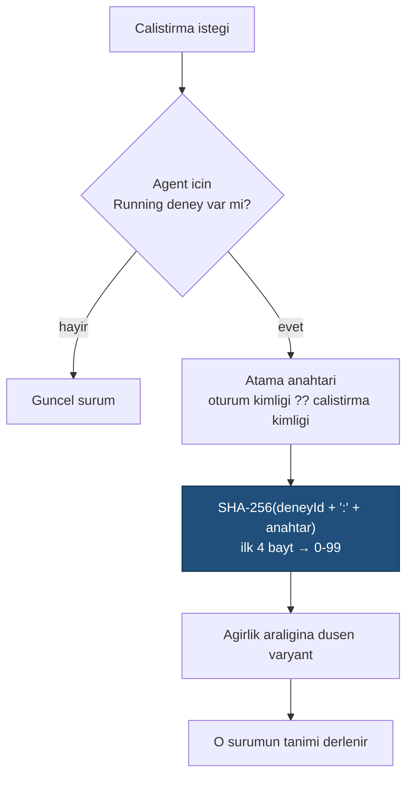

# Faz 19 — Sürüm Karşılaştırma, Diff ve A/B

> **Durum:** 📋 Planlandı
> **Kaynak:** [BEYIN-FIRTINASI.md](BEYIN-FIRTINASI.md) · **F-15**, **F-24**
> **Önkoşul:** [Faz 18](18-DEGERLENDIRME.md) — "hangisi daha iyi" sorusu ölçüm ister
> **Paketler:** `AgentPrism.Abstractions`, `.Core`, `.PostgreSql`, `.AspNetCore`, `.UI`
> **Yeni paket:** Yok · **Migration:** 0010 (planlanan sırada)

---

## Bu Faza Başlarken

1. [`MIMARI.md`](MIMARI.md) — bölüm 5 (`agent_definition_versions`)
2. [`KARARLAR.md`](KARARLAR.md) — **K-003** (hibrit tanım, kod kazanır), **K-045** (kütüphane yerine elle yazma), **K-002** (bundle bütçesi)
3. [`06-GOZLEMLENEBILIRLIK.md`](06-GOZLEMLENEBILIRLIK.md) — metrik etiketleri
4. Bu doküman

---

## Amaç

Altyapının yarısı hazır: tanım sürümleri ve geri alma Faz 1'den beri var.
Eksik olan üç şey:

1. İki sürümü **yan yana görmek** (F-24)
2. İki sürümü **aynı anda çalıştırmak** ve trafiği bölmek (F-15)
3. Metrikleri **sürüm bazında** kırmak

---

## 19.1 — Diff (F-24)

### Kütüphane alınmaz

Bir diff kütüphanesi (`diff`, `jsdiff`) 8–20 KB gzip ekler. Satır bazlı bir LCS
diff'i ~120 satırdır ve saf mantıktır — `frontend/src/lib/diff.ts` altında
yazılır ve Vitest ile test edilir. K-045'te yönlendirme için verilen kararın
aynı gerekçesi geçerlidir.

```typescript
// lib/diff.ts — saf mantik, Vitest ile testli
export type DiffLine = { kind: "same" | "added" | "removed"; text: string; leftNo?: number; rightNo?: number };
export function diffLines(left: string, right: string): DiffLine[];
```

### Neler karşılaştırılır

`AgentDefinition` alan alan karşılaştırılır; **her alan aynı biçimde
gösterilmez**:

| Alan | Gösterim |
|------|----------|
| `Instructions` | Satır bazlı diff (asıl değerli olan budur) |
| `Model` (`ModelBinding`) | Alan bazlı yan yana tablo |
| `ToolNames`, `SkillNames`, `CallableAgentNames` | Küme farkı: eklenen / çıkarılan |
| `Harness`, `Compaction`, `Memory` | Alan bazlı tablo |

### Uç

```
GET {prefix}/api/agents/{name}/versions/{a}/diff/{b}
```

Sunucu **ham iki tanımı** döndürür; diff hesabı arayüzde yapılır. Gerekçe: diff
sunucuda hesaplanırsa her istemci aynı biçime mahkûm olur ve sunucuya CPU
maliyeti biner. Ham veriyi vermek daha esnektir.

Ayrıca Faz 9'un Audit ekranındaki basit JSON gösterimi bu bileşenle değiştirilir.

---

## 19.2 — Sürüm Bazlı Metrik

Bugün `runs` tablosu agent **adını** taşır, **sürümünü** taşımaz. Sürüm bazlı
kırılım bu yüzden imkânsız.

```sql
ALTER TABLE {schema}.runs ADD COLUMN agent_version integer;
ALTER TABLE {schema}.runs ADD COLUMN experiment_id uuid;
ALTER TABLE {schema}.runs ADD COLUMN variant       text;

CREATE INDEX IF NOT EXISTS runs_agent_version_idx
    ON {schema}.runs (tenant_id, agent_name, agent_version, started_at DESC)
    WHERE agent_version IS NOT NULL;
```

Metrik etiketi de eklenir: `agentprism.agent.version`. Faz 6'nın
`AgentPrismDiagnostics.Tags` sınıfı genişler.

> ⚠️ **Etiket kardinalitesi.** Sürüm numarası zamanla artar ve her yeni sürüm
> yeni bir zaman serisi üretir. Bu kabul edilebilir bir kardinalitedir (agent
> başına onlarca), ama `experiment_id` etiketi **metriğe eklenmez** — deney
> sayısı sınırsızdır. Deney kırılımı yalnız veritabanı sorgusuyla yapılır.

`RunStatistics` yeni bir kırılım alır: `ByVersion`. K-041 gereği hesap **depoda**
yapılır, bellekte değil.

---

## 19.3 — A/B (F-15)

### Model

```csharp
public sealed record Experiment
{
    public Guid Id { get; init; }
    public required string TenantId { get; init; }
    public required string Name { get; init; }
    public required string AgentName { get; init; }
    public required IReadOnlyList<ExperimentVariant> Variants { get; init; }
    public ExperimentStatus Status { get; init; } = ExperimentStatus.Draft;
    public string? AssignmentKey { get; init; }      // varsayilan: oturum kimligi
    public DateTimeOffset? StartedAt { get; init; }
    public DateTimeOffset? EndedAt { get; init; }
}

public sealed record ExperimentVariant
{
    public required string Name { get; init; }       // "control", "v3"
    public required int Version { get; init; }       // agent_definition_versions.version
    public required int Weight { get; init; }        // 0-100, toplam 100 olmali
}

public enum ExperimentStatus { Draft, Running, Stopped }
```

### Atama deterministiktir



**Neden deterministik:** aynı oturum her turda **aynı** varyantta kalmalıdır.
Rastgele atama, bir konuşmanın ortasında talimat değiştirir; sonuçlar
karşılaştırılamaz ve kullanıcı tutarsız yanıt alır.

Atama sonucu `runs.experiment_id` ve `runs.variant` alanlarına yazılır.

### Kurallar

- Deney **aynı agent'ın sürümleri** arasındadır. Farklı agent'lar arası deney
  bu fazın kapsamı dışındadır (ad çözümlemesini karmaşıklaştırır)
- Ağırlıklar toplamı 100 olmalıdır; değilse `400`
- Aynı agent için **aynı anda tek** `Running` deney olabilir
- Kod kaynaklı agent'larda (K-003) deney **yapılamaz** — sürüm geçmişi yoktur;
  uç `400` ile açıkça söyler
- Deney durdurulduğunda devam eden oturumlar **son kez** atandıkları varyantta
  biter; yeni oturumlar güncel sürüme gider

### Derleyici etkisi

`CompiledAgentCache` anahtarı bugün `(name, version)`. Deney, aynı ad için
birden çok sürümün **aynı anda** derlenmiş olmasını gerektirir. Anahtar zaten
sürümü içerdiği için ek değişiklik gerekmez — ama `IAgentCatalog.ResolveAsync`
bir sürüm parametresi almalıdır (`ResolveAsync(name, version)` aşırı yüklemesi).

---

## 19.4 — Uçlar ve Arayüz

| Uç | Rol | Ne yapar |
|----|-----|----------|
| `GET {prefix}/api/agents/{name}/versions` | Reader | Sürüm listesi (zaten var, genişler) |
| `GET {prefix}/api/agents/{name}/versions/{a}/diff/{b}` | Reader | İki ham tanım |
| `GET/PUT/DELETE {prefix}/api/experiments[/{name}]` | Admin | Deney yönetimi |
| `POST {prefix}/api/experiments/{name}/start` · `/stop` | Admin | Durum değişimi |
| `GET {prefix}/api/experiments/{name}/results` | Reader | Varyant bazlı sayı, hata oranı, token, süre (+ maliyet, Faz 20'den sonra) |

Arayüz:

- Agent detayında **sürüm karşılaştırma** görünümü (iki sürüm seç → diff)
- Yeni **Experiments** ekranı: varyantlar, ağırlıklar, canlı sonuç tablosu
- Sonuç tablosunda **istatistiksel anlamlılık iddiası yoktur** — ham sayılar
  gösterilir. Yanıltıcı bir "kazanan" etiketi konmaz

> Anlamlılık testi (z-testi vb.) eklenmesi cazip görünür ama örneklem
> bağımsızlığı varsayımı burada tutmaz (aynı kullanıcı çok tur atar). Ham sayı
> dürüst, yorum kullanıcınındır.

Bütçe hedefi: **+9 KB gzip'ten az** (diff dâhil).

---

## Testler

| Proje | Yeni test |
|-------|-----------|
| Frontend (Vitest) | `diffLines` — eşit, ekleme, silme, taşıma, boş girdi, uzun dosya |
| `AgentPrism.Core.UnitTests` | Deterministik atama (aynı anahtar → aynı varyant); ağırlık dağılımı (10.000 örnekte ±%2); ağırlık toplamı doğrulaması; kod agent'ında deney reddi |
| `AgentPrism.PostgreSql.IntegrationTests` | `ExperimentStoreContract`; `ByVersion` istatistiği; deney sonucu sorgusu |
| `AgentPrism.AspNetCore.FunctionalTests` | Diff ucu; deney yaşam döngüsü; aynı agent için ikinci `Running` deney reddi |
| `AgentPrism.Ui.E2ETests` | Sürüm diff'i; deney oluşturma ve sonuç tablosu |

**Gerçek kanıt:** iki talimat sürümü ile 20 çalıştırma yapılır; varyant
dağılımı, sürüm bazlı token ve hata oranı dokümana yazılır.

---

## Bu Fazda Verilecek Kararlar

1. **Diff kütüphanesi alınmaz** — elle LCS, K-045 gerekçesi.
2. **Diff arayüzde hesaplanır**, sunucu ham tanım döndürür.
3. **Atama deterministiktir** (oturum bazlı) — konuşma ortasında varyant
   değişmez.
4. **`experiment_id` metrik etiketi olmaz** — kardinalite.
5. **İstatistiksel "kazanan" iddiası yoktur** — ham sayılar gösterilir.

---

## Açık Sorular

1. **Atama anahtarı varsayılanı oturum mu, kullanıcı mı olmalı?** Kullanıcı
   bazlı atama daha doğru bir deney kurar ama AgentPrism kullanıcı kimliği
   tutmaz (kimlik tüketicinindir). Öneri: **oturum**, `AssignmentKey` ile
   tüketici kendi anahtarını verebilir.
2. **Deney sonuçları eval ile birleşsin mi?** Faz 18'in suite'i bir varyanta
   karşı çalıştırılabilir. Öneri: **evet** — `POST /api/evals/{name}/run` gövdesi
   `agentVersion` alabilsin.
3. **Sürüm bazlı metrik etiketi varsayılan açık mı?** Kardinaliteyi artırır.
   Öneri: **açık**, `AgentPrismObservabilityOptions` ile kapatılabilir.

---

## Bitiş Ölçütleri (DoD)

- [ ] İki sürüm arayüzde yan yana ve satır bazlı diff ile görülüyor
- [ ] Çalışan bir deney trafiği ağırlıklara göre bölüyor (gerçek dağılım
      dokümanda)
- [ ] Aynı oturum her turda aynı varyantta kalıyor
- [ ] `runs.agent_version` doluyor; `ByVersion` istatistiği doğru
- [ ] Deney durdurulunca yeni çalıştırmalar güncel sürüme gidiyor
- [ ] Kod kaynaklı agent'ta deney açıkça reddediliyor
- [ ] Dört doğrulama kapısı sıfır uyarı; bundle ölçüldü

---

## Riskler

| Risk | Önlem |
|------|-------|
| Deney kullanıcıya tutarsız deneyim yaşatır | Oturum bazlı deterministik atama |
| Metrik kardinalitesi patlar | Deney kimliği etikete girmez; sürüm etiketi kapatılabilir |
| Diff büyük metinlerde yavaşlar | LCS O(n·m); 5.000 satır üstünde blok bazlı geri dönüş ve uyarı |
| Yanlış "kazanan" yorumu | Anlamlılık iddiası yok; ham sayı ve örneklem büyüklüğü birlikte gösterilir |

---

## Sonraki Faza Devir Notu

- Faz 20 (maliyet) deney sonuç tablosuna **varyant başına maliyet** sütununu
  ekleyecektir; en çok beklenen karşılaştırma budur ("ucuz model yeterli mi?").
- Faz 21 (kota) deneyleri etkilemez; kota kiracı düzeyindedir.
