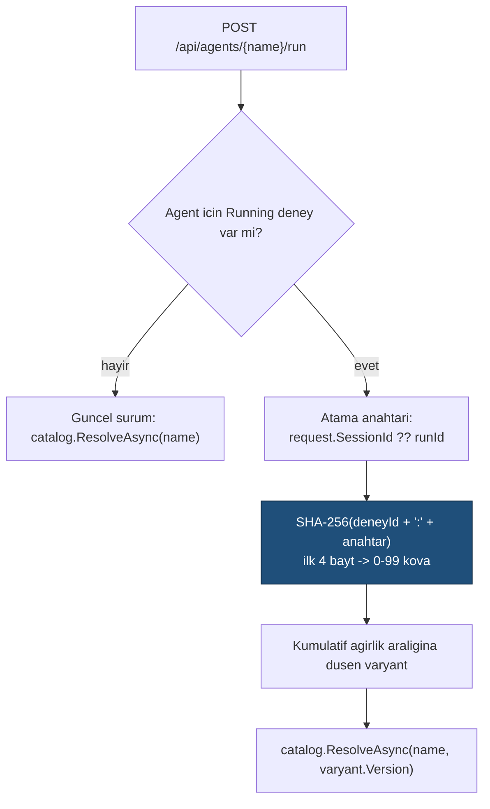

# Faz 19 — Sürüm Karşılaştırma, Diff ve A/B

> **Durum:** ✅ Tamamlandı (2026-08-03)
> **Kaynak:** [BEYIN-FIRTINASI.md](BEYIN-FIRTINASI.md) · **F-15**, **F-24**
> **Önkoşul:** [Faz 18](18-DEGERLENDIRME.md) — "hangisi daha iyi" sorusu ölçüm ister
> **Paketler:** `AgentPrism.Abstractions`, `.Core`, `.PostgreSql`, `.AspNetCore`, `.UI`
> **Yeni paket:** Yok · **Migration:** 0010 (`0010_experiments.sql`)

---

## Bu Faza Başlarken

1. [`MIMARI.md`](MIMARI.md) — bölüm 5 (`agent_definition_versions`)
2. [`KARARLAR.md`](KARARLAR.md) — **K-003** (hibrit tanım, kod kazanır), **K-045** (kütüphane yerine elle yazma), **K-002** (bundle bütçesi), **K-041** (hesap depoda yapılır)
3. [`06-GOZLEMLENEBILIRLIK.md`](06-GOZLEMLENEBILIRLIK.md) — metrik etiketleri
4. Bu doküman

---

## Amaç

Altyapının yarısı hazırdı: tanım sürümleri ve geri alma Faz 1'den beri vardı.
Eksik olan üç şey inşa edildi:

1. İki sürümü **yan yana görmek** (F-24) — 19.1
2. İki sürümü **aynı anda çalıştırmak** ve trafiği bölmek (F-15) — 19.3
3. Metrikleri **sürüm bazında** kırmak — 19.2

Üç açık soru dokümanın önerileriyle kapatıldı (bkz. bölüm "Kapatılan Açık Sorular"):
atama anahtarı = oturum kimliği; eval sabit sürüme karşı çalışabilir; sürüm metrik
etiketi varsayılan açık.

---

## 19.1 — Diff (F-24)

### Kütüphane alınmadı

Plan gerçekleşti: `frontend/src/lib/diff.ts` elle yazılan bir LCS diff'i (K-045
gerekçesinin devamı). `diffLines(left, right)` satır bazlı diff + 5.000 satır
üstünde LCS'siz geri dönüş (`truncated: true`) döner; `diffSets(left, right)`
küme farkı (eklenen/çıkarılan/değişmeyen) döner. 9 Vitest testiyle korunur
(`diff.test.ts`): eşit, ekleme, silme, taşıma (add+remove çifti olarak), boş
girdi, 5.000 satır üstü geri dönüş.

### Neler karşılaştırılır

`components/diff-view.tsx` üç bileşen sunar:

| Bileşen | Kullanım | Alan |
|---------|----------|------|
| `DiffView` | Satır bazlı diff | `Instructions`, audit `before`/`after` |
| `FieldDiffTable` | Alan-alan tablo, farklı satır vurgulanır | `Model`, `Harness`, `Compaction`, `Memory` |
| `SetDiff` | Küme farkı, renkli rozetler | `ToolNames`, `SkillNames`, `CallableAgentNames` |

### Uç

```
GET {prefix}/api/agents/{name}/versions/{a}/diff/{b}
```

`AgentEndpoints.GetVersionDiffAsync` — sunucu **ham iki tanımı**
(`AgentVersionDiffResponse { Left, Right }`) döndürür; diff hesabı istemcide
yapılır. İki `IAgentDefinitionStore.GetVersionAsync(name, version)` çağrısı;
biri bulunamazsa `404`.

Faz 9'un Audit ekranındaki basit JSON gösterimi bu bileşenle değiştirildi:
`before`/`after` ikisi de doluysa (`update`) `DiffView`; biri `null`'sa
(`create`/`delete`) eski tek taraflı `CodeBlock` korunur.

Arayüzde: agent detayında `VersionHistory` tablosuna sürüm satırları için
onay kutuları eklendi; iki sürüm seçildiğinde `VersionCompare` alt bileşeni
açılır ve yukarıdaki üç görünümü art arda gösterir.

---

## 19.2 — Sürüm Bazlı Metrik

Migration `0010_experiments.sql`:

```sql
ALTER TABLE {schema}.runs ADD COLUMN IF NOT EXISTS agent_version integer;
ALTER TABLE {schema}.runs ADD COLUMN IF NOT EXISTS experiment_id uuid;
ALTER TABLE {schema}.runs ADD COLUMN IF NOT EXISTS variant       text;

CREATE INDEX IF NOT EXISTS runs_agent_version_idx
    ON {schema}.runs (tenant_id, agent_name, agent_version, started_at DESC)
    WHERE agent_version IS NOT NULL;

CREATE INDEX IF NOT EXISTS runs_experiment_idx
    ON {schema}.runs (experiment_id, variant)
    WHERE experiment_id IS NOT NULL;
```

Metrik etiketi eklendi: `AgentPrismDiagnostics.Tags.AgentVersion` =
`"agentprism.agent.version"`. `RunRecordingAgentDecorator` her çözülen agent'a
`descriptor.Version`'ı varsayılan sürüm olarak geçer; bir A/B deneyi tarafından
çözülen bir çalıştırmada `AgentPrismRunOptions.AgentVersion` bunun üzerine yazar.

> ⚠️ **Etiket kardinalitesi — karar korundu.** `agentprism.agent.version` etiketi
> **varsayılan açıktır** (`AgentPrismObservabilityOptions.IncludeAgentVersionTag`,
> kullanıcı kararıyla), ama `experiment_id` **hiçbir zaman** etiket olmaz — deney
> sayısı sınırsızdır. Deney kırılımı yalnız `IRunStore.GetExperimentResultsAsync`
> sorgusuyla yapılır.

`RunStatistics.ByVersion` (yeni `RunVersionStatistics { AgentName, Version,
TotalRuns, FailedRuns, TotalTokens }`) eklendi; `PostgresRunStore.GetStatisticsAsync`
dördüncü bir sonuç kümesi (`ByAgent`/`ByModel` ile simetrik) okur. K-041 gereği
hesap depoda yapılır.

---

## 19.3 — A/B (F-15)

### Gerçekleşen model

```csharp
public sealed record Experiment
{
    public required Guid Id { get; init; }
    public required string TenantId { get; init; }
    public required string Name { get; init; }
    public required string AgentName { get; init; }
    public required IReadOnlyList<ExperimentVariant> Variants { get; init; }
    public ExperimentStatus Status { get; init; } = ExperimentStatus.Draft;
    public string? AssignmentKey { get; init; }      // REZERVE — bkz. asagi
    public DateTimeOffset? StartedAt { get; init; }
    public DateTimeOffset? EndedAt { get; init; }
    public DateTimeOffset? UpdatedAt { get; init; }
}

public sealed record ExperimentVariant
{
    public required string Name { get; init; }
    public required int Version { get; init; }
    public required int Weight { get; init; }        // toplam 100 olmali
}

public enum ExperimentStatus { Draft = 0, Running = 1, Stopped = 2 }
```

`IExperimentStore` (`Abstractions/Experiments/IExperimentStore.cs`):
`ListAsync`, `GetAsync`, `GetRunningAsync`, `SaveAsync` (Draft-dışı düzenleme
→ `AgentPrismException`), `DeleteAsync` (Running silinemez), `StartAsync`
(başka Running varsa → `AgentPrismException`), `StopAsync`. İki uygulama:
`InMemoryExperimentStore` (Core), `PostgresExperimentStore` (PostgreSql,
`variants` tek bir `jsonb` sütununda). Her ikisi de `AuditingExperimentStore`
ile sarılır (Admin'in bilinçli kararı — `AgentDefinitionStore` ile aynı
gerekçe, `IEvalStore`/`IJobStore`'un aksine yürütmenin yan ürünü değil).

### Atama deterministiktir

`ExperimentAssignmentResolver` (`Core/Experiments/`) — `AgentEndpoints.RunAsync`
içinde çağrılır:



`ExperimentAssignmentResolver.SelectVariant` `internal static`'tir — testler
doğrudan çağırır (deterministiklik + ağırlık dağılımı testleri).

### Kurallar (kod ile doğrulanmış)

- Deney **aynı agent'ın sürümleri** arasındadır; `ExperimentEndpoints.SaveAsync`
  `descriptor.Origin == Code` ise `400` döner (surum gecmisi tutmaz).
- Ağırlıklar toplamı 100 olmalıdır; değilse `400`.
- Her varyantın `Version`'ı `IAgentDefinitionStore.GetVersionAsync` ile var mı
  doğrulanır; yoksa `400`.
- Aynı agent için **aynı anda tek** `Running` deney — uygulama katmanında
  (`InMemoryExperimentStore`) VE veritabanında (`experiments_running_agent_uq`
  kısmi benzersiz indeksi) zorlanır; ikinci ihlal `409`.
- Deney durdurulduğunda devam eden oturumlar son atandıkları varyantta biter
  (atama yalnız `Running` deneyler için yapılır); yeni oturumlar güncel sürüme gider.

### Derleyici etkisi — gerçekleşen çözüm

Plan `IAgentSource`'a doğrudan metot eklemeyi düşünüyordu; bunun yerine
**isteğe bağlı bir marker arayüz** eklendi:

```csharp
public interface IVersionedAgentSource : IAgentSource
{
    ValueTask<AIAgent?> ResolveVersionAsync(string agentName, int version, CancellationToken ct = default);
}
```

`DefinitionStoreAgentSource` bunu uygular; `CodeAgentSource` **hiç değişmedi**
(K-003 korunur — kod kaynağının sürüm kavramı yok). `IAgentCatalog.ResolveAsync(name, int? version, ct)`
yeni aşırı yüklemesi `CompositeAgentCatalog`'da: kaynağı bulur, `IVersionedAgentSource`
değilse `AgentPrismException`, sürüm yoksa `AgentPrismException`.
`CompiledAgentCache` **değişmedi** — anahtar zaten `(Name, Version, DependencyFingerprint)`.

---

## 19.4 — Uçlar ve Arayüz (gerçekleşen)

| Uç | Rol | Dosya |
|----|-----|-------|
| `GET .../versions/{a}/diff/{b}` | Reader | `AgentEndpoints.GetVersionDiffAsync` |
| `GET/PUT/DELETE {prefix}/api/experiments[/{name}]` | Reader/Admin | `ExperimentEndpoints` |
| `POST .../start` · `/stop` | Admin | `ExperimentEndpoints.StartAsync`/`StopAsync` |
| `GET .../results` | Reader | `ExperimentEndpoints.GetResultsAsync` → `IRunStore.GetExperimentResultsAsync` |

`EvalRunTriggerRequest.AgentVersion` eklendi; `EvalEndpoints.TriggerRunAsync`
kod-agent + sürüm isteği → `400`, olmayan sürüm → `400`. `EvalJobHandler`
artık `catalog.ResolveAsync(name, version, ct)` ile **sabit** bir sürüme karşı
çalışabilir; eval, deney (Experiment) kavramından tamamen bağımsızdır.

Arayüz:

- Agent detayında sürüm karşılaştırma (`agent-detail.tsx`'te `VersionCompare`)
- Yeni **Experiments** ekranı (`experiments.tsx` liste + inline form,
  `experiment-detail.tsx` detay/start-stop/canlı sonuç tablosu)
- Sonuç tablosunda istatistiksel anlamlılık iddiası **yok** — ham sayılar

Bundle: **113.2 KB gzip** (Faz 18 sonu: 109.6 KB → **+3.6 KB**, hedef +9 KB'nin
belirgin altında).

---

## Testler (gerçekleşen)

| Proje | Dosya | Kapsam |
|-------|-------|--------|
| Frontend (Vitest) | `lib/diff.test.ts` | 9 test: eşit/ekleme/silme/taşıma/boş/truncation |
| `AgentPrism.Core.UnitTests` | `Experiments/ExperimentAssignmentResolverTests.cs` | Deterministik atama, ağırlık dağılımı (10.000 örnek, ±2 pp), geri dönüş |
| | `Catalog/CompositeAgentCatalogTests.cs` (ek) | Versiyonlu kaynak çözümü, kod-agent+version → exception, olmayan sürüm → exception |
| | `Evaluation/EvalJobHandlerTests.cs` (ek) | Payload'daki sürüm pinlenir, katalogun güncel sürümünü değil isteneni çözer |
| `AgentPrism.PostgreSql.IntegrationTests` | `Contracts/ExperimentStoreContract.cs` (+InMemory/Postgres) | CRUD, Draft-dışı düzenleme reddi, ikinci Running reddi, silme kuralları |
| | `Contracts/RunStoreContract.cs` (ek) | `ByVersion` kırılımı, `GetExperimentResultsAsync` |
| | `Contracts/AgentDefinitionStoreContract.cs` (ek) | `GetVersionAsync` (var/yok/agent yok) |
| `AgentPrism.AspNetCore.FunctionalTests` | `ExperimentEndpointTests.cs` | Oluşturma, ağırlık≠100, kod-agent reddi, olmayan sürüm, yaşam döngüsü, ikinci Running→409, sonuç ucu |
| | `AgentCrudTests.cs` (ek) | Diff ucu başarı + olmayan sürüm→404 |
| | `EvalEndpointTests.cs` (ek) | `AgentVersion` ile kösu, olmayan sürüm→400, kod-agent→400 |
| `AgentPrism.Ui.E2ETests` | `UiTests.cs` (ek) | Sürüm diff'i (gerçek tarayıcı), deney oluşturma→başlatma→**gerçek trafik**→sonuç tablosu→durdurma |

Toplam yeni/değişen otomatik test: Core +~15, PostgreSql +~20, AspNetCore
+~15, E2E +2, Vitest +9. Dört doğrulama kapısı (`build`/`test`/`pack`/`format`)
sıfır uyarıyla geçti; tüm test projeleri toplamda **1057 test, 0 hata**.

### Gerçek kanıt

`ExperimentEndpointTests` içinde geçici bir test ile ölçüldü (sonra silindi —
kanıt burada kalıcı): iki talimat sürümü (`control`=v1, `v2`=v2, %50/%50),
20 farklı `sessionId` ile `POST .../run`:

```
control (v1): 6 çalıştırma  (%30)
v2      (v2): 14 çalıştırma (%70)
Toplam: 20 çalıştırma, 0 hata, tümü Completed.
```

n=20'de %50/%50 hedeften bu kadar sapma, SHA-256 tabanlı deterministik
atamanın küçük örneklemdeki normal varyansıdır (doğrulama testinde 10.000
örnekte ±2 puan içinde kaldığı ayrıca doğrulandı — bkz. yukarıdaki test
tablosu). Ayrıca `samples/AgentPrism.Api` üzerinde canlı doğrulama yapıldı:
agent oluşturma→v2'ye güncelleme→diff ucu (200, doğru `left`/`right`)→olmayan
sürüm diff'i (404)→deney oluşturma (Draft)→başlatma (Running)→durdurma
(Stopped) hepsi gerçek HTTP istekleriyle doğrulandı.

---

## Kapatılan Açık Sorular

1. **Atama anahtarı varsayılanı** → **oturum kimliği** (`request.SessionId ?? runId`).
   `Experiment.AssignmentKey` bu fazda **rezerve** — modelde tutulur, çalışma
   zamanı hiç okumaz.
2. **Deney sonuçları eval ile birleşsin mi?** → **Kısmen evet, ayrı mekanizma
   olarak.** `EvalRunTriggerRequest.AgentVersion` eklendi — eval sabit bir
   sürüme karşı çalışır. Eval bir deney varyantını **bilmez**; `ExperimentId`/
   `Variant` eval çalıştırmalarına hiç yazılmaz (bilinçli ayrım, bkz. karar
   K-133 aşağıda).
3. **Sürüm bazlı metrik etiketi varsayılan açık mı?** → **Evet**,
   `AgentPrismObservabilityOptions.IncludeAgentVersionTag = true`, kapatılabilir.

---

## Bitiş Ölçütleri (DoD)

- [x] İki sürüm arayüzde yan yana ve satır bazlı diff ile görülüyor
- [x] Çalışan bir deney trafiği ağırlıklara göre bölüyor (gerçek dağılım: 6/14, n=20 — yukarıda)
- [x] Aynı oturum her turda aynı varyantta kalıyor (deterministik SHA-256 ataması, testle doğrulandı)
- [x] `runs.agent_version` doluyor; `ByVersion` istatistiği doğru
- [x] Deney durdurulunca yeni çalıştırmalar güncel sürüme gidiyor
- [x] Kod kaynaklı agent'ta deney açıkça reddediliyor (400, "surum gecmisi tutmaz")
- [x] Dört doğrulama kapısı sıfır uyarı; bundle ölçüldü (113.2 KB gzip, +3.6 KB)

---

## Riskler

| Risk | Önlem | Durum |
|------|-------|-------|
| Deney kullanıcıya tutarsız deneyim yaşatır | Oturum bazlı deterministik atama | Uygulandı, test edildi |
| Metrik kardinalitesi patlar | Deney kimliği etikete girmez; sürüm etiketi kapatılabilir | Uygulandı |
| Diff büyük metinlerde yavaşlar | LCS O(n·m); 5.000 satır üstünde blok bazlı geri dönüş ve uyarı | Uygulandı, testle doğrulandı |
| Yanlış "kazanan" yorumu | Anlamlılık iddiası yok; ham sayı ve örneklem büyüklüğü birlikte gösterilir | Uygulandı |

---

## Sonraki Faza Devir Notu

- **Faz 20 (maliyet)** deney sonuç tablosuna **varyant başına maliyet** sütununu
  ekleyecektir; en çok beklenen karşılaştırma budur ("ucuz model yeterli mi?").
  `ExperimentEndpoints.GetResultsAsync` ve `ExperimentVariantResult` bu sütun
  için hazır bir ekleme noktasıdır — `TotalTokens` zaten kolon bazında var,
  fiyat listesi çarpımı Faz 20'de eklenir.
- **Faz 21 (kota)** deneyleri etkilemez; kota kiracı düzeyindedir.
- 🚨 **`IAgentCatalog.ResolveAsync(name, version, ct)` yalnızca
  `AgentEndpoints.RunAsync` içinde çağrılır** (bilinçli kapsam sınırı, K-131).
  Alt-agent çağrıları, workflow adımları ve eval çalıştırmaları deneye
  **girmez**. Yeni bir çağıran eklerken bu sınırı bilerek genişletmedikçe
  koru — aksi hâlde bir kullanıcının gördüğü talimat çalışma anında
  öngörülemez hâle gelir.
- 🚨 **`IVersionedAgentSource` yalnızca `DefinitionStoreAgentSource` uygular.**
  Yeni bir `IAgentSource` eklerken (örn. MAF hosting kaynağı) sürüm geçmişi
  yoksa bu arayüzü uygulama — `CompositeAgentCatalog` otomatik olarak
  `AgentPrismException` fırlatır, bu doğru davranıştır.
- `Experiment.AssignmentKey` alanı hâlâ rezerve. Bir sonraki fazda kullanıcı
  bazlı atama gerekirse, önce bu alanın nasıl okunacağına dair bir karar
  gerekir (K-003'e benzer bir tartışma: tüketici kimliği taşımıyor).
