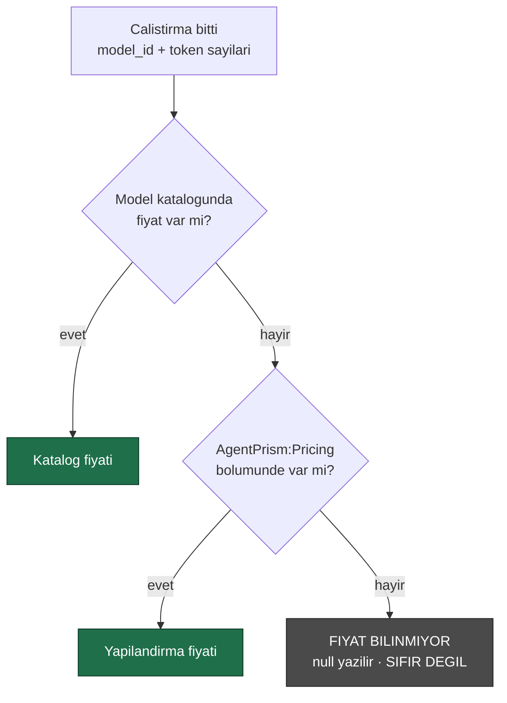

# Faz 20 — Maliyet Raporlaması ve Gösterge Paneli

> **Durum:** 📋 Planlandı
> **Kaynak:** [BEYIN-FIRTINASI.md](BEYIN-FIRTINASI.md) · **F-17**, **F-23**
> **Önkoşul:** Yok · Faz 8 önerilir (uyumlu sağlayıcıların fiyatları da yapılandırmadan gelir)
> **Sonraki bağımlı:** [Faz 21](21-KOTA-VE-OLAY-YAYINI.md) — kota maliyet görünürlüğünden sonra anlamlıdır
> **Paketler:** `AgentPrism.Abstractions`, `.Core`, `.PostgreSql`, `.AspNetCore`, `.UI`
> **Yeni paket:** Yok · **Migration:** 0011 (planlanan sırada)

---

## Bu Faza Başlarken

1. [`KARARLAR.md`](KARARLAR.md) — **K-032** (fiyat yapılandırmadan gelir, koda gömülmez), **K-034** (`/api/stats` neden maliyet döndürmüyordu), **K-041** (özet depoda hesaplanır), **K-002** (bundle bütçesi)
2. [`06-GOZLEMLENEBILIRLIK.md`](06-GOZLEMLENEBILIRLIK.md) — `RunStatistics.ByModel`, `runs.model_id`
3. [`19-SURUM-KARSILASTIRMA-VE-AB.md`](19-SURUM-KARSILASTIRMA-VE-AB.md) — bölüm 19.4 devir notu: deney sonuç
   tablosuna varyant başına maliyet sütunu bu fazda eklenir. Gerçekleşen tipler:
   `ExperimentVariantResult` (`Abstractions/Experiments/ExperimentVariantResult.cs`,
   zaten `TotalTokens` taşıyor — fiyat çarpımı bu fazda eklenir),
   `IRunStore.GetExperimentResultsAsync` (`ExperimentResultsQuery` alır,
   `PostgresRunStore`'da `SqlQueries.SelectExperimentResults` üzerinden çalışır),
   `ExperimentEndpoints.GetResultsAsync` (`AspNetCore/Endpoints/ExperimentEndpoints.cs`).
   Maliyet eklemek için `SelectExperimentResults` sorgusuna `runs.input_cost`/`output_cost`
   toplamı eklenir — bu fazın 20.2'de tanımladığı sütunlar zaten `runs` tablosunda olacak.
4. Bu doküman

---

## Amaç

OpenAI konsolunun en çok bakılan ekranı maliyet ekranıdır. AgentPrism'de token
kırılımı Faz 6'da geldi (`RunStatistics.ByModel`, `runs.model_id`); **eksik olan
tek şey fiyattır**.

İkinci iş: Settings ekranı bugün bir sayı listesi gösteriyor. Zaman serisi
grafikleri (çalıştırma/saat, hata oranı, token, maliyet) bir kontrol düzleminin
ana ekranıdır.

---

## 20.1 — Fiyat Nereden Gelir

K-032 kesindir: **AgentPrism fiyat uydurmaz.** Sağlayıcılar makinece okunabilir
fiyat listesi yayınlamaz; koda gömülen fiyat yayınlandığı gün yanlış olabilir ve
yanlış fiyat, maliyet raporunu **sessizce** bozar.

`ModelDescriptor` iki alanı **zaten taşıyor** (Faz 3'ten beri):

```csharp
decimal? InputCostPerMillionTokens { get; init; }
decimal? OutputCostPerMillionTokens { get; init; }
```

Bu alanlar bugün hiçbir yerde okunmuyor. Çözüm sırası:



```
AgentPrism:Pricing:openai:gpt-5.4-mini:Input   = 0.25
AgentPrism:Pricing:openai:gpt-5.4-mini:Output  = 2.00
AgentPrism:Pricing:openrouter:*:Input          = ...     ← joker desteklenmez, acikca yazilir
AgentPrism:Pricing:Currency                    = USD
```

🚨 **Bilinmeyen fiyat sıfır değildir.** Sıfır yazmak, kullanıcıya "bu model
bedava" demektir. `null` yazılır, raporda "fiyatı tanımsız N çalıştırma" satırı
görünür ve kullanıcı eksik yapılandırmayı **fark eder**.

---

## 20.2 — Fiyat Anlık Görüntüsü (kritik tasarım)

Fiyat okuma anında hesaplanırsa, fiyat listesi değiştiğinde **geçmiş maliyetler
de değişir**. Bu yanlıştır: geçen ayın faturası bugünkü fiyatla hesaplanmaz.

Bu yüzden maliyet **çalıştırma bittiğinde hesaplanır ve yazılır**:

```sql
ALTER TABLE {schema}.runs ADD COLUMN input_cost    numeric(20,10);
ALTER TABLE {schema}.runs ADD COLUMN output_cost   numeric(20,10);
ALTER TABLE {schema}.runs ADD COLUMN cost_currency text;
ALTER TABLE {schema}.runs ADD COLUMN pricing_source smallint;   -- 0=Catalog 1=Configuration 2=Unknown

CREATE INDEX IF NOT EXISTS runs_tenant_cost_idx
    ON {schema}.runs (tenant_id, started_at DESC)
    WHERE input_cost IS NOT NULL;
```

`numeric` kullanılır, `double` değil — para hesabında ikili kayan nokta
kullanılmaz. `decimal` ↔ `numeric` eşlemesi Npgsql'de doğrudandır.

Fiyat sonradan tanımlanırsa geçmiş **yeniden hesaplanmaz**. İstenirse ayrı bir
bakım ucu (`POST /api/stats/recalculate-costs`) eklenir; bu **Admin** yetkisidir
ve denetim izine yazılır.

---

## 20.3 — Raporlar

`RunStatistics` genişler:

```csharp
public sealed record RunStatistics
{
    // ...mevcut uyeler
    public decimal? TotalCost { get; init; }
    public string? Currency { get; init; }
    public long RunsWithUnknownPricing { get; init; }        // DURUSTLUK ALANI
    public IReadOnlyList<RunModelStatistics> ByModel { get; init; }   // maliyet alanlariyla genisler
    public IReadOnlyList<RunAgentStatistics> ByAgent { get; init; }
}

public sealed record TimeSeriesPoint
{
    public required DateTimeOffset Bucket { get; init; }
    public long Runs { get; init; }
    public long FailedRuns { get; init; }
    public long InputTokens { get; init; }
    public long OutputTokens { get; init; }
    public decimal? Cost { get; init; }
    public double? AverageDurationMs { get; init; }
}
```

`ExperimentVariantResult` (Faz 19) da genişler:

```csharp
public sealed record ExperimentVariantResult
{
    // ...mevcut uyeler (Variant, Version, TotalRuns, ..., TotalTokens, AverageDurationMs)
    public decimal? TotalCost { get; init; }
    public string? Currency { get; init; }
}
```

`SqlQueries.SelectExperimentResults`'a `SUM(input_cost) + SUM(output_cost)`
eklenir; `InMemoryRunStore.GetExperimentResultsAsync`'in `VariantTally`'sine de
aynı toplam eklenir (iki uygulama sözleşmesi aynı kalmalı, Faz 19'un
`ExperimentStoreContract` deseniyle test edilir).

Yeni uç:

```
GET {prefix}/api/stats/timeseries?from=…&to=…&bucket=hour|day&agent=…&model=…
```

- Hesap **depoda** yapılır (K-041). PostgreSQL'de `date_trunc` + `generate_series`
  ile **boş kovalar da döner** — aksi hâlde grafikte kesinti, "veri yok" değil
  "sıfır" gibi görünür
- Kova sayısı sınırlıdır (varsayılan en çok 500); aşılırsa `400` ve önerilen
  `bucket` değeri
- Bellek içi depo aynı sözleşmeyi tek geçişle karşılar

---

## 20.4 — Grafikler: Ölç, Sonra Karar Ver

Beyin fırtınası belgesi bunu açıkça yazmıştı: *"Bir grafik kütüphanesi 40–100 KB
gzip ekler; waterfall gibi elle SVG çizmek 5 KB'de biter. Karar ölçümle
verilmeli."*

**Uygulama sırası:**

1. Elle SVG ile üç grafik yazılır: çizgi (zaman serisi), çubuk (model kırılımı),
   yığılmış çubuk (durum dağılımı)
2. Bundle ölçülür
3. Sonuç `docs/KARARLAR.md`'ye ölçümle yazılır

**Beklenti:** üç grafik ~7 KB gzip. Waterfall (Faz 6) bunun kanıtıdır: hiyerarşik
görselleştirme 4,3 KB'de yazıldı (MCP ekranı dâhil).

Kütüphane **yalnız** şu durumda alınır: elle çizim 15 KB'yi aşarsa veya
etkileşim (zoom, tooltip, fırça seçimi) gereksinimi elle karşılanamazsa. O
durumda bile karar ölçümle ve gerekçeyle yazılır.

Grafiklerin ortak ilkeleri:

- Renkler tema değişkenlerinden gelir (açık/koyu tema ikisi de çalışır)
- Erişilebilirlik: yalnız renkle anlam verilmez; hata serisi kesikli çizgidir
- Boş veri durumu açıkça yazılır ("Bu aralıkta çalıştırma yok")

---

## 20.5 — Gösterge Paneli Ekranı

Yeni ekran: **Dashboard** — arayüzün **giriş ekranı** olur (bugün Agents).

| Bölüm | İçerik |
|-------|--------|
| Üst şerit | Bugün: çalıştırma, hata oranı, token, maliyet — dünle karşılaştırmalı |
| Zaman serisi | Çalıştırma/saat + hata oranı, seçilebilir aralık (1s, 24s, 7g, 30g) |
| Model kırılımı | Çalıştırma, token, maliyet — çubuk |
| Agent kırılımı | En çok çalışan 10 agent |
| Uyarılar | Fiyatı tanımsız model sayısı, açık devre kesici (Faz 8), bekleyen onay sayısı |

> Giriş ekranını değiştirmek bir davranış değişikliğidir; `docs/05-AGENTPRISM-UI.md`
> güncellenir ve `router.tsx` varsayılan rotası değişir.

Bütçe hedefi: **+12 KB gzip'ten az** (grafikler + ekran).

---

## Testler

| Proje | Yeni test |
|-------|-----------|
| `AgentPrism.Core.UnitTests` | Fiyat çözümleme sırası; bilinmeyen fiyat **null** (sıfır değil); `decimal` yuvarlama; para birimi tutarlılığı |
| `AgentPrism.PostgreSql.IntegrationTests` | Maliyet yazımı; `numeric` gidiş-dönüş; zaman serisi **boş kova** üretimi; kova sınırı; kiracı yalıtımı |
| `AgentPrism.AspNetCore.FunctionalTests` | `/api/stats` maliyet alanları; `/api/stats/timeseries` parametre doğrulaması; yeniden hesaplama ucunun rolü |
| Frontend (Vitest) | Ölçek hesabı, kova etiketleme, boş veri durumu — `lib/chart.ts` saf mantık |
| `AgentPrism.Ui.E2ETests` | Dashboard yükleniyor, grafikler çiziliyor, aralık değiştirilebiliyor |

**Gerçek kanıt:** fiyat yapılandırılmış bir kurulumda 10 çalıştırma yapılır;
`/api/stats` maliyet çıktısı ve dashboard ekran davranışı dokümana yazılır.
Fiyatsız bir model ile "tanımsız" sayacının arttığı da gösterilir.

---

## Bu Fazda Verilecek Kararlar

1. **Fiyat önce model kataloğundan, sonra `AgentPrism:Pricing` bölümünden** —
   iki kaynak da yapılandırmadır (K-032).
2. **Bilinmeyen fiyat `null`, sıfır değil** — sessiz yanlış rapor üretmeyiz.
3. **Maliyet çalıştırma anında hesaplanıp yazılır** — geçmiş, fiyat değişince
   değişmez.
4. **`numeric` kullanılır** — para hesabında kayan nokta yok.
5. **Grafik kütüphanesi kararı ölçümle verilir** ve ölçüm karar defterine yazılır.
6. **Dashboard giriş ekranı olur.**

---

## Açık Sorular

1. **Para birimi dönüşümü yapılsın mı?** Kur kaynağı gerektirir ve K-032'nin
   aynı sorunu doğar. Öneri: **hayır** — tek para birimi, etiketi
   yapılandırmadan.
2. **Faz 12'nin ağaç maliyeti nasıl gösterilsin?** Kök satırda ağaç toplamı,
   alt satırlarda kendi maliyeti. Öneri: **iki ayrı sütun**, toplanmaz.
3. **Eval ve workflow çalıştırmaları dashboard'a dâhil mi?** Öneri: `runs.kind`
   filtresiyle **ayrı gösterilir**; toplam maliyette **dâhildir** (gerçekten
   harcanmıştır).
4. **Yeniden hesaplama ucu olsun mu?** Öneri: **evet**, Admin + denetim izi.

---

## Bitiş Ölçütleri (DoD)

- [ ] Fiyat yapılandırıldığında çalıştırma maliyeti `runs` satırına yazılıyor
- [ ] Fiyat tanımsızsa `null` yazılıyor ve rapor bunu **sayıyor**
- [ ] `/api/stats/timeseries` boş kovalarla birlikte doğru seri döndürüyor
- [ ] Dashboard giriş ekranı; üç grafik çiziliyor; tema değişimi çalışıyor
- [ ] Grafik yaklaşımı ölçüldü ve karar yazıldı
- [ ] Faz 6'nın `ByModel` kırılımı maliyet sütunlarıyla genişledi
- [ ] Bundle ölçüldü; bütçe aşılmadı
- [ ] Dört doğrulama kapısı sıfır uyarı

---

## Riskler

| Risk | Önlem |
|------|-------|
| Yanlış fiyat yanlış rapor üretir | Fiyat yalnız yapılandırmadan; kaynak (`pricing_source`) kaydedilir ve raporda görünür |
| Grafik kütüphanesi bütçeyi yer | Önce elle çizim, sonra ölçüm |
| Zaman serisi sorgusu yavaşlar | Kova sınırı; kısmi indeks; `date_trunc` indeksli sütun üzerinde |
| Yerel modelde token gelmez (Faz 8) | Maliyet `null`; "tanımsız" sayacında görünür |
| Giriş ekranı değişimi kullanıcıyı şaşırtır | Yan menüde Agents ilk sırada kalır; değişiklik dokümante edilir |

---

## Sonraki Faza Devir Notu

- **Faz 21 (kota) bu fazın maliyet alanlarını kullanır.** Kota "token" veya
  "para" cinsinden tanımlanabilir; para cinsi ancak fiyat tanımlıysa anlamlıdır
  ve tanımsızsa kota **token'a düşer**.
- Faz 19'un deney sonuç tablosu maliyet sütunu ile tamamlanır.
- Faz 25 (saklama) `runs` özetini korur, olayları düşürür — maliyet alanları
  `runs` üzerinde olduğu için arşivleme sonrası da raporlanabilir.
