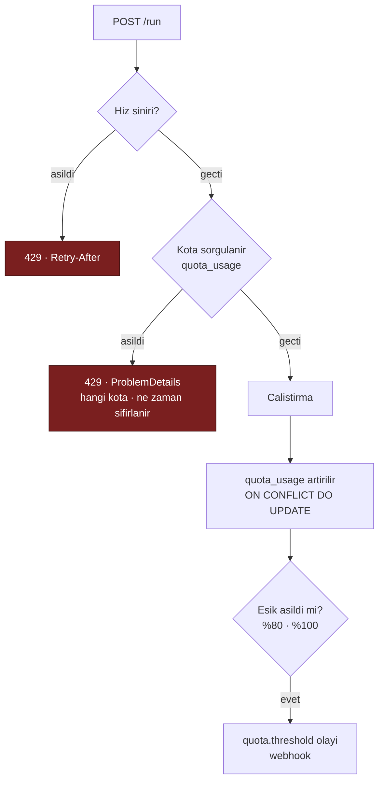

# Faz 21 — Hız Sınırı, Kota ve Olay Yayını

> **Durum:** ✅ Tamamlandı (2026-08-03)
> **Kaynak:** [BEYIN-FIRTINASI.md](arsiv/BEYIN-FIRTINASI.md) · **F-18**, **F-19**
> **Önkoşul:** [Faz 20](20-MALIYET-VE-GOSTERGE-PANELI.md) (para cinsi kota için) · [Faz 17](17-TOPLU-VE-ZAMANLANMIS-CALISTIRMA.md) (webhook teslimi kuyruğu kullanır)
> **Paketler:** `AgentPrism.Abstractions`, `.Core`, `.PostgreSql`, `.AspNetCore`, `.UI`
> **Yeni paket:** Yok (21.1 ölçüldü — `System.Threading.RateLimiting` paylaşılan çerçevede) · **Migration:** 0012

---

## Bu Faza Başlarken

> `faz-baslangic` skill'ini uygula. Aşağıdaki liste o skill'in 2. adımıdır —
> **tamamını değil, yalnız işaret edilen bölümleri oku.**

1. Bu doküman
2. Kararlar — dosyanın tamamını **okuma**, yalnız bu kalemleri grep'le:
   ```bash
   grep -n "K-059\|K-007\|K-010\|K-15[0-7]" docs/KARARLAR.md
   ```
   **K-059** (sır veritabanına yazılmaz, anahtar adı yazılır), **K-007** (bağımlılık),
   **K-010** (erişim katmanları), **K-150…K-157** (Faz 20'nin maliyet kararları —
   özellikle K-154: `runs` sağlayıcı sütunu taşımaz)
3. [`20-MALIYET-VE-GOSTERGE-PANELI.md`](20-MALIYET-VE-GOSTERGE-PANELI.md) — yalnız devir notu:
   ```bash
   awk '/## Sonraki Faza Devir Notu/,0' docs/20-MALIYET-VE-GOSTERGE-PANELI.md
   ```
   Para cinsinden kota bu fazın `RunStatistics.TotalCost`/`RunCost`/`RunPricingResolver`'ını
   kullanacaksa gerçekleşen tipler orada. Fiyatı tanımsız bir modelde kota **token'a düşer**
   (`RunStatistics.RunsWithUnknownPricing` bunu sayar).
4. Alan hafızası (bu faz üç alana dokunuyor):
   [`hafiza/aspnetcore-di.md`](hafiza/aspnetcore-di.md) (yeni uçlar, DI kaydı),
   [`hafiza/postgresql.md`](hafiza/postgresql.md) (migration 0012, sabit sütun indeksi),
   [`hafiza/cekirdek-calistirma.md`](hafiza/cekirdek-calistirma.md) (sır süzgeci, kayıt zinciri)
5. Gerektiğinde, tamamı değil ilgili bölümü:
   [`06-GOZLEMLENEBILIRLIK.md`](06-GOZLEMLENEBILIRLIK.md) (kiracı bağlamı, onay akışı) ·
   [`17-TOPLU-VE-ZAMANLANMIS-CALISTIRMA.md`](17-TOPLU-VE-ZAMANLANMIS-CALISTIRMA.md) (iş kuyruğu, yeniden deneme — webhook teslimi bunu kullanır)

---

## Amaç

İki ayrı iş, tek fazda: ikisi de "AgentPrism'i dış dünyayla sözleşmeye bağlar".

- **F-18** — Kiracı ve agent bazında istek/token/maliyet kotası, aşımda `429`
- **F-19** — Çalıştırma tamamlandığında veya onay beklerken dış sisteme bildirim

F-19'un gerekçesi somuttur: Faz 6'nın onay akışı, **kimse arayüze bakmıyorsa**
bekleyen çağrının görülmemesi sorununu üretti. Faz 16 aynı sorunu human-in-the-loop
için tekrarladı.

---

## 21.1 — Hız Sınırı: Önce Ölçüm

`System.Threading.RateLimiting` .NET'te vardır. Uygulamadan önce doğrulayın:

```bash
dotnet list src/AgentPrism.AspNetCore/AgentPrism.AspNetCore.csproj package --include-transitive \
  | grep -i ratelimit
```

**Ölçüm sonucu (2026-08-03): ek paket YOK.** `System.Threading.RateLimiting.dll`
`Microsoft.AspNetCore.App.Ref` 9.0.9 ve 10.0.0 paketlerinin `ref/` klasöründedir.

> ⚠️ `dotnet list package --include-transitive` bunu **göstermez** — paylaşılan
> çerçeve tipleri geçişli paket listesinde çıkmaz. Doğrulamak için ref pack'e bakın:
> `find /usr/local/share/dotnet/packs/Microsoft.AspNetCore.App.Ref -name "System.Threading.RateLimiting.dll"`

AgentPrism kendi middleware'ini **yazmaz**; `PartitionedRateLimiter` üzerine
ince bir katman kurar. Tüketici zaten `AddRateLimiter()` kullanıyorsa AgentPrism
onunla yarışmaz: AgentPrism'in sınırı **kendi uç grubuna** uygulanır.

---

## 21.2 — Kota Modeli

İki farklı kavram vardır ve karıştırılmamalıdır:

| Kavram | Zaman ölçeği | Amaç | Uygulama |
|--------|--------------|------|----------|
| **Hız sınırı** | Saniye/dakika | Ani yükü düzleştirmek | Bellekte, `PartitionedRateLimiter` |
| **Kota** | Gün/ay | Toplam tüketimi sınırlamak | Veritabanında sayaç |

```sql
CREATE TABLE {schema}.quotas (
    id           uuid        NOT NULL PRIMARY KEY,
    tenant_id    text        NOT NULL,
    agent_name   text,                          -- NULL = kiracinin tumu
    period       smallint    NOT NULL,          -- 0=Daily 1=Monthly
    max_runs     bigint,
    max_tokens   bigint,
    max_cost     numeric(20,10),
    enabled      boolean     NOT NULL DEFAULT true,
    created_at   timestamptz NOT NULL,
    updated_at   timestamptz NOT NULL
);

CREATE UNIQUE INDEX quotas_scope_uq
    ON {schema}.quotas (tenant_id, COALESCE(agent_name, ''), period);

CREATE TABLE {schema}.quota_usage (
    tenant_id    text        NOT NULL,
    agent_name   text        NOT NULL DEFAULT '',   -- '' = kiraci geneli
    period_start date        NOT NULL,
    period       smallint    NOT NULL,
    runs         bigint      NOT NULL DEFAULT 0,
    tokens       bigint      NOT NULL DEFAULT 0,
    cost         numeric(20,10) NOT NULL DEFAULT 0,
    updated_at   timestamptz NOT NULL,
    PRIMARY KEY (tenant_id, agent_name, period, period_start)
);
```

> `COALESCE`'li benzersiz indeks Faz 6'nın `tool_approval_rules` dersidir:
> PostgreSQL'de `NULL`'lar birbirine eşit sayılmaz ve düz `UNIQUE` aynı kuralın
> sınırsız kez eklenmesine izin verir.

### Sayaç güncelleme

`quota_usage` **çalıştırma bittiğinde** `INSERT ... ON CONFLICT DO UPDATE` ile
artırılır. Denetim çalıştırma **başlamadan önce** yapılır:



**Kabul edilen kusur:** kota denetimi çalıştırma **öncesinde** yapılır, tüketim
**sonrasında** yazılır. Eşzamanlı çalıştırmalar kotayı bir miktar aşabilir. Sıkı
garanti, her çalıştırma öncesinde kilit almayı gerektirir ve gecikme ekler.
Bu tercih **dokümante edilir**; "yaklaşık kota" dürüst bir ifadedir, "kesin
kota" olmayan bir şeyi vaat etmek olurdu.

Para cinsi kota, fiyat tanımsızsa uygulanamaz (Faz 20). O durumda kota
**token'a düşer** ve arayüzde uyarı gösterilir.

---

## 21.3 — Webhook / Olay Yayını

### Olaylar

| Olay | Ne zaman |
|------|----------|
| `run.completed` · `run.failed` | Çalıştırma sonu |
| `approval.pending` | Tool onayı bekliyor (Faz 6) |
| `workflow.request.pending` | Human-in-the-loop isteği (Faz 16) |
| `job.completed` · `job.failed` | Toplu/zamanlanmış iş (Faz 17) |
| `eval.completed` | Eval sonucu (Faz 18) |
| `quota.threshold` | %80 / %100 eşiği |

### Model — sır saklamama kuralı

```sql
CREATE TABLE {schema}.webhook_subscriptions (
    id                       uuid        NOT NULL PRIMARY KEY,
    tenant_id                text        NOT NULL,
    name                     text        NOT NULL,
    url                      text        NOT NULL,
    events                   text[]      NOT NULL,
    secret_configuration_key text,        -- ANAHTAR ADI · SIR DEGIL (K-059)
    headers                  jsonb       NOT NULL DEFAULT '{}'::jsonb,
    enabled                  boolean     NOT NULL DEFAULT true,
    created_at               timestamptz NOT NULL,
    updated_at               timestamptz NOT NULL,
    CONSTRAINT webhook_subscriptions_tenant_name_uq UNIQUE (tenant_id, name)
);

CREATE TABLE {schema}.webhook_deliveries (
    id              uuid        NOT NULL PRIMARY KEY,
    subscription_id uuid        NOT NULL REFERENCES {schema}.webhook_subscriptions (id) ON DELETE CASCADE,
    tenant_id       text        NOT NULL,
    event_type      text        NOT NULL,
    payload         text        NOT NULL,
    status          smallint    NOT NULL,      -- 0=Pending 1=Delivered 2=Failed 3=Dropped
    attempt         smallint    NOT NULL DEFAULT 0,
    response_code   integer,
    error           text,
    created_at      timestamptz NOT NULL,
    delivered_at    timestamptz
);

CREATE INDEX IF NOT EXISTS webhook_deliveries_subscription_idx
    ON {schema}.webhook_deliveries (subscription_id, created_at DESC);
```

**K-059 burada birebir uygulanır.** İmzalama sırrı veritabanında **durmaz**;
kayıt yalnız değerin okunacağı yapılandırma anahtarının adını taşar. MCP'de
verilen kararın aynısı; yeni bir tartışma açılmaz.

### İmzalama

```
X-AgentPrism-Event      : run.completed
X-AgentPrism-Delivery   : 019fc1...
X-AgentPrism-Timestamp  : 1785705600
X-AgentPrism-Signature  : sha256=<HMAC-SHA256(timestamp + "." + body, secret)>
```

Zaman damgası imzaya **dâhildir** — yoksa yakalanan bir istek sonsuza kadar
yeniden oynatılabilir. Alıcının tolerans penceresi kontrol etmesi gerektiği
README'de yazılır.

### 🚨 SSRF — bu fazın en büyük güvenlik riski

Webhook URL'sini **kullanıcı** verir ve sunucu o adrese istek atar. Kontrolsüz
bırakılırsa iç ağdaki servislere erişim aracı olur (bulut metadata uçları dâhil).

| Koruma | Kural |
|--------|-------|
| Şema | Yalnız `https`. `http` yalnız `AllowInsecureHttp = true` ile ve loopback'e |
| Adres | DNS çözümlenir; **özel ağ** aralıkları reddedilir: `10/8`, `127.0.0.0/8`, `169.254/16` (metadata!), `172.16/12`, `192.168/16`, `100.64/10`, `::1`, `fc00::/7`, `fe80::/10`, multicast — ve bunların IPv4'e eşlenmiş IPv6 karşılıkları |
| DNS yeniden bağlama | Çözülen IP'ye **doğrudan** bağlanılır; `Host` başlığı korunur. Çözümleme ile bağlantı arasında adres değiştirilemez. Denetim `SocketsHttpHandler.ConnectCallback` **içindedir** — doğrulanan adres, soketin bağlandığı adresin ta kendisidir (K-164) |
| Yönlendirme | `HttpClientHandler.AllowAutoRedirect = false` — yönlendirme özel ağa kaçış yoludur |
| Zaman aşımı | İstek başına `CancellationTokenSource`, varsayılan 10 sn; paylaşılan istemcide `Timeout` alanı **değiştirilmez** |
| Yanıt | En çok 8 KB okunur; gerisi atılır |
| Varsayılan | `AllowPrivateNetworkTargets = false` |

### Teslim

> ⚠️ **Gerçekleşen (K-160).** Planın ilk hâli hem "ikinci bir yeniden deneme
> mekanizması yazılmaz" diyordu hem de tabloya `next_attempt_at` koyuyordu.
> Sütun **eklenmedi**: `webhook_deliveries` saf geçmiş tablosudur.

Teslim **Faz 17'nin iş kuyruğunu kullanır**. Zamanlama, kiralama ve yeniden
deneme `jobs` tablosunda yaşar:

- `WebhookPublisher` her abonelik için bir `JobKind.WebhookDelivery` işi yazar
  (`MaxAttempts` = merdivenin uzunluğu).
- `WebhookDeliveryJobHandler` başarısız olunca `JobRetryException { RetryAfter }`
  fırlatır; işçi bunu `IJobStore.ReleaseForRetryAsync(..., retryAfter)`'a geçirir
  ve gecikme `jobs.scheduled_for`'a yazılır.
- Kiralama sorgusu zaten `scheduled_for <= now` süzdüğü için geri adımlı bekleme
  ek bir mekanizma gerektirmez.

Merdiven: 1 dk, 5 dk, 30 dk, 2 sa, 6 sa (5 deneme), sonra `Failed`. Abonelik üst
üste 20 kez başarısız olursa **otomatik devre dışı bırakılır**.

---

## 21.4 — Uçlar ve Arayüz

| Uç | Rol | Ne yapar |
|----|-----|----------|
| `GET/PUT/DELETE {prefix}/api/quotas[/{id}]` | Admin | Kota tanımları |
| `GET {prefix}/api/quotas/usage` | Reader | Geçerli dönem kullanımı |
| `GET/PUT/DELETE {prefix}/api/webhooks[/{name}]` | Admin | Abonelikler (**sır alanı yok**) |
| `POST {prefix}/api/webhooks/{name}/test` | Admin | Test olayı gönderir |
| `GET {prefix}/api/webhooks/{name}/deliveries` | Admin | Teslim geçmişi |

Arayüz: **Settings** ekranına iki bölüm — Kotalar (kullanım çubuğu ile) ve
Webhooks (abonelik listesi, son teslim durumu). Yeni ekran açılmaz.

Bütçe hedefi: **+6 KB gzip'ten az**.

---
## Bu Fazda Alınan Kararlar

Tam gerekçeler `docs/KARARLAR.md` içindedir; buradan yalnızca indeks:

| Karar | Özet |
|-------|------|
| **K-158** | Hız sınırı ve kota ayrı mekanizmalardır — biri bellekte, biri veritabanında. Yeni paket yok. |
| **K-159** | Kota yaklaşıktır; eşzamanlılıkta küçük aşım kabul edilir ve dokümante edilir. |
| **K-160** | Teslim Faz 17'nin kuyruğunu kullanır; `IJobStore` geri adımlı beklemeyle genişletildi. |
| **K-161** | Webhook yükü yalnızca özet taşır; mesaj içeriği hiçbir zaman girmez. |
| **K-162** | Kota aşımında devam eden çalıştırma kesilmez. |
| **K-163** | İmza zaman damgasını içerir — yeniden oynatmaya karşı. |
| **K-164** | SSRF koruması `WebhookHttpClient`'ın içine gömülüdür; `IHttpClientFactory` kullanılmaz. |
| **K-165** | Hız sınırının varsayılanı kapalıdır; varsayılan kota da yoktur. |
| **K-166** | 🚨 `JobRecord.Payload` atanmazsa `/api/jobs` tüm listeyi 500 ile döndürür. |
| **K-167** | 🚨 `AllowInsecureHttp` loopback *adresini* de açar, yalnız şemayı değil. |

Ayrıca **K-059** (sır veritabanında durmaz) bu fazda birebir uygulandı:
`webhook_subscriptions` tablosunda sır alanı yoktur.

---

## Açık Sorular — Kapandı

Dördü de kullanıcı kararıyla, önerilen yönde kapandı.

| # | Soru | Karar | Defter |
|---|------|-------|--------|
| 1 | Kota aşımında devam eden çalıştırma kesilsin mi? | **Kesilmez**; yalnız yeni çalıştırma `429` alır | K-162 |
| 2 | Hız sınırı varsayılan değeri olsun mu? | **Varsayılan yok** (`Enabled = false`) | K-165 |
| 3 | Webhook yükünde tam içerik olsun mu? | **Yalnız özet**; içerik isteyen `/api/runs/{id}` çağırır | K-161 |
| 4 | `AllowInsecureHttp` olsun mu? | **Evet**, yalnız loopback — ve loopback *adresini* de açar | K-167 |

Ayrıca planda olmayan, uygulama sırasında çıkan bir soru kullanıcıya soruldu:
**webhook teslimi hangi yeniden deneme mekanizmasını kullansın?** Doküman kendi
içinde çelişiyordu. Karar: `IJobStore` geri adımlı beklemeyle genişletildi (K-160).

---

## Plandan Sapmalar

Üç sapma oldu; üçü de gerekçesiyle karar defterine yazıldı.

### 1. `webhook_deliveries` bir kuyruk değil, geçmiş tablosu (K-160)

Plan hem "Faz 17'nin kuyruğunu kullan, ikinci bir yeniden deneme mekanizması
yazma" diyordu hem de `webhook_deliveries` tablosuna `next_attempt_at` koyuyordu
— bunlar birbirini dışlar. Ayrıca Faz 17'nin kuyruğu geri adımlı bekleme
yapamıyordu: `ReleaseForRetryAsync` gecikme almıyordu ve `MaxAttempts` genel bir
ayardı (3), webhook ise 5 deneme istiyordu.

**Yapılan:** `IJobStore.ReleaseForRetryAsync`'e opsiyonel `retryAfter`,
`JobRecord`'a iş başına `MaxAttempts` eklendi. Gecikme `jobs.scheduled_for`'u
ileri taşır ve kiralama sorgusu zaten `scheduled_for <= now` süzer. Tek kuyruk,
tek kiralama, tek işçi kaldı. `next_attempt_at` sütunu **hiç eklenmedi**.

### 2. SSRF koruması istemcinin içine gömüldü (K-164)

Plan "DNS çözümlenir, çözülen IP'ye doğrudan bağlanılır" diyordu ama bunun
*nerede* yapılacağını söylemiyordu. Önce doğrulayıp sonra
`HttpClient.SendAsync(url)` çağırmak bir TOCTOU açığı bırakır: `HttpClient` adı
yeniden çözer ve saldırgan iki çözümleme arasında yanıtı değiştirebilir.

**Yapılan:** Denetim `SocketsHttpHandler.ConnectCallback` içindedir —
doğrulanan adres, soketin bağlandığı adresin ta kendisidir. `IHttpClientFactory`
kullanılmadı: `Microsoft.Extensions.Http` bağımlılığı eklenirdi (K-007) ve
tüketici fabrikayı yeniden yapılandırarak korumayı kaldırabilirdi.

### 3. `AllowInsecureHttp` loopback adresini de açar (K-167)

Plan "yalnız loopback hedefleri için" diyordu; ilk yazımda yalnızca *şema*
açıldı, adres denetimi loopback'i özel ağ sayıp reddetti. Sonuç: yerel bir
dinleyiciye teslim **imkânsızdı** — teslim `Dropped` oldu. Canlı sınamada
yakalandı.

**Yapılan:** `WebhookUrlValidator.IsAllowedTarget` — `AllowInsecureHttp` açıkken
**yalnızca loopback** kabul edilir; `10/8`, `192.168/16` ve `169.254.169.254`
dâhil başka hiçbir özel aralık açılmaz.

---

## Gerçekleşen Public API

```csharp
// AgentPrism.Abstractions — kota
public enum QuotaPeriod { Daily = 0, Monthly = 1 }
public enum QuotaMetric { Runs = 0, Tokens = 1, Cost = 2 }

public sealed record QuotaDefinition  { Id, TenantId, AgentName?, Period, MaxRuns?, MaxTokens?, MaxCost?, Enabled, CreatedAt, UpdatedAt }
public sealed record QuotaUsageRecord { TenantId, AgentName, Period, PeriodStart, Runs, Tokens, Cost, UpdatedAt }
public sealed record QuotaDecision    { static Allowed; IsAllowed, Metric?, AgentName?, Period?, Limit?, Used?, ResetsAt?, CostFellBackToTokens, Reason? }
public sealed record QuotaConsumption { TenantId, AgentName, Runs = 1, Tokens, Cost?, OccurredAt }
public sealed record QuotaUsageQuery  { TenantId, AgentName?, Period?, AsOf? }

public interface IQuotaStore
{
    ValueTask<IReadOnlyList<QuotaDefinition>> ListAsync(string tenantId, CancellationToken);
    ValueTask<QuotaDefinition?> GetAsync(string tenantId, Guid id, CancellationToken);
    ValueTask<QuotaDefinition>  SaveAsync(QuotaDefinition definition, CancellationToken);
    ValueTask<bool> DeleteAsync(string tenantId, Guid id, CancellationToken);
    ValueTask<IReadOnlyList<QuotaUsageRecord>> GetUsageAsync(QuotaUsageQuery query, CancellationToken);
    ValueTask AddUsageAsync(QuotaConsumption consumption,
                            IReadOnlyDictionary<QuotaPeriod, DateOnly> periodStarts, CancellationToken);
}

// AgentPrism.Abstractions — webhook
public enum WebhookDeliveryStatus { Pending = 0, Delivered = 1, Failed = 2, Dropped = 3 }
public static class WebhookEvents { RunCompleted, RunFailed, ApprovalPending, WorkflowRequestPending,
                                    JobCompleted, JobFailed, EvalCompleted, QuotaThreshold, Test; All; IsKnown(string?) }

public sealed record WebhookSubscription   { Id, TenantId, Name, Url, Events, SecretConfigurationKey?, Headers, Enabled, ConsecutiveFailures, CreatedAt, UpdatedAt }
public sealed record WebhookDelivery       { Id, SubscriptionId, TenantId, EventType, Payload, Status, Attempt, ResponseCode?, Error?, CreatedAt, DeliveredAt? }
public sealed record WebhookDeliveryResult { DeliveryId, Status, Attempt, ResponseCode?, Error?, RecordedAt }
public sealed record WebhookDeliveryQuery  { TenantId, SubscriptionId?, Status?, Skip, Take = 50 }

public sealed record WebhookEventPayload    { Event?, DeliveryId?, TenantId?, OccurredAt?, Run?, Job?, Approval?, Quota? }
public sealed record WebhookRunSummary      { RunId, RootRunId?, SessionId?, AgentName?, ModelId?, Status?, DurationMs?, InputTokens?, OutputTokens?, Cost?, Currency?, Error? }
public sealed record WebhookJobSummary      { JobId, Kind?, TargetName?, Status?, TotalItems, DoneItems, FailedItems, Error? }
public sealed record WebhookApprovalSummary { RequestId, RunId?, ToolName?, WorkflowName?, Prompt? }
public sealed record WebhookQuotaSummary    { Metric, AgentName?, Period, ThresholdPercent, Limit, Used, ResetsAt? }

public interface IWebhookStore     { /* abonelik + teslim; 11 üye */ }
public interface IWebhookPublisher { ValueTask<int> PublishAsync(string tenantId, string eventType,
                                                                WebhookEventPayload payload, CancellationToken); }

// AgentPrism.Abstractions — Faz 17 kuyruğuna eklenenler (K-160)
public enum JobKind { AgentBatch = 0, Workflow = 1, Eval = 2, WebhookDelivery = 3 }   // sona eklendi
public sealed record JobRecord { /* ... */ public int? MaxAttempts { get; init; } }   // YENİ alan
public sealed class JobRetryException : AgentPrismException { public TimeSpan? RetryAfter { get; init; } }

// 🚨 IJobStore.ReleaseForRetryAsync'e opsiyonel parametre eklendi
ValueTask ReleaseForRetryAsync(Guid jobId, string errorMessage,
                               TimeSpan? retryAfter = null, CancellationToken ct = default);

// AgentPrism.Core
public static class QuotaPeriodCalculator { GetPeriodStart, GetPeriodEnd, ToUtcInstant, GetAllPeriodStarts }
public sealed class QuotaEnforcer { ValueTask<QuotaDecision> CheckAsync(...); ValueTask RecordAsync(...); }
public sealed class InMemoryQuotaStore : IQuotaStore

public sealed class AgentPrismQuotaOptions     { "AgentPrism:Quotas";    Enabled = true, TimeZone = "UTC",
                                                 ThresholdPercents = [80,100], AllowOnStoreFailure = true; ResolveTimeZone() }
public sealed class AgentPrismWebhookOptions   { "AgentPrism:Webhooks";  Enabled = true, AllowPrivateNetworkTargets = false,
                                                 AllowInsecureHttp = false, Timeout = 10sn, MaxResponseBytes = 8192,
                                                 DisableAfterConsecutiveFailures = 20,
                                                 RetryDelays = [1dk,5dk,30dk,2sa,6sa], SignatureTolerance = 5dk }
public sealed class AgentPrismRateLimitOptions { "AgentPrism:RateLimit"; Enabled = false, PermitLimit = 60,
                                                 Window = 1dk, QueueLimit = 0, Partition = Tenant }
public enum RateLimitPartitionKind { Tenant = 0, Global = 1 }

public static class WebhookUrlValidator { ValidateFormat, ValidateResolvedAsync, IsPrivate, IsAllowedTarget }
public readonly record struct WebhookUrlVerdict(bool IsAllowed, string? Reason, IPAddress? ResolvedAddress);
public static class WebhookSigner { EventHeader, DeliveryHeader, TimestampHeader, SignatureHeader; Sign, Verify }
public sealed class WebhookHttpClient : IDisposable          // SSRF koruması gömülü
public sealed class WebhookPublisher : IWebhookPublisher
public sealed class WebhookDeliveryJobHandler : IJobHandler
public sealed class InMemoryWebhookStore : IWebhookStore

// AgentPrism.PostgreSql
public sealed class PostgresQuotaStore   : IQuotaStore
public sealed class PostgresWebhookStore : IWebhookStore
```

### HTTP uçları

| Uç | Rol |
|----|-----|
| `GET    {prefix}/api/quotas` | Admin |
| `PUT    {prefix}/api/quotas` | Admin — kapsam (kiracı+agent+dönem) benzersiz |
| `DELETE {prefix}/api/quotas/{id:guid}` | Admin |
| `GET    {prefix}/api/quotas/usage` | Reader — yalnız **geçerli** dönem |
| `GET    {prefix}/api/webhooks` | Admin — **sır yok** |
| `GET    {prefix}/api/webhooks/{name}` | Admin |
| `PUT    {prefix}/api/webhooks/{name}` | Admin — SSRF şema denetimi |
| `DELETE {prefix}/api/webhooks/{name}` | Admin |
| `POST   {prefix}/api/webhooks/{name}/test` | Admin |
| `GET    {prefix}/api/webhooks/{name}/deliveries` | Admin |

`AgentPrism:Quotas`, `AgentPrism:Webhooks` ve `AgentPrism:RateLimit` bölümleri
elle bağlanır (K-021); üçünün de doğrulayıcısı vardır.

---

## Oluşturulan Dosyalar

```
src/AgentPrism.Abstractions/
  Quotas/QuotaPeriod.cs · Quotas/QuotaTypes.cs · Quotas/IQuotaStore.cs
  Webhooks/WebhookTypes.cs · Webhooks/IWebhookStore.cs · Webhooks/WebhookEventPayload.cs
  Scheduling/JobRetryException.cs                            (YENİ)
  Scheduling/{IJobStore,JobRecord,JobKind}.cs                (değişti — K-160)

src/AgentPrism.Core/
  Quotas/QuotaPeriodCalculator.cs · Quotas/QuotaEnforcer.cs · Quotas/InMemoryQuotaStore.cs
  Quotas/AgentPrismQuotaOptions.cs · Quotas/AgentPrismQuotaOptionsValidator.cs
  Quotas/AgentPrismRateLimitOptions.cs
  Webhooks/WebhookUrlValidator.cs · Webhooks/WebhookSocketGuard.cs · Webhooks/WebhookHttpClient.cs
  Webhooks/WebhookSigner.cs · Webhooks/WebhookPublisher.cs · Webhooks/WebhookDeliveryJobHandler.cs
  Webhooks/InMemoryWebhookStore.cs · Webhooks/AgentPrismWebhookOptions.cs
  Webhooks/AgentPrismWebhookOptionsValidator.cs
  Recording/RunRecordingAgent.cs · Recording/RunRecordingAgentDecorator.cs      (değişti)
  Scheduling/{InMemoryJobStore,JobWorkerBackgroundService}.cs                   (değişti)
  AgentPrismServiceCollectionExtensions.cs                                      (değişti)

src/AgentPrism.PostgreSql/
  Migrations/0012_quotas_and_webhooks.sql
  Stores/PostgresQuotaStore.cs · Stores/PostgresWebhookStore.cs
  Stores/PostgresJobStore.cs · Internal/SqlQueries.cs · AgentPrismJsonContext.cs (değişti)

src/AgentPrism.AspNetCore/
  Endpoints/QuotaEndpoints.cs · Endpoints/WebhookEndpoints.cs
  RateLimiting/AgentPrismRateLimitFilter.cs · RateLimiting/QuotaGate.cs
  AgentPrismEndpointRouteBuilderExtensions.cs · Endpoints/AgentEndpoints.cs      (değişti)

src/AgentPrism.UI/frontend/src/
  components/quota-panel.tsx · components/webhook-panel.tsx
  screens/settings.tsx · lib/api.ts · lib/types.ts                              (değişti)
```

---

## Testler

Toplam **1231 test**, sıfır başarısız (bu fazda +62).

| Proje | Sınıf | Ne doğrular |
|-------|-------|-------------|
| `Core.UnitTests` | `QuotaPeriodCalculatorTests` | Gün/ay sınırı, saat dilimi, yaz saati geçişi, ay ve yıl sonu |
| `Core.UnitTests` | `QuotaEnforcerTests` | Sınır kararları, kiracı/agent kapsamı, dönem dönüşü, eşik olayları (dönemde bir kez), depo hatasında davranış |
| `Core.UnitTests` | `WebhookUrlValidatorTests` | **SSRF**: özel IPv4/IPv6 aralıkları, metadata ucu, IPv4-eşlenmiş IPv6 atlatması, şema, loopback izni |
| `Core.UnitTests` | `WebhookSignerTests` | HMAC üretimi, zaman damgasının imzaya dâhil olması, bozuk imza reddi |
| `Core.UnitTests` | `WebhookPublisherTests` | Teslim + iş oluşumu, **yük serileştirilebilirliği** (K-166), özet-yalnız kuralı |
| `PostgreSql.IntegrationTests` | `QuotaStoreContract` | `COALESCE` benzersizliği, `ON CONFLICT` **eşzamanlı** artırma (20 paralel), fiyatsız tüketim |
| `PostgreSql.IntegrationTests` | `WebhookStoreContract` | Abonelik CRUD, olay tam eşleşmesi, cascade silme, ardışık hata sayacı |
| `AspNetCore.FunctionalTests` | `QuotaEndpointTests` | `429` + `Retry-After` + `ProblemDetails` alanları; kural yokken reddetmeme |
| `AspNetCore.FunctionalTests` | `WebhookEndpointTests` | **Sır sızmaması**, SSRF şema reddi, tanınmayan olay, sınama gönderimi |
| `AspNetCore.FunctionalTests` | `RateLimitTests` | Varsayılan kapalı; açıkken `429`; meta ucu muaf |
| `Ui.E2ETests` | 2 senaryo | Kota çubuğu; webhook ekleme + sınama gönderimi |

Sözleşme testleri hem bellek içi hem PostgreSQL uygulamasında koşar.

---

## Bitiş Ölçütleri (DoD)

Tüm satırlar örnek uygulama **gerçekten çalıştırılarak** doğrulandı
(`samples/AgentPrism.Api`, gerçek OpenAI çağrısı, yerel webhook dinleyicisi).

- [x] **Kiracı kotası aşıldığında `429` ve anlaşılır `ProblemDetails` dönüyor**

  ```
  $ curl -X PUT .../api/quotas -d '{"agentName":null,"period":"Daily","maxRuns":1}'
  $ curl -X POST .../api/agents/ozetleyici/run -d '{"message":"..."}'   → HTTP 200
  $ curl -X POST .../api/agents/ozetleyici/run -d '{"message":"..."}'   → HTTP 429

  Retry-After: 20558
  {
    "title": "Kota asildi",
    "status": 429,
    "detail": "kiraci geneli icin gunluk calistirma kotasi asildi (1/1).
               Sayac 2026-08-04T00:00:00.0000000+00:00 tarihinde sifirlanir.",
    "quotaMetric": "Runs", "quotaPeriod": "Daily",
    "quotaLimit": 1, "quotaUsed": 1,
    "quotaResetsAt": "2026-08-04T00:00:00.0000000+00:00"
  }
  ```

- [x] **Kullanım sayaçları doğru artıyor; dönem sınırında sıfırlanıyor** — bir
  gerçek çalıştırma dört satır üretti (agent × kiracı geneli, günlük × aylık),
  her biri `runs: 1, tokens: 68`. Dönem dönüşü:
  `QuotaEnforcerTests.Donem_donunce_sayac_sifirlanir`.

- [x] **Hız sınırı yapılandırıldığında çalışıyor, kapalıyken davranış değişmiyor**

  ```
  AgentPrism__RateLimit__Enabled=true PermitLimit=3 Window=00:05:00
  istek 1 → 200 · istek 2 → 200 · istek 3 → 429 (Retry-After: 300) · …
  ```

  Kapalıyken (varsayılan) 50 ardışık istek hiç `429` almadı.

- [x] **Webhook gerçek bir uca teslim ediliyor; imza doğrulanabiliyor** —
  bağımsız bir Python dinleyicisi HMAC'i kendi hesapladı:

  ```json
  { "event": "run.completed",
    "signature_received": "sha256=65ece24c1832e024ed6c490efd148407cd8e555d7fa3daff6edfc87f90ab1456",
    "signature_expected": "sha256=65ece24c1832e024ed6c490efd148407cd8e555d7fa3daff6edfc87f90ab1456",
    "signature_valid": true,
    "body": { "event": "run.completed", "deliveryId": "019fc8df-5681-…",
              "run": { "runId": "019fc8df-4fd5-…", "agentName": "ozetleyici",
                       "modelId": "gpt-5.4-mini", "status": "Completed",
                       "durationMs": 1665, "inputTokens": 38, "outputTokens": 36 } } }
  ```

  Teslim kaydı: `status=Delivered code=204 attempt=1`. Yükte **mesaj içeriği yok**.

- [x] **Başarısız teslim yeniden deneniyor; eşikten sonra abonelik kapanıyor** —
  merdiven Faz 17'nin kuyruğu üzerinden uygulanır; canlı çıktıda iş
  `maxAttempts=5` taşıyor. Otomatik kapatma:
  `WebhookStoreContract.Basarisizlik_sayaci_artar_ve_esikte_abonelik_kapanir`.

- [x] **Özel ağ adresine webhook gönderilemiyor**

  ```
  https://169.254.169.254/latest/meta-data/  → status=Dropped
     error=Hedef ozel bir ag adresine (169.254.169.254) cozumleniyor; AllowPrivateNetworkTargets kapali.
  https://10.0.0.5/hook                      → status=Dropped
     error=Hedef ozel bir ag adresine (10.0.0.5) cozumleniyor; AllowPrivateNetworkTargets kapali.
  ```

  İkisi de `AllowInsecureHttp=true` **açıkken** reddedildi — loopback izni başka
  aralıkları açmıyor (K-167).

- [x] **Webhook yanıtında ve kaydında hiçbir sır yok** — yanıt yalnızca
  `"secretConfigurationKey": "AgentPrism:Webhooks:Secrets:yerel"` (anahtarın
  **adı**) döndü. Fazladan gönderilen `secret`/`signingSecret` alanları
  bağlanmadı: `WebhookEndpointTests.Yanit_ve_kayit_hicbir_sir_tasimaz`.

- [x] **Dört doğrulama kapısı sıfır uyarı; sır taraması boş** — `dotnet format`
  iki `IMPORTS` hatası yakaladı (`dotnet build` yakalamamıştı), düzeltildi.

---

## Riskler — Kapanış Değerlendirmesi

| Risk | Önlem | Durum |
|------|-------|-------|
| **SSRF** | Şema + IP aralığı + yönlendirme + zaman aşımı; denetim bağlantı geri çağrısında | ✅ Canlı doğrulandı; 30 birim testi |
| Kota aşımı yanlış hesaplanır | Sözleşme testleri; "yaklaşık" olduğu yazılır | ✅ K-159 dokümante |
| Webhook teslimi ana yolu yavaşlatır | Teslim kuyruğa yazılır, istek içinde gönderilmez | ✅ Yayın iki satır yazıp döner |
| Yeni paket bağımlılığı | Önce ölçüm (21.1) | ✅ Yeni paket yok |
| Kota kullanıcıyı beklenmedik durdurur | Varsayılan kota yok; %80 eşiğinde uyarı olayı | ✅ K-165 |

---

## Sonraki Faza Devir Notu

### Devralınan sözleşmeler

Tam liste yukarıda **Gerçekleşen Public API** bölümündedir. En çok etkilenen üç
nokta:

1. **`IJobStore.ReleaseForRetryAsync` imzası değişti** (K-160). Bu arayüzü
   uygulayan yeni bir depo yazan faz dördüncü parametreyi
   (`TimeSpan? retryAfter`) uygulamalıdır: gecikme `ScheduledFor`'a yazılır,
   ayrı bir sütun yoktur.
2. **`JobRecord.MaxAttempts`** iş başına deneme sınırıdır; `null` genel ayarı
   kullanır.
3. **`IWebhookPublisher`** enjekte edilebilir bir genişleme noktasıdır. Yeni bir
   olay eklemek isteyen faz `WebhookEvents`'e sabit ekler, `WebhookEventPayload`'a
   bir özet kaydı ekler ve `PublishAsync` çağırır.

### 🚨 Henüz yayılmayan olaylar — bilinçli kapsam sınırı

`WebhookEvents` dokuz olay adı tanımlar; bu fazda **üçü** gerçekten yayılıyor:
`run.completed`, `run.failed`, `quota.threshold`. Kalanların sözleşmesi hazırdır
ama yayın noktası ilgili fazın kodundadır ve **bu fazda bağlanmadı**:

| Olay | Nereye bağlanmalı |
|------|-------------------|
| `approval.pending` | Faz 6 — `ToolApprovalAgentDecorator` bekleyen çağrıyı yazdığı yer |
| `workflow.request.pending` | Faz 16 — `WorkflowRunner` `ExternalRequest` ürettiği yer |
| `job.completed` · `job.failed` | Faz 17 — `JobWorkerBackgroundService.ExecuteJobAsync` sonlandırma dalları |
| `eval.completed` | Faz 18 — `EvalJobHandler` koşuyu bitirdiği yer |

Her olayı bağlamak beş ayrı fazın çalıştırma yoluna dokunmayı gerektirirdi.
Bağlamak tek satırlık bir `PublishAsync` çağrısıdır. `WebhookEndpoints` bu adları
**zaten kabul eder**, bu yüzden bir abone bugün abone olabilir ve olay
bağlandığında kendiliğinden almaya başlar.

### Bilinen tuzaklar

- 🚨 **Yeni bir `JobRecord` üreten her kod yolu `Payload` atamalıdır** (K-166).
  Atanmazsa `/api/jobs` **tüm** listeyi 500 ile döndürür; 1231 test yakalamadı.
- 🚨 **SSRF kararı tek yerdedir**: `WebhookUrlValidator.IsAllowedTarget`. Hem
  kaydetme hem bağlantı yolu oradan geçer; kuralı başka yere kopyalamayın.
- 🚨 **`(@p IS NULL OR col = @p)` deseninde parametre açıkça tiplenmelidir**,
  yoksa PostgreSQL `42P08` verir ve hata yalnızca çalışma anında görünür.
- **Migration tablo sayısı testi bilerek sabittir**: 0012 ile 32 → 36.
- **Kota ve olay yayını yalnız kök çalıştırmada işler** (`scope.Depth == 0`).

### Faz 25 (saklama) için

`webhook_deliveries` ve `quota_usage` tabloları temizlemeye muhtaçtır. Teslim
kayıtları her olayda bir satır üretir ve hızla büyür. `quota_usage` geçmiş
dönemleri sonsuza dek tutar — yalnız geçerli dönem sorgulanır, eskiler ölü
veridir.

### Sıradaki faz

[`docs/arsiv/IKINCI-FAZ-YOL-HARITASI.md`](arsiv/IKINCI-FAZ-YOL-HARITASI.md) sırasındadır. Bu
fazdan devralınan altyapı: `IWebhookPublisher` (olay yaymak için),
`QuotaEnforcer` (tüketim saymak için) ve geri adımlı bekleme taşıyan iş kuyruğu.
