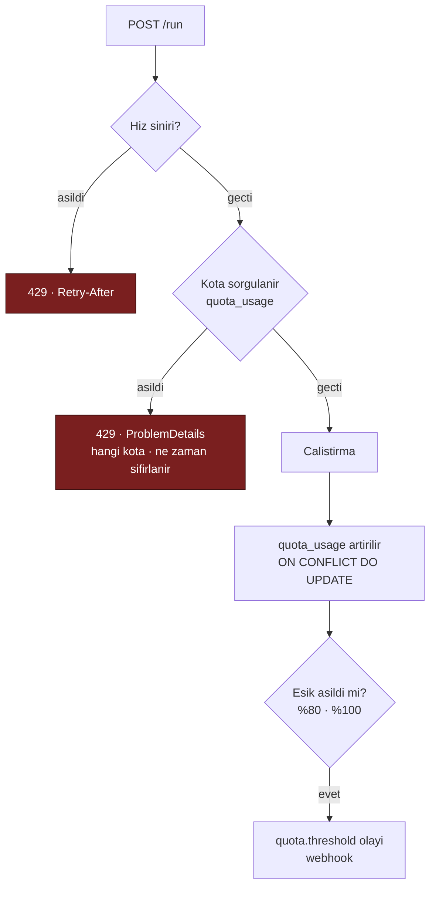

# Faz 21 — Hız Sınırı, Kota ve Olay Yayını

> **Durum:** 📋 Planlandı
> **Kaynak:** [BEYIN-FIRTINASI.md](BEYIN-FIRTINASI.md) · **F-18**, **F-19**
> **Önkoşul:** [Faz 20](20-MALIYET-VE-GOSTERGE-PANELI.md) (para cinsi kota için) · [Faz 17](17-TOPLU-VE-ZAMANLANMIS-CALISTIRMA.md) (webhook teslimi kuyruğu kullanır)
> **Paketler:** `AgentPrism.Abstractions`, `.Core`, `.PostgreSql`, `.AspNetCore`, `.UI`
> **Yeni paket:** Yok (ölçüme bağlı — 21.1) · **Migration:** 0012 (planlanan sırada)

---

## Bu Faza Başlarken

1. [`KARARLAR.md`](KARARLAR.md) — **K-059** (sır veritabanına yazılmaz, anahtar adı yazılır), **K-007** (bağımlılık), **K-010** (erişim katmanları)
2. [`06-GOZLEMLENEBILIRLIK.md`](06-GOZLEMLENEBILIRLIK.md) — kiracı bağlamı, onay akışı
3. [`17-TOPLU-VE-ZAMANLANMIS-CALISTIRMA.md`](17-TOPLU-VE-ZAMANLANMIS-CALISTIRMA.md) — iş kuyruğu, yeniden deneme
4. Bu doküman

---

## Amaç

İki ayrı iş, tek fazda: ikisi de "AgentPrism'i dış dünyayla sözleşmeye bağlar".

- **F-18** — Kiracı ve agent bazında istek/token/maliyet kotası, aşımda `429`
- **F-19** — Çalıştırma tamamlandığında veya onay beklerken dış sisteme bildirim

F-19'un gerekçesi somuttur: Faz 6'nın onay akışı, **kimse arayüze bakmıyorsa**
bekleyen çağrının görülmemesi sorununu üretti. Faz 16 aynı sorunu human-in-the-loop
için tekrarladı.

---

## 21.1 — Hız Sınırı: Önce Ölçüm

`System.Threading.RateLimiting` .NET'te vardır. Uygulamadan önce doğrulayın:

```bash
dotnet list src/AgentPrism.AspNetCore/AgentPrism.AspNetCore.csproj package --include-transitive \
  | grep -i ratelimit
```

- ASP.NET Core paylaşılan çerçevesinden geliyorsa **ek paket yok**
- Gelmiyorsa `System.Threading.RateLimiting` doğrudan bağımlılık olur. Küçük ve
  Microsoft'undur; K-007 açısından kabul edilebilir ama **bilinçli** bir karardır
  ve yazılır

AgentPrism kendi middleware'ini **yazmaz**; `PartitionedRateLimiter` üzerine
ince bir katman kurar. Tüketici zaten `AddRateLimiter()` kullanıyorsa AgentPrism
onunla yarışmaz: AgentPrism'in sınırı **kendi uç grubuna** uygulanır.

---

## 21.2 — Kota Modeli

İki farklı kavram vardır ve karıştırılmamalıdır:

| Kavram | Zaman ölçeği | Amaç | Uygulama |
|--------|--------------|------|----------|
| **Hız sınırı** | Saniye/dakika | Ani yükü düzleştirmek | Bellekte, `PartitionedRateLimiter` |
| **Kota** | Gün/ay | Toplam tüketimi sınırlamak | Veritabanında sayaç |

```sql
CREATE TABLE {schema}.quotas (
    id           uuid        NOT NULL PRIMARY KEY,
    tenant_id    text        NOT NULL,
    agent_name   text,                          -- NULL = kiracinin tumu
    period       smallint    NOT NULL,          -- 0=Daily 1=Monthly
    max_runs     bigint,
    max_tokens   bigint,
    max_cost     numeric(20,10),
    enabled      boolean     NOT NULL DEFAULT true,
    created_at   timestamptz NOT NULL,
    updated_at   timestamptz NOT NULL
);

CREATE UNIQUE INDEX quotas_scope_uq
    ON {schema}.quotas (tenant_id, COALESCE(agent_name, ''), period);

CREATE TABLE {schema}.quota_usage (
    tenant_id    text        NOT NULL,
    agent_name   text        NOT NULL DEFAULT '',   -- '' = kiraci geneli
    period_start date        NOT NULL,
    period       smallint    NOT NULL,
    runs         bigint      NOT NULL DEFAULT 0,
    tokens       bigint      NOT NULL DEFAULT 0,
    cost         numeric(20,10) NOT NULL DEFAULT 0,
    updated_at   timestamptz NOT NULL,
    PRIMARY KEY (tenant_id, agent_name, period, period_start)
);
```

> `COALESCE`'li benzersiz indeks Faz 6'nın `tool_approval_rules` dersidir:
> PostgreSQL'de `NULL`'lar birbirine eşit sayılmaz ve düz `UNIQUE` aynı kuralın
> sınırsız kez eklenmesine izin verir.

### Sayaç güncelleme

`quota_usage` **çalıştırma bittiğinde** `INSERT ... ON CONFLICT DO UPDATE` ile
artırılır. Denetim çalıştırma **başlamadan önce** yapılır:



**Kabul edilen kusur:** kota denetimi çalıştırma **öncesinde** yapılır, tüketim
**sonrasında** yazılır. Eşzamanlı çalıştırmalar kotayı bir miktar aşabilir. Sıkı
garanti, her çalıştırma öncesinde kilit almayı gerektirir ve gecikme ekler.
Bu tercih **dokümante edilir**; "yaklaşık kota" dürüst bir ifadedir, "kesin
kota" olmayan bir şeyi vaat etmek olurdu.

Para cinsi kota, fiyat tanımsızsa uygulanamaz (Faz 20). O durumda kota
**token'a düşer** ve arayüzde uyarı gösterilir.

---

## 21.3 — Webhook / Olay Yayını

### Olaylar

| Olay | Ne zaman |
|------|----------|
| `run.completed` · `run.failed` | Çalıştırma sonu |
| `approval.pending` | Tool onayı bekliyor (Faz 6) |
| `workflow.request.pending` | Human-in-the-loop isteği (Faz 16) |
| `job.completed` · `job.failed` | Toplu/zamanlanmış iş (Faz 17) |
| `eval.completed` | Eval sonucu (Faz 18) |
| `quota.threshold` | %80 / %100 eşiği |

### Model — sır saklamama kuralı

```sql
CREATE TABLE {schema}.webhook_subscriptions (
    id                       uuid        NOT NULL PRIMARY KEY,
    tenant_id                text        NOT NULL,
    name                     text        NOT NULL,
    url                      text        NOT NULL,
    events                   text[]      NOT NULL,
    secret_configuration_key text,        -- ANAHTAR ADI · SIR DEGIL (K-059)
    headers                  jsonb       NOT NULL DEFAULT '{}'::jsonb,
    enabled                  boolean     NOT NULL DEFAULT true,
    created_at               timestamptz NOT NULL,
    updated_at               timestamptz NOT NULL,
    CONSTRAINT webhook_subscriptions_tenant_name_uq UNIQUE (tenant_id, name)
);

CREATE TABLE {schema}.webhook_deliveries (
    id              uuid        NOT NULL PRIMARY KEY,
    subscription_id uuid        NOT NULL REFERENCES {schema}.webhook_subscriptions (id) ON DELETE CASCADE,
    tenant_id       text        NOT NULL,
    event_type      text        NOT NULL,
    payload         text        NOT NULL,
    status          smallint    NOT NULL,      -- 0=Pending 1=Delivered 2=Failed 3=Dropped
    attempt         smallint    NOT NULL DEFAULT 0,
    response_code   integer,
    error           text,
    next_attempt_at timestamptz,
    created_at      timestamptz NOT NULL,
    delivered_at    timestamptz
);

CREATE INDEX IF NOT EXISTS webhook_deliveries_pending_idx
    ON {schema}.webhook_deliveries (next_attempt_at)
    WHERE status IN (0, 2);
```

**K-059 burada birebir uygulanır.** İmzalama sırrı veritabanında **durmaz**;
kayıt yalnız değerin okunacağı yapılandırma anahtarının adını taşar. MCP'de
verilen kararın aynısı; yeni bir tartışma açılmaz.

### İmzalama

```
X-AgentPrism-Event      : run.completed
X-AgentPrism-Delivery   : 019fc1...
X-AgentPrism-Timestamp  : 1785705600
X-AgentPrism-Signature  : sha256=<HMAC-SHA256(timestamp + "." + body, secret)>
```

Zaman damgası imzaya **dâhildir** — yoksa yakalanan bir istek sonsuza kadar
yeniden oynatılabilir. Alıcının tolerans penceresi kontrol etmesi gerektiği
README'de yazılır.

### 🚨 SSRF — bu fazın en büyük güvenlik riski

Webhook URL'sini **kullanıcı** verir ve sunucu o adrese istek atar. Kontrolsüz
bırakılırsa iç ağdaki servislere erişim aracı olur (bulut metadata uçları dâhil).

| Koruma | Kural |
|--------|-------|
| Şema | Yalnız `https`. `http` yalnız `AllowInsecureHttp = true` ile ve loopback'e |
| Adres | DNS çözümlenir; **özel ağ** aralıkları reddedilir: `127.0.0.0/8`, `10/8`, `172.16/12`, `192.168/16`, `169.254/16` (metadata!), `::1`, `fc00::/7` |
| DNS yeniden bağlama | Çözülen IP'ye **doğrudan** bağlanılır; `Host` başlığı korunur. Çözümleme ile bağlantı arasında adres değiştirilemez |
| Yönlendirme | `HttpClientHandler.AllowAutoRedirect = false` — yönlendirme özel ağa kaçış yoludur |
| Zaman aşımı | 10 saniye |
| Yanıt | En çok 8 KB okunur; gerisi atılır |
| Varsayılan | `AllowPrivateNetworkTargets = false` |

### Teslim

Teslim **Faz 17'nin iş kuyruğunu kullanır** — ikinci bir yeniden deneme
mekanizması yazılmaz. Yeniden deneme: 1 dk, 5 dk, 30 dk, 2 sa, 6 sa (5 deneme),
sonra `Failed`. Abonelik üst üste 20 kez başarısız olursa **otomatik devre dışı
bırakılır** ve denetim izine yazılır.

---

## 21.4 — Uçlar ve Arayüz

| Uç | Rol | Ne yapar |
|----|-----|----------|
| `GET/PUT/DELETE {prefix}/api/quotas[/{id}]` | Admin | Kota tanımları |
| `GET {prefix}/api/quotas/usage` | Reader | Geçerli dönem kullanımı |
| `GET/PUT/DELETE {prefix}/api/webhooks[/{name}]` | Admin | Abonelikler (**sır alanı yok**) |
| `POST {prefix}/api/webhooks/{name}/test` | Admin | Test olayı gönderir |
| `GET {prefix}/api/webhooks/{name}/deliveries` | Admin | Teslim geçmişi |

Arayüz: **Settings** ekranına iki bölüm — Kotalar (kullanım çubuğu ile) ve
Webhooks (abonelik listesi, son teslim durumu). Yeni ekran açılmaz.

Bütçe hedefi: **+6 KB gzip'ten az**.

---

## Testler

| Proje | Yeni test |
|-------|-----------|
| `AgentPrism.Core.UnitTests` | Kota denetimi; dönem sınırı hesabı (gün/ay, saat dilimi); eşik olayları; imza üretimi; **SSRF beyaz/kara liste** (özel IP'ler, metadata adresi, yönlendirme reddi) |
| `AgentPrism.PostgreSql.IntegrationTests` | `QuotaStoreContract`; `ON CONFLICT DO UPDATE` eşzamanlı artırma; `COALESCE` benzersizliği; teslim kuyruğu |
| `AgentPrism.AspNetCore.FunctionalTests` | `429` + `Retry-After`; `ProblemDetails` içeriği; webhook uçlarında **sır sızmaması**; rol matrisi |
| `AgentPrism.Ui.E2ETests` | Kota çubuğu; webhook ekleme ve test gönderimi |

**Gerçek kanıt:** düşük bir kota tanımlanır, aşılır ve `429` yanıtı dokümana
yazılır. Bir webhook yerel bir dinleyiciye gönderilir; imza doğrulaması
gösterilir.

---

## Bu Fazda Verilecek Kararlar

1. **Hız sınırı ve kota ayrı mekanizmalardır** — biri bellekte, biri veritabanında.
2. **Kota yaklaşıktır** — eşzamanlılıkta küçük aşım kabul edilir ve yazılır.
3. **Webhook sırrı veritabanında durmaz** (K-059).
4. **SSRF koruması varsayılan açıktır**; özel ağ hedefleri kapalıdır.
5. **Teslim Faz 17'nin kuyruğunu kullanır** — ikinci bir kuyruk yazılmaz.
6. **İmza zaman damgasını içerir** — yeniden oynatmaya karşı.

---

## Açık Sorular

1. **Kota aşımında devam eden çalıştırma kesilsin mi?** Kesmek yarım yanıt
   üretir. Öneri: **kesilmez**, yeni çalıştırma başlamaz.
2. **Hız sınırı varsayılan değeri olsun mu?** Varsayılan sınır, mevcut
   kurulumları beklenmedik `429` ile karşılaştırabilir. Öneri: **varsayılan
   yok** (`Enabled = false`), README'de önerilen değerler.
3. **Webhook yükünde tam çalıştırma içeriği olsun mu?** Mesaj içerikleri
   hassastır. Öneri: **özet** (kimlik, durum, token, maliyet, agent); içerik
   isteyen `/api/runs/{id}` çağırır.
4. **`AllowInsecureHttp` olsun mu?** Yerel geliştirmede gerekir. Öneri:
   **evet**, ama yalnız loopback hedefleri için.

---

## Bitiş Ölçütleri (DoD)

- [ ] Kiracı kotası aşıldığında `429` ve anlaşılır `ProblemDetails` dönüyor
- [ ] Kullanım sayaçları doğru artıyor; dönem sınırında sıfırlanıyor
- [ ] Hız sınırı yapılandırıldığında çalışıyor, kapalıyken davranış değişmiyor
- [ ] Webhook gerçek bir uca teslim ediliyor; imza doğrulanabiliyor
- [ ] Başarısız teslim yeniden deneniyor; 20 hatadan sonra abonelik kapanıyor
- [ ] Özel ağ adresine webhook **gönderilemiyor** (test)
- [ ] Webhook yanıtında ve kaydında **hiçbir sır yok**
- [ ] Dört doğrulama kapısı sıfır uyarı; sır taraması boş

---

## Riskler

| Risk | Önlem |
|------|-------|
| **SSRF** | Şema + IP aralığı + yönlendirme + zaman aşımı kontrolleri; varsayılan kapalı |
| Kota aşımı yanlış hesaplanır | Sözleşme testleri; "yaklaşık" olduğu yazılır |
| Webhook teslimi ana yolu yavaşlatır | Teslim kuyruğa yazılır, istek içinde gönderilmez |
| Yeni paket bağımlılığı | Önce ölçüm (21.1) |
| Kota kullanıcıyı beklenmedik biçimde durdurur | Varsayılan kota yok; %80 eşiğinde uyarı olayı |

---

## Sonraki Faza Devir Notu

- Faz 25 (saklama) `webhook_deliveries` ve `quota_usage` tablolarını
  temizlemekle yükümlüdür; teslim kayıtları hızla büyür.
- Faz 16'nın human-in-the-loop isteği için `workflow.request.pending` olayı bu
  fazda tanımlandı; Faz 16 daha önce yapıldıysa olay oradan yayılır.
